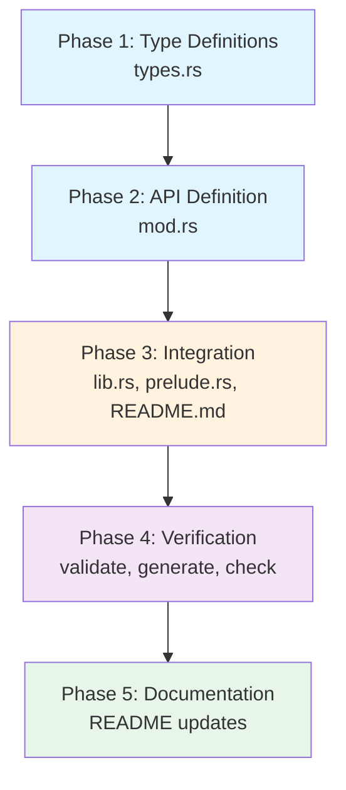

# Planning Process

- [x] Pre-flight Check [10:23:15]
    - [x] Catalogs validated
    - [x] Directories ready
    - [x] Budget estimated: medium (~40%)
- [x] Prep Started [10:23:31]
    - [x] Identified Skills: schematic, schematic-define, rust, rust-testing
    - [x] Identified Subagents: Plan
- [x] Prep complete [10:24:12]
- [x] Clarify & Research [10:24:12]
    - [x] Requirements clear from bitbucket-api.md
    - [x] No user questions needed
    - [x] Requirements documented
- [x] Planning Subagent [agent: **Plan**] started [10:24:12]
    - [x] subagent skills used: schematic, schematic-define, rust, rust-testing
    - [x] Planning completed [10:25:30]
- [x] Module Assessment (monorepo) [10:25:30]
    - [x] Modules: schematic/definitions, schematic/schema
- [x] All Pre-review Steps complete [10:25:45]
- [x] Reviews Started [10:25:45]
   - [x] Correctness Review - 3 critical, 3 medium issues found
   - [x] Risk Assessment - 1 medium, 4 low risks identified
- [x] Reviews Completed [10:27:22]
- [x] Plan Finalization started [10:27:22]
    - [x] Review feedback incorporated
    - [x] Dependency graph generated
- [x] Plan finalized [10:27:45]
- [x] Final Steps
    - [x] Lessons learned collected: 2
    - [x] Package research: None needed
- [x] Summary reported [10:28:00]

## Requirements

### Source Document Analysis

The `sniff/docs/bitbucket-api.md` document contains:

**API Overview:**
- Base URL: `https://api.bitbucket.org/2.0`
- Authentication: App Passwords, OAuth 2.0, Access Tokens, Basic Auth
- Cursor-based pagination (not page-based)
- Bitbucket Cloud REST API v2.0

**Documented Endpoint Categories:**
1. **Repositories** (10 endpoints)
   - List, Get, Create, Update, Delete repos
   - Forks, Commits, Source content
2. **Pull Requests** (13 endpoints)
   - List, Create, Get, Update PRs
   - Approve/Unapprove, Merge, Decline
   - Diff, Commits, Comments, Statuses
3. **Issue Tracker** (7 endpoints)
   - List, Create, Get, Update, Delete issues
   - Issue comments, Change history
4. **Branches and Tags** (9 endpoints)
   - List/Create/Get/Delete branches
   - List/Create/Get/Delete tags
5. **Workspaces and Projects** (7 endpoints)
6. **Pipelines** (6 endpoints)
7. **Webhooks** (5 endpoints)
8. **Downloads** (4 endpoints) - used for releases

**Key Differences from GitHub:**
- Scopes are NOT hierarchical (write doesn't imply read)
- Tags + Downloads = "Releases" (no first-class release concept)
- Cursor-based pagination with `next` URL field
- Uses UUID vs username for lookups

**Use Cases from Document:**
1. Find README.md files and get content
2. List PRs with metadata
3. List Issues with metadata
4. List Tags distinguishing releases (tags with downloads)

### Implementation Scope

Based on the documented use cases and comparison with GitHub API definition:

**Phase 1: Core Definition (~14-16 endpoints)**
- Focus on the 4 documented use cases
- Match GitHub API's pattern for consistency

**Files to Create:**
- `schematic/definitions/src/bitbucket/mod.rs`
- `schematic/definitions/src/bitbucket/types.rs`

**Files to Update:**
- `schematic/definitions/src/lib.rs` (add module + re-export)
- `schematic/definitions/src/prelude.rs` (add to prelude)
- `schematic/justfile` (no changes needed - uses `--api all`)
- `schematic/definitions/README.md`
- `schematic/README.md`

## Plan

### Phase 1: Type Definitions
**Agent:** `feature-tester-rust` | **Skills:** schematic, rust, rust-testing | **Complexity:** Medium
**Deps:** None | **Parallel:** No

**Goal:** Create comprehensive response types in `types.rs` following GitHub/GitLab patterns.

**Deliver:**
- `schematic/definitions/src/bitbucket/types.rs` with:
  - Common types: User, Link, PaginatedResponse<T>
  - Repository types: Repository
  - Source types: SourceEntry (directory/file listing)
  - PR types: PullRequest, PullRequestComment, Participant, BranchRef, Reviewer
  - Issue types: Issue, IssueComment, Content, IssueChange, ChangeDetail
  - Tag types: Tag, TagTarget, Tagger
  - Download types: Download (for release artifacts)
- Unit tests for each major type (deserialization)

**Pass when:**
- [ ] All types compile without warnings
- [ ] Deserialization tests pass for each type
- [ ] Types use `Option<_>` for optional/evolving fields
- [ ] Types include `next: Option<String>` for paginated responses

**If failed:**
- Rollback: Delete `types.rs`
- Retry: Check GitHub/GitLab types.rs for correct patterns

---

### Phase 2: API Definition
**Agent:** `general-purpose` | **Skills:** schematic, schematic-define, rust | **Complexity:** Medium
**Deps:** Phase 1 | **Parallel:** No

**Goal:** Create `define_bitbucket_api()` function with 14 endpoints.

**Deliver:**
- `schematic/definitions/src/bitbucket/mod.rs` with:
  - API configuration: Basic Auth, env vars, headers
  - 14 endpoints covering: repos, PRs, issues, tags, downloads
  - Module documentation with endpoint table

**Endpoints (14 total):**
| ID | Method | Path | Response | Notes |
|----|--------|------|----------|-------|
| GetRepository | GET | /repositories/{workspace}/{repo_slug} | `json_type("Repository")` | |
| ListDirectoryContents | GET | /repositories/{workspace}/{repo_slug}/src/{commit}/{path}?pagelen=50 | `json_vec_type("SourceEntry")` | |
| GetFileContentRaw | GET | /repositories/{workspace}/{repo_slug}/src/{commit}/{path} | `ApiResponse::Text` | **Accept: text/plain** |
| ListPullRequests | GET | /repositories/{workspace}/{repo_slug}/pullrequests?state=all&pagelen=50 | `json_vec_type("PullRequest")` | |
| GetPullRequest | GET | /repositories/{workspace}/{repo_slug}/pullrequests/{id} | `json_type("PullRequest")` | |
| ListPullRequestComments | GET | /repositories/{workspace}/{repo_slug}/pullrequests/{id}/comments?pagelen=50 | `json_vec_type("PullRequestComment")` | |
| ListIssues | GET | /repositories/{workspace}/{repo_slug}/issues?pagelen=50 | `json_vec_type("Issue")` | |
| GetIssue | GET | /repositories/{workspace}/{repo_slug}/issues/{id} | `json_type("Issue")` | |
| ListIssueComments | GET | /repositories/{workspace}/{repo_slug}/issues/{id}/comments?pagelen=50 | `json_vec_type("IssueComment")` | |
| ListIssueChanges | GET | /repositories/{workspace}/{repo_slug}/issues/{id}/changes?pagelen=50 | `json_vec_type("IssueChange")` | |
| ListTags | GET | /repositories/{workspace}/{repo_slug}/refs/tags?pagelen=50 | `json_vec_type("Tag")` | |
| GetTag | GET | /repositories/{workspace}/{repo_slug}/refs/tags/{name} | `json_type("Tag")` | |
| ListDownloads | GET | /repositories/{workspace}/{repo_slug}/downloads?pagelen=50 | `json_vec_type("Download")` | |
| GetDownload | GET | /repositories/{workspace}/{repo_slug}/downloads/{filename} | `ApiResponse::Binary` | |

**Pass when:**
- [ ] `define_bitbucket_api()` returns valid `RestApi`
- [ ] All 14 endpoints are present
- [ ] Auth strategy is `AuthStrategy::Basic`
- [ ] Unit tests for API metadata pass

**If failed:**
- Rollback: Delete `mod.rs`
- Retry: Reference EMQX for Basic Auth pattern

---

### Phase 3: Integration
**Agent:** `general-purpose` | **Skills:** schematic, rust | **Complexity:** Low
**Deps:** Phase 2 | **Parallel:** No

**Goal:** Wire Bitbucket module into schematic ecosystem and update documentation.

**Deliver:**
- Updated `schematic/definitions/src/lib.rs`:
  - Add `pub mod bitbucket;`
  - Add `pub use bitbucket::define_bitbucket_api;`
  - Update module docstring
- Updated `schematic/definitions/src/prelude.rs`:
  - Add re-exports for bitbucket types
- Updated `schematic/gen/src/main.rs`:
  - Add to imports
  - Update `resolve_api()` and `resolve_all_apis()`
- Updated `schematic/definitions/README.md`:
  - Add Bitbucket to API table
  - Add Bitbucket section with auth and endpoints

**Pass when:**
- [ ] `cargo test -p schematic-definitions` passes
- [ ] `cargo build -p schematic-gen` passes
- [ ] Bitbucket appears in README table

**If failed:**
- Rollback: Revert changes to lib.rs, prelude.rs, main.rs
- Retry: Check other API integration patterns

---

### Phase 4: Verification
**Agent:** `Bash` | **Skills:** schematic | **Complexity:** Low
**Deps:** Phase 3 | **Parallel:** No

**Goal:** Verify generated code compiles and is correct.

**Deliver:**
- Successful code generation
- Compiled schema package
- Verification report

**Commands:**
```bash
# 1. Validate definition
cargo run -p schematic-gen -- validate --api bitbucket

# 2. Generate code
just -f schematic/justfile generate

# 3. Verify compilation
cargo check -p schematic-schema

# 4. Verify response methods
grep -n "request_bytes\|request_text" schematic/schema/src/bitbucket.rs
```

**Pass when:**
- [ ] Validation passes
- [ ] Generation completes without errors
- [ ] `cargo check -p schematic-schema` passes
- [ ] GetDownload uses `request_bytes()`
- [ ] GetFileContentRaw uses `request_text()`

**If failed:**
- Rollback: Fix issues in mod.rs/types.rs
- Retry: Check response type configuration

---

### Phase 5: Documentation Update
**Agent:** `general-purpose` | **Skills:** rust | **Complexity:** Low
**Deps:** Phase 4 | **Parallel:** No

**Goal:** Update all schematic README files.

**Deliver:**
- Updated `schematic/README.md` (if it lists available APIs)
- Updated `schematic/definitions/README.md` with full Bitbucket section

**Documentation to add:**
- Authentication section (Basic Auth with App Password)
- Environment variables (BITBUCKET_USERNAME, BITBUCKET_APP_PASSWORD)
- Pagination pattern (cursor-based, follow `next`)
- Key differences from GitHub
- Endpoint table

**Pass when:**
- [ ] README files are consistent
- [ ] Authentication is clearly documented
- [ ] All 14 endpoints are documented

## Dependency Graph



**Critical Path:** P1 → P2 → P3 → P4 → P5 (sequential, no parallelization possible)

## Risks

> Implementation risks identified during planning with mitigation strategies.

| Level | Category | Description | Affected | Mitigation |
|-------|----------|-------------|----------|------------|
| MEDIUM | technical | Same path `/src/{commit}/{path}` for directory listing vs raw content requires endpoint-level Accept header override | Phase 2 | Use `headers: vec![("Accept", "text/plain")]` on GetFileContentRaw. GitHub's GetRepositoryContentRaw proves pattern works. |
| LOW | scope | Pagination not auto-handled - users must follow `next` URLs manually | Phase 1,5 | By design. Document clearly in README with Rust example. |
| LOW | dependency | Basic Auth has fewer real-world tests than Bearer token | Phase 2,4 | EMQX validates Basic Auth generation. Manual smoke test if possible. |
| LOW | scope | 14 endpoints (V1) vs 61 total documented | Phase 2,5 | Intentional scope. Document excluded categories in README. |
| LOW | rollback | Generated code needs manual cleanup | Phase 4 | Document: `rm schematic/schema/src/bitbucket.rs` |

## Lessons Learned

> Discoveries about skills or memory resources that were inaccurate, incomplete, or missing.

- [RESOURCE: sniff/docs/bitbucket-api.md]: Line 330 has incorrect Basic Auth example - uses `workspace` as username instead of actual Bitbucket account username
- [SKILL: schematic-define]: Endpoint-level `headers` field overrides API-level headers (case-insensitive) - proven by GitHub's GetRepositoryContentRaw pattern

## Package Changes

> Dependencies to be added, updated, or removed during implementation.

- No new dependencies expected (using existing schematic-define primitives)
