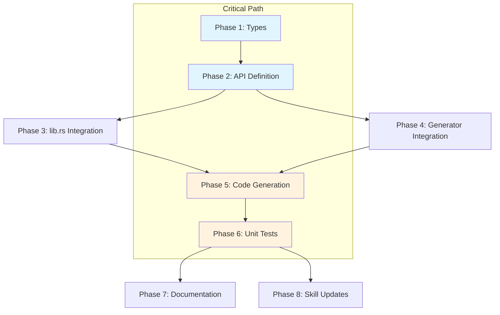

# Planning Process

- [x] Pre-flight Check [12:46 PM]
    - [x] Catalogs validated
    - [x] Directories ready
    - [x] Budget estimated: medium (~40%)
- [x] Prep Started [12:46 PM]
    - [x] Identified Skills: schematic-define, schematic, rust, serde + rust-testing
    - [x] Identified Subagents: implementation, feature-tester, documentation, skills
- [x] Prep complete with ~88% context available [12:48 PM]
- [x] Clarify & Research [12:49 PM]
    - [x] Clarification agent returned (4 questions, all with sensible defaults)
    - [x] User questions skipped - requirements clear from task description
    - [x] Requirements confirmed:
        - Auth: ApiKey { header: "Authorization" } with documented "token " prefix
        - Base URL: Placeholder https://gitea.example.com/api/v1
        - Env vars: GITEA_TOKEN only
        - Endpoints: ~14 matching GitHub pattern
- [x] Planning Subagent [agent: **Plan**] started [12:49 PM]
    - [x] subagent skills used: schematic-define, schematic, rust, serde
    - [x] Planning completed [12:51 PM] - 8 phases defined
- [x] Module Assessment: schematic/definitions, schematic/gen, schematic/schema impacted
- [x] All Pre-review Steps complete [12:51 PM]
- [x] Reviews Started [12:52 PM]
   - [x] Completeness Review: Missing explicit template reference, justfile OK (uses --api all)
   - [x] Concurrency Review: Phase 3&4 can run parallel (critical path 8→6)
   - [x] Correctness Review: Auth prefix, pagination (limit not per_page), type=issues
   - [x] Risk Assessment: 2 HIGH (auth prefix, GetTagReference), 3 MEDIUM
- [x] Reviews Completed [12:54 PM]
- [x] Plan Finalization started [12:55 PM]
    - [x] Review feedback incorporated (concurrency, correctness fixes)
    - [x] Dependency graph generated
- [x] Plan finalized [12:56 PM]
- [x] Final Steps
    - [x] Lessons learned collected (5 items)
    - [x] No new packages needed (using existing schematic-define primitives)
- [x] Summary reported [12:56 PM]

## Plan

### Phase 1: Create Gitea Type Definitions
**Agent:** `main` | **Skills:** rust, serde, schematic-define | **Complexity:** Medium
**Deps:** None | **Parallel:** No

**Goal:** Create `schematic/definitions/src/gitea/types.rs` with ~25 response types mirroring GitHub structure.

**Deliver:**
- `types.rs` with: UserSummary, RepositoryInfo, GitTreeResponse/Entry, PullRequestSummary/File, IssueSummary/Comment/TimelineEvent, RepoTag, Release, GitRef, AnnotatedTagObject

**Pass when:**
- [ ] All types compile with `cargo check -p schematic-definitions`
- [ ] All types derive Debug, Clone, Serialize, Deserialize
- [ ] Doc comments on all public types

---

### Phase 2: Create Gitea API Definition
**Agent:** `main` | **Skills:** schematic-define, schematic, rust | **Complexity:** Medium
**Deps:** Phase 1 | **Parallel:** No

**Goal:** Create `schematic/definitions/src/gitea/mod.rs` with `define_gitea_api()` returning 14 endpoints.

**Deliver:**
- 14 endpoints: GetRepository, GetGitTree, GetGitTreeRecursive, GetRepositoryContentRaw, ListPullRequests, ListPullRequestFiles, ListIssues, GetIssue, ListIssueComments, ListIssueTimeline, ListTags, ListReleases, GetTagReference, GetAnnotatedTag
- Auth: `ApiKey { header: "Authorization" }` with `GITEA_TOKEN` env var
- Base URL: `https://gitea.example.com/api/v1` (placeholder)

**Pass when:**
- [ ] `define_gitea_api()` returns valid RestApi
- [ ] All 14 endpoints defined with correct response types
- [ ] `GetRepositoryContentRaw` uses `ApiResponse::Text`
- [ ] `GetTagReference` returns `Vec<GitRef>` (Gitea returns array)

---

### Phase 3: Integration with lib.rs and prelude.rs
**Agent:** `main` | **Skills:** rust, schematic | **Complexity:** Low
**Deps:** Phase 2 | **Parallel:** Yes (with Phase 4)

**Goal:** Add `pub mod gitea;` to lib.rs, update prelude.rs with key types.

**Deliver:**
- lib.rs: `pub mod gitea;` and `pub use gitea::define_gitea_api;`
- prelude.rs: Export key Gitea types
- Update module docstring to list Gitea

**Pass when:**
- [ ] `use schematic_definitions::gitea::define_gitea_api;` compiles
- [ ] Doc tests pass

---

### Phase 4: Generator Integration
**Agent:** `main` | **Skills:** schematic, rust | **Complexity:** Low
**Deps:** Phase 2 | **Parallel:** Yes (with Phase 3)

**Goal:** Add Gitea to schematic-gen CLI.

**Deliver:**
- Import `define_gitea_api` in gen/main.rs
- Add to AVAILABLE_APIS, resolve_api(), resolve_all_apis(), api_names

**Pass when:**
- [ ] `schematic-gen validate --api gitea` passes
- [ ] `schematic-gen generate --api all --dry-run` includes Gitea

---

### Phase 5: Code Generation and Verification
**Agent:** `feature-tester-rust` | **Skills:** schematic, rust-testing | **Complexity:** Medium
**Deps:** Phase 3 AND Phase 4 | **Parallel:** No

**Goal:** Run full generation and verify compilation.

**Deliver:**
- Run `just generate` from schematic directory
- Verify `schematic/schema/src/gitea.rs` exists and compiles

**Pass when:**
- [ ] `cargo check -p schematic-schema` succeeds
- [ ] `GetRepositoryContentRaw` generates `request_text()` method
- [ ] No naming collisions

---

### Phase 6: Unit Tests
**Agent:** `main` | **Skills:** rust-testing, schematic | **Complexity:** Medium
**Deps:** Phase 5 | **Parallel:** No

**Goal:** Add unit tests for API definition and types.

**Deliver:**
- Tests in mod.rs: metadata, auth, endpoints, response types
- Tests in types.rs: deserialization tests for each major type

**Pass when:**
- [ ] All tests pass: `cargo test -p schematic-definitions gitea`

---

### Phase 7: Documentation Updates
**Agent:** `general-purpose` | **Skills:** documentation | **Complexity:** Low
**Deps:** Phase 6 | **Parallel:** Yes (with Phase 8)

**Goal:** Update schematic READMEs with Gitea documentation.

**Deliver:**
- definitions/README.md: Add Gitea section
- Document auth header format (`token <pat>` prefix requirement)

**Pass when:**
- [ ] README documents all 14 endpoints
- [ ] Auth format clearly documented

---

### Phase 8: Skill File Updates
**Agent:** `general-purpose` | **Skills:** documentation | **Complexity:** Low
**Deps:** Phase 6 | **Parallel:** Yes (with Phase 7)

**Goal:** Update schematic skill with Gitea patterns.

**Deliver:**
- Add Gitea to API list in skill
- Document ApiKey auth pattern for Gitea

**Pass when:**
- [ ] Skill accurately describes Gitea API

## Dependency Graph

**Critical Path:** P1 → P2 → (P3∥P4) → P5 → P6 → (P7∥P8)
**Estimated Duration:** 6 sequential phases (2 parallel pairs)

## Risks

> Implementation risks identified during planning with mitigation strategies.

| Level | Category | Description | Affected | Mitigation |
|-------|----------|-------------|----------|------------|
| MEDIUM | technical | Auth header format: Gitea uses `Authorization: token <pat>` not Bearer | Phase 2 | Use ApiKey strategy, document that users set `GITEA_TOKEN=token <pat>` with prefix |
| MEDIUM | technical | API version differences across Gitea instances | Phase 1-2 | Use liberal `Option<_>` fields, target v1.25.4 spec |
| LOW | technical | Instance URL variability | Phase 2 | Use placeholder URL, document configuration requirement |
| LOW | technical | Type naming collision with GitHub | Phase 1 | Types in separate modules, no conflict expected |

## Lessons Learned

> Discoveries about skills or memory resources that were inaccurate, incomplete, or missing.

- [RESEARCH: gitea-api.md]: Auth uses `Authorization: token <pat>` (with 'token' prefix) - differs from standard Bearer pattern
- [RESEARCH: gitea-api.md]: Pagination uses `limit` parameter (default 50), not `per_page` like GitHub
- [RESEARCH: gitea-api.md]: Raw content endpoint is `/raw/{filepath}` not `/contents/{path}` with Accept header
- [RESEARCH: gitea-api.md]: `/git/refs/{ref}` returns an array, not single object
- [SKILL: schematic-define]: ApiKey auth doesn't support automatic prefix injection - must document user responsibility

## Package Changes

> Dependencies to be added, updated, or removed during implementation.

- (none expected - using existing schematic-define primitives)
