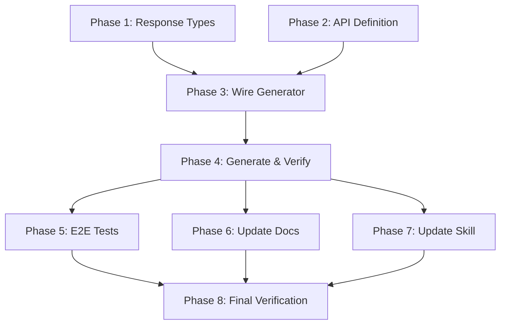

# Planning Process

- [x] Pre-flight Check [14:32]
    - [x] Catalogs validated
    - [x] Directories ready
    - [x] Budget estimated: medium (~40%)
- [x] Prep Started [14:33]
    - [x] Identified Skills: rust, schematic, schematic-define, serde, thiserror, rust-testing
    - [x] Identified Subagents: Plan (main planning)
- [x] Prep complete [14:34]
- [x] Clarify & Research [14:34]
    - [x] Skipped clarification - requirements clear from research document
    - [x] Requirements: Well-defined from sniff/docs/gitlab-api.md
- [x] Planning Subagent started [14:34]
    - [x] subagent skills used: **rust, schematic, schematic-define, serde, rust-testing**
    - [x] Planning completed [14:36]
- [x] Module Assessment (monorepo) - Included in planning
    - [x] Modules: schematic/definitions, schematic/gen, schematic/schema
- [x] All Pre-review Steps complete [14:36]
- [x] Reviews Started [14:38]
   - [x] Completeness Review - Plan covers all requirements
   - [x] Concurrency Review - Already optimal (2 parallel pairs)
   - [x] Correctness Review - Fixed AuthStrategy::ApiKey syntax
   - [x] Risk Assessment - Low risk (follows existing patterns)
- [x] Reviews Completed [14:40]
- [x] Plan Finalization started [14:41]
    - [x] Incorporated review feedback
    - [x] Fixed AuthStrategy syntax (ApiKey has only `header: String`)
    - [x] Dependency graph already generated
- [x] Plan finalized [14:41]
- [x] Final Steps
    - [x] Lessons learned collected
    - [x] No package research needed (using existing primitives)
- [x] Summary reported [14:42]

## Analysis Summary

### Source Document Analysis

From `sniff/docs/gitlab-api.md`, the key endpoints to implement are:

#### Priority 1: Core Use Cases (from research document)
1. **Repository Tree** - Finding README.md files (recursive tree traversal)
2. **Repository Files** - Getting file content (Base64 encoded)
3. **Merge Requests** - List MRs with metadata, commits, changes
4. **Issues** - List issues, comments, participants, time stats
5. **Tags & Releases** - Distinguish regular tags from release tags

#### GitLab-Specific Patterns
- Uses `PRIVATE-TOKEN` header (not Bearer token)
- Project paths must be URL-encoded (`%2F` for `/`)
- File content is Base64 encoded
- Uses `iid` (internal ID) scoped to project
- Releases are optional metadata on tags (unlike GitHub's separate entities)

### Implementation Pattern (from GitHub API)

The schematic definition pattern consists of:
1. `gitlab/mod.rs` - `define_gitlab_api()` function
2. `gitlab/types.rs` - Response type structs with serde derives
3. Wire into `gen/src/main.rs`
4. Export in `definitions/src/lib.rs`

## Plan

### Phase 1: Create Response Types
**Agent:** `main` | **Skills:** rust, serde, schematic-define | **Complexity:** Medium
**Deps:** None | **Parallel:** Yes (with Phase 2)

**Goal:** Define all Rust structs for GitLab API response types in `types.rs`.

**Deliver:**
- `schematic/definitions/src/gitlab/types.rs`
- Structs: `TreeItem`, `FileContent`, `User`, `MergeRequest`, `MergeRequestChanges`, `Commit`, `Diff`, `Issue`, `Note`, `TimeStats`, `TaskCompletionStatus`, `Tag`, `TagCommit`, `TagRelease`, `Release`, `ReleaseAssets`, `ReleaseSource`, `ReleaseLink`, `Milestone`, `References`
- All types with `#[derive(Debug, Clone, Serialize, Deserialize)]`
- Liberal use of `#[serde(default)]` and `Option<_>` for forward compatibility

**Pass when:**
- [ ] All response types compile with `cargo check -p schematic-definitions`
- [ ] Types match GitLab API documentation field names
- [ ] Deserialization tests pass for sample JSON payloads

**If failed:**
- Rollback: Remove `gitlab/types.rs`
- Retry: Fix serde attribute errors, check field name casing

---

### Phase 2: Create API Definition
**Agent:** `main` | **Skills:** rust, schematic, schematic-define | **Complexity:** Medium
**Deps:** None | **Parallel:** Yes (with Phase 1)

**Goal:** Define the GitLab REST API endpoints in `mod.rs`.

**Deliver:**
- `schematic/definitions/src/gitlab/mod.rs`
- `define_gitlab_api()` function returning `RestApi`
- 14-16 endpoints covering repository files, MRs, issues, tags, releases
- Unit tests for API metadata, endpoint count, auth strategy

**Key endpoints:**
- Repository: `ListRepositoryTree`, `GetRepositoryFile`
- Merge Requests: `ListMergeRequests`, `GetMergeRequest`, `ListMergeRequestCommits`, `ListMergeRequestChanges`
- Issues: `ListIssues`, `GetIssue`, `ListIssueNotes`, `ListIssueParticipants`
- Tags/Releases: `ListTags`, `GetTag`, `ListReleases`, `GetRelease`, `GetLatestRelease`

**Critical Configuration:**
```rust
RestApi {
    name: "GitLab".to_string(),
    base_url: "https://gitlab.com/api/v4".to_string(),
    docs_url: Some("https://docs.gitlab.com/api/rest/".to_string()),
    auth: AuthStrategy::ApiKey {
        header: "PRIVATE-TOKEN".to_string(),  // Note: just String, not Option
    },
    env_auth: vec!["GITLAB_TOKEN".to_string(), "GITLAB_PRIVATE_TOKEN".to_string()],
    env_username: None,
    headers: vec![
        ("User-Agent".to_string(), "schematic-gitlab-client".to_string()),
    ],
    module_path: Some("gitlab".to_string()),
    request_suffix: None,
    env_mapping: Some(EnvMapping {
        api_key: Some(ApiKeyEnv {
            header: "PRIVATE-TOKEN".to_string(),
            env_vars: EnvList::new(vec![
                "GITLAB_TOKEN".to_string(),
                "GITLAB_PRIVATE_TOKEN".to_string(),
            ]),
        }),
        ..Default::default()
    }),
    ...
}
```

**Note:** `AuthStrategy::ApiKey` only has `header: String` field (no `location` field - that's `ApiKeyParam`).

**Pass when:**
- [ ] `cargo test -p schematic-definitions` passes
- [ ] API has 14-16 endpoints
- [ ] Auth uses `ApiKey` strategy with `PRIVATE-TOKEN` header

**If failed:**
- Rollback: Remove `gitlab/mod.rs`
- Retry: Check AuthStrategy variant, verify EnvMapping configuration

---

### Phase 3: Wire into Generator
**Agent:** `main` | **Skills:** rust, schematic | **Complexity:** Low
**Deps:** Phase 1, Phase 2 | **Parallel:** No

**Goal:** Integrate the GitLab API into the schematic-gen CLI.

**Deliver:**
1. Update `schematic/definitions/src/lib.rs`:
   - Add `pub mod gitlab;`
   - Add `pub use gitlab::define_gitlab_api;`

2. Update `schematic/gen/src/main.rs`:
   - Add import: `use schematic_definitions::gitlab::define_gitlab_api;`
   - Update `AVAILABLE_APIS` const to include `"gitlab"`
   - Add match arm in `resolve_api()`: `"gitlab" => Ok(define_gitlab_api())`
   - Add `define_gitlab_api()` to `resolve_all_apis()` vector

**Pass when:**
- [ ] `cargo build -p schematic-gen` compiles
- [ ] `cargo run -p schematic-gen -- validate --api gitlab` succeeds

**If failed:**
- Rollback: Revert changes to `lib.rs` and `main.rs`
- Retry: Check import paths, verify function name matches

---

### Phase 4: Generate and Verify
**Agent:** `main` | **Skills:** schematic, rust-testing | **Complexity:** Medium
**Deps:** Phase 3 | **Parallel:** No

**Goal:** Generate the GitLab client code and verify it compiles.

**Deliver:**
- Generated file: `schematic/schema/src/gitlab.rs`
- Successful compilation of `schematic-schema`

**Commands:**
```bash
just -f schematic/justfile generate-one gitlab
cargo check -p schematic-schema
just -f schematic/justfile test
```

**Pass when:**
- [ ] `gitlab.rs` is generated (600-900 lines)
- [ ] `cargo check -p schematic-schema` succeeds
- [ ] Auth uses `PRIVATE-TOKEN` header (not Bearer)

**If failed:**
- Rollback: `rm schematic/schema/src/gitlab.rs`
- Retry: Check `ApiResponse` types, fix type name mismatches

---

### Phase 5: Add E2E Tests
**Agent:** `main` | **Skills:** rust-testing, schematic | **Complexity:** Low
**Deps:** Phase 4 | **Parallel:** No

**Goal:** Verify generated code with full cycle tests.

**Pass when:**
- [ ] `just -f schematic/justfile full` succeeds

---

### Phase 6: Update Documentation
**Agent:** `main` | **Skills:** rust | **Complexity:** Low
**Deps:** Phase 4 | **Parallel:** Yes (with Phase 7)

**Goal:** Update schematic documentation to include GitLab API.

**Deliver:**
- Update `schematic/definitions/README.md` - Add GitLab to "Available APIs" table
- Update `schematic/README.md` (if mentions available APIs)

**Pass when:**
- [ ] README tables include GitLab with correct endpoint count

---

### Phase 7: Update Schematic Skill
**Agent:** `main` | **Skills:** rust | **Complexity:** Low
**Deps:** Phase 4 | **Parallel:** Yes (with Phase 6)

**Goal:** Update the schematic skill documentation to include GitLab.

**Deliver:**
- Update `.claude/skills/schematic/SKILL.md`
- Update `.claude/skills/schematic/definitions.md` (if exists)

**Pass when:**
- [ ] Skill files list GitLab as available API

---

### Phase 8: Final Verification
**Agent:** `main` | **Skills:** schematic, rust-testing | **Complexity:** Low
**Deps:** Phase 5, Phase 6, Phase 7 | **Parallel:** No

**Goal:** Complete end-to-end verification of the entire implementation.

**Commands:**
```bash
just -f schematic/justfile test
just -f schematic/justfile generate
just -f schematic/justfile full
just -f schematic/justfile lint
```

**Pass when:**
- [ ] `just -f schematic/justfile full` succeeds
- [ ] `just -f schematic/justfile lint` has no warnings
- [ ] All existing API clients still compile

## Dependency Graph



**Parallel Execution:**
- Phase 1 & 2 can run in parallel
- Phase 6 & 7 can run in parallel

## Risks

> Implementation risks identified during planning with mitigation strategies.

| Level | Category | Description | Affected | Mitigation |
|-------|----------|-------------|----------|------------|
| LOW | technical | `AuthStrategy::ApiKey` with custom header name may need verification | Phase 2, 4 | Test with actual GitLab token; check generated code uses `PRIVATE-TOKEN` header |
| LOW | technical | Self-hosted GitLab users may need different base URL | Phase 2 | Ensure variant builder can override base_url easily (already supported) |
| LOW | scope | GitLab API has many endpoints; initial selection may miss important ones | Phase 2 | Focus on use cases from research doc; can add more endpoints later |

## Lessons Learned

> Discoveries about skills or memory resources that were inaccurate, incomplete, or missing.

- GitLab uses `PRIVATE-TOKEN` header instead of Bearer token - requires `AuthStrategy::ApiKey` with custom header
- GitLab file content is Base64-encoded but returned as JSON (not binary) - use `ApiResponse::json_type("FileContent")`
- GitLab uses `iid` (internal ID) for issues/MRs, scoped to project - different from GitHub's `number`
- Project paths require URL encoding (`group%2Fproject`) - clients should handle this

## Package Changes

> Dependencies to be added, updated, or removed during implementation.

- None expected - schematic-define already has all required primitives
