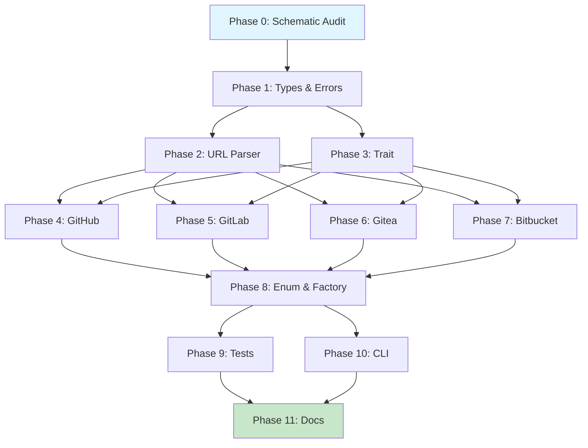

# Planning: Sniff Repo Remotes

- [x] Pre-flight Check [14:32]
    - [x] Catalogs validated (184 skills, 32 agents)
    - [x] Directories ready
    - [x] Budget estimated: complex (~55%)
- [x] Prep Started [14:32]
    - [x] Identified Skills [14:33]: rust, async-trait, tokio, serde, thiserror, clap, schematic, wiremock, sniff, rust-testing
    - [x] Identified Subagents [14:33]: general-purpose, feature-tester-rust, Explore, Bash
- [x] Prep complete [14:33]
- [x] Clarify & Research [14:33]
    - [x] Clarification agent returned [14:34]
    - [x] User answered 3 questions [14:35]
    - [x] Requirements updated [14:35]
    - [ ] Package research (async-trait already in workspace)
- [x] Planning Subagent [agent: **Plan**] started [14:35]
    - [x] subagent skills used: rust, async-trait, tokio, serde, thiserror, clap, schematic, wiremock, sniff, rust-testing, regex
    - [x] Planning completed [14:38] - 11 phases
- [x] Module Assessment (monorepo) - covered in plan (sniff/lib, sniff/cli, schematic-schema)
- [x] All Pre-review Steps complete [14:38]
- [x] Reviews Started [14:39]
   - [x] Completeness Review - 21 issues (4 high, 12 medium, 5 low)
   - [x] Concurrency Review - 8 recs (providers can parallelize, add Phase 0)
   - [x] Correctness Review - 8 issues (async-trait, schematic patterns)
   - [x] Risk Assessment - 11 risks (4 high, 5 medium, 2 low)
- [x] Reviews Completed [14:41]
- [x] Plan Finalization started [14:42]
    - [x] subagent skills used: rust, schematic, sniff, async-trait, clap, thiserror, wiremock
    - [x] Dependency graph generated
- [x] Plan finalized [14:45]
- [x] Final Steps
    - [x] Lessons learned collected (3)
    - [x] Package changes documented (3)
- [x] Summary reported [14:45]
    - Plan: .ai/plans/2026-02-15.plan-for-sniff-repo-remotes.md
    - Phases: 12 (including Phase 0)
    - Critical Path: 7 phases (P0→P1→P3→P4→P8→P9→P11)
    - Parallelization: 33% reduction via P4-P7 parallel

## Summary

Implement remote repository inspection for the sniff library, adding support for querying GitHub, GitLab, Gitea, and Bitbucket APIs. The implementation uses a trait-based provider abstraction (`RemoteRepoProvider`) with normalized output types, leveraging the existing schematic-schema generated API clients.

### Key Deliverables

1. **New `remote` module** in sniff/lib with trait, types, URL parser, and 4 provider implementations
2. **Feature-gated** via `remote` feature (implies `network`)
3. **CLI enhancements** with `--remote` flag on `repo` subcommand and new `Remote` subcommand
4. **Integration tests** using wiremock for all 4 providers

## Plan

### Phase 0: Schematic Endpoint Audit
**Agent:** `general-purpose` | **Skills:** schematic, rust | **Complexity:** Low
**Deps:** None | **Parallel:** No

**Goal:** Verify all required API endpoints exist in schematic-schema BEFORE provider implementation.

**Deliver:**
- Verification checklist of required endpoints per provider (GitHub, GitLab, Gitea, Bitbucket)
- Identification of missing endpoints with priority classification
- Decision document: Add missing endpoints OR defer provider to Stage 2
- Updated schematic-definitions modules (if endpoints added)

**Pass when:**
- [ ] All 4 providers audited against functional requirements
- [ ] GitLab GetProject endpoint verified or mitigation documented
- [ ] Bitbucket pagination strategy documented
- [ ] Decision log created: `sniff/docs/repos/phase0-audit.md`

**If failed:**
- Rollback: N/A (read-only audit phase)
- Defer: If GitLab GetProject missing and complex, defer GitLab to Stage 2

---

### Phase 1: Foundation - Types and Error Handling
**Agent:** `general-purpose` | **Skills:** rust, serde, thiserror | **Complexity:** Low
**Deps:** None | **Parallel:** No

**Goal:** Define normalized output types and extend SniffError with remote-specific variants.

**Deliver:**
- `sniff/lib/src/remote/types.rs` with all normalized types (RepoMetadata, OrgInfo, DocumentRef, PullRequestInfo, IssueInfo, TagsAndReleases, CiCdInfo, OrgRepoRef, KeyUrls, GitProvider enum)
- Extended `SniffError` with: RemoteInit, RemoteApi, UnsupportedProvider, MissingCredentials, RateLimited

**Pass when:**
- [ ] `cargo check -p sniff` succeeds
- [ ] All types derive `Debug, Clone, Serialize, Deserialize`
- [ ] Error variants have clear, actionable error messages

**If failed:**
- Rollback: Remove added files, revert error.rs changes
- Retry: Address compilation errors, re-run check

---

### Phase 2: URL Parser
**Agent:** `general-purpose` | **Skills:** rust, regex | **Complexity:** Medium
**Deps:** Phase 1 | **Parallel:** Yes (with Phase 3)

**Goal:** Parse remote URLs into (provider, owner, repo) tuples.

**Deliver:**
- `sniff/lib/src/remote/url_parser.rs` with `parse_remote_url()` function
- Support HTTPS, SSH, short forms, self-hosted URLs
- Unit tests in module

**Pass when:**
- [ ] `cargo test -p sniff url_parser` passes all tests
- [ ] GitHub, GitLab, Gitea, Bitbucket URLs correctly parsed
- [ ] SSH URLs with `.git` suffix handled

**If failed:**
- Rollback: Remove url_parser.rs
- Retry: Fix regex patterns

---

### Phase 3: RemoteRepoProvider Trait
**Agent:** `general-purpose` | **Skills:** rust, async-trait | **Complexity:** Low
**Deps:** Phase 1 | **Parallel:** Yes (with Phase 2)

**Goal:** Define the async trait that all providers implement.

**Deliver:**
- `sniff/lib/src/remote/provider.rs` with `RemoteRepoProvider` trait (11 async methods)
- Re-export in `remote/mod.rs`

**Pass when:**
- [ ] `cargo check -p sniff` succeeds
- [ ] Trait is object-safe

**If failed:**
- Rollback: Remove provider.rs
- Retry: Fix trait definition

---

### Phase 4: GitHub Provider Implementation
**Agent:** `general-purpose` | **Skills:** rust, schematic, tokio | **Complexity:** High
**Deps:** Phases 1, 2, 3 | **Parallel:** No

**Goal:** Implement RemoteRepoProvider for GitHub using schematic-schema client.

**Deliver:**
- `sniff/lib/src/remote/github.rs` with GitHubRemote struct and full trait impl
- Error mapping from SchematicError to SniffError
- Rate limit detection

**Pass when:**
- [ ] `cargo check -p sniff` succeeds
- [ ] All trait methods implemented
- [ ] Wiremock tests pass

**If failed:**
- Rollback: Remove github.rs
- Retry: Fix schematic client usage

---

### Phase 5: GitLab Provider Implementation
**Agent:** `general-purpose` | **Skills:** rust, schematic | **Complexity:** High
**Deps:** Phase 4 | **Parallel:** No

**Goal:** Implement RemoteRepoProvider for GitLab.

**Deliver:**
- `sniff/lib/src/remote/gitlab.rs` with GitLabRemote
- Base64 decode for file content
- Self-hosted support via with_base_url()

**Pass when:**
- [ ] `cargo check -p sniff` succeeds
- [ ] Wiremock tests pass

**If failed:**
- Rollback: Remove gitlab.rs
- Retry: Fix project ID encoding

---

### Phase 6: Gitea Provider Implementation
**Agent:** `general-purpose` | **Skills:** rust, schematic | **Complexity:** High
**Deps:** Phase 5 | **Parallel:** No

**Goal:** Implement RemoteRepoProvider for Gitea.

**Deliver:**
- `sniff/lib/src/remote/gitea.rs` with GiteaRemote
- Base URL required (no default - self-hosted only)

**Pass when:**
- [ ] `cargo check -p sniff` succeeds
- [ ] Wiremock tests pass

**If failed:**
- Rollback: Remove gitea.rs
- Retry: Verify Gitea-specific API quirks

---

### Phase 7: Bitbucket Provider Implementation
**Agent:** `general-purpose` | **Skills:** rust, schematic | **Complexity:** High
**Deps:** Phase 6 | **Parallel:** No

**Goal:** Implement RemoteRepoProvider for Bitbucket.

**Deliver:**
- `sniff/lib/src/remote/bitbucket.rs` with BitbucketRemote
- Handle PaginatedResponse<T> wrapper (extract .values)

**Pass when:**
- [ ] `cargo check -p sniff` succeeds
- [ ] Wiremock tests pass

**If failed:**
- Rollback: Remove bitbucket.rs
- Retry: Fix pagination handling

---

### Phase 8: GitRemote Enum and Factory
**Agent:** `general-purpose` | **Skills:** rust | **Complexity:** Medium
**Deps:** Phases 4-7 | **Parallel:** No

**Goal:** Create unified entry point for remote repository access.

**Deliver:**
- `sniff/lib/src/remote/mod.rs` with GitRemote enum and from_url() factory
- Feature flag in Cargo.toml: `remote = ["network", "dep:schematic-schema", "dep:schematic-define", "dep:async-trait"]`
- Re-export from lib.rs under `#[cfg(feature = "remote")]`

**Pass when:**
- [ ] `cargo check -p sniff --features remote` succeeds
- [ ] `GitRemote::from_url()` correctly routes to providers
- [ ] Feature gating works

**If failed:**
- Rollback: Revert mod.rs and Cargo.toml changes
- Retry: Fix feature flag configuration

---

### Phase 9: Wiremock Test Infrastructure
**Agent:** `feature-tester-rust` | **Skills:** rust-testing, wiremock | **Complexity:** Medium
**Deps:** Phase 8 | **Parallel:** No

**Goal:** Create comprehensive mock-based test suite.

**Deliver:**
- `sniff/lib/tests/fixtures/remote/` with JSON fixtures for all providers
- `sniff/lib/tests/remote_providers.rs` with wiremock tests
- Error case tests (401, 404, 429)

**Pass when:**
- [ ] `cargo test -p sniff --features remote remote_` passes
- [ ] Each provider has at least 5 endpoint tests
- [ ] Error cases tested

**If failed:**
- Rollback: Remove test files
- Retry: Fix mock setup

---

### Phase 10: CLI Integration
**Agent:** `general-purpose` | **Skills:** rust, clap | **Complexity:** Medium
**Deps:** Phase 8 | **Parallel:** Yes (with Phase 9)

**Goal:** Add remote inspection commands to sniff CLI.

**Deliver:**
- New subcommand: `sniff remote <url>`
- Modified: `sniff repo --remote <name|url>`
- `--provider` and `--base-url` flags
- Output module for remote data

**Pass when:**
- [ ] `sniff remote https://github.com/owner/repo` works
- [ ] `sniff repo --remote origin` works
- [ ] JSON output with `--json` flag works

**If failed:**
- Rollback: Revert CLI changes
- Retry: Fix clap argument parsing

---

### Phase 11: Documentation and Cleanup
**Agent:** `general-purpose` | **Skills:** rust | **Complexity:** Low
**Deps:** Phases 9, 10 | **Parallel:** No

**Goal:** Complete documentation and finalize implementation.

**Deliver:**
- Update sniff/lib/README.md and sniff/cli/README.md
- Add docstrings to all public APIs
- Update skill docs

**Pass when:**
- [ ] `cargo doc -p sniff --features remote` generates clean docs
- [ ] README examples work
- [ ] `sniff --help` shows new commands

**If failed:**
- Rollback: Revert documentation
- Retry: Fix doc issues

## Dependency Graph

**Critical Path:** P0 → P1 → P3 → P4 → P8 → P9 → P11 (7 phases)

**Parallelization (33% faster):**
- Phase 2 || Phase 3 after Phase 1
- Phase 4 || Phase 5 || Phase 6 || Phase 7 after Phase 2+3
- Phase 9 || Phase 10 after Phase 8

## Risks

> Implementation risks identified during planning with mitigation strategies.

| Level | Category | Description | Affected | Mitigation |
|-------|----------|-------------|----------|------------|
| HIGH | dependency | GitLab GetProject endpoint missing from schematic | P5 | Add endpoint to schematic-definitions BEFORE GitLab impl; or defer GitLab to Stage 2 |
| HIGH | technical | Bitbucket pagination needs schematic request_url() method | P7 | Prototype in P1; or use reqwest directly with cloned auth headers |
| HIGH | technical | Auth strategy unclear for caller-provided credentials | P4-P7 | Add optional auth param to constructors using schematic Headers builder |
| HIGH | scope | Gitea base URL resolution underspecified for SSH URLs | P6 | Require explicit --base-url for Gitea in MVP; auto-detect later |
| MEDIUM | technical | Error handling contradicts graceful degradation | P4, P8 | Return RemoteReport with Option fields; CLI displays partial data with warnings |
| MEDIUM | scope | CI/CD endpoints deferred but KeyUrls.ci_cd defined | P1 | KeyUrls.ci_cd returns None when not implemented; document clearly |
| MEDIUM | dependency | async-trait version not pinned | P1 | Use async-trait = "0.1.81" explicitly |
| MEDIUM | technical | Document categorization regex complexity | P1, P2 | Write tests BEFORE impl (TDD); start with .md only |
| MEDIUM | scope | --deep flag integration not covered | P10 | Add to P10: detect --deep, infer origin, fetch remote, merge views |

## Lessons Learned

> Discoveries about skills or memory resources that were inaccurate, incomplete, or missing.

- [SKILL: schematic]: Document that `::new()` returns Self, not Result - no map_err needed on construction
- [SKILL: schematic]: Document that `variant()` returns VariantBuilder requiring `.build()` call
- [SKILL: async-trait]: Should be regular dependency when defining async traits, not feature-gated as `dep:async-trait`
- [PLANNING]: Phase 0 schematic audits prevent downstream implementation blocks - verify endpoints exist BEFORE provider impl

## Package Changes

> Dependencies to be added, updated, or removed during implementation.

- [ADD]: schematic-schema in sniff/lib - Required for API clients (GitHub, GitLab, Gitea, Bitbucket)
- [ADD]: schematic-define in sniff/lib - Required for auth strategy types
- [ADD]: async-trait in sniff/lib - Required for async trait definition
