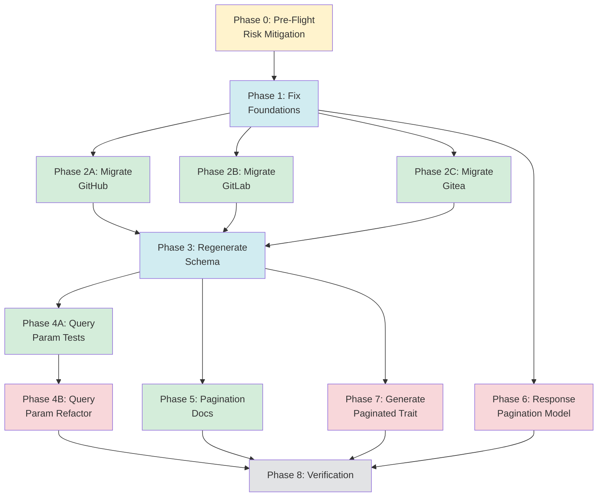

# Planning Process

- [x] Pre-flight Check [10:45:00]
    - [x] Catalogs validated
    - [x] Directories ready
    - [x] Budget estimated: medium (~40%)
- [x] Prep Started [10:45:30]
    - [x] Identified Skills [10:46:00]: rust, schematic (required)
    - [x] Identified Subagents [10:46:30]: Plan, feature-tester-rust (×3), Explore, correctness-reviewer, completeness-reviewer
- [x] Prep complete with ~92% context available [10:46:30]
- [x] Clarify & Research [10:47:00]
    - [x] Requirements already clear from pagination-review.md
    - [x] User answered 1 question: Scope = Priority 1-3 (full implementation) [10:47:30]
    - [x] Requirements updated [10:47:30]
- [x] Planning Subagent [agent: **Plan**] started [10:47:45]
    - [x] subagent skills used: **rust, schematic**
    - [x] Planning completed [10:49:30]: 8 phases + verification
- [x] Module Assessment [10:49:30]
    - [x] Monorepo modules: schematic-define, schematic-definitions, schematic-gen, schematic-schema
- [x] All Pre-review Steps complete [10:49:45]
    - ~20% context used (budget: 40%)
- [x] Reviews Started [10:49:50]
   - [x] Completeness Review: 8 high-priority gaps, all phases need subagent assignments
   - [x] Concurrency Review: Phase 6 can parallel with 4/5, Phase 7 dependency fix
   - [x] Correctness Review: PaginationStyle export OK, to_query_params() needs update
   - [x] Risk Assessment: 3 HIGH risks identified
- [x] Reviews Completed [10:52:00]
    - ~35% context used (budget: 40%)
- [x] Plan Finalization started [10:52:30]
    - [x] subagent skills used: **rust, schematic**
    - [x] Dependency graph generated
- [x] Plan finalized [10:54:30]: 10 phases (added Phase 0 pre-flight, split Phase 4)
- [x] Final Steps
    - [x] Lessons learned collected: 4 items
    - [x] Package research status: No new packages required
- [x] Summary reported [10:55:00]
    - Plan: `.ai/plans/2026-02-16.plan-for-schematic-pagination-improvements.md`
    - Phases: 10 (Phase 0-8, with 4 split into 4A/4B)
    - Duration: ~10 minutes
    - Context: ~40% used (budget: 40%)

## Plan

### Phase 0: Pre-Flight Risk Mitigation
**Agent:** `feature-tester-rust` | **Skills:** rust, schematic | **Complexity:** Low
**Deps:** None | **Parallel:** No

**Goal:** Validate current behavior and identify edge cases before making changes.

**Deliver:**
- Test for endpoints with hardcoded query params in paths
- Grep audit of all `PaginationStyle::Bitbucket` usage
- Document match statement locations for `#[non_exhaustive]` handling

**Pass when:**
- [x] Test added demonstrating path query param detection
- [x] Grep confirms only `params.rs` uses `PaginationStyle::Bitbucket`
- [x] All match statements on `PaginationStyle` documented

**Phase 0 Results:**

1. **Test File Created:** `schematic/gen/tests/query_param_detection.rs` (20 tests)
   - Detection tests for `?` in paths
   - Parsing tests for query param key-value extraction
   - Classification tests for pagination vs filter params
   - Real-world examples from GitHub/GitLab/Gitea

2. **`PaginationStyle::Bitbucket` Usage Audit:**
   - **Definition site:** `schematic/define/src/params.rs` (lines 311, 359, 509)
     - Line 311: Enum variant declaration
     - Line 359: `bitbucket()` factory returning `Self::Bitbucket`
     - Line 509: Match arm in `to_query_params()`
   - **Consumer:** `schematic/definitions/src/bitbucket/mod.rs` (line 61)
     - Uses `PaginationStyle::bitbucket()` factory, NOT the enum variant directly
   - **Generated code:** `schematic/schema/src/bitbucket.rs` (struct `Bitbucket`, not enum variant)
   - **Docs only:** `schematic/docs/pagination-review.md`
   - **Conclusion:** Safe to remove variant; `bitbucket()` factory can return `PageNumber` instead

3. **Match Statements on `PaginationStyle`:**
   - **Only location:** `schematic/define/src/params.rs` line 422 (`to_query_params()`)
   - Match arms: `PageNumber`, `OffsetLimit`, `Cursor`, `Bitbucket`
   - Since `PaginationStyle` is `#[non_exhaustive]`, external match statements must have wildcard arms
   - No external matches found in codebase (only the definition site uses match)

4. **Hardcoded Query Params Found:**
   - **GitHub:** 7 endpoints with `?per_page=100` or `?state=all&...`
   - **GitLab:** 6 endpoints with `?per_page=100` or `?per_page=100&recursive=true`
   - **Gitea:** 5 endpoints with `?limit=50`
   - **Total:** 18 endpoints to migrate in Phase 2A/2B/2C

---

### Phase 1: Fix Foundations
**Agent:** `feature-tester-rust` | **Skills:** rust, schematic | **Complexity:** Medium
**Deps:** Phase 0 | **Parallel:** No

**Goal:** Store `PaginationStyle` on `EndpointParams`, remove Bitbucket variant, add `gitea()` factory.

**Deliver:**
- Add `pagination: Option<PaginationStyle>` field to `EndpointParams`
- Update `EndpointParams::Default` to set `pagination: None`
- Update `with_pagination()` to store style: `self.pagination = Some(style.clone())`
- Remove `PaginationStyle::Bitbucket` variant
- Update `bitbucket()` factory to return `PageNumber`
- Update `to_query_params()` match to remove Bitbucket arm
- Add `gitea()` factory after `gitlab()` (around line 348)
- Update `has_pagination()` to use `self.pagination.is_some()`
- **CRITICAL:** Update `schematic/definitions/src/bitbucket/mod.rs` to use new factory

**Pass when:**
- [ ] `cargo test -p schematic-define` passes
- [ ] `EndpointParams` has `pagination` field with proper Default
- [ ] `PaginationStyle::Bitbucket` variant removed
- [ ] `bitbucket()` returns `PageNumber` with correct params
- [ ] `gitea()` exists and returns `PageNumber` with `limit` param
- [ ] Bitbucket definitions compile with new factory

---

### Phase 2A: Migrate GitHub Definitions
**Agent:** `feature-tester-rust` | **Skills:** rust, schematic | **Complexity:** Medium
**Deps:** Phase 1 | **Parallel:** Yes (with 2B, 2C)

**Goal:** Replace hardcoded `per_page=100` with `PaginationStyle::github()`.

**Deliver:**
- Strip hardcoded `?per_page=100` and filter params from 7 endpoint paths
- Add `params: Some(EndpointParams::default().with_pagination(...))`
- Extract `state`, `sort`, `direction` as explicit query params with `QueryParamType::Enum`

**Pass when:**
- [ ] All 7 GitHub list endpoints use `PaginationStyle::github()`
- [ ] No hardcoded `per_page` in paths
- [ ] Filter parameters extracted as explicit query params
- [ ] `cargo test -p schematic-definitions` passes

---

### Phase 2B: Migrate GitLab Definitions
**Agent:** `feature-tester-rust` | **Skills:** rust, schematic | **Complexity:** Medium
**Deps:** Phase 1 | **Parallel:** Yes (with 2A, 2C)

**Goal:** Replace hardcoded `per_page=100` with `PaginationStyle::gitlab()`.

**Deliver:**
- Strip hardcoded params from 7 endpoint paths
- Extract `state`, `recursive` as explicit query params

**Pass when:**
- [ ] All 7 GitLab list endpoints use `PaginationStyle::gitlab()`
- [ ] No hardcoded `per_page` in paths
- [ ] `cargo test -p schematic-definitions` passes

---

### Phase 2C: Migrate Gitea Definitions
**Agent:** `feature-tester-rust` | **Skills:** rust, schematic | **Complexity:** Medium
**Deps:** Phase 1 | **Parallel:** Yes (with 2A, 2B)

**Goal:** Replace hardcoded `limit=50` with `PaginationStyle::gitea()`.

**Deliver:**
- Strip hardcoded params from 7 endpoint paths
- Extract `state`, `sort`, `type`, `draft`, `pre_release` as explicit query params

**Pass when:**
- [ ] All 7 Gitea list endpoints use `PaginationStyle::gitea()`
- [ ] No hardcoded `limit` in paths
- [ ] `cargo test -p schematic-definitions` passes

---

### Phase 3: Regenerate Schema
**Agent:** `feature-tester-rust` | **Skills:** rust, schematic | **Complexity:** Low
**Deps:** Phase 2A, 2B, 2C | **Parallel:** No

**Goal:** Regenerate all API clients and verify compilation.

**Deliver:**
- Run `just -f schematic/justfile generate`
- Verify pagination fields in generated request structs
- Verify no hardcoded query params in `into_parts()`

**Pass when:**
- [ ] `just -f schematic/justfile generate` succeeds
- [ ] `cargo check -p schematic-schema` passes
- [ ] Pagination fields present in generated structs

---

### Phase 4A: Add Query Param Codegen Tests
**Agent:** `feature-tester-rust` | **Skills:** rust, schematic | **Complexity:** Low
**Deps:** Phase 3 | **Parallel:** Yes (with Phase 5, 6)

**Goal:** Add test coverage before refactoring.

**Deliver:**
- Test for URL encoding of query param values
- Test for multiple query params with correct `?`/`&` separators
- Test for array parameters

**Pass when:**
- [ ] New test file `schematic/gen/tests/query_params.rs` added
- [ ] `cargo test -p schematic-gen` passes

---

### Phase 4B: Improve Query Param Codegen
**Agent:** `feature-tester-rust` | **Skills:** rust, schematic | **Complexity:** Medium
**Deps:** Phase 4A | **Parallel:** No

**Goal:** Deduplicate `?`/`&` logic and add URL encoding.

**Deliver:**
- Refactor to use `Vec<(String, String)>` collector pattern
- Add URL encoding for param values
- Generate single block for query string construction

**Pass when:**
- [ ] Generated `into_parts()` uses query pair collector
- [ ] Query param values are URL-encoded
- [ ] `cargo test -p schematic-gen` passes
- [ ] `cargo check -p schematic-schema` passes

---

### Phase 5: Add Pagination Metadata to Docs
**Agent:** `feature-tester-rust` | **Skills:** rust, schematic | **Complexity:** Low
**Deps:** Phase 3 | **Parallel:** Yes (with Phase 4A, 6)

**Goal:** Generate doc comments with pagination defaults/maxes.

**Deliver:**
- Update field doc generation to include default/max from pagination params
- Example: `/// Items per page (default: 100, max: 100)`

**Pass when:**
- [ ] Generated pagination fields have enhanced doc comments
- [ ] `cargo doc -p schematic-schema --no-deps` builds without warnings

---

### Phase 6: Model Response-Side Pagination
**Agent:** `feature-tester-rust` | **Skills:** rust, schematic | **Complexity:** Medium
**Deps:** Phase 1 | **Parallel:** Yes (with Phase 4A, 5)

**Goal:** Define `PaginationResponse` enum and add to `EndpointParams`.

**Deliver:**
- Add `PaginationResponse` enum to `params.rs` after `PaginationStyle`
- Variants: `BodyField { next_field }`, `LinkHeader`, `TotalCount { total_field, page_field }`
- Add `response_pagination: Option<PaginationResponse>` to `EndpointParams`
- Add `with_response_pagination()` builder method
- Export in `lib.rs`

**Pass when:**
- [ ] `PaginationResponse` enum defined with 3 variants
- [ ] `EndpointParams` has `response_pagination` field
- [ ] `cargo test -p schematic-define` passes

---

### Phase 7: Generate Paginated Trait
**Agent:** `feature-tester-rust` | **Skills:** rust, schematic | **Complexity:** Medium
**Deps:** Phase 3 | **Parallel:** No

**Goal:** Generate marker trait for paginated request structs.

**Deliver:**
- Add `generate_paginated_trait()` to codegen
- Generate trait: `pub trait Paginated { }`
- Implement for structs where `EndpointParams.pagination.is_some()`

**Pass when:**
- [ ] `Paginated` trait generated in schema files
- [ ] Trait implemented for paginated requests only
- [ ] `cargo check -p schematic-schema` passes

---

### Phase 8: Verification
**Agent:** `feature-tester-rust` | **Skills:** rust, schematic | **Complexity:** Low
**Deps:** Phase 4B, 5, 6, 7 | **Parallel:** No

**Goal:** Full test suite validation.

**Deliver:**
- Run `cargo test --workspace`
- Run `cargo clippy --workspace -- -D warnings`
- Final schema regeneration
- Manual spot-checks

**Pass when:**
- [ ] `cargo test --workspace` passes
- [ ] `cargo clippy --workspace -- -D warnings` passes
- [ ] 29 endpoints now use `PaginationStyle`
- [ ] No hardcoded pagination in paths
- [ ] `Paginated` trait on correct structs

## Dependency Graph

**Critical Path:** Phase 0 → Phase 1 → Phase 2A/2B/2C → Phase 3 → Phase 4A → Phase 4B → Phase 8

## Risks

> Implementation risks identified during planning with mitigation strategies.

| Level | Category | Description | Affected | Mitigation |
|-------|----------|-------------|----------|------------|
| HIGH | technical | Hardcoded query params in paths may not parse correctly with path extraction regex | 2A,2B,2C,3 | Add edge-case test before Phase 2; document cleanup approach |
| HIGH | scope | Phase 4 refactor complexity underestimated - touches 21 endpoints | 4 | Split into 4A (tests) + 4B (refactor); define clear acceptance criteria |
| HIGH | rollback | Removing Bitbucket variant breaks internal usage; may affect external | 1 | Grep codebase first; update bitbucket def; consider deprecation |
| MEDIUM | technical | Schema out-of-sync if committed between Phase 2 and 3 | 1,2,3 | Mark 1-3 as atomic; verify git status after regeneration |
| MEDIUM | scope | Phase 7 Paginated trait design not specified | 7 | Add design doc requirement before implementation |
| MEDIUM | scope | Response-side pagination (Phase 6) has no consumer yet | 6,7 | Define as infrastructure-only; Phase 7 optionally uses it |

## Lessons Learned

> Discoveries about skills or memory resources that were inaccurate, incomplete, or missing.

- [PLAN]: When removing `#[non_exhaustive]` enum variants, must audit all match statements for wildcard arms
- [PLAN]: Parallel migration phases need explicit failure recovery strategy for fork-join patterns
- [REVIEW]: Implicit requirements (Default impl updates, internal consumer updates) easily overlooked when modifying structs
- [SKILL: schematic]: Review doc mentions `PaginationStyle` already exported in `lib.rs:150` - prelude addition not needed

## Package Changes

> Dependencies to be added, updated, or removed during implementation.
