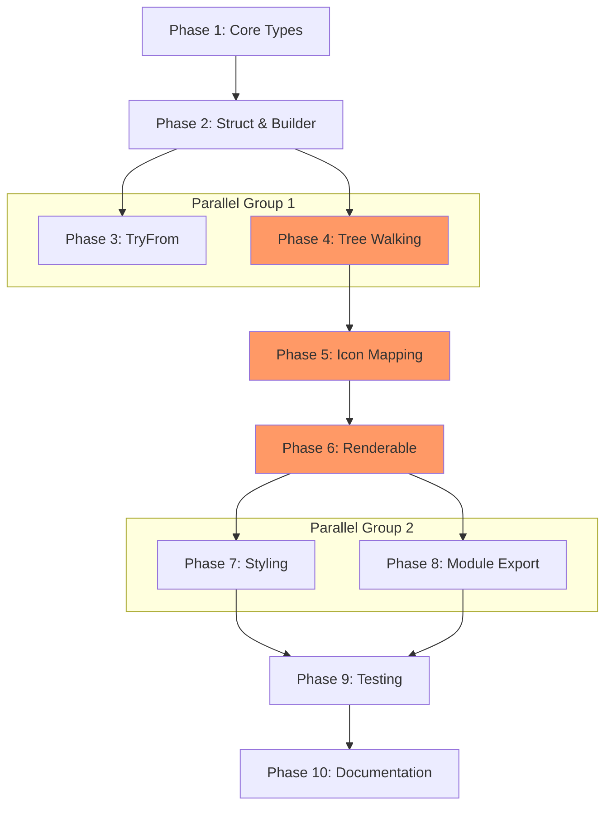

# Planning Process

- [x] Pre-flight Check [10:49:49]
    - [x] Catalogs validated (188 skills, 32 agents)
    - [x] Directories ready
    - [x] Budget estimated: medium (~45%)
    - [x] Explored biscuit-terminal architecture (Renderable trait, Terminal struct, component patterns)
- [x] Prep Started [10:50]
    - [x] Identified Skills: biscuit-terminal, rust, rust-testing, thiserror + suggested strum, serde, infer
    - [x] Identified Subagents: requirement-clarifier, completeness/correctness/risk reviewers, Plan
- [x] Prep complete [10:51]
- [x] Clarify & Research [10:51]
    - [x] Clarification questions prepared
    - [x] User answered 4 questions (symlinks, permissions, depth, rendering)
    - [x] Requirements updated with clarified decisions
    - [ ] Package research started (background)
- [x] Planning Subagent [agent: **Plan**] started [10:52]
    - [x] subagent skills used: biscuit-terminal, rust, rust-testing, thiserror
    - [x] Planning completed: 10 phases
- [x] Module Assessment: Single module (biscuit-terminal/lib)
- [x] All Pre-review Steps complete [10:55]
- [x] Reviews Started [10:56]
   - [x] Completeness Review: 24 gaps identified, mostly Phase 5 icon coverage
   - [x] Concurrency Review: Phases 7+8 can parallel, critical path = 7 phases
   - [x] Correctness Review: 17 issues, 2 errors (Default, render signature)
   - [x] Risk Assessment: 3 HIGH risks (PUA width, word-wrap, large dirs)
- [x] Reviews Completed [10:59]
- [x] Plan Finalization started [10:59]
    - [x] subagent skills used: biscuit-terminal, rust, thiserror
    - [x] Dependency graph generated (mermaid)
    - [x] Review feedback incorporated into all 10 phases
- [x] Plan finalized [11:01]
- [x] Final Steps
    - [x] Lessons learned collected (4 items)
    - [x] Package research: ignore=0.4, walkdir=2.5 already in workspace
- [ ] Summary reported
    - Plan: 2026-02-24.plan-for-filesystem-terminal-component.md
    - Phases: 10
    - Duration: ~12 minutes
    - Context: within budget

## Plan

### Phase 1: Core Types and Error Handling
**Agent:** `general-purpose` | **Skills:** rust, thiserror, biscuit-terminal | **Complexity:** Low
**Deps:** None | **Parallel:** No

**Goal:** Define foundational types: error enum, icon constants, TreeNode struct, tree-drawing constants.

**Deliver:**
- `FileSystemError` enum using thiserror:
  - `PathNotFound { path: PathBuf }`
  - `NotADirectory { path: PathBuf }`
  - `PermissionDenied { path: PathBuf }`
  - `IoError(#[from] std::io::Error)`
  - `Ignore(#[from] ignore::Error)`
- Icon constants module with ALL icons from spec (both Nerd Font + Unicode fallback):
  - Directories: base (e5fe/📂), depth-limit (e652/📁), .git (e5fb), .github (e5fd), utils (f19fc), docs (ebdf)
  - Files: base (ea7b/📄), .md (f0354), README (f02e), CLAUDE (f0721), SKILL (f113c), symlink (eaee/@)
  - Extensions: .rs (e7a8), .ts (e8ca), .js (e781), .toml (e6b2), .yaml (e8eb), .json (eb0f), etc.
  - Special: .gitignore (e702), .env (eafa), justfile (ee0d), .editorconfig (e615 - NOT e652)
- Tree-drawing constants: BRANCH="├── ", LAST_BRANCH="└── ", VERTICAL="│   ", INDENT="    "
- `TreeNode` enum: `Dir { name, children, is_ignored, is_symlink, has_error, at_depth_limit }`, `File { ... }`

**Pass when:**
- [ ] `FileSystemError` compiles with `#[from]` for io::Error and ignore::Error
- [ ] Icon constants use correct escapes (`'\u{e5fe}'`), verified against Nerd Font cheat sheet
- [ ] TreeNode can represent all entry types (dir, file, symlink, error, depth-limit)
- [ ] Unit tests verify error Display implementations

**If failed:**
- Rollback: Delete filesystem.rs, remove from mod.rs
- Retry: Review terminal_image.rs for thiserror patterns

---

### Phase 2: FileSystem Struct and Builder Pattern
**Agent:** `general-purpose` | **Skills:** rust, biscuit-terminal | **Complexity:** Medium
**Deps:** Phase 1 | **Parallel:** No

**Goal:** Create main `FileSystem` struct with builder-pattern configuration (tree built lazily on first render).

**Deliver:**
- `FileSystem` struct with fields:
  - `root_path: PathBuf`
  - `tree: Option<Vec<TreeNode>>` (lazy, built on first render)
  - `layout: Layout`
  - Config: `dim_gitignore`, `italicize_dot_files/dirs`, `hide_dot_files/dirs`, `do_not_recurse_gitignore`
  - `filter_patterns: Vec<String>`, `highlight_red/green: Vec<String>`
  - `max_depth: u32` (default 20), `max_entries: u32` (default 1000)
- Constructors:
  - `new(dir: impl AsRef<Path>) -> Result<Self, FileSystemError>`
  - `new_with_formatting(dir)` - preset: italicize dots, dim gitignore, no-recurse ignored
- Builder methods (return `Self`): `.depth()`, `.max_entries()`, `.dim_gitignore()`, `.italicize_dot_files()`, etc.
- `Default` impl: uses `current_dir().unwrap_or_else(|_| PathBuf::from("."))` (safe fallback)

**Pass when:**
- [ ] `FileSystem::new(".")` returns `Result<FileSystem, FileSystemError>`
- [ ] Builder methods chain fluently
- [ ] `Default::default()` compiles without panic (uses fallback)
- [ ] Tree is NOT built until first `render()` call

**If failed:**
- Rollback: Keep Phase 1 types only
- Retry: Compare with UnorderedList builder pattern in list.rs

---

### Phase 3: TryFrom Trait Implementations
**Agent:** `general-purpose` | **Skills:** rust | **Complexity:** Low
**Deps:** Phase 2 | **Parallel:** Yes (with Phase 4)

**Goal:** Implement TryFrom traits for ergonomic construction.

**Deliver:**
- `TryFrom<&str>`, `TryFrom<String>`, `TryFrom<&Path>`, `TryFrom<PathBuf>`

**Pass when:**
- [ ] All TryFrom implementations compile
- [ ] Error type is `FileSystemError`

---

### Phase 4: Tree Walking and gitignore Integration
**Agent:** `general-purpose` | **Skills:** rust | **Complexity:** High
**Deps:** Phase 2 | **Parallel:** Yes (with Phase 3)

**Goal:** Implement filesystem traversal with gitignore awareness using `ignore` crate.

**Deliver:**
- Private `build_tree(&self) -> Vec<TreeNode>` using `ignore::WalkBuilder`:
  - `WalkBuilder::new(root).follow_links(false).git_ignore(true).git_global(false).max_depth(self.max_depth)`
- Symlink detection via `entry.path_is_symlink()` (efficient, no metadata lookup)
- Permission errors: catch `Err(ignore::Error)` from iterator, create error-marked TreeNode
- Entry limit: stop after `max_entries` with "...N more items" indicator
- Build nested `Vec<TreeNode>` by tracking path hierarchy during walk
- Directories-first sorting, then alphabetical

**Pass when:**
- [ ] Tree populated from filesystem correctly
- [ ] gitignore patterns respected (test with negation pattern)
- [ ] Symlinks detected via `path_is_symlink()`, marked, not followed
- [ ] Permission errors create error-marked nodes (not panic)
- [ ] max_depth and max_entries enforced
- [ ] Integration test with tempdir verifies gitignore

**If failed:**
- Rollback: Return empty tree
- Retry: Study tree-hugger's OverrideBuilder usage

---

### Phase 5: Icon Mapping and Selection Logic
**Agent:** `general-purpose` | **Skills:** rust, biscuit-terminal | **Complexity:** Medium
**Deps:** Phase 4 | **Parallel:** No

**Goal:** Implement icon selection based on file type, name, depth, and Nerd Font availability.

**Deliver:**
- `fn get_icon(&self, node: &TreeNode, depth: u32, is_nerd_font: Option<bool>) -> &'static str`
- Policy: `Some(true)` → Nerd Font, `Some(false)` or `None` → Unicode fallback
- Matching priority: (1) exact filename case-sensitive, (2) root-context (depth=0), (3) extension, (4) base fallback
- Root-only icons: CLAUDE.md (f0721), Agents.md (f21b), Gemini.md (f21b) only at depth 0
- All ~35 icon rules from spec with explicit extension lists:
  - Audio: aiff, aif, mp3, wav, opus, flac, ogg, m4a
  - Video: mp4, mkv, avi, mov, webm, wmv
  - Image scalar: png, jpg, jpeg, gif, bmp, webp
  - Image vector: svg, eps
- PUA width handling: add trailing space if needed for alignment

**Pass when:**
- [ ] Correct Nerd Font icon for is_nerd_font=Some(true)
- [ ] Unicode fallback for is_nerd_font=None or Some(false)
- [ ] CLAUDE.md gets special icon only at depth 0
- [ ] SKILL.md gets special icon at any depth
- [ ] Case-insensitive extension matching
- [ ] Unit tests for all 35+ icon rules

---

### Phase 6: Renderable Trait Implementation
**Agent:** `general-purpose` | **Skills:** rust, biscuit-terminal | **Complexity:** Medium
**Deps:** Phase 5 | **Parallel:** No

**Goal:** Implement `Renderable` trait for terminal output with internal width management.

**Deliver:**
- Full `Renderable` impl:
  - `fn render(&self, term_width: Option<u32>) -> String` (correct signature!)
  - `fn fallback_render(&self, term: &Terminal) -> String`
  - `fn layout(&self) -> &Layout`, `fn layout_mut(&mut self) -> &mut Layout`
  - `fn as_any(&self) -> &dyn Any`
  - `fn is_block_level(&self) -> bool` → true
- Tree rendering (builds tree lazily if not cached):
  - Pre-compute available width: terminal_width - margin - depth_indent
  - Use WordWrap::None internally, truncate names manually
  - Apply tree connectors (├──, └──, │, indent)
  - Use `split_at_visible_width()` for name truncation
- Call `self.layout.apply_layout(&tree_content, width)` as final step

**Pass when:**
- [ ] `render(Some(80))` returns valid tree string with correct connectors
- [ ] `fallback_render(&Terminal::default())` uses term.is_nerd_font for icons
- [ ] Tree connectors never wrapped/broken
- [ ] Names truncated with "…" when too long
- [ ] 5-level deep tree renders correctly at widths 40, 80, 120

---

### Phase 7: Styling Integration
**Agent:** `general-purpose` | **Skills:** rust, biscuit-terminal | **Complexity:** Medium
**Deps:** Phase 6 | **Parallel:** Yes (with Phase 8)

**Goal:** Integrate terminal-aware styling (dim, italic, highlights).

**Deliver:**
- Color scheme (matches tree/lsd conventions):
  - Directories: bold blue
  - Files: default foreground
  - Gitignored: Style::Dim
  - Permission errors: red
  - Symlinks: cyan
- Styling via term.is_tty check (no ANSI when not TTY)
- Highlight patterns: exact substring match for v1 (fuzzy deferred to v2)

**Pass when:**
- [ ] Gitignored items render dimmed in capable terminals
- [ ] Dot files/dirs render italic when terminal supports it
- [ ] Red/green highlights for matched patterns
- [ ] No ANSI codes when is_tty=false

**If failed:**
- Rollback: Plain text only
- Retry: Review prose.rs styling patterns

---

### Phase 8: Module Integration and Exports
**Agent:** `general-purpose` | **Skills:** rust, biscuit-terminal | **Complexity:** Low
**Deps:** Phase 6 | **Parallel:** Yes (with Phase 7)

**Goal:** Integrate into biscuit-terminal module system.

**Deliver:**
- Add `pub mod filesystem;` to `components/mod.rs`
- Add to `prelude.rs`: `pub use crate::components::filesystem::{FileSystem, FileSystemError};`
- Add to `biscuit-terminal/lib/Cargo.toml`: `ignore = "0.4"`
- Update `biscuit-terminal/docs/dependencies.md` with ignore crate entry

**Pass when:**
- [ ] `use biscuit_terminal::prelude::FileSystem;` compiles
- [ ] `use biscuit_terminal::components::filesystem::*;` compiles
- [ ] `cargo check -p biscuit-terminal` succeeds
- [ ] `cargo doc -p biscuit-terminal` builds without warnings

---

### Phase 9: Comprehensive Testing
**Agent:** `feature-tester-rust` | **Skills:** rust-testing, biscuit-terminal | **Complexity:** Medium
**Deps:** Phase 8 | **Parallel:** No

**Goal:** Create comprehensive unit and integration tests.

**Deliver:**
- Unit tests: constructors, TryFrom, builders, icons, errors
- Integration tests: tempdir traversal, gitignore, symlinks, permissions, depth

**Pass when:**
- [ ] `just test` passes in biscuit-terminal
- [ ] All error paths tested
- [ ] No unwrap/expect in production code

---

### Phase 10: Documentation and Examples
**Agent:** `general-purpose` | **Skills:** rust | **Complexity:** Low
**Deps:** Phase 9 | **Parallel:** No

**Goal:** Add comprehensive documentation.

**Deliver:**
- Module-level docs with examples
- Doc comments on all public types/methods
- `## Examples`, `## Errors`, `## Notes` sections

**Pass when:**
- [ ] `cargo doc` shows complete documentation
- [ ] Examples compile in doc tests

## Dependency Graph

**Critical Path:** 1 → 2 → 4 → 5 → 6 → 8 → 9 → 10 (7 sequential gates)
**Parallelism:** Phases 3+4, Phases 7+8

## Risks

> Implementation risks identified during planning with mitigation strategies.

| Level | Category | Description | Affected | Mitigation |
|-------|----------|-------------|----------|------------|
| HIGH | technical | PUA glyphs (Nerd Font icons) measured as 1 column, should be 2. Tree indentation will break. | Phase 5,6 | Add PUA range check to visible_width() or local helper |
| HIGH | technical | Layout word-wrap will break line-drawing prefixes (├──) | Phase 6 | Use WordWrap::Truncate and pre-compute widths internally |
| HIGH | technical | Synchronous full-dir scan in render() blocks on large dirs | Phase 4 | Enforce max_depth=20, max_entries=1000 with "N more" indicator |
| MEDIUM | technical | gitignore edge cases (negation, global) not tested | Phase 4 | Use git_global(false) default, test negation patterns |
| MEDIUM | scope | Fuzzy matching crate not specified | Phase 7 | Decide before Phase 7: nucleo-matcher or descope to v2 |
| MEDIUM | technical | is_nerd_font=None handling policy undefined | Phase 5 | Treat None as no-nerd-font, expose force_icons() builder |

## Lessons Learned

> Discoveries about skills or memory resources that were inaccurate, incomplete, or missing.

- [SOURCE: block_constraint.rs]: `visible_width()` defaults PUA chars to 1 column via `unwrap_or(1)` - Nerd Font icons will be measured incorrectly. Needs PUA range check fix.
- [SPEC: icon-list]: U+E652 listed for both .editorconfig and depth-limit folder - conflict resolved: use e615 for .editorconfig
- [SPEC: icon-list]: Symlink icon (U+EAEE) had no Unicode fallback defined - resolved: use "@" as fallback
- [PATTERN: Default impl]: `current_dir()` returns Result but `Default::default()` cannot - need fallback to PathBuf::from(".")

## Package Changes

> Dependencies to be added, updated, or removed during implementation.

- [ADD]: ignore = "0.4" in biscuit-terminal/lib/Cargo.toml
    - Research status: complete (already in workspace via sniff, tree-hugger)
    - API: `WalkBuilder::new(root).git_ignore(true).follow_links(false).max_depth(n)`
- [DO_NOT_ADD]: globset - redundant, ignore::OverrideBuilder provides glob filtering
- [DEFERRED]: fuzzy-matcher or nucleo-matcher - descoped to v2, using substring match for v1 highlights
