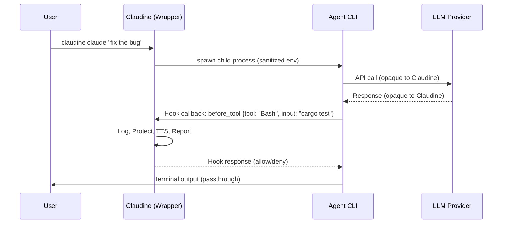
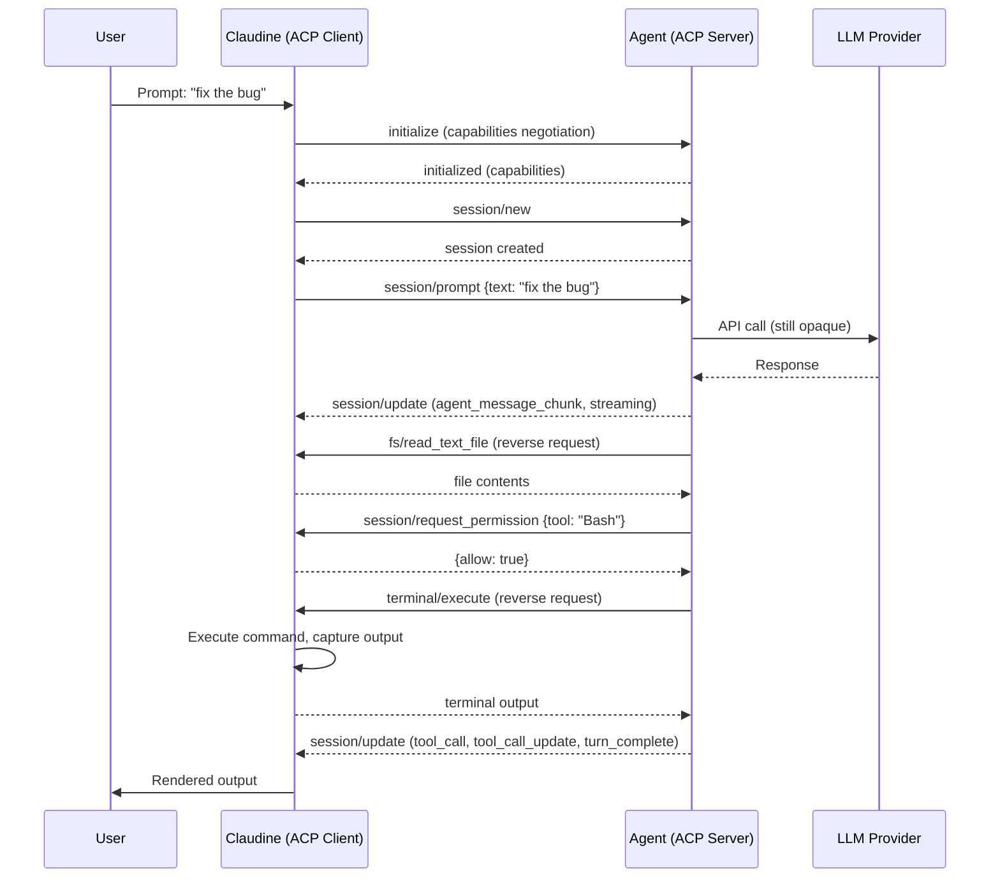
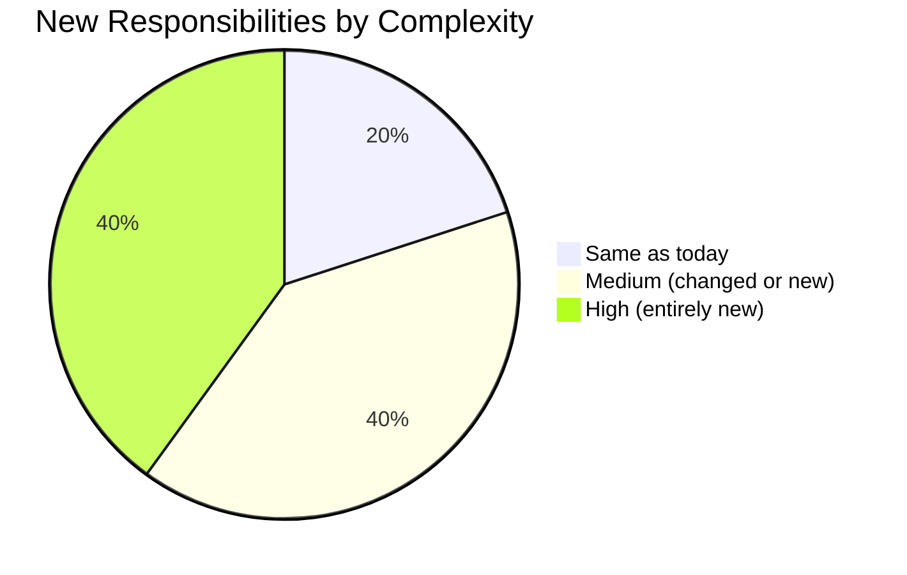
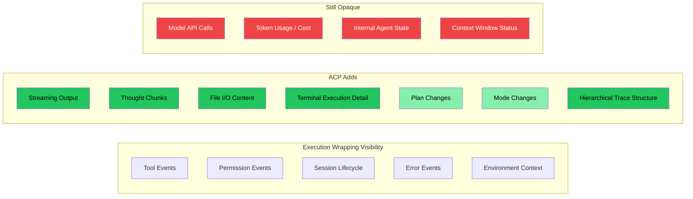
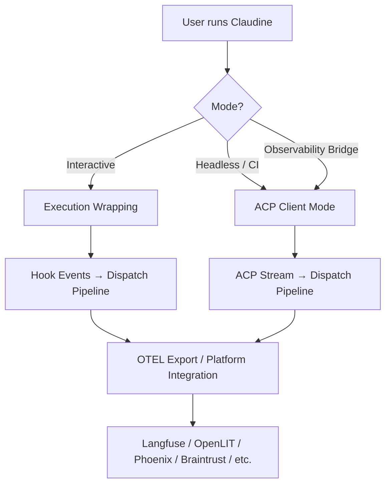

# Does ACP Change Things?

A comparative analysis of Claudine's current **execution wrapping** approach versus a potential **ACP (Agent Client Protocol) wrapping** approach, with specific attention to observability platform integration.

## Table of Contents

- [Part 1: Execution Wrapping vs ACP Wrapping](#part-1-execution-wrapping-vs-acp-wrapping)
  - [How Today's Execution Wrapping Works](#how-todays-execution-wrapping-works)
  - [How ACP Wrapping Would Work](#how-acp-wrapping-would-work)
  - [Visibility Comparison](#visibility-comparison)
  - [Additional Responsibilities for Claudine](#additional-responsibilities-for-claudine)
- [Part 2: Observability Platform Integration](#part-2-observability-platform-integration)
  - [Current Integration Strategy](#current-integration-strategy-execution-wrapping)
  - [ACP Integration Strategy](#acp-integration-strategy)
  - [Platform-by-Platform Impact](#platform-by-platform-impact)
  - [What Gets Easier](#what-gets-easier)
  - [What Gets Harder](#what-gets-harder)
- [Verdict](#verdict)

---

## Part 1: Execution Wrapping vs ACP Wrapping

### How Today's Execution Wrapping Works

Claudine currently acts as a **process supervisor and hook handler**. The architecture is deliberately thin:

**Key characteristics:**

- Claudine spawns the agent as a child process with environment sanitization
- Hooks are **provider-native** (Claude Code's `settings.json`, Gemini's hooks, OpenCode's plugins)
- Claudine receives **callback events** for 16 normalized lifecycle events
- The agent talks directly to the LLM provider — Claudine never sees those API calls
- Claudine captures event metadata (tool name, input, output, timestamps) but not model internals

### How ACP Wrapping Would Work

Under an ACP wrapping model, Claudine would become an **ACP client** that spawns agents as **ACP servers**. Instead of hooking into provider-specific event systems, Claudine would communicate with agents over the standardized ACP protocol (JSON-RPC 2.0 over stdio).

**Key characteristics:**

- Claudine becomes the **host** — it owns the terminal, the filesystem access, and the permission model
- The agent can only read files, write files, and run commands **through Claudine** via reverse requests
- Every tool invocation flows through Claudine as a mediated operation
- Streaming updates provide real-time visibility into agent reasoning and tool usage
- Capability negotiation at initialization defines the contract

### Visibility Comparison

| Data Point | Execution Wrapping | ACP Wrapping | Delta |
|---|---|---|---|
| **Tool invocations** (name, input) | Yes, via hooks | Yes, via reverse requests + `session/update` | Comparable |
| **Tool results** (output, errors) | Yes, via `after_tool` hooks | Yes, Claudine controls execution and sees results directly | Slightly better (first-party data) |
| **File read/write operations** | Partial (hook fires, but agent can read files directly) | Full (all file I/O goes through Claudine as reverse requests) | Significantly better |
| **Terminal command execution** | Partial (hook fires before/after, but agent runs commands directly) | Full (Claudine executes commands on behalf of agent) | Significantly better |
| **Permission decisions** | Yes, via `permission_request` hook | Yes, via `session/request_permission` reverse request | Comparable |
| **Agent reasoning / thought** | No | Partial (`agent_thought_chunk` updates, if agent emits them) | Better |
| **Streaming token output** | No (see final output only) | Yes (`agent_message_chunk` streaming) | Significantly better |
| **Model API calls** (tokens, latency, cost) | No | No (still opaque unless agent reports via capabilities) | No change |
| **Subagent lifecycle** | Yes, via `subagent_start/stop` hooks | Depends on agent implementation | Comparable or worse |
| **Session state** (context window, compaction) | Partial (`before_compact` hook) | Partial (session metadata in updates) | Comparable |
| **Plan/mode changes** | No | Yes (`plan` and `mode` update types) | Better |
| **MCP server interactions** | No | Partial (if agent exposes MCP capabilities) | Slightly better |

### Visibility Gains Summary

The biggest visibility gains from ACP come from Claudine becoming the **execution substrate**:

1. **File I/O mediation**: Every `fs/read_text_file` and `fs/write_text_file` reverse request passes through Claudine. Today, agents read files directly and Claudine only sees hook metadata.
2. **Terminal command mediation**: Every `terminal/execute` reverse request is fulfilled by Claudine. Today, agents run commands directly and Claudine sees before/after hook events.
3. **Streaming content**: `session/update` notifications provide real-time agent output, thought chunks, and tool call progress. Today, Claudine only sees discrete hook events.
4. **Plan and mode awareness**: ACP update types include `plan` and `mode` changes, giving Claudine structural awareness of agent strategy.

### Visibility Losses / Unchanged

1. **Model API internals**: ACP does not expose token counts, API latency, or cost data unless the agent voluntarily reports it. This remains opaque under both approaches.
2. **Provider-specific hooks**: Some providers emit events that have no ACP equivalent (e.g., Claude Code's `before_compact` event for context window compression). Moving to pure ACP could lose these.
3. **Non-ACP providers**: Goose, Roo Code, and potentially others do not support ACP. Moving to ACP wrapping would either exclude these providers or require maintaining the execution wrapping path as a fallback.

### Additional Responsibilities for Claudine

Moving from execution wrapper to ACP client would require Claudine to take on significant new responsibilities:

| Responsibility | Current Owner | ACP Owner | Complexity |
|---|---|---|---|
| **Process spawning** | Claudine | Claudine | Same |
| **Environment sanitization** | Claudine | Claudine | Same |
| **Terminal rendering** (agent output) | Agent (passthrough) | Claudine (must render `session/update` streams) | High — new |
| **File system operations** | Agent (direct) | Claudine (reverse request fulfillment) | High — new |
| **Terminal command execution** | Agent (direct) | Claudine (reverse request fulfillment) | High — new |
| **Permission model** | Shared (agent asks, user answers via agent UI) | Claudine (must implement permission UX) | High — new |
| **Session management** | Agent | Claudine (create, load, resume sessions) | Medium — new |
| **Capability negotiation** | N/A | Claudine (must declare supported capabilities) | Medium — new |
| **Authentication forwarding** | Claudine (env vars) | Claudine (ACP `authenticate` method) | Medium — changed |
| **MCP server management** | Claudine (config injection) | Claudine (ACP MCP capabilities) | Medium — changed |
| **Streaming protocol handling** | N/A | Claudine (parse ndjson, correlate IDs, handle cancellation) | High — new |
| **Error recovery / reconnection** | Simple (process exit code) | Claudine (JSON-RPC error handling, session resume) | Medium — new |

**The fundamental shift**: Under execution wrapping, Claudine is a **passive observer** that hooks into agent events. Under ACP wrapping, Claudine becomes an **active participant** that mediates every agent-environment interaction. This is a categorical change in architectural role.

---

## Part 2: Observability Platform Integration

### Current Integration Strategy (Execution Wrapping)

Today, Claudine's observability pipeline works like this:

1. Hook events fire and land in the dispatch pipeline
2. Actions can **log** events to JSONL files and/or HTTP endpoints
3. A SQLite index provides local querying (sessions, tools, errors, trends)
4. External observability platforms would be reached via the **log server target** (HTTP POST) or custom **fire-and-forget** shell actions

The data available for export is the `EventMeta` structure: provider, event type, tool name/input/output, timestamps, environment context, and git metadata. This is rich context but **event-level** — Claudine sees discrete lifecycle events, not continuous traces.

### ACP Integration Strategy

Under ACP, Claudine would have access to a **continuous stream** of agent activity rather than discrete hook events. This fundamentally changes what can be sent to observability platforms:

| Data Type | Execution Wrapping Export | ACP Export |
|---|---|---|
| **Trace spans** | One span per hook event (before_tool → after_tool) | Hierarchical spans: session → turn → tool_call → file_op / terminal_exec |
| **Streaming content** | Not available | Full agent output stream, thought chunks |
| **File operations** | Tool name + metadata | Full file paths, content read/written, byte counts |
| **Command execution** | Tool name + input/output summary | Full command, exit code, stdout/stderr, duration |
| **Permission flow** | permission_request event | Full request → decision → outcome trace |
| **Session topology** | Flat event list per session | Structured session tree with turns, tool calls, sub-operations |

### Platform-by-Platform Impact

Using the observability platforms from the [platform research](./observability-platforms.md), here is how each would benefit from ACP-sourced data:

#### OpenTelemetry-Native Platforms

These platforms benefit most because ACP data maps naturally to OTEL's trace/span model.

| Platform | Current Integration | ACP Integration | Improvement |
|---|---|---|---|
| [Langfuse](https://langfuse.com/) | POST event JSON to server endpoint; flat event traces | Hierarchical OTEL spans (session → turn → operations); streaming annotations | Major — Langfuse's trace tree visualization would finally have meaningful hierarchy |
| [OpenLIT](https://openlit.io/) | Same flat events via OTEL exporter | Full span hierarchy with file/terminal operation detail | Major — OpenLIT's OTEL-native architecture benefits directly |
| [MLflow](https://mlflow.org/genai/) | OTEL span ingestion of hook events | Rich span trees with tool execution details | Moderate — MLflow's GenAI tracing gains structural depth |
| [Arize Phoenix](https://arize.com/docs/phoenix) | OpenInference-compatible event export | Hierarchical traces with operation-level detail | Major — Phoenix's trace debugging gains granularity |

#### Commercial / SaaS Platforms

| Platform | Current Integration | ACP Integration | Improvement |
|---|---|---|---|
| [LangSmith](https://www.langchain.com/langsmith/observability) | Custom HTTP logging via server target | Structured traces via SDK or OTEL bridge | Moderate — LangSmith already handles flat traces well, but gains hierarchy |
| [Braintrust](https://www.braintrust.dev/) | Event-level logging via Rust SDK (alpha) | Span-level logging with eval-ready tool execution data | Moderate — evaluation workflows benefit from richer tool outcome data |
| [W&B Weave](https://wandb.ai/site/weave/) | HTTP POST events | Structured function traces | Minor — Weave's model is already function-level |

#### Gateway / Proxy Platforms

| Platform | Current Integration | ACP Integration | Improvement |
|---|---|---|---|
| [Helicone](https://www.helicone.ai/) | No direct benefit (Claudine doesn't proxy LLM calls) | No direct benefit (ACP still doesn't expose LLM API calls) | None — Helicone's value is at the LLM API layer, which neither approach exposes |

#### Agent-Focused Platforms

| Platform | Current Integration | ACP Integration | Improvement |
|---|---|---|---|
| [AgentOps](https://www.agentops.ai/) | Session-level event logging | Full session replay data with streaming output, tool call trees, file operations | Major — AgentOps' session replay would have dramatically richer data |

### What Gets Easier

1. **Trace hierarchy construction**: ACP's structured `session/update` stream with typed update kinds (`tool_call`, `tool_call_update`, `agent_message_chunk`, `agent_thought_chunk`, `plan`) maps directly to parent-child span relationships. Today, Claudine must infer hierarchy from before/after event pairs.

2. **Real-time streaming to platforms**: ACP provides a continuous notification stream rather than discrete hook callbacks. Platforms that support streaming ingestion (Langfuse, Phoenix, AgentOps) can receive data in real-time rather than in post-hoc batches.

3. **File and command audit trails**: Because all file I/O and terminal execution flows through Claudine, every operation can be instrumented with precise timing, content hashes, and outcome codes — no hook metadata parsing required.

4. **Session replay**: The combination of streaming output, tool call sequences, and file/terminal operation logs creates a complete session replay dataset. Platforms like AgentOps that specialize in replay would receive dramatically richer data.

5. **Cross-provider normalization**: ACP is already a normalized protocol. Today, Claudine must maintain per-provider adapters to normalize 8 different hook formats into 16 common events. With ACP, the protocol itself provides normalization.

6. **Evaluation dataset generation**: Platforms like Braintrust that focus on turning production traces into evaluation datasets would benefit from the structured tool_call → result flow, which maps cleanly to input/output pairs for eval scoring.

### What Gets Harder

1. **Implementation complexity**: Claudine must implement a full ACP client, including:
   - JSON-RPC message correlation (request ID tracking)
   - Streaming ndjson parsing with backpressure handling
   - Reverse request fulfillment (file I/O, terminal execution, permissions)
   - Capability negotiation and version handling
   - Session lifecycle management
   - Error recovery and cancellation propagation

2. **Provider coverage gap**: Only a subset of Claudine's 8 supported providers currently support ACP. Per the [ACP support matrix](https://agentclientprotocol.org/):

   | Provider | ACP Support | Status |
   |---|---|---|
   | Claude Code | Yes | Via bridge adapter |
   | Codex | Yes | Via `codex-acp` adapter |
   | Gemini CLI | Yes | `--experimental-acp` flag |
   | Qwen Code | Yes | `--acp` flag |
   | Kimi Code | Yes | ACP mode documented |
   | OpenCode | Yes | ACP support listed |
   | Goose | Not confirmed | No ACP documentation found |
   | Roo Code | Not confirmed | No ACP documentation found |

   This means Claudine would need to maintain **both** the execution wrapping path (for non-ACP providers) and the ACP client path — increasing total complexity rather than replacing one approach with another.

3. **Terminal rendering burden**: Today, agents render their own terminal output. Under ACP, Claudine would need to render `session/update` streams into terminal output, handling markdown, code blocks, progress indicators, and potentially agent-specific formatting.

4. **Dual-mode operation**: For providers that support ACP, Claudine could run in ACP mode. For those that don't, it falls back to execution wrapping. This dual-mode architecture adds testing surface, configuration complexity, and potential behavior inconsistencies.

5. **Latency overhead**: Every file read, file write, and terminal command now involves a JSON-RPC round-trip through Claudine instead of the agent executing directly. For agents that perform many small file operations, this adds measurable latency.

6. **Rust implementation maturity**: While the official `agent-client-protocol` Rust crate exists, it is relatively new. The ecosystem is TypeScript-first, and Rust-specific patterns (async runtime integration, error handling, !Send futures) require careful implementation.

### How Much Additional Visibility Do We Gain?

**Quantitative estimate**: ACP wrapping adds visibility into approximately 7 new data categories while leaving 4 categories (model API internals) still opaque. The most impactful gains are in file I/O content, terminal execution detail, and streaming output — these are the operations that today's hook events describe only in metadata.

### How Much More Complicated Is ACP?

| Dimension | Execution Wrapping | ACP Wrapping | Factor |
|---|---|---|---|
| **Lines of protocol code** | ~500 (adapter per provider, simple JSON parsing) | ~3,000-5,000 (full ACP client, reverse request handlers, session manager) | 6-10x |
| **Provider adapters** | 8 adapters (one per provider, parse hook JSON) | 6-8 ACP configs + 2 legacy adapters | Similar count, but ACP adapters are simpler |
| **Runtime responsibilities** | Spawn process, handle hooks, log events | Spawn process, manage ACP session, fulfill reverse requests, render output, log everything | 3-4x |
| **Test surface** | Hook parsing + dispatch + actions | All of the above + JSON-RPC correlation + streaming + file I/O + terminal exec + capability negotiation | 3-4x |
| **Configuration** | Event bindings per provider | Event bindings + ACP capability declarations + reverse request policies + rendering preferences | 1.5-2x |
| **Error modes** | Process crash, hook parse failure | All of the above + protocol errors, request timeout, capability mismatch, session corruption, desync | 2-3x |

---

## Verdict

### Should Claudine adopt ACP wrapping?

**The answer is nuanced: ACP wrapping provides genuinely valuable observability gains, but the architectural cost is substantial.**

#### The case FOR ACP wrapping

- **File and terminal mediation** is the single biggest visibility gain. Knowing not just _that_ a tool was called but _exactly what it read, wrote, and executed_ transforms observability from event-level to operation-level.
- **Streaming output** enables real-time platform integration and session replay — capabilities that are impossible with discrete hook events.
- **Protocol normalization** would eventually simplify the adapter layer. Instead of parsing 8 different hook formats, Claudine parses one protocol.
- **OTEL-native platforms** (Langfuse, OpenLIT, Phoenix, MLflow) would benefit dramatically from hierarchical span data.

#### The case AGAINST ACP wrapping (as a full replacement)

- **Dual-mode is unavoidable** in the short term. Not all providers support ACP, so Claudine must maintain both paths.
- **Architectural role change** from passive observer to active participant is a fundamental increase in responsibility and failure surface.
- **Terminal rendering** is a large, underappreciated cost. Today, each agent renders its own rich terminal output. Under ACP, Claudine must replicate this.
- **Latency overhead** from reverse-request round-trips may degrade the interactive experience.
- **The biggest observability gap — model API internals — remains unfilled** by either approach.

#### Recommended path

A **hybrid strategy** offers the best tradeoff:

1. **Keep execution wrapping as the primary mode** for interactive use where terminal rendering quality matters.
2. **Add an ACP client mode as an opt-in alternative** for headless/CI use cases where observability depth matters more than interactive UX.
3. **Use ACP mode specifically for observability platform integration** — when Claudine is running as an observability bridge rather than an interactive wrapper.
4. **Invest in OTEL export from the existing hook pipeline** as the highest-ROI immediate improvement. Many of ACP's observability benefits can be partially achieved by enriching the current event data with better span hierarchy and streaming log targets.

This hybrid approach captures ACP's observability gains where they matter most while avoiding the cost of rebuilding Claudine's interactive experience around a new protocol.
