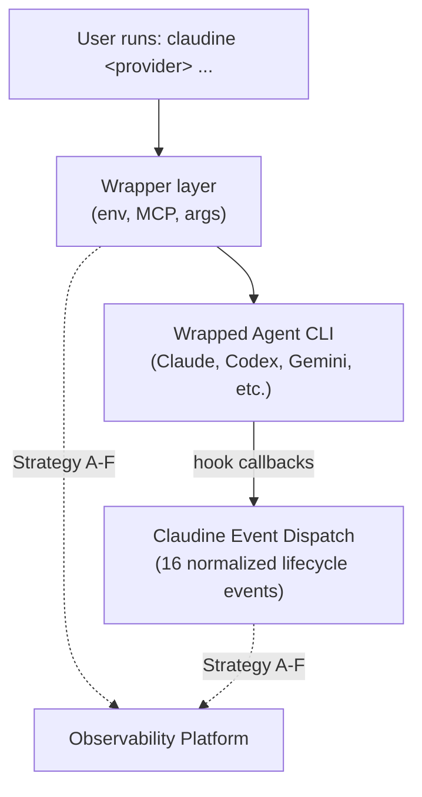

# Observability Integration Strategies for Claudine

This document explores different strategies for connecting an agentic CLI — wrapped by the `claudine` CLI — to an observability platform. Each strategy is evaluated for strengths, weaknesses, and platform fit.

## Context

Claudine wraps 8 agentic CLI providers (Claude Code, Codex, Gemini CLI, Goose, Kimi Code, OpenCode, Qwen Code, Roo Code) and normalizes 16 lifecycle events through a dispatch pipeline. The wrapper intercepts process execution, manages environment variables, injects MCP configurations, and handles stdin/stdout piping. Any observability integration must work within this wrapper architecture without disrupting the wrapped provider's behavior.

The observability platforms surveyed in `observability-platforms.md` range from full commercial suites (LangSmith, Braintrust) to OSS self-hostable systems (Langfuse, Phoenix, OpenLIT, MLflow) to gateway proxies (Helicone) and agent-focused tools (AgentOps). Rust support varies from an alpha SDK (Braintrust) to OTEL-indirect paths (Langfuse, MLflow) to no first-party support at all.

---

## Strategy A: OpenTelemetry (OTEL) Spans from the Wrapper

Claudine emits OpenTelemetry traces and spans directly from its Rust wrapper layer. Each wrapped session becomes a root trace; lifecycle events (session start, tool use, model response, etc.) become child spans with structured attributes.

### How it works

1. On wrapper launch, create an OTEL root span with session metadata (provider, model, project, user).
2. As claudine's event dispatch fires lifecycle events, create child spans with event payloads as attributes.
3. On session end, flush the trace to a configured OTEL collector endpoint.
4. Use the `opentelemetry` and `opentelemetry-otlp` Rust crates for native emission.

### Strengths

- **Standards-based**: OTEL is the lingua franca — any platform that accepts OTLP (Langfuse, Phoenix, MLflow, OpenLIT, Jaeger, Grafana Tempo) works without custom SDKs.
- **Rust-native**: The `opentelemetry` Rust ecosystem is mature. Claudine already uses `tracing`; the `tracing-opentelemetry` bridge makes integration straightforward.
- **No agent modification**: Traces are emitted from the wrapper, not from the wrapped CLI. Works with all 8 providers identically.
- **Rich correlation**: OTEL's trace/span model naturally represents the session → event → action hierarchy.

### Weaknesses

- **Limited visibility into agent internals**: Claudine only sees lifecycle events that exit the agent as hook callbacks. Internal model calls, token usage, and reasoning steps are opaque unless the agent itself emits telemetry.
- **Collector dependency**: Requires an OTEL collector endpoint to be running (self-hosted or cloud). Adds infrastructure.
- **Schema design burden**: OTEL is general-purpose. Mapping AI agent concepts (turns, tool calls, token costs) to span attributes requires careful schema design to get useful dashboards.

### Best platform fits

- **Langfuse**: Explicitly documents OTEL Rust support. The OTEL ingestion path maps spans to Langfuse traces/generations. Best OSS match.
- **MLflow**: Accepts OTEL spans natively, giving Rust apps a path without a first-party SDK. Good if you want broader ML platform features.
- **OpenLIT**: Built OTEL-native from the ground up. Strong if you want Kubernetes-integrated observability.

---

## Strategy B: Direct HTTP/REST API Reporting

Claudine posts structured event payloads directly to a platform's REST API from within the wrapper or event dispatch pipeline, bypassing OTEL entirely.

### How it works

1. On lifecycle events, serialize the event payload to JSON.
2. POST to the platform's ingestion API (e.g., Langfuse `/api/public/ingestion`, Braintrust `/v1/project_logs`, Helicone `/v1/log`).
3. Use async HTTP (`reqwest`) with fire-and-forget or buffered batch sends to avoid blocking the wrapped agent.
4. Authenticate via API keys stored in claudine's config or environment variables.

### Strengths

- **No OTEL infrastructure**: No collector to deploy. Direct platform communication.
- **Platform-optimized payloads**: Can use the platform's native schema (generations, traces, scores) rather than mapping to generic OTEL attributes. Richer data with less transformation.
- **Selective adoption**: Can instrument only the events you care about without the overhead of a full tracing pipeline.

### Weaknesses

- **Platform lock-in**: Each platform has a different API. Supporting multiple platforms means multiple API clients.
- **Maintenance burden**: Platform APIs evolve. Breaking changes require claudine updates.
- **Rust SDK gaps**: Most platforms only offer Python/JS SDKs. Claudine would need to implement API clients from scratch using `reqwest` against REST docs.
- **Reliability concerns**: Direct API calls can fail silently if the platform is down. Needs retry/buffering logic.

### Best platform fits

- **Braintrust**: Has an alpha Rust SDK that wraps their API. Lowest barrier for direct Rust integration today.
- **Langfuse**: Well-documented public REST API with explicit endpoint docs. Feasible to build a lightweight Rust client.
- **Helicone**: Simple logging API designed for minimal-code integration. Good for cost/latency tracking without full tracing.

---

## Strategy C: JSONL File Export with External Collector

Claudine writes structured event data to local JSONL files. A separate process (cron job, sidecar, or platform agent) picks up these files and forwards them to the observability platform.

### How it works

1. Claudine's existing `reporting` module already writes JSONL event logs and indexes them into SQLite.
2. Extend the JSONL schema to include OTEL-compatible trace/span IDs and platform-specific fields.
3. A collector script (shipped with claudine or user-provided) tails or polls the JSONL directory and batch-uploads to the platform.
4. Alternatively, platforms with file-based ingestion (MLflow artifacts, custom Langfuse importers) consume files directly.

### Strengths

- **Zero runtime coupling**: The wrapped agent and claudine's event pipeline have no network dependency at dispatch time. No latency, no failure modes from platform unavailability.
- **Existing infrastructure**: Claudine already produces JSONL logs. This strategy extends rather than replaces.
- **Debuggable**: Local files are inspectable, replayable, and can feed multiple platforms simultaneously.
- **Offline-friendly**: Works in air-gapped or intermittent-connectivity environments.

### Weaknesses

- **Not real-time**: There's an inherent delay between event emission and platform visibility. Poor for live debugging or session monitoring.
- **Two-process architecture**: Requires a separate collector to be configured and running. More moving parts for the user to manage.
- **Disk usage**: Long-running or high-volume sessions can accumulate significant log data.
- **Schema translation**: The collector must understand both claudine's JSONL schema and the target platform's ingestion format.

### Best platform fits

- **MLflow**: Strong artifact and file-based workflow heritage. Natural fit for batch import patterns.
- **Any platform with OTEL file exporter**: The OTEL file exporter can write OTLP-formatted JSON that standard collectors ingest.

---

## Strategy D: MCP Server as Observability Bridge

Register a custom MCP server in claudine's catalog that acts as an observability bridge. The wrapped agent calls this MCP server's tools during its session, and the server forwards data to the observability platform.

### How it works

1. Build an MCP server (Rust binary or Node script) that exposes tools like `log_observation`, `record_metric`, or `report_trace`.
2. Register it in claudine's MCP catalog as a default server.
3. When the wrapped agent launches with `--mcp`, the observability MCP server is injected alongside other MCP servers.
4. The agent can call the observability tools during its session, providing rich internal context (reasoning, tool results, token counts).
5. The MCP server forwards data to the configured observability platform.

### Strengths

- **Agent-internal visibility**: Unlike wrapper-only strategies, this can capture data from inside the agent's reasoning loop — tool call results, intermediate decisions, and model outputs.
- **Leverages existing infrastructure**: Uses claudine's MCP catalog, defaults, and runtime injection. No new integration surface.
- **Agent-driven instrumentation**: The agent decides what to log, which can be more semantically meaningful than external observation.
- **Cross-provider**: Works with any provider that supports MCP (currently Codex, Gemini, OpenCode via runtime injection; Claude, Roo via export).

### Weaknesses

- **Agent cooperation required**: The wrapped agent must actually call the MCP tools. Without explicit prompting or system prompt instructions, agents may ignore the observability server.
- **MCP support gaps**: Goose, Kimi, and Qwen don't support MCP yet. This strategy doesn't cover all 8 providers.
- **Overhead**: An additional MCP server process runs alongside each session. Resource cost for potentially sparse usage.
- **Non-deterministic**: Agent tool-calling behavior is probabilistic. You can't guarantee consistent observability data across sessions.

### Best platform fits

- **AgentOps**: Session replay and agent debugging focus aligns well with agent-driven instrumentation. The MCP server could map directly to AgentOps session/event APIs.
- **Langfuse**: Prompt management + tracing. The MCP server could also serve as a prompt registry, combining observability with prompt versioning.

---

## Strategy E: Gateway/Proxy Interception

Route the wrapped agent's outbound LLM API calls through an observability proxy that captures request/response pairs, token usage, latency, and costs.

### How it works

1. Set LLM provider base URL environment variables (e.g., `ANTHROPIC_BASE_URL`, `OPENAI_BASE_URL`) to point to a local or remote proxy.
2. The proxy forwards requests to the actual LLM provider, logging request/response pairs.
3. Claudine's wrapper layer sets these environment variables before launching the agent.
4. The proxy can be Helicone's hosted gateway, a local proxy instance, or a custom MITM proxy.

### Strengths

- **Deepest LLM visibility**: Captures actual model requests and responses, token counts, latency, costs — data that no other strategy can reliably provide from outside the agent.
- **Zero agent modification**: Works by changing environment variables only. The agent doesn't know it's being observed.
- **Provider-agnostic at the LLM level**: Any agent making standard HTTP calls to OpenAI/Anthropic/etc. APIs is captured.
- **Existing solutions**: Helicone and LiteLLM Proxy are production-ready proxies purpose-built for this.

### Weaknesses

- **Only sees LLM calls**: Misses everything else — tool use, file operations, user interactions, session lifecycle. Must be combined with another strategy for full observability.
- **Base URL support varies**: Not all agent CLIs expose or respect base URL environment variables. Some hardcode endpoints.
- **TLS/certificate complexity**: Local proxies may require certificate trust configuration to intercept HTTPS traffic.
- **Latency**: Every LLM call gains a network hop. For local proxies this is negligible; for remote proxies it adds up.
- **Privacy/security**: All prompts and completions flow through a third party (if using hosted proxy). May violate data policies.

### Best platform fits

- **Helicone**: Purpose-built for this exact pattern. Gateway-first architecture with caching, rate limiting, and cost tracking built in. The strongest match of any strategy/platform combination in this document.
- **Braintrust**: Braintrust Proxy can intercept and log LLM calls with eval integration.

---

## Strategy F: Hybrid — OTEL Spans + Enrichment Hook

Combine OTEL tracing from the wrapper (Strategy A) with a post-session enrichment step that augments traces with data from claudine's JSONL logs, MCP server observations, or proxy captures.

### How it works

1. Claudine emits OTEL spans for wrapper-level events (Strategy A) during the session.
2. After the session ends, a `session_end` hook action runs an enrichment script.
3. The script reads claudine's JSONL logs for the session, queries any MCP observability server data, and/or pulls proxy logs.
4. It patches the existing trace with additional spans, attributes, or scores via the platform's API.
5. The result is a unified trace that combines wrapper-level lifecycle data with agent-internal and LLM-level detail.

### Strengths

- **Most complete picture**: Combines lifecycle events, agent internals, and LLM call data into a single correlated trace.
- **Progressive adoption**: Start with OTEL-only (Strategy A), then add enrichment sources incrementally.
- **Non-blocking**: Enrichment runs after the session, so it never impacts agent performance.
- **Platform flexibility**: The base OTEL trace works with any OTEL-compatible platform; enrichment can target platform-specific APIs.

### Weaknesses

- **Complexity**: Most moving parts of any strategy. Multiple data sources, correlation logic, and timing dependencies.
- **Post-hoc enrichment**: Some platforms don't support updating traces after initial ingestion. May require workarounds.
- **Correlation challenges**: Matching JSONL entries to OTEL spans requires consistent trace/span ID propagation across all components.

### Best platform fits

- **Langfuse**: Supports both OTEL ingestion and REST API updates. Traces can be enriched with scores and metadata after creation.
- **Braintrust**: Evaluation-centric workflow naturally supports post-session scoring and annotation of existing traces.

---

## Strategy Comparison

| Dimension | A: OTEL Spans | B: REST API | C: JSONL Export | D: MCP Bridge | E: Gateway Proxy | F: Hybrid |
|---|---|---|---|---|---|---|
| **Implementation effort** | Medium | Medium-High | Low | Medium-High | Low-Medium | High |
| **Wrapper-level visibility** | High | High | High | Low | None | High |
| **Agent-internal visibility** | None | None | None | High | None | Medium |
| **LLM call visibility** | None | None | None | Low | High | Medium |
| **Real-time** | Yes | Yes | No | Yes | Yes | Partial |
| **Provider coverage** | All 8 | All 8 | All 8 | MCP-capable only (5) | Base-URL-capable only | All 8 (base) |
| **Platform lock-in** | None | High | Low | Low | Medium | Low |
| **Infrastructure needs** | OTEL collector | None | Collector script | MCP server process | Proxy process | Multiple |
| **Rust ecosystem fit** | Strong | Moderate | Strong | Strong | N/A | Strong |

## Recommended Approach

For claudine specifically, a **phased hybrid** approach is recommended:

1. **Phase 1 — OTEL from the wrapper (Strategy A)**: Instrument claudine's wrapper and event dispatch with OpenTelemetry spans using the `tracing-opentelemetry` bridge. This gives immediate visibility into session lifecycle across all 8 providers with minimal effort and zero platform lock-in. Target Langfuse or MLflow as initial backends.

2. **Phase 2 — Gateway proxy for LLM visibility (Strategy E)**: Add optional `--observe` flag to the wrapper that sets LLM base URL environment variables to route through a configurable proxy (Helicone or local). This fills the biggest gap in Phase 1 — actual model request/response data.

3. **Phase 3 — Post-session enrichment (Strategy F)**: Build the enrichment hook that correlates OTEL traces with JSONL logs and optional proxy data, providing the unified view.

Strategy D (MCP Bridge) is worth exploring as an experimental add-on but should not be on the critical path due to non-deterministic agent behavior and incomplete provider coverage.
