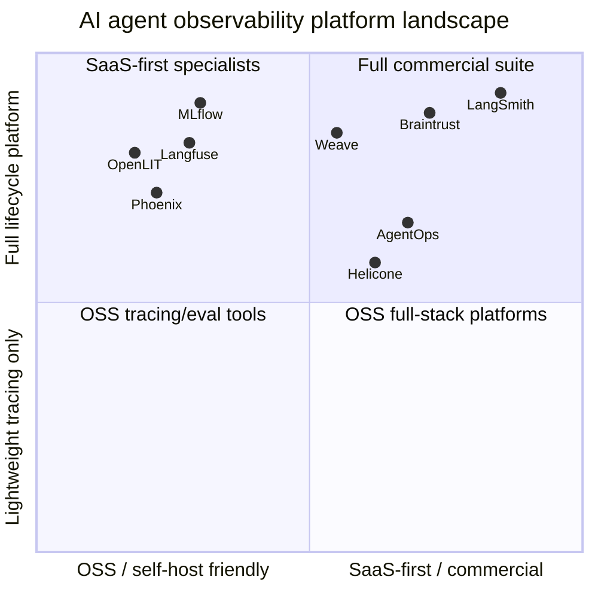

# Top Observability Platforms for AI Agents

> This is a practical shortlist, not a mathematically ranked benchmark. I prioritized platforms that are widely adopted or strategically important for AI-agent work, have mature tracing/evaluation workflows, and are credible choices for production use.

## At-a-glance comparison

| Name | URL | Description | License offered under | Setup description | Rust support |
|---|---|---|---|---|---|
| [LangSmith](https://www.langchain.com/langsmith/observability) | [Docs](https://docs.langchain.com/langsmith/home) | Full agent engineering platform focused on tracing, evaluation, debugging, deployment, and operational monitoring for LLM apps and agents. Strong fit when you want an integrated commercial platform rather than assembling pieces yourself. | Proprietary/commercial platform. Self-hosting is an Enterprise offering. | Start in managed cloud, then instrument via supported SDKs or OpenTelemetry-compatible paths. For self-hosting, LangChain documents Kubernetes deployment via Helm with backing services such as PostgreSQL, Redis, and ClickHouse. | No first-party Rust SDK surfaced in the official docs I reviewed. |
| [Langfuse](https://langfuse.com/) | [Docs](https://langfuse.com/docs/observability/get-started) | Open-source LLM engineering platform with tracing, metrics, evals, prompt management, and public APIs. Strong fit for teams that want self-hosting and an OTEL-friendly architecture. | Source available under MIT for most of the repo, with separate licensing for `ee/` portions. | Easiest path is Langfuse Cloud or self-hosting with Docker Compose. Typical flow is: deploy, create API keys, then instrument with Python/JS SDKs or send traces through OpenTelemetry. | Yes, indirectly. Official docs explicitly support using Langfuse via OpenTelemetry, including OpenTelemetry Rust. The examples repo also points to an unofficial Rust client. |
| [Braintrust](https://www.braintrust.dev/) | [Docs](https://www.braintrust.dev/docs) | AI observability platform centered on tracing, evals, experimentation, and turning production traces into evaluation datasets. Particularly strong when the evaluation loop is your main workflow. | Hosted platform is commercial/proprietary; several public SDKs and self-hosting repos are Apache-2.0. | Fastest path is hosted Braintrust plus SDK-based tracing. Self-hosting is available for the data plane and is documented around Terraform + Helm deployments on cloud infrastructure. | Yes. There is an official Rust SDK for logging and tracing, currently marked alpha. |
| [Arize Phoenix](https://arize.com/docs/phoenix) | [Phoenix docs](https://arize.com/docs/phoenix/get-started) | Open-source AI observability and evaluation platform built around OpenTelemetry/OpenInference. Strong for debugging agent behavior, inspecting traces, running evals, and prompt iteration. | Elastic License 2.0 (ELv2). | You can run Phoenix locally with `phoenix serve`, use Phoenix Cloud, and instrument your app using Phoenix/OpenInference tooling. Good choice when you want open tooling and notebook/dev-centric workflows. | I did not find a first-party Rust SDK in the official Phoenix docs reviewed. |
| [Helicone](https://www.helicone.ai/) | [Docs](https://docs.helicone.ai/) | Open-source LLM observability platform with a strong gateway/proxy model. Useful when you want minimal-code logging, cross-provider routing, caching, rate limiting, and cost/latency visibility. | Apache-2.0. | Simplest path is Helicone Cloud with its AI Gateway. For self-hosting, the docs provide Docker, Docker Compose, Kubernetes, and broader cloud deployment guidance. | Partial/indirect. Helicone’s AI Gateway is built in Rust, but I did not locate a first-party Rust client/instrumentation SDK in the official docs. |
| [W&B Weave](https://wandb.ai/site/weave/) | [Docs](https://docs.wandb.ai/) | Weights & Biases’ toolkit for tracing, evaluation, prompt/app versioning, and iterative development of AI apps and agents. Strong when you already live in the W&B ecosystem. | Apache-2.0 for the public `weave` repository. | Typical setup is `pip install weave` or the TypeScript quickstart, followed by `weave.init(...)` and decorating/tracing the functions or models you want observed. Hosted W&B account expected for the normal flow. | I did not find first-party Rust support in the official Weave docs reviewed. |
| [OpenLIT](https://openlit.io/) | [Docs](https://docs.openlit.io/) | OpenTelemetry-native open-source AI engineering platform covering tracing, dashboards, evals, prompts, GPUs, and Kubernetes operator-based auto-instrumentation. Strong for OTEL-first teams and infra-heavy deployments. | Apache-2.0. | You can start with one-line instrumentation for AI observability or deploy the OpenLIT platform and Operator with Helm for zero-code Kubernetes instrumentation. | No first-party Rust support surfaced in the docs I reviewed. Current operator docs call out full Python support, JS/TS coming, and more languages on the roadmap. |
| [MLflow](https://mlflow.org/genai/) | [GenAI docs](https://mlflow.org/docs/latest/genai/tracing/) | Broad open-source AI platform that now has serious GenAI/agent tracing, evaluation, prompt/app versioning, and monitoring. Strong choice when you want one OSS system for both classical ML and agentic AI. | Apache-2.0. | Quickest start is a local or self-hosted MLflow server, then enabling MLflow Tracing or `mlflow-tracing` in your application. It also supports ingesting OpenTelemetry spans directly. | Yes, indirectly. MLflow documents OpenTelemetry-based tracing support for arbitrary languages, including Rust. |
| [AgentOps](https://www.agentops.ai/) | [Docs](https://docs.agentops.ai/) | Agent-focused observability platform emphasizing session replay, traces, debugging, cost tracking, and framework integrations. Very developer-friendly for quick instrumentation of agent frameworks. | The AgentOps app is described as open source under MIT. | Hosted setup is extremely lightweight: install the SDK and call `agentops.init(...)`. Self-hosting is documented and includes backend/dashboard services with Supabase/Postgres and ClickHouse; Docker is the recommended route. | I did not find a first-party Rust SDK in the official docs reviewed. |

## How I would segment the market

## Recommended shortlist by use case

### Best overall commercial platform

- [LangSmith](https://www.langchain.com/langsmith/observability)
- [Braintrust](https://www.braintrust.dev/)

These are the strongest picks when you want a polished, end-to-end workflow around tracing, evaluation, and iterative improvement with less platform assembly work.

### Best open-source / self-host-friendly choices

- [Langfuse](https://langfuse.com/)
- [OpenLIT](https://openlit.io/)
- [MLflow](https://mlflow.org/genai/)
- [Arize Phoenix](https://arize.com/docs/phoenix)

These are the best places to start if you care about data control, avoiding vendor lock-in, or building on top of OpenTelemetry and adjacent OSS tooling.

### Best minimal-friction gateway/proxy option

- [Helicone](https://www.helicone.ai/)

This is especially attractive when you want observability by inserting a gateway in front of model providers rather than deeply instrumenting every code path.

### Best if you already use W&B

- [W&B Weave](https://wandb.ai/site/weave/)

This is the natural choice if your org already uses W&B for ML workflows and wants agent tracing/evals in the same ecosystem.

### Best if agent debugging ergonomics matter most

- [AgentOps](https://www.agentops.ai/)

AgentOps is very easy to get running and is unusually focused on replay/debugging of agent sessions rather than generic LLM telemetry alone.

## Rust-specific takeaways

| Platform | Rust takeaway |
|---|---|
| [Braintrust](https://www.braintrust.dev/) | Best current direct story: official Rust SDK exists, though it is still alpha. |
| [Langfuse](https://langfuse.com/) | Best OTEL-based story among the OSS tools: official docs explicitly mention OpenTelemetry Rust support; first-party SDKs are still Python and JS/TS. |
| [MLflow](https://mlflow.org/genai/) | Good indirect story: OTEL ingestion means Rust apps can participate without a first-party MLflow Rust SDK. |
| [Helicone](https://www.helicone.ai/) | Rust-adjacent rather than Rust-consumer-focused: the gateway itself is built in Rust. |
| Everything else | For Phoenix, Weave, OpenLIT, AgentOps, and LangSmith, I did not locate first-party Rust SDKs in the official materials reviewed. Their practical Rust path is usually OTEL, HTTP APIs, or custom emitters. |

## Opinionated recommendation

If I were choosing today:

1. **Best OSS-first default:** [Langfuse](https://langfuse.com/)
2. **Best commercial default:** [LangSmith](https://www.langchain.com/langsmith/observability)
3. **Best eval-centric workflow:** [Braintrust](https://www.braintrust.dev/)
4. **Best gateway-first deployment model:** [Helicone](https://www.helicone.ai/)
5. **Best Rust-credible options:** [Braintrust](https://www.braintrust.dev/), then [Langfuse](https://langfuse.com/), then [MLflow](https://mlflow.org/genai/)

## Bottom line

If your requirements are:

- **strong self-hosting + OSS + OTEL**: choose [Langfuse](https://langfuse.com/) or [OpenLIT](https://openlit.io/)
- **best polished commercial workflow**: choose [LangSmith](https://www.langchain.com/langsmith/observability)
- **evals as the center of gravity**: choose [Braintrust](https://www.braintrust.dev/)
- **gateway/proxy-based observability**: choose [Helicone](https://www.helicone.ai/)
- **broad AI platform with serious OSS credentials**: choose [MLflow](https://mlflow.org/genai/)
- **you care specifically about Rust today**: start with [Braintrust](https://www.braintrust.dev/) if you want an actual Rust SDK, or [Langfuse](https://langfuse.com/) / [MLflow](https://mlflow.org/genai/) if OTEL-based integration is acceptable
