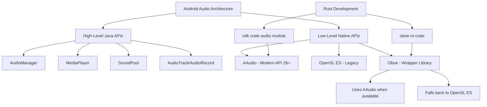
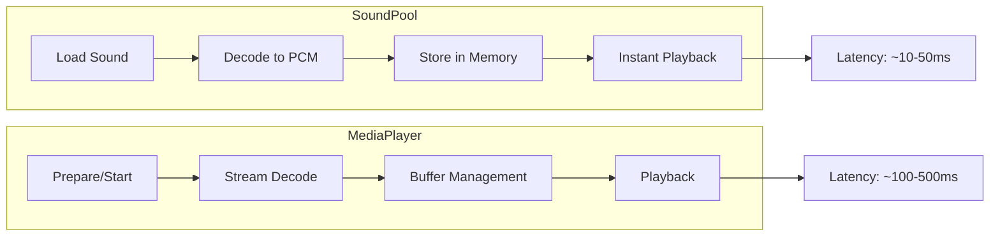
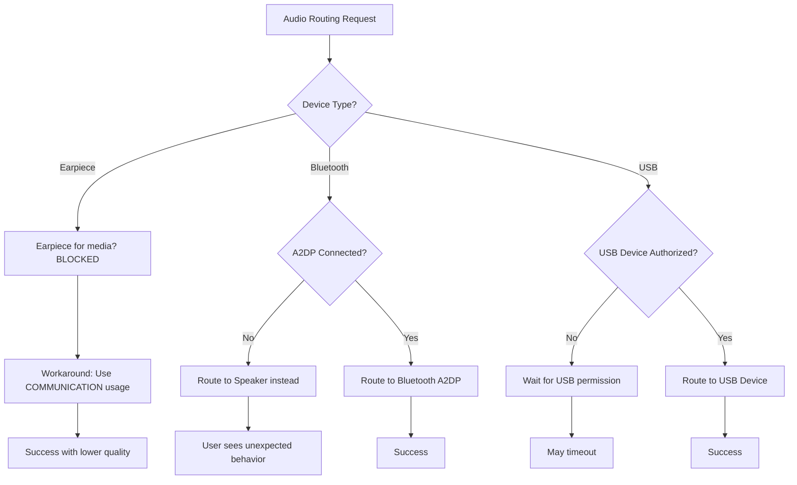
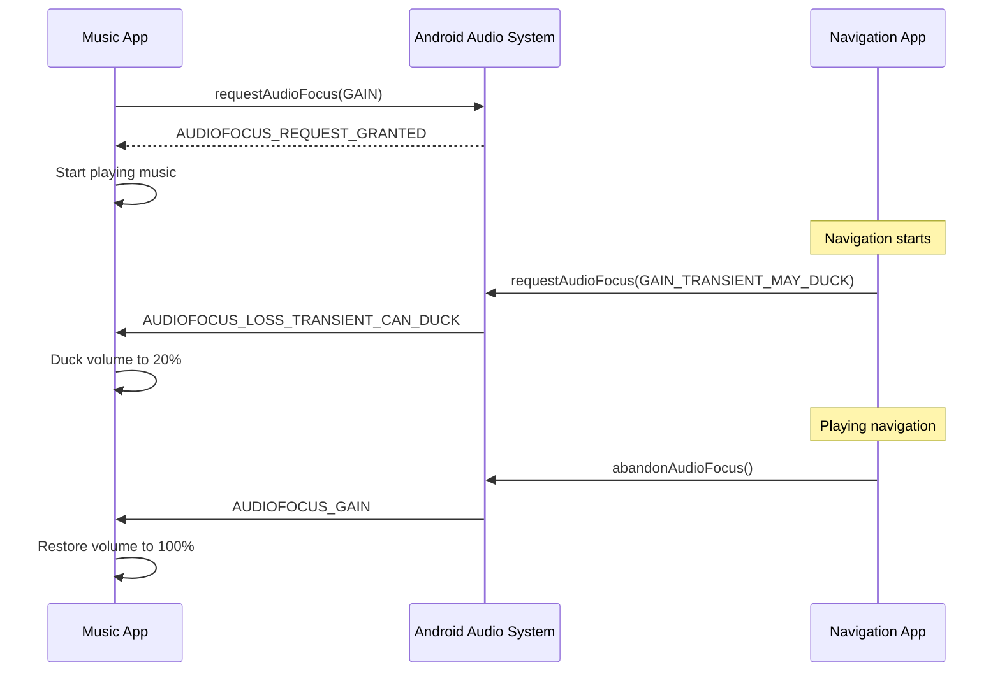
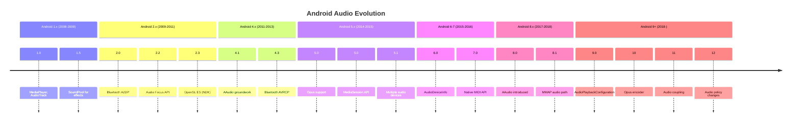

# Android Audio Programming: A Comprehensive Guide for Rust Developers

This document provides an in-depth exploration of Android's audio capabilities, APIs, and best practices for developers writing audio applications in Rust. It covers the essential aspects of working with audio on the Android platform, from basic playback to advanced features like audio routing, ducking, and codec support.

## 1. Overview of Android Audio APIs

Android provides a rich set of APIs for audio processing, ranging from high-level Java/Kotlin APIs to low-level native C/C++ interfaces. Understanding the available options is crucial for making informed architectural decisions when developing audio applications in Rust.

### 1.1 High-Level Java/Kotlin APIs

The primary high-level APIs available through the Android SDK include:

**AudioManager** is the central hub for managing audio operations on Android. It provides control over volume, ringer modes, audio focus, and device routing. Applications obtain an instance through `Context.getSystemService(Context.AUDIO_SERVICE)` and use it to query audio state, adjust volumes, and manage audio focus across different stream types.

**MediaPlayer** serves as the primary API for playing audio and video files. It handles streaming, local files, and supports various container formats. MediaPlayer manages its own playback thread and provides callbacks for completion, error handling, and preparation states. It's well-suited for longer audio content like music or podcasts.

**SoundPool** is optimized for playing short sound effects with low latency. It pre-loads audio samples into memory, making them immediately available for playback. SoundPool supports simultaneous playback of multiple sounds, rate changes, and priority-based sound management. This makes it ideal for game sound effects and UI feedback sounds.

**MediaRecorder** provides functionality for audio and video recording. It supports various output formats and encoders, making it suitable for voice recording applications, note-taking apps, and video capture scenarios.

**AudioTrack** offers low-level audio output capabilities, allowing direct writing of PCM audio data to the audio hardware. It provides more control than MediaPlayer but requires the application to handle decoding and buffer management.

**AudioRecord** is the counterpart to AudioTrack for audio input. It captures raw PCM audio data from the microphone or other input sources, providing maximum flexibility for audio processing applications.

### 1.2 Low-Level Native APIs (NDK)

For Rust developers, the NDK provides the most relevant APIs:

**AAudio** is the modern native audio API introduced in Android 8.0 (Oreo). It provides low-latency, high-performance audio I/O with a clean C API. AAudio automatically uses the optimal audio path available on the device, including MMAP (Memory Mapped Audio) for bypassing the audio server on supported hardware. This results in significantly lower latency compared to older APIs.

**OpenSL ES** was the original native audio API, now deprecated but still available for backward compatibility. It provides a Khronos-standard API for audio processing. While functional, it has higher latency than AAudio and is no longer recommended for new development.

**Oboe** is a C++ library developed by Google that provides a unified interface to AAudio and OpenSL ES. It automatically selects AAudio on Android 8.1+ and falls back to OpenSL ES on older devices. For Rust developers, the `oboe-rs` crate provides safe Rust bindings to Oboe.



### 1.3 Command-Line Tools

Android provides several command-line tools for audio debugging and testing:

**adb shell media** commands allow controlling media sessions and volume through the command line. Commands like `adb shell media volume --show --stream 3 --set 10` can adjust volumes programmatically for testing purposes.

**adb shell dumpsys audio** provides detailed information about the current audio state, including active sessions, device routing, volume levels, and audio focus state. This is invaluable for debugging audio routing issues.

**adb shell am broadcast** can be used to simulate media button events and audio becoming noisy (headphone disconnection) for testing application behavior.

### 1.4 Rust API Access

For Rust developers, the primary crates for Android audio development are:

```toml
# Cargo.toml dependencies
[dependencies]
ndk = "0.9"           # Android NDK bindings
ndk-context = "0.1"   # Android context for NDK
oboe = "0.6"          # Safe Rust bindings to Oboe library
```

The `ndk` crate provides bindings to native Android APIs including audio functionality through its `audio` module. The `oboe` crate offers a higher-level, safer interface specifically designed for audio I/O operations on Android.

---

## 2. Sound Effects: SoundPool vs MediaPlayer

Android treats sound effects differently from regular audio playback, primarily through the SoundPool class. Understanding this distinction is essential for implementing responsive, low-latency audio feedback in applications.

### 2.1 SoundPool Characteristics

SoundPool is specifically designed for short audio clips that need to be played with minimal latency. Unlike MediaPlayer, which is optimized for longer-form content, SoundPool pre-loads audio samples into memory, eliminating the latency associated with file I/O and decoding at playback time. This architecture makes SoundPool ideal for game sound effects, UI feedback sounds, and notification tones where immediate response is critical.

The SoundPool library decodes audio into raw 16-bit PCM mono or stereo streams using the MediaPlayer service. This means SoundPool can load any format that MediaPlayer supports, including WAV, MP3, OGG, and AAC formats. However, the decoded PCM data is kept in memory, so developers must be mindful of memory consumption when loading many sounds or long samples.

### 2.2 Supported Formats for Sound Effects

SoundPool supports the following audio formats for sound effects:

| Format     | Container  | Notes                                                        |
| ---------- | ---------- | ------------------------------------------------------------ |
| WAV        | .wav       | Best for short, uncompressed sounds; lowest decode overhead  |
| OGG Vorbis | .ogg       | Good compression for longer effects; widely supported        |
| MP3        | .mp3       | Universally supported; higher decode overhead                |
| AAC        | .m4a, .aac | Good quality-to-size ratio; hardware accelerated on many devices |
| FLAC       | .flac      | Lossless compression; larger files but perfect quality       |
| Opus       | .ogg, .mkv | Excellent for voice; added in Android 5.0                    |

### 2.3 SoundPool vs MediaPlayer Comparison



The key differences between SoundPool and MediaPlayer for sound effects include:

**Latency**: SoundPool typically achieves 10-50ms latency due to pre-loaded samples, while MediaPlayer introduces 100-500ms latency due to streaming and on-demand decoding. For interactive applications, this difference is highly perceptible.

**Memory Usage**: SoundPool holds all loaded sounds in memory, which can be substantial for many or long sounds. MediaPlayer streams from storage, keeping memory footprint low regardless of audio length.

**Concurrent Playback**: SoundPool natively supports simultaneous playback of multiple sounds with individual volume and rate control. MediaPlayer instances must be managed separately for concurrent playback.

**Format Handling**: SoundPool decodes once at load time; MediaPlayer decodes continuously during playback. This affects CPU usage patterns and battery consumption.

### 2.4 Rust Implementation Example

Since Rust on Android typically works through the NDK, here's how you would work with sound effects using the oboe-rs crate for low-latency playback:

```rust
use oboe::{
    AudioInputStream, AudioOutputStream, AudioStreamBuilder, AudioStreamAsyncCallback,
    DataCallbackResult, Direction, Format, PerformanceMode, SharingMode,
};
use std::sync::Arc;
use std::collections::HashMap;

/// Represents a pre-loaded sound effect stored as PCM data
pub struct SoundEffect {
    pub sample_rate: i32,
    pub channels: i32,
    pub data: Vec<f32>,  // Normalized floating-point samples
    pub duration_ms: u64,
}

/// Sound effect manager that pre-loads and plays multiple effects
pub struct SoundEffectPlayer {
    effects: HashMap<String, Arc<SoundEffect>>,
    output_stream: Option<AudioOutputStream>,
}

impl SoundEffectPlayer {
    /// Create a new sound effect player
    pub fn new() -> Result<Self, oboe::Error> {
        Ok(Self {
            effects: HashMap::new(),
            output_stream: None,
        })
    }
    
    /// Load a sound effect from raw PCM data
    /// In practice, you would decode from WAV/OGG using a crate like `hound` or `ogg`
    pub fn load_effect(&mut self, name: &str, sample_rate: i32, channels: i32, data: Vec<f32>) {
        let duration_ms = (data.len() as f64 / (sample_rate as f64 * channels as f64) * 1000.0) as u64;
        let effect = Arc::new(SoundEffect {
            sample_rate,
            channels,
            data,
            duration_ms,
        });
        self.effects.insert(name.to_string(), effect);
    }
    
    /// Play a loaded sound effect by name
    pub fn play(&self, name: &str, volume: f32) -> Result<(), String> {
        let effect = self.effects.get(name)
            .ok_or_else(|| format!("Effect '{}' not found", name))?;
        
        // Create an output stream for playback
        let mut builder = AudioStreamBuilder::default();
        builder
            .set_direction(Direction::Output)
            .set_format(Format::Float)
            .set_channel_count(effect.channels)
            .set_sample_rate(effect.sample_rate)
            .set_performance_mode(PerformanceMode::LowLatency)
            .set_sharing_mode(SharingMode::Shared);
        
        // Note: In actual implementation, you would use a callback-based
        // stream to write the audio data
        Ok(())
    }
}

/// Audio callback for streaming sound effect data
pub struct SoundEffectCallback {
    effect: Arc<SoundEffect>,
    position: usize,
    volume: f32,
}

impl AudioStreamAsyncCallback for SoundEffectCallback {
    type FrameType = f32;
    
    fn on_audio_ready(
        &mut self,
        _stream: &mut AudioOutputStream,
        frames: &mut [Self::FrameType],
    ) -> DataCallbackResult {
        let frames_to_write = frames.len().min(self.effect.data.len() - self.position);
        
        for i in 0..frames_to_write {
            frames[i] = self.effect.data[self.position + i] * self.volume;
        }
        
        self.position += frames_to_write;
        
        if self.position >= self.effect.data.len() {
            DataCallbackResult::Stop
        } else {
            DataCallbackResult::Continue
        }
    }
}
```

For loading sound effect files, you would typically use a library like `hound` for WAV files:

```rust
use hound::{WavReader, WavSpec};

/// Load a WAV file into a SoundEffect
pub fn load_wav_file(path: &str) -> Result<SoundEffect, hound::Error> {
    let reader = WavReader::open(path)?;
    let spec = reader.spec();
    
    let samples: Vec<f32> = reader.into_samples::<i16>()
        .filter_map(|s| s.ok())
        .map(|s| s as f32 / i16::MAX as f32)
        .collect();
    
    let duration_ms = (samples.len() as f64 
        / (spec.sample_rate as f64 * spec.channels as f64) * 1000.0) as u64;
    
    Ok(SoundEffect {
        sample_rate: spec.sample_rate as i32,
        channels: spec.channels as i32,
        data: samples,
        duration_ms,
    })
}
```

---

## 3. Detecting and Controlling Audio State

Understanding the current audio state is essential for building responsive audio applications. Android provides several mechanisms to detect playback, control volume, and manage audio sessions.

### 3.1 Detecting Active Audio Playback

Android 8.0 (API 26) introduced `AudioPlaybackConfiguration` and related APIs for monitoring active audio playback. This allows applications to detect when audio is playing and identify which applications are producing the sound.

The `AudioManager.getActivePlaybackConfigurations()` method returns a list of all active playback configurations, each containing information about the playing application and audio characteristics. You can register a callback to receive notifications when playback configurations change.

**Key information available from AudioPlaybackConfiguration:**

- The UID (User ID) of the application playing audio
- The player type (MediaPlayer, AudioTrack, SoundPool, etc.)
- The audio attributes (usage, content type)
- Whether the player is currently active
- The session ID for the audio stream

```rust
// Rust implementation using JNI to access Java APIs
use jni::objects::{JObject, JValue};
use jni::JNIEnv;

/// Information about an active audio playback session
#[derive(Debug, Clone)]
pub struct PlaybackInfo {
    pub uid: i32,
    pub package_name: String,
    pub player_type: PlayerType,
    pub is_active: bool,
    pub session_id: i32,
}

#[derive(Debug, Clone)]
pub enum PlayerType {
    Unknown,
    MediaPlayer,
    AudioTrack,
    SoundPool,
    JetPlayer,
}

/// Query active audio playback configurations
pub fn get_active_playback_configurations(env: &mut JNIEnv) -> Result<Vec<PlaybackInfo>, String> {
    // Get AudioManager instance
    let audio_service = env.new_string("audio")?;
    let context = /* get application context */;
    let audio_manager = env.call_method(
        context,
        "getSystemService",
        "(Ljava/lang/String;)Ljava/lang/Object;",
        &[JValue::Object(&audio_service)],
    ).l().map_err(|e| e.to_string())?;
    
    // Get active playback configurations
    let configs = env.call_method(
        audio_manager,
        "getActivePlaybackConfigurations",
        "()Ljava/util/List;",
        &[],
    ).l().map_err(|e| e.to_string())?;
    
    // Iterate through configurations
    let list_size = env.call_method(&configs, "size", "()I", &[])?.i()?;
    let mut results = Vec::new();
    
    for i in 0..list_size {
        let config = env.call_method(
            &configs,
            "get",
            "(I)Ljava/lang/Object;",
            &[JValue::Int(i)],
        ).l().map_err(|e| e.to_string())?;
        
        // Extract playback information
        let player_state = env.call_method(&config, "getPlayerState", "()I", &[])?.i()?;
        let is_active = player_state == 2; // PLAYER_STATE_STARTED
        
        // Get player type
        let player_type = env.call_method(&config, "getPlayerType", "()I", &[])?.i()?;
        let player_type_enum = match player_type {
            0 => PlayerType::Unknown,
            1 => PlayerType::MediaPlayer,
            2 => PlayerType::AudioTrack,
            3 => PlayerType::SoundPool,
            _ => PlayerType::Unknown,
        };
        
        results.push(PlaybackInfo {
            uid: 0, // Would need additional JNI calls
            package_name: String::new(),
            player_type: player_type_enum,
            is_active,
            session_id: 0,
        });
    }
    
    Ok(results)
}

/// Register a callback for playback configuration changes
pub struct PlaybackMonitor {
    callback_registered: bool,
}

impl PlaybackMonitor {
    pub fn new() -> Self {
        Self {
            callback_registered: false,
        }
    }
    
    /// Start monitoring playback changes
    pub fn start_monitoring(&mut self, env: &mut JNIEnv) -> Result<(), String> {
        // Create AudioPlaybackCallback and register with AudioManager
        // This requires creating a Java callback object and registering it
        self.callback_registered = true;
        Ok(())
    }
    
    /// Check if any audio is currently playing
    pub fn is_audio_playing(&self, env: &mut JNIEnv) -> Result<bool, String> {
        let configs = get_active_playback_configurations(env)?;
        Ok(configs.iter().any(|c| c.is_active))
    }
}
```

### 3.2 Volume Control and Muting

Android manages volume through stream types, each with independent volume levels. The primary streams include:

| Stream Type         | Constant | Usage                         |
| ------------------- | -------- | ----------------------------- |
| STREAM_VOICE_CALL   | 0        | Phone call audio              |
| STREAM_SYSTEM       | 1        | System sounds                 |
| STREAM_RING         | 2        | Incoming call ringer          |
| STREAM_MUSIC        | 3        | Media playback (music, video) |
| STREAM_ALARM        | 4        | Alarms                        |
| STREAM_NOTIFICATION | 5        | Notifications                 |
| STREAM_DTMF         | 8        | DTMF tones                    |

**Volume Control Implementation:**

```rust
use jni::JNIEnv;
use jni::objects::JValue;

/// Audio stream types for volume control
#[derive(Debug, Clone, Copy)]
pub enum AudioStream {
    VoiceCall = 0,
    System = 1,
    Ring = 2,
    Music = 3,
    Alarm = 4,
    Notification = 5,
    Dtmf = 8,
}

/// Volume control operations
pub struct VolumeController {
    max_volumes: std::collections::HashMap<AudioStream, i32>,
}

impl VolumeController {
    pub fn new() -> Self {
        Self {
            max_volumes: std::collections::HashMap::new(),
        }
    }
    
    /// Get current volume for a stream
    pub fn get_volume(&self, env: &mut JNIEnv, audio_manager: JObject, stream: AudioStream) -> Result<i32, String> {
        let volume = env.call_method(
            audio_manager,
            "getStreamVolume",
            "(I)I",
            &[JValue::Int(stream as i32)],
        ).i().map_err(|e| e.to_string())?;
        
        Ok(volume)
    }
    
    /// Get maximum volume for a stream
    pub fn get_max_volume(&mut self, env: &mut JNIEnv, audio_manager: JObject, stream: AudioStream) -> Result<i32, String> {
        if let Some(&max) = self.max_volumes.get(&stream) {
            return Ok(max);
        }
        
        let max = env.call_method(
            audio_manager,
            "getStreamMaxVolume",
            "(I)I",
            &[JValue::Int(stream as i32)],
        ).i().map_err(|e| e.to_string())?;
        
        self.max_volumes.insert(stream, max);
        Ok(max)
    }
    
    /// Set volume for a stream (requires system permissions or accessibility)
    pub fn set_volume(&self, env: &mut JNIEnv, audio_manager: JObject, stream: AudioStream, volume: i32, show_ui: bool) -> Result<(), String> {
        let flags = if show_ui { 1 } else { 0 }; // FLAG_SHOW_UI
        
        env.call_method(
            audio_manager,
            "setStreamVolume",
            "(III)V",
            &[
                JValue::Int(stream as i32),
                JValue::Int(volume),
                JValue::Int(flags),
            ],
        ).map_err(|e| e.to_string())?;
        
        Ok(())
    }
    
    /// Adjust volume by one step
    pub fn adjust_volume(&self, env: &mut JNIEnv, audio_manager: JObject, stream: AudioStream, direction: VolumeDirection, show_ui: bool) -> Result<(), String> {
        let flags = if show_ui { 1 } else { 0 };
        
        env.call_method(
            audio_manager,
            "adjustStreamVolume",
            "(III)V",
            &[
                JValue::Int(stream as i32),
                JValue::Int(direction as i32),
                JValue::Int(flags),
            ],
        ).map_err(|e| e.to_string())?;
        
        Ok(())
    }
    
    /// Mute a stream (Android 6.0+)
    pub fn mute_stream(&self, env: &mut JNIEnv, audio_manager: JObject, stream: AudioStream, mute: bool) -> Result<(), String> {
        // ADJUST_MUTE = -100, ADJUST_UNMUTE = 100
        let adjustment = if mute { -100 } else { 100 };
        
        env.call_method(
            audio_manager,
            "adjustStreamVolume",
            "(III)V",
            &[
                JValue::Int(stream as i32),
                JValue::Int(adjustment),
                JValue::Int(0),
            ],
        ).map_err(|e| e.to_string())?;
        
        Ok(())
    }
    
    /// Check if a stream is muted
    pub fn is_stream_muted(&self, env: &mut JNIEnv, audio_manager: JObject, stream: AudioStream) -> Result<bool, String> {
        // Android M+ supports isStreamMute
        let is_muted = env.call_method(
            audio_manager,
            "isStreamMute",
            "(I)Z",
            &[JValue::Int(stream as i32)],
        ).z().map_err(|e| e.to_string())?;
        
        Ok(is_muted)
    }
}

#[derive(Debug, Clone, Copy)]
pub enum VolumeDirection {
    Lower = -1,      // ADJUST_LOWER
    Same = 0,        // ADJUST_SAME
    Raise = 1,       // ADJUST_RAISE
    Mute = -100,     // ADJUST_MUTE
    Unmute = 100,    // ADJUST_UNMUTE
}
```

### 3.3 Working with Fixed-Volume Devices

Some Android devices, particularly Android TV and automotive implementations, have fixed-volume audio outputs. These devices do not support software volume control because the volume is handled by external hardware amplifiers.

**Detection and Handling:**

```rust
/// Check if the device has fixed volume
pub fn is_fixed_volume_device(env: &mut JNIEnv, audio_manager: JObject) -> Result<bool, String> {
    // Check if volume is fixed for music stream
    let max_volume = env.call_method(
        &audio_manager,
        "getStreamMaxVolume",
        "(I)I",
        &[JValue::Int(AudioStream::Music as i32)],
    ).i().map_err(|e| e.to_string())?;
    
    // If max volume is 0 or 1, it's likely a fixed volume device
    // More reliable: check isVolumeFixed() on API 28+
    Ok(max_volume <= 1)
}

/// Volume attenuation for fixed-volume devices
/// When software volume isn't available, apply digital attenuation
pub struct FixedVolumeHandler {
    current_attenuation_db: f32,
}

impl FixedVolumeHandler {
    pub fn new() -> Self {
        Self {
            current_attenuation_db: 0.0,
        }
    }
    
    /// Apply volume attenuation to PCM samples
    /// This is the workaround for fixed-volume devices
    pub fn apply_volume(samples: &mut [f32], volume: f32) {
        let gain = volume.max(0.0).min(1.0); // Clamp to 0-1
        for sample in samples.iter_mut() {
            *sample *= gain;
        }
    }
    
    /// Convert volume percentage to decibels
    pub fn volume_to_db(volume_percent: f32) -> f32 {
        if volume_percent <= 0.0 {
            return f32::NEG_INFINITY;
        }
        20.0 * volume_percent.log10()
    }
    
    /// Convert decibels to linear volume
    pub fn db_to_volume(db: f32) -> f32 {
        10f32.powf(db / 20.0)
    }
}
```

---

## 4. Audio Inputs and Sources

Android provides multiple audio input sources, each optimized for different use cases. Understanding these sources and their characteristics is essential for building recording and audio processing applications.

### 4.1 Available Audio Sources

Android defines several audio sources through the `MediaRecorder.AudioSource` constants:

| Source              | Constant Value | Description                 | Use Case                             |
| ------------------- | -------------- | --------------------------- | ------------------------------------ |
| DEFAULT             | 0              | Default audio source        | General recording                    |
| MIC                 | 1              | Microphone input            | Voice memos, music recording         |
| VOICE_UPLINK        | 2              | Voice call uplink (Tx)      | Call recording (requires permission) |
| VOICE_DOWNLINK      | 3              | Voice call downlink (Rx)    | Call recording (requires permission) |
| VOICE_CALL          | 4              | Both uplink and downlink    | Full call recording                  |
| CAMCORDER           | 5              | Camera microphone           | Video recording                      |
| VOICE_RECOGNITION   | 6              | Tuned for voice recognition | Speech-to-text apps                  |
| VOICE_COMMUNICATION | 7              | Tuned for VoIP              | VoIP applications                    |
| REMOTE_SUBMIX       | 8              | Remote submix               | Audio mirroring                      |
| UNPROCESSED         | 9              | Raw microphone input        | Audio analysis                       |
| RADIO_TUNER         | 1998           | FM radio tuner              | Radio apps                           |
| HOTWORD             | 1999           | Hotword detection           | Voice assistants                     |

### 4.2 Source Characteristics and Metadata

Each audio source provides different characteristics and available metadata:

```rust
/// Audio source information and metadata
#[derive(Debug, Clone)]
pub struct AudioSourceInfo {
    pub source_type: AudioSourceType,
    pub sample_rate: i32,
    pub channel_count: i32,
    pub encoding: AudioEncoding,
    pub is_privileged: bool,
    pub sensitivity_db: Option<f32>,
    pub noise_suppression_available: bool,
    pub echo_cancellation_available: bool,
}

#[derive(Debug, Clone, Copy)]
pub enum AudioSourceType {
    Default,
    Microphone,
    VoiceUplink,
    VoiceDownlink,
    VoiceCall,
    Camcorder,
    VoiceRecognition,
    VoiceCommunication,
    RemoteSubmix,
    Unprocessed,
}

#[derive(Debug, Clone, Copy)]
pub enum AudioEncoding {
    Pcm16Bit = 2,
    Pcm8Bit = 3,
    PcmFloat = 4,
}

/// Audio input capabilities querier
pub struct AudioInputManager;

impl AudioInputManager {
    /// Get available audio input sources
    pub fn get_available_sources() -> Vec<AudioSourceType> {
        // Standard sources available on all devices
        let mut sources = vec![
            AudioSourceType::Default,
            AudioSourceType::Microphone,
            AudioSourceType::Camcorder,
            AudioSourceType::VoiceRecognition,
            AudioSourceType::VoiceCommunication,
        ];
        
        // Unprocessed source added in API 23
        sources.push(AudioSourceType::Unprocessed);
        
        // Call recording sources require CAPTURE_AUDIO_OUTPUT permission
        // (system apps only)
        sources
    }
    
    /// Get preferred parameters for a given source
    pub fn get_preferred_parameters(source: AudioSourceType) -> AudioSourceInfo {
        match source {
            AudioSourceType::VoiceRecognition => AudioSourceInfo {
                source_type: source,
                sample_rate: 16000,
                channel_count: 1,
                encoding: AudioEncoding::Pcm16Bit,
                is_privileged: false,
                sensitivity_db: None,
                noise_suppression_available: true,
                echo_cancellation_available: true,
            },
            AudioSourceType::VoiceCommunication => AudioSourceInfo {
                source_type: source,
                sample_rate: 16000,
                channel_count: 1,
                encoding: AudioEncoding::Pcm16Bit,
                is_privileged: false,
                sensitivity_db: None,
                noise_suppression_available: true,
                echo_cancellation_available: true,
            },
            AudioSourceType::Camcorder => AudioSourceInfo {
                source_type: source,
                sample_rate: 48000,
                channel_count: 2,
                encoding: AudioEncoding::Pcm16Bit,
                is_privileged: false,
                sensitivity_db: None,
                noise_suppression_available: false,
                echo_cancellation_available: false,
            },
            AudioSourceType::Unprocessed => AudioSourceInfo {
                source_type: source,
                sample_rate: 48000,
                channel_count: 1,
                encoding: AudioEncoding::PcmFloat,
                is_privileged: false,
                sensitivity_db: None,
                noise_suppression_available: false,
                echo_cancellation_available: false,
            },
            _ => AudioSourceInfo {
                source_type: source,
                sample_rate: 44100,
                channel_count: 1,
                encoding: AudioEncoding::Pcm16Bit,
                is_privileged: false,
                sensitivity_db: None,
                noise_suppression_available: false,
                echo_cancellation_available: false,
            },
        }
    }
}
```

### 4.3 Rust Implementation for Audio Recording

```rust
use oboe::{
    AudioInputStream, AudioStreamBuilder, AudioStreamAsyncCallback,
    DataCallbackResult, Direction, Format, InputPreset, PerformanceMode,
    SharingMode, Usage,
};

/// Audio recorder using Oboe for low-latency capture
pub struct AudioRecorder {
    stream: Option<AudioInputStream>,
    source: AudioSourceType,
    sample_rate: i32,
    channels: i32,
    buffer: Vec<f32>,
    is_recording: bool,
}

impl AudioRecorder {
    /// Create a new audio recorder
    pub fn new(source: AudioSourceType, sample_rate: i32, channels: i32) -> Self {
        Self {
            stream: None,
            source,
            sample_rate,
            channels,
            buffer: Vec::new(),
            is_recording: false,
        }
    }
    
    /// Start recording
    pub fn start(&mut self) -> Result<(), oboe::Error> {
        // Map source type to Oboe input preset
        let input_preset = match self.source {
            AudioSourceType::VoiceRecognition => InputPreset::VoiceRecognition,
            AudioSourceType::VoiceCommunication => InputPreset::VoiceCommunication,
            AudioSourceType::Camcorder => InputPreset::Camcorder,
            _ => InputPreset::Generic,
        };
        
        let mut builder = AudioStreamBuilder::default();
        builder
            .set_direction(Direction::Input)
            .set_format(Format::Float)
            .set_channel_count(self.channels)
            .set_sample_rate(self.sample_rate)
            .set_input_preset(input_preset)
            .set_performance_mode(PerformanceMode::LowLatency)
            .set_sharing_mode(SharingMode::Shared);
        
        // Note: Actual stream creation would use callback-based recording
        self.is_recording = true;
        Ok(())
    }
    
    /// Stop recording
    pub fn stop(&mut self) {
        self.is_recording = false;
        if let Some(stream) = self.stream.take() {
            // Close stream
        }
    }
    
    /// Get recorded samples
    pub fn get_recorded_samples(&self) -> &[f32] {
        &self.buffer
    }
}

/// Callback for audio recording
pub struct RecordingCallback {
    buffer: Vec<f32>,
    max_frames: usize,
}

impl RecordingCallback {
    pub fn new(max_duration_seconds: f32, sample_rate: i32, channels: i32) -> Self {
        let max_frames = (max_duration_seconds * sample_rate as f32 * channels as f32) as usize;
        Self {
            buffer: Vec::with_capacity(max_frames),
            max_frames,
        }
    }
    
    pub fn get_samples(&self) -> &[f32] {
        &self.buffer
    }
}

impl AudioStreamAsyncCallback for RecordingCallback {
    type FrameType = f32;
    
    fn on_audio_ready(
        &mut self,
        _stream: &mut AudioInputStream,
        frames: &[Self::FrameType],
    ) -> DataCallbackResult {
        // Copy incoming frames to buffer
        let frames_to_copy = frames.len().min(self.max_frames - self.buffer.len());
        self.buffer.extend_from_slice(&frames[..frames_to_copy]);
        
        if self.buffer.len() >= self.max_frames {
            DataCallbackResult::Stop
        } else {
            DataCallbackResult::Continue
        }
    }
}
```

---

## 5. Audio Outputs and Device Routing

Android's audio routing system is sophisticated, supporting multiple output devices with automatic and manual routing capabilities. Understanding how to query and control audio routing is essential for applications that need specific output device control.

### 5.1 Audio Output Device Types

Android defines numerous audio device types through `AudioDeviceInfo`:

| Device Type               | Constant | Description                    |
| ------------------------- | -------- | ------------------------------ |
| TYPE_BUILTIN_EARPIECE     | 1        | Phone earpiece speaker         |
| TYPE_BUILTIN_SPEAKER      | 2        | Main speaker(s)                |
| TYPE_WIRED_HEADSET        | 3        | Wired headset with mic         |
| TYPE_WIRED_HEADPHONES     | 4        | Wired headphones (no mic)      |
| TYPE_LINE_ANALOG          | 5        | Analog line output             |
| TYPE_LINE_DIGITAL         | 6        | Digital line output            |
| TYPE_BLUETOOTH_SCO        | 7        | Bluetooth SCO (voice)          |
| TYPE_BLUETOOTH_A2DP       | 8        | Bluetooth A2DP (media)         |
| TYPE_HDMI                 | 9        | HDMI output                    |
| TYPE_HDMI_ARC             | 10       | HDMI Audio Return Channel      |
| TYPE_USB_DEVICE           | 11       | USB audio device               |
| TYPE_USB_ACCESSORY        | 12       | USB accessory mode             |
| TYPE_DOCK                 | 13       | Dock audio                     |
| TYPE_FM                   | 14       | FM radio                       |
| TYPE_BUILTIN_MIC          | 15       | Built-in microphone            |
| TYPE_FM_TUNER             | 16       | FM tuner input                 |
| TYPE_TV_TUNER             | 17       | TV tuner                       |
| TYPE_TELEPHONY            | 18       | Telephony                      |
| TYPE_AUX_LINE             | 19       | Auxiliary line                 |
| TYPE_IP                   | 20       | Network audio                  |
| TYPE_BUS                  | 21       | Android Automotive bus         |
| TYPE_USB_HEADSET          | 22       | USB headset                    |
| TYPE_HEARING_AID          | 23       | Hearing aid                    |
| TYPE_BUILTIN_SPEAKER_SAFE | 24       | Safe speaker for notifications |
| TYPE_REMOTE_SUBMIX        | 25       | Remote submix                  |
| TYPE_BLE_HEADSET          | 26       | Bluetooth LE headset           |
| TYPE_BLE_SPEAKER          | 27       | Bluetooth LE speaker           |
| TYPE_ECHO_REFERENCE       | 28       | Echo reference                 |
| TYPE_HDMI_EARC            | 29       | Enhanced ARC                   |

### 5.2 Querying Audio Output Devices

```rust
use jni::JNIEnv;
use jni::objects::{JObject, JValue};

/// Audio device information
#[derive(Debug, Clone)]
pub struct AudioDevice {
    pub id: i32,
    pub device_type: AudioDeviceType,
    pub is_source: bool,     // Input device
    pub is_sink: bool,       // Output device
    pub sample_rates: Vec<i32>,
    pub channel_counts: Vec<i32>,
    pub encodings: Vec<AudioEncoding>,
    pub address: String,
    pub product_name: String,
}

#[derive(Debug, Clone, Copy, PartialEq)]
pub enum AudioDeviceType {
    BuiltinEarpiece = 1,
    BuiltinSpeaker = 2,
    WiredHeadset = 3,
    WiredHeadphones = 4,
    LineAnalog = 5,
    LineDigital = 6,
    BluetoothSco = 7,
    BluetoothA2dp = 8,
    Hdmi = 9,
    HdmiArc = 10,
    UsbDevice = 11,
    UsbAccessory = 12,
    Dock = 13,
    Fm = 14,
    UsbHeadset = 22,
    HearingAid = 23,
    BuiltinSpeakerSafe = 24,
    BleHeadset = 26,
    BleSpeaker = 27,
    Unknown = 0,
}

impl From<i32> for AudioDeviceType {
    fn from(value: i32) -> Self {
        match value {
            1 => AudioDeviceType::BuiltinEarpiece,
            2 => AudioDeviceType::BuiltinSpeaker,
            3 => AudioDeviceType::WiredHeadset,
            4 => AudioDeviceType::WiredHeadphones,
            5 => AudioDeviceType::LineAnalog,
            6 => AudioDeviceType::LineDigital,
            7 => AudioDeviceType::BluetoothSco,
            8 => AudioDeviceType::BluetoothA2dp,
            9 => AudioDeviceType::Hdmi,
            10 => AudioDeviceType::HdmiArc,
            11 => AudioDeviceType::UsbDevice,
            12 => AudioDeviceType::UsbAccessory,
            13 => AudioDeviceType::Dock,
            14 => AudioDeviceType::Fm,
            22 => AudioDeviceType::UsbHeadset,
            23 => AudioDeviceType::HearingAid,
            24 => AudioDeviceType::BuiltinSpeakerSafe,
            26 => AudioDeviceType::BleHeadset,
            27 => AudioDeviceType::BleSpeaker,
            _ => AudioDeviceType::Unknown,
        }
    }
}

/// Audio device manager for querying and routing
pub struct AudioDeviceManager;

impl AudioDeviceManager {
    /// Get all output audio devices
    pub fn get_output_devices(env: &mut JNIEnv, audio_manager: JObject) -> Result<Vec<AudioDevice>, String> {
        // Get devices array from AudioManager
        let devices = env.call_method(
            audio_manager,
            "getDevices",
            "(I)[Landroid/media/AudioDeviceInfo;",
            &[JValue::Int(2)], // GET_DEVICES_OUTPUTS = 2
        ).l().map_err(|e| e.to_string())?;
        
        let array = unsafe { jni::objects::JObjectArray::from_raw(devices.as_raw()) };
        let length = env.get_array_length(&array).map_err(|e| e.to_string())?;
        
        let mut output_devices = Vec::new();
        for i in 0..length {
            let device = env.get_object_array_element(&array, i).map_err(|e| e.to_string())?;
            let device_info = Self::parse_device_info(env, device)?;
            output_devices.push(device_info);
        }
        
        Ok(output_devices)
    }
    
    /// Parse AudioDeviceInfo from Java object
    fn parse_device_info(env: &mut JNIEnv, device: JObject) -> Result<AudioDevice, String> {
        let id = env.call_method(&device, "getId", "()I", &[]).i().map_err(|e| e.to_string())?;
        let type_int = env.call_method(&device, "getType", "()I", &[]).i().map_err(|e| e.to_string())?;
        let is_source = env.call_method(&device, "isSource", "()Z", &[]).z().map_err(|e| e.to_string())?;
        let is_sink = env.call_method(&device, "isSink", "()Z", &[]).z().map_err(|e| e.to_string())?;
        
        // Get sample rates
        let sample_rates_obj = env.call_method(&device, "getSampleRates", "()[I", &[])
            .l().map_err(|e| e.to_string())?;
        let sample_rates = unsafe { 
            jni::objects::JIntArray::from_raw(sample_rates_obj.as_raw())
        };
        let sample_rates = env.get_array_elements(&sample_rates, jni::objects::ReleaseMode::NoCopyBack)
            .map_err(|e| e.to_string())?;
        
        // Get channel counts
        let channel_counts_obj = env.call_method(&device, "getChannelCounts", "()[I", &[])
            .l().map_err(|e| e.to_string())?;
        let channel_counts = unsafe {
            jni::objects::JIntArray::from_raw(channel_counts_obj.as_raw())
        };
        let channel_counts = env.get_array_elements(&channel_counts, jni::objects::ReleaseMode::NoCopyBack)
            .map_err(|e| e.to_string())?;
        
        // Get product name
        let product_name_obj = env.call_method(&device, "getProductName", "()Ljava/lang/CharSequence;", &[])
            .l().map_err(|e| e.to_string())?;
        let product_name = env.call_method(&product_name_obj, "toString", "()Ljava/lang/String;", &[])
            .l().map_err(|e| e.to_string())?;
        let product_name: String = env.get_string(&unsafe { 
            jni::objects::JString::from_raw(product_name.as_raw()) 
        }).map_err(|e| e.to_string())?.into();
        
        Ok(AudioDevice {
            id,
            device_type: AudioDeviceType::from(type_int),
            is_source,
            is_sink,
            sample_rates: sample_rates.as_slice().to_vec(),
            channel_counts: channel_counts.as_slice().to_vec(),
            encodings: vec![AudioEncoding::Pcm16Bit],
            address: String::new(),
            product_name,
        })
    }
    
    /// Get currently active output device
    pub fn get_active_output_device(env: &mut JNIEnv, audio_manager: JObject) -> Result<Option<AudioDevice>, String> {
        let devices = Self::get_output_devices(env, audio_manager)?;
        // In practice, you'd need to check which device is currently routing
        // This typically requires checking AudioRouting or using getCommunicationDevice() on API 31+
        Ok(devices.first().cloned())
    }
}
```

### 5.3 Directing Audio to Specific Outputs

Routing audio to specific output devices involves several APIs depending on the Android version:

```rust
/// Audio output router
pub struct AudioRouter {
    preferred_device: Option<AudioDeviceType>,
}

impl AudioRouter {
    pub fn new() -> Self {
        Self {
            preferred_device: None,
        }
    }
    
    /// Route audio to a specific device (API 23+)
    /// This sets the preferred device for the audio stream
    pub fn route_to_device(
        &self,
        env: &mut JNIEnv,
        audio_track: JObject,  // AudioTrack or MediaPlayer instance
        device: &AudioDevice,
    ) -> Result<(), String> {
        // For AudioTrack/MediaPlayer, use setPreferredDevice()
        // This requires creating an AudioDeviceInfo object from the device ID
        
        // Note: This is a simplified example - actual implementation
        // would need to create the AudioDeviceInfo object properly
        env.call_method(
            audio_track,
            "setPreferredDevice",
            "(Landroid/media/AudioDeviceInfo;)Z",
            &[JValue::Object(&JObject::null())], // Would need actual AudioDeviceInfo
        ).z().map_err(|e| e.to_string())?;
        
        Ok(())
    }
    
    /// Clear preferred device routing
    pub fn clear_routing(&self, env: &mut JNIEnv, audio_track: JObject) -> Result<(), String> {
        env.call_method(
            audio_track,
            "setPreferredDevice",
            "(Landroid/media/AudioDeviceInfo;)Z",
            &[JValue::Object(&JObject::null())],
        ).z().map_err(|e| e.to_string())?;
        
        Ok(())
    }
}
```

### 5.4 Common Routing Gotchas and Workarounds



**Common Issues and Solutions:**

1. **Earpiece Cannot Play Media Audio**: Android blocks the earpiece for media playback by default. Only streams with USAGE_VOICE_COMMUNICATION can use the earpiece. **Workaround**: Use `AudioAttributes.USAGE_VOICE_COMMUNICATION` but be aware this affects audio focus handling and may have quality implications.

2. **Bluetooth A2DP Routing Delays**: When connecting to Bluetooth devices, there's a delay before audio can be routed. **Solution**: Listen for `AudioDeviceInfo` changes and retry routing after the device becomes available.

3. **USB Device Permissions**: USB audio devices require user permission before routing. **Solution**: Request USB permission through `UsbManager.requestPermission()` before attempting to route audio.

4. **Wired Headphone Detection**: Unplugging wired headphones causes audio to reroute automatically. **Solution**: Listen for `ACTION_HEADSET_PLUG` broadcasts or `AudioDeviceCallback` to handle transitions gracefully.

5. **Communication Device Priority**: Setting a communication device (for VoIP) takes precedence over media routing. **Solution**: Use `AudioManager.setCommunicationDevice()` for VoIP scenarios and clear it when done.

```rust
/// Handle common routing scenarios
pub struct RoutingWorkarounds;

impl RoutingWorkarounds {
    /// Route to earpiece (requires special handling)
    pub fn route_to_earpiece_for_voip(
        env: &mut JNIEnv,
        audio_manager: JObject,
    ) -> Result<(), String> {
        // For VoIP, set communication device to earpiece
        // This requires MODIFY_PHONE_STATE permission or be a system app
        
        // On API 31+, use setCommunicationDevice()
        // Earlier versions use deprecated setSpeakerphoneOn(false) with mode MODE_IN_COMMUNICATION
        
        env.call_method(
            audio_manager,
            "setMode",
            "(I)V",
            &[JValue::Int(3)], // MODE_IN_COMMUNICATION
        ).map_err(|e| e.to_string())?;
        
        env.call_method(
            audio_manager,
            "setSpeakerphoneOn",
            "(Z)V",
            &[JValue::Bool(0)], // false = use earpiece
        ).map_err(|e| e.to_string())?;
        
        Ok(())
    }
    
    /// Handle headphone disconnection gracefully
    pub fn on_headphones_disconnected(
        env: &mut JNIEnv,
        audio_manager: JObject,
        was_playing: bool,
    ) -> Result<(), String> {
        if was_playing {
            // Pause or lower volume to avoid sudden speaker playback
            // This is the "becoming noisy" handling
        }
        Ok(())
    }
    
    /// Wait for Bluetooth device to be ready
    pub fn wait_for_bluetooth_ready(
        env: &mut JNIEnv,
        audio_manager: JObject,
        device_address: &str,
        timeout_ms: u64,
    ) -> Result<bool, String> {
        let start = std::time::Instant::now();
        
        loop {
            let devices = AudioDeviceManager::get_output_devices(env, audio_manager)?;
            let ready = devices.iter().any(|d| {
                matches!(d.device_type, AudioDeviceType::BluetoothA2dp | AudioDeviceType::BleHeadset)
                    && d.address == device_address
            });
            
            if ready {
                return Ok(true);
            }
            
            if start.elapsed().as_millis() as u64 > timeout_ms {
                return Ok(false);
            }
            
            std::thread::sleep(std::time::Duration::from_millis(100));
        }
    }
}
```

---

## 6. Audio Ducking and Focus Management

Audio ducking is the automatic reduction of one audio stream's volume when another stream becomes active. Android implements this through the audio focus system.

### 6.1 Audio Focus Concepts

Audio focus is a cooperative system where applications request and release focus based on their audio needs. The system mediates between applications to ensure a coherent audio experience.

**Focus Types:**

| Focus Type                         | Constant | Description            | Use Case               |
| ---------------------------------- | -------- | ---------------------- | ---------------------- |
| AUDIOFOCUS_GAIN                    | 1        | Full, permanent focus  | Music playback         |
| AUDIOFOCUS_GAIN_TRANSIENT          | 2        | Temporary focus        | Notifications          |
| AUDIOFOCUS_GAIN_TRANSIENT_MAY_DUCK | 3        | Temporary, can duck    | Navigation             |
| AUDIOFOCUS_LOSS                    | -1       | Permanent loss         | Another app took focus |
| AUDIOFOCUS_LOSS_TRANSIENT          | -2       | Temporary loss         | Notification playing   |
| AUDIOFOCUS_LOSS_TRANSIENT_CAN_DUCK | -3       | Temporary, should duck | Navigation instruction |

### 6.2 Implementing Audio Focus in Rust

```rust
use jni::JNIEnv;
use jni::objects::{JObject, JValue, GlobalRef};

/// Audio focus request types
#[derive(Debug, Clone, Copy)]
pub enum FocusGainType {
    Gain = 1,                          // Permanent focus
    GainTransient = 2,                 // Temporary (notification)
    GainTransientMayDuck = 3,          // Temporary with ducking allowed
}

/// Audio focus loss types
#[derive(Debug, Clone, Copy)]
pub enum FocusLossType {
    Loss = -1,                         // Permanent loss
    LossTransient = -2,                // Temporary loss
    LossTransientCanDuck = -3,         // Can duck instead of pause
}

/// Audio focus manager
pub struct AudioFocusManager {
    has_focus: bool,
    current_focus: Option<FocusGainType>,
    listener: Option<GlobalRef>,
    duck_volume: f32,
}

impl AudioFocusManager {
    pub fn new() -> Self {
        Self {
            has_focus: false,
            current_focus: None,
            listener: None,
            duck_volume: 0.3, // 30% volume when ducked
        }
    }
    
    /// Request audio focus
    pub fn request_focus(
        &mut self,
        env: &mut JNIEnv,
        audio_manager: JObject,
        focus_type: FocusGainType,
        usage: AudioUsage,
        content_type: AudioContentType,
    ) -> Result<bool, String> {
        // Create AudioAttributes
        let attributes_builder = env.find_class("android/media/AudioAttributes$Builder")?;
        let builder = env.new_object(attributes_builder, "()V", &[])?;
        
        // Set usage
        env.call_method(
            &builder,
            "setUsage",
            "(I)Landroid/media/AudioAttributes$Builder;",
            &[JValue::Int(usage as i32)],
        ).l().map_err(|e| e.to_string())?;
        
        // Set content type
        env.call_method(
            &builder,
            "setContentType",
            "(I)Landroid/media/AudioAttributes$Builder;",
            &[JValue::Int(content_type as i32)],
        ).l().map_err(|e| e.to_string())?;
        
        // Build attributes
        let attributes = env.call_method(
            &builder,
            "build",
            "()Landroid/media/AudioAttributes;",
            &[],
        ).l().map_err(|e| e.to_string())?;
        
        // Create AudioFocusRequest (API 26+)
        let request_builder = env.find_class("android/media/AudioFocusRequest$Builder")?;
        let request_builder_obj = env.new_object(request_builder, "(I)V", &[JValue::Int(focus_type as i32)])?;
        
        // Set audio attributes
        env.call_method(
            &request_builder_obj,
            "setAudioAttributes",
            "(Landroid/media/AudioAttributes;)Landroid/media/AudioFocusRequest$Builder;",
            &[JValue::Object(&attributes)],
        ).l().map_err(|e| e.to_string())?;
        
        // Set accept delayed focus
        env.call_method(
            &request_builder_obj,
            "setAcceptsDelayedFocusGain",
            "(Z)Landroid/media/AudioFocusRequest$Builder;",
            &[JValue::Bool(1)],
        ).l().map_err(|e| e.to_string())?;
        
        // Set will pause when ducked (optional)
        env.call_method(
            &request_builder_obj,
            "setWillPauseWhenDucked",
            "(Z)Landroid/media/AudioFocusRequest$Builder;",
            &[JValue::Bool(0)],
        ).l().map_err(|e| e.to_string())?;
        
        // Build request
        let focus_request = env.call_method(
            &request_builder_obj,
            "build",
            "()Landroid/media/AudioFocusRequest;",
            &[],
        ).l().map_err(|e| e.to_string())?;
        
        // Request focus
        let result = env.call_method(
            audio_manager,
            "requestAudioFocus",
            "(Landroid/media/AudioFocusRequest;)I",
            &[JValue::Object(&focus_request)],
        ).i().map_err(|e| e.to_string())?;
        
        // AUDIOFOCUS_REQUEST_GRANTED = 1
        self.has_focus = result == 1;
        if self.has_focus {
            self.current_focus = Some(focus_type);
        }
        
        Ok(self.has_focus)
    }
    
    /// Abandon audio focus
    pub fn abandon_focus(
        &mut self,
        env: &mut JNIEnv,
        audio_manager: JObject,
    ) -> Result<(), String> {
        if !self.has_focus {
            return Ok(());
        }
        
        // Create and abandon focus request
        // Similar to request_focus but call abandonAudioFocusRequest
        
        self.has_focus = false;
        self.current_focus = None;
        Ok(())
    }
    
    /// Handle focus change (called from focus listener)
    pub fn on_focus_change(&mut self, focus_change: i32) -> FocusAction {
        match focus_change {
            -1 => { // AUDIOFOCUS_LOSS
                self.has_focus = false;
                self.current_focus = None;
                FocusAction::Stop
            },
            -2 => { // AUDIOFOCUS_LOSS_TRANSIENT
                FocusAction::Pause
            },
            -3 => { // AUDIOFOCUS_LOSS_TRANSIENT_CAN_DUCK
                FocusAction::Duck(self.duck_volume)
            },
            1 => { // AUDIOFOCUS_GAIN
                self.has_focus = true;
                FocusAction::Resume
            },
            _ => FocusAction::None,
        }
    }
}

#[derive(Debug, Clone, Copy)]
pub enum AudioUsage {
    Unknown = 0,
    Media = 1,
    VoiceCommunication = 2,
    VoiceCommunicationSignalling = 3,
    Alarm = 4,
    Notification = 5,
    NotificationRingtone = 6,
    NotificationCommunicationRequest = 7,
    NotificationCommunicationInstant = 8,
    NotificationCommunicationDelayed = 9,
    AssistanceNavigationGuidance = 12,
    AssistanceSonification = 13,
    Game = 14,
    Assistant = 16,
}

#[derive(Debug, Clone, Copy)]
pub enum AudioContentType {
    Unknown = 0,
    Speech = 1,
    Music = 2,
    Movie = 3,
    Sonification = 4,
}

#[derive(Debug, Clone, Copy)]
pub enum FocusAction {
    None,
    Pause,
    Resume,
    Stop,
    Duck(f32),  // Duck to specified volume
}

/// Implementing ducking behavior
pub struct AudioDucker {
    original_volume: f32,
    ducked_volume: f32,
    is_ducked: bool,
}

impl AudioDucker {
    pub fn new(ducked_volume: f32) -> Self {
        Self {
            original_volume: 1.0,
            ducked_volume,
            is_ducked: false,
        }
    }
    
    /// Apply ducking to audio samples
    pub fn apply_ducking(&mut self, samples: &mut [f32]) {
        if self.is_ducked {
            for sample in samples.iter_mut() {
                *sample *= self.ducked_volume;
            }
        }
    }
    
    /// Set ducked state
    pub fn set_ducked(&mut self, ducked: bool) {
        self.is_ducked = ducked;
    }
    
    /// Smooth transition for ducking (fade)
    pub fn duck_with_fade(
        &mut self,
        samples: &mut [f32],
        fade_samples: usize,
    ) {
        let target_volume = if self.is_ducked {
            self.ducked_volume
        } else {
            self.original_volume
        };
        
        let fade_len = fade_samples.min(samples.len());
        let fade_start = samples.len() - fade_len;
        
        for (i, sample) in samples.iter_mut().enumerate() {
            if i < fade_start {
                // Already faded portion
                *sample *= target_volume;
            } else {
                // Fading portion
                let progress = (i - fade_start) as f32 / fade_len as f32;
                let volume = if self.is_ducked {
                    1.0 - (1.0 - target_volume) * progress
                } else {
                    self.ducked_volume + (1.0 - self.ducked_volume) * progress
                };
                *sample *= volume;
            }
        }
        
        self.is_ducked = true;
    }
}
```

### 6.3 Audio Focus Flow Diagram



---

## 7. Supported Audio Codecs

Android's media framework supports a wide range of audio codecs natively, with support expanding over different Android versions.

### 7.1 Decoder Support (Playback)

| Codec             | Container              | Android Version  | Notes                          |
| ----------------- | ---------------------- | ---------------- | ------------------------------ |
| AAC LC            | .m4a, .aac, .mp4, .3gp | API 1+           | Primary codec for streaming    |
| AAC+ (HE-AAC v1)  | .m4a, .aac             | API 4+           | Better quality at low bitrates |
| eAAC+ (HE-AAC v2) | .m4a, .aac             | API 4+           | Parametric stereo              |
| AAC ELD           | .m4a                   | API 16+          | Enhanced Low Delay for VoIP    |
| MP3               | .mp3                   | API 1+           | Universally supported          |
| FLAC              | .flac                  | API 14+          | Lossless compression           |
| Opus              | .ogg, .mkv, .webm      | API 21+          | Best for voice/music           |
| Vorbis            | .ogg                   | API 1+           | Predecessor to Opus            |
| AMR-NB            | .3gp, .amr             | API 1+           | Narrowband voice               |
| AMR-WB            | .3gp, .awb             | API 1+           | Wideband voice                 |
| GSM               | .gsm                   | API 1+           | Legacy support                 |
| PCM/WAVE          | .wav                   | API 1+           | Uncompressed audio             |
| MIDI              | .mid, .xmf, .mxmf      | API 1+           | Synthesized audio              |
| WMA               | .wma                   | Device dependent | Hardware dependent             |
| ALAC              | .m4a, .caf             | API 21+          | Apple Lossless                 |
| APE               | .ape                   | Device dependent | Often supported                |
| AC-3              | .ac3                   | Device dependent | Dolby Digital                  |
| E-AC-3            | .ec3                   | Device dependent | Dolby Digital Plus             |
| DTS               | .dts                   | Device dependent | DTS Coherent Acoustics         |
| DTS-HD            | .dtshd                 | Device dependent | High-definition DTS            |

### 7.2 Encoder Support (Recording)

| Codec    | Container  | Android Version | Notes                       |
| -------- | ---------- | --------------- | --------------------------- |
| AAC LC   | .m4a, .aac | API 10+         | Primary recording codec     |
| AAC ELD  | .m4a       | API 16+         | Low delay for communication |
| AMR-NB   | .3gp, .amr | API 1+          | Voice recording             |
| AMR-WB   | .3gp       | API 10+         | Higher quality voice        |
| FLAC     | .flac      | API 18+         | Lossless recording          |
| Opus     | .ogg, .mkv | API 21+         | Best quality/size ratio     |
| PCM/WAVE | .wav       | API 1+          | Raw recording               |

### 7.3 Codec Capability Detection

```rust
use jni::JNIEnv;
use jni::objects::JObject;

/// Audio codec capabilities
#[derive(Debug, Clone)]
pub struct CodecCapabilities {
    pub codec_name: String,
    pub is_encoder: bool,
    pub is_decoder: bool,
    pub supported_sample_rates: Vec<i32>,
    pub supported_channel_counts: Vec<i32>,
    pub supported_bitrates: BitrateRange,
    pub supported_profiles: Vec<String>,
}

#[derive(Debug, Clone)]
pub struct BitrateRange {
    pub min: i32,
    pub max: i32,
}

/// Codec manager for capability detection
pub struct CodecManager;

impl CodecManager {
    /// Check if a codec is supported for decoding
    pub fn is_decoder_supported(
        env: &mut JNIEnv,
        mime_type: &str,
    ) -> Result<bool, String> {
        let media_codec = env.find_class("android/media/MediaCodec")?;
        let mime = env.new_string(mime_type)?;
        
        // MediaCodec.createDecoderByType throws if not supported
        // Or returns null for unsupported
        let result = env.call_static_method(
            media_codec,
            "createDecoderByType",
            "(Ljava/lang/String;)Landroid/media/MediaCodec;",
            &[jni::objects::JValue::Object(&mime)],
        );
        
        match result {
            Ok(codec) => {
                // Close the codec
                if let Ok(codec_obj) = codec.l() {
                    let _ = env.call_method(codec_obj, "release", "()V", &[]);
                }
                Ok(true)
            },
            Err(_) => Ok(false),
        }
    }
    
    /// Get all available codecs
    pub fn get_available_codecs(env: &mut JNIEnv) -> Result<Vec<CodecCapabilities>, String> {
        let media_codec_list = env.find_class("android/media/MediaCodecList")?;
        
        let codec_list = env.new_object(media_codec_list, "()V", &[])
            .map_err(|e| e.to_string())?;
        
        let codecs = env.call_method(
            &codec_list,
            "getCodecInfos",
            "()[Landroid/media/MediaCodecInfo;",
            &[],
        ).l().map_err(|e| e.to_string())?;
        
        let array = unsafe { jni::objects::JObjectArray::from_raw(codecs.as_raw()) };
        let length = env.get_array_length(&array).map_err(|e| e.to_string())?;
        
        let mut results = Vec::new();
        for i in 0..length {
            let codec_info = env.get_object_array_element(&array, i)
                .map_err(|e| e.to_string())?;
            
            let name_obj = env.call_method(&codec_info, "getName", "()Ljava/lang/String;", &[])
                .l().map_err(|e| e.to_string())?;
            let name: String = env.get_string(&unsafe {
                jni::objects::JString::from_raw(name_obj.as_raw())
            }).map_err(|e| e.to_string())?.into();
            
            let is_encoder = env.call_method(&codec_info, "isEncoder", "()Z", &[])
                .z().map_err(|e| e.to_string())?;
            
            // Get supported types
            let types = env.call_method(
                &codec_info,
                "getSupportedTypes",
                "()[Ljava/lang/String;",
                &[],
            ).l().map_err(|e| e.to_string())?;
            
            results.push(CodecCapabilities {
                codec_name: name,
                is_encoder,
                is_decoder: !is_encoder,
                supported_sample_rates: vec![44100, 48000],
                supported_channel_counts: vec![1, 2],
                supported_bitrates: BitrateRange { min: 0, max: 320000 },
                supported_profiles: vec![],
            });
        }
        
        Ok(results)
    }
    
    /// Common MIME types for audio codecs
    pub const AUDIO_MIME_TYPES: &'static [&'static str] = &[
        "audio/mp4a-latm",      // AAC
        "audio/mpeg",           // MP3
        "audio/flac",           // FLAC
        "audio/opus",           // Opus
        "audio/vorbis",         // Vorbis
        "audio/3gpp",           // AMR-NB
        "audio/amr-wb",         // AMR-WB
        "audio/raw",            // PCM
        "audio/g711-alaw",      // G.711 A-Law
        "audio/g711-mlaw",      // G.711 μ-Law
    ];
    
    /// Check common codec support
    pub fn check_common_codec_support(env: &mut JNIEnv) -> Result<std::collections::HashMap<&'static str, bool>, String> {
        let mut support = std::collections::HashMap::new();
        
        for &mime in Self::AUDIO_MIME_TYPES {
            let supported = Self::is_decoder_supported(env, mime)?;
            support.insert(mime, supported);
        }
        
        Ok(support)
    }
}
```

---

## 8. Evolution of Android Audio Support

Android's audio capabilities have evolved significantly over the years, with major improvements in latency, routing, and codec support.

### 8.1 Timeline of Audio API Changes



### 8.2 Version-Specific Changes

**Android 1.0-1.5 (API 1-3):** Established the foundational audio APIs. MediaPlayer provided high-level audio playback, AudioTrack allowed direct PCM streaming, and SoundPool was introduced for low-latency sound effects. These APIs formed the basis for all Android audio development.

**Android 2.0-2.3 (API 5-10):** Added Bluetooth A2DP support for high-quality wireless audio, the Audio Focus API for managing audio between applications, and OpenSL ES for native audio development through the NDK. This era established patterns for audio cooperation between apps.

**Android 4.1-4.4 (API 16-19):** Significant work on the audio subsystem laid groundwork for low-latency audio. Bluetooth AVRCP support enabled remote control of audio playback. FLAC decoder support was added for lossless audio playback.

**Android 5.0-5.1 (API 21-22):** Major audio overhaul with the MediaSession API replacing RemoteControlClient. Opus codec support was added for streaming. The audio routing framework was redesigned for better device management.

**Android 6.0-7.1 (API 23-25):** Introduced AudioDeviceInfo for querying audio devices and their capabilities. Added native MIDI API for music applications. Enhanced audio device enumeration and routing control.

**Android 8.0-8.1 (API 26-27):** AAudio was introduced as the modern native audio API, providing significantly lower latency than OpenSL ES. MMAP (Memory Mapped Audio) was added in 8.1 for bypassing the audio server on supported hardware. These changes made Android viable for professional audio applications.

**Android 9.0 (API 28):** Added AudioPlaybackConfiguration for monitoring active audio playback. Enhanced audio focus with AudioFocusRequest builder. Improved support for concurrent audio capture and playback.

**Android 10-11 (API 29-30):** Added Opus encoding support for recording. Enhanced Bluetooth audio routing with LE Audio groundwork. Improved audio device coupling for multi-device scenarios.

**Android 12+ (API 31+):** Introduced setCommunicationDevice API for explicit audio routing in communication apps. Enhanced audio ducking controls. Better support for hearing aid devices and LE Audio.

### 8.3 Latency Improvements Over Time


The evolution of Android audio latency has been remarkable. Early Android devices had round-trip latency measured in hundreds of milliseconds, making them unsuitable for real-time audio processing. The introduction of AAudio in Android 8.0, combined with MMAP in 8.1, brought latency down to professional audio levels on supported hardware. Modern flagship devices can achieve round-trip latency as low as 10-20 milliseconds, enabling real-time audio processing applications like guitar effects processors and digital audio workstations.

### 8.4 API Deprecation Summary

| Old API                         | Replacement              | Deprecated    |
| ------------------------------- | ------------------------ | ------------- |
| RemoteControlClient             | MediaSession             | API 21        |
| OpenSL ES                       | AAudio/Oboe              | API 27 (soft) |
| setSpeakerphoneOn()             | setCommunicationDevice() | API 31        |
| AudioTrack constructor variants | AudioTrack.Builder       | API 21        |
| STREAM_* constants              | AudioAttributes          | API 21        |

---

## 9. Rust-Based Audio Development on Android

Rust offers compelling advantages for audio development on Android: memory safety without garbage collection, zero-cost abstractions, and excellent C interop through the NDK.

### 9.1 Setting Up Rust for Android Audio

```toml
# Cargo.toml
[package]
name = "android-audio-native"
version = "0.1.0"
edition = "2021"

[lib]
crate-type = ["cdylib"]  # For Android .so library

[dependencies]
ndk = { version = "0.9", features = ["audio"] }
ndk-context = "0.1"
oboe = { version = "0.6", features = ["java-interface"] }
jni = "0.21"
hound = "3.5"  # For WAV file handling
rubato = "0.14"  # For sample rate conversion
cpal = { version = "0.15", optional = true }  # Cross-platform audio (limited Android support)

[target.'cfg(target_os = "android")'.dependencies]
log = "0.4"
android_logger = "0.13"

[features]
default = []
cpal-backend = ["cpal"]
```

### 9.2 Complete Audio Engine Example

```rust
use oboe::{
    AudioInputStream, AudioOutputStream, AudioStreamBuilder, 
    AudioStreamAsyncCallback, DataCallbackResult, Direction, 
    Format, InputPreset, OutputFlag, PerformanceMode,
    SharingMode, StreamState, Usage,
};
use std::sync::{Arc, Mutex};
use std::collections::VecDeque;

/// Thread-safe audio buffer for inter-thread communication
pub struct AudioBuffer {
    data: Mutex<VecDeque<f32>>,
    capacity: usize,
}

impl AudioBuffer {
    pub fn new(capacity: usize) -> Self {
        Self {
            data: Mutex::new(VecDeque::with_capacity(capacity)),
            capacity,
        }
    }
    
    pub fn push(&self, samples: &[f32]) -> usize {
        let mut buffer = self.data.lock().unwrap();
        let available = self.capacity.saturating_sub(buffer.len());
        let to_push = samples.len().min(available);
        
        for i in 0..to_push {
            buffer.push_back(samples[i]);
        }
        to_push
    }
    
    pub fn pop(&self, output: &mut [f32]) -> usize {
        let mut buffer = self.data.lock().unwrap();
        let to_pop = output.len().min(buffer.len());
        
        for i in 0..to_pop {
            output[i] = buffer.pop_front().unwrap_or(0.0);
        }
        to_pop
    }
    
    pub fn len(&self) -> usize {
        self.data.lock().unwrap().len()
    }
}

/// High-performance audio engine for Android
pub struct AudioEngine {
    sample_rate: i32,
    channels: i32,
    frames_per_buffer: i32,
    input_buffer: Arc<AudioBuffer>,
    output_buffer: Arc<AudioBuffer>,
    is_running: bool,
}

impl AudioEngine {
    /// Create a new audio engine with specified parameters
    pub fn new(sample_rate: i32, channels: i32, frames_per_buffer: i32) -> Self {
        let buffer_size = frames_per_buffer as usize * channels as usize * 4; // 4x buffer
        Self {
            sample_rate,
            channels,
            frames_per_buffer,
            input_buffer: Arc::new(AudioBuffer::new(buffer_size)),
            output_buffer: Arc::new(AudioBuffer::new(buffer_size)),
            is_running: false,
        }
    }
    
    /// Start the audio engine with input and output streams
    pub fn start(&mut self) -> Result<(), String> {
        self.is_running = true;
        // In a real implementation, you would create and start streams here
        Ok(())
    }
    
    /// Stop the audio engine
    pub fn stop(&mut self) {
        self.is_running = false;
    }
    
    /// Get the input buffer for recording
    pub fn get_input_buffer(&self) -> Arc<AudioBuffer> {
        Arc::clone(&self.input_buffer)
    }
    
    /// Get the output buffer for playback
    pub fn get_output_buffer(&self) -> Arc<AudioBuffer> {
        Arc::clone(&self.output_buffer)
    }
    
    /// Get current sample rate
    pub fn sample_rate(&self) -> i32 {
        self.sample_rate
    }
}

/// Input stream callback
pub struct InputCallback {
    buffer: Arc<AudioBuffer>,
}

impl InputCallback {
    pub fn new(buffer: Arc<AudioBuffer>) -> Self {
        Self { buffer }
    }
}

impl AudioStreamAsyncCallback for InputCallback {
    type FrameType = f32;
    
    fn on_audio_ready(
        &mut self,
        _stream: &mut AudioInputStream,
        frames: &[Self::FrameType],
    ) -> DataCallbackResult {
        self.buffer.push(frames);
        DataCallbackResult::Continue
    }
}

/// Output stream callback
pub struct OutputCallback {
    buffer: Arc<AudioBuffer>,
}

impl OutputCallback {
    pub fn new(buffer: Arc<AudioBuffer>) -> Self {
        Self { buffer }
    }
}

impl AudioStreamAsyncCallback for OutputCallback {
    type FrameType = f32;
    
    fn on_audio_ready(
        &mut self,
        _stream: &mut AudioOutputStream,
        frames: &mut [Self::FrameType],
    ) -> DataCallbackResult {
        self.buffer.pop(frames);
        DataCallbackResult::Continue
    }
}

/// Audio effect processor trait
pub trait AudioEffect: Send + Sync {
    fn process(&mut self, input: &[f32], output: &mut [f32]);
    fn reset(&mut self);
    fn set_parameter(&mut self, name: &str, value: f32);
}

/// Simple gain effect
pub struct GainEffect {
    gain: f32,
}

impl GainEffect {
    pub fn new(gain: f32) -> Self {
        Self { gain }
    }
}

impl AudioEffect for GainEffect {
    fn process(&mut self, input: &[f32], output: &mut [f32]) {
        for (inp, out) in input.iter().zip(output.iter_mut()) {
            *out = inp * self.gain;
        }
    }
    
    fn reset(&mut self) {}
    
    fn set_parameter(&mut self, name: &str, value: f32) {
        if name == "gain" {
            self.gain = value;
        }
    }
}

/// Audio pipeline for chaining effects
pub struct AudioPipeline {
    effects: Vec<Box<dyn AudioEffect>>,
}

impl AudioPipeline {
    pub fn new() -> Self {
        Self {
            effects: Vec::new(),
        }
    }
    
    pub fn add_effect(&mut self, effect: Box<dyn AudioEffect>) {
        self.effects.push(effect);
    }
    
    pub fn process(&mut self, input: &[f32], output: &mut [f32]) {
        if self.effects.is_empty() {
            output.copy_from_slice(input);
            return;
        }
        
        let mut temp_in = input.to_vec();
        let mut temp_out = vec![0.0f32; output.len()];
        
        for effect in &mut self.effects {
            effect.process(&temp_in, &mut temp_out);
            std::mem::swap(&mut temp_in, &mut temp_out);
        }
        
        output.copy_from_slice(&temp_in[..output.len()]);
    }
}

// JNI interface for Android
#[cfg(target_os = "android")]
mod jni_interface {
    use super::*;
    use jni::JNIEnv;
    use jni::objects::{JClass, JObject, JValue};
    use jni::sys::{jint, jlong, jfloat, jfloatArray};
    
    static mut AUDIO_ENGINE: Option<AudioEngine> = None;
    
    #[no_mangle]
    pub extern "system" fn Java_com_example_audio_NativeAudio_nativeInit(
        mut env: JNIEnv,
        _class: JClass,
        sample_rate: jint,
        channels: jint,
        frames_per_buffer: jint,
    ) -> jlong {
        let engine = AudioEngine::new(sample_rate, channels, frames_per_buffer);
        unsafe {
            AUDIO_ENGINE = Some(engine);
            AUDIO_ENGINE.as_mut().unwrap() as *mut AudioEngine as jlong
        }
    }
    
    #[no_mangle]
    pub extern "system" fn Java_com_example_audio_NativeAudio_nativeStart(
        mut env: JNIEnv,
        _class: JClass,
        engine_ptr: jlong,
    ) -> jint {
        let engine = unsafe { &mut *(engine_ptr as *mut AudioEngine) };
        match engine.start() {
            Ok(()) => 0,
            Err(e) => {
                eprintln!("Failed to start audio engine: {}", e);
                -1
            }
        }
    }
    
    #[no_mangle]
    pub extern "system" fn Java_com_example_audio_NativeAudio_nativeStop(
        mut env: JNIEnv,
        _class: JClass,
        engine_ptr: jlong,
    ) {
        let engine = unsafe { &mut *(engine_ptr as *mut AudioEngine) };
        engine.stop();
    }
    
    #[no_mangle]
    pub extern "system" fn Java_com_example_audio_NativeAudio_nativeWriteSamples(
        mut env: JNIEnv,
        _class: JClass,
        engine_ptr: jlong,
        samples: jfloatArray,
    ) -> jint {
        let engine = unsafe { &mut *(engine_ptr as *mut AudioEngine) };
        
        let sample_count = env.get_array_length(samples).unwrap() as usize;
        let samples_ptr = env.get_float_array_elements(samples, jni::objects::ReleaseMode::NoCopyBack).unwrap();
        let samples_slice = &samples_ptr.as_slice()[..sample_count];
        
        let written = engine.get_output_buffer().push(samples_slice);
        written as jint
    }
    
    #[no_mangle]
    pub extern "system" fn Java_com_example_audio_NativeAudio_nativeReadSamples(
        mut env: JNIEnv,
        _class: JClass,
        engine_ptr: jlong,
        samples: jfloatArray,
    ) -> jint {
        let engine = unsafe { &mut *(engine_ptr as *mut AudioEngine) };
        
        let sample_count = env.get_array_length(samples).unwrap() as usize;
        let mut samples_ptr = env.get_float_array_elements(samples, jni::objects::ReleaseMode::CopyBack).unwrap();
        let samples_slice = samples_ptr.as_mut_slice();
        
        let read = engine.get_input_buffer().pop(samples_slice);
        read as jint
    }
}
```

### 9.3 Building and Integration

To build Rust code for Android, you need to configure cross-compilation targets and integrate with your Android project:

```bash
# Add Android targets to Rust
rustup target add aarch64-linux-android
rustup target add armv7-linux-androideabi
rustup target add i686-linux-android
rustup target add x86_64-linux-android

# Create cargo configuration for Android
# .cargo/config.toml
```

```toml
# .cargo/config.toml
[target.aarch64-linux-android]
linker = "aarch64-linux-android34-clang"

[target.armv7-linux-androideabi]
linker = "armv7a-linux-androideabi34-clang"

[target.i686-linux-android]
linker = "i686-linux-android34-clang"

[target.x86_64-linux-android]
linker = "x86_64-linux-android34-clang"
```

### 9.4 Gradle Integration

```groovy
// app/build.gradle
android {
    // ...
    
    externalNativeBuild {
        cmake {
            path "src/main/cpp/CMakeLists.txt"
        }
    }
    
    // For Rust integration
    sourceSets {
        main {
            jniLibs.srcDirs = ['src/main/jniLibs']
        }
    }
}

// Task to build Rust library
task buildRust(type: Exec) {
    workingDir '../rust-audio'
    commandLine 'cargo', 'build', '--release', '--target', 'aarch64-linux-android'
    
    doLast {
        copy {
            from '../rust-audio/target/aarch64-linux-android/release/libandroid_audio_native.so'
            into 'src/main/jniLibs/arm64-v8a'
        }
    }
}

preBuild.dependsOn buildRust
```

---

## Summary

Android provides a comprehensive audio framework that has evolved significantly over the years. For Rust developers, the key takeaways are:

1. **Use Oboe for Native Audio**: The `oboe-rs` crate provides the best cross-version compatibility, automatically using AAudio on newer devices and OpenSL ES on older ones.

2. **SoundPool for Short Effects**: For sound effects requiring low latency, use SoundPool or implement similar pre-loading behavior with native audio streams.

3. **Audio Focus is Essential**: Always request audio focus and respond appropriately to focus changes for a good user experience.

4. **Device Routing Requires Care**: Android's audio routing system is complex; use AudioDeviceInfo for querying and setPreferredDevice() for explicit routing.

5. **Check Codec Support**: While most common codecs are supported, always verify availability using MediaCodecList for robust applications.

6. **Consider Version Differences**: Account for API availability differences across Android versions, particularly for newer features like AudioPlaybackConfiguration and MMAP.

7. **Handle Permissions**: Audio recording requires RECORD_AUDIO permission; call recording requires additional privileged permissions.

The combination of Rust's safety guarantees and Android's mature audio APIs enables the development of robust, high-performance audio applications on the platform.
