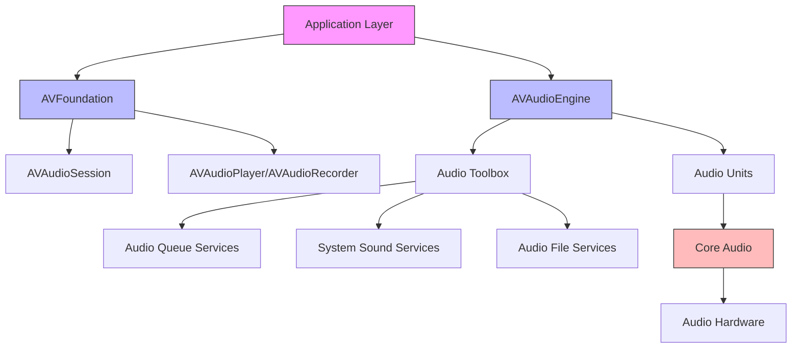
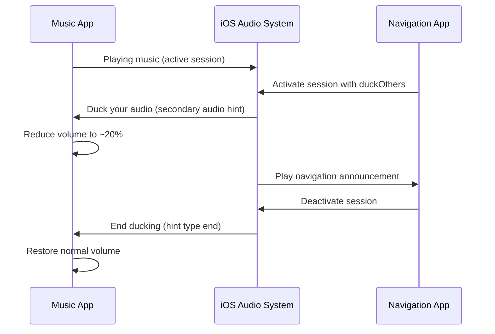
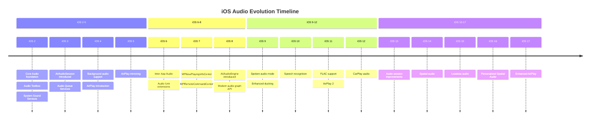

# iOS Audio Capabilities and Features: A Comprehensive Guide for Rust Developers


## Introduction

iOS provides a sophisticated and layered audio architecture that enables developers to build applications ranging from simple sound effect players to complex digital audio workstations. For Rust developers targeting iOS, understanding this architecture is essential for writing efficient, cross-platform audio code. This document provides a comprehensive overview of iOS audio capabilities, focusing on practical implementation details and Rust-based code examples.

The iOS audio stack is designed with multiple abstraction layers, allowing developers to choose the appropriate level of control for their needs. At the highest level, simple APIs handle common tasks with minimal code, while lower-level frameworks provide fine-grained control for professional audio applications. Rust's interoperability with C makes it particularly well-suited for working with iOS's Core Audio framework, which exposes C-based APIs.

---

## iOS Audio Frameworks Overview

iOS offers several audio frameworks arranged in a hierarchy of abstraction and complexity. Understanding the relationships between these frameworks is crucial for selecting the right tools for your application's needs. The primary frameworks include Core Audio, Audio Toolbox, AVFoundation, and the higher-level AVAudioEngine.

### Core Audio Framework

Core Audio represents the foundational layer of iOS audio processing, providing the lowest-level access to audio hardware. This C-based framework is the oldest and most fundamental audio framework on iOS, offering direct access to audio buffers, hardware abstraction, and real-time audio processing capabilities. Core Audio is designed to handle multiple channels of high bit-rate floating-point digital audio with minimal latency, making it ideal for professional audio applications, digital audio workstations, and real-time audio processing software.

The framework consists of several key components including Audio Units (modular audio processing plugins), Audio Unit Graphs (for connecting multiple audio units), and various audio format conversion utilities. Core Audio provides near-direct access to input and output hardware, with latencies as low as 29 milliseconds for audio units. This low latency makes it suitable for applications requiring precise timing, such as musical instrument apps, audio effect processors, and real-time communication applications.

```rust
// Example: Basic Core Audio structure using coreaudio-sys crate
use coreaudio_sys::*;

// Audio Component Description for a default output unit
fn create_default_output_description() -> AudioComponentDescription {
    AudioComponentDescription {
        componentType: kAudioUnitType_Output,
        componentSubType: kAudioUnitSubType_RemoteIO,
        componentManufacturer: kAudioUnitManufacturer_Apple,
        componentFlags: 0,
        componentFlagsMask: 0,
    }
}
```

### Audio Toolbox Framework

The Audio Toolbox framework sits just above Core Audio in the abstraction hierarchy and provides application-level audio services. This framework contains APIs for playing system sounds, managing audio files, working with audio queues, and handling audio converter services. Audio Toolbox simplifies many common audio tasks while still providing substantial control over audio processing.

Key components of Audio Toolbox include System Sound Services (for short sounds and vibrations), Audio Queue Services (for recording and playback with precise control), Audio File Services (for reading and writing audio files in various formats), and Audio Converter Services (for format conversion). This framework is particularly useful when you need more control than AVFoundation provides but don't require the complexity of working directly with Audio Units.

```rust
// Example: Using Audio Toolbox for audio file operations
use coreaudio_sys::*;
use std::ffi::CString;
use std::path::Path;

fn open_audio_file(path: &Path) -> Result<AudioFileID, OSStatus> {
    let path_str = CString::new(path.to_string_lossy().as_ref()).unwrap();
    let url_ref = unsafe {
        let mut url: CFURLRef = std::ptr::null_mut();
        let status = CFURLCreateWithFileSystemPath(
            std::ptr::null(),
            path_str.as_ptr() as CFStringRef,
            kCFURLPOSIXPathStyle,
            0 as Boolean,
        );
        url = status;
        url
    };
    
    let mut audio_file: AudioFileID = std::ptr::null_mut();
    let status = unsafe {
        AudioFileOpenURL(url_ref, 0x01, 0, &mut audio_file)
    };
    
    if status == 0 {
        Ok(audio_file)
    } else {
        Err(status)
    }
}
```

### AVFoundation and AVAudioSession

AVFoundation provides a higher-level, object-oriented interface for audio operations on iOS. At the heart of AVFoundation's audio capabilities is AVAudioSession, which serves as an intermediary between your application and the operating system's audio environment. AVAudioSession manages how your application's audio interacts with the system and other applications, handling concerns like audio routing, interruption handling, and background audio capabilities.

AVAudioSession is essential for every audio application on iOS because it defines how your app's audio behaves in relation to other apps and the system. Before performing any audio operations, your application must configure its audio session with an appropriate category. The category determines whether your app's audio can mix with other apps, whether it should continue playing in the background, and how it responds to interruptions like phone calls.

```rust
// Example: Configuring AVAudioSession using objc framework
use objc::runtime::{Class, Object, Sel};
use objc_foundation::{NSString, INSString};

fn configure_audio_session() -> Result<(), String> {
    unsafe {
        // Get AVAudioSession shared instance
        let session_class = Class::get("AVAudioSession").ok_or("Failed to get AVAudioSession class")?;
        let shared_instance: *mut Object = msg_send![session_class, sharedInstance];
        
        // Set category to Playback
        let category = NSString::from_str("AVAudioSessionCategoryPlayback");
        let () = msg_send![shared_instance, setCategory:error:, category, std::ptr::null_mut::<Object>()];
        
        // Activate the session
        let () = msg_send![shared_instance, setActive:error:, true, std::ptr::null_mut::<Object>()];
    }
    Ok(())
}
```

### AVAudioEngine Framework

AVAudioEngine, introduced in iOS 8, represents Apple's modern approach to real-time audio processing. This Objective-C/Swift framework provides a high-level, graph-based API for building audio processing chains. AVAudioEngine is essentially a wrapper around the older AUGraph and Audio Units architecture, offering similar capabilities with a cleaner, more intuitive interface.

AVAudioEngine excels at applications requiring real-time audio processing, such as audio mixing, applying effects, and building complex signal processing pipelines. It provides built-in nodes for common operations like playing audio files, connecting to input/output hardware, mixing multiple audio streams, and applying audio effects. The engine's main mixer node automatically handles connection to the system's audio output.

```rust
// Example: AVAudioEngine setup pattern (conceptual Rust via objc)
use objc::runtime::{Class, Object};

struct AudioEngine {
    engine: *mut Object,
    player_node: *mut Object,
}

impl AudioEngine {
    fn new() -> Self {
        unsafe {
            let engine_class = Class::get("AVAudioEngine").unwrap();
            let engine: *mut Object = msg_send![engine_class, new];
            
            let player_class = Class::get("AVAudioPlayerNode").unwrap();
            let player_node: *mut Object = msg_send![player_class, new];
            
            // Attach player to engine
            let () = msg_send![engine, attachNode:, player_node];
            
            AudioEngine { engine, player_node }
        }
    }
    
    fn start(&self) {
        unsafe {
            let () = msg_send![self.engine, prepare];
            let () = msg_send![self.engine, startAndReturnError:, std::ptr::null_mut::<Object>()];
        }
    }
}
```

### Framework Hierarchy Diagram



---

## Sound Effects on iOS

Sound effects on iOS are handled differently from longer-form audio playback, with dedicated APIs designed specifically for short, low-latency sounds. Understanding the distinction between sound effects and regular audio is important for choosing the right approach for your application.

### System Sound Services

System Sound Services provides the simplest API for playing short sounds on iOS. This API, part of the Audio Toolbox framework, is designed specifically for playing sounds that are 30 seconds or less in duration. The primary function, `AudioServicesPlaySystemSound`, plays sounds asynchronously with minimal overhead, making it ideal for user interface feedback sounds, game sound effects, and other short audio clips.

The System Sound Services API has specific characteristics that distinguish it from other audio playback methods. Sounds played through this API are not subject to the current audio session's category settings; they play at the current system volume and respect the Ring/Silent switch. This behavior makes system sounds appropriate for alerts and notifications that should behave consistently with system audio.

```rust
// Example: Playing a sound effect using System Sound Services
use coreaudio_sys::*;
use std::ffi::CString;
use std::path::Path;

struct SystemSound {
    sound_id: SystemSoundID,
}

impl SystemSound {
    /// Load a sound file for playback as a system sound
    fn from_file(path: &Path) -> Result<Self, OSStatus> {
        let path_str = CString::new(path.to_string_lossy().as_ref()).unwrap();
        
        let mut sound_id: SystemSoundID = 0;
        let status = unsafe {
            // Create URL from file path
            let url = CFURLCreateFromFileSystemRepresentation(
                std::ptr::null(),
                path_str.as_ptr() as *const u8,
                path_str.as_bytes().len() as CFIndex,
                false as Boolean,
            );
            
            AudioServicesCreateSystemSoundID(url, &mut sound_id)
        };
        
        if status == 0 {
            Ok(SystemSound { sound_id })
        } else {
            Err(status)
        }
    }
    
    /// Play the sound asynchronously
    fn play(&self) {
        unsafe {
            AudioServicesPlaySystemSound(self.sound_id);
        }
    }
    
    /// Play the sound with vibration (on supported devices)
    fn play_with_vibration(&self) {
        unsafe {
            // kSystemSoundID_Vibrate triggers device vibration
            AudioServicesPlaySystemSound(kSystemSoundID_Vibrate);
        }
    }
}

impl Drop for SystemSound {
    fn drop(&mut self) {
        unsafe {
            AudioServicesDisposeSystemSoundID(self.sound_id);
        }
    }
}

// Usage example
fn play_click_sound() {
    let sound = SystemSound::from_file(Path::new("click.caf")).unwrap();
    sound.play();
}
```

### System Sound IDs and Predefined Sounds

iOS provides predefined system sound IDs for common system sounds. These IDs allow your application to play the same sounds used by the operating system for various events. Using predefined system sounds can help maintain consistency with the iOS user experience and provides access to sounds that might not be available through other means.

```rust
// Predefined system sound IDs
use coreaudio_sys::*;

// User interface sound effects
const SYSTEM_SOUND_KEYBOARD: SystemSoundID = 1104;  // Keyboard tap
const SYSTEM_SOUND_MODIFIER: SystemSoundID = 1156;   // Modifier key press
const SYSTEM_SOUND_TAP: SystemSoundID = 1306;        // Generic tap

// Vibration patterns (iPhone only)
const VIBRATION_SHORT: SystemSoundID = 1520;  // Short vibration
const VIBRATION_MEDIUM: SystemSoundID = 1521; // Medium vibration
const VIBRATION_LONG: SystemSoundID = 1522;   // Long vibration

fn play_keyboard_click() {
    unsafe {
        AudioServicesPlaySystemSound(SYSTEM_SOUND_KEYBOARD);
    }
}
```

### Custom Sound Effect Formats

When providing your own sound effects for use with System Sound Services, specific format requirements apply. The supported formats include:

| Format            | Extension   | Description                                   |
| ----------------- | ----------- | --------------------------------------------- |
| Core Audio Format | .caf        | Apple's container format, recommended for iOS |
| AIFF              | .aif, .aiff | Audio Interchange File Format                 |
| WAV               | .wav        | Waveform Audio File Format                    |

For best results with system sounds, use uncompressed formats (PCM) or IMA4 compression within a CAF container. The audio should be 30 seconds or shorter, and the sample rate should match the device's native rate (typically 44.1 kHz or 48 kHz). The following example demonstrates converting an audio file to an optimal format using Rust's audio processing capabilities:

```rust
// Example: Recommended sound effect specifications
struct SoundEffectSpec {
    max_duration_seconds: f64,
    recommended_sample_rate: f64,
    recommended_bit_depth: u32,
    recommended_channels: u32,
    container_format: &'static str,
}

impl Default for SoundEffectSpec {
    fn default() -> Self {
        SoundEffectSpec {
            max_duration_seconds: 30.0,
            recommended_sample_rate: 44100.0,  // CD quality
            recommended_bit_depth: 16,
            recommended_channels: 2,
            container_format: "CAF",
        }
    }
}
```

### Sound Effects vs. Regular Audio Playback

The following table summarizes the key differences between sound effects (System Sound Services) and regular audio playback (AVAudioPlayer/AVAudioEngine):

| Aspect                    | System Sound Services    | AVAudioPlayer/AVAudioEngine      |
| ------------------------- | ------------------------ | -------------------------------- |
| Maximum Duration          | 30 seconds               | Unlimited                        |
| Latency                   | Very low                 | Low to medium                    |
| Volume Control            | System volume only       | App-controlled                   |
| Audio Session Integration | None                     | Full integration                 |
| Mixing with Other Apps    | Always mixes             | Category-dependent               |
| Background Playback       | No                       | Category-dependent               |
| Format Support            | Limited (CAF, AIFF, WAV) | Extensive (AAC, MP3, ALAC, etc.) |
| Vibration Support         | Yes                      | No                               |

---

## Audio Detection and Monitoring

Detecting whether audio is currently playing, identifying the playing application, and monitoring audio state changes are essential capabilities for many audio applications. iOS provides several mechanisms for detecting audio activity, though with certain limitations due to privacy and security considerations.

### Detecting Other Apps Playing Audio

iOS provides the `secondaryAudioShouldBeSilencedHint` property on AVAudioSession to detect when another application is playing audio. This boolean property indicates whether another app with a non-mixable audio session is currently playing audio. This is the recommended approach for apps that need to respond appropriately when other apps are playing audio.

```rust
// Example: Detecting other apps playing audio
use objc::runtime::{Class, Object};

fn is_other_app_playing_audio() -> bool {
    unsafe {
        let session_class = Class::get("AVAudioSession").unwrap();
        let session: *mut Object = msg_send![session_class, sharedInstance];
        
        // secondaryAudioShouldBeSilencedHint returns YES if another app 
        // with non-mixable audio is playing
        let hint: bool = msg_send![session, secondaryAudioShouldBeSilencedHint];
        hint
    }
}

// Monitoring audio state changes via notification
fn observe_audio_state_changes() {
    unsafe {
        let notification_center: *mut Object = msg_send![Class::get("NSNotificationCenter").unwrap(), defaultCenter];
        let session_class = Class::get("AVAudioSession").unwrap();
        let session: *mut Object = msg_send![session_class, sharedInstance];
        
        let notification_name = NSString::from_str("AVAudioSessionSilenceSecondaryAudioHintNotification");
        
        // Add observer for secondary audio hint changes
        let () = msg_send![notification_center, 
            addObserver:session
            selector:sel!(handleSecondaryAudioHintChange:)
            name:notification_name
            object:session
        ];
    }
}
```

### Notification-Based Detection

For applications that need to respond to changes in audio state, iOS provides `AVAudioSessionSilenceSecondaryAudioHintNotification`. This notification is posted when another app starts or stops playing audio, allowing your app to react appropriately.

```rust
// Example: Handling secondary audio hint notification
use objc::runtime::{Class, Object, Sel};

#[repr(C)]
struct NotificationUserInfo {
    hint_type: u64,
}

// Handler method implementation
fn handle_secondary_audio_hint(notification: *mut Object) {
    unsafe {
        let user_info: *mut Object = msg_send![notification, userInfo];
        
        // Get the hint type from user info
        // AVAudioSessionSilenceSecondaryAudioHintTypeKey indicates begin/end
        let hint_key = NSString::from_str("AVAudioSessionSilenceSecondaryAudioHintTypeKey");
        let hint_number: *mut Object = msg_send![user_info, objectForKey:hint_key];
        let hint_type: u64 = msg_send![hint_number, unsignedLongLongValue];
        
        match hint_type {
            1 => {
                // AVAudioSessionSilenceSecondaryAudioHintTypeBegin
                // Another app started playing - duck or pause your audio
                println!("Other app started playing audio");
            }
            2 => {
                // AVAudioSessionSilenceSecondaryAudioHintTypeEnd
                // Other app stopped - restore normal audio
                println!("Other app stopped playing audio");
            }
            _ => {}
        }
    }
}
```

### Limitations in Identifying Playing Apps

Due to iOS privacy protections, applications cannot directly identify which specific app is playing audio. The operating system intentionally limits this information to protect user privacy. Your application can only determine that audio is playing, not which application is producing it. This is a deliberate design decision by Apple to prevent applications from tracking user behavior across apps.

For applications that need to know about audio playing in their own context, `MPNowPlayingInfoCenter` and `MPRemoteCommandCenter` from the MediaPlayer framework provide information about the currently playing media when your app is the active audio session. These APIs are primarily designed for apps that play media content and need to integrate with the system's media controls.

```rust
// Example: Working with Now Playing Info Center
use objc::runtime::{Class, Object};

fn update_now_playing_info(title: &str, artist: &str, duration: f64, elapsed: f64) {
    unsafe {
        let info_center_class = Class::get("MPNowPlayingInfoCenter").unwrap();
        let center: *mut Object = msg_send![info_center_class, defaultCenter];
        
        let now_playing_info = {
            let dict_class = Class::get("NSMutableDictionary").unwrap();
            let dict: *mut Object = msg_send![dict_class, dictionary];
            
            // Set media item properties
            let title_key = NSString::from_str("MPMediaItemPropertyTitle");
            let title_value = NSString::from_str(title);
            let () = msg_send![dict, setObject:title_value forKey:title_key];
            
            let artist_key = NSString::from_str("MPMediaItemPropertyArtist");
            let artist_value = NSString::from_str(artist);
            let () = msg_send![dict, setObject:artist_value forKey:artist_key];
            
            // Set timing properties
            let duration_key = NSString::from_str("MPMediaItemPropertyPlaybackDuration");
            let duration_number: *mut Object = msg_send![Class::get("NSNumber").unwrap(), numberWithDouble:duration];
            let () = msg_send![dict, setObject:duration_number forKey:duration_key];
            
            let elapsed_key = NSString::from_str("MPNowPlayingInfoPropertyElapsedPlaybackTime");
            let elapsed_number: *mut Object = msg_send![Class::get("NSNumber").unwrap(), numberWithDouble:elapsed];
            let () = msg_send![dict, setObject:elapsed_number forKey:elapsed_key];
            
            dict
        };
        
        let () = msg_send![center, setNowPlayingInfo:now_playing_info];
    }
}
```

---

## Volume Control and Muting

Volume control on iOS presents unique challenges due to the operating system's design philosophy, which prioritizes user control over application control. Understanding the available mechanisms and their limitations is essential for implementing effective audio volume management.

### Reading Current System Volume

iOS provides the `outputVolume` property on AVAudioSession to read the current system volume level. This property reflects the volume controlled by the physical volume buttons and ranges from 0.0 to 1.0. However, applications cannot directly set this value programmatically.

```rust
// Example: Reading current system volume
use objc::runtime::Class;

fn get_system_volume() -> f32 {
    unsafe {
        let session_class = Class::get("AVAudioSession").unwrap();
        let session: *mut Object = msg_send![session_class, sharedInstance];
        
        let volume: f32 = msg_send![session, outputVolume];
        volume
    }
}

// Monitoring volume changes via Key-Value Observation (KVO)
struct VolumeObserver {
    session: *mut Object,
}

impl VolumeObserver {
    fn new() -> Self {
        unsafe {
            let session_class = Class::get("AVAudioSession").unwrap();
            let session: *mut Object = msg_send![session_class, sharedInstance];
            
            // Activate session to enable volume observation
            let () = msg_send![session, setActive:error:, true, std::ptr::null_mut::<Object>()];
            
            VolumeObserver { session }
        }
    }
    
    fn observe_volume_changes(&self) {
        unsafe {
            // Note: KVO in Rust requires additional setup with observation context
            // This is a simplified example showing the concept
            let output_volume_key = NSString::from_str("outputVolume");
            
            // addObserver:forKeyPath:options:context:
            let () = msg_send![self.session, 
                addObserver:self as *const _ as *mut Object
                forKeyPath:output_volume_key
                options:1 // NSKeyValueObservingOptionNew
                context:std::ptr::null_mut()
            ];
        }
    }
    
    fn current_volume(&self) -> f32 {
        unsafe {
            msg_send![self.session, outputVolume]
        }
    }
}
```

### Application-Level Volume Control

Since iOS does not allow applications to directly control system volume, applications must implement their own volume control at the application level. This is typically done by adjusting the volume of the audio being output through your application's audio graph.

```rust
// Example: Application-level volume control using AVAudioEngine
struct AudioVolumeController {
    engine: *mut Object,
    main_mixer: *mut Object,
}

impl AudioVolumeController {
    fn new() -> Self {
        unsafe {
            let engine_class = Class::get("AVAudioEngine").unwrap();
            let engine: *mut Object = msg_send![engine_class, new];
            let mixer: *mut Object = msg_send![engine, mainMixerNode];
            
            AudioVolumeController {
                engine,
                main_mixer: mixer,
            }
        }
    }
    
    fn set_volume(&self, volume: f32) {
        // Volume range: 0.0 (muted) to 1.0 (full volume)
        unsafe {
            let () = msg_send![self.main_mixer, setVolume:volume];
        }
    }
    
    fn get_volume(&self) -> f32 {
        unsafe {
            msg_send![self.main_mixer, volume]
        }
    }
    
    fn mute(&self) {
        self.set_volume(0.0);
    }
    
    fn unmute(&self, previous_volume: f32) {
        self.set_volume(previous_volume);
    }
}

// Volume control using Audio Unit directly
fn set_audio_unit_volume(audio_unit: AudioUnit, volume: f32) -> OSStatus {
    unsafe {
        let volume_value = volume as f32;
        AudioUnitSetParameter(
            audio_unit,
            kHALOutputParam_Volume,
            kAudioUnitScope_Global,
            0,
            volume_value,
            0,
        )
    }
}
```

### Muting Audio

iOS applications can implement muting at multiple levels. The most reliable approach is to control muting at the application level by setting volume to zero. AVAudioSession also provides some mute-related functionality, though it is limited.

```rust
// Example: Different muting strategies
struct MuteController {
    engine_volume_controller: AudioVolumeController,
    muted: bool,
    previous_volume: f32,
}

impl MuteController {
    fn toggle_mute(&mut self) {
        if self.muted {
            self.engine_volume_controller.unmute(self.previous_volume);
            self.muted = false;
        } else {
            self.previous_volume = self.engine_volume_controller.get_volume();
            self.engine_volume_controller.mute();
            self.muted = true;
        }
    }
    
    fn is_muted(&self) -> bool {
        self.muted
    }
}

// iOS 16+ offers outputVolume observation for detecting mute switch
fn observe_output_volume_for_mute_detection() {
    // On iOS, when outputVolume is 0.0, audio is effectively muted
    // Applications can observe this to detect when user has muted
    let observer = VolumeObserver::new();
    
    // Set up a timer or KVO observer to check volume
    if observer.current_volume() == 0.0 {
        println!("Audio is muted (volume at 0)");
    }
}
```

### Hardware Volume Control Limitations

Applications cannot programmatically adjust hardware volume on iOS. This is by design, as Apple wants users to retain ultimate control over their device's volume. Applications can only read the current volume level and respond to volume button presses through the notification system. Workarounds typically involve displaying a volume overlay or using `MPVolumeView` to provide a system-styled volume control interface.

```rust
// Example: Creating a volume view (shows system volume HUD)
fn create_volume_view(x: f64, y: f64, width: f64, height: f64) -> *mut Object {
    unsafe {
        let volume_view_class = Class::get("MPVolumeView").unwrap();
        let frame = {
            let rect_class = Class::get("CGRect").unwrap();
            // CGRectMake equivalent
            (x, y, width, height)
        };
        
        let volume_view: *mut Object = msg_send![volume_view_class, initWithFrame:frame];
        
        // Optionally hide the system volume HUD
        let () = msg_send![volume_view, setShowsVolumeSlider:true];
        let () = msg_send![volume_view, setShowsRouteButton:true];
        
        volume_view
    }
}
```

---

## Audio Input Sources

iOS devices can have multiple audio input sources available simultaneously, including built-in microphones, wired headsets, and Bluetooth devices. The AVAudioSession API provides comprehensive support for discovering and selecting audio inputs.

### Enumerating Available Audio Inputs

The `availableInputs` property of AVAudioSession returns an array of `AVAudioSessionPortDescription` objects, each representing an available audio input port. This allows applications to discover all connected audio input devices and present them to users for selection.

```rust
// Example: Enumerating available audio inputs
use objc::runtime::{Class, Object};
use objc_foundation::{NSString, INSString, NSArray};

#[derive(Debug, Clone)]
struct AudioInputPort {
    uid: String,
    port_name: String,
    port_type: String,
    channels: u32,
    data_sources: Vec<String>,
}

fn get_available_audio_inputs() -> Vec<AudioInputPort> {
    let mut inputs = Vec::new();
    
    unsafe {
        let session_class = Class::get("AVAudioSession").unwrap();
        let session: *mut Object = msg_send![session_class, sharedInstance];
        
        // Get array of available input ports
        let available_inputs: *mut Object = msg_send![session, availableInputs];
        let count: u64 = msg_send![available_inputs, count];
        
        for i in 0..count {
            let port_desc: *mut Object = msg_send![available_inputs, objectAtIndex:i];
            
            // Extract port information
            let uid: *mut Object = msg_send![port_desc, UID];
            let port_name: *mut Object = msg_send![port_desc, portName];
            let port_type: *mut Object = msg_send![port_desc, portType];
            let channels: u64 = msg_send![port_desc, channels];
            
            // Get data sources if available
            let data_sources: *mut Object = msg_send![port_desc, dataSources];
            let mut source_names = Vec::new();
            if !data_sources.is_null() {
                let ds_count: u64 = msg_send![data_sources, count];
                for j in 0..ds_count {
                    let source: *mut Object = msg_send![data_sources, objectAtIndex:j];
                    let source_name: *mut Object = msg_send![source, dataSourceName];
                    source_names.push(nsstring_to_string(source_name));
                }
            }
            
            inputs.push(AudioInputPort {
                uid: nsstring_to_string(uid),
                port_name: nsstring_to_string(port_name),
                port_type: nsstring_to_string(port_type),
                channels: channels as u32,
                data_sources: source_names,
            });
        }
    }
    
    inputs
}

fn nsstring_to_string(nsstr: *mut Object) -> String {
    unsafe {
        let bytes: *const i8 = msg_send![nsstr, UTF8String];
        if bytes.is_null() {
            String::new()
        } else {
            std::ffi::CStr::from_ptr(bytes)
                .to_string_lossy()
                .into_owned()
        }
    }
}
```

### Input Port Types and Metadata

Each audio input port provides metadata that helps identify the type and capabilities of the device. The port type indicates the general category of input device, while additional metadata provides specific details.

```rust
// Example: Input port type constants
const PORT_TYPE_BUILTIN_MIC: &str = "BuiltInMic";
const PORT_TYPE_HEADSET_MIC: &str = "HeadsetMic";
const PORT_TYPE_HEADPHONES: &str = "Headphones";
const PORT_TYPE_BLUETOOTH_HFP: &str = "BluetoothHFP";
const PORT_TYPE_BLUETOOTH_A2DP: &str = "BluetoothA2DP";
const PORT_TYPE_USB_AUDIO: &str = "USBAudio";
const PORT_TYPE_CAR_AUDIO: &str = "CarAudio";
const PORT_TYPE_AIR_PLAY: &str = "AirPlay";

#[derive(Debug)]
struct InputPortMetadata {
    port_type: String,
    display_name: String,
    uid: String,
    has_data_sources: bool,
    preferred_data_source: Option<String>,
    sample_rate: f64,
    channel_count: u32,
}

fn get_input_port_metadata(port_description: *mut Object) -> InputPortMetadata {
    unsafe {
        let port_type: *mut Object = msg_send![port_description, portType];
        let port_name: *mut Object = msg_send![port_description, portName];
        let uid: *mut Object = msg_send![port_description, UID];
        
        let data_sources: *mut Object = msg_send![port_description, dataSources];
        let has_data_sources = !data_sources.is_null();
        
        let preferred_source: *mut Object = msg_send![port_description, preferredDataSource];
        let preferred_source_name = if preferred_source.is_null() {
            None
        } else {
            let name: *mut Object = msg_send![preferred_source, dataSourceName];
            Some(nsstring_to_string(name))
        };
        
        let channels: u64 = msg_send![port_description, channels];
        
        InputPortMetadata {
            port_type: nsstring_to_string(port_type),
            display_name: nsstring_to_string(port_name),
            uid: nsstring_to_string(uid),
            has_data_sources,
            preferred_data_source: preferred_source_name,
            sample_rate: 44100.0, // Default, actual varies by device
            channel_count: channels as u32,
        }
    }
}
```

### Selecting a Preferred Input

Applications can request a specific input device using the `setPreferredInput:error:` method. This allows users to choose their preferred microphone from the available options.

```rust
// Example: Selecting a preferred audio input
fn set_preferred_input(port_uid: &str) -> Result<(), String> {
    unsafe {
        let session_class = Class::get("AVAudioSession").unwrap();
        let session: *mut Object = msg_send![session_class, sharedInstance];
        
        // Find the port description with matching UID
        let available_inputs: *mut Object = msg_send![session, availableInputs];
        let count: u64 = msg_send![available_inputs, count];
        
        let mut target_port: *mut Object = std::ptr::null_mut();
        for i in 0..count {
            let port: *mut Object = msg_send![available_inputs, objectAtIndex:i];
            let uid: *mut Object = msg_send![port, UID];
            
            if nsstring_to_string(uid) == port_uid {
                target_port = port;
                break;
            }
        }
        
        if target_port.is_null() {
            return Err(format!("Input port '{}' not found", port_uid));
        }
        
        // Set the preferred input
        let mut error: *mut Object = std::ptr::null_mut();
        let () = msg_send![session, setPreferredInput:error:, target_port, &mut error];
        
        if error.is_null() {
            Ok(())
        } else {
            let error_desc: *mut Object = msg_send![error, localizedDescription];
            Err(nsstring_to_string(error_desc))
        }
    }
}
```

### iPhone-Specific Microphone Configuration

iPhones have multiple built-in microphones (bottom, front, back) that can be selected as data sources. This allows applications to optimize audio capture for different scenarios, such as video recording (using the front microphone) or voice memos (using the bottom microphone).

```rust
// Example: Selecting a specific microphone on iPhone
enum IPhoneMicrophone {
    Bottom,   // Default for voice calls
    Front,    // Optimized for video recording
    Back,     // For rear camera video
    BuiltIn,  // Generic built-in mic
}

fn set_iphone_microphone(mic: IPhoneMicrophone) -> Result<(), String> {
    unsafe {
        let session_class = Class::get("AVAudioSession").unwrap();
        let session: *mut Object = msg_send![session_class, sharedInstance];
        
        // Get the built-in mic port
        let available_inputs: *mut Object = msg_send![session, availableInputs];
        let count: u64 = msg_send![available_inputs, count];
        
        let mut built_in_port: *mut Object = std::ptr::null_mut();
        for i in 0..count {
            let port: *mut Object = msg_send![available_inputs, objectAtIndex:i];
            let port_type: *mut Object = msg_send![port, portType];
            
            if nsstring_to_string(port_type) == PORT_TYPE_BUILTIN_MIC {
                built_in_port = port;
                break;
            }
        }
        
        if built_in_port.is_null() {
            return Err("Built-in microphone not found".to_string());
        }
        
        // Get data sources for the built-in mic
        let data_sources: *mut Object = msg_send![built_in_port, dataSources];
        if data_sources.is_null() {
            return Err("No data sources available for built-in mic".to_string());
        }
        
        // Select appropriate data source based on requested mic
        let target_pattern = match mic {
            IPhoneMicrophone::Bottom => "Bottom",
            IPhoneMicrophone::Front => "Front",
            IPhoneMicrophone::Back => "Back",
            IPhoneMicrophone::BuiltIn => "Built-In",
        };
        
        let ds_count: u64 = msg_send![data_sources, count];
        for i in 0..ds_count {
            let source: *mut Object = msg_send![data_sources, objectAtIndex:i];
            let name: *mut Object = msg_send![source, dataSourceName];
            
            if nsstring_to_string(name).contains(target_pattern) {
                let mut error: *mut Object = std::ptr::null_mut();
                let () = msg_send![built_in_port, setPreferredDataSource:error:, source, &mut error];
                
                if error.is_null() {
                    return Ok(());
                } else {
                    let desc: *mut Object = msg_send![error, localizedDescription];
                    return Err(nsstring_to_string(desc));
                }
            }
        }
        
        Err(format!("Microphone '{}' not found", target_pattern))
    }
}
```

---

## Audio Output Routing

iOS provides sophisticated audio routing capabilities that allow applications to direct audio to specific output devices. Understanding how audio routing works is essential for applications that need precise control over where their audio is played.

### Enumerating Available Audio Outputs

While AVAudioSession focuses primarily on input ports, you can enumerate output routes through the current route and route descriptions. The system manages available outputs dynamically as devices are connected and disconnected.

```rust
// Example: Enumerating current audio output routes
#[derive(Debug, Clone)]
struct AudioOutputRoute {
    uid: String,
    port_name: String,
    port_type: String,
    channels: u32,
}

fn get_current_output_routes() -> Vec<AudioOutputRoute> {
    let mut outputs = Vec::new();
    
    unsafe {
        let session_class = Class::get("AVAudioSession").unwrap();
        let session: *mut Object = msg_send![session_class, sharedInstance];
        
        // Get the current route
        let current_route: *mut Object = msg_send![session, currentRoute];
        let outputs_array: *mut Object = msg_send![current_route, outputs];
        
        let count: u64 = msg_send![outputs_array, count];
        for i in 0..count {
            let port_desc: *mut Object = msg_send![outputs_array, objectAtIndex:i];
            
            let uid: *mut Object = msg_send![port_desc, UID];
            let port_name: *mut Object = msg_send![port_desc, portName];
            let port_type: *mut Object = msg_send![port_desc, portType];
            let channels: u64 = msg_send![port_desc, channels];
            
            outputs.push(AudioOutputRoute {
                uid: nsstring_to_string(uid),
                port_name: nsstring_to_string(port_name),
                port_type: nsstring_to_string(port_type),
                channels: channels as u32,
            });
        }
    }
    
    outputs
}

// Output port type constants
const OUTPUT_TYPE_SPEAKER: &str = "Speaker";
const OUTPUT_TYPE_HEADPHONES: &str = "Headphones";
const OUTPUT_TYPE_BLUETOOTH_A2DP: &str = "BluetoothA2DP";
const OUTPUT_TYPE_BLUETOOTH_HFP: &str = "BluetoothHFP";
const OUTPUT_TYPE_USB_AUDIO: &str = "USBAudio";
const OUTPUT_TYPE_AIR_PLAY: &str = "AirPlay";
const OUTPUT_TYPE_RECEIVER: &str = "Receiver";  // Earpiece speaker
```

### Routing Audio to Specific Outputs

Directing audio to a specific output device can be achieved through several methods depending on the type of device and the audio session configuration. For Bluetooth devices, you can modify the session's category options to include or exclude Bluetooth devices.

```rust
// Example: Routing audio to different outputs
enum AudioOutputDestination {
    BuiltInSpeaker,
    EarpieceReceiver,
    BluetoothDevice,
    AirPlayDevice,
    USBDevice,
}

fn route_audio_to(destination: AudioOutputDestination) -> Result<(), String> {
    unsafe {
        let session_class = Class::get("AVAudioSession").unwrap();
        let session: *mut Object = msg_send![session_class, sharedInstance];
        
        match destination {
            AudioOutputDestination::BuiltInSpeaker => {
                // Override output to speaker (when headphones might be connected)
                let () = msg_send![session, overrideOutputAudioPort:1]; // AVAudioSessionPortOverrideSpeaker
            }
            AudioOutputDestination::EarpieceReceiver => {
                // Use the earpiece receiver
                let () = msg_send![session, overrideOutputAudioPort:0]; // None, uses default
            }
            AudioOutputDestination::BluetoothDevice => {
                // Set category to allow Bluetooth
                let category = NSString::from_str("AVAudioSessionCategoryPlayAndRecord");
                let options: u64 = 0x04 | 0x08; // AllowBluetooth | AllowBluetoothA2DP
                let () = msg_send![session, setCategory:withOptions:error:, category, options, std::ptr::null_mut::<Object>()];
            }
            AudioOutputDestination::AirPlayDevice | AudioOutputDestination::USBDevice => {
                // These require user selection through route picker
                // Present MPVolumeView with route button enabled
            }
        }
        
        Ok(())
    }
}

// Example: Override output to speaker (common for speakerphone functionality)
fn use_speaker_output() -> Result<(), String> {
    route_audio_to(AudioOutputDestination::BuiltInSpeaker)
}

// Example: Route back to default (headphones if connected, else speaker)
fn use_default_output() -> Result<(), String> {
    unsafe {
        let session_class = Class::get("AVAudioSession").unwrap();
        let session: *mut Object = msg_send![session_class, sharedInstance];
        
        // Override with 'None' to return to default routing
        let () = msg_send![session, overrideOutputAudioPort:0];
    }
    Ok(())
}
```

### Monitoring Route Changes

Audio routes can change dynamically when users connect or disconnect headphones, Bluetooth devices, or AirPlay targets. Applications should monitor these changes to update their UI and audio processing accordingly.

```rust
// Example: Observing route changes
use std::sync::{Arc, Mutex};

type RouteChangeCallback = Box<dyn Fn(&str, &str) + Send>;

struct RouteChangeObserver {
    session: *mut Object,
    callback: Arc<Mutex<Option<RouteChangeCallback>>>,
}

impl RouteChangeObserver {
    fn new() -> Self {
        unsafe {
            let session_class = Class::get("AVAudioSession").unwrap();
            let session: *mut Object = msg_send![session_class, sharedInstance];
            
            RouteChangeObserver {
                session,
                callback: Arc::new(Mutex::new(None)),
            }
        }
    }
    
    fn set_callback(&mut self, callback: RouteChangeCallback) {
        *self.callback.lock().unwrap() = Some(callback);
        
        unsafe {
            let notification_center: *mut Object = msg_send![
                Class::get("NSNotificationCenter").unwrap(), 
                defaultCenter
            ];
            
            let notification_name = NSString::from_str("AVAudioSessionRouteChangeNotification");
            
            let () = msg_send![notification_center,
                addObserver:self.session
                selector:sel!(handleRouteChange:)
                name:notification_name
                object:self.session
            ];
        }
    }
    
    fn get_previous_route_reason(notification: *mut Object) -> String {
        unsafe {
            let user_info: *mut Object = msg_send![notification, userInfo];
            let reason_key = NSString::from_str("AVAudioSessionRouteChangeReasonKey");
            let reason_number: *mut Object = msg_send![user_info, objectForKey:reason_key];
            let reason: u64 = msg_send![reason_number, unsignedLongLongValue];
            
            match reason {
                1 => "NewDeviceAvailable".to_string(),
                2 => "OldDeviceUnavailable".to_string(),
                3 => "CategoryChange".to_string(),
                4 => "Override".to_string(),
                5 => "WakeFromSleep".to_string(),
                6 => "NoSuitableRouteForCategory".to_string(),
                7 => "RouteConfigurationChange".to_string(),
                _ => format!("Unknown({})", reason),
            }
        }
    }
}
```

### Common Routing Gotchas and Solutions

Audio routing on iOS has several common pitfalls that developers encounter. Understanding these issues and their solutions can save significant development time.

| Issue                                           | Cause                                    | Solution                                                     |
| ----------------------------------------------- | ---------------------------------------- | ------------------------------------------------------------ |
| Audio plays through earpiece instead of speaker | Default route on phone calls             | Use `overrideOutputAudioPort:` with speaker override         |
| Bluetooth device not available for audio        | Category doesn't support Bluetooth       | Set appropriate category options (`AllowBluetooth`, `AllowBluetoothA2DP`) |
| Route change causes audio interruption          | Audio session not handling route changes | Implement route change notification handler and restart audio engine |
| AirPlay device not listed                       | AirPlay requires specific configuration  | Use `MPVolumeView` to show route picker; set `categoryOptions` to allow AirPlay |
| Audio stops when headphones disconnected        | Default behavior stops audio session     | Handle route change notification to restart playback         |
| Cannot route to specific Bluetooth device       | iOS auto-selects first available         | Use `preferredOutput` or route picker for user selection     |

```rust
// Example: Handling common routing issues
fn handle_headphone_disconnect_and_continue_playback() {
    unsafe {
        let session_class = Class::get("AVAudioSession").unwrap();
        let session: *mut Object = msg_send![session_class, sharedInstance];
        
        // When headphones disconnect, override to speaker to continue playback
        let () = msg_send![session, overrideOutputAudioPort:1]; // Speaker override
    }
}

fn setup_bluetooth_audio_support() -> Result<(), String> {
    unsafe {
        let session_class = Class::get("AVAudioSession").unwrap();
        let session: *mut Object = msg_send![session_class, sharedInstance];
        
        // Set category that supports Bluetooth
        let category = NSString::from_str("AVAudioSessionCategoryPlayback");
        
        // Options for Bluetooth A2DP support
        let options: u64 = 0x40; // AVAudioSessionCategoryOptionAllowBluetoothA2DP
        
        let mut error: *mut Object = std::ptr::null_mut();
        let () = msg_send![session, setCategory:withOptions:error:, category, options, &mut error];
        
        if error.is_null() {
            Ok(())
        } else {
            let desc: *mut Object = msg_send![error, localizedDescription];
            Err(nsstring_to_string(desc))
        }
    }
}
```

---

## Audio Ducking

Audio ducking is the technique of temporarily reducing the volume of one audio stream when another audio stream becomes active. This is commonly used for navigation apps that need to announce directions while music is playing, or for VoIP apps that need to handle incoming calls while media is playing.

### Implementing Ducking with AVAudioSession

iOS provides built-in support for audio ducking through the `duckOthers` category option. When this option is set, the system automatically reduces the volume of other apps' audio when your app's audio session becomes active.

```rust
// Example: Enabling audio ducking
fn enable_audio_ducking() -> Result<(), String> {
    unsafe {
        let session_class = Class::get("AVAudioSession").unwrap();
        let session: *mut Object = msg_send![session_class, sharedInstance];
        
        // Set category with duckOthers option
        let category = NSString::from_str("AVAudioSessionCategoryPlayback");
        let options: u64 = 0x02; // AVAudioSessionCategoryOptionDuckOthers
        
        let mut error: *mut Object = std::ptr::null_mut();
        let () = msg_send![session, setCategory:withOptions:error:, category, options, &mut error];
        
        if error.is_null() {
            // Activate session to begin ducking
            let () = msg_send![session, setActive:error:, true, std::ptr::null_mut::<Object>()];
            Ok(())
        } else {
            let desc: *mut Object = msg_send![error, localizedDescription];
            Err(nsstring_to_string(desc))
        }
    }
}

// Example: Disabling ducking when done
fn disable_ducking() -> Result<(), String> {
    unsafe {
        let session_class = Class::get("AVAudioSession").unwrap();
        let session: *mut Object = msg_send![session_class, sharedInstance];
        
        // Deactivating the session stops ducking
        let mut error: *mut Object = std::ptr::null_mut();
        let () = msg_send![session, setActive:error:, false, &mut error];
        
        if error.is_null() {
            Ok(())
        } else {
            let desc: *mut Object = msg_send![error, localizedDescription];
            Err(nsstring_to_string(desc))
        }
    }
}
```

### Spoken Audio Ducking (iOS 9+)

iOS 9 introduced the `interruptSpokenAudioAndMixWithOthers` option specifically for apps that play spoken audio content, such as podcasts or audiobooks. This option allows your app to interrupt other spoken audio while mixing with music.

```rust
// Example: Spoken audio ducking
fn setup_spoken_audio_ducking() -> Result<(), String> {
    unsafe {
        let session_class = Class::get("AVAudioSession").unwrap();
        let session: *mut Object = msg_send![session_class, sharedInstance];
        
        // Use spoken audio mode for best ducking behavior
        let mode = NSString::from_str("AVAudioSessionModeSpokenAudio");
        let () = msg_send![session, setMode:error:, mode, std::ptr::null_mut::<Object>()];
        
        // Set category with interrupt spoken audio option
        let category = NSString::from_str("AVAudioSessionCategoryPlayback");
        let options: u64 = 0x400; // AVAudioSessionCategoryOptionInterruptSpokenAudioAndMixWithOthers
        
        let mut error: *mut Object = std::ptr::null_mut();
        let () = msg_send![session, setCategory:withOptions:error:, category, options, &mut error];
        
        if error.is_null() {
            Ok(())
        } else {
            let desc: *mut Object = msg_send![error, localizedDescription];
            Err(nsstring_to_string(desc))
        }
    }
}
```

### Detecting When Your Audio is Being Ducked

Applications can detect when they are being ducked by other apps using the same mechanism for detecting other audio playback.

```rust
// Example: Detecting when ducked by another app
fn setup_ducking_detection() {
    unsafe {
        let notification_center: *mut Object = msg_send![
            Class::get("NSNotificationCenter").unwrap(), 
            defaultCenter
        ];
        
        let session_class = Class::get("AVAudioSession").unwrap();
        let session: *mut Object = msg_send![session_class, sharedInstance];
        
        let notification_name = NSString::from_str("AVAudioSessionSilenceSecondaryAudioHintNotification");
        
        // Add observer
        let () = msg_send![notification_center,
            addObserver:session
            selector:sel!(handleSilenceHintNotification:)
            name:notification_name
            object:session
        ];
    }
}

// When your app receives this notification with hint type 1 (begin),
// another app wants your audio to duck
// When hint type is 2 (end), restore normal volume
```

### Ducking Control Flow



---

## Native Audio Codecs

iOS provides native hardware-accelerated support for a wide range of audio codecs. Understanding which codecs are available and their characteristics helps developers make informed decisions about audio format choices.

### Supported Audio Codecs Table

| Codec  | Format            | Lossy/Lossless | Max Bitrate | Max Sample Rate | Max Bit Depth | Notes                       |
| ------ | ----------------- | -------------- | ----------- | --------------- | ------------- | --------------------------- |
| AAC    | .m4a, .aac        | Lossy          | 320 kbps    | 96 kHz          | 32-bit        | Default for Apple ecosystem |
| AAC-LC | .m4a              | Lossy          | 320 kbps    | 96 kHz          | 32-bit        | Low complexity variant      |
| HE-AAC | .m4a              | Lossy          | 64 kbps     | 48 kHz          | 16-bit        | High efficiency, streaming  |
| ALAC   | .m4a, .caf        | Lossless       | ~1200 kbps  | 384 kHz         | 32-bit        | Apple Lossless              |
| FLAC   | .flac             | Lossless       | ~1200 kbps  | 384 kHz         | 32-bit        | Since iOS 11                |
| MP3    | .mp3              | Lossy          | 320 kbps    | 48 kHz          | 16-bit        | Universal compatibility     |
| Opus   | .opus, .ogg       | Lossy          | 510 kbps    | 48 kHz          | 24-bit        | VoIP, streaming             |
| LPCM   | .wav, .aiff, .caf | Uncompressed   | ~4600 kbps  | 384 kHz         | 32-bit float  | Raw PCM                     |
| IMA4   | .caf              | Lossy          | ~176 kbps   | 44.1 kHz        | 16-bit        | Compressed, fast decode     |

### Codec Selection Guidelines

Choosing the right codec depends on your application's specific requirements for quality, file size, and performance.

```rust
// Example: Codec selection based on use case
#[derive(Debug, Clone)]
enum AudioUseCase {
    MusicPlayback,
    VoiceRecording,
    SoundEffects,
    Streaming,
    Podcasting,
    HighFidelityRecording,
}

struct CodecRecommendation {
    primary_codec: &'static str,
    alternative_codec: &'static str,
    sample_rate: u32,
    bit_depth: u32,
    channels: u32,
}

fn get_codec_recommendation(use_case: AudioUseCase) -> CodecRecommendation {
    match use_case {
        AudioUseCase::MusicPlayback => CodecRecommendation {
            primary_codec: "AAC",
            alternative_codec: "ALAC",
            sample_rate: 44100,
            bit_depth: 16,
            channels: 2,
        },
        AudioUseCase::VoiceRecording => CodecRecommendation {
            primary_codec: "AAC-LC",
            alternative_codec: "Opus",
            sample_rate: 22050,
            bit_depth: 16,
            channels: 1,
        },
        AudioUseCase::SoundEffects => CodecRecommendation {
            primary_codec: "LPCM/IMA4",
            alternative_codec: "AAC",
            sample_rate: 44100,
            bit_depth: 16,
            channels: 2,
        },
        AudioUseCase::Streaming => CodecRecommendation {
            primary_codec: "HE-AAC",
            alternative_codec: "Opus",
            sample_rate: 44100,
            bit_depth: 16,
            channels: 2,
        },
        AudioUseCase::Podcasting => CodecRecommendation {
            primary_codec: "AAC",
            alternative_codec: "MP3",
            sample_rate: 44100,
            bit_depth: 16,
            channels: 1,
        },
        AudioUseCase::HighFidelityRecording => CodecRecommendation {
            primary_codec: "ALAC",
            alternative_codec: "FLAC",
            sample_rate: 96000,
            bit_depth: 24,
            channels: 2,
        },
    }
}
```

### Hardware vs Software Codec Processing

iOS devices include dedicated hardware for audio codec processing, which significantly reduces CPU usage and battery consumption. The system automatically uses hardware acceleration when available, falling back to software processing only when necessary.

```rust
// Example: Checking codec hardware support
use coreaudio_sys::*;

fn check_hardware_encoder_support(codec_type: u32) -> bool {
    unsafe {
        let mut property_size = std::mem::size_of::<AudioConverter>() as u32;
        let mut converter: AudioConverter = std::ptr::null_mut();
        
        let input_format = AudioStreamBasicDescription {
            mSampleRate: 44100.0,
            mFormatID: kAudioFormatLinearPCM,
            mFormatFlags: kAudioFormatFlagIsSignedInteger | kAudioFormatFlagIsPacked,
            mBytesPerPacket: 2,
            mFramesPerPacket: 1,
            mBytesPerFrame: 2,
            mChannelsPerFrame: 2,
            mBitsPerChannel: 16,
            mReserved: 0,
        };
        
        let output_format = AudioStreamBasicDescription {
            mSampleRate: 44100.0,
            mFormatID: codec_type,
            mFormatFlags: 0,
            mBytesPerPacket: 0,
            mFramesPerPacket: 0,
            mBytesPerFrame: 0,
            mChannelsPerFrame: 2,
            mBitsPerChannel: 0,
            mReserved: 0,
        };
        
        let status = AudioConverterNew(&input_format, &output_format, &mut converter);
        
        if status == 0 {
            AudioConverterDispose(converter);
            true
        } else {
            false
        }
    }
}

// Check for common codecs
fn check_available_codecs() {
    let codecs = [
        (kAudioFormatMPEG4AAC, "AAC"),
        (kAudioFormatAppleLossless, "ALAC"),
        (kAudioFormatMPEGLayer3, "MP3"),
        (kAudioFormatFLAC, "FLAC"),
        (kAudioFormatOpus, "Opus"),
    ];
    
    for (codec_type, name) in codecs {
        let supported = check_hardware_encoder_support(codec_type);
        println!("{}: {}", name, if supported { "Hardware" } else { "Software/Not available" });
    }
}
```

---

## Evolution of iOS Audio Support

iOS audio capabilities have evolved significantly over the years, with each major version introducing new frameworks, APIs, and features. Understanding this evolution helps developers maintain backward compatibility while leveraging new features.

### Timeline of iOS Audio Features



### Major Audio Features by iOS Version

| iOS Version | Year | Key Audio Features                                           |
| ----------- | ---- | ------------------------------------------------------------ |
| iOS 2.0     | 2008 | Core Audio, Audio Toolbox, System Sound Services, Audio Queue Services |
| iOS 3.0     | 2009 | AVAudioSession, Audio file stream services, Voice chat support |
| iOS 4.0     | 2010 | Background audio, AirPlay, AVFoundation audio capture        |
| iOS 5.0     | 2011 | AirPlay mirroring, Audio unit component flags                |
| iOS 6.0     | 2012 | Inter-App Audio, Audio Unit extensions, Multi-route audio    |
| iOS 7.0     | 2013 | MPNowPlayingInfoCenter, MPRemoteCommandCenter, AirDrop audio files |
| iOS 8.0     | 2014 | **AVAudioEngine**, AUAudioUnit, 3D Touch audio preview       |
| iOS 9.0     | 2015 | Spoken audio mode, Enhanced audio ducking, ReplayKit         |
| iOS 10.0    | 2016 | Speech recognition API, CallKit audio integration            |
| iOS 11.0    | 2017 | **FLAC support**, AirPlay 2, Core ML audio classification    |
| iOS 12.0    | 2018 | CarPlay audio apps, Siri Shortcuts for audio                 |
| iOS 13.0    | 2019 | Audio session reliability improvements, Low latency mode     |
| iOS 14.0    | 2020 | **Spatial Audio**, AVAudioSession setCategory improvements   |
| iOS 15.0    | 2021 | **Lossless Audio**, Spatial Audio with head tracking, ShazamKit |
| iOS 16.0    | 2022 | Personalized Spatial Audio, Always-on display audio          |
| iOS 17.0    | 2023 | Enhanced AirPlay, Screen sharing audio, Improved audio routing |

### Detailed Version History

#### iOS 8: Introduction of AVAudioEngine

iOS 8 marked a significant milestone with the introduction of AVAudioEngine. This framework replaced the older AUGraph API with a modern, object-oriented interface for building audio processing graphs. AVAudioEngine simplified real-time audio processing while maintaining low latency capabilities.

```rust
// AVAudioEngine iOS 8+ example
// Note: AVAudioEngine requires iOS 8.0 or later
struct AudioEngineIOS8 {
    engine: *mut Object,
    player_node: *mut Object,
    mixer_node: *mut Object,
}

impl AudioEngineIOS8 {
    fn setup() -> Self {
        unsafe {
            let engine_class = Class::get("AVAudioEngine").expect("AVAudioEngine requires iOS 8+");
            let engine: *mut Object = msg_send![engine_class, new];
            
            let player_class = Class::get("AVAudioPlayerNode").unwrap();
            let player_node: *mut Object = msg_send![player_class, new];
            
            let () = msg_send![engine, attachNode:, player_node];
            
            let mixer: *mut Object = msg_send![engine, mainMixerNode];
            
            AudioEngineIOS8 {
                engine,
                player_node,
                mixer_node: mixer,
            }
        }
    }
}
```

#### iOS 11: FLAC Support

iOS 11 added native support for FLAC (Free Lossless Audio Codec), enabling playback of high-quality lossless audio files without third-party libraries. This was particularly significant for audiophile applications.

```rust
// FLAC support requires iOS 11+
fn can_play_flac() -> bool {
    // Check iOS version
    unsafe {
        let device_class = Class::get("UIDevice").unwrap();
        let device: *mut Object = msg_send![device_class, currentDevice];
        let system_version: *mut Object = msg_send![device, systemVersion];
        
        let version_str = nsstring_to_string(system_version);
        let major_version: u32 = version_str.split('.')
            .next()
            .unwrap_or("0")
            .parse()
            .unwrap_or(0);
        
        major_version >= 11
    }
}
```

#### iOS 14+: Spatial Audio

iOS 14 introduced Spatial Audio with dynamic head tracking for AirPods Pro and later devices. This feature creates an immersive audio experience by simulating surround sound.

```rust
// Spatial Audio configuration (iOS 14+)
fn configure_spatial_audio() -> Result<(), String> {
    unsafe {
        let session_class = Class::get("AVAudioSession").unwrap();
        let session: *mut Object = msg_send![session_class, sharedInstance];
        
        // Spatial Audio requires playback category
        let category = NSString::from_str("AVAudioSessionCategoryPlayback");
        let () = msg_send![session, setCategory:error:, category, std::ptr::null_mut::<Object>()];
        
        // Check if spatial audio is available
        // Note: Actual spatial audio control is through AVAudioEnvironmentNode
        Ok(())
    }
}
```

---

## Rust Libraries for iOS Audio Development

Several Rust crates provide the foundation for iOS audio development. These libraries range from low-level bindings to high-level abstractions, giving developers flexibility in their approach.

### Core Rust Audio Crates

| Crate           | Purpose                  | iOS Support  | Level      |
| --------------- | ------------------------ | ------------ | ---------- |
| `cpal`          | Cross-platform audio I/O | Full support | High-level |
| `coreaudio-sys` | Raw Core Audio bindings  | Full support | Low-level  |
| `coreaudio-rs`  | Safe Core Audio wrapper  | Full support | Mid-level  |
| `rodio`         | Audio playback           | Via cpal     | High-level |
| `hound`         | WAV encoding/decoding    | Pure Rust    | Utility    |
| `rubato`        | Audio resampling         | Pure Rust    | Utility    |
| `dasp`          | DSP primitives           | Pure Rust    | Utility    |

### cpal: Cross-Platform Audio I/O

`cpal` is the most popular cross-platform audio library for Rust. It provides a unified API for audio input and output across different platforms, including iOS through Core Audio integration.

```toml
# Cargo.toml
[dependencies]
cpal = "0.15"
```

```rust
// Example: Basic cpal usage for iOS
use cpal::traits::{DeviceTrait, HostTrait, StreamTrait};
use cpal::{Device, Host, Stream, StreamConfig};

struct AudioPlayer {
    host: Host,
    device: Device,
    stream_config: StreamConfig,
}

impl AudioPlayer {
    fn new() -> Result<Self, cpal::BuildStreamError> {
        let host = cpal::default_host();
        let device = host.default_output_device()
            .ok_or_else(|| cpal::BuildStreamError::DeviceNotAvailable)?;
        
        let supported_config = device.default_output_config()?;
        let stream_config = supported_config.into();
        
        Ok(AudioPlayer {
            host,
            device,
            stream_config,
        })
    }
    
    fn play_sine_wave(&self, frequency: f32) -> Result<Stream, cpal::BuildStreamError> {
        let sample_rate = self.stream_config.sample_rate.0 as f32;
        let channels = self.stream_config.channels as usize;
        
        let mut phase = 0.0;
        let stream = self.device.build_output_stream(
            &self.stream_config,
            move |data: &mut [f32], _: &cpal::OutputCallbackInfo| {
                for frame in data.chunks_mut(channels) {
                    let sample = (phase * 2.0 * std::f32::consts::PI).sin();
                    phase = (phase + frequency / sample_rate) % 1.0;
                    
                    for sample_out in frame.iter_mut() {
                        *sample_out = sample * 0.1; // Low volume
                    }
                }
            },
            |err| eprintln!("Audio stream error: {}", err),
            None,
        )?;
        
        stream.play()?;
        Ok(stream)
    }
    
    fn list_devices(&self) -> Vec<String> {
        self.host.output_devices()
            .map(|devices| devices.filter_map(|d| d.name().ok()).collect())
            .unwrap_or_default()
    }
}
```

### coreaudio-sys: Low-Level Core Audio Bindings

`coreaudio-sys` provides raw bindings to Apple's Core Audio framework, allowing direct access to all Core Audio functionality from Rust.

```toml
# Cargo.toml
[dependencies]
coreaudio-sys = "0.2"
```

```rust
// Example: Direct Core Audio usage via coreaudio-sys
use coreaudio_sys::*;
use std::ffi::c_void;

struct CoreAudioOutput {
    audio_unit: AudioUnit,
}

impl CoreAudioOutput {
    fn new() -> Result<Self, OSStatus> {
        unsafe {
            // Create audio component description
            let desc = AudioComponentDescription {
                componentType: kAudioUnitType_Output,
                componentSubType: kAudioUnitSubType_RemoteIO,
                componentManufacturer: kAudioUnitManufacturer_Apple,
                componentFlags: 0,
                componentFlagsMask: 0,
            };
            
            // Find component
            let component = AudioComponentFindNext(std::ptr::null_mut(), &desc);
            if component.is_null() {
                return Err(-1);
            }
            
            // Create audio unit instance
            let mut audio_unit: AudioUnit = std::ptr::null_mut();
            let status = AudioComponentInstanceNew(component, &mut audio_unit);
            if status != 0 {
                return Err(status);
            }
            
            // Enable output
            let enable: u32 = 1;
            let status = AudioUnitSetProperty(
                audio_unit,
                kAudioOutputUnitProperty_EnableIO,
                kAudioUnitScope_Output,
                0,
                &enable as *const _ as *const c_void,
                std::mem::size_of::<u32>() as u32,
            );
            if status != 0 {
                AudioComponentInstanceDispose(audio_unit);
                return Err(status);
            }
            
            // Set render callback
            extern "C" fn render_callback(
                _in_ref_con: *mut c_void,
                _io_action_flags: *mut AudioUnitRenderActionFlags,
                _in_time_stamp: *const AudioTimeStamp,
                _in_bus_number: u32,
                _in_number_frames: u32,
                io_data: *mut AudioBufferList,
            ) -> OSStatus {
                unsafe {
                    if !io_data.is_null() {
                        let buffer_list = &mut *io_data;
                        for i in 0..buffer_list.mNumberBuffers as usize {
                            let buffer = &mut buffer_list.mBuffers[i];
                            if !buffer.mData.is_null() {
                                // Fill with silence or generate audio
                                std::ptr::write_bytes(
                                    buffer.mData as *mut u8,
                                    0,
                                    buffer.mDataByteSize as usize,
                                );
                            }
                        }
                    }
                }
                0
            }
            
            let mut callback_struct = AURenderCallbackStruct {
                inputProc: Some(render_callback),
                inputProcRefCon: std::ptr::null_mut(),
            };
            
            let status = AudioUnitSetProperty(
                audio_unit,
                kAudioUnitProperty_SetRenderCallback,
                kAudioUnitScope_Global,
                0,
                &mut callback_struct as *mut _ as *const c_void,
                std::mem::size_of::<AURenderCallbackStruct>() as u32,
            );
            if status != 0 {
                AudioComponentInstanceDispose(audio_unit);
                return Err(status);
            }
            
            // Initialize audio unit
            let status = AudioUnitInitialize(audio_unit);
            if status != 0 {
                AudioComponentInstanceDispose(audio_unit);
                return Err(status);
            }
            
            Ok(CoreAudioOutput { audio_unit })
        }
    }
    
    fn start(&self) -> Result<(), OSStatus> {
        unsafe {
            let status = AudioOutputUnitStart(self.audio_unit);
            if status == 0 { Ok(()) } else { Err(status) }
        }
    }
    
    fn stop(&self) -> Result<(), OSStatus> {
        unsafe {
            let status = AudioOutputUnitStop(self.audio_unit);
            if status == 0 { Ok(()) } else { Err(status) }
        }
    }
}

impl Drop for CoreAudioOutput {
    fn drop(&mut self) {
        unsafe {
            AudioOutputUnitStop(self.audio_unit);
            AudioUnitUninitialize(self.audio_unit);
            AudioComponentInstanceDispose(self.audio_unit);
        }
    }
}
```

### objc Framework for AVFoundation Access

For accessing AVFoundation and AVAudioEngine from Rust, the `objc` crate provides the necessary interop capabilities.

```toml
# Cargo.toml
[dependencies]
objc = "0.2"
objc-foundation = "0.1"
block = "0.1"
```

```rust
// Example: Using objc for AVFoundation access
use objc::runtime::{Class, Object, Sel, BOOL};
use objc_foundation::{NSString, INSString};
use std::ffi::CString;

macro_rules! sel {
    ($name:expr) => {
        Sel::register($name)
    };
}

macro_rules! msg_send {
    ($obj:expr, $name:ident) => {
        objc::runtime::objc_msgSend($obj, sel!($name))
    };
    ($obj:expr, $name:ident : $($arg:expr),+) => {
        objc::runtime::objc_msgSend($obj, sel!($name:), $($arg),+)
    };
}

struct AVAudioSessionManager {
    session: *mut Object,
}

impl AVAudioSessionManager {
    fn new() -> Self {
        unsafe {
            let session_class = Class::get("AVAudioSession").expect("AVAudioSession not found");
            let session: *mut Object = msg_send![session_class, sharedInstance];
            
            AVAudioSessionManager { session }
        }
    }
    
    fn set_category_playback(&self) -> Result<(), String> {
        unsafe {
            let category = NSString::from_str("AVAudioSessionCategoryPlayback");
            let mut error: *mut Object = std::ptr::null_mut();
            
            msg_send![self.session, setCategory:error:, category, &mut error];
            
            if error.is_null() {
                Ok(())
            } else {
                let desc: *mut Object = msg_send![error, localizedDescription];
                Err(Self::nsstring_to_rust(desc))
            }
        }
    }
    
    fn activate(&self) -> Result<(), String> {
        unsafe {
            let mut error: *mut Object = std::ptr::null_mut();
            msg_send![self.session, setActive:error:, true, &mut error];
            
            if error.is_null() {
                Ok(())
            } else {
                let desc: *mut Object = msg_send![error, localizedDescription];
                Err(Self::nsstring_to_rust(desc))
            }
        }
    }
    
    fn nsstring_to_rust(nsstr: *mut Object) -> String {
        unsafe {
            let bytes: *const i8 = msg_send![nsstr, UTF8String];
            if bytes.is_null() {
                String::new()
            } else {
                std::ffi::CStr::from_ptr(bytes)
                    .to_string_lossy()
                    .into_owned()
            }
        }
    }
}
```

---

## Practical Rust Code Examples

This section provides complete, practical examples for common iOS audio tasks using Rust.

### Complete Sound Effect Player

```rust
// Complete sound effect player for iOS using coreaudio-sys
use coreaudio_sys::*;
use std::ffi::CString;
use std::path::PathBuf;
use std::ptr;

pub struct IosSoundEffectPlayer {
    sounds: Vec<SystemSoundID>,
}

impl IosSoundEffectPlayer {
    pub fn new() -> Self {
        IosSoundEffectPlayer {
            sounds: Vec::new(),
        }
    }
    
    /// Load a sound effect from file
    pub fn load_sound(&mut self, path: &str) -> Result<usize, String> {
        let path = PathBuf::from(path);
        if !path.exists() {
            return Err(format!("File not found: {:?}", path));
        }
        
        let path_cstr = CString::new(path.to_string_lossy().into_owned())
            .map_err(|e| e.to_string())?;
        
        unsafe {
            let url = CFURLCreateFromFileSystemRepresentation(
                ptr::null(),
                path_cstr.as_ptr() as *const u8,
                path_cstr.as_bytes().len() as CFIndex,
                false as Boolean,
            );
            
            if url.is_null() {
                return Err("Failed to create URL".to_string());
            }
            
            let mut sound_id: SystemSoundID = 0;
            let status = AudioServicesCreateSystemSoundID(url, &mut sound_id);
            
            if status != 0 {
                return Err(format!("AudioServicesCreateSystemSoundID failed: {}", status));
            }
            
            let index = self.sounds.len();
            self.sounds.push(sound_id);
            
            Ok(index)
        }
    }
    
    /// Play a loaded sound by index
    pub fn play(&self, index: usize) -> Result<(), String> {
        let sound_id = self.sounds.get(index)
            .ok_or_else(|| "Invalid sound index".to_string())?;
        
        unsafe {
            AudioServicesPlaySystemSound(*sound_id);
        }
        
        Ok(())
    }
    
    /// Play system vibration
    pub fn vibrate(&self) {
        unsafe {
            AudioServicesPlaySystemSound(kSystemSoundID_Vibrate);
        }
    }
    
    /// Play sound with completion callback (iOS 9.2+)
    pub fn play_with_completion(&self, index: usize, callback: Box<dyn FnOnce() + Send>) -> Result<(), String> {
        let sound_id = self.sounds.get(index)
            .ok_or_else(|| "Invalid sound index".to_string())?;
        
        // Note: This requires additional callback registration
        // AudioServicesAddSystemSoundCompletion is needed for completion callbacks
        unsafe {
            AudioServicesPlaySystemSound(*sound_id);
        }
        
        Ok(())
    }
}

impl Drop for IosSoundEffectPlayer {
    fn drop(&mut self) {
        unsafe {
            for sound_id in &self.sounds {
                AudioServicesDisposeSystemSoundID(*sound_id);
            }
        }
    }
}

// Usage example
#[cfg(test)]
mod tests {
    use super::*;
    
    #[test]
    fn test_sound_player() {
        let mut player = IosSoundEffectPlayer::new();
        
        match player.load_sound("sound.caf") {
            Ok(index) => {
                player.play(index).unwrap();
            }
            Err(e) => println!("Failed to load sound: {}", e),
        }
    }
}
```

### Audio Session Configuration Helper

```rust
// Audio session configuration helper
use objc::runtime::{Class, Object};

pub struct IosAudioSessionConfig {
    session: *mut Object,
}

#[derive(Debug, Clone)]
pub enum AudioCategory {
    Ambient,         // Mixes with other apps, respects silent switch
    SoloAmbient,     // Default, stops other audio, respects silent switch
    Playback,        // Plays alone, doesn't respect silent switch
    Record,          // Recording only
    PlayAndRecord,   // Both playback and recording
    MultiRoute,      // Multiple simultaneous inputs/outputs
}

#[derive(Debug, Clone)]
pub enum AudioMode {
    Default,
    VoiceChat,
    VideoChat,
    GameChat,
    VideoRecording,
    Measurement,
    MoviePlayback,
    SpokenAudio,
}

#[derive(Debug, Clone)]
pub struct CategoryOptions {
    pub mix_with_others: bool,
    pub duck_others: bool,
    pub interrupt_spoken_audio: bool,
    pub allow_bluetooth: bool,
    pub allow_bluetooth_a2dp: bool,
    pub allow_air_play: bool,
    pub default_to_speaker: bool,
    pub override_muted_microphone: bool,
}

impl Default for CategoryOptions {
    fn default() -> Self {
        CategoryOptions {
            mix_with_others: false,
            duck_others: false,
            interrupt_spoken_audio: false,
            allow_bluetooth: false,
            allow_bluetooth_a2dp: false,
            allow_air_play: false,
            default_to_speaker: false,
            override_muted_microphone: false,
        }
    }
}

impl IosAudioSessionConfig {
    pub fn new() -> Self {
        unsafe {
            let session_class = Class::get("AVAudioSession")
                .expect("AVAudioSession not available");
            let session: *mut Object = msg_send![session_class, sharedInstance];
            
            IosAudioSessionConfig { session }
        }
    }
    
    pub fn configure(
        &self,
        category: AudioCategory,
        mode: AudioMode,
        options: CategoryOptions,
    ) -> Result<(), String> {
        unsafe {
            let category_str = match category {
                AudioCategory::Ambient => "AVAudioSessionCategoryAmbient",
                AudioCategory::SoloAmbient => "AVAudioSessionCategorySoloAmbient",
                AudioCategory::Playback => "AVAudioSessionCategoryPlayback",
                AudioCategory::Record => "AVAudioSessionCategoryRecord",
                AudioCategory::PlayAndRecord => "AVAudioSessionCategoryPlayAndRecord",
                AudioCategory::MultiRoute => "AVAudioSessionCategoryMultiRoute",
            };
            
            let mode_str = match mode {
                AudioMode::Default => "AVAudioSessionModeDefault",
                AudioMode::VoiceChat => "AVAudioSessionModeVoiceChat",
                AudioMode::VideoChat => "AVAudioSessionModeVideoChat",
                AudioMode::GameChat => "AVAudioSessionModeGameChat",
                AudioMode::VideoRecording => "AVAudioSessionModeVideoRecording",
                AudioMode::Measurement => "AVAudioSessionModeMeasurement",
                AudioMode::MoviePlayback => "AVAudioSessionModeMoviePlayback",
                AudioMode::SpokenAudio => "AVAudioSessionModeSpokenAudio",
            };
            
            let category_ns = NSString::from_str(category_str);
            let mode_ns = NSString::from_str(mode_str);
            
            // Build options bitmask
            let mut options_mask: u64 = 0;
            if options.mix_with_others { options_mask |= 0x01; }
            if options.duck_others { options_mask |= 0x02; }
            if options.interrupt_spoken_audio { options_mask |= 0x400; }
            if options.allow_bluetooth { options_mask |= 0x04; }
            if options.allow_bluetooth_a2dp { options_mask |= 0x40; }
            if options.allow_air_play { options_mask |= 0x80; }
            if options.default_to_speaker { options_mask |= 0x08; }
            if options.override_muted_microphone { options_mask |= 0x800; }
            
            let mut error: *mut Object = ptr::null_mut();
            
            // Set category with options
            let () = msg_send![self.session, 
                setCategory:withOptions:error:, 
                category_ns, 
                options_mask, 
                &mut error
            ];
            
            if !error.is_null() {
                let desc: *mut Object = msg_send![error, localizedDescription];
                return Err(nsstring_to_string(desc));
            }
            
            // Set mode
            let () = msg_send![self.session, setMode:error:, mode_ns, &mut error];
            
            if !error.is_null() {
                let desc: *mut Object = msg_send![error, localizedDescription];
                return Err(nsstring_to_string(desc));
            }
            
            Ok(())
        }
    }
    
    pub fn activate(&self) -> Result<(), String> {
        unsafe {
            let mut error: *mut Object = ptr::null_mut();
            let () = msg_send![self.session, setActive:error:, true, &mut error];
            
            if !error.is_null() {
                let desc: *mut Object = msg_send![error, localizedDescription];
                return Err(nsstring_to_string(desc));
            }
            
            Ok(())
        }
    }
    
    pub fn deactivate(&self) -> Result<(), String> {
        unsafe {
            let mut error: *mut Object = ptr::null_mut();
            let () = msg_send![self.session, setActive:error:, false, &mut error];
            
            if !error.is_null() {
                let desc: *mut Object = msg_send![error, localizedDescription];
                return Err(nsstring_to_string(desc));
            }
            
            Ok(())
        }
    }
    
    pub fn get_output_volume(&self) -> f32 {
        unsafe {
            msg_send![self.session, outputVolume]
        }
    }
    
    pub fn is_other_audio_playing(&self) -> bool {
        unsafe {
            msg_send![self.session, isOtherAudioPlaying]
        }
    }
    
    pub fn should_silence_secondary_audio(&self) -> bool {
        unsafe {
            msg_send![self.session, secondaryAudioShouldBeSilencedHint]
        }
    }
}

fn nsstring_to_string(nsstr: *mut Object) -> String {
    unsafe {
        let bytes: *const i8 = msg_send![nsstr, UTF8String];
        if bytes.is_null() {
            String::new()
        } else {
            std::ffi::CStr::from_ptr(bytes)
                .to_string_lossy()
                .into_owned()
        }
    }
}

// Usage example
fn setup_voip_audio_session() -> Result<(), String> {
    let session = IosAudioSessionConfig::new();
    
    session.configure(
        AudioCategory::PlayAndRecord,
        AudioMode::VoiceChat,
        CategoryOptions {
            allow_bluetooth: true,
            allow_bluetooth_a2dp: true,
            default_to_speaker: true,
            ..Default::default()
        },
    )?;
    
    session.activate()?;
    
    Ok(())
}

fn setup_game_audio_session() -> Result<(), String> {
    let session = IosAudioSessionConfig::new();
    
    session.configure(
        AudioCategory::Ambient,
        AudioMode::Default,
        CategoryOptions {
            mix_with_others: true,
            duck_others: false,
            ..Default::default()
        },
    )?;
    
    session.activate()?;
    
    Ok(())
}
```

---

## Common Gotchas and Solutions

This section addresses common pitfalls encountered when working with iOS audio and provides practical solutions.

### 1. Audio Session Not Activated

**Problem:** Audio doesn't play despite correct configuration.

**Solution:** Always activate the audio session before playback.

```rust
// Correct approach
fn ensure_audio_session_active() {
    let session = IosAudioSessionConfig::new();
    session.configure(
        AudioCategory::Playback,
        AudioMode::Default,
        Default::default(),
    ).unwrap();
    session.activate().unwrap(); // Critical step!
}
```

### 2. Wrong Category for Background Audio

**Problem:** Audio stops when app goes to background.

**Solution:** Use `Playback` category and enable background audio capability.

```rust
// For background audio playback
fn setup_background_audio() {
    let session = IosAudioSessionConfig::new();
    session.configure(
        AudioCategory::Playback,  // Required for background audio
        AudioMode::Default,
        CategoryOptions {
            mix_with_others: true,  // Optional: allows mixing
            ..Default::default()
        },
    ).unwrap();
    session.activate().unwrap();
}
```

### 3. Audio Stops on Headphone Disconnect

**Problem:** Audio playback stops when headphones are unplugged.

**Solution:** Handle route change notification and restart playback.

```rust
// Route change handler
fn handle_route_change(notification: *mut Object) {
    unsafe {
        let user_info: *mut Object = msg_send![notification, userInfo];
        let reason_key = NSString::from_str("AVAudioSessionRouteChangeReasonKey");
        let reason_number: *mut Object = msg_send![user_info, objectForKey:reason_key];
        let reason: u64 = msg_send![reason_number, unsignedLongLongValue];
        
        if reason == 2 { // OldDeviceUnavailable
            // Headphones disconnected
            // Option 1: Continue to speaker
            let session_class = Class::get("AVAudioSession").unwrap();
            let session: *mut Object = msg_send![session_class, sharedInstance];
            let () = msg_send![session, overrideOutputAudioPort:1]; // Speaker
            
            // Option 2: Pause playback and notify user
            // pause_playback();
        }
    }
}
```

### 4. Bluetooth Device Not Connecting

**Problem:** Bluetooth headphones don't receive audio.

**Solution:** Enable Bluetooth options in category configuration.

```rust
// Enable Bluetooth audio
fn enable_bluetooth_audio() {
    let session = IosAudioSessionConfig::new();
    session.configure(
        AudioCategory::PlayAndRecord,
        AudioMode::Default,
        CategoryOptions {
            allow_bluetooth: true,
            allow_bluetooth_a2dp: true,
            ..Default::default()
        },
    ).unwrap();
    session.activate().unwrap();
}
```

### 5. Low Volume on Recordings

**Problem:** Recorded audio is too quiet.

**Solution:** Check input gain and use appropriate mode.

```rust
// Configure for optimal recording
fn setup_recording_session() {
    let session = IosAudioSessionConfig::new();
    session.configure(
        AudioCategory::Record,
        AudioMode::Measurement,  // Optimized for accurate recording
        Default::default(),
    ).unwrap();
    session.activate().unwrap();
}
```

### 6. Audio Interruption Not Handled

**Problem:** Audio doesn't resume after phone call.

**Solution:** Implement interruption notification handler.

```rust
// Audio interruption handling
fn setup_interruption_handler() {
    unsafe {
        let notification_center: *mut Object = msg_send![
            Class::get("NSNotificationCenter").unwrap(),
            defaultCenter
        ];
        
        let session_class = Class::get("AVAudioSession").unwrap();
        let session: *mut Object = msg_send![session_class, sharedInstance];
        
        let notification_name = NSString::from_str("AVAudioSessionInterruptionNotification");
        
        // Register for interruption notifications
        let () = msg_send![notification_center,
            addObserver:session
            selector:sel!(handleInterruption:)
            name:notification_name
            object:session
        ];
    }
}

fn handle_interruption(notification: *mut Object) {
    unsafe {
        let user_info: *mut Object = msg_send![notification, userInfo];
        let type_key = NSString::from_str("AVAudioSessionInterruptionTypeKey");
        let type_number: *mut Object = msg_send![user_info, objectForKey:type_key];
        let interruption_type: u64 = msg_send![type_number, unsignedLongLongValue];
        
        match interruption_type {
            1 => {
                // Interruption began - pause audio
                // pause_audio();
            }
            2 => {
                // Interruption ended - resume audio
                let options_key = NSString::from_str("AVAudioSessionInterruptionOptionKey");
                let options_number: *mut Object = msg_send![user_info, objectForKey:options_key];
                let options: u64 = msg_send![options_number, unsignedLongLongValue];
                
                if options & 0x01 != 0 {
                    // Should resume playback
                    // resume_audio();
                }
            }
            _ => {}
        }
    }
}
```

### Summary of Common Issues

| Issue                       | Root Cause                   | Solution                            |
| --------------------------- | ---------------------------- | ----------------------------------- |
| No audio output             | Session not active           | Call `setActive(true)`              |
| Audio stops in background   | Wrong category               | Use `Playback` category             |
| No Bluetooth audio          | Missing category options     | Add `AllowBluetooth` options        |
| Recording is silent         | Wrong category for input     | Use `Record` or `PlayAndRecord`     |
| Audio stops on route change | No route change handler      | Implement notification handler      |
| Ducking not working         | Missing duck option          | Add `DuckOthers` option             |
| Interruption not handled    | Missing interruption handler | Implement interruption notification |
| Can't change volume         | iOS restriction              | Use app-level volume control        |

---

## References and Resources

### Apple Documentation

- [AVAudioSession Developer Documentation](https://developer.apple.com/documentation/avfaudio/avaudiosession)
- [AVAudioEngine Developer Documentation](https://developer.apple.com/documentation/avfaudio/avaudioengine)
- [Core Audio Overview](https://developer.apple.com/library/archive/documentation/MusicAudio/Conceptual/CoreAudioOverview/)
- [Audio Toolbox Framework](https://developer.apple.com/documentation/audiotoolbox)
- [Human Interface Guidelines - Audio](https://developer.apple.com/design/human-interface-guidelines/audio)

### Rust Crates

- [cpal - Cross-platform audio I/O](https://crates.io/crates/cpal)
- [coreaudio-sys - Core Audio bindings](https://crates.io/crates/coreaudio-sys)
- [coreaudio-rs - Safe Core Audio wrapper](https://crates.io/crates/coreaudio-rs)
- [rodio - Audio playback library](https://crates.io/crates/rodio)
- [objc - Objective-C runtime bindings](https://crates.io/crates/objc)

### WWDC Videos

- [What's New in AVAudioEngine (WWDC 2019)](https://developer.apple.com/videos/play/wwdc2019/510/)
- [Audio Session Programming (WWDC 2018)](https://developer.apple.com/videos/play/wwdc2018/231/)
- [Now Playing and Remote Commands (WWDC 2017)](https://developer.apple.com/videos/play/wwdc2017/251/)
- [Advances in iOS Audio (WWDC 2015)](https://developer.apple.com/videos/play/wwdc2015/507/)

### Additional Resources

- [RustAudio GitHub Organization](https://github.com/RustAudio)
- [AudioKit Framework](https://github.com/AudioKit/AudioKit) (Swift reference implementation)
- [Stack Overflow iOS Audio Questions](https://stackoverflow.com/questions/tagged/ios+audio)

---

## Conclusion

iOS provides a comprehensive and powerful audio framework that can be effectively accessed from Rust through the `coreaudio-sys` and `objc` crates. While the learning curve for Core Audio can be steep, the layered architecture allows developers to choose the appropriate level of abstraction for their needs. From simple sound effects using System Sound Services to complex real-time audio processing with AVAudioEngine and Core Audio, iOS offers solutions for every audio application requirement.

Key takeaways for Rust developers include the importance of properly configuring AVAudioSession before any audio operations, understanding the category and mode system for different use cases, and handling the various notifications for route changes and interruptions. The Rust ecosystem provides solid foundations through crates like `cpal` for cross-platform development and `coreaudio-sys` for direct iOS audio API access.

As iOS continues to evolve with new features like Spatial Audio and improved lossless audio support, developers should stay current with WWDC presentations and Apple's documentation to leverage the latest capabilities in their applications.

