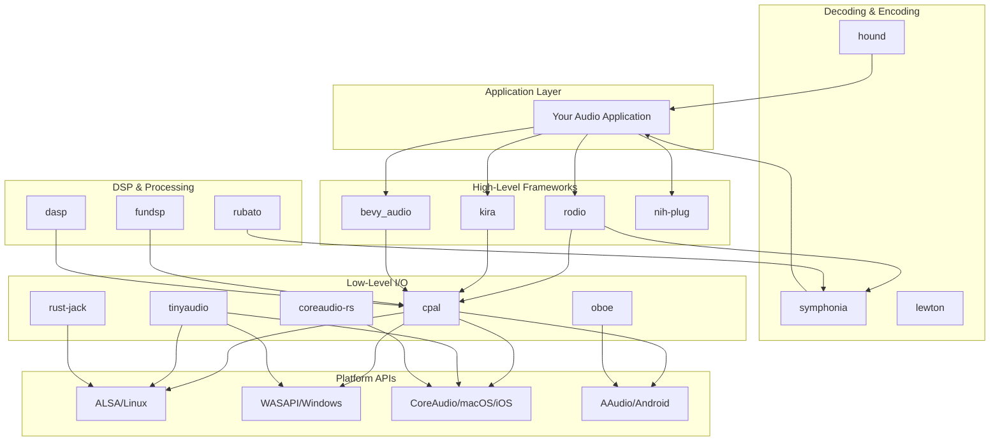
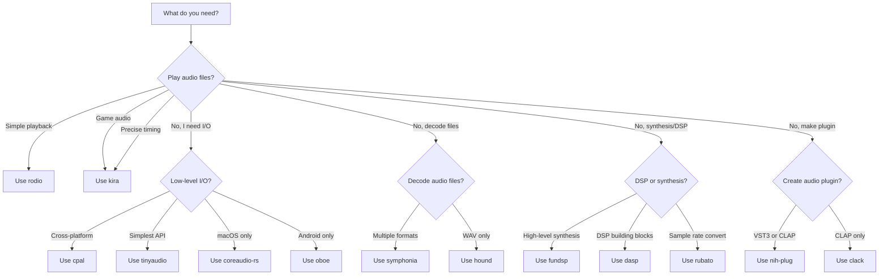

# Rust Audio Crates: A Comprehensive Deep Dive

## Introduction

The Rust audio ecosystem has matured significantly over the past several years, offering developers a rich selection of crates for virtually every audio-related task. Whether you're building a simple sound player, a complex digital audio workstation (DAW), a game with dynamic audio, or professional audio plugins, Rust provides robust tools to accomplish your goals. This document provides an in-depth analysis of the most prominent audio crates available in the Rust ecosystem, examining their features, platform support, use cases, and potential pitfalls.

The Rust audio landscape can be broadly categorized into several layers: low-level audio I/O libraries that handle direct communication with hardware, audio decoding and encoding libraries for working with various file formats, digital signal processing (DSP) libraries for audio manipulation and synthesis, and high-level frameworks that combine these capabilities for specific use cases like game audio or plugin development. Understanding these layers is crucial for selecting the right tools for your project, as each crate occupies a specific niche in the audio development workflow.



---

## 1. cpal (Cross-Platform Audio Library)

### Description

cpal is the foundational cross-platform audio I/O library in the Rust ecosystem. It provides a low-level, pure Rust interface for audio input and output across multiple platforms. As the name suggests, cpal abstracts away the platform-specific audio APIs, offering a unified interface for streaming audio to and from hardware devices. It serves as the backbone for many higher-level audio libraries, including rodio and kira, making it an essential component of the Rust audio ecosystem.

The library handles the complexities of audio stream management, including device enumeration, format negotiation, and buffer management. Developers interact with cpal through its stream API, which provides callbacks for audio data exchange. This design allows for real-time audio processing with minimal latency, making it suitable for applications requiring responsive audio feedback such as music software, games, and communication applications.

### Platform Support

| Platform        | Strength     | Backend                                                |
| --------------- | ------------ | ------------------------------------------------------ |
| **macOS**       | Excellent    | CoreAudio (primary), JACK (optional)                   |
| **Windows**     | Excellent    | WASAPI (default), ASIO (optional), JACK (optional)     |
| **Linux**       | Good         | ALSA (default), JACK (optional), PulseAudio (optional) |
| **iOS**         | Good         | CoreAudio via AVAudioSession                           |
| **Android**     | Good         | AAudio (Android 8.1+), Oboe fallback                   |
| **WebAssembly** | Experimental | Web Audio API                                          |
| **BSD**         | Fair         | ALSA, JACK                                             |

### Repository & Documentation

- **Repository:** https://github.com/RustAudio/cpal
- **Documentation:** https://docs.rs/cpal
- **Crates.io:** https://crates.io/crates/cpal

### When to Use

You should consider using cpal when you need direct, low-level control over audio I/O operations. It is ideal for applications that require real-time audio processing, custom audio pipelines, or when building higher-level audio libraries. cpal is particularly well-suited for audio synthesizers, digital audio workstations, real-time audio effects processors, and any application where you need precise control over audio streams and buffer management.

### When Not to Use

Avoid cpal if you simply need to play audio files without complex processing. For straightforward playback scenarios, higher-level libraries like rodio provide a much simpler API with automatic format conversion and file decoding. Additionally, if you are building a game and need integrated audio with features like spatial audio or music sequencing, libraries like kira or bevy_audio offer more appropriate abstractions.

### Features

| Feature   | Description                     | When to Use                                           | When Not to Use                     |
| --------- | ------------------------------- | ----------------------------------------------------- | ----------------------------------- |
| `default` | Enables standard functionality  | Most use cases                                        | Minimal builds                      |
| `asio`    | Enables ASIO backend on Windows | Professional audio applications requiring low latency | Consumer applications               |
| `jack`    | Enables JACK backend            | Linux professional audio setups                       | Desktop applications not using JACK |

### Code Example

```rust
use cpal::traits::{DeviceTrait, HostTrait, StreamTrait};
use cpal::{Data, SampleFormat, StreamConfig};

fn main() -> Result<(), anyhow::Error> {
    let host = cpal::default_host();
    let device = host.default_output_device().expect("no output device available");
    
    let config = device.default_output_config()?;
    println!("Default output config: {:?}", config);
    
    let stream = match config.sample_format() {
        SampleFormat::F32 => create_output_stream::<f32>(&device, &config.into())?,
        SampleFormat::I16 => create_output_stream::<i16>(&device, &config.into())?,
        SampleFormat::U16 => create_output_stream::<u16>(&device, &config.into())?,
        _ => return Err(anyhow::anyhow!("Unsupported sample format")),
    };
    
    stream.play()?;
    
    // Keep the stream alive
    std::thread::sleep(std::time::Duration::from_secs(5));
    
    Ok(())
}

fn create_output_stream<T>(
    device: &cpal::Device,
    config: &StreamConfig,
) -> Result<cpal::Stream, cpal::BuildStreamError>
where
    T: cpal::Sample,
{
    let channels = config.channels as usize;
    let sample_rate = config.sample_rate.0;
    let mut phase: f32 = 0.0;
    
    device.build_output_stream(
        config,
        move |data: &mut [T], _: &cpal::OutputCallbackInfo| {
            // Generate a simple sine wave
            for frame in data.chunks_mut(channels) {
                let value = (phase * 2.0 * std::f32::consts::PI).sin() * 0.1;
                phase += 440.0 / sample_rate as f32;
                if phase >= 1.0 { phase -= 1.0; }
                
                for sample in frame.iter_mut() {
                    *sample = cpal::Sample::from(&value);
                }
            }
        },
        |err| eprintln!("Audio stream error: {}", err),
        None,
    )
}
```

### Gotchas and How to Avoid Them

**Audio Glitches and Dropouts:** One of the most common issues developers encounter with cpal is audio glitching, characterized by pops, clicks, or stuttering during playback. This typically occurs when the audio callback takes too long to process, causing buffer underruns. To avoid this, ensure your audio processing code is efficient and avoids allocations, blocking operations, or heavy computations within the callback. Use a ring buffer to move heavy processing to a separate thread if necessary.

```rust
// Example: Using a ring buffer to separate processing from audio callback
use crossbeam_queue::ArrayQueue;
use std::sync::Arc;

// Pre-allocate a ring buffer for communication between threads
let audio_queue = Arc::new(ArrayQueue::new(1024));

// In audio callback: just read from queue (fast!)
// In processing thread: generate samples and write to queue
```

**Platform-Specific Buffer Sizes:** Different platforms have different optimal buffer sizes. Requesting a specific buffer size that works well on one platform may cause issues on another. Always test with `BufferSize::Default` first before requesting specific sizes, and handle the case where the platform may ignore your requested buffer size.

**Stream Lifetime Management:** A common mistake is allowing the audio stream to be dropped prematurely, which stops playback immediately. Ensure streams are stored properly and not accidentally dropped while audio should continue playing.

```rust
// Incorrect: Stream dropped immediately
fn play_sound() {
    let stream = create_stream();
    stream.play().unwrap();
    // Stream is dropped here, sound stops immediately!
}

// Correct: Return stream to keep it alive
fn play_sound() -> cpal::Stream {
    let stream = create_stream();
    stream.play().unwrap();
    stream // Return stream to caller
}
```

**Mobile Platform Permissions:** On iOS and Android, applications must request microphone and audio permissions before audio I/O will work. Failure to handle permissions properly will result in silent failures or errors. Ensure your application properly requests and handles these permissions before attempting to create audio streams.

### Similar Crates

- **tinyaudio:** Simpler alternative for basic audio output, easier API but less control
- **portaudio-rs:** Bindings to the PortAudio C library, more mature but requires external dependency
- **coreaudio-rs:** Direct Apple CoreAudio bindings, macOS/iOS specific
- **oboe:** Android-specific audio, used internally by cpal on Android

---

## 2. rodio

### Description

rodio is a high-level audio playback library built on top of cpal. It provides a simple, intuitive API for playing audio files with support for various formats, volume control, and basic audio effects. rodio abstracts away the complexities of audio stream management, allowing developers to focus on playing sounds rather than managing buffers and callbacks. The library has been part of the Rust ecosystem for over nine years and is one of the most popular audio crates available.

The library provides a `Sink` abstraction that manages audio output and allows for simultaneous playback of multiple sounds, volume control, and basic effects. It supports various audio formats through its integration with symphonia and other decoders, making it suitable for playing MP3, WAV, FLAC, OGG Vorbis, and other common formats. rodio also includes built-in support for audio sources like sine wave generators and noise generators.

### Platform Support

| Platform    | Strength  | Notes                                |
| ----------- | --------- | ------------------------------------ |
| **macOS**   | Excellent | Works out of the box via CoreAudio   |
| **Windows** | Excellent | WASAPI backend, reliable performance |
| **Linux**   | Good      | Requires ALSA development libraries  |
| **iOS**     | Fair      | Requires additional configuration    |
| **Android** | Fair      | Requires additional configuration    |

### Repository & Documentation

- **Repository:** https://github.com/RustAudio/rodio
- **Documentation:** https://docs.rs/rodio
- **Crates.io:** https://crates.io/crates/rodio

### When to Use

rodio is ideal for applications that need straightforward audio playback without complex real-time processing requirements. It excels in scenarios like playing background music in games, sound effects in applications, audio notification systems, and media players. If your primary goal is to load and play audio files with minimal code, rodio is an excellent choice.

### When Not to Use

Avoid rodio if you need precise timing control for audio events, complex audio routing, or real-time audio synthesis. The library's abstraction layers introduce latency that makes it unsuitable for applications requiring sample-accurate timing. For game audio with precise synchronization needs, consider kira instead. For real-time audio processing or synthesis, consider using cpal directly or fundsp.

### Features

| Feature            | Description                               | When to Use                      | When Not to Use                     |
| ------------------ | ----------------------------------------- | -------------------------------- | ----------------------------------- |
| `default`          | Includes playback, symphonia decoder      | Standard playback applications   | Minimal builds                      |
| `playback`         | Audio playback capability (requires cpal) | Most applications                | Decoding-only applications          |
| `symphonia-all`    | All symphonia format decoders             | When you need all format support | When you only need specific formats |
| `symphonia-aac`    | AAC decoder                               | AAC playback                     | Non-AAC playback                    |
| `symphonia-flac`   | FLAC decoder                              | FLAC playback                    | Non-FLAC playback                   |
| `symphonia-mp3`    | MP3 decoder                               | MP3 playback                     | Non-MP3 playback                    |
| `symphonia-vorbis` | Vorbis decoder                            | OGG Vorbis playback              | Non-Vorbis playback                 |
| `symphonia-wav`    | WAV decoder                               | WAV playback                     | Non-WAV playback                    |
| `flac`             | Native FLAC decoder (alternative)         | When not using symphonia         | When using symphonia                |
| `vorbis`           | Native Vorbis decoder (alternative)       | When not using symphonia         | When using symphonia                |
| `wav`              | Native WAV decoder (alternative)          | When not using symphonia         | When using symphonia                |
| `wasm-bindgen`     | WebAssembly support                       | Web target builds                | Non-web builds                      |
| `64bit`            | Enables 64-bit sample formats             | High-resolution audio processing | Standard audio applications         |

### Code Example

```rust
use rodio::{Decoder, OutputStream, Sink};
use std::fs::File;
use std::io::BufReader;
use std::time::Duration;

fn main() -> Result<(), anyhow::Error> {
    // Get output stream and handle (keep these alive!)
    let (_stream, stream_handle) = OutputStream::try_default()?;
    
    // Create a sink for audio playback
    let sink = Sink::try_new(&stream_handle)?;
    
    // Load and play a sound file
    let file = BufReader::new(File::open("sound.mp3")?);
    let source = Decoder::new(file)?;
    sink.append(source);
    
    // Control playback
    sink.set_volume(0.5); // 50% volume
    sink.sleep_until_end(); // Wait for playback to finish
    
    Ok(())
}

// Playing multiple sounds simultaneously
fn play_multiple_sounds() -> Result<(), anyhow::Error> {
    let (_stream, stream_handle) = OutputStream::try_default()?;
    let sink = Sink::try_new(&stream_handle)?;
    
    // Append multiple sources - they will play simultaneously
    let source1 = Decoder::new(BufReader::new(File::open("music.mp3")?))?;
    let source2 = Decoder::new(BufReader::new(File::open("sfx.wav")?))?;
    
    sink.append(source1);
    sink.append(source2);
    
    // The sink keeps playing until all sources are done
    sink.sleep_until_end();
    
    Ok(())
}

// Creating a simple sine wave
fn play_sine_wave() -> Result<(), anyhow::Error> {
    let (_stream, stream_handle) = OutputStream::try_default()?;
    let sink = Sink::try_new(&stream_handle)?;
    
    let source = rodio::source::SineWave::new(440.0) // 440 Hz
        .take_duration(Duration::from_secs(3))
        .amplify(0.1);
    
    sink.append(source);
    sink.sleep_until_end();
    
    Ok(())
}
```

### Gotchas and How to Avoid Them

**Stream Lifetime Issues:** The most common issue with rodio is the stream being dropped prematurely. The `OutputStream` must remain alive for the duration of audio playback. A common pattern is to store both the stream and sink together.

```rust
// Problem: Stream goes out of scope
fn broken_play() {
    let (_stream, handle) = OutputStream::try_default().unwrap();
    let sink = Sink::try_new(&handle).unwrap();
    sink.append(source);
    // _stream is dropped here, sound stops!
}

// Solution: Return both to keep them alive
struct AudioPlayer {
    _stream: OutputStream,
    sink: Sink,
}

impl AudioPlayer {
    fn new() -> Result<Self, rodio::StreamError> {
        let (stream, handle) = OutputStream::try_default()?;
        let sink = Sink::try_new(&handle)?;
        Ok(Self { _stream: stream, sink })
    }
}
```

**No Audio Output Without Errors:** Some users report that rodio runs without errors but produces no sound. This often occurs on Linux with PulseAudio configurations or when the default audio device is misconfigured. Always verify your default audio device works with system tools before debugging your code.

**Memory Usage with Large Files:** rodio loads and decodes audio files into memory. For very large audio files or many simultaneous sounds, this can consume significant memory. For streaming large files, consider implementing a custom `Source` that reads from disk in chunks.

**Linux Build Requirements:** On Linux, rodio requires ALSA development headers to compile. Install them with:

```bash
# Ubuntu/Debian
sudo apt-get install libasound2-dev

# Fedora
sudo dnf install alsa-lib-devel

# Arch Linux
sudo pacman -S alsa-lib
```

### Similar Crates

- **kira:** More feature-rich game audio with timing controls
- **bevy_audio:** Bevy game engine's audio module
- **rusty_audio:** Simpler alternative focused on game sound effects

---

## 3. kira

### Description

kira is an audio library designed specifically for creating expressive audio in games. Unlike rodio, which focuses on simple playback, kira provides sophisticated features for game audio including tweening for smooth parameter transitions, a flexible mixer with effect support, a clock system for precise audio timing, and spatial audio capabilities. The library is backend-agnostic, with cpal as the default backend, but can be configured to use other backends.

The design philosophy behind kira is that game audio should be dynamic and responsive to gameplay. Features like the clock system allow for precise synchronization between audio events and game events, while the tweening system enables smooth transitions for volume, panning, and other parameters. The mixer architecture allows for complex routing of audio through effects chains.

### Platform Support

| Platform        | Strength  | Notes                     |
| --------------- | --------- | ------------------------- |
| **macOS**       | Excellent | Full feature support      |
| **Windows**     | Excellent | Full feature support      |
| **Linux**       | Good      | Full feature support      |
| **iOS**         | Fair      | Via cpal backend          |
| **Android**     | Fair      | Via cpal backend          |
| **WebAssembly** | Good      | Has specific wasm support |

### Repository & Documentation

- **Repository:** https://github.com/tesselode/kira
- **Documentation:** https://docs.rs/kira
- **Crates.io:** https://crates.io/crates/kira

### When to Use

kira is the ideal choice for game developers who need more than basic sound playback. Use kira when you need to synchronize audio with game events precisely, create dynamic music systems that respond to gameplay, implement smooth transitions between audio states, or create spatial audio for 3D games. It's also excellent for applications that need a robust mixing system with effects.

### When Not to Use

If your needs are limited to simple sound effect playback without timing concerns, rodio may be simpler to integrate. kira's additional features come with a more complex API. Additionally, if you're already using the Bevy game engine, you might prefer bevy_kira_audio for better integration, or bevy_audio if you want something built into the engine.

### Features

| Feature          | Description           | When to Use                            | When Not to Use              |
| ---------------- | --------------------- | -------------------------------------- | ---------------------------- |
| `cpal` (default) | cpal audio backend    | Desktop and mobile applications        | WebAssembly builds           |
| `wasm`           | WebAssembly backend   | Web target builds                      | Desktop applications         |
| `serde`          | Serialization support | When you need to save/load audio state | Simple playback applications |

### Code Example

```rust
use kira::manager::{AudioManager, AudioManagerSettings, backend::DefaultBackend};
use kira::sound::static_sound::{StaticSoundData, StaticSoundSettings};
use kira::tween::Tween;
use kira::Volume;
use std::time::Duration;

fn main() -> Result<(), Box<dyn std::error::Error>> {
    // Create audio manager
    let mut manager = AudioManager::new(DefaultBackend::new()?)?;
    
    // Load a sound
    let sound_data = StaticSoundData::from_file("sound.mp3", StaticSoundSettings::default())?;
    
    // Play the sound
    let mut sound = manager.play(sound_data)?;
    
    // Smoothly fade out over 2 seconds
    sound.set_volume(Volume::Silent, Tween {
        duration: Duration::from_secs(2),
        ..Default::default()
    })?;
    
    // Wait for fade to complete
    std::thread::sleep(Duration::from_secs(2));
    
    Ok(())
}

// Using clocks for precise timing
use kira::clock::ClockHandle;

fn example_with_clocks(mut manager: AudioManager) -> Result<(), Box<dyn std::error::Error>> {
    // Create a clock for timing
    let mut clock = manager.add_clock(ClockSpeed::TicksPerMinute(120.0))?;
    
    // Start the clock
    clock.start();
    
    // Schedule sounds to play at specific clock ticks
    let sound_data = StaticSoundData::from_file("drum.wav", StaticSoundSettings::new()
        .start_position(ClockTime::from_ticks(&clock, 4.0)))?;
    
    manager.play(sound_data)?;
    
    Ok(())
}
```

### Gotchas and How to Avoid Them

**Sound Handle Lifetime:** Sound handles in kira must be kept alive for the sound to continue playing. Dropping a sound handle will stop the sound. Store handles appropriately if you need to control sounds after starting them.

**StaticSoundData Memory:** `StaticSoundData` loads the entire audio file into memory. For long audio files like music tracks, consider using streaming sounds instead to reduce memory usage.

**Clock Timing Precision:** While kira's clock system provides much better timing than rodio, it's still subject to the vagaries of the audio callback timing. For sample-accurate synchronization, you may need to implement additional buffering or compensation.

### Similar Crates

- **rodio:** Simpler, less feature-rich alternative
- **bevy_kira_audio:** Bevy integration for kira
- **bevy_audio:** Built-in Bevy audio (less feature-rich)

---

## 4. symphonia

### Description

symphonia is a 100% pure Rust audio decoding and media demuxing framework. It supports a wide range of audio formats and provides a plugin-based architecture for adding new codecs and formats. symphonia distinguishes itself by offering pure Rust implementations that can match or exceed the performance of established C libraries like FFmpeg in many scenarios. The library focuses on correctness, safety, and performance while maintaining a clean, well-documented API.

The framework separates concerns into demuxers (which parse container formats like MP4, OGG, MKV) and decoders (which decode audio codecs like AAC, MP3, FLAC). This modular design allows applications to use only the components they need. symphonia is used as the default decoder backend for rodio and can be integrated into any application that needs reliable audio decoding.

### Platform Support

| Platform        | Strength  | Notes                               |
| --------------- | --------- | ----------------------------------- |
| **macOS**       | Excellent | Pure Rust, no platform dependencies |
| **Windows**     | Excellent | Pure Rust, no platform dependencies |
| **Linux**       | Excellent | Pure Rust, no platform dependencies |
| **iOS**         | Excellent | Pure Rust, no platform dependencies |
| **Android**     | Excellent | Pure Rust, no platform dependencies |
| **WebAssembly** | Excellent | Pure Rust, works in wasm            |

### Repository & Documentation

- **Repository:** https://github.com/pdeljanov/Symphonia
- **Documentation:** https://docs.rs/symphonia
- **Crates.io:** https://crates.io/crates/symphonia

### When to Use

Use symphonia when you need reliable, safe audio decoding without external C dependencies. It's ideal for applications that process audio files, media players, or any project that requires format-agnostic audio decoding. symphonia is particularly valuable when you need to support multiple audio formats without pulling in large dependencies like FFmpeg.

### When Not to Use

If you only need to decode one specific format and want minimal dependencies, specialized decoders might be lighter. For example, hound for WAV files. If you need video decoding or more comprehensive multimedia support, FFmpeg bindings may be more appropriate.

### Features

| Feature   | Description                       | When to Use         | When Not to Use |
| --------- | --------------------------------- | ------------------- | --------------- |
| `default` | Core decoding with common formats | Most applications   | Minimal builds  |
| `aac`     | AAC decoder                       | AAC support needed  | No AAC files    |
| `flac`    | FLAC decoder                      | FLAC support needed | No FLAC files   |
| `mp3`     | MP3 decoder                       | MP3 support needed  | No MP3 files    |
| `pcm`     | PCM decoder                       | WAV/AIFF support    | No PCM files    |
| `vorbis`  | Vorbis decoder                    | OGG Vorbis support  | No Vorbis files |
| `wav`     | WAV format support                | WAV files           | No WAV files    |
| `ogg`     | OGG container support             | OGG files           | No OGG files    |
| `mkv`     | MKV container support             | MKV audio           | No MKV files    |
| `isomp4`  | MP4/M4A container                 | MP4/M4A audio       | No MP4 files    |
| `aiff`    | AIFF format support               | AIFF files          | No AIFF files   |
| `alac`    | ALAC decoder                      | Apple Lossless      | No ALAC files   |

### Code Example

```rust
use symphonia::core::audio::{SampleBuffer, SignalSpec};
use symphonia::core::codecs::{DecoderOptions, CODEC_TYPE_NULL};
use symphonia::core::errors::Error;
use symphonia::core::formats::{FormatOptions, FormatReader};
use symphonia::core::io::MediaSourceStream;
use symphonia::core::meta::MetadataOptions;
use symphonia::core::probe::Hint;
use std::fs::File;

fn decode_audio_file(path: &str) -> Result<Vec<f32>, Box<dyn std::error::Error>> {
    // Open the file
    let file = File::open(path)?;
    let mss = MediaSourceStream::new(Box::new(file), Default::default());
    
    // Create a hint to help with format detection
    let mut hint = Hint::new();
    hint.with_extension("mp3"); // Helps identify format faster
    
    // Probe the format
    let format_opts = FormatOptions::default();
    let metadata_opts = MetadataOptions::default();
    
    let probed = symphonia::default::get_probe()
        .format(&hint, mss, &format_opts, &metadata_opts)?;
    
    let mut format = probed.format;
    
    // Find the first audio track
    let track = format.tracks()
        .iter()
        .find(|t| t.codec_params.codec != CODEC_TYPE_NULL)
        .ok_or("No audio track found")?;
    
    // Create a decoder
    let decoder_opts = DecoderOptions::default();
    let mut decoder = symphonia::default::get_codecs()
        .make(&track.codec_params, &decoder_opts)?;
    
    // Decode all packets
    let mut samples = Vec::new();
    let spec = SignalSpec::new(
        track.codec_params.sample_rate.unwrap_or(44100),
        track.codec_params.channels.unwrap_or_default(),
    );
    
    loop {
        let packet = match format.next_packet() {
            Ok(packet) => packet,
            Err(Error::IoError(_)) => break, // End of stream
            Err(e) => return Err(e.into()),
        };
        
        let decoded = decoder.decode(&packet)?;
        let mut sample_buf = SampleBuffer::<f32>::new(
            decoded.capacity() as u64,
            spec.clone(),
        );
        sample_buf.copy_interleaved_ref(decoded);
        samples.extend_from_slice(sample_buf.samples());
    }
    
    Ok(samples)
}
```

### Gotchas and How to Avoid Them

**Memory Usage:** Decoding entire files into memory can be expensive for large files. Use streaming approaches when possible, processing audio in chunks rather than loading everything at once.

**Format Detection:** While symphonia can automatically detect formats, providing hints (file extension, MIME type) speeds up detection and can help avoid misidentification.

**Sample Format Conversion:** symphonia outputs samples in their native format. You may need to convert to your desired format (e.g., f32 interleaved) using `SampleBuffer`.

### Similar Crates

- **hound:** WAV-specific, simpler for just WAV files
- **lewton:** Vorbis-specific decoder
- **claxon:** FLAC-specific decoder
- **minimp3:** MP3-specific decoder

---

## 5. fundsp

### Description

fundsp is an audio processing and synthesis library with a focus on usability and expressiveness. It features a powerful inline graph notation for describing audio processing networks, making it possible to write complex audio pipelines in a readable, composable manner. The library provides a comprehensive suite of audio components including oscillators, filters, effects, and mathematical operations that can be combined to create synthesizers, effects processors, and other audio applications.

The library's compositional approach allows developers to build audio processing graphs declaratively. Components can be chained together using operators, and the resulting graphs are compiled into efficient audio processing code. fundsp supports real-time audio processing and integrates well with cpal for audio I/O.

### Platform Support

| Platform    | Strength  | Notes                       |
| ----------- | --------- | --------------------------- |
| **macOS**   | Excellent | Pure Rust, works everywhere |
| **Windows** | Excellent | Pure Rust, works everywhere |
| **Linux**   | Excellent | Pure Rust, works everywhere |
| **iOS**     | Excellent | Pure Rust, works everywhere |
| **Android** | Excellent | Pure Rust, works everywhere |

### Repository & Documentation

- **Repository:** https://github.com/SamiPerttu/fundsp
- **Documentation:** https://docs.rs/fundsp
- **Crates.io:** https://crates.io/crates/fundsp

### When to Use

Use fundsp when you need to create audio synthesizers, effects processors, or any application requiring real-time audio DSP. It excels at creating complex audio processing pipelines with its declarative graph notation. The library is ideal for music applications, audio plugins, and educational tools for audio programming.

### When Not to Use

fundsp is focused on audio synthesis and processing, not audio playback from files. For simple file playback, use rodio or symphonia. For professional plugin development, nih-plug might provide more appropriate abstractions for the plugin format requirements.

### Features

| Feature   | Description            | When to Use      | When Not to Use |
| --------- | ---------------------- | ---------------- | --------------- |
| `default` | Core DSP functionality | All applications | Minimal builds  |

### Code Example

```rust
use fundsp::hacker::*;

fn main() {
    // Create a simple synthesizer with envelope
    let mut synth = (
        // Sine wave oscillator at 440 Hz
        sine_hz(440.0)
        // Apply ADSR envelope
        >> envelope(|t| {
            // Attack: 0.01s, Decay: 0.1s, Sustain: 0.5, Release: 0.3s
            let attack = 0.01;
            let decay = 0.1;
            let sustain = 0.5;
            let release = 0.3;
            
            if t < attack {
                t / attack
            } else if t < attack + decay {
                1.0 - (1.0 - sustain) * (t - attack) / decay
            } else {
                sustain
            }
        })
        // Scale output
        * 0.3
    );
    
    // Generate 1 second of audio at 44100 Hz
    let sample_rate = 44100.0;
    let duration = 1.0;
    let samples = (sample_rate * duration) as usize;
    
    for i in 0..samples {
        let t = i as f32 / sample_rate;
        let sample = synth.get_mono(t);
        // Use sample...
    }
}

// More complex example: Polyphonic synthesizer
fn polyphonic_synth() {
    // A more complex patch with multiple oscillators
    let mut synth = (
        // Two detuned saw waves
        saw_hz(440.0) + saw_hz(442.0)
        // Low-pass filter with envelope
        >> lowpass_hz(2000.0, 1.0)
        // Add some reverb
        >> reverb_st(0.5, 0.5)
        // Scale output
        * 0.2
    );
}

// Real-time audio with cpal integration
use cpal::traits::{DeviceTrait, HostTrait, StreamTrait};

fn real_time_audio() -> Result<(), anyhow::Error> {
    let host = cpal::default_host();
    let device = host.default_output_device()?;
    let config = device.default_output_config()?;
    
    let mut synth = (sine_hz(440.0) * 0.1);
    let sample_rate = config.sample_rate().0 as f64;
    let mut time = 0.0;
    
    let stream = device.build_output_stream(
        &config.into(),
        move |data: &mut [f32], _: &cpal::OutputCallbackInfo| {
            for sample in data.iter_mut() {
                *sample = synth.get_mono(time) as f32;
                time += 1.0 / sample_rate;
            }
        },
        |err| eprintln!("Stream error: {}", err),
        None,
    )?;
    
    stream.play()?;
    std::thread::sleep(std::time::Duration::from_secs(5));
    
    Ok(())
}
```

### Gotchas and How to Avoid Them

**Time Continuity:** The synthesizer expects continuous time values. Gaps or jumps in time can cause artifacts. When integrating with audio callbacks, maintain a continuous time counter.

**Sample Rate Consistency:** Ensure your sample rate calculations are consistent between the synth and your audio output. Mismatched sample rates will cause pitch and timing issues.

**Performance:** Complex graphs can be CPU-intensive. Profile your audio graph and consider simplifying or optimizing hot paths for real-time applications.

### Similar Crates

- **dasp:** More fundamental DSP building blocks
- **nih-plug:** Plugin framework with DSP capabilities
- **vst-rs:** VST plugin development

---

## 6. dasp (Digital Audio Signal Processing)

### Description

dasp is a suite of crates providing the fundamentals for working with digital audio signals. It offers types, traits, and functions for working with PCM (pulse-code modulation) audio data. The library provides low-level, high-performance tools for sample type conversions, signal processing operations, and audio algorithm development. dasp was formerly known as the `sample` crate and has been a foundational component in the Rust audio ecosystem for years.

The dasp ecosystem is organized into multiple crates that can be used independently or together. These include `dasp_sample` for sample type traits and conversions, `dasp_frame` for working with audio frames (collections of samples), `dasp_slice` for slice operations, `dasp_ring_buffer` for circular buffers, `dasp_signal` for signal processing traits and operations, and `dasp_interpolate` for interpolation algorithms used in sample rate conversion.

### Platform Support

| Platform    | Strength  | Notes                           |
| ----------- | --------- | ------------------------------- |
| **macOS**   | Excellent | Pure Rust, platform-independent |
| **Windows** | Excellent | Pure Rust, platform-independent |
| **Linux**   | Excellent | Pure Rust, platform-independent |
| **iOS**     | Excellent | Pure Rust, platform-independent |
| **Android** | Excellent | Pure Rust, platform-independent |

### Repository & Documentation

- **Repository:** https://github.com/RustAudio/dasp
- **Documentation:** https://docs.rs/dasp
- **Crates.io:** https://crates.io/crates/dasp

### When to Use

Use dasp when you're building audio processing algorithms from the ground up and need fundamental DSP building blocks. It's ideal for sample format conversions, implementing custom signal processing algorithms, building audio analysis tools, or creating the DSP core of a larger audio application.

### When Not to Use

For simple audio playback, rodio provides a higher-level API. For synthesis with a simpler API, fundsp offers a more approachable interface. dasp is a foundational library, so expect to write more code compared to higher-level alternatives.

### Features

| Feature | Description              | When to Use             | When Not to Use           |
| ------- | ------------------------ | ----------------------- | ------------------------- |
| `std`   | Standard library support | Most applications       | `no_std` environments     |
| `boxed` | Boxed signal support     | Dynamic dispatch needed | Performance-critical code |
| `all`   | All features enabled     | Convenience             | Minimal builds            |

### Code Example

```rust
use dasp::{signal, Sample, Signal};
use dasp::interpolate::linear::Linear;
use dasp::signal::interpolate::Converter;

fn main() {
    // Create a simple sine wave signal
    let frames_per_second = 44100;
    let mut signal = signal::rate(frames_per_second as f64)
        .const_hz(440.0)
        .sine();
    
    // Take 44100 samples (1 second)
    let samples: Vec<f32> = signal
        .take(44100)
        .map(|frame| frame[0].to_sample())
        .collect();
    
    println!("Generated {} samples", samples.len());
}

// Sample rate conversion example
fn resample(input: Vec<f32>, from_rate: u32, to_rate: u32) -> Vec<f32> {
    use dasp::signal::from_iter;
    use dasp::interpolate::Converter;
    
    let source = from_iter(input.into_iter().map(|s| [s]));
    let interp = Linear::from_source(source.clone());
    
    let ratio = to_rate as f64 / from_rate as f64;
    let mut converter = Converter::scale_playback_hz(source, interp, ratio);
    
    let output: Vec<f32> = converter
        .take(10000) // Limit output
        .map(|frame| frame[0])
        .collect();
    
    output
}

// Working with different sample types
use dasp::sample::{I24, U24, I48, U48};

fn sample_conversions() {
    // dasp provides traits for converting between sample formats
    let f32_sample: f32 = 0.5;
    let i16_sample: i16 = f32_sample.to_sample();
    let u8_sample: u8 = f32_sample.to_sample();
    
    println!("f32: {}, i16: {}, u8: {}", f32_sample, i16_sample, u8_sample);
}
```

### Gotchas and How to Avoid Them

**Learning Curve:** dasp's trait-based design can have a learning curve. Start with the high-level signal API before diving into the lower-level traits.

**Performance with Closures:** Some signal operations use closures which can impact performance in tight loops. Profile and optimize hot paths as needed.

**No Built-in File I/O:** dasp focuses on signal processing, not file I/O. You'll need to pair it with a library like hound or symphonia for file operations.

### Similar Crates

- **fundsp:** Higher-level synthesis and processing
- **rubato:** Focused on sample rate conversion
- **realfft:** FFT operations for frequency domain processing

---

## 7. rubato

### Description

rubato is a flexible audio sample rate conversion library for Rust. It provides high-quality resampling algorithms that can be optimized for either quality or speed depending on your requirements. Sample rate conversion is essential when working with audio from different sources that have incompatible sample rates, or when you need to match a target sample rate for processing or output.

The library offers multiple resampler implementations, including Sinc-based interpolators for high-quality conversion and faster algorithms for real-time applications. rubato handles both upsampling (increasing sample rate) and downsampling (decreasing sample rate) with configurable parameters for filter quality and latency.

### Platform Support

| Platform    | Strength  | Notes     |
| ----------- | --------- | --------- |
| **macOS**   | Excellent | Pure Rust |
| **Windows** | Excellent | Pure Rust |
| **Linux**   | Excellent | Pure Rust |
| **iOS**     | Excellent | Pure Rust |
| **Android** | Excellent | Pure Rust |

### Repository & Documentation

- **Repository:** https://github.com/HEnquist/rubato
- **Documentation:** https://docs.rs/rubato
- **Crates.io:** https://crates.io/crates/rubato

### When to Use

Use rubato when you need to convert audio between different sample rates. This is common when integrating audio from multiple sources, preparing audio for a specific output device, or ensuring compatibility with processing algorithms that expect a particular sample rate. rubato is essential for building audio applications that need to handle diverse audio sources.

### When Not to Use

If you're already using rodio or kira for playback, they may handle sample rate conversion automatically. For very simple linear interpolation (acceptable for some real-time applications), you might implement a simpler solution yourself.

### Features

| Feature         | Description                   | When to Use                     | When Not to Use            |
| --------------- | ----------------------------- | ------------------------------- | -------------------------- |
| `default`       | Core resampling functionality | All applications                | Minimal builds             |
| `fft-resampler` | FFT-based resampling          | High-quality offline processing | Real-time with low latency |

### Code Example

```rust
use rubato::{FftFixedIn, Resampler};

fn main() -> Result<(), Box<dyn std::error::Error>> {
    // Input: 44100 Hz, Output: 48000 Hz
    let input_rate = 44100_usize;
    let output_rate = 48000_usize;
    let channels = 2_usize;
    let chunk_size = 1024_usize;
    
    // Create a resampler
    let mut resampler = FftFixedIn::new(
        input_rate,
        output_rate,
        channels,
        chunk_size,
        2, // Sub-chunks for overlapping
    )?;
    
    // Generate some test input
    let input: Vec<Vec<f32>> = (0..channels)
        .map(|_| (0..chunk_size).map(|i| (i as f32 / 100.0).sin()).collect())
        .collect();
    
    // Process the input
    let output = resampler.process(&input, None)?;
    
    println!("Input samples: {}", input[0].len());
    println!("Output samples: {}", output[0].len());
    // Output will have approximately (input * output_rate / input_rate) samples
    
    Ok(())
}

// Real-time resampling example
struct RealTimeResampler {
    resampler: rubato::FftFixedIn<f32>,
    input_buffer: Vec<Vec<f32>>,
}

impl RealTimeResampler {
    fn new(input_rate: usize, output_rate: usize, channels: usize) -> Result<Self, rubato::ResampleError> {
        let chunk_size = 256;
        let resampler = rubato::FftFixedIn::new(
            input_rate,
            output_rate,
            channels,
            chunk_size,
            1,
        )?;
        
        Ok(Self {
            resampler,
            input_buffer: vec![Vec::new(); channels],
        })
    }
    
    fn process(&mut self, input: &[Vec<f32>]) -> Result<Vec<Vec<f32>>, rubato::ResampleError> {
        // Accumulate input
        for (ch_in, ch_buf) in input.iter().zip(self.input_buffer.iter_mut()) {
            ch_buf.extend(ch_in.iter().copied());
        }
        
        // Process when we have enough data
        let needed = self.resampler.input_frames_next();
        if self.input_buffer[0].len() >= needed {
            let chunk: Vec<Vec<f32>> = self.input_buffer
                .iter()
                .map(|ch| ch[..needed].to_vec())
                .collect();
            
            // Remove processed samples from buffer
            for ch_buf in &mut self.input_buffer {
                ch_buf.drain(..needed);
            }
            
            return self.resampler.process(&chunk, None);
        }
        
        Ok(vec![vec![]; input.len()])
    }
}
```

### Gotchas and How to Avoid Them

**Chunk Size Requirements:** FFT-based resamplers require input in specific chunk sizes. Plan your buffer management accordingly and accumulate samples until you have enough to process.

**Latency:** Resampling introduces latency, especially with high-quality algorithms. Account for this in real-time applications. Lower chunk sizes reduce latency but may impact quality.

**Memory Usage:** The internal buffers for high-quality resampling can be significant. Consider memory constraints on embedded or mobile platforms.

### Similar Crates

- **dasp:** Includes basic interpolation for sample rate conversion
- **resampler:** Alternative resampling library
- **libsamplerate bindings:** If you need the established libsamplerate algorithms

---

## 8. hound

### Description

hound is a WAV encoding and decoding library for Rust. It provides a simple, safe interface for reading and writing WAV files, supporting various sample formats including PCM integer formats (8, 16, 24, 32-bit) and IEEE float formats (32, 64-bit). As one of the older and more established crates in the ecosystem, hound is battle-tested and used as the default WAV backend in rodio.

The library focuses exclusively on the WAV format, providing deep support for the format's various features including different sample formats, channel configurations, and metadata. hound's straightforward API makes it easy to read audio samples from WAV files or write generated audio to WAV files.

### Platform Support

| Platform    | Strength  | Notes     |
| ----------- | --------- | --------- |
| **macOS**   | Excellent | Pure Rust |
| **Windows** | Excellent | Pure Rust |
| **Linux**   | Excellent | Pure Rust |
| **iOS**     | Excellent | Pure Rust |
| **Android** | Excellent | Pure Rust |

### Repository & Documentation

- **Repository:** https://github.com/ruuda/hound
- **Documentation:** https://docs.rs/hound
- **Crates.io:** https://crates.io/crates/hound

### When to Use

Use hound when you need to read or write WAV files specifically. It's ideal for applications that process WAV audio, generate audio and save to WAV, or need lightweight WAV support without pulling in larger decoding libraries. hound is perfect for scientific audio applications, simple audio tools, and as a building block for more complex audio software.

### When Not to Use

If you need support for multiple audio formats (MP3, FLAC, OGG), symphonia provides a more comprehensive solution. For audio playback, rodio or kira are more appropriate as they handle the full pipeline from file to speaker.

### Features

hound has no optional features; all functionality is included by default.

### Code Example

```rust
use hound::{WavReader, WavWriter, WavSpec, SampleFormat};

fn main() -> Result<(), Box<dyn std::error::Error>> {
    // Reading a WAV file
    let mut reader = WavReader::open("input.wav")?;
    let spec = reader.spec();
    
    println!("Sample rate: {} Hz", spec.sample_rate);
    println!("Channels: {}", spec.channels);
    println!("Bits per sample: {}", spec.bits_per_sample);
    
    // Read all samples
    let samples: Vec<i32> = reader.samples::<i32>().collect::<Result<Vec<_>, _>>()?;
    println!("Total samples: {}", samples.len());
    
    // Writing a WAV file
    let spec = WavSpec {
        channels: 1,
        sample_rate: 44100,
        bits_per_sample: 16,
        sample_format: SampleFormat::Int,
    };
    
    let mut writer = WavWriter::create("output.wav", spec)?;
    
    // Generate a 440 Hz sine wave
    for t in 0..44100 {
        let sample = (t as f32 / 44100.0 * 440.0 * 2.0 * std::f32::consts::PI).sin();
        let amplitude = (sample * 32767.0) as i16;
        writer.write_sample(amplitude)?;
    }
    
    writer.finalize()?;
    
    Ok(())
}

// Processing WAV files
fn process_wav(input_path: &str, output_path: &str) -> Result<(), Box<dyn std::error::Error>> {
    let mut reader = WavReader::open(input_path)?;
    let spec = reader.spec();
    
    let mut writer = WavWriter::create(output_path, spec)?;
    
    // Process each sample (example: normalize and apply gain)
    let max_val = 2_i32.pow(spec.bits_per_sample as u32 - 1) - 1;
    
    for sample in reader.samples::<i32>() {
        let sample = sample?;
        // Apply gain of 0.5
        let processed = (sample as f64 * 0.5).clamp(-max_val as f64, max_val as f64) as i32;
        writer.write_sample(processed)?;
    }
    
    writer.finalize()?;
    Ok(())
}
```

### Gotchas and How to Avoid Them

**Sample Type Mismatches:** When reading samples, the type must match the file's format. Use the spec to determine the correct type, or use the generic sample type trait.

```rust
// Correct: Match type to spec
let samples: Result<Vec<i16>, _> = reader.samples::<i16>().collect();

// Or use dynamic typing
for sample in reader.samples::<hound::Sample>() {
    let sample = sample?;
    // Handle different sample types
}
```

**File Size Limits:** Standard WAV files have a 4GB size limit due to the 32-bit chunk size field. For larger files, consider the RF64 format (not currently supported by hound).

**Writer Must Be Finalized:** Always call `finalize()` on `WavWriter` when done, or the file will be incomplete. The file header is only written correctly after finalization.

### Similar Crates

- **symphonia:** Multi-format decoder including WAV
- **wavers:** Alternative WAV library with additional features
- **audrey:** Multi-format with WAV support

---

## 9. nih-plug

### Description

nih-plug is an API-agnostic audio plugin framework written in Rust. It supports creating VST3 and CLAP plugins with a focus on providing a simple, stateful API for plugin development. The framework handles the complexities of plugin formats, parameter management, state persistence, and editor integration, allowing developers to focus on the DSP and UI aspects of their plugins.

nih-plug takes its name from the "Not Invented Here" principle, as it was created to provide a Rust-native plugin development experience without relying on existing C++ frameworks like JUCE. It includes a growing collection of example plugins and provides abstractions for common plugin tasks like parameter smoothing, preset management, and cross-platform editor support through egui.

### Platform Support

| Platform    | Strength  | Notes                               |
| ----------- | --------- | ----------------------------------- |
| **macOS**   | Excellent | VST3, CLAP, AUv2 (via clap-wrapper) |
| **Windows** | Excellent | VST3, CLAP                          |
| **Linux**   | Excellent | VST3, CLAP                          |
| **iOS**     | Limited   | Not primary target                  |
| **Android** | Limited   | Not primary target                  |

### Repository & Documentation

- **Repository:** https://github.com/robbert-vdh/nih-plug
- **Documentation:** https://nih-plug.robbertvanderhelm.nl
- **Crates.io:** Not on crates.io (use git dependency)

### When to Use

Use nih-plug when developing professional audio plugins (effects, instruments) for DAWs. It's ideal for developers who want to write plugins in pure Rust without the complexity of the raw VST3 or CLAP APIs. nih-plug excels at creating standard audio plugins with parameters, state management, and GUI support.

### When Not to Use

If you need AUv3 support for iOS, other solutions may be more appropriate. For simple audio applications that aren't plugins, use cpal or rodio instead. If you need to host plugins rather than create them, look for host libraries instead.

### Features

| Feature      | Description                 | When to Use             | When Not to Use    |
| ------------ | --------------------------- | ----------------------- | ------------------ |
| `default`    | Core plugin functionality   | All plugins             | Minimal builds     |
| `vst3`       | VST3 format support         | DAW compatibility       | CLAP-only builds   |
| `clap`       | CLAP format support         | Modern DAWs             | VST3-only builds   |
| `standalone` | Standalone application mode | Testing and development | Plugin-only builds |

### Code Example

```rust
use nih_plug::prelude::*;
use std::sync::Arc;

struct GainPlugin {
    params: Arc<GainParams>,
}

#[derive(Params)]
struct GainParams {
    #[id = "gain"]
    gain: FloatParam,
}

impl Default for GainParams {
    fn default() -> Self {
        Self {
            gain: FloatParam::new(
                "Gain",
                util::db_to_gain(0.0),
                FloatRange::Skewed {
                    min: util::db_to_gain(-30.0),
                    max: util::db_to_gain(30.0),
                    factor: FloatRange::gain_skew_factor(-30.0, 30.0),
                },
            )
            .with_smoother(SmoothingStyle::Logarithmic(50.0))
            .with_unit(" dB")
            .with_value_to_string(formatters::v2s_f32_gain_to_db(2))
            .with_string_to_value(formatters::s2v_f32_gain_to_db()),
        }
    }
}

impl Default for GainPlugin {
    fn default() -> Self {
        Self {
            params: Arc::new(GainParams::default()),
        }
    }
}

impl Plugin for GainPlugin {
    const NAME: &'static str = "Gain";
    const VENDOR: &'static str = "Your Name";
    const URL: &'static str = "https://your-domain.com";
    const EMAIL: &'static str = "your-email@example.com";
    const VERSION: &'static str = env!("CARGO_PKG_VERSION");

    const AUDIO_IO_LAYOUTS: &'static [AudioIOLayout] = &[
        AudioIOLayout {
            main_input_channels: NonZeroU32::new(2),
            main_output_channels: NonZeroU32::new(2),
            ..AudioIOLayout::const_default()
        },
    ];

    type SysExMessage = ();
    type BackgroundTask = ();

    fn params(&self) -> Arc<dyn Params> {
        self.params.clone()
    }

    fn process(
        &mut self,
        buffer: &mut Buffer,
        _aux: &mut AuxiliaryBuffers,
        _context: &mut impl ProcessContext<Self>,
    ) -> ProcessStatus {
        for channel_samples in buffer.iter_samples() {
            let gain = self.params.gain.smoothed.next();
            
            for sample in channel_samples {
                *sample *= gain;
            }
        }

        ProcessStatus::Normal
    }
}

impl ClapPlugin for GainPlugin {
    const CLAP_ID: &'static str = "com.your-name.gain";
    const CLAP_DESCRIPTION: Option<&'static str> = Some("A simple gain plugin");
    const CLAP_MANUAL_URL: Option<&'static str> = Some(Self::URL);
    const CLAP_SUPPORT_URL: Option<&'static str> = None;
    const CLAP_FEATURES: &'static [ClapFeature] = &[ClapFeature::AudioEffect, ClapFeature::Stereo];
}

impl Vst3Plugin for GainPlugin {
    const VST3_CLASS_ID: [u8; 16] = *b"GainPluginGuid!!";
    const VST3_SUBCATEGORIES: &'static [Vst3SubCategory] = &[Vst3SubCategory::Fx, Vst3SubCategory::Dynamics];
}

nih_export_vst3!(GainPlugin);
nih_export_clap!(GainPlugin);
```

### Gotchas and How to Avoid Them

**Git Dependency Required:** nih-plug isn't on crates.io, so you'll need to use a git dependency in your Cargo.toml:

```toml
[dependencies]
nih_plug = { git = "https://github.com/robbert-vdh/nih-plug.git" }
```

**Real-Time Safety:** Audio processing happens in a real-time context. Avoid allocations, locks, and blocking operations in the `process` method. Pre-allocate buffers and use lock-free data structures for communication with the UI.

**Parameter Thread Safety:** Parameters can be accessed from both the audio thread and UI thread. Use the provided atomic parameter types and avoid direct field access.

### Similar Crates

- **vst-rs:** VST2 plugin development (deprecated)
- **clack:** Low-level CLAP bindings
- **rsynth:** Alternative plugin framework

---

## 10. tinyaudio

### Description

tinyaudio is a cross-platform, easy-to-use, low-level audio output library. Its primary goal is to provide unified access to a default sound output device as simply as possible, covering as many platforms including PC (Windows, Linux, macOS), mobile devices (Android, iOS), and WebAssembly. Unlike cpal, tinyaudio focuses exclusively on audio output and uses a callback-based model where you provide a function that generates audio samples.

The library is designed for simplicity and minimalism. It abstracts away platform-specific details and provides a straightforward API for audio output. tinyaudio is particularly well-suited for game engines, emulators, and applications that need basic audio output without the complexity of full-featured audio libraries.

### Platform Support

| Platform        | Strength  | Notes                   |
| --------------- | --------- | ----------------------- |
| **macOS**       | Excellent | CoreAudio backend       |
| **Windows**     | Excellent | WASAPI backend          |
| **Linux**       | Excellent | PulseAudio/ALSA backend |
| **iOS**         | Good      | CoreAudio backend       |
| **Android**     | Good      | AAudio/Oboe backend     |
| **WebAssembly** | Good      | Web Audio API backend   |

### Repository & Documentation

- **Repository:** https://github.com/mendsley/tinyaudio
- **Documentation:** https://docs.rs/tinyaudio
- **Crates.io:** https://crates.io/crates/tinyaudio

### When to Use

Use tinyaudio when you need simple audio output without the complexity of cpal. It's ideal for game engines, emulators, procedural audio generators, and applications that need to output audio samples from a callback. tinyaudio is particularly useful when you want minimal setup and broad platform support including mobile and web.

### When Not to Use

If you need audio input (recording), cpal is necessary. For high-level features like file playback, mixing, or effects, rodio or kira are better choices. If you need precise control over device selection or advanced audio configuration, cpal provides more options.

### Features

tinyaudio has no optional features; all functionality is included by default.

### Code Example

```rust
use tinyaudio::run_output_device;

fn main() -> Result<(), Box<dyn std::error::Error>> {
    let sample_rate = 44100;
    let channels = 2;
    let mut phase: f32 = 0.0;
    
    // Create audio output device with callback
    let _device = run_output_device(
        sample_rate as u32,
        channels as usize,
        move |data| {
            // Generate a simple sine wave
            for frame in data.chunks_mut(channels) {
                let sample = (phase * 2.0 * std::f32::consts::PI).sin() * 0.1;
                phase += 440.0 / sample_rate as f32;
                if phase >= 1.0 { phase -= 1.0; }
                
                for channel in frame.iter_mut() {
                    *channel = sample;
                }
            }
        },
    )?;
    
    println!("Playing sine wave... Press Enter to stop.");
    let mut input = String::new();
    std::io::stdin().read_line(&mut input)?;
    
    // Device is automatically stopped when dropped
    Ok(())
}

// Example with a simple audio buffer
struct SimpleAudioPlayer {
    buffer: Vec<f32>,
    position: usize,
    sample_rate: u32,
}

impl SimpleAudioPlayer {
    fn new(samples: Vec<f32>, sample_rate: u32) -> Self {
        Self {
            buffer: samples,
            position: 0,
            sample_rate,
        }
    }
    
    fn run(self) -> Result<(), Box<dyn std::error::Error>> {
        let channels = 2;
        let player = std::cell::RefCell::new(self);
        
        let _device = run_output_device(
            player.borrow().sample_rate,
            channels,
            move |data| {
                let mut player = player.borrow_mut();
                
                for frame in data.chunks_mut(channels) {
                    let sample = if player.position < player.buffer.len() {
                        let s = player.buffer[player.position];
                        player.position += 1;
                        s
                    } else {
                        0.0 // Silence when buffer exhausted
                    };
                    
                    for channel in frame.iter_mut() {
                        *channel = sample;
                    }
                }
            },
        )?;
        
        std::thread::sleep(std::time::Duration::from_secs(10));
        Ok(())
    }
}
```

### Gotchas and How to Avoid Them

**Callback Timing:** The audio callback runs on a high-priority thread. Keep processing minimal to avoid audio glitches. Pre-compute what you can and use lock-free structures for communication.

**Sample Rate Matching:** tinyaudio will use the sample rate you specify, but the actual hardware sample rate may differ. For best results, match the device's native sample rate or implement sample rate conversion.

**Device Lifetime:** The device runs until dropped. Store the returned device handle in a variable with appropriate lifetime for your application.

### Similar Crates

- **cpal:** More features, more complex API
- **sdl2::audio:** SDL-based audio (requires SDL)

---

## 11. coreaudio-rs

### Description

coreaudio-rs provides Rust bindings to Apple's CoreAudio framework, which is the native audio API for macOS and iOS. This crate offers a safe, idiomatic Rust interface to CoreAudio's functionality, enabling developers to leverage Apple's powerful audio capabilities directly. The bindings aim to be zero-cost, providing direct access to CoreAudio features without runtime overhead.

CoreAudio is a comprehensive framework that provides audio I/O, audio processing, and audio management on Apple platforms. This crate exposes CoreAudio's AudioUnit API, which allows for low-latency audio input and output, audio format conversion, and audio effect processing. For developers targeting Apple platforms exclusively, coreaudio-rs offers the most direct access to platform-specific features.

### Platform Support

| Platform    | Strength  | Notes                     |
| ----------- | --------- | ------------------------- |
| **macOS**   | Excellent | Native CoreAudio bindings |
| **iOS**     | Good      | CoreAudio on iOS          |
| **Windows** | N/A       | Not supported             |
| **Linux**   | N/A       | Not supported             |
| **Android** | N/A       | Not supported             |

### Repository & Documentation

- **Repository:** https://github.com/RustAudio/coreaudio-rs
- **Documentation:** https://docs.rs/coreaudio
- **Crates.io:** https://crates.io/crates/coreaudio-rs

### When to Use

Use coreaudio-rs when developing macOS or iOS applications that need direct access to CoreAudio features not exposed through cross-platform libraries. This includes utilizing AudioUnits, audio device management, audio session configuration on iOS, or other platform-specific features.

### When Not to Use

For cross-platform audio applications, cpal provides a unified API that works across all platforms. If you don't need CoreAudio-specific features, the cross-platform alternatives will serve you better and simplify your codebase.

### Features

| Feature      | Description        | When to Use           | When Not to Use   |
| ------------ | ------------------ | --------------------- | ----------------- |
| `audio_unit` | AudioUnit bindings | Audio I/O and effects | Simple playback   |
| `open_al`    | OpenAL bindings    | 3D audio              | Basic audio needs |

### Code Example

```rust
use coreaudio::audio_unit::{AudioUnit, IOType, StreamFormat};
use coreaudio::audio_unit::render_callback::{self, data};

fn main() Result<(), coreaudio::Error> {
    // Create an output audio unit
    let mut audio_unit = AudioUnit::new(IOType::DefaultOutput)?;
    
    // Configure stream format
    let stream_format = StreamFormat {
        sample_rate: 44100.0,
        channels: 2,
        format_flags: 0,
        frames_per_packet: 1,
        bytes_per_frame: 4,
        bytes_per_packet: 4,
        bits_per_channel: 32,
    };
    
    let mut phase: f32 = 0.0;
    
    // Set up render callback
    audio_unit.set_render_callback(Some(Box::new(move |args| {
        let data = args.data.data::<f32>().unwrap();
        
        for frame in data.chunks_mut(2) {
            let sample = (phase * 2.0 * std::f32::consts::PI).sin() * 0.1;
            phase += 440.0 / 44100.0;
            if phase >= 1.0 { phase -= 1.0; }
            
            frame[0] = sample;
            frame[1] = sample;
        }
        
        Ok(())
    })))?;
    
    // Start audio
    audio_unit.start()?;
    
    std::thread::sleep(std::time::Duration::from_secs(5));
    
    audio_unit.stop()?;
    Ok(())
}
```

### Gotchas and How to Avoid Them

**macOS/iOS Only:** This crate only works on Apple platforms. Use conditional compilation if including in cross-platform code.

**Unsafe Interiors:** While the crate provides safe interfaces, some CoreAudio features require understanding the underlying C API. Read Apple's CoreAudio documentation for advanced usage.

**Real-Time Constraints:** Audio callbacks in CoreAudio have strict real-time requirements. Avoid allocations, locks, and blocking operations in callbacks.

### Similar Crates

- **cpal:** Cross-platform alternative (uses coreaudio-rs internally on macOS)
- **oboe:** Android equivalent

---

## 12. oboe

### Description

oboe provides Rust bindings to the Oboe C++ library, which is a high-performance audio library for Android. Oboe was created by Google to provide a unified, low-latency audio API for Android, abstracting the differences between the older OpenSL ES API and the newer AAudio API (introduced in Android 8.1). The Rust bindings allow developers to use Oboe from Rust applications targeting Android.

The library is essential for Android audio development when low latency is required. It automatically selects the best available API (AAudio on newer devices, OpenSL ES on older ones) and handles common issues like stream reconfiguration during audio device changes. For Rust developers building Android audio applications, oboe provides the most robust solution for low-latency audio I/O.

### Platform Support

| Platform    | Strength  | Notes          |
| ----------- | --------- | -------------- |
| **Android** | Excellent | Primary target |
| **macOS**   | N/A       | Not supported  |
| **Windows** | N/A       | Not supported  |
| **Linux**   | N/A       | Not supported  |
| **iOS**     | N/A       | Not supported  |

### Repository & Documentation

- **Repository:** https://github.com/katyo/oboe-rs
- **Documentation:** https://docs.rs/oboe
- **Crates.io:** https://crates.io/crates/oboe

### When to Use

Use oboe when developing Android applications that require low-latency audio, such as music apps, games, or real-time audio processing applications. It's essential when building Android audio apps in Rust or when cpal's Android support doesn't meet your specific needs.

### When Not to Use

For cross-platform development, cpal provides Android support via oboe internally, offering a unified API. Use oboe directly only when you need Android-specific features not exposed through cpal.

### Features

| Feature          | Description           | When to Use                | When Not to Use    |
| ---------------- | --------------------- | -------------------------- | ------------------ |
| `default`        | Core functionality    | Most applications          | Minimal builds     |
| `java-interface` | JNI interop           | Integration with Java code | Pure Rust apps     |
| `generate-jni`   | Generate JNI bindings | Building JNI layer         | Pre-built bindings |

### Code Example

```rust
use oboe::{AudioStream, AudioStreamBuilder, PerformanceMode, SharingMode, Direction};
use oboe::{DataCallbackResult, AudioOutputStream};

struct SineWaveGenerator {
    phase: f32,
    sample_rate: f32,
    frequency: f32,
}

impl oboe::DataCallback for SineWaveGenerator {
    type FrameType = f32;
    
    fn on_audio_ready(&mut self, stream: &mut dyn AudioOutputStream, data: &mut [Self::FrameType]) -> DataCallbackResult {
        for sample in data.iter_mut() {
            *sample = (self.phase * 2.0 * std::f32::consts::PI).sin() * 0.1;
            self.phase += self.frequency / self.sample_rate;
            if self.phase >= 1.0 { self.phase -= 1.0; }
        }
        DataCallbackResult::Continue
    }
}

fn main() -> Result<(), Box<dyn std::error::Error>> {
    let sample_rate = 48000.0;
    
    let generator = SineWaveGenerator {
        phase: 0.0,
        sample_rate,
        frequency: 440.0,
    };
    
    let mut stream = AudioStreamBuilder::default()
        .set_direction(Direction::Output)
        .set_performance_mode(PerformanceMode::LowLatency)
        .set_sharing_mode(SharingMode::Exclusive)
        .set_sample_rate(sample_rate as i32)
        .set_channels(1)
        .set_data_callback(Box::new(generator))
        .open_stream()?;
    
    stream.start()?;
    
    // Keep running
    std::thread::sleep(std::time::Duration::from_secs(10));
    
    stream.stop()?;
    
    Ok(())
}
```

### Gotchas and How to Avoid Them

**Android-Only:** This crate only works on Android. Use conditional compilation or separate code paths for Android builds.

**Permission Requirements:** Android requires RECORD_AUDIO permission for input and MODIFY_AUDIO_SETTINGS for some configurations. Declare these in your AndroidManifest.xml.

**NDK Requirements:** Building requires the Android NDK. Ensure your build environment is properly configured with ANDROID_NDK_HOME set.

### Similar Crates

- **cpal:** Cross-platform alternative (uses oboe on Android)
- **coreaudio-rs:** iOS/macOS equivalent

---

## 13. vst-rs

### Description

vst-rs is a library for creating VST 2.4 audio plugins in Rust. It provides bindings to the VST2 API, enabling developers to write audio plugins that can be loaded in most DAWs. The library has been a cornerstone of Rust audio plugin development, though it's important to note that the project is now deprecated and archived due to Steinberg discontinuing the VST2 SDK license.

While vst-rs has been instrumental in demonstrating that Rust can be used for professional audio plugin development, new projects should consider using nih-plug or clack instead. The VST2 format itself is considered deprecated, with most professional audio developers moving to VST3 or CLAP formats. However, existing vst-rs based plugins continue to work, and understanding vst-rs can be valuable for maintaining legacy codebases.

### Platform Support

| Platform    | Strength | Notes         |
| ----------- | -------- | ------------- |
| **macOS**   | Good     | VST2 support  |
| **Windows** | Good     | VST2 support  |
| **Linux**   | Good     | VST2 support  |
| **iOS**     | N/A      | Not supported |
| **Android** | N/A      | Not supported |

### Repository & Documentation

- **Repository:** https://github.com/RustAudio/vst-rs
- **Documentation:** https://docs.rs/vst
- **Crates.io:** https://crates.io/crates/vst

### When to Use

**This crate is deprecated.** Do not use for new projects. It's listed here for historical context and for developers who need to understand or maintain existing vst-rs based plugins.

### When Not to Use

**Always use alternatives for new projects.** Use nih-plug for VST3/CLAP development, or clack for low-level CLAP access.

### Features

| Feature   | Description             | When to Use     | When Not to Use |
| --------- | ----------------------- | --------------- | --------------- |
| `default` | Core VST2 functionality | Legacy projects | New projects    |

### Code Example

```rust
// DEPRECATED - For reference only
// Use nih-plug for new projects

use vst::buffer::AudioBuffer;
use vst::plugin::{Category, Info, Plugin};

struct GainPlugin {
    gain: f32,
}

impl Default for GainPlugin {
    fn default() -> Self {
        Self { gain: 1.0 }
    }
}

impl Plugin for GainPlugin {
    fn get_info(&self) -> Info {
        Info {
            name: "Simple Gain".to_string(),
            vendor: "Your Name".to_string(),
            unique_id: 123456,
            category: Category::Effect,
            ..Default::default()
        }
    }
    
    fn process(&mut self, buffer: &mut AudioBuffer<f32>) {
        for (input, output) in buffer.zip() {
            for (in_sample, out_sample) in input.iter().zip(output.iter_mut()) {
                *out_sample = *in_sample * self.gain;
            }
        }
    }
}

vst::plugin_main!(GainPlugin);
```

### Gotchas and How to Avoid Them

**Deprecated Format:** VST2 is deprecated by Steinberg. New plugins should use VST3 or CLAP formats through nih-plug or clack.

**License Issues:** The VST2 SDK is no longer officially available. Existing vst-rs plugins may have distribution restrictions.

**Limited DAW Support:** Some modern DAWs no longer support VST2 plugins, particularly on macOS where VST2 support was removed from Logic Pro.

### Similar Crates

- **nih-plug:** Modern alternative (VST3, CLAP)
- **clack:** Low-level CLAP bindings
- **rsynth:** Alternative plugin framework

---

## Summary Comparison Table

The following table provides a quick reference for selecting the appropriate crate based on your use case and platform requirements.

| Crate            | Category       | macOS | Windows | Linux | iOS   | Android | WASM  | Primary Use Case             |
| ---------------- | -------------- | ----- | ------- | ----- | ----- | ------- | ----- | ---------------------------- |
| **cpal**         | Low-level I/O  | ★★★★★ | ★★★★★   | ★★★★☆ | ★★★★☆ | ★★★★☆   | ★★★☆☆ | Cross-platform audio I/O     |
| **rodio**        | Playback       | ★★★★★ | ★★★★★   | ★★★★☆ | ★★★☆☆ | ★★★☆☆   | ★★★☆☆ | Simple audio playback        |
| **kira**         | Game Audio     | ★★★★★ | ★★★★★   | ★★★★☆ | ★★★☆☆ | ★★★☆☆   | ★★★★☆ | Game audio with timing       |
| **symphonia**    | Decoding       | ★★★★★ | ★★★★★   | ★★★★★ | ★★★★★ | ★★★★★   | ★★★★★ | Multi-format audio decoding  |
| **fundsp**       | DSP/Synthesis  | ★★★★★ | ★★★★★   | ★★★★★ | ★★★★★ | ★★★★★   | ★★★★★ | Audio synthesis and DSP      |
| **dasp**         | DSP Basics     | ★★★★★ | ★★★★★   | ★★★★★ | ★★★★★ | ★★★★★   | ★★★★★ | DSP fundamentals             |
| **rubato**       | Resampling     | ★★★★★ | ★★★★★   | ★★★★★ | ★★★★★ | ★★★★★   | ★★★★★ | Sample rate conversion       |
| **hound**        | WAV I/O        | ★★★★★ | ★★★★★   | ★★★★★ | ★★★★★ | ★★★★★   | ★★★★★ | WAV file reading/writing     |
| **nih-plug**     | Plugins        | ★★★★★ | ★★★★★   | ★★★★★ | ★★☆☆☆ | ★★☆☆☆   | ★☆☆☆☆ | VST3/CLAP plugin development |
| **tinyaudio**    | Simple Output  | ★★★★★ | ★★★★★   | ★★★★★ | ★★★★☆ | ★★★★☆   | ★★★★☆ | Minimal audio output         |
| **coreaudio-rs** | Apple Audio    | ★★★★★ | N/A     | N/A   | ★★★★☆ | N/A     | N/A   | macOS/iOS native audio       |
| **oboe**         | Android Audio  | N/A   | N/A     | N/A   | N/A   | ★★★★★   | N/A   | Android low-latency audio    |
| **vst-rs**       | Plugins (dep.) | ★★★☆☆ | ★★★☆☆   | ★★★☆☆ | N/A   | N/A     | N/A   | Legacy VST2 plugins          |

### Legend

- ★★★★★: Excellent support, recommended for production
- ★★★★☆: Good support, minor limitations
- ★★★☆☆: Fair support, may require workarounds
- ★★☆☆☆: Limited support, significant limitations
- ★☆☆☆☆: Minimal/experimental support
- N/A: Not applicable

---

## Choosing the Right Crate

### Decision Flowchart



### Common Scenarios

**Building a game:** Use `kira` for rich game audio with timing, or `rodio` for simple sound effects. If using Bevy, consider `bevy_kira_audio`.

**Building a media player:** Use `symphonia` for decoding, `cpal` for output, or simplify with `rodio` for basic players.

**Building a DAW:** Use `cpal` for audio I/O, `nih-plug` for plugin hosting, and various DSP crates for processing.

**Building an audio plugin:** Use `nih-plug` for VST3/CLAP support. For existing plugins or specific needs, consider `clack`.

**Building a synthesizer:** Use `fundsp` for synthesis, `cpal` for output. For a plugin, use `nih-plug` with your DSP code.

**Audio analysis tool:** Use `symphonia` or `hound` for file reading, `dasp` for signal analysis, and `realfft` for frequency domain work.

---

## Conclusion

The Rust audio ecosystem provides a rich set of tools for virtually any audio-related task. From the foundational cpal library that handles cross-platform audio I/O to specialized libraries like nih-plug for professional plugin development, Rust developers have access to well-designed, safe, and performant tools for audio programming.

When selecting crates for your project, consider the following principles: start with higher-level libraries when possible (rodio for simple playback, kira for games), drop to lower-level libraries (cpal, tinyaudio) when you need more control, and mix and match specialized libraries (symphonia for decoding, rubato for resampling) as your needs require. The ecosystem's modular design allows for composable solutions, and the RustAudio GitHub organization provides a central hub for community-maintained audio tools.

As the ecosystem continues to mature, expect to see continued improvements in areas like mobile support, real-time safety guarantees, and integration with game engines. The community is active and welcoming, with the RustAudio Discord server and GitHub repositories serving as hubs for discussion and development.
