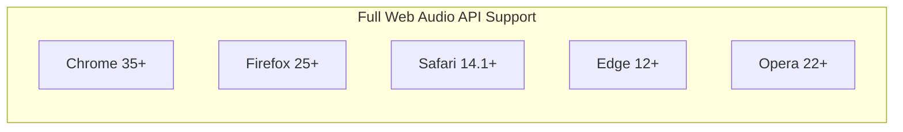
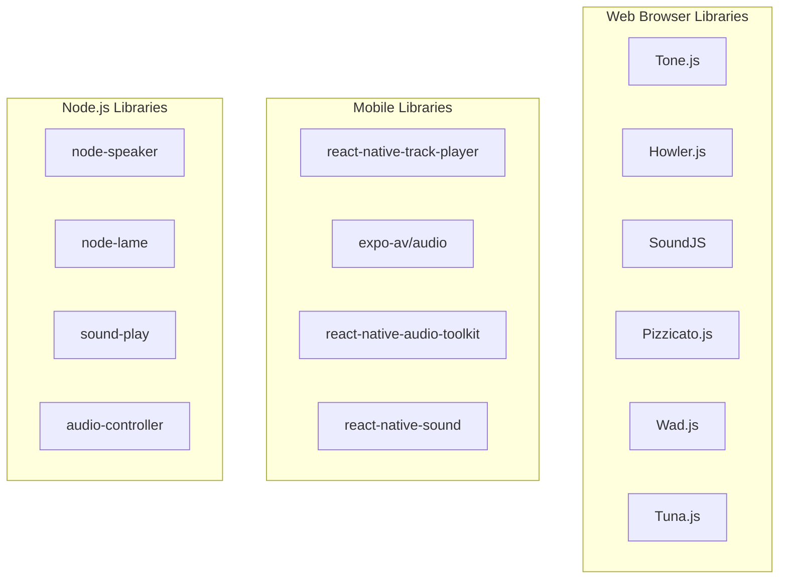
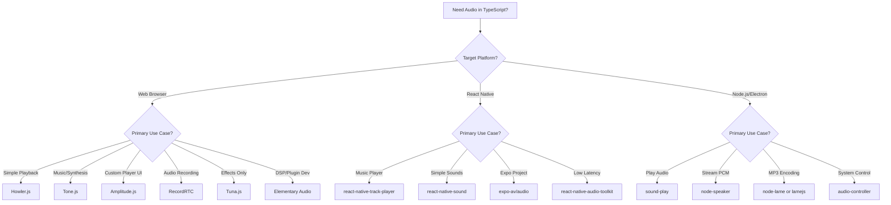

# TypeScript Audio Libraries: A Comprehensive Deep Dive

A thorough exploration of TypeScript/JavaScript libraries for audio interaction across desktop and mobile platforms.

---

## Table of Contents

1. [Introduction](#introduction)
2. [The Web Audio API Foundation](#the-web-audio-api-foundation)
3. [Web Browser Audio Libraries](#web-browser-audio-libraries)
   - [Tone.js](#tonejs)
   - [Howler.js](#howlerjs)
   - [SoundJS (CreateJS)](#soundjs-createjs)
   - [Pizzicato.js](#pizzicatojs)
   - [Wad.js](#wadius)
   - [Tuna.js](#tunajs)
   - [Timbre.js](#timbrejs)
   - [XSound](#xsound)
   - [Amplitude.js](#amplitudejs)
   - [Elementary Audio](#elementary-audio)
   - [Standardized Audio Context](#standardized-audio-context)
   - [RecordRTC](#recordrtc)
   - [lamejs](#lamejs)
4. [React Native / Mobile Audio Libraries](#react-native--mobile-audio-libraries)
   - [react-native-track-player](#react-native-track-player)
   - [expo-av / expo-audio](#expo-av--expo-audio)
   - [react-native-audio-toolkit](#react-native-audio-toolkit)
   - [react-native-sound](#react-native-sound)
   - [React Native Audio API](#react-native-audio-api)
5. [Node.js Desktop Audio Libraries](#nodejs-desktop-audio-libraries)
   - [node-speaker](#node-speaker)
   - [node-lame](#node-lame)
   - [sound-play](#sound-play)
   - [audio-controller](#audio-controller)
   - [node-audio (Mastra)](#node-audio-mastra)
6. [Platform Support Summary Table](#platform-support-summary-table)
7. [Choosing the Right Library](#choosing-the-right-library)
8. [Common Gotchas Across All Libraries](#common-gotchas-across-all-libraries)
9. [Conclusion](#conclusion)

---

## Introduction

Working with audio in TypeScript/JavaScript applications presents unique challenges depending on your target platforms. The ecosystem has evolved significantly, offering specialized libraries for different use cases—from simple playback to complex audio synthesis and processing. This guide explores the landscape of audio libraries available to TypeScript developers, helping you make informed decisions for your specific requirements.

The audio library ecosystem can be broadly categorized into three domains: **web browser libraries** (built on Web Audio API), **React Native/mobile libraries** (bridging to native audio capabilities), and **Node.js desktop libraries** (for server-side or Electron applications). Each domain has its own set of libraries with varying levels of abstraction, platform support, and feature sets.

Understanding the strengths and limitations of each library is crucial for building robust audio-enabled applications. Whether you're building a music production tool, a game with sound effects, a podcast app, or an audio recording application, choosing the right library can significantly impact development time, performance, and user experience.

---

## The Web Audio API Foundation

Before diving into specific libraries, it's essential to understand the **Web Audio API**—the foundational technology that most browser-based audio libraries build upon. The Web Audio API is a high-level JavaScript API for processing and synthesizing audio in web applications, providing a powerful and versatile system for controlling audio on the web.

### Key Capabilities

The Web Audio API enables developers to choose audio sources, add effects to audio, create audio visualizations, apply spatial effects (such as panning), and implement complex audio processing graphs. It uses an **AudioContext** interface that contains an audio graph of connected **AudioNode**s, which control the routing and processing of audio signals.

### Browser Support



As of 2024, Web Audio API enjoys excellent browser support across all major browsers. Chrome, Firefox, Edge, and Opera have full support, while Safari has made significant improvements in recent versions. However, Safari still presents some quirks and differences that developers need to account for, particularly around AudioWorklet implementation and certain audio processing features.

### Basic Usage Example (Modern TypeScript)

```typescript
// Modern TypeScript with Web Audio API
class AudioPlayer {
  private audioContext: AudioContext | null = null;
  private audioBuffer: AudioBuffer | null = null;
  private sourceNode: AudioBufferSourceNode | null = null;

  async initialize(): Promise<void> {
    this.audioContext = new AudioContext();
  }

  async loadAudio(url: string): Promise<void> {
    if (!this.audioContext) {
      throw new Error('AudioContext not initialized');
    }

    const response = await fetch(url);
    const arrayBuffer = await response.arrayBuffer();
    this.audioBuffer = await this.audioContext.decodeAudioData(arrayBuffer);
  }

  play(): void {
    if (!this.audioContext || !this.audioBuffer) {
      return;
    }

    this.sourceNode = this.audioContext.createBufferSource();
    this.sourceNode.buffer = this.audioBuffer;
    this.sourceNode.connect(this.audioContext.destination);
    this.sourceNode.start();
  }

  stop(): void {
    this.sourceNode?.stop();
    this.sourceNode = null;
  }
}
```

While the Web Audio API is powerful, it's also verbose and requires handling various browser-specific quirks. This is where audio libraries come in—they provide abstractions, fallbacks, and additional features that make audio development more productive and reliable.

---

## Web Browser Audio Libraries

### Tone.js

**Tone.js** is a comprehensive Web Audio framework for creating interactive music in the browser. It's designed to be familiar to both musicians and audio engineers, providing abstractions for synthesizers, effects, and timing that make complex audio applications more approachable.

#### Core Feature Set

Tone.js offers an extensive collection of features that make it one of the most powerful audio libraries for web applications:

- **Instruments**: Pre-built synthesizers including Synth, PolySynth, AMSynth, FMSynth, DuoSynth, MonoSynth, MetalSynth, MembraneSynth, NoiseSynth, and Sampler
- **Effects**: Reverb, Delay, Distortion, Chorus, Phaser, Tremolo, Vibrato, FeedbackDelay, PingPongDelay, and more
- **Timing**: Scheduling events with sample-accurate timing, tempo-based timing (BPM), and transport control
- **Sources**: Oscillators, noise generators, audio buffers, and player components
- **Analysis**: Analyser, Meter, FFT, and Waveform for audio visualization

#### Repository & Documentation

| Resource      | URL                                |
| ------------- | ---------------------------------- |
| Repository    | https://github.com/Tonejs/Tone.js  |
| Documentation | https://tonejs.github.io/docs/     |
| Examples      | https://tonejs.github.io/examples/ |

#### Platform Support

| Platform                      | Support Level | Notes                                                        |
| ----------------------------- | ------------- | ------------------------------------------------------------ |
| macOS (Safari/Chrome/Firefox) | Excellent     | Full feature support across all browsers                     |
| Windows (Chrome/Firefox/Edge) | Excellent     | Full feature support across all browsers                     |
| Linux (Chrome/Firefox)        | Excellent     | Full feature support across all browsers                     |
| iOS (Safari/Chrome)           | Good          | Requires user gesture to start AudioContext; may have performance issues with complex patches |
| Android (Chrome/Firefox)      | Good          | Performance can vary; test on target devices                 |

#### When to Use Tone.js

Tone.js is ideal for applications requiring **music creation, synthesis, or complex audio processing**. Use it when you need to:

- Build interactive music applications or digital audio workstations (DAWs) in the browser
- Create synthesizers, drum machines, or music production tools
- Implement step sequencers, arpeggiators, or other tempo-synchronized features
- Apply real-time audio effects with precise timing control
- Develop audio visualization tools with beat detection

#### When Not to Use Tone.js

Avoid Tone.js when you need **simple audio playback** without synthesis or effects:

- Simple sound effects for games (consider Howler.js instead)
- Basic audio player functionality (consider Amplitude.js or native HTML5 Audio)
- When bundle size is a critical concern (Tone.js is relatively large)
- When you only need audio recording (consider RecordRTC)

#### Common Gotchas and Solutions

**1. AudioContext Must Start After User Gesture**

```typescript
// ❌ Won't work on mobile - AudioContext starts suspended
const synth = new Tone.Synth().toDestination();
synth.triggerAttackRelease('C4', '8n');

// ✅ Correct approach - wait for user interaction
document.getElementById('startButton')?.addEventListener('click', async () => {
  await Tone.start(); // Resumes AudioContext
  const synth = new Tone.Synth().toDestination();
  synth.triggerAttackRelease('C4', '8n');
});
```

**2. Mobile Performance Issues**

On mobile devices, complex Tone.js patches can cause audio crackling and performance problems. This is particularly noticeable with polyphonic synthesizers and multiple effects chains. To mitigate:

```typescript
// Reduce polyphony on mobile
const isMobile = /iPhone|iPad|iPod|Android/i.test(navigator.userAgent);
const maxPolyphony = isMobile ? 4 : 16;

const synth = new Tone.PolySynth(Tone.Synth, {
  maxPolyphony
}).toDestination();
```

**3. iOS Safari Loading Issues**

iOS Safari may have issues loading audio samples via the Sampler. Always provide fallback formats:

```typescript
const sampler = new Tone.Sampler({
  urls: {
    C4: 'C4.mp3',
    'D#4': 'Ds4.ogg', // Provide multiple formats
    'F#4': 'Fs4.mp3',
    A4: 'A4.mp3'
  },
  release: 1,
  baseUrl: '/samples/'
}).toDestination();

// Handle loading errors gracefully
await Tone.loaded(); // Wait for all samples to load
```

**4. Memory Leaks with Frequent Sound Creation**

Creating new Tone.js objects repeatedly without disposing of them leads to memory leaks:

```typescript
// ❌ Memory leak - creates new nodes every time
function playNote(note: string) {
  const synth = new Tone.Synth().toDestination();
  synth.triggerAttackRelease(note, '8n');
}

// ✅ Correct - reuse or dispose
const synth = new Tone.Synth().toDestination();

function playNote(note: string) {
  synth.triggerAttackRelease(note, '8n');
}

// When done with the synth:
synth.dispose();
```

#### Similar Libraries

- **Wad.js**: Similar synthesis capabilities but simpler API; good for basic synthesis
- **Timbre.js**: Functional approach to audio programming; more modular but less actively maintained
- **Elementary Audio**: Declarative, functional approach; better for DSP-focused applications
- **Pizzicato.js**: Simpler effects-focused library; less comprehensive synthesis options

---

### Howler.js

**Howler.js** is one of the most popular and widely-used JavaScript audio libraries for the modern web. It defaults to Web Audio API and falls back to HTML5 Audio, making working with audio in JavaScript easy and reliable across all platforms.

#### Core Feature Set

Howler.js focuses on providing a robust, cross-platform solution for audio playback:

- **Multiple Codec Support**: Automatically selects the best format from provided options (MP3, WebM, OGG, WAV, etc.)
- **Fallback Mechanism**: Gracefully falls back from Web Audio API to HTML5 Audio when needed
- **Sprite Support**: Define multiple sounds within a single audio file for efficient loading
- **Spatial Audio**: Basic 3D audio positioning and stereo panning
- **Fading and Volume Control**: Smooth volume transitions and individual sound volume control
- **Mobile Support**: Handles mobile browser restrictions automatically
- **Caching**: Automatic caching for better performance
- **Multi-play**: Play multiple instances of the same sound simultaneously

#### Repository & Documentation

| Resource      | URL                                   |
| ------------- | ------------------------------------- |
| Repository    | https://github.com/goldfire/howler.js |
| Documentation | https://howlerjs.com/                 |

#### Platform Support

| Platform                      | Support Level | Notes                                                        |
| ----------------------------- | ------------- | ------------------------------------------------------------ |
| macOS (Safari/Chrome/Firefox) | Excellent     | Full feature support                                         |
| Windows (Chrome/Firefox/Edge) | Excellent     | Full feature support                                         |
| Linux (Chrome/Firefox)        | Excellent     | Full feature support                                         |
| iOS (Safari/Chrome)           | Good          | Requires careful handling of auto-play policies; some iOS-specific quirks |
| Android (Chrome/Firefox)      | Good          | Generally reliable; some older versions have Web Audio limitations |

#### When to Use Howler.js

Howler.js excels at **audio playback** scenarios and is ideal for:

- Game sound effects and background music
- Web applications requiring reliable cross-browser audio playback
- Projects needing sprite-based audio for performance optimization
- Audio playback with basic effects (volume, fade, panning)
- Quick implementation of audio without complex processing needs

#### When Not to Use Howler.js

Avoid Howler.js when you need:

- Complex audio synthesis (use Tone.js instead)
- Advanced audio effects beyond basic panning and fading
- Real-time audio analysis (use native Web Audio API with AnalyserNode)
- Audio recording capabilities (use RecordRTC)

#### Common Gotchas and Solutions

**1. iOS Safari Audio Won't Play**

iOS Safari has strict auto-play policies. Audio must be triggered by a user gesture:

```typescript
import { Howl, Howler } from 'howler';

// ❌ Won't work on iOS
const sound = new Howl({ src: ['sound.mp3'] });
sound.play();

// ✅ Correct approach
document.getElementById('playButton')?.addEventListener('click', () => {
  const sound = new Howl({ src: ['sound.mp3'] });
  sound.play();
});
```

**2. HTML5 Fallback Issues on iOS**

Sometimes iOS won't properly fall back to HTML5 Audio:

```typescript
// Force HTML5 mode if Web Audio issues on iOS
const sound = new Howl({
  src: ['sound.mp3', 'sound.webm'],
  html5: true // Force HTML5 Audio
});
```

**3. Sound Loading Performance**

Loading too many sounds simultaneously can block the UI thread:

```typescript
// ❌ Loading all sounds at once
const sounds = soundFiles.map(file => new Howl({ src: [file] }));

// ✅ Use preloading with callbacks
const sounds: Howl[] = [];
let loadedCount = 0;

soundFiles.forEach((file, index) => {
  sounds[index] = new Howl({
    src: [file],
    preload: true,
    onload: () => {
      loadedCount++;
      if (loadedCount === soundFiles.length) {
        console.log('All sounds loaded');
      }
    }
  });
});
```

**4. Sprite Playback Issues**

When using sprites, seek operations can behave unexpectedly:

```typescript
const soundSprite = new Howl({
  src: ['sounds.webm', 'sounds.mp3'],
  sprite: {
    jump: [0, 500],    // 0-500ms
    shoot: [1000, 300], // 1000-1300ms
    explosion: [2000, 1500] // 2000-3500ms
  }
});

// ✅ Always use sprite name for sprite playback
soundSprite.play('jump');

// ❌ Don't try to seek sprites manually
// soundSprite.play(); soundSprite.seek(0); // Won't work as expected
```

**5. Audio Interruption on Mobile**

On mobile, audio can be interrupted by system sounds or other apps. Handle the `stop` event:

```typescript
const sound = new Howl({
  src: ['background-music.mp3'],
  loop: true,
  onstop: function() {
    console.log('Audio was stopped (possibly by system)');
    // Handle interruption (e.g., show notification to user)
  }
});
```

#### Similar Libraries

- **SoundJS**: Similar cross-browser approach; better integration with CreateJS ecosystem
- **Wad.js**: More synthesis-focused; good for both playback and sound generation
- **Amplitude.js**: More focused on media player UI; better for music player applications

---

### SoundJS (CreateJS)

**SoundJS** is part of the CreateJS suite of libraries, providing a JavaScript library that makes working with audio in web applications easier. It offers a plugin architecture that abstracts actual audio implementation, providing a consistent API for playing audio in different browsers.

#### Core Feature Set

SoundJS provides robust audio playback with a focus on reliability and ease of use:

- **Plugin Architecture**: Abstracts audio implementation for consistent cross-browser behavior
- **Preloading**: Integrates seamlessly with PreloadJS for asset management
- **Audio Sprites**: Support for combining multiple sounds into single files
- **Mobile Support**: Handles mobile browser restrictions automatically
- **Flash Fallback**: Legacy support for browsers without Web Audio or HTML5 Audio
- **Volume and Panning**: Basic audio controls per sound instance
- **Interrupt Handling**: Configurable behavior when sounds overlap

#### Repository & Documentation

| Resource      | URL                                                    |
| ------------- | ------------------------------------------------------ |
| Repository    | https://github.com/CreateJS/SoundJS                    |
| Documentation | https://createjs.com/docs/soundjs/modules/SoundJS.html |

#### Platform Support

| Platform                      | Support Level | Notes                            |
| ----------------------------- | ------------- | -------------------------------- |
| macOS (Safari/Chrome/Firefox) | Excellent     | Full feature support             |
| Windows (Chrome/Firefox/Edge) | Excellent     | Full feature support             |
| Linux (Chrome/Firefox)        | Excellent     | Full feature support             |
| iOS (Safari/Chrome)           | Good          | Handles mobile restrictions well |
| Android (Chrome/Firefox)      | Good          | Reliable playback                |

#### When to Use SoundJS

SoundJS is ideal for:

- **Game development** with CreateJS ecosystem (EaselJS, TweenJS, PreloadJS)
- Projects requiring **Flash fallback** for older browsers
- Applications needing **tight integration with asset preloading**
- Educational or enterprise applications requiring maximum browser compatibility

#### When Not to Use SoundJS

Avoid SoundJS when:

- You're not using other CreateJS libraries (Howler.js is more modern)
- You need modern ES module imports (SoundJS uses older module patterns)
- You need advanced audio features beyond basic playback
- The project targets only modern browsers (no need for Flash fallback)

#### Common Gotchas and Solutions

**1. Plugin Registration Required**

```typescript
import { Sound } from '@createjs/soundjs';

// ❌ Won't work without plugin registration
Sound.play('sound-id');

// ✅ Register plugins first
Sound.registerPlugins([createjs.WebAudioPlugin, createjs.HTMLAudioPlugin]);
```

**2. Sound Registration Before Playback**

```typescript
// ❌ Playing before registration
Sound.play('my-sound'); // Error: sound not found

// ✅ Register sounds first
const sounds = [
  { id: 'my-sound', src: 'sound.mp3' }
];

Sound.registerSounds(sounds, '/audio/', 1).then(() => {
  Sound.play('my-sound');
});
```

**3. Integration with PreloadJS**

```typescript
import { LoadQueue } from '@createjs/preloadjs';
import { Sound } from '@createjs/soundjs';

const queue = new LoadQueue();
queue.installPlugin(Sound); // Install SoundJS plugin
queue.loadManifest([
  { id: 'music', src: 'background.mp3' },
  { id: 'sfx', src: 'effects.mp3' }
]);

queue.on('complete', () => {
  Sound.play('music', { loop: -1 });
});
```

#### Similar Libraries

- **Howler.js**: More modern API; better documentation; more active development
- **Pizzicato.js**: More effects-focused; better for audio manipulation
- **Amplitude.js**: Better for media player UI applications

---

### Pizzicato.js

**Pizzicato.js** is a Web Audio library that aims to simplify the way developers create and manipulate sounds via the Web Audio API. It provides a straightforward API for adding effects and manipulating audio without the complexity of raw Web Audio programming.

#### Core Feature Set

Pizzicato.js focuses on making audio effects accessible:

- **Sound Sources**: Audio files, oscillator-based sounds, and input from microphones
- **Effects**: Delay, Reverb, Ping Pong Delay, Flanger, Distortion, Quadrafuzz, Ring Modulator, Low Pass Filter, High Pass Filter, Compressor, and Stereo Panner
- **Grouping**: Group sounds and apply effects to entire groups
- **Simple API**: Intuitive, chainable methods for effect application

#### Repository & Documentation

| Resource      | URL                                    |
| ------------- | -------------------------------------- |
| Repository    | https://github.com/alemangui/pizzicato |
| Documentation | https://alemangui.github.io/pizzicato/ |

#### Platform Support

| Platform                      | Support Level | Notes                                      |
| ----------------------------- | ------------- | ------------------------------------------ |
| macOS (Safari/Chrome/Firefox) | Excellent     | Full feature support                       |
| Windows (Chrome/Firefox/Edge) | Excellent     | Full feature support                       |
| Linux (Chrome/Firefox)        | Excellent     | Full feature support                       |
| iOS (Safari/Chrome)           | Good          | Standard Web Audio limitations apply       |
| Android (Chrome/Firefox)      | Good          | Performance varies with effects complexity |

#### When to Use Pizzicato.js

Pizzicato.js is ideal for:

- **Quick audio effect implementation** without deep Web Audio knowledge
- **Prototyping** audio features rapidly
- **Educational projects** teaching audio programming concepts
- Applications needing **basic to moderate audio effects** without synthesis complexity

#### When Not to Use Pizzicato.js

Avoid Pizzicato.js when:

- You need advanced synthesis (use Tone.js)
- You require sample-accurate timing for music applications
- You need complex effect chains with precise routing
- The library's effect set doesn't meet your needs

#### Common Gotchas and Solutions

**1. Effects Must Be Attached Before Playing**

```typescript
import Pizzicato from 'pizzicato';

const sound = new Pizzicato.Sound('/audio/sound.mp3', () => {
  // Add effects in the callback after sound loads
  const reverb = new Pizzicato.Effects.Reverb({
    time: 1,
    decay: 0.8,
    reverse: false,
    mix: 0.5
  });
  
  sound.addEffect(reverb);
  sound.play();
});
```

**2. Microphone Input Requires HTTPS**

```typescript
// Microphone input requires HTTPS in production
const microphoneSound = new Pizzicato.Sound({
  source: 'input'
}, (error: Error | null) => {
  if (error) {
    console.error('Microphone access failed:', error);
    return;
  }
  microphoneSound.play();
});
```

#### Similar Libraries

- **Tuna.js**: More focused on effects; lower-level access to effect parameters
- **Tone.js**: More comprehensive; includes synthesis capabilities
- **Wad.js**: Similar feature set with different API design

---

### Wad.js

**Wad.js** (Web Audio DAW) is an audio manipulation library that simplifies working with the Web Audio API. It's described as "jQuery for your ears," providing an accessible way to create, manipulate, and play audio with effects and spatial positioning.

#### Core Feature Set

Wad.js provides a balance between simplicity and power:

- **Sound Sources**: Oscillators, audio files, and microphone input
- **Effects**: Reverb, delay, panning, filters, compression
- **Spatial Audio**: Both stereo panning and 3D positioning
- **Sprites**: Support for audio sprites
- **Recording**: Built-in recording capabilities
- **MIDI Support**: Basic MIDI input handling

#### Repository & Documentation

| Resource      | URL                                   |
| ------------- | ------------------------------------- |
| Repository    | https://github.com/rserota/wad        |
| Documentation | https://github.com/rserota/wad#readme |

#### Platform Support

| Platform                      | Support Level | Notes                                    |
| ----------------------------- | ------------- | ---------------------------------------- |
| macOS (Safari/Chrome/Firefox) | Excellent     | Full feature support                     |
| Windows (Chrome/Firefox/Edge) | Excellent     | Full feature support                     |
| Linux (Chrome/Firefox)        | Excellent     | Full feature support                     |
| iOS (Safari/Chrome)           | Good          | Standard mobile Web Audio considerations |
| Android (Chrome/Firefox)      | Good          | May have performance limitations         |

#### When to Use Wad.js

Wad.js is ideal for:

- **Interactive audio applications** requiring synthesis and playback
- **3D audio positioning** in web applications
- Projects needing **both playback and basic synthesis**
- Applications with **moderate complexity** that don't need Tone.js's full feature set

#### When Not to Use Wad.js

Avoid Wad.js when:

- You need complex music timing and scheduling (use Tone.js)
- You require extensive documentation and examples
- You need only simple playback (use Howler.js)
- You want highly active maintenance (updates are infrequent)

#### Common Gotchas and Solutions

**1. Polyphony Configuration**

```typescript
import Wad from 'web-audio-daw';

// Configure polyphony for polyphonic playback
const piano = new Wad({
  source: 'square',
  env: {
    attack: 0.01,
    decay: 0.3,
    sustain: 0.4,
    hold: 0.1,
    release: 0.3
  },
  filter: {
    type: 'lowpass',
    frequency: 1200
  }
});

// Play chord
piano.play({ pitch: 'C4' });
piano.play({ pitch: 'E4' });
piano.play({ pitch: 'G4' });
```

**2. 3D Panning Setup**

```typescript
// 3D panning requires listener setup
const sound = new Wad({
  source: '/audio/explosion.mp3',
  panning: [0, 0, 0], // x, y, z coordinates
  panningModel: 'HRTF' // Head-related transfer function
});

// Update listener position
Wad.setListenerPosition(0, 0, 0);
Wad.setListenerOrientation(0, 0, -1, 0, 1, 0);

sound.play();
```

#### Similar Libraries

- **Tone.js**: More comprehensive timing and synthesis
- **Pizzicato.js**: Simpler API, fewer features
- **Howler.js**: More focused on playback, less on synthesis

---

### Tuna.js

**Tuna.js** is an audio effects library specifically designed for the Web Audio API. It provides a collection of high-quality audio effects that can be applied to any Web Audio signal chain, making it an excellent companion to other audio libraries.

#### Core Feature Set

Tuna.js specializes in audio effects:

- **Overdrive**: 6 different algorithms for distortion
- **Filter**: Various filter types with envelope following
- **Cabinet**: Cabinet simulator for guitar amp sounds
- **Delay**: Versatile delay effect
- **Convolver**: Impulse response convolution for reverb
- **Compressor**: Dynamic range compression
- **WahWah**: Classic wah-wah effect
- **Bitcrusher**: Sample rate and bit depth reduction
- **Tremolo**: Amplitude modulation
- **Phaser**: Phase shifting effect
- **Chorus**: Chorus/ensemble effect

#### Repository & Documentation

| Resource      | URL                                     |
| ------------- | --------------------------------------- |
| Repository    | https://github.com/Theodeus/tuna        |
| Documentation | https://github.com/Theodeus/tuna#readme |

#### Platform Support

| Platform                      | Support Level | Notes                                     |
| ----------------------------- | ------------- | ----------------------------------------- |
| macOS (Safari/Chrome/Firefox) | Excellent     | Full feature support                      |
| Windows (Chrome/Firefox/Edge) | Excellent     | Full feature support                      |
| Linux (Chrome/Firefox)        | Excellent     | Full feature support                      |
| iOS (Safari/Chrome)           | Good          | Performance depends on effect complexity  |
| Android (Chrome/Firefox)      | Good          | May need to limit effects for performance |

#### When to Use Tuna.js

Tuna.js is ideal for:

- **Adding professional effects** to Web Audio projects
- **Guitar/bass processing** applications
- As a **complement to other libraries** (Tone.js, Howler.js)
- Projects requiring **specific vintage or analog-style effects**

#### When Not to Use Tuna.js

Avoid Tuna.js when:

- You need synthesis capabilities (use Tone.js or Wad.js)
- You require simple playback without effects (use Howler.js)
- You need detailed effect documentation (docs are minimal)
- You want a complete all-in-one solution

#### Common Gotchas and Solutions

**1. AudioContext Connection Required**

```typescript
import Tuna from 'tunajs';

// Create AudioContext
const audioContext = new AudioContext();

// Create Tuna with the AudioContext
const tuna = new Tuna(audioContext);

// Create an effect
const overdrive = new tuna.Overdrive({
  outputGain: 0.5,
  drive: 0.7,
  curveAmount: 1,
  algorithmIndex: 0
});

// Connect to your audio source
// source -> overdrive -> destination
```

**2. Effect Order Matters**

```typescript
// Effects must be connected in the correct order
const input = audioContext.createMediaElementSource(audioElement);

const wah = new tuna.WahWah({ automode: true });
const delay = new tuna.Delay({ delayTime: 300 });
const reverb = new tuna.Convolver({ impulse: 'impulse.wav' });

// Chain: input -> wah -> delay -> reverb -> output
input.connect(wah);
wah.connect(delay);
delay.connect(reverb);
reverb.connect(audioContext.destination);
```

**3. Convolver Requires Impulse Response**

```typescript
// Convolver effect needs an impulse response file
const convolver = new tuna.Convolver({
  highCut: 22050,
  lowCut: 20,
  dryLevel: 1,
  wetLevel: 1,
  level: 1,
  impulse: '/impulses/hall.wav' // Must load impulse file
});

// Or load impulse dynamically
fetch('/impulses/room.wav')
  .then(response => response.arrayBuffer())
  .then(buffer => audioContext.decodeAudioData(buffer))
  .then(audioBuffer => {
    convolver.impulse = audioBuffer;
  });
```

#### Similar Libraries

- **Pizzicato.js**: Simpler effects, includes sound sources
- **Tone.js**: Includes effects plus synthesis and timing
- **Elementary Audio**: Lower-level DSP with more control

---

### Timbre.js

**Timbre.js** is a JavaScript library for objective sound programming. It provides a functional processing and synthesizing approach to audio in web apps, using a node-based system similar to jQuery or Node.js patterns.

#### Core Feature Set

Timbre.js offers a functional approach to audio:

- **T-Objects**: Building blocks that can be connected and processed
- **Oscillators and Noise Generators**: Various sound sources
- **Effects and Filters**: Delay, reverb, filters, distortion
- **Envelope Generators**: ADSR envelopes for shaping sounds
- **Math Operations**: Arithmetic operations on audio signals
- **MIDI Support**: Basic MIDI input handling
- **Recording**: Output recording capabilities

#### Repository & Documentation

| Resource      | URL                                    |
| ------------- | -------------------------------------- |
| Repository    | https://github.com/mohayonao/timbre.js |
| Documentation | https://mohayonao.github.io/timbre.js/ |

#### Platform Support

| Platform                      | Support Level | Notes                                |
| ----------------------------- | ------------- | ------------------------------------ |
| macOS (Safari/Chrome/Firefox) | Good          | Core features work well              |
| Windows (Chrome/Firefox/Edge) | Good          | Core features work well              |
| Linux (Chrome/Firefox)        | Good          | Core features work well              |
| iOS (Safari/Chrome)           | Fair          | May have issues with complex patches |
| Android (Chrome/Firefox)      | Fair          | Limited testing on mobile            |

#### When to Use Timbre.js

Timbre.js is ideal for:

- **Functional programming enthusiasts** who prefer chainable APIs
- **Educational projects** teaching audio programming
- **Algorithmic composition** and generative music
- Quick audio prototyping with a concise syntax

#### When Not to Use Timbre.js

Avoid Timbre.js when:

- You need active maintenance (last update was years ago)
- You require comprehensive documentation
- Mobile support is critical
- You need modern ES module imports

#### Common Gotchas and Solutions

**1. Functional Chain Order**

```typescript
import T from 'timbre.js';

// The order of operations matters
T('osc', { freq: 440, wave: 'saw' })
  .add(T('osc', { freq: 442 })) // Add another oscillator
  .mul(0.5) // Scale volume
  .reverb({ room: 0.8 })
  .play();
```

**2. Bang to Start**

```typescript
// Many T-Objects need .bang() to start
const env = T('adsr', { a: 100, d: 200, s: 0.6, r: 500 });
const osc = T('osc', { freq: 440 });

osc.mul(env).play();

// Trigger the envelope
env.bang();
```

#### Similar Libraries

- **Tone.js**: More modern, better maintained
- **Wad.js**: Similar feature set, different API
- **Elementary Audio**: More modern functional approach

---

### XSound

**XSound** is a comprehensive Web Audio API library that provides batteries-included functionality for everything audio-related. It aims to give web developers powerful audio features easily, covering synthesis, effects, visualization, and multi-track recording.

#### Core Feature Set

XSound is a full-featured audio toolkit:

- **Synthesizer**: Multiple oscillator types, noise generators, and modulation
- **Effects**: Comprehensive effects including overdrive, compressor, wah, and more
- **Visualization**: Real-time audio visualization (spectrum, waveform)
- **Multi-Track Recording**: Record multiple audio sources
- **Audio Streaming**: Stream audio to other destinations
- **MIDI Support**: Full MIDI controller integration
- **Sample Player**: Load and play audio samples

#### Repository & Documentation

| Resource      | URL                                   |
| ------------- | ------------------------------------- |
| Repository    | https://github.com/Korilakkuma/XSound |
| Documentation | https://xsound.jp/                    |

#### Platform Support

| Platform                      | Support Level | Notes                              |
| ----------------------------- | ------------- | ---------------------------------- |
| macOS (Safari/Chrome/Firefox) | Excellent     | Full feature support               |
| Windows (Chrome/Firefox/Edge) | Excellent     | Full feature support               |
| Linux (Chrome/Firefox)        | Excellent     | Full feature support               |
| iOS (Safari/Chrome)           | Good          | Standard Web Audio limitations     |
| Android (Chrome/Firefox)      | Good          | Performance varies with complexity |

#### When to Use XSound

XSound is ideal for:

- **Full-featured audio applications** requiring multiple capabilities
- **Music production tools** in the browser
- **Audio visualization** with real-time analysis
- **Multi-track recording** applications
- Projects requiring **MIDI controller support**

#### When Not to Use XSound

Avoid XSound when:

- You only need simple playback
- You want minimal bundle size
- You need English documentation (primary docs are Japanese)
- You prefer TypeScript-first libraries

#### Common Gotchas and Solutions

**1. Module Import Style**

```typescript
// XSound uses a global XSound object
import XSound from 'xsound';

// Access through XSound object
const synth = XSound('oscillator');
synth.start();
```

**2. Visualization Setup**

```typescript
// Visualization requires canvas element
const canvas = document.getElementById('visualizer') as HTMLCanvasElement;
XSound('analyser').domain(XSound.TIME_DOMAIN).setup(canvas);
```

#### Similar Libraries

- **Tone.js**: More popular, better documented in English
- **Wad.js**: Similar scope, simpler API
- **XSound**: More visualization-focused

---

### Amplitude.js

**Amplitude.js** is a lightweight JavaScript library that allows you to control the design of your HTML5 Audio media controls. Unlike other libraries focused on synthesis, Amplitude.js focuses on providing complete control over the UI of audio players.

#### Core Feature Set

Amplitude.js specializes in customizable audio players:

- **Custom UI**: Full control over player appearance without browser defaults
- **Playlist Management**: Built-in playlist and queue support
- **Multiple Players**: Multiple independent players on one page
- **Streaming Support**: Live stream audio handling
- **Visualizations**: Basic audio visualization integration
- **Accessibility**: Built-in keyboard navigation and screen reader support
- **Responsive**: Mobile-friendly design support

#### Repository & Documentation

| Resource      | URL                                                   |
| ------------- | ----------------------------------------------------- |
| Repository    | https://github.com/serversideup/amplitudejs           |
| Documentation | https://serversideup.net/open-source/amplitudejs/docs |

#### Platform Support

| Platform                      | Support Level | Notes                            |
| ----------------------------- | ------------- | -------------------------------- |
| macOS (Safari/Chrome/Firefox) | Excellent     | Full feature support             |
| Windows (Chrome/Firefox/Edge) | Excellent     | Full feature support             |
| Linux (Chrome/Firefox)        | Excellent     | Full feature support             |
| iOS (Safari/Chrome)           | Excellent     | Handles mobile restrictions well |
| Android (Chrome/Firefox)      | Excellent     | Reliable playback                |

#### When to Use Amplitude.js

Amplitude.js is ideal for:

- **Custom audio player UI** development
- **Music streaming sites** with playlist features
- **Podcast players** requiring custom designs
- Applications where **brand consistency** in player design matters
- Projects needing **multiple audio instances** with independent controls

#### When Not to Use Amplitude.js

Avoid Amplitude.js when:

- You need synthesis or audio generation (use Tone.js)
- You require real-time audio effects (use Tuna.js)
- You only need simple sound effects (use Howler.js)
- You want a React/Vue component library instead

#### Common Gotchas and Solutions

**1. Initialization Required**

```typescript
import Amplitude from 'amplitudejs';

// Must initialize with song data
Amplitude.init({
  songs: [
    {
      name: 'Song Name',
      artist: 'Artist Name',
      album: 'Album Name',
      url: '/songs/song.mp3',
      cover_art_url: '/covers/cover.jpg'
    }
  ]
});
```

**2. Binding Elements Correctly**

```html
<!-- Elements must have correct data attributes -->
<div class="amplitude-play-pause" data-amplitude-song-index="0">
  Play
</div>

<div class="amplitude-song-container" data-amplitude-song-index="0">
  <span class="amplitude-song-name"></span>
  <span class="amplitude-artist-name"></span>
</div>
```

**3. Live Stream Handling**

```typescript
// Live streams need special configuration
Amplitude.init({
  songs: [
    {
      name: 'Live Stream',
      url: 'https://stream.example.com/live',
      live: true // Mark as live stream
    }
  ]
});
```

#### Similar Libraries

- **Howler.js**: More programmatic control, less UI focus
- **SoundManager 2**: Older library, similar purpose
- **MediaElement.js**: HTML5 media framework

---

### Elementary Audio

**Elementary Audio** is a modern JavaScript library for digital audio signal processing. It stands out by offering a declarative, functional approach to audio programming, inspired by React.js principles. Elementary can render audio in web applications, Node.js command-line tools, or even as native DAW plugins.

#### Core Feature Set

Elementary Audio provides a unique approach to audio development:

- **Declarative API**: Write audio DSP using functional, declarative JavaScript
- **Multiple Runtimes**: WebAudio, Node.js, and native plugin targets
- **Real-time Parameter Updates**: Smooth parameter interpolation
- **Comprehensive DSP**: Oscillators, filters, delays, reverb, and more
- **MIDI Support**: Full MIDI integration
- **Virtual DOM**: Diffing algorithm for efficient audio graph updates

#### Repository & Documentation

| Resource      | URL                                     |
| ------------- | --------------------------------------- |
| Repository    | https://github.com/elemaudio/elementary |
| Documentation | https://www.elementary.audio/docs       |

#### Platform Support

| Platform                      | Support Level | Notes                          |
| ----------------------------- | ------------- | ------------------------------ |
| macOS (Safari/Chrome/Firefox) | Excellent     | Full WebAudio support          |
| Windows (Chrome/Firefox/Edge) | Excellent     | Full WebAudio support          |
| Linux (Chrome/Firefox)        | Excellent     | Full WebAudio support          |
| iOS (Safari/Chrome)           | Good          | Standard Web Audio limitations |
| Android (Chrome/Firefox)      | Good          | Standard Web Audio limitations |
| **DAW Plugins**               | Excellent     | AU, VST3, CLAP support         |

#### When to Use Elementary Audio

Elementary Audio is ideal for:

- **Complex DSP applications** requiring precise control
- **Cross-platform audio tools** (web + native plugins)
- **React developers** comfortable with declarative patterns
- **Audio plugin development** for DAWs
- Projects requiring **efficient audio graph updates**

#### When Not to Use Elementary Audio

Avoid Elementary Audio when:

- You need simple audio playback (use Howler.js)
- You're not comfortable with functional programming patterns
- You need traditional imperative audio programming
- Quick prototyping is the priority (setup is more involved)

#### Common Gotchas and Solutions

**1. Functional Rendering**

```typescript
import { el } from '@elemaudio/core';
import { default as core } from '@elemaudio/web-renderer';

// Define your audio graph declaratively
function render(freq: number) {
  return el.mul(
    0.5, // Volume
    el.cycle(el.const({ key: 'freq', value: freq }))
  );
}

// Render to WebAudio
core.render(render(440));

// Update parameters smoothly
core.render(render(880));
```

**2. Parameter Keys**

```typescript
// Parameters need unique keys for proper diffing
const synth = el.mul(
  0.3,
  el.cycle(el.const({ key: 'freq', value: 440 }))
);

// ❌ Without keys, diffing won't work correctly
const synth2 = el.mul(
  0.3,
  el.cycle(el.const({ value: 440 }))
);
```

**3. Initialization Sequence**

```typescript
import { default as core } from '@elemaudio/web-renderer';

// Initialize properly
const audioContext = new AudioContext();

core.on('load', function() {
  // Engine is ready after this event
  core.render(yourAudioGraph);
});

// Start the engine
core.initialize(audioContext, {
  numberOfInputs: 0,
  numberOfOutputs: 1,
  processorOptions: {
    blockSize: 512
  }
});
```

#### Similar Libraries

- **Tone.js**: More imperative, easier to learn
- **Glicol.js**: Rust-based DSP with WASM
- **Tuna.js**: Effects only, simpler API

---

### Standardized Audio Context

**standardized-audio-context** is a cross-browser wrapper for the Web Audio API that aims to provide consistent behavior across all supported browsers. It's particularly useful when you need to work with raw Web Audio API but want to avoid browser-specific quirks.

#### Core Feature Set

This library focuses on API consistency:

- **Consistent API**: Same behavior across all browsers
- **AudioWorklet Support**: Polyfilled where not natively available
- **Bug Workarounds**: Handles known browser bugs transparently
- **TypeScript Support**: Full TypeScript definitions
- **Minimal Overhead**: Thin wrapper with minimal performance impact

#### Repository & Documentation

| Resource      | URL                                                          |
| ------------- | ------------------------------------------------------------ |
| Repository    | https://github.com/chrisguttandin/standardized-audio-context |
| Documentation | https://github.com/chrisguttandin/standardized-audio-context#readme |

#### Platform Support

| Platform                      | Support Level | Notes                           |
| ----------------------------- | ------------- | ------------------------------- |
| macOS (Safari/Chrome/Firefox) | Excellent     | Normalizes Safari quirks        |
| Windows (Chrome/Firefox/Edge) | Excellent     | Full feature support            |
| Linux (Chrome/Firefox)        | Excellent     | Full feature support            |
| iOS (Safari/Chrome)           | Excellent     | Handles iOS-specific issues     |
| Android (Chrome/Firefox)      | Excellent     | Handles Android-specific issues |

#### When to Use Standardized Audio Context

Use this library when:

- Working **directly with Web Audio API** without higher-level abstractions
- Targeting **Safari** with AudioWorklet features
- Need consistent **AudioParam scheduling** across browsers
- Building **other audio libraries** that need reliable foundations

#### When Not to Use Standardized Audio Context

Avoid when:

- Using higher-level libraries (Tone.js, Howler.js) that handle browser differences
- You need synthesis abstractions (use Tone.js)
- Simple playback is all you need (use Howler.js)

#### Common Gotchas and Solutions

**1. Different Import Pattern**

```typescript
// Standard AudioContext
const nativeContext = new AudioContext();

// Standardized version
import { AudioContext } from 'standardized-audio-context';
const context = new AudioContext();

// The standardized version has consistent behavior
const oscillator = new OscillatorNode(context);
```

**2. AudioWorklet Loading**

```typescript
import { AudioWorkletNode, AudioContext } from 'standardized-audio-context';

const context = new AudioContext();

// AudioWorklet loading is consistent across browsers
await context.audioWorklet.addModule('/worklets/processor.js');
const workletNode = new AudioWorkletNode(context, 'my-processor');
```

#### Similar Libraries

- **AudioContext-Polyfill**: Older, less comprehensive
- **web-audio-api**: Node.js implementation of Web Audio API

---

### RecordRTC

**RecordRTC** is a server-less, client-side JavaScript library for recording WebRTC audio and video media streams. It provides cross-browser recording capabilities with support for various output formats.

#### Core Feature Set

RecordRTC specializes in media recording:

- **Audio Recording**: Record audio from microphone or other sources
- **Video Recording**: Record video with optional audio
- **Screen Recording**: Capture screen activity
- **Multiple Formats**: WAV, MP3 (with lamejs), WebM, Ogg, etc.
- **Canvas Recording**: Record HTML5 Canvas animations
- **GIF Recording**: Create animated GIFs from recordings
- **Multi-Stream Mixing**: Combine multiple audio/video sources

#### Repository & Documentation

| Resource      | URL                                    |
| ------------- | -------------------------------------- |
| Repository    | https://github.com/muaz-khan/RecordRTC |
| Documentation | https://recordrtc.org/                 |

#### Platform Support

| Platform                      | Support Level | Notes                                           |
| ----------------------------- | ------------- | ----------------------------------------------- |
| macOS (Safari/Chrome/Firefox) | Excellent     | Full feature support                            |
| Windows (Chrome/Firefox/Edge) | Excellent     | Full feature support                            |
| Linux (Chrome/Firefox)        | Excellent     | Full feature support                            |
| iOS (Safari/Chrome)           | Good          | Safari has MediaRecorder support since iOS 14.3 |
| Android (Chrome/Firefox)      | Excellent     | Full MediaRecorder support                      |

#### When to Use RecordRTC

RecordRTC is ideal for:

- **Voice recording applications** (note-taking, messaging)
- **Video conferencing recording**
- **Screen capture tools**
- **Podcast recording** in the browser
- **Audio/video messaging** features

#### When Not to Use RecordRTC

Avoid RecordRTC when:

- You only need audio playback (use Howler.js)
- You need synthesis capabilities (use Tone.js)
- You're targeting older browsers without MediaRecorder support
- You need real-time audio processing (use Web Audio API directly)

#### Common Gotchas and Solutions

**1. HTTPS Required for getUserMedia**

```typescript
// getUserMedia requires HTTPS (or localhost)
navigator.mediaDevices.getUserMedia({ audio: true })
  .then(stream => {
    const recorder = RecordRTC(stream, {
      type: 'audio',
      mimeType: 'audio/webm'
    });
    recorder.startRecording();
  })
  .catch(error => {
    console.error('Media access denied or not HTTPS:', error);
  });
```

**2. Recording Format Selection**

```typescript
// Different browsers support different formats
const recorder = RecordRTC(stream, {
  type: 'audio',
  mimeType: MediaRecorder.isTypeSupported('audio/webm;codecs=opus') 
    ? 'audio/webm;codecs=opus' 
    : 'audio/wav',
  numberOfAudioChannels: 1,
  desiredSampRate: 16000
});
```

**3. Proper Cleanup**

```typescript
let recorder: RecordRTC | null = null;

function startRecording(stream: MediaStream) {
  recorder = new RecordRTC(stream, { type: 'audio' });
  recorder.startRecording();
}

function stopRecording() {
  if (recorder) {
    recorder.stopRecording(() => {
      const blob = recorder!.getBlob();
      // Handle recorded blob
      
      // Clean up
      recorder!.destroy();
      recorder = null;
    });
  }
}
```

#### Similar Libraries

- **MediaRecorder API**: Native browser API (simpler but less features)
- **AudioRecorder**: Simpler audio-only recording
- **video.js-record**: Video.js plugin for recording

---

### lamejs

**lamejs** is a fast MP3 encoder written entirely in JavaScript. It allows encoding audio to MP3 format in the browser without server-side processing, making it essential for applications that need to export audio recordings in the popular MP3 format.

#### Core Feature Set

lamejs focuses on MP3 encoding:

- **Pure JavaScript**: No server-side dependencies
- **Fast Encoding**: Reported 20x faster than real-time
- **Configurable Bitrate**: Support for various quality levels
- **Works in Web Workers**: Offload encoding from main thread
- **Works in Node.js**: Can be used server-side too

#### Repository & Documentation

| Resource      | URL                                     |
| ------------- | --------------------------------------- |
| Repository    | https://github.com/zhuker/lamejs        |
| Documentation | https://github.com/zhuker/lamejs#readme |

#### Platform Support

| Platform                      | Support Level | Notes                 |
| ----------------------------- | ------------- | --------------------- |
| macOS (Safari/Chrome/Firefox) | Excellent     | Works in all browsers |
| Windows (Chrome/Firefox/Edge) | Excellent     | Works in all browsers |
| Linux (Chrome/Firefox)        | Excellent     | Works in all browsers |
| iOS (Safari/Chrome)           | Excellent     | Works in all browsers |
| Android (Chrome/Firefox)      | Excellent     | Works in all browsers |

#### When to Use lamejs

lamejs is ideal for:

- **Recording applications** that need MP3 output
- **Audio conversion tools** in the browser
- **Reducing file size** of WAV recordings
- **Offline audio processing** without server dependency

#### When Not to Use lamejs

Avoid lamejs when:

- You can use WAV format (no encoding needed)
- You need the absolute best audio quality (use professional encoders)
- You require AAC encoding (use different tools)
- You want modern TypeScript definitions (community types are basic)

#### Common Gotchas and Solutions

**1. PCM Data Format**

```typescript
import lamejs from 'lamejs';

// lamejs expects interleaved PCM data
const mp3encoder = new lamejs.Mp3Encoder(2, 44100, 128);
const mp3Data: Int8Array[] = [];

// Convert Float32 to Int16
function floatTo16BitPCM(float32Array: Float32Array): Int16Array {
  const int16Array = new Int16Array(float32Array.length);
  for (let i = 0; i < float32Array.length; i++) {
    const s = Math.max(-1, Math.min(1, float32Array[i]));
    int16Array[i] = s < 0 ? s * 0x8000 : s * 0x7FFF;
  }
  return int16Array;
}

// Encode in chunks
const sampleBlockSize = 1152;
const leftChannel = floatTo16BitPCM(audioBuffer.getChannelData(0));
const rightChannel = floatTo16BitPCM(audioBuffer.getChannelData(1));

for (let i = 0; i < leftChannel.length; i += sampleBlockSize) {
  const leftChunk = leftChannel.subarray(i, i + sampleBlockSize);
  const rightChunk = rightChannel.subarray(i, i + sampleBlockSize);
  const mp3buf = mp3encoder.encodeBuffer(leftChunk, rightChunk);
  if (mp3buf.length > 0) {
    mp3Data.push(mp3buf);
  }
}
```

**2. Worker Offloading**

```typescript
// Use Web Worker to avoid blocking UI
// worker.ts
importScripts('lamejs.js');

self.onmessage = function(e) {
  const { samples, sampleRate } = e.data;
  const mp3encoder = new lamejs.Mp3Encoder(1, sampleRate, 128);
  const mp3Data = [];
  
  // Encode chunks
  // ... encoding logic
  
  self.postMessage({ mp3Data });
};
```

#### Similar Libraries

- **node-lame**: Node.js native binding (faster but requires compilation)
- **mp3-lame-encoder-js**: Similar browser-based encoder
- **vmsg**: WebAssembly-based MP3 encoding (often faster)

---

## React Native / Mobile Audio Libraries

### react-native-track-player

**react-native-track-player** is a popular, fully-featured audio library for React Native. It provides a robust solution for music player apps, supporting background audio, lock screen controls, and advanced playback features.

#### Core Feature Set

- **Background Audio**: Continue playing when app is backgrounded
- **Lock Screen Controls**: Media controls on lock screen
- **Queue Management**: Built-in playlist and queue system
- **Streaming**: Support for remote and local audio sources
- **Casting**: Chromecast support
- **Advanced Controls**: Rate adjustment, seeking, volume control
- **Events**: Comprehensive event system for state management

#### Repository & Documentation

| Resource      | URL                                                         |
| ------------- | ----------------------------------------------------------- |
| Repository    | https://github.com/doublesymmetry/react-native-track-player |
| Documentation | https://react-native-track-player.js.org/                   |

#### Platform Support

| Platform | Support Level | Notes                     |
| -------- | ------------- | ------------------------- |
| iOS      | Excellent     | Full feature support      |
| Android  | Excellent     | Full feature support      |
| macOS    | Good          | Requires additional setup |
| Windows  | Good          | Community support         |
| Web      | Fair          | Limited support           |

#### When to Use

- Building **music streaming apps** (Spotify-like)
- **Podcast players** with background playback
- **Audiobook applications**
- Apps requiring **lock screen controls**

#### Common Gotchas

**1. Service Registration Required**

```typescript
// App.tsx
import TrackPlayer from 'react-native-track-player';

// Register playback service before use
TrackPlayer.registerPlaybackService(() => require('./service'));

// Service.ts
module.exports = async function() {
  TrackPlayer.addEventListener('remote-play', () => TrackPlayer.play());
  TrackPlayer.addEventListener('remote-pause', () => TrackPlayer.pause());
};
```

**2. Android Background Service**

```xml
<!-- AndroidManifest.xml - Add service for background audio -->
<service android:name="com.doublesymmetry.trackplayer.MusicService" 
         android:exported="false">
  <intent-filter>
    <action android:name="android.media.browse.MediaBrowserService" />
  </intent-filter>
</service>
```

---

### expo-av / expo-audio

**expo-av** and **expo-audio** are Expo's audio modules, providing a simple API for audio playback and recording in Expo-managed React Native projects.

#### Core Feature Set

- **Audio Playback**: Play local and remote audio files
- **Audio Recording**: Record audio from device microphone
- **Sound Objects**: Object-oriented sound management
- **Status Updates**: Real-time playback status
- **Background Audio**: Support for background playback

#### Repository & Documentation

| Resource        | URL                                                 |
| --------------- | --------------------------------------------------- |
| Repository      | https://github.com/expo/expo (monorepo)             |
| expo-av Docs    | https://docs.expo.dev/versions/latest/sdk/audio-av/ |
| expo-audio Docs | https://docs.expo.dev/versions/latest/sdk/audio/    |

#### Platform Support

| Platform | Support Level | Notes                     |
| -------- | ------------- | ------------------------- |
| iOS      | Excellent     | Full feature support      |
| Android  | Excellent     | Full feature support      |
| Web      | Good          | Limited recording support |

#### When to Use

- **Expo projects** needing audio capabilities
- Quick audio implementation without native configuration
- **Simple audio apps** that don't need advanced features

#### Common Gotchas

```typescript
import { Audio } from 'expo-av';

// Request permissions before recording
const { status } = await Audio.requestPermissionsAsync();
if (status !== 'granted') {
  alert('Microphone permission required');
  return;
}

// Configure audio mode
await Audio.setAudioModeAsync({
  allowsRecordingIOS: true,
  playsInSilentModeIOS: true,
});
```

---

### react-native-audio-toolkit

**react-native-audio-toolkit** provides cross-platform audio playback and recording for React Native, with additional features beyond basic playback.

#### Core Feature Set

- **Audio Playback**: Play local and remote files
- **Audio Recording**: Multiple format support
- **Streaming**: Stream audio from URLs
- **Background Audio**: Continue when backgrounded
- **Low Latency**: Optimized for game sound effects

#### Repository & Documentation

| Resource      | URL                                                          |
| ------------- | ------------------------------------------------------------ |
| Repository    | https://github.com/react-native-audio-toolkit/react-native-audio-toolkit |
| Documentation | https://github.com/react-native-audio-toolkit/react-native-audio-toolkit#readme |

#### Platform Support

| Platform | Support Level | Notes                |
| -------- | ------------- | -------------------- |
| iOS      | Excellent     | Full feature support |
| Android  | Excellent     | Full feature support |

#### When to Use

- **Low-latency audio** for games
- Projects needing both recording and playback
- When expo-av doesn't meet requirements

---

### react-native-sound

**react-native-sound** is a basic audio playback library for React Native, focusing on simple sound clip playback.

#### Core Feature Set

- **Sound Playback**: Play audio files from various sources
- **Volume Control**: Adjust playback volume
- **Looping**: Loop sound playback
- **Basic Recording**: Limited recording capabilities

#### Repository & Documentation

| Resource      | URL                                               |
| ------------- | ------------------------------------------------- |
| Repository    | https://github.com/zmxv/react-native-sound        |
| Documentation | https://github.com/zmxv/react-native-sound#readme |

#### Platform Support

| Platform | Support Level | Notes           |
| -------- | ------------- | --------------- |
| iOS      | Good          | Stable playback |
| Android  | Good          | Stable playback |
| Windows  | Fair          | Basic support   |

#### When to Use

- Simple **sound effect playback** in games
- Apps needing **basic audio alerts**
- Projects not requiring advanced features

---

### React Native Audio API

**React Native Audio API** by Software Mansion is a newer library that aligns with the Web Audio specification, providing a unified API across platforms.

#### Core Feature Set

- **Web Audio Compatibility**: Similar API to Web Audio
- **Audio Graph**: Connect nodes for processing
- **Cross-Platform**: iOS, Android, and Web from same code
- **Real-time Processing**: Low-latency audio handling

#### Repository & Documentation

| Resource      | URL                                                          |
| ------------- | ------------------------------------------------------------ |
| Repository    | https://github.com/software-mansion/react-native-audio-api   |
| Documentation | https://blog.swmansion.com/hello-react-native-audio-api-bb0f10347211 |

#### Platform Support

| Platform | Support Level | Notes                  |
| -------- | ------------- | ---------------------- |
| iOS      | Good          | Active development     |
| Android  | Good          | Active development     |
| Web      | Excellent     | Full Web Audio support |

#### When to Use

- Projects requiring **Web Audio-like API**
- **Cross-platform** audio apps with shared code
- When transitioning from web-based audio code

---

## Node.js Desktop Audio Libraries

### node-speaker

**node-speaker** is a Writable stream that outputs PCM audio data to the speakers, useful for playing raw audio in Node.js applications.

#### Core Feature Set

- **PCM Output**: Stream raw audio to speakers
- **Cross-Platform**: Uses mpg123's output modules
- **Stream Interface**: Standard Node.js Writable stream
- **Format Support**: Works with any PCM format

#### Repository & Documentation

| Resource      | URL                                                |
| ------------- | -------------------------------------------------- |
| Repository    | https://github.com/TooTallNate/node-speaker        |
| Documentation | https://github.com/TooTallNate/node-speaker#readme |

#### Platform Support

| Platform | Support Level | Notes                      |
| -------- | ------------- | -------------------------- |
| macOS    | Good          | Requires compilation tools |
| Windows  | Good          | Requires build tools       |
| Linux    | Excellent     | Native ALSA support        |

#### When to Use

- **Server-side audio playback**
- **Electron apps** needing low-level audio
- Audio processing pipelines

---

### node-lame

**node-lame** provides Node.js native bindings to libmp3lame for MP3 encoding and decoding.

#### Core Feature Set

- **MP3 Encoding**: Encode audio to MP3
- **MP3 Decoding**: Decode MP3 to PCM
- **Stream Interface**: Standard Node.js streams
- **Configurable Quality**: Various bitrate options

#### Repository & Documentation

| Resource      | URL                                             |
| ------------- | ----------------------------------------------- |
| Repository    | https://github.com/TooTallNate/node-lame        |
| Documentation | https://github.com/TooTallNate/node-lame#readme |

#### Platform Support

| Platform | Support Level | Notes                |
| -------- | ------------- | -------------------- |
| macOS    | Good          | Requires compilation |
| Windows  | Good          | Requires build tools |
| Linux    | Excellent     | Native support       |

---

### sound-play

**sound-play** is a simple utility for playing sounds from Node.js programs, wrapping native audio playback.

#### Core Feature Set

- **Simple API**: One-line sound playback
- **Native Playback**: Uses system audio
- **Multiple Formats**: MP3, WAV, and more

#### Repository & Documentation

| Resource      | URL                                      |
| ------------- | ---------------------------------------- |
| Repository    | https://github.com/nomadhoc/sound-play   |
| Documentation | https://www.npmjs.com/package/sound-play |

#### Platform Support

| Platform | Support Level | Notes           |
| -------- | ------------- | --------------- |
| macOS    | Excellent     | Uses afplay     |
| Windows  | Excellent     | Uses PowerShell |
| Linux    | Fair          | Requires aplay  |

---

### audio-controller

**audio-controller** is a modern TypeScript-first native module for controlling system audio from Node.js.

#### Core Feature Set

- **Volume Control**: Get/set speaker and microphone volume
- **Mute Control**: Mute/unmute audio devices
- **Async API**: Promise-based interface
- **TypeScript**: Full type definitions

#### Repository & Documentation

| Resource | URL                                            |
| -------- | ---------------------------------------------- |
| NPM      | https://www.npmjs.com/package/audio-controller |

#### Platform Support

| Platform | Support Level | Notes            |
| -------- | ------------- | ---------------- |
| macOS    | Excellent     | Native CoreAudio |
| Windows  | Excellent     | Native WASAPI    |
| Linux    | Planned       | Coming soon      |

---

### node-audio (Mastra)

**node-audio** by Mastra is a cross-platform audio I/O toolkit for Node.js, designed for voice-enabled applications.

#### Core Feature Set

- **Audio Playback**: Play audio files
- **Microphone Streaming**: Stream mic input
- **Recording**: Record audio to disk
- **Cross-Platform**: macOS, Windows, Linux

#### Repository & Documentation

| Resource   | URL                                     |
| ---------- | --------------------------------------- |
| Repository | https://github.com/mastra-ai/node-audio |

#### Platform Support

| Platform | Support Level | Notes        |
| -------- | ------------- | ------------ |
| macOS    | Excellent     | Full support |
| Windows  | Excellent     | Full support |
| Linux    | Excellent     | Full support |

---

## Platform Support Summary Table



### Comprehensive Platform Support Matrix

| Library                        | macOS | Windows | Linux | iOS  | Android |
| ------------------------------ | ----- | ------- | ----- | ---- | ------- |
| **Tone.js**                    | ✅     | ✅       | ✅     | ⚠️    | ⚠️       |
| **Howler.js**                  | ✅     | ✅       | ✅     | ⚠️    | ⚠️       |
| **SoundJS**                    | ✅     | ✅       | ✅     | ⚠️    | ⚠️       |
| **Pizzicato.js**               | ✅     | ✅       | ✅     | ⚠️    | ⚠️       |
| **Wad.js**                     | ✅     | ✅       | ✅     | ⚠️    | ⚠️       |
| **Tuna.js**                    | ✅     | ✅       | ✅     | ⚠️    | ⚠️       |
| **Timbre.js**                  | ✅     | ✅       | ✅     | ⚠️    | ⚠️       |
| **XSound**                     | ✅     | ✅       | ✅     | ⚠️    | ⚠️       |
| **Amplitude.js**               | ✅     | ✅       | ✅     | ✅    | ✅       |
| **Elementary Audio**           | ✅     | ✅       | ✅     | ⚠️    | ⚠️       |
| **Standardized Audio Context** | ✅     | ✅       | ✅     | ✅    | ✅       |
| **RecordRTC**                  | ✅     | ✅       | ✅     | ✅    | ✅       |
| **lamejs**                     | ✅     | ✅       | ✅     | ✅    | ✅       |
| **react-native-track-player**  | -     | -       | -     | ✅    | ✅       |
| **expo-av/audio**              | -     | -       | -     | ✅    | ✅       |
| **react-native-audio-toolkit** | -     | -       | -     | ✅    | ✅       |
| **react-native-sound**         | -     | -       | -     | ✅    | ✅       |
| **node-speaker**               | ⚠️     | ⚠️       | ✅     | -    | -       |
| **node-lame**                  | ⚠️     | ⚠️       | ✅     | -    | -       |
| **sound-play**                 | ✅     | ✅       | ⚠️     | -    | -       |
| **audio-controller**           | ✅     | ✅       | 📋     | -    | -       |

**Legend:**

- ✅ Excellent: Full feature support
- ⚠️ Good: Works but has known limitations
- 📋 Planned: Coming in future releases
- `-` Not applicable: Platform not supported

---

## Choosing the Right Library

### Decision Flowchart



### Recommendations by Use Case

| Use Case                         | Recommended Library       | Alternative              |
| -------------------------------- | ------------------------- | ------------------------ |
| **Game Sound Effects (Web)**     | Howler.js                 | SoundJS                  |
| **Music Production App**         | Tone.js                   | Elementary Audio         |
| **Podcast Player (Mobile)**      | react-native-track-player | expo-av                  |
| **Audio Recording (Web)**        | RecordRTC                 | MediaRecorder API        |
| **Guitar Effects Processor**     | Tuna.js                   | Elementary Audio         |
| **Custom Audio Player UI**       | Amplitude.js              | Howler.js                |
| **DAW Plugin Development**       | Elementary Audio          | Tone.js                  |
| **Cross-platform Audio App**     | React Native Audio API    | expo-audio               |
| **Server-side Audio Processing** | node-audio                | node-speaker + node-lame |
| **Simple Notification Sounds**   | sound-play                | Howler.js                |

---

## Common Gotchas Across All Libraries

### 1. User Gesture Requirement on Mobile

All audio playback on mobile browsers (iOS Safari especially) requires a user gesture to start:

```typescript
// Solution: Start AudioContext on user interaction
document.addEventListener('click', () => {
  if (audioContext.state === 'suspended') {
    audioContext.resume();
  }
}, { once: true });
```

### 2. HTTPS Requirement for Microphone Access

All modern browsers require HTTPS for `getUserMedia`:

```typescript
// Check for secure context
if (!window.isSecureContext) {
  console.error('Microphone access requires HTTPS');
}
```

### 3. Memory Management

Always clean up audio resources:

```typescript
// Proper cleanup pattern
class AudioManager {
  private sounds: Map<string, Howl> = new Map();
  
  loadSound(id: string, url: string): void {
    const sound = new Howl({ src: [url] });
    this.sounds.set(id, sound);
  }
  
  unloadSound(id: string): void {
    const sound = this.sounds.get(id);
    if (sound) {
      sound.unload();
      this.sounds.delete(id);
    }
  }
  
  unloadAll(): void {
    this.sounds.forEach(sound => sound.unload());
    this.sounds.clear();
  }
}
```

### 4. Codec Support Variations

Always provide multiple formats:

```typescript
const sound = new Howl({
  src: [
    'audio/sound.webm', // Chrome, Firefox
    'audio/sound.mp3',  // Safari, Edge
    'audio/sound.ogg'   // Firefox fallback
  ]
});
```

### 5. Audio Context Sample Rate Mismatch

Handle sample rate differences:

```typescript
const audioContext = new AudioContext();
console.log('Sample rate:', audioContext.sampleRate);

// When decoding, be aware of sample rate conversion
const audioBuffer = await audioContext.decodeAudioData(arrayBuffer);
if (audioBuffer.sampleRate !== audioContext.sampleRate) {
  console.warn('Sample rate conversion occurred');
}
```

---

## Conclusion

The TypeScript/JavaScript audio library ecosystem offers solutions for virtually every audio-related need. For **web browsers**, Tone.js and Howler.js lead their respective categories—synthesis and playback. **React Native** developers have excellent options with react-native-track-player for music apps and expo-audio for simpler needs. **Node.js** applications can leverage native bindings for desktop audio tasks.

When choosing a library, consider your primary use case, target platforms, and the trade-offs between simplicity and power. Many projects benefit from combining libraries—using Howler.js for playback alongside Tuna.js for effects, or RecordRTC with lamejs for recording with MP3 output.

The Web Audio API continues to mature, and libraries that build upon it benefit from ongoing browser improvements. For new projects, prioritize actively maintained libraries with TypeScript support and comprehensive documentation.

---

*Document generated: January 2025*
*Library versions and features are subject to change. Always check the official documentation for the latest information.*
