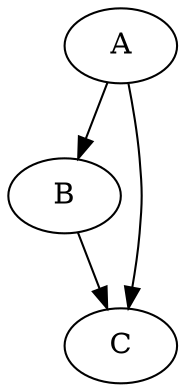
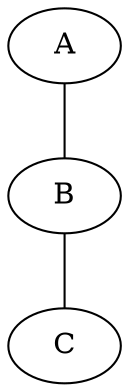

# Graph Rendering

## GraphDiagram API

Main struct for rendering directed or undirected graphs to SVG or PNG.

### Construction

Three input methods, all returning `Result<GraphDiagram, GraphError>`:

```rust
use biscuit_visualized::graph::*;

// 1. Expression syntax — lightweight, human-readable
let graph = GraphDiagram::from_expression("a -> b -> c; d -> e")?;

// 2. DOT format — full Graphviz subset
let graph = GraphDiagram::from_dot("digraph { A -> B; B -> C; }")?;

// 3. Auto-detect (tries expression first, falls back to DOT)
let graph = GraphDiagram::parse(input, GraphInputSyntax::Auto)?;
```

### Configuration

```rust
let graph = GraphDiagram::from_expression("a -> b")?
    .with_title("My Graph")
    .with_orientation(GraphOrientation::LeftToRight)
    .with_color_theme(GraphColorTheme::dark());
```

### Rendering

```rust
use biscuit_visualized::artifact::{RenderRequest, OutputFormat};

let artifact = graph.render(RenderRequest::new(OutputFormat::Svg))?;
// artifact.path, artifact.format, artifact.cache_hit, artifact.alt_text
```

### DOT Export

```rust
// Get the DOT representation (useful for debugging or external tools)
let dot_source = graph.source_as_dot();
```

### Fallback

```rust
let code_block = graph.fallback_code_block();
// Returns a fenced code block with the original source
```

## Expression Syntax

A lightweight syntax for defining graphs without full DOT verbosity.

### Directed Graphs

```
a -> b -> c
d -> e
```

Produces: edges `a→b`, `b→c`, `d→e`

### Undirected Graphs

```
a -- b -- c
```

Produces: edges `a-b`, `b-c`

### Mixed Edges — Not Allowed

Mixing `->` and `--` in the same graph is rejected with `GraphError::MixedEdgeKinds`. Use separate graphs instead.

### Identifiers

- **Simple**: alphanumeric plus hyphens (`my-node`, `node1`)
- **Quoted**: anything in double quotes (`"My Complex Node"`, `"node with spaces"`)

### Statement Separators

Semicolons or newlines separate independent edge chains:

```
a -> b -> c; d -> e; f -> g
```

Is equivalent to:

```
a -> b -> c
d -> e
f -> g
```

### Parsed Structure

```rust
use biscuit_visualized::graph::GraphExpression;

let expr = GraphExpression::parse("a -> b -> c")?;
// expr.nodes: ["a", "b", "c"]
// expr.edges: [GraphEdge { from: "a", to: "b", kind: Directed }, ...]
```

## DOT Format Support

Standard Graphviz DOT format with validation:





### Supported DOT Features

- `digraph` and `graph` declarations
- Node declarations with labels
- Edge declarations (`->` for digraph, `--` for graph)
- Node/edge attributes (e.g., `[label="..."]`)

### Unsupported DOT Features (Rejected)

These produce `GraphError::UnsupportedDotFeature`:

- HTML table labels
- Nested subgraphs
- Record-based node shapes

### Expression-to-DOT Conversion

Expression syntax is internally converted to DOT for rendering by `layout-rs`. The `source_as_dot()` method exposes this conversion.

## GraphBuilder

Fluent API for constructing graphs programmatically:

```rust
use biscuit_visualized::graph::{GraphBuilder, GraphOrientation};

let graph = GraphBuilder::directed()
    .add_node("start", "Start Here")
    .add_node("process", "Do Work")
    .add_node("end", "Finished")
    .add_edge("start", "process")
    .add_edge("process", "end")
    .with_orientation(GraphOrientation::TopToBottom)
    .build()?;

let artifact = graph.render(RenderRequest::new(OutputFormat::Svg))?;
```

For undirected graphs:

```rust
let graph = GraphBuilder::undirected()
    .add_node("a", "Node A")
    .add_node("b", "Node B")
    .add_edge("a", "b")
    .build()?;
```

## GraphOrientation

| Variant | Description | layout-rs mapping |
|---------|-------------|-------------------|
| `LeftToRight` | Horizontal layout (default) | LR |
| `TopToBottom` | Vertical layout | TB |

## GraphColorTheme

Controls colors for nodes, edges, text, and background:

```rust
let dark = GraphColorTheme::dark();   // Light elements on dark surface
let light = GraphColorTheme::light(); // Dark elements on light surface
```

Fields: `node_color`, `edge_color`, `text_color`, `surface_color`, `font_family`

## GraphInputSyntax

```rust
pub enum GraphInputSyntax {
    Auto,        // Try expression first, fall back to DOT
    Expression,  // Force expression syntax
    Dot,         // Force DOT syntax
}
```

Auto-detection logic: if the input starts with `digraph`, `graph`, or `strict`, it's treated as DOT. Otherwise, expression syntax.

## Resolution tuning for terminal display

`biscuit-terminal::GraphExpression` is *terminal-display aware*. Before rendering, it computes the exact pixel width of the display target — `cells × cell_pixel_width` — and passes that to the rasterizer via `RenderRequest::target_width`. The PNG comes out at exactly the display resolution, with text glyphs rasterised fresh at that size by `resvg`. No oversampling, no downstream downscaling.

This works because `RenderRequest` carries two complementary sizing knobs:

| Field | Effect |
|-------|--------|
| `target_width: Some(px)` | Render the SVG at exactly `px` pixels wide; aspect ratio preserved. Used by `GraphExpression` / `MermaidDiagram` when laying out for a known display. |
| `scale: N` (with `target_width = None`) | Legacy HiDPI multiplier: PNG is `svg_native × N`. Use for fixed-DPI exports without a known display. |

When `target_width` is `Some`, `scale` is ignored.

### Quick reference

```rust
use biscuit_visualized::artifact::RenderRequest;
use biscuit_visualized::graph::GraphDiagram;

let graph = GraphDiagram::from_dot("digraph { A -> B; B -> C }")?;

// Render at 1600 px wide (e.g. terminal cell area).
let inline = graph.render(&RenderRequest::default().with_target_width(1600))?;

// Render at 2× native (e.g. retina screenshot export).
let retina = graph.render(&RenderRequest { scale: 2, ..RenderRequest::default() })?;
```

### Why we don't need DOT-side tricks anymore

Earlier iterations of `sniff repo deps --ui` worked around terminal blur by injecting `node [fontsize=48]` into the generated DOT source. The bigger fontsize grew layout-rs's SVG canvas so that the fixed `scale=2` rasterization happened to produce a PNG big enough to survive terminal downscaling.

With `target_width`-driven rendering that hack is unnecessary — the rasterizer renders at terminal pixel dimensions directly. `build_deps_dot` in `sniff/cli/src/output/filesystem/deps.rs` now emits DOT at `layout-rs`'s default `fontsize=14`, and sharpness is delivered by the rasterizer instead of by inflating the source SVG.

If you find yourself wanting to grow an SVG to "make the terminal render look sharper", reach for `RenderRequest::with_target_width` instead.

## SVG Post-Processing

After `layout-rs` generates the raw SVG:

1. **Padding trim**: Removes excess canvas padding from layout-rs output
2. **Font application**: Applies the theme's font family to all text elements
3. **Color application**: Sets node fill, edge stroke, and text colors from the theme
4. **Background**: Adds a background rectangle with the surface color (or transparent)

## GraphError

```rust
pub enum GraphError {
    /// Expression syntax parsing failed
    ExpressionParseFailed(String),
    /// Mixed -> and -- in same expression
    MixedEdgeKinds,
    /// DOT parsing failed
    DotParseFailed(String),
    /// DOT feature not supported (HTML tables, nested subgraphs)
    UnsupportedDotFeature(String),
    /// layout-rs rendering failed
    RenderFailed(String),
    /// SVG-to-PNG rasterization failed
    RasterizationFailed(RasterError),
    /// File I/O error
    Io(#[from] std::io::Error),
}
```

## Source Files

| File | Contents |
|------|----------|
| `biscuit-visualized/src/graph/mod.rs` | Module re-exports |
| `biscuit-visualized/src/graph/expression.rs` | `GraphExpression`, tokenizer, parser |
| `biscuit-visualized/src/graph/dot.rs` | DOT parsing, validation, expression↔DOT conversion |
| `biscuit-visualized/src/graph/builder.rs` | `GraphBuilder` fluent API |
| `biscuit-visualized/src/graph/render.rs` | `GraphDiagram`, `GraphColorTheme`, `GraphOrientation` |
| `biscuit-visualized/src/graph/error.rs` | `GraphError` |
