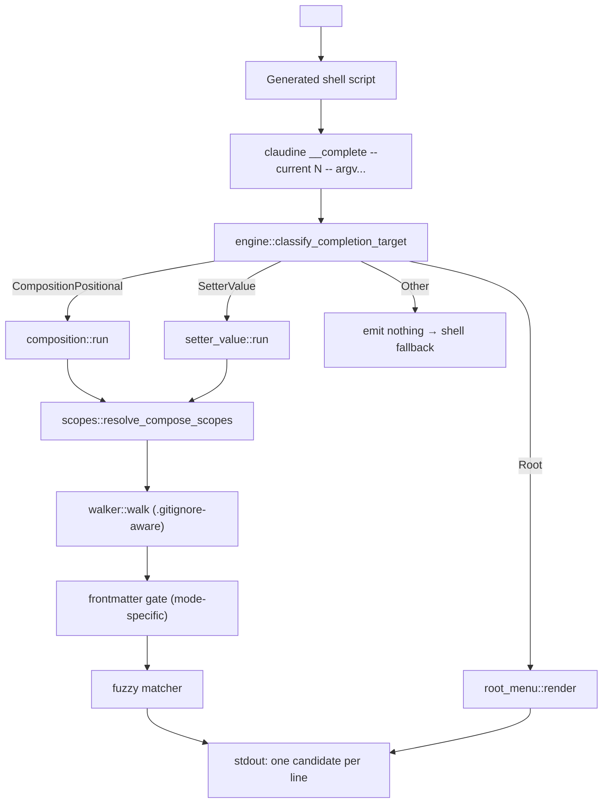

# Shell Completions

## Contents

- Installation
- Root-level menu
- Composition commands
- Setter values
- Schema-aware setter completion
- ENTER-path autocomplete
- Other commands
- Performance optimization
- Legacy shells
- Examples
- Architecture

Use heading search to jump to the listed subsystem.


Claudine ships dynamic shell completions for `bash`, `zsh`, and `fish`.
On every `<TAB>` the generated script invokes a hidden subcommand,
`claudine __complete`, which classifies the cursor position, dispatches
to a slot-specific completer, and prints one candidate per line on
stdout. Non-targeted slots produce no candidates, which lets each shell
fall back to its native file / flag completion. Fish uses an explicit
`__fish_complete_path` call inside the generated function so empty
engine output still surfaces path candidates.

This document is the canonical user-facing reference for the completion surface:
how to install it, what the root menu offers, how composition-command
completion behaves (per mode), how `@`-gated setter values work, why
the legacy shells (`powershell`, `elvish`) behave differently, and how
the engine hits its sub-100 ms target without an on-disk cache.

Key code:

- Engine entry point — `claudine/cli/src/completion/engine/mod.rs`
- Root menu — `claudine/cli/src/completion/root_menu.rs`
- Composition pipeline — `claudine/cli/src/completion/composition/mod.rs`
- ENTER-path autocomplete UI — `claudine/cli/src/completion/autocomplete_ui.rs`
- Default markdown glob — `claudine/cli/src/completion/default_glob.rs`
- Setter-value completer — `claudine/cli/src/completion/setter_value.rs`
- Scope resolution — `claudine/cli/src/completion/scopes.rs`
- Walker — `claudine/cli/src/completion/walker.rs`
- Frontmatter gates — `claudine/cli/src/completion/frontmatter.rs`
- Fuzzy matcher — `claudine/cli/src/completion/fuzzy.rs`
- Shell scripts — `claudine/cli/src/completion/bootstrap.rs`
- `__complete` CLI contract — `claudine/cli/src/commands/completions.rs`
- Interactive schema collection — `claudine/cli/src/commands/schema_interactive/mod.rs`

## Installation

`claudine completions <shell>` prints the registration script for the
requested shell. Redirect it into the shell's completion file once:

```sh
# Bash
claudine completions bash > ~/.local/share/bash-completion/completions/claudine

# Zsh — drop into any directory in $fpath
claudine completions zsh > "${fpath[1]}/_claudine"

# Fish
claudine completions fish > ~/.config/fish/completions/claudine.fish

# PowerShell / Elvish (legacy one-line bootstrap — see "Legacy shells")
claudine completions powershell >> $PROFILE
claudine completions elvish    >> ~/.elvish/rc.elv
```

Open a new shell (or re-source the rc file) and completion is live. The
zsh script autoloads and runs `compinit` on demand so `source <(claudine
completions zsh)` early in `.zshrc` still works.

**Why the scripts shell out to `__complete` on every `<TAB>`.** The
candidate set depends on filesystem state — which markdown files exist,
which ones have the right frontmatter, which scopes apply from the
user's cwd — so a statically generated completion script cannot
produce it. The generated script is static; the candidates are fresh on
every press.

## Root-level menu

When the cursor sits at the subcommand slot (argv position 1, or after
a run of global flags), the engine emits a curated, spec-ordered
subcommand list. The order is:

1. **Composition** — `compose`, `inline-compose`, `sequence`.
2. **Wrapped execution** — one catalog-derived token per compiled provider:
   `claude`, `codex`, `gemini`, `goose`, `kimi`, `opencode`, `qwen`, `kilo`,
   `pi`, `antigravity`.
3. **Shared resources** — `skills`, `commands`, `agents`, `mcp`.
4. **Hooks & actions** — `hooks`, `actions`.
5. **Administration** — `sync`, `uninstall`, `providers`, `logs`,
   `completions`, `config`.
6. **`init`** — conditional; see below.

**Why this order.** Composition is the most-used subcommand surface in
daily Claudine use, followed by the provider wrappers. Shared resources
and hook machinery come next because users reach for them repeatedly
during setup. Administration is last because those commands are
typically run once per project.

### `init` visibility rule

`init` is elided from the root menu when **either**:

- a user-scope Claudine config exists at `~/.claudine/config.json`
  (also accepted: `config.json5`), **or**
- a repo-scope Claudine config exists at `<repo>/.claudine/config.json`
  when cwd is inside a detected git repo.

**Why.** `init` is a one-time wizard. Surfacing it in the root menu
after Claudine is already configured crowds the menu with a command the
user will essentially never run again. Presence-only checks (`fs::metadata`)
keep the rule fast — the configs are never parsed.

### `--help` rule

The **only** flag offered at the root level is `--help`. Typing `-`,
`--`, `-h`, or any `--h…` prefix resolves to `--help` as the sole
candidate. Any other flag-shaped partial returns zero candidates so the
shell stays silent rather than firing its generic flag completion.

**Why.** Global flags (`--verbose`, `--debug`, `--plain`) are fully
documented in `claudine --help`; offering them at every `<TAB>`
adds noise without improving discovery. `--help` is the one flag that
*is* useful from a cold start, so we keep it in the menu.

## Composition commands

`compose`, `inline-compose`, and `sequence` share one completion
pipeline, parameterised by a `ComposeMode`. Mode determines:

- which scopes are walked;
- which frontmatter gate files must pass;
- which additional directories (`docs/`, `skills/`) extend the scope
  set.

All three also share the partial-length progression, fuzzy matching
rules, file-reference resolution, `.gitignore` semantics, and the
`MAX_CANDIDATES = 500` budget.

### Scopes

The engine resolves a `ScopeSet` in priority order (earlier scopes win
on dedup). Two iteration orders are exposed: the **default** order used
by the empty / committed-directory pipelines, and the **magic-path**
order used when the typed partial begins with `@`.

Default iteration order (`ScopeSet::iter_scopes`):

1. **Repo root** — `<repo>/prompts/` when cwd is inside a detected
   git repo.
2. **Package-area root** — `<repo>/<area>/prompts/` when `<area>` is
   the enclosing monorepo area from `sniff` and is not the virtual
   `"root"` package.
3. **Package root** — `<pkg>/prompts/` when cwd is inside a discrete
   package.
4. **Repo Claudine scope** — `<repo>/.claudine/prompts/`.
5. **User Claudine scope** — `~/.claudine/prompts/`.
6. **Extras** — mode-specific (see below).

Magic convention roots come from Claudine's shared `prompt_magic_roots` builder
and are expanded by `FileReference::complete_partial_in_context`. Because
Claudine registers them as prepends, the complete effective `@` order is:

1. **Discrete package** — `<pkg>/`, then `<pkg>/prompts/`.
2. **Package area** — `<repo>/<area>/`, then `<repo>/<area>/prompts/`.
3. **Repo prompts** — `<repo>/prompts/`.
4. **Repo Claudine scope** — `<repo>/.claudine/prompts/`.
5. **Repo document scopes** — `docs/`, then the agent-skill peers.
6. **User Claudine scope** — `~/.claudine/prompts/`.
7. **Intrinsic roots** — discrete package, package area, repository, then home.

Runtime composition registers this identical ordered list. The package and
area bare roots keep path-shaped values such as `@prompts/plan.md` resolvable;
the prompt children support the concise `@plan.md` form. The default
non-magic pipeline retains its separate display-oriented scope ordering.

**Why a single scope resolution per invocation.** `sniff::detect_repo_structure`
can shell out to `cargo metadata` on first call. Threading a single
`ScopeContext` through the pipeline keeps that cost bounded at one
shell-out per `<TAB>`, not one per scope.

### Prefix-length progression

| Partial length | File matching (high-profile scopes) | Directory matching (repo / CWD walk) |
|---|---|---|
| 0 chars (empty, `@`, committed directory) | Enumerate files only — no fuzzy matching | No directory suggestions |
| 1–2 chars | Fuzzy subsequence match on filenames in high-profile scopes | Case-insensitive **starting-substring (prefix)** match on directory names across the repo (or CWD if not in a repo) |
| 3+ chars | Fuzzy subsequence match on filenames in high-profile scopes | Case-insensitive **fuzzy subsequence** match on directory names across the repo (or CWD if not in a repo) |

The directory walk is repo-wide: it scans the repo root (or CWD when
not inside a git repo) regardless of the high-profile scope set. Files
continue to come from high-profile scopes only — directories come from
anywhere in the project.

**Why a repo-wide directory walk.** Restricting directories to
high-profile scopes (`prompts/`, `.claudine/prompts/`, etc.) makes
short partials nearly useless for anything other than the canonical
prompts roots. Letting users drill into any directory before switching
to committed-directory mode keeps `<TAB>` useful as a navigational
tool across a monorepo, not just inside curated prompt folders.

**Why prefix at 1–2 chars and fuzzy at 3+.** With only one or two
characters typed, fuzzy subsequence matching on directories produces
too many incidental hits (every name containing those letters in
order). Prefix matching at short lengths keeps the candidate list
tight; once the user has typed three characters they have committed
enough that fuzzy matching becomes useful again.

### Fuzzy vs. prefix matching

File matching against high-profile scopes is always **subsequence
fuzzy** on the filename stem (case-insensitive), at every non-empty
partial length. Directory matching against the repo-wide walk uses
prefix matching at 1–2 characters and fuzzy matching at 3+ characters
(see the table above). Empty partial and committed-directory forms
skip matching entirely and emit everything in the walked scope.

**Why subsequence for files.** Users routinely type prompts by
abbreviation (`@omp` → `prompts/omnipotent.md`). Strict prefix matching
would force them to remember the exact leading characters of every
file.

### Magic `@` resolution

A partial beginning with `@` is a magic path — a **filename search**. The
engine constructs one explicit `FileResolutionContext`, asks
`FileReference::complete_partial_in_context` for the ordered roots and rendered
prefix, and emits that prefix plus each matching basename. A bare partial emits
`@<basename>`; a path-shaped partial retains its scope. The `@` stays because it
is a runtime-resolution marker — at launch the composition pipeline resolves
the committed value through the identical ordered roots
(see [Composition](../composition.md) and the prompt-magic search roots in
`claudine::composition::resolve`).

```text
claudine compose @plan<TAB>
→ @plan.md
```

Candidates are **deduped by basename** across all magic scopes, so a
filename present in several scopes (e.g. both `<repo>/prompts/plan.md` and
`~/.claudine/prompts/plan.md`) surfaces once. The closest scope (iterated
first) owns the candidate's sort rank; runtime resolution independently
picks the closest file on disk.

**Why keep the sigil.** The whole point of `@` is to defer the concrete path
decision to the shared ordered roots. Bare searches stay concise as
`@<basename>`; an authored scope remains present so completion does not discard
syntax that the shared parser classified.

#### Path-shaped form: `@prompts/plan`

A `/` in the magic body constrains the **walk** to that subdirectory (the
portion before the last `/`) and remains in the emitted candidate.
Multi-segment paths are supported (`@a/b/c`).

```text
# Walk is constrained to the shared roots' prompts/ children
claudine compose @prompts/plan<TAB>
→ @prompts/plan.md
```

When the path-shaped `dir` does not exist under a particular scope, that
scope is silently skipped — only scopes whose joined walk root resolves to a
real directory contribute candidates.

#### No directory candidates in magic mode

Magic mode is purely a filename search: it **never** surfaces directory
candidates, at any prefix length (`@<TAB>` lists prompt filenames only).
Directory drilling is a Word-mode (non-`@`) behavior — type a bare path like
`prompts/` to navigate directories. This keeps the `@` surface clutter-free.

#### Magic-path priority

Magic resolution uses the full convention-prepend → package → package-area →
repository → home order documented under [Scopes](#scopes).

The user-global scope is **last**. The basename dedup keeps the closest
occurrence, so a repo-local `plan.md` owns the `@plan.md` candidate's rank
over a `~/.claudine/prompts/plan.md` of the same basename. Filenames that
exist **only** in a lower-priority scope (e.g. a global-only prompt) still
surface — the union across scopes is offered, just deduped by basename.

**Runtime closest-resolution.** The committed magic value is resolved at
launch by registering these same directories as magic search roots,
closest-first; `biscuit_file::FileReference` returns the first existing
candidate, so the nearest prompt wins. This mirrors the completion scope
set, so anything the engine offers under `@` is resolvable at launch.

### Repository `&` and `^` resolution

Repository-root partials (`&...`) enumerate exactly the repository root.
Repository-scoped partials (`^...`) enumerate the current package root, then
the package-area root, then the repository root. Both preserve their sigil in
the emitted value and apply the same repository-containment rules as execution.
Unlike `@`, neither form consults convention roots or the user's home directory.

### Committed directory

A partial ending in `/` (or preceded by any path segment) is a committed
directory — the user has narrowed to a specific subtree. The walker
stays inside that subtree and enumerates everything the mode contract
accepts.

```text
claudine compose prompts/<TAB>
→ prompts/plain.md
→ prompts/plan.md
→ prompts/sequence.md
```

**Why.** Committed directories are intentional scope narrowing. Walking
outside them would surprise the user by mixing files from scopes they
did not ask for.

### Per-mode contracts

#### `compose`

- **Scope extras:** none.
- **Frontmatter gate:** extension is `.md` / `.markdown`
  (case-insensitive); the file must be readable, valid UTF-8, and at
  most `MAX_FRONTMATTER_BYTES` (1 MiB). No `prompt` or `sequence`
  key required.
- **Files with a `prompt` key are excluded** so the composition pipeline
  does not accidentally run them as an inline-compose.
- **Oversized, unreadable, and non-UTF-8 files are rejected** —
  identical to the contract enforced by `inline-compose` and
  `sequence`. This is a uniform read/size gate across all three
  modes.

**Why exclude `prompt`-bearing files.** `compose` runs the body as-is,
but a file whose frontmatter has `prompt` is an inline-compose source
document — running it through `compose` would emit the unrendered body
instead of the generated content. Dropping them from completion steers
the user to `inline-compose` for those files.

**Why uniform size/read rejection.** Earlier behavior accepted
oversized or unreadable files for `compose` (on the theory that the
extension gate had already passed) but rejected them for
`inline-compose` and `sequence`. That asymmetry surfaced expensive or
noisy candidates that the runtime would never accept. A single
uniform contract — every size or read failure is a rejection —
prevents `<TAB>` from suggesting files that the composition runtime
itself would refuse.

#### `inline-compose`

- **Scope extras:** `<repo>/docs/`; agent-skill peer directories
  with `follow_links = false`:
  `.claude/skills/`, `.codex/skills/`, `.gemini/skills/`,
  `.opencode/skills/`, `.goose/skills/`, `.qwen/skills/`,
  `.kimi/skills/`. The same seven peers are enumerated in
  `cli/src/completion/scopes.rs::SKILL_PEER_DIRS` — that constant is
  the source of truth; if it changes, this list and the spec must
  change with it.
- **Frontmatter gate:** the file must have a non-empty string `prompt`
  key.

**Why the extras.** Inline-compose sources often live under `docs/` as
spec drafts or design documents, and agent-skill files are prime inputs
for inline generation. Skipping symlinks in agent-skill scopes avoids
duplicates from Claudine's own cross-provider linker.

#### `sequence`

- **Scope extras:** same as `inline-compose` (`docs/` + agent-skill
  peers, `follow_links = false`).
- **Frontmatter gate:** the file must have a `sequence` key (markdown
  candidate) or a top-level `sequence` key (raw `.yaml` / `.yml`
  candidate). Presence-only — the validator does not resolve external
  references; see the "Why presence-only" note below.

**Why presence-only validation for sequence frontmatter.** The
completion validator accepts a `sequence:` markdown candidate so
long as the `sequence` key is present in frontmatter — it does
**not** resolve external `sequence` references (`sequence:
steps.yaml`) at completion time. The runtime composition pipeline
is the authority on whether a given sequence file actually runs.
Resolving externals in the validator would have to re-implement
the runtime resolver, double the per-candidate cost in the
frontmatter parse path, and still not catch every runtime failure
mode. Completion is content to surface the candidate and let
runtime fail loudly if the external is missing.

### `.gitignore` honored

The walker uses `ignore::WalkBuilder` (same crate `ripgrep` builds on),
which honors `.gitignore` / `.git/info/exclude` / global git ignore
rules at every depth. Ignored markdown never surfaces.

**Why.** `.gitignore` is the project's own declaration of "this file
is noise." Overriding it in completion would second-guess the
project's own author.

### `_`-prefixed files and directories are elided

Filenames and directories that begin with an underscore (`_completed/`,
`_draft.md`) are dropped from completion even if `.gitignore` does not
cover them.

**Why.** The `_` prefix is the repo convention for archived/in-progress
artefacts (see `features/_completed/`); listing them in completion
would cause the user to open stale documents more often than fresh
ones.

### Symlinks

Generic scopes follow symlinks (`follow_links = true`). Agent-skill
peer scopes do not.

**Why the split.** Claudine's linker symlinks a shared skill body into
every provider's skill directory (`.claude/skills/`, `.codex/skills/`,
etc.). Following those symlinks would make the same file appear 7×
under 7 different paths. Suppressing symlink follow in the agent-skill
scopes keeps each skill single-entry.

### Candidate budget

The walker stops at `MAX_CANDIDATES = 500` entries per invocation.

**Why.** Beyond ~500 candidates no shell UI is usable anyway. Stopping
early caps the wall-clock cost of pathological inputs (a user typing
`<TAB>` in a repo with 10 000 markdown files).

## Setter values

Inside a composition subcommand, a token of shape `name=value` is a
frontmatter setter override. The completer triggers on the value slot
when the value begins with `@` (or a quote followed by `@`). Any other
leading character returns zero candidates.

### Trigger shape

```text
claudine compose file.md spec=@d<TAB>
→ spec='docs/plan.md'
→ spec='docs/spec.md'
```

The completer walks `docs/`, `features/`, `fixes/`, and `reviews/`
**under the invoking `cwd`** — the launch area, i.e. the directory the
user was in when they pressed `<TAB>`.

**Why only four subdirs.** These are the directories a composition
frontmatter setter realistically points at: documentation, planning
artefacts, fix drafts, review outputs. Offering the entire repo would
drown the candidate list.

**Why anchored on the `cwd`, not the repo root.** A frontmatter file
reference resolves at runtime against the **launch area** (captured as
`launch_cwd` and threaded into the read-side resolver as
`file_ref_fallback_dir`). The completion process is never `chdir`'d, so
its `cwd` *is* that launch area. Anchoring here keeps every offered path
byte-identical to what the runtime resolver accepts; a repo-root-relative
candidate would resolve to a non-existent `<launch_cwd>/<repo-relative>`
path at launch.

### Markdown-extension gate

Only files with a `.md` or `.markdown` extension (case-insensitive)
are surfaced as setter-value candidates. The case-insensitive gate
accepts both `docs/PLAN.MD` and `docs/README.MARKDOWN`. Files with
any other extension — `.txt`, `.yaml`, `.yml`, `.json`, etc. — are
rejected, as are extensionless files, regardless of basename match.

```text
# Given:
#   docs/spec.md       ← surfaced
#   docs/spec.txt      ← rejected
#   docs/notes.yaml    ← rejected
#   docs/extless       ← rejected
#   docs/PLAN.MD       ← surfaced (uppercase ok)

claudine compose file.md spec=@<TAB>
→ spec='docs/PLAN.MD'
→ spec='docs/spec.md'
```

**Why Markdown only.** The setter-value slot is contractually a
Markdown-document reference — composition frontmatter overrides treat
the resolved path as a Markdown source for body inlining. Surfacing
non-Markdown files would suggest documents the runtime cannot use,
which makes the candidate list misleading. Restricting the gate to
the same extension list that the composition file slot already uses
keeps the two surfaces consistent.

### Quote normalisation

A leading `"` or `'` on the typed value is stripped for classification.
The emitted candidate always wraps the resolved value in single quotes.

```text
claudine compose file.md spec="@d<TAB>
→ spec='docs/plan.md'
```

**Why normalise to single quotes.** The shell word-splits on double
quotes but preserves single quotes literally, so a single-quoted
candidate is safe regardless of how the user started the value. That
also matches the repo convention for YAML-like setter values in
Markdown frontmatter overrides.

### Non-`@` values emit nothing

A setter whose value does not start with `@` is treated as a literal
and produces zero candidates.

**Why.** Setter values are often small strings (booleans, numbers,
short identifiers) that completion cannot meaningfully suggest. Leaving
that slot to the shell's default lets the user type freely without
spurious popups.

## Schema-aware setter completion

When the cursor sits on a setter slot of `claudine compose`,
`claudine inline-compose`, or `claudine sequence` AND a positional
prompt-file argument is already committed, the completer consults the
prompt's `$schema` declaration via Darkmatter before falling back to the
shell default. Implementation lives in
`completion/schema_completion/mod.rs`.

### Property names (before `=`)

Required properties are emitted first in declaration order, then
optional properties in declaration order. Names already present in the
current command line are filtered out so the user is never offered to
re-set the same key. Each candidate carries a trailing `=` so accepting
it leaves the cursor positioned to start typing the value.

```text
claudine compose @plan.md <TAB>
→ topic=         # required (declared first)
→ tier=          # required
→ draft=         # optional
→ cover=         # optional
```

A partial before `=` is matched with the same case-insensitive fuzzy
subsequence rule the rest of the engine uses, so `des<TAB>` completes
to `description=`.

### Property values (after `=`)

`property=<TAB>` consults Darkmatter's completion metadata for the
property and dispatches by `CompletionKind`:

- **`enum` → enum members** as `property='value'`. Prefix-insensitive
  match when a value partial is typed; all members surface when the
  partial is empty.
- **`file(match='*.png', …)` → filesystem paths** rooted at the
  invoking `cwd` (the launch area; see the "Why anchored on the `cwd`"
  note under *Setter values*), filtered by the
  property's glob patterns. The walk shares the scope walker's
  exclusion rules — `.gitignore` plus the `_`-prefix and curated
  skip-list (`target`, `node_modules`, …) elision — so archived
  `_completed/` artefacts never surface. The typed value partial is
  applied as a case-insensitive substring (`*partial*`) over the
  repo-relative path, not just the basename: because `match(...)`
  candidates routinely share a basename (every `**/*spec*.md` hit is
  `spec.md`), a directory fragment like `spec=features/real` is the
  only way to narrow them. An empty `match(...)` list falls back to the
  default markdown glob (see the ENTER-path note below); the legacy
  zero-candidate behavior was dropped.
- **`url`, `email`, `date`, `datetime`, `time` (hint-only)** emit no
  candidates. The `__complete` stdout protocol does not carry a
  description channel today, so the hint string from
  `property_value_hint` is reserved for future protocols that support
  descriptions.

```text
claudine compose @plan.md tier=<TAB>
→ tier='small'
→ tier='medium'
→ tier='large'

claudine compose @plan.md cover=<TAB>          # schema: file(match('*.png'))
→ cover='assets/cover.png'
→ cover='assets/dark/cover.png'
```

### Root-level unions

A `$schema:` declared as a YAML sequence is a **root union** (the
frontmatter is valid if it satisfies any one arm). Property-name and
property-value completion merge the inline arms rather than declining:

- **Names** — the union of every arm's completable property names,
  deduplicated in first-seen (arm) order. A `spec`-or-`design` union
  offers both `spec=` and `design=`.
- **Values** — for a property that appears in more than one arm, the
  arms' `match(...)` globs are combined (deduplicated) when every
  contributing arm is a `file`, so the candidate set is the union of the
  arms' matches; otherwise the first completable arm wins. Unresolved
  file-reference arms are skipped.

There is no authored property-order hint for a root union, so names come
out in arm declaration order.

### When the schema is unavailable

If `$schema` cannot be loaded (missing file, unparseable schema, raw
JSON Schema without typed metadata) the schema completer returns no
candidates and the slot falls through to the existing `@`-gated setter
completer described above. Completion is strictly side-effect free: no
shell directives are executed, no provider sessions are launched, no
on-disk caches are written.

**Why best-effort.** Completion has a sub-100 ms wall-clock budget; a
malformed schema or a transient filesystem failure must not break
`<TAB>` for the entire command. Returning nothing keeps the shell's
own completion alive in those edge cases.

## ENTER-path autocomplete

When a composition command runs interactively and a required file value
is missing, Claudine can prompt for it at runtime instead of failing.
This applies to two surfaces:

1. **The composition positional argument** — `claudine compose <file>`,
   `claudine inline-compose <file>`, and `claudine sequence <file>`.
   When the positional file is omitted or does not resolve, Claudine
   offers every markdown candidate in scope.
2. **Missing `$schema` properties** — when a frontmatter schema declares
   a property typed `file` or `file[]`, the value can be supplied
   interactively at runtime.

The prompt is gated by the same rules as the missing-property prompt:
stdin and stderr must be TTYs, `--silent` must be off, and
`prompt_for_missing` must be true in config. If any gate is closed,
Claudine prints the non-interactive remediation block instead.

### Type-driven chooser

- A property typed `file` (or the single positional argument) uses a
  single-select `ChooseOne` chooser.
- A property typed `file[]` uses a multi-select `ChooseMany` chooser:
  press `Space` to toggle items, then `Enter` to submit the set.

Candidates come from the schema's `match(...)` globs when present;
otherwise the bare `file`/`file[]` fallback walks the invoking `cwd`
(the launch area — the runtime missing-property chooser runs *before*
the wrapper's `switch_process_cwd`, so its `cwd` is still the launch
area) for markdown files, excluding prompt directories so composition
prompts do not leak into generic file values. Both walks share the scope walker's exclusion rules —
`.gitignore`, the `_`-prefix elision, and the curated skip-list
(`target`, `node_modules`, …).

### Layout

When more than one candidate exists, the chooser renders a two-pane
layout:

- **Wide terminals** (`width >= height`) — candidate list on the left,
  live detail pane on the right.
- **Tall terminals** (`width < height`) — detail pane above the
  candidate list.

Each candidate in the list is labeled by its **cwd/repo-relative path**
(with extension), not the bare file stem — `match(...)` candidates
routinely share a basename (every `**/*spec*.md` hit is `spec`), so the
path is the only thing that distinguishes them.

The chooser runs in an **inline viewport** sized to its content (one row
per option, floored so the detail pane stays readable and capped so a
large candidate set scrolls), not the full alternate screen.

The detail pane shows the file badge, name, description (or
"no description"), the `$schema` value rendered as YAML, and an OSC8
path link.

### Single-match shortcut

When only one candidate resolves, Claudine shows a lightweight
`Use this file? (Y/n)` prose dialog instead of the full chooser.
Press `Y` or `Enter` to accept; `n` or `Esc` to cancel.

### Cancellation

Pressing `Esc` in the chooser or dialog cancels interactive collection
and bubbles back as the original `MissingProperties` error, so the CLI
still surfaces the non-TTY remediation block.

## Other commands

Every non-composition subcommand — `skills`, `commands`, `hooks`,
`mcp`, `logs`, wrappers, everything — falls through to the shell's
default completion. The engine emits zero candidates so each shell
renders whatever its native completion produces (file names on
bash/zsh/fish).

Value slots on `--append-system-prompt` / `--replace-system-prompt`
are **not** covered by the new engine. They resolve to the shell's
native file completion.

**Why.** The spec intentionally scopes the curated completion surface
to composition commands. Extending it to every wrapper flag would grow
the maintenance cost without a proportional discovery win — wrappers
already document their flag sets, and a curated candidate list here
would frequently mismatch what the user actually wants to type.

## Performance optimization

The engine targets **≤100 ms wall-clock** from `__complete` entry to
last byte of stdout. The default path does not use an on-disk cache;
every press is a fresh scan.

### Lazy scope resolution

Scopes are discovered in priority order. `sniff::detect_repo_structure`
runs exactly once per `__complete` invocation and its result is
threaded through `ScopeContext`, so repeated scope queries do not
re-shell to `cargo metadata`.

### Extension gate first

Every file is checked by extension (`.md` / `.markdown` /
`.yaml` / `.yml`) before any frontmatter parse. The bulk of files the
walker sees never get opened.

### 1 MiB frontmatter cap

Files larger than `MAX_FRONTMATTER_BYTES = 1 MiB` skip frontmatter
parsing. This protects against pathological inputs (a 50 MB generated
document under `docs/`) without penalising legitimate markdown sources.

### Uniform size/read rejection across modes

Oversized, unreadable, and non-UTF-8 Markdown files are rejected
uniformly across `compose`, `inline-compose`, and `sequence`. No mode
is permissive on read failures. This avoids a class of silent bugs
where `compose` would surface candidates that the runtime later
refused to parse, and keeps the per-`<TAB>` cost bounded — a 50 MB
generated Markdown document never blocks the walker on size, never
gets parsed for frontmatter, and never appears in the candidate list.

### Candidate budget

`MAX_CANDIDATES = 500` bounds the walker's work regardless of repo
size.

### Profiling

Set `RUST_LOG=claudine::completion=trace` to capture per-phase timing
spans. The engine emits `tracing::trace_span!` markers at the
top-level dispatch (`completion::run`), each slot-specific arm
(`completion::root_menu`, `completion::composition`,
`completion::setter_value`), and every walker invocation
(`completion::walk_scope`). Spans are emitted on the existing CLI
`tracing-subscriber` so wiring is automatic — no separate logger to
configure. Optionally set `CLAUDINE_COMPLETION_PROFILE=1` to flag the
run as a profiling capture; the variable is reserved for future
file-based sinks (shells swallow stderr on completion and stdout is
reserved for candidates).

For end-to-end latency, the harness at
`claudine/cli/tests/completion_perf.rs`
spawns a fresh `claudine` process per iteration against a fixture
that mirrors the rusty-biscuit scale (~72 packages, ~2000 markdown
files). Run it explicitly:

```sh
cargo test -p claudine-cli --test completion_perf --release \
  -- --ignored --nocapture --test-threads=1
```

The harness records p50/p95/p99 across `compose`, `compose pla`, and
`inline-compose` partials and asserts `p95 ≤ 100 ms`. A `p95` between
100 ms and 150 ms emits a warning; above 150 ms the harness fails so
CI forces the team to implement the fallback cache from §8.3 of the
tech design.

### No cache today

The engine does not persist candidates between invocations. As of the
2026-04-24 perf harness run on the reference monorepo fixture, the
default no-cache path measures `p95 ≤ 19 ms` across all three
scenarios — well inside the 100 ms target. A stale-while-revalidate
cache is reserved for future activation if profiling ever shows a
`p95 > 150 ms` on representative hardware.

## Legacy shells

PowerShell and Elvish retain the legacy one-line bootstrap:

```sh
claudine completions powershell >> $PROFILE
# →  & { $env:COMPLETE="powershell"; claudine } | Out-String | Invoke-Expression
```

That bootstrap activates `clap_complete::CompleteEnv`, which derives
candidates directly from the clap command tree — subcommand names and
flag names only. None of the curated composition / setter / magic-path
rules apply on these shells.

**Why the gap is intentional.** `clap_complete`'s dynamic path on
PowerShell / Elvish requires a different callback contract than the
one the new engine exposes. Porting it would double the surface
without doubling the user base. The gap is documented here so users
on those shells know what to expect.

## Examples

### Root menu from cold

```text
$ claudine <TAB>
compose        inline-compose  sequence
claude         codex           gemini          goose
kimi           opencode        qwen            kilo
pi             antigravity
skills         commands        agents          mcp
hooks          actions
sync           uninstall       providers       logs
completions    config
```

### Root menu when no configs exist

Add `init` to the end of the list above.

### Partial `com` at the root

```text
$ claudine com<TAB>
compose        commands        completions
```

### Composition with a magic path

```text
# Filename-only: the @ is kept, the closest plan.md resolves at launch
$ claudine compose @plan<TAB>
→ @plan.md
```

### Composition with a path-shaped magic prefix

```text
# The path constrains the search and remains in the emitted token
$ claudine compose @prompts/plan<TAB>
→ @prompts/plan.md

$ claudine compose @prompts/drafts/plan<TAB>
→ @prompts/drafts/plan.md
```

### Non-magic repo `.claudine` scope

```text
# Given <repo>/.claudine/prompts/plan.md exists
$ claudine compose .claudine/prompts/plan<TAB>
→ .claudine/prompts/plan.md
```

### Non-magic package scope

```text
# Given <repo>/<pkg>/prompts/plan.md exists and cwd is inside <pkg>/
$ claudine compose plan<TAB>
→ prompts/plan.md
```

### Non-magic user-global scope

```text
# Given ~/.claudine/prompts/plan.md exists and no repo-local match
$ claudine compose plan<TAB>
→ ~/.claudine/prompts/plan.md
```

### One-character partial surfaces repo directories

```text
# Given repo layout: claudine/, biscuit-speaks/, prompts/plan.md
$ claudine compose c<TAB>
→ claudine/                  # prefix dir match (repo-wide walk)
→ prompts/plan.md            # fuzzy file match (high-profile scope)
```

### Three-character partial allows fuzzy directory matching

```text
# Given repo layout: documentation/
$ claudine compose dcm<TAB>
→ documentation/             # fuzzy dir match — d-o-c-u-m has subseq d-c-m
```

### Inline-compose pulling from `docs/`

```text
$ claudine inline-compose @spec<TAB>
→ docs/spec.md
→ docs/feature-spec.md
```

### Inline-compose bare magic is filename-only and deduped

```text
# Given:
#   <repo>/docs/plan.md           ← has `prompt:` frontmatter
#   ~/.claudine/prompts/plan.md   ← has `prompt:` frontmatter

$ claudine inline-compose @plan<TAB>
→ @plan.md     # one entry; repo-local owns the rank, resolves closest at launch
```

### Sequence against an external YAML

```text
$ claudine sequence @re<TAB>
→ prompts/release.md        # has `sequence: steps.yaml`
```

### Setter override with a quote

```text
$ claudine compose file.md spec="@p<TAB>
→ spec='docs/plan.md'
→ spec='features/plan.md'
```

### Setter override only surfaces Markdown

```text
# Given:
#   docs/spec.md       ← surfaced
#   docs/spec.txt      ← rejected (non-Markdown)
#   docs/notes.yaml    ← rejected (non-Markdown)
#   docs/extless       ← rejected (no extension)

$ claudine compose file.md spec=@<TAB>
→ spec='docs/spec.md'
```

### Wrapper passthrough

```text
$ claudine claude --<TAB>
# → shell native completion (filenames, clap-exported flags)
```

## Architecture



| Module | Role |
|---|---|
| `engine/mod.rs` | Entry point; classifies the cursor slot and dispatches. |
| `root_menu.rs` | Curated subcommand menu + `init` visibility. |
| `composition/mod.rs` | Shared compose/inline-compose/sequence pipeline. |
| `setter_value.rs` | `@`-gated file completion inside `name=value` setters. |
| `scopes.rs` | Monorepo-aware scope resolution (one `sniff` call per run). |
| `walker.rs` | Bounded, `.gitignore`-aware walker over a scope set. |
| `frontmatter.rs` | Mode-specific frontmatter gates (`prompt`, `sequence`). |
| `fuzzy.rs` | Subsequence matching with prefix-length progression. |
| `bootstrap.rs` | Shell scripts (bash/zsh/fish) + legacy PowerShell/Elvish. |
| `commands/completions.rs` | `claudine completions` and the hidden `__complete`. |
| `schema_completion/mod.rs` | Schema-aware property-name and property-value completion for setter slots. |
| `autocomplete_ui.rs` | ENTER-path chooser / confirmation dialog rendering. |
| `default_glob.rs` | Bare `file`/`file[]` markdown candidate gatherer. |
| `commands/schema_interactive/mod.rs` | Interactive collection of missing `$schema` properties. |
