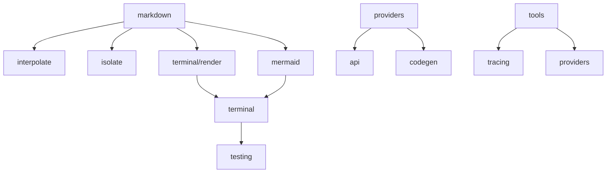

# Architecture Overview

The Dockhand shared library follows key architectural principles that make it a robust foundation for AI-powered Rust applications.

## Design Philosophy

### 1. Safety First

Every module prioritizes safety through:
- **Type safety**: Strong typing with `thiserror` for errors
- **AST-based operations**: Code manipulation via `syn`, never regex
- **Atomic operations**: File writes use tempfile + rename
- **Validation layers**: Pre and post validation for all operations

### 2. Progressive Enhancement

Components adapt to environment capabilities:
- **Terminal rendering**: Degrades gracefully from TrueColor → None
- **Provider discovery**: Falls back from API → curated list
- **Mermaid diagrams**: Terminal → HTML → code block fallback
- **Tool features**: Rate limits adjust by plan tier

### 3. Composability

Modules work together seamlessly:

```rust
// Example: Process markdown with interpolation and theming
let mut md = Markdown::from_url(&url).await?;
md.normalize_mut(Some(HeadingLevel::H1))?;

let interpolated = md_interpolate(md.content(), &context);
let themed_html = md.as_html(HtmlOptions::default()
    .with_theme_pair(ThemePair::Gruvbox))?;
```

## Module Relationships



## Layered Architecture

### Infrastructure Layer

Foundation utilities used throughout:
- `hashing`: Content hashing (XXH64, BLAKE3)
- `terminal`: Capability detection
- `testing`: Test utilities
- `api`: OpenAI-compatible utilities

### Domain Layer

Core business logic:
- `providers`: LLM provider management
- `markdown`: Document processing
- `codegen`: Safe code generation
- `tools`: Agent capabilities

### Presentation Layer

Output and rendering:
- `render`: Terminal rendering
- `mermaid`: Diagram visualization
- `markdown/output`: HTML generation

## Key Patterns

### Three-Tier Provider System

```
┌─────────────────┐
│ Discovery Layer │ ← Dynamic API fetching
├─────────────────┤
│ Curated Layer   │ ← Hardcoded fallback
├─────────────────┤
│ Base Layer      │ ← Environment detection
└─────────────────┘
```

### Document Processing Pipeline

```
Input → Parse → Transform → Validate → Output
  ↓        ↓         ↓          ↓         ↓
String  Markdown  Normalize  Structure  HTML/String
        +Frontmatter          Check
```

### Tool Integration Flow

```
rig-core Agent
      ↓
  ToolSet { BraveSearch, ScreenScrape }
      ↓
  Tracing + Rate Limiting
      ↓
  External APIs
```

## Error Handling Strategy

### Typed Errors

Each module defines specific error types:

```rust
// Provider errors
pub enum ProviderError {
    NoApiKey(Provider),
    ApiError { provider: String, error: String },
    RateLimitExceeded,
    // ...
}

// Markdown errors
pub enum MarkdownError {
    Io(#[from] std::io::Error),
    Yaml(#[from] serde_yaml::Error),
    Network(#[from] reqwest::Error),
    // ...
}
```

### Error Propagation

Errors bubble up with context:

```rust
// Low level
validate_syntax(&code)
    .map_err(|e| CodegenError::SyntaxError { message: e.to_string() })?;

// High level
inject_enum("Color", code, path)
    .context("Failed to update color enum")?;
```

## Concurrency Model

### Async Operations

Provider discovery and tools use `tokio`:

```rust
// Parallel provider fetching
let (openai, anthropic, gemini) = tokio::join!(
    fetch_openai_models(&client),
    fetch_anthropic_models(&client),
    fetch_gemini_models(&client),
);
```

### Synchronous Core

Document processing remains synchronous for simplicity:

```rust
// Markdown operations are sync
let mut md = Markdown::from(content);
md.normalize_mut(None)?;
md.cleanup();
```

## Caching Strategies

### Provider Discovery

24-hour cache for API responses:

```rust
// Cache location
~/.cache/ai-providers/{provider}_{hash}.json

// Cache check
if cache_age < Duration::hours(24) {
    return cached_models;
}
```

### Mermaid Diagrams

Content-based caching via XXH64:

```rust
let hash = diagram.hash();
let cache_path = format!("mermaid_{:x}.png", hash);
```

## Tracing Architecture

### Instrumentation Levels

```rust
// INFO: High-level operations
#[instrument(level = "info")]
pub async fn search(&self, query: &str) -> Result<String>

// DEBUG: Detailed operations
#[instrument(level = "debug", skip(client))]
async fn fetch_models(client: &Client) -> Result<Vec<Model>>

// TRACE: Verbose details
#[instrument(level = "trace", skip_all)]
fn parse_response(body: &str) -> Result<Data>
```

### Semantic Fields

OpenTelemetry conventions:

```rust
span.record("tool.name", "brave_search");
span.record("tool.query", query);
span.record("tool.duration_ms", elapsed.as_millis());
span.record("http.status_code", response.status().as_u16());
```

## Security Considerations

### Input Validation

- HTML content is escaped in interpolation
- File paths are validated before operations
- API keys never logged or traced

### Sandboxing

- Terminal rendering respects NO_COLOR
- Code generation validates AST before/after
- Network requests have timeouts

## Performance Optimizations

### Zero-Copy Where Possible

```rust
// InterpolateContext uses Cow<'static, str>
pub struct InterpolateContext {
    values: HashMap<Cow<'static, str>, Cow<'static, str>>,
}
```

### Lazy Evaluation

```rust
// Theme resolution deferred
impl Mermaid {
    pub fn theme(&self, mode: ColorMode) -> &MermaidTheme {
        // Resolved on demand
    }
}
```

### Parallel Processing

```rust
// Multiple providers fetched concurrently
let handles: Vec<_> = providers
    .into_iter()
    .map(|p| tokio::spawn(fetch_provider(p)))
    .collect();
```

## Testing Strategy

### Unit Tests

Each module has comprehensive unit tests:
- Happy path scenarios
- Error conditions
- Edge cases

### Integration Tests

Cross-module interactions tested:
- Provider → Codegen pipeline
- Markdown → Terminal rendering
- Tools → Tracing integration

### Snapshot Tests

Visual output validation:
```rust
#[test]
fn test_html_output() {
    insta::assert_snapshot!(html);
}
```

## Future Extensibility

The architecture supports:

1. **New providers**: Add to Provider enum and discovery
2. **New tools**: Implement rig_core::Tool trait
3. **New formats**: Add output modules to markdown
4. **New interpolation**: Extend with custom patterns
5. **New themes**: Add to syntect theme pairs

Each addition follows established patterns without breaking existing code.