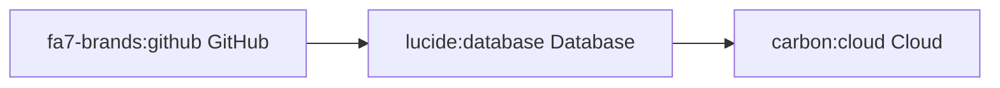
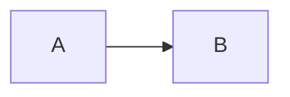

# Mermaid Diagram Support

The `mermaid` module provides theming and rendering capabilities for Mermaid diagrams, supporting both HTML and terminal output.

## Core API

```rust
use shared::mermaid::Mermaid;
use shared::markdown::highlighting::{ThemePair, ColorMode};

// Create diagram
let diagram = Mermaid::new("flowchart LR\n    A --> B")
    .with_title("My Flowchart")
    .with_footer("Generated 2026-01-03");

// Render for HTML
let html = diagram.render_for_html();

// Render to terminal (requires mmdc CLI)
diagram.render_for_terminal()?;
```

## Theming System

### Syntect Integration

Mermaid diagrams automatically adapt to your syntax highlighting theme:

```rust
// Use specific theme pair
let diagram = Mermaid::new("flowchart TD\n    A --> B")
    .use_syntect_theme(ThemePair::Gruvbox);

// Theme resolves based on color mode
let light_theme = diagram.theme(ColorMode::Light);
let dark_theme = diagram.theme(ColorMode::Dark);
```

### Custom Themes

```rust
use shared::mermaid::{MermaidTheme, DEFAULT_LIGHT_THEME, DEFAULT_DARK_THEME};

// Use predefined themes
let diagram = Mermaid::new("graph LR\n    A --> B")
    .with_theme(DEFAULT_LIGHT_THEME.clone(), DEFAULT_DARK_THEME.clone());

// Create custom theme
let custom_theme = MermaidTheme {
    theme: "base".to_string(), // base, dark, forest, neutral
    primary_color: "#1a1a1a".to_string(),
    primary_text_color: "#ffffff".to_string(),
    // ... other colors
};
```

## HTML Rendering

### Basic Usage

```rust
let html = diagram.render_for_html();

// Embed in HTML document
println!("<html>");
println!("<head>{}</head>", html.head);
println!("<body>{}</body>", html.body);
println!("</html>");
```

### Generated HTML Structure

```html
<!-- In <head> -->
<style>
  :root {
    --mermaid-primary-color: #2e86ab;
    --mermaid-primary-text-color: #ffffff;
    /* ... more CSS variables ... */
  }
  @media (prefers-color-scheme: dark) {
    :root {
      --mermaid-primary-color: #5eb3d6;
      /* ... dark mode colors ... */
    }
  }
</style>
<script type="module">
  import mermaid from 'https://cdn.jsdelivr.net/npm/mermaid@11/dist/mermaid.esm.min.mjs';
  // Icon pack registration
  mermaid.initialize({ startOnLoad: true });
</script>

<!-- In <body> -->
<pre class="mermaid" role="img" aria-label="Flowchart diagram">
flowchart LR
    A --> B
</pre>
```

### Accessibility Features

- `role="img"` for screen readers
- `aria-label` with diagram type or custom title
- Optional `title` attribute for tooltips

## Terminal Rendering

### Requirements

Install Mermaid CLI:
```bash
npm install -g @mermaid-js/mermaid-cli
```

### Usage

```rust
// Renders as PNG and displays in terminal
match diagram.render_for_terminal() {
    Ok(()) => println!("Diagram rendered"),
    Err(MermaidRenderError::MmcdcNotFound) => {
        println!("Please install: npm install -g @mermaid-js/mermaid-cli");
    }
    Err(e) => eprintln!("Render failed: {}", e),
}
```

### Error Handling

```rust
use shared::mermaid::MermaidRenderError;

match diagram.render_for_terminal() {
    Err(MermaidRenderError::DiagramTooLarge(size)) => {
        eprintln!("Diagram too large: {} bytes (max 10KB)", size);
    }
    Err(MermaidRenderError::MmcdcError(output)) => {
        eprintln!("Mermaid CLI error: {}", output);
    }
    // ... other variants
}
```

## Icon Pack Support

The module enables these icon packs for rich diagrams:

- `@iconify-json/fa7-brands` - Font Awesome 7 brand icons
- `@iconify-json/lucide` - Lucide icons
- `@iconify-json/carbon` - Carbon Design icons
- `@iconify-json/system-uicons` - System UI icons

Example with icons:


## Content Hashing

```rust
// Get deterministic hash for caching
let hash = diagram.hash(); // XXH64 hash

// Use for cache keys
let cache_key = format!("mermaid_{:x}", hash);
```

## Diagram Type Detection

The module auto-detects diagram types for alt text:

```rust
let flowchart = Mermaid::new("flowchart LR\n    A --> B");
assert_eq!(flowchart.alt_text(), "Flowchart diagram");

let sequence = Mermaid::new("sequenceDiagram\n    A->>B: Hello");
assert_eq!(sequence.alt_text(), "Sequence diagram");

// With explicit title
let titled = Mermaid::new("graph TD\n    A --> B")
    .with_title("Architecture Overview");
assert_eq!(titled.alt_text(), "Architecture Overview");
```

## Common Patterns

### Markdown Integration

```rust
use shared::markdown::Markdown;

// Process markdown with Mermaid support
let content = r#"# Document



More content..."#;

let md = Markdown::from(content);
let html = md.as_html(HtmlOptions::default()
    .with_mermaid_support(true))?;
```

### Theme Consistency

```rust
// Use same theme for syntax highlighting and diagrams
let theme_pair = ThemePair::OneHalf;

let md_html = md.as_html(HtmlOptions::default()
    .with_theme_pair(theme_pair))?;

let diagram = Mermaid::new("graph LR\n    A --> B")
    .use_syntect_theme(theme_pair);
```

### Builder Pattern

```rust
// Fluent API for configuration
let diagram = Mermaid::new(instructions)
    .with_title("System Architecture")
    .with_footer("Updated: 2026-01-08")
    .use_syntect_theme(ThemePair::Dracula);

// All setters return Self for chaining
```

## Performance Considerations

1. **HTML rendering** is fast (string manipulation only)
2. **Terminal rendering** spawns mmdc process (slower)
3. **Caching** recommended for repeated diagrams (use hash)
4. **Large diagrams** (>10KB) rejected for terminal rendering

## Testing

```rust
#[test]
fn test_alt_text_detection() {
    let cases = vec![
        ("flowchart LR", "Flowchart diagram"),
        ("graph TD", "Graph diagram"),
        ("sequenceDiagram", "Sequence diagram"),
        ("classDiagram", "Class diagram"),
        ("stateDiagram-v2", "State diagram"),
        ("unknown", "Mermaid diagram"),
    ];

    for (input, expected) in cases {
        let diagram = Mermaid::new(format!("{}\n    content", input));
        assert_eq!(diagram.alt_text(), expected);
    }
}
```