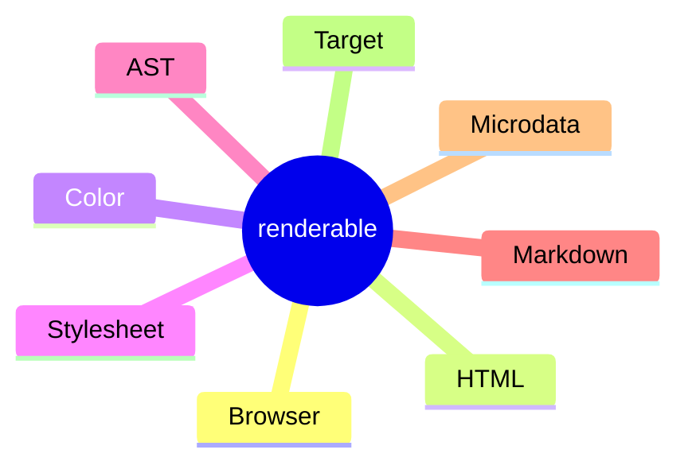

# `renderable` library

This library provides traits and utilities to aid in the creation of "components" which _render_ to multiple target types:

1. Terminal
2. Markdown
3. MarkdownPlus*
4. Browser
5. AST

> - **Markdown** and **MarkdownPlus** are both forms of Markdown but the term **MarkdownPlus** refers to a more feature rich Markdown format that leverages inline HTML to achieve this richer functionality. Effectively **MarkdownPlus** trades some of the ergonomics of authoring Markdown for more functionality.
> - **AST** uses the [HAST](https://github.com/syntax-tree/hast) style of AST popularized by the Javascript/Typescript ecosystem but now made available via the [`markdown`](https://crates.io/crates/markdown) crate.

## Modules

The **renderable** library is composed of the following modules:
