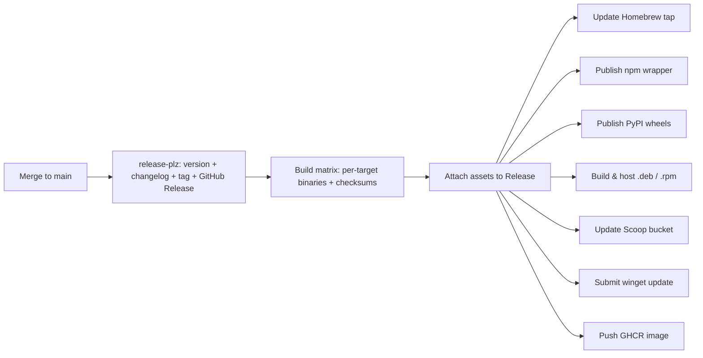
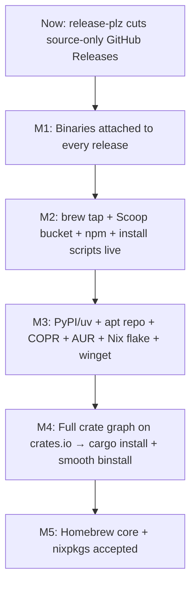

# Deploying Rust Binaries to Package Managers

Rust compiles to self-contained native binaries, which is a gift for distribution: there is no runtime to ship and no interpreter to match. The challenge is **reach** — getting a release in front of users with the least friction, on whatever platform and package manager they already trust. This document enumerates the realistic deployment targets for a Rust CLI, explains what each one requires, flags the review/approval queues that can delay availability, and ends with a concrete, phased rollout plan for the `claudine` and `md` (Darkmatter) CLIs in this monorepo.

## TL;DR

- **One artifact source feeds almost everything.** Build per-platform binaries once, attach them to a **GitHub Release**, and the majority of package managers become thin manifests that point at those assets. Invest here first.
- **`cargo-dist` (now `dist`) generates the long tail for free** — shell/PowerShell installers, a Homebrew tap formula, an npm wrapper package, and a Windows MSI — all from one config block.
- **Neon is the wrong tool for shipping a CLI to npm.** Neon builds native *Node addons* (libraries called from JS). A standalone CLI ships to npm as a tiny JS shim plus per-platform binary packages — the `esbuild`/`biome`/`ruff` pattern. No FFI required.
- **crates.io (`cargo install`) is *not* a quick win for this repo** because every crate uses `path =` dependencies; publishing requires versioning and publishing the entire dependency graph first.
- **Community registries (Homebrew core, nixpkgs, winget, Fedora, Debian) gate on review.** Your own tap/bucket/flake/apt-repo is instant and fully under your control; the official channels add reach but cost weeks and notability thresholds.

## The Landscape of Deployment Targets

The targets split into four families. The user-named six (`cargo`, `brew`, `apt`, `nixos`, `uv`, `npm`) are a representative slice, not the whole map.

```mermaid
graph TD
    A[Rust release artifacts] --> B[Language ecosystems]
    A --> C[OS / distro package managers]
    A --> D[Cross-platform managers]
    A --> E[Universal GitHub-Release consumers]

    B --> B1[cargo install / crates.io]
    B --> B2[cargo-binstall]
    B --> B3[npm  JS/TS]
    B --> B4[uv / pipx / PyPI  Python]
    B --> B5[conda-forge]

    C --> C1[apt / .deb  Debian-Ubuntu]
    C --> C2[dnf / .rpm  Fedora-RHEL]
    C --> C3[AUR  Arch]
    C --> C4[apk  Alpine]
    C --> C5[Nix / NixOS / nixpkgs]
    C --> C6[MacPorts]

    D --> D1[Homebrew  macOS-Linux]
    D --> D2[Scoop  Windows]
    D --> D3[Chocolatey  Windows]
    D --> D4[winget  Windows]
    D --> D5[snap]
    D --> D6[Flatpak]
    D --> D7[asdf / mise]

    E --> E1[curl-bash / PowerShell installers]
    E --> E2[eget / ubi]
    E --> E3[webi]
    E --> E4[Docker / GHCR images]
```



| Target                      | Ecosystem      | Self-service? | Review delay   | Effort                  |
|-----------------------------|----------------|---------------|----------------|-------------------------|
| `cargo install` (crates.io) | Rust           | Yes           | Minutes (none) | High *(for this repo)*  |
| `cargo binstall`            | Rust           | Yes           | None           | Low *(needs crates.io)* |
| GitHub Release + installers | —              | Yes           | None           | Low                     |
| Homebrew (own tap)          | Cross-platform | Yes           | None           | Low                     |
| Homebrew core               | Cross-platform | No            | Days–weeks     | Medium                  |
| npm                         | JS/TS          | Yes           | None           | Medium                  |
| uv / pipx (PyPI)            | Python         | Yes           | None           | Medium                  |
| apt (own repo / PPA)        | Debian/Ubuntu  | Yes           | None–hours     | Medium                  |
| apt (Debian official)       | Debian/Ubuntu  | No            | Months         | High                    |
| dnf/.rpm (COPR)             | Fedora         | Yes           | Minutes        | Medium                  |
| AUR                         | Arch           | Yes           | None           | Low                     |
| Nix flake                   | NixOS/macOS    | Yes           | None           | Low                     |
| nixpkgs                     | NixOS/macOS    | No            | Days–weeks     | Medium                  |
| Scoop (own bucket)          | Windows        | Yes           | None           | Low                     |
| winget                      | Windows        | No            | Hours–days     | Medium                  |
| Chocolatey                  | Windows        | No            | Hours–days     | Medium                  |
| Docker / GHCR               | Containers     | Yes           | None           | Low                     |
| snap / Flatpak              | Linux          | Partial       | Hours–days     | Medium                  |

## The Foundation: GitHub Releases + Prebuilt Binaries

Before any package manager, you need **versioned, per-platform binary artifacts** at a stable URL. A GitHub Release is the canonical home: it is free, content-addressable, and almost every downstream manager (Homebrew, Scoop, binstall, eget, npm-wrapper, apt/rpm hosting) is just a pointer at these assets plus a checksum.

The typical target triples for a CLI:

- `x86_64-unknown-linux-gnu`, `aarch64-unknown-linux-gnu`
- `x86_64-unknown-linux-musl`, `aarch64-unknown-linux-musl` (static, portable)
- `x86_64-apple-darwin`, `aarch64-apple-darwin`
- `x86_64-pc-windows-msvc`, `aarch64-pc-windows-msvc`

### Option A — `dist` (formerly `cargo-dist`)

`dist` is purpose-built for this. One `dist init` writes a config and a release workflow that, on tag push, cross-compiles the matrix, produces tarballs/zips with checksums and SBOMs, and **generates installers for several managers at once**:

```toml
# In the workspace root Cargo.toml
[workspace.metadata.dist]
cargo-dist-version = "0.28.0"
ci = ["github"]
# Each installer below is produced from the same release assets:
installers = ["shell", "powershell", "homebrew", "npm"]
targets = [
  "aarch64-apple-darwin", "x86_64-apple-darwin",
  "x86_64-unknown-linux-gnu", "aarch64-unknown-linux-gnu",
  "x86_64-pc-windows-msvc",
]
# Push the generated Homebrew formula to a tap you control:
tap = "yankeeinlondon/homebrew-tap"
# Publish the generated npm wrapper under a scope:
npm-scope = "@rusty-biscuit"
```

```bash
cargo install cargo-dist        # or: dist
dist init                        # interactive; writes config + .github/workflows/release.yml
git tag claudine-v0.1.0 && git push --tags   # CI builds + publishes everything
```

The `shell`/`powershell` installers give users `curl --proto '=https' -sSfL https://.../installer.sh | sh`. The `homebrew` installer commits a formula to your tap. The `npm` installer publishes a wrapper package. That is **four targets from one config**.

> **Caveat — maintenance status.** Axo Dev (dist's original sponsor) wound down, so the project's long-term cadence is uncertain. It still works well today, but for a repo that already standardizes on `release-plz`, an alternative is a hand-rolled build matrix (below) that you fully own.

### Option B — release-plz + a build-and-attach matrix

This repo already runs `release-plz` (`.github/workflows/release-plz.yml`) to cut tags and GitHub Releases with `publish = false`. Today those releases carry **source and changelog only** — no binaries. Add a second workflow that triggers on the tags release-plz creates and attaches binaries:

```yaml
# .github/workflows/release-binaries.yml
name: Release binaries
on:
  push:
    tags: ["claudine-v*", "darkmatter-v*"]   # tags release-plz already emits

jobs:
  build:
    strategy:
      matrix:
        include:
          - { os: macos-14,     target: aarch64-apple-darwin }
          - { os: macos-13,     target: x86_64-apple-darwin }
          - { os: ubuntu-latest, target: x86_64-unknown-linux-gnu }
          - { os: ubuntu-latest, target: aarch64-unknown-linux-gnu }
          - { os: windows-latest, target: x86_64-pc-windows-msvc }

    runs-on: ${{ matrix.os }}
    steps:

      - uses: actions/checkout@v4
      - uses: dtolnay/rust-toolchain@stable
        with: { targets: "${{ matrix.target }}" }

      - name: Pick binary from the tag
        run: |
          case "${GITHUB_REF_NAME}" in
            claudine-v*)   echo "BIN=claudine" >> "$GITHUB_ENV"; echo "PKG=claudine-cli" >> "$GITHUB_ENV" ;;
            darkmatter-v*) echo "BIN=md"       >> "$GITHUB_ENV"; echo "PKG=darkmatter-cli" >> "$GITHUB_ENV" ;;
          esac

      - run: cargo build --release -p "$PKG" --target ${{ matrix.target }}
      - name: Package + checksum
        shell: bash
        run: |
          dist="${BIN}-${GITHUB_REF_NAME}-${{ matrix.target }}"
          mkdir "$dist"
          cp "target/${{ matrix.target }}/release/${BIN}"* "$dist/" 2>/dev/null || true
          tar czf "$dist.tar.gz" "$dist"
          shasum -a 256 "$dist.tar.gz" > "$dist.tar.gz.sha256"

      - uses: softprops/action-gh-release@v2
        with:
          files: |
            *.tar.gz
            *.tar.gz.sha256
```

Cross-compiling the Linux `aarch64` and `musl` targets is smoother with [`cross`](https://github.com/cross-rs/cross) or [`taiki-e/upload-rust-binary-action`](https://github.com/taiki-e/upload-rust-binary-action), which wraps the build+package+attach steps into one action.

Everything below assumes these release assets exist.

## Per-Target Guides

### `cargo install` — crates.io

**Process.** `cargo publish` each crate to crates.io; users run `cargo install <crate>`, which compiles from source.

**Accounts / setup.** A crates.io account (GitHub OAuth) and an API token (`cargo login`). In CI, store the token as a secret and `cargo publish --token`.

**Review.** None — publishing is immediate and **irreversible** (versions can be *yanked* but not deleted).

**Wrappers/config.** Each crate needs `description`, `license`, and `repository` in `[package]`. The binary crate is what users install.

**The blocker for this monorepo.** crates.io **forbids `path` dependencies** in published crates — every dependency must resolve to a published, version-pinned crate. `claudine-cli` and `darkmatter-cli` depend on ~15 internal `path =` crates each (`biscuit-file`, `biscuit-terminal`, `sniff`, `darkmatter`, …), which themselves have internal path deps. Publishing requires topologically publishing the **entire internal graph** with real version numbers. That is exactly why `release-plz.toml` sets `publish = false` today. It is achievable but a project in itself (see milestones).

```bash
# Publish order matters: leaves of the dependency graph first.
cargo publish -p biscuit-hash
cargo publish -p biscuit-file
# … all internal deps …
cargo publish -p darkmatter
cargo publish -p darkmatter-cli
# Users then:
cargo install darkmatter-cli      # installs the `md` binary
```

**Available today with zero publishing** — `cargo install` straight from git:

```bash
cargo install --git https://github.com/yankeeinlondon/rusty-biscuit darkmatter-cli
cargo install --git https://github.com/yankeeinlondon/rusty-biscuit claudine-cli
```

This compiles from source (slow, needs a Rust toolchain) but requires no registry work at all.

### `cargo binstall`

**Process.** `cargo binstall <crate>` looks up the crate **on crates.io** to discover its version and repository, then downloads a prebuilt binary from your GitHub Release instead of compiling. A `[package.metadata.binstall]` block tells it the asset naming scheme.

**Relationship to cargo.** Treat it as a **complement**, not a separate registry: it reuses crates.io for discovery and your GitHub Release for artifacts. It has no submission queue of its own. It falls back to the community `cargo-quickinstall` build service when a crate has no prebuilt assets.

**Config.**

```toml
# darkmatter/cli/Cargo.toml
[package.metadata.binstall]
pkg-url = "{ repo }/releases/download/{ name }-v{ version }/md-{ name }-v{ version }-{ target }.tar.gz"
pkg-fmt = "tgz"
bin-dir = "md-{ name }-v{ version }-{ target }/md"
```

**Dependency.** Because discovery goes through crates.io, binstall is **only frictionless once the crate is published there**. Newer versions support `--git`, but the smooth path is post-crates.io.

### Homebrew (macOS + Linuxbrew)

Two routes:

**1. Your own tap (instant, recommended first).** A tap is just a GitHub repo named `homebrew-<name>`. Add a formula and users run:

```bash
brew tap yankeeinlondon/tap
brew install md          # or: brew install claudine
```

```ruby
# Formula/md.rb in github.com/yankeeinlondon/homebrew-tap
class Md < Formula
  desc "Themed Markdown renderer for terminal and browser"
  homepage "https://github.com/yankeeinlondon/rusty-biscuit"
  version "0.1.0"
  license "AGPL-3.0-only"

  on_macos do
    on_arm do
      url "https://github.com/yankeeinlondon/rusty-biscuit/releases/download/darkmatter-v0.1.0/md-darkmatter-v0.1.0-aarch64-apple-darwin.tar.gz"
      sha256 "REPLACED_BY_CI"
    end
  end

  def install
    bin.install "md"
  end

  test do
    assert_match "md", shell_output("#{bin}/md --version")
  end
end
```

CI keeps the formula current — `dist` does this automatically, or use the [`mislav/bump-homebrew-formula-action`](https://github.com/mislav/bump-homebrew-formula-action) after a release.

**2. homebrew-core (broad reach, reviewed).** A PR to `Homebrew/homebrew-core` gets your formula into the default tap (no `brew tap` needed). Gated by **notability** (roughly: stable, reasonably popular project — historically ~30+ forks/watchers or 75+ stars as a signal) and human review (days to weeks). Bottles (prebuilt binaries) are produced by Homebrew's CI. AGPL is accepted.

### apt — Debian / Ubuntu (`.deb`)

**Build the package** with [`cargo-deb`](https://github.com/kornelski/cargo-deb):

```bash
cargo install cargo-deb
cargo deb -p darkmatter-cli            # emits target/debian/darkmatter-cli_0.1.0_amd64.deb
```

Add minimal metadata:

```toml
# darkmatter/cli/Cargo.toml
[package.metadata.deb]
maintainer = "Ken Snyder <ken@ken.net>"
section = "utils"
assets = [["target/release/md", "usr/bin/", "755"]]
```

**Distribution routes, easiest to hardest:**

- **Direct `.deb`.** Attach to the GitHub Release; users `sudo dpkg -i md_0.1.0_amd64.deb`. No `apt update` integration, no auto-updates.
- **Your own apt repo (recommended).** Sign packages with GPG and host an `apt` repository (GitHub Pages, S3, or a hosted service like **Cloudsmith**/**packagecloud**). Users add it once:
  ```bash
  curl -fsSL https://apt.yourdomain.dev/key.gpg | sudo gpg --dearmor -o /usr/share/keyrings/rb.gpg
  echo "deb [signed-by=/usr/share/keyrings/rb.gpg] https://apt.yourdomain.dev stable main" | sudo tee /etc/apt/sources.list.d/rb.list
  sudo apt update && sudo apt install md
  ```
    
    Tools like [`aptly`](https://www.aptly.info/) or `reprepro` manage the repo; hosted services handle GPG and the pool layout for you.

- **Ubuntu PPA (Launchpad).** Builds from source on Launchpad. Requires a Launchpad account, a GPG key, and a Debian source package. Build queue is minutes–hours.
- **Debian official.** Requires a Debian Developer sponsor and the full Debian packaging/review process — **months**. Not a near-term target.

### dnf / `.rpm` — Fedora / RHEL

**Build** with [`cargo-generate-rpm`](https://github.com/cat-in-136/cargo-generate-rpm):

```bash
cargo install cargo-generate-rpm
cargo build --release -p darkmatter-cli
cargo generate-rpm -p darkmatter/cli      # emits an .rpm under target/generate-rpm/
```

**Distribute** via **Fedora COPR** — a free build+host service. Push a spec to COPR and it builds RPMs for multiple Fedora/EL versions; users:

```bash
sudo dnf copr enable yankeeinlondon/rusty-biscuit
sudo dnf install md
```

Official Fedora (`dnf install` from the default repos) requires package review and a sponsor — slow, skip initially.

### AUR — Arch Linux

**Process.** Push a `PKGBUILD` to the AUR git endpoint. **No review** — it is a user repository — so availability is immediate. Users install via an AUR helper (`yay`, `paru`).

```bash
# PKGBUILD for a -bin package (uses your prebuilt release asset)
pkgname=md-bin
pkgver=0.1.0
pkgrel=1
arch=('x86_64' 'aarch64')
url="https://github.com/yankeeinlondon/rusty-biscuit"
license=('AGPL3')
provides=('md')
source_x86_64=("$url/releases/download/darkmatter-v$pkgver/md-darkmatter-v$pkgver-x86_64-unknown-linux-gnu.tar.gz")
package() { install -Dm755 "$srcdir/md" "$pkgdir/usr/bin/md"; }
```

Automate updates with [`KSXGitHub/github-actions-deploy-aur`](https://github.com/KSXGitHub/github-actions-deploy-aur). Account: an AUR account with an SSH key.

### Alpine `apk`

Build a static `musl` binary, write an `APKBUILD`, and either host your own apk repo or submit to Alpine's `aports` (reviewed via GitLab merge request). Lower priority unless you target Alpine-based containers specifically.

### Nix / NixOS

**Your own flake (instant).** Ship a `flake.nix`; users run your tool with no installation:

```bash
nix run github:yankeeinlondon/rusty-biscuit#md
nix profile install github:yankeeinlondon/rusty-biscuit#claudine
```

```nix
# flake.nix (sketch)
{
  outputs = { self, nixpkgs }:
    let pkgs = nixpkgs.legacyPackages.x86_64-linux; in {
      packages.x86_64-linux.md = pkgs.rustPlatform.buildRustPackage {
        pname = "darkmatter-cli";
        version = "0.1.0";
        src = ./.;
        cargoLock.lockFile = ./Cargo.lock;
        cargoBuildFlags = [ "-p" "darkmatter-cli" ];
      };
    };
}
```

**nixpkgs (broad reach, reviewed).** A PR to `NixOS/nixpkgs` lands your package in the main channel (`nix-env -iA nixpkgs.md`). Human review on GitHub, days to weeks. Works on NixOS and on macOS/Linux where Nix is used as a standalone manager — exactly the cross-platform reach the prompt mentions.

### Scoop — Windows

**Own bucket (instant).** A bucket is a GitHub repo of JSON manifests.

```json
{
  "version": "0.1.0",
  "architecture": {
    "64bit": {
      "url": "https://github.com/yankeeinlondon/rusty-biscuit/releases/download/darkmatter-v0.1.0/md-darkmatter-v0.1.0-x86_64-pc-windows-msvc.zip",
      "hash": "REPLACED_BY_CI",
      "bin": "md.exe"
    }
  },
  "checkver": "github",
  "autoupdate": {
    "architecture": { "64bit": { "url": "https://github.com/.../md-darkmatter-v$version-x86_64-pc-windows-msvc.zip" } }
  }
}
```

```powershell
scoop bucket add rb https://github.com/yankeeinlondon/scoop-bucket
scoop install md
```

The `checkver`/`autoupdate` fields let Scoop's `excavator` bot bump versions automatically. Submission to `ScoopInstaller/Main` is reviewed; your own bucket is not.

### winget — Windows Package Manager

**Process.** Submit a YAML manifest via PR to `microsoft/winget-pkgs`. Generate it with `wingetcreate`:

```powershell
wingetcreate new https://github.com/yankeeinlondon/rusty-biscuit/releases/download/darkmatter-v0.1.0/md-x86_64-pc-windows-msvc.zip
wingetcreate submit --token $env:GH_TOKEN   # opens the PR
```

**Review.** Automated validation + light moderation; hours to a few days. `wingetcreate update` in CI keeps it current. Users: `winget install yankeeinlondon.md`.

### Chocolatey — Windows

Package a `.nuspec` + install script (`chocolatey pack`), push with an API key (`choco push`). New packages and updates pass through automated + moderator review (hours–days). More boilerplate than winget/Scoop; include only if your audience leans Chocolatey.

### npm — JavaScript / TypeScript

**Correcting the premise: Neon is not needed.** Neon builds native Node *addons* — `.node` libraries loaded into a JS process. A **CLI** does not need to be loaded into Node; it just needs to land on the user's `PATH`. The idiomatic pattern (used by `esbuild`, `@biomejs/biome`, `swc`, `@napi-rs` CLIs, and `ruff`) is:

1. Publish one **per-platform package** per target, each containing just the prebuilt binary:
   `@rusty-biscuit/md-darwin-arm64`, `@rusty-biscuit/md-linux-x64`, `@rusty-biscuit/md-win32-x64`, …
   Each declares its platform so npm only installs the matching one:
   ```json
   { "name": "@rusty-biscuit/md-linux-x64", "version": "0.1.0", "os": ["linux"], "cpu": ["x64"], "bin": { "md": "md" } }
   ```

2. Publish a **main package** that lists those as `optionalDependencies` and ships a tiny launcher that `exec`s the right one:
   ```json
   {
     "name": "@rusty-biscuit/md",
     "version": "0.1.0",
     "bin": { "md": "bin/md.js" },
     "optionalDependencies": {
       "@rusty-biscuit/md-darwin-arm64": "0.1.0",
       "@rusty-biscuit/md-linux-x64": "0.1.0",
       "@rusty-biscuit/md-win32-x64": "0.1.0"
     }
   }
   ```
   
   npm installs only the one optional dependency whose `os`/`cpu` matches the host. The launcher resolves that package's binary and `spawn`s it.

**`dist` automates this entire dance** via its `npm` installer — strongly preferred over hand-rolling. Users then run `npm i -g @rusty-biscuit/md` or `npx @rusty-biscuit/md`.

**Accounts/review.** An npmjs.com account + automation token; **no review queue**. Publishing a scoped package publicly needs `npm publish --access public`.

### uv / pipx — Python (PyPI)

Same shape as npm, but for Python: publish **platform-specific wheels** that bundle the Rust binary and expose it as a console entry point. [`maturin`](https://github.com/PyO3/maturin) builds these even when there is **no PyO3/FFI** — it has a "bin" mode that wraps a Cargo binary into a wheel. **`ruff` is the canonical proof**: a pure-Rust CLI installed across the Python world with `uv tool install ruff` / `pipx install ruff` / `uvx ruff`.

```bash
pip install maturin
# Build a wheel that carries the `md` binary as a console script:
maturin build --release --bin md -m darkmatter/cli/Cargo.toml
maturin publish        # uploads per-platform wheels to PyPI (needs a PyPI token)
```

Build the wheels on a CI matrix (or under `manylinux` containers / `maturin-action`) so each platform gets its own wheel. Users:

```bash
uv tool install md          # or: uvx md   /   pipx install md
```

**Accounts/review.** A PyPI account + API token (trusted publishing via OIDC from GitHub Actions is the modern, token-less option). **No review queue.**

### Docker / GHCR

A container is a deployment target in its own right — and free to host on GitHub Container Registry.

```dockerfile
FROM rust:1-slim AS build
WORKDIR /src
COPY . .
RUN cargo build --release -p darkmatter-cli

FROM debian:stable-slim
COPY --from=build /src/target/release/md /usr/local/bin/md
ENTRYPOINT ["md"]
```

```yaml
# Publish to ghcr.io on tag
- uses: docker/login-action@v3
  with: { registry: ghcr.io, username: ${{ github.actor }}, password: ${{ secrets.GITHUB_TOKEN }} }

- uses: docker/build-push-action@v6
  with: { push: true, tags: "ghcr.io/yankeeinlondon/md:0.1.0,ghcr.io/yankeeinlondon/md:latest" }
```

Users: `docker run --rm ghcr.io/yankeeinlondon/md:latest`. No review.

### Universal installers that need *no* extra publishing

These consume your GitHub Release directly, so they cost nothing beyond having assets with predictable names:

- **Shell / PowerShell install scripts** — `curl … | sh` and `irm … | iex`. Generated by `dist`, or write your own once.
- **[`eget`](https://github.com/zyedidia/eget)** / **[`ubi`](https://github.com/houseabsolute/ubi)** — "install any binary from a GitHub Release": `eget yankeeinlondon/rusty-biscuit --asset md`.
- **[webi](https://webinstall.dev/)** — `curl https://webi.sh/md | sh` once you submit a small installer manifest.

### snap / Flatpak / MacPorts (lower priority for CLIs)

- **snap** — `snapcraft.yaml`, build, push to the Snap Store (reviewed; classic confinement for CLIs needs manual approval). Good Ubuntu reach but heavier than an apt repo.
- **Flatpak** — primarily a GUI-app delivery system (Flathub); rarely the right fit for a terminal CLI.
- **MacPorts** — a `Portfile` PR to the macports-ports repo; small audience next to Homebrew.

## Cross-Cutting Automation Tooling

| Tool                                                        | Role                                                                                         |
|-------------------------------------------------------------|----------------------------------------------------------------------------------------------|
| `dist` (cargo-dist)                                         | Cross-compile matrix + generate shell/PowerShell/Homebrew/npm/MSI installers from one config |
| `release-plz`                                               | Version bumps, changelogs, tags, GitHub Releases (already in this repo)                      |
| `cross` / `taiki-e/upload-rust-binary-action`               | Painless cross-compilation + asset upload                                                    |
| `cargo-deb`                                                 | Build `.deb` packages                                                                        |
| `cargo-generate-rpm`                                        | Build `.rpm` packages                                                                        |
| `maturin`                                                   | Build PyPI wheels carrying a Rust binary (uv/pipx)                                           |
| `wingetcreate`                                              | Generate + submit winget manifests                                                           |
| `bump-homebrew-formula-action`, `github-actions-deploy-aur` | Keep tap/AUR manifests current after each release                                            |

A mature pipeline layers them: **release-plz** decides *when* and *what version*, a **binary build matrix** (or `dist`) produces *artifacts*, and a fan-out of small steps updates each downstream manifest.



## Recommendations for `claudine` and `md`

The repo already has the hardest 60% done: `release-plz` cuts versioned GitHub Releases on every merge to `main`. The single missing primitive is **binary artifacts on those releases**. Add that, and a wide set of targets unlock with thin, automatable manifests.

A few repo-specific notes that shape the plan:

- **Binary names.** Claudine ships `claudine`; Darkmatter ships **`md`**. `md` is an extremely common name and will collide in flat namespaces (Homebrew core, winget, an unscoped npm/PyPI name, `/usr/bin/md`). Keep distribution under a **scope/namespace** (`@rusty-biscuit/md`, `yankeeinlondon.md`, your own tap/bucket) and confirm name availability before chasing the official channels.
- **AGPL-3.0-only.** Accepted by every registry above; it is a *consumer* consideration (some corporate users avoid AGPL), not a publishing blocker.
- **crates.io is gated by the `path =` graph.** Do not put `cargo install` from crates.io in Phase 1.
- **Drift to fix in passing.** `darkmatter/cli/Cargo.toml` sets `repository = "https://github.com/yankeeinlondon/dockhand"`, but this repo is `rusty-biscuit`. Several managers (binstall, Homebrew, AUR) derive URLs from `repository`; correct it before publishing.

### Phase 1 — Quick wins (days)

Goal: real, auto-updating installs on every major platform with **no external review queues**.

1. **Binary artifacts on GitHub Releases.** Add the build-and-attach matrix triggered by the `claudine-v*` / `darkmatter-v*` tags release-plz already emits. *This is the keystone — everything else depends on it.*
2. **Shell + PowerShell install scripts.** Free once assets exist (`curl … | sh`). Lowest-friction "try it now."
3. **Homebrew via your own tap.** Covers macOS (Ken's primary platform) and Linuxbrew. Auto-bump the formula in CI.
4. **Scoop via your own bucket.** Covers Windows with autoupdate, no review.
5. **npm wrapper package** (scoped, `@rusty-biscuit/*`), ideally generated by `dist`. Reaches the largest developer community; corrects the Neon misconception.
6. **`cargo install --git`** documented in the READMEs — zero-publish path for Rust users today.
7. **GHCR image** for `claudine` (and `md`) — trivial, useful for CI consumers.

> Adopting **`dist`** collapses items 1, 2, 3, and 5 into a single config + workflow. Given the project's `release-plz` standardization, evaluate `dist` against a hand-rolled matrix and pick one; either reaches the same Phase-1 surface.

### Phase 2 — Broader reach (weeks, includes review queues)

8. **cargo-binstall metadata** — add `[package.metadata.binstall]` so binstall serves prebuilt binaries (smooth once crates.io publishing lands).
9. **uv / pipx (PyPI)** via `maturin` wheels — large reach into the Python-tooling crowd; `ruff` proves the model.
10. **Own apt repo** (`cargo-deb` + Cloudsmith/Pages/aptly) and **Fedora COPR** (`cargo-generate-rpm`) — covers Debian/Ubuntu and Fedora without distro review boards.
11. **AUR `-bin` packages** — instant publish, real Arch reach.
12. **Nix flake** — instant `nix run`/`nix profile install`; cheap and high-value for the Nix crowd.
13. **winget** — submit via `wingetcreate`; auto-update in CI (hours–days review).

### Phase 3 — Official channels & crates.io (project-scale)

14. **Publish the internal crate graph to crates.io** (`publish = false` → versioned, path-deps replaced with version deps, topological publish). This unblocks first-class `cargo install darkmatter-cli` / `claudine-cli` *and* the smooth binstall path. Treat as its own initiative — it touches ~72 workspace members.
15. **Homebrew core** and **nixpkgs** PRs — broad default-tap/default-channel reach once the projects clear notability bars.
16. **Chocolatey**, **snap**, optionally **Debian/Fedora official** — diminishing returns; add on demand.

### Milestones



- **M1 — Artifact foundation.** The build matrix attaches per-platform binaries + checksums to release-plz's releases. Unblocks *everything* downstream. Fix the stale `repository` URL here.
- **M2 — Self-service everywhere.** Homebrew tap, Scoop bucket, npm wrapper, curl/PowerShell installers — no review queues, auto-updating. After this, every major OS has a one-line install.
- **M3 — Ecosystem + distro reach.** PyPI/uv, own apt repo, Fedora COPR, AUR, a Nix flake, and winget. Mixes instant channels with light review (winget). Confirm the `md` name is free in each flat namespace first.
- **M4 — crates.io.** The big lift: version and publish the internal dependency graph so `cargo install` and frictionless `cargo binstall` work. Gateway milestone for the Rust-native audience.
- **M5 — Default channels.** Homebrew core and nixpkgs acceptance (subject to notability + review), removing the `brew tap` / flake-URL step for the widest audience.
