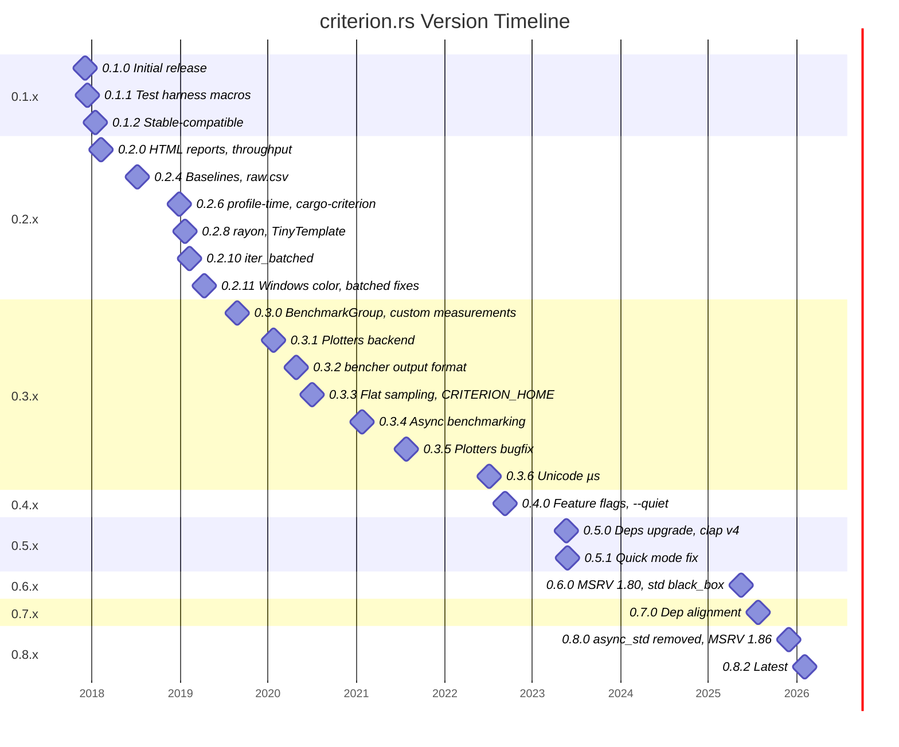
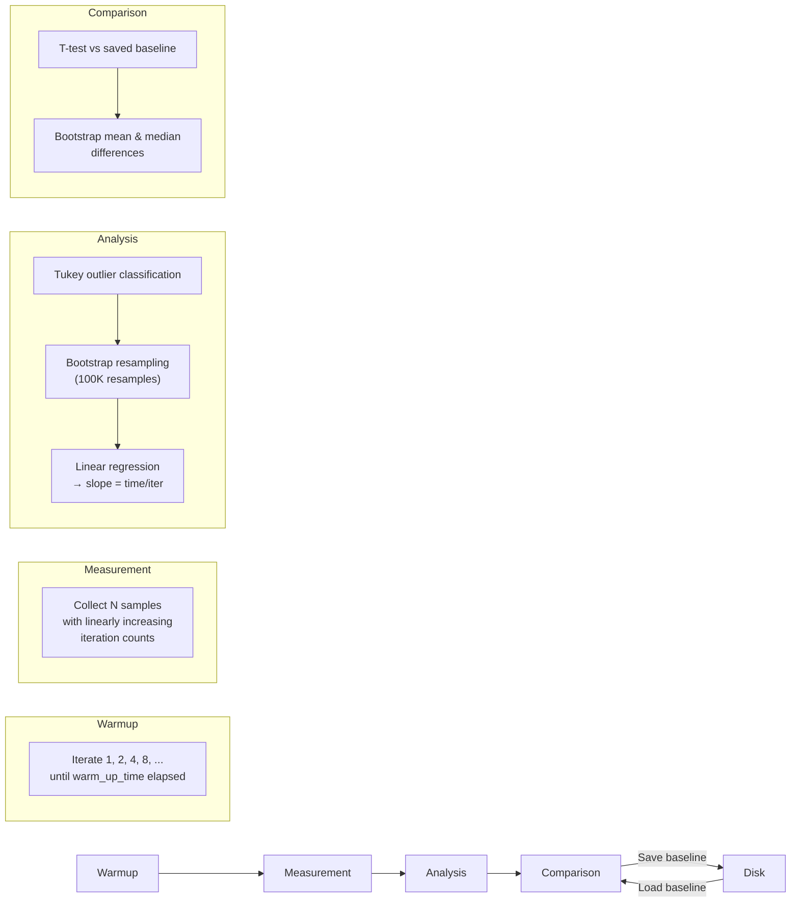

# `criterion` crate

Criterion.rs is a statistics-driven micro-benchmarking library for Rust, ported from [Haskell's Criterion](https://hackage.haskell.org/package/criterion). It is the de facto standard benchmarking harness in the Rust ecosystem, working on both stable and nightly Rust. Criterion.rs collects and stores statistical information from run to run, can automatically detect performance regressions, and measures optimizations with strong statistical confidence using bootstrap resampling and linear regression analysis.

- **Crate**: `criterion`
- **Repository**: <https://github.com/criterion-rs/criterion.rs>
- **Book**: <https://criterion-rs.github.io/book/>
- **API Docs**: <https://docs.rs/criterion>
- **License**: Apache-2.0 OR MIT
- **Latest Version**: 0.8.2 (2026-02-04)
- **Total Downloads**: 210M+

## Getting Started

Add Criterion as a dev-dependency and declare a benchmark target with `harness = false`:

```toml
[dev-dependencies]
criterion = { version = "0.8", features = ["async_tokio"] }

[[bench]]
name = "my_benchmark"
harness = false
```

Write the benchmark file at `benches/my_benchmark.rs`:

```rust
use criterion::{criterion_group, criterion_main, Criterion};
use std::hint::black_box;

fn fibonacci(n: u64) -> u64 {
    match n {
        0 | 1 => 1,
        n => fibonacci(n - 1) + fibonacci(n - 2),
    }
}

fn fibonacci_benchmark(c: &mut Criterion) {
    c.bench_function("fib 20", |b| {
        b.iter(|| fibonacci(black_box(20)))
    });
}

criterion_group!(benches, fibonacci_benchmark);
criterion_main!(benches);
```

Run with:

```bash
cargo bench
```

For mixed lib/CLI workspaces, start with a few high-signal, non-gating benchmarks:

- policy or matcher evaluation hot paths
- stream parsing throughput
- config loading or dispatch setup on repeated calls

Add them first as local or scheduled CI checks before enforcing regression budgets on every PR.

## Features

Criterion exposes the following cargo features (as of 0.8.2):

| Feature               | Default | Description                                                                                                                         |
|-----------------------|---------|-------------------------------------------------------------------------------------------------------------------------------------|
| `rayon`               | Yes     | Enables parallel iteration via the `rayon` crate. Disable to reduce compile time if you don't need parallelism.                     |
| `plotters`            | Yes     | Enables the `plotters` plotting backend for generating charts.                                                                      |
| `cargo_bench_support` | Yes     | Enables running benchmarks via `cargo bench` without `cargo-criterion`.                                                             |
| `csv_output`          | No      | Enables writing `raw.csv` files with machine-readable measurements. Deprecated in favor of `cargo-criterion --message-format=json`. |
| `html_reports`        | No      | Enables HTML report generation. In 0.4+ this is behind a feature flag; use `cargo-criterion` instead.                               |
| `async`               | No      | Base feature for async benchmarking support.                                                                                        |
| `async_futures`       | No      | Enables async benchmarking with the `futures` executor (`FuturesExecutor`).                                                         |
| `async_smol`          | No      | Enables async benchmarking with the `smol` executor (`SmolExecutor`).                                                               |
| `async_tokio`         | No      | Enables async benchmarking with the `tokio` executor (`tokio::runtime::Runtime` or `Handle`).                                       |
| `real_blackbox`       | No      | No-op since 0.6.0. Previously used `std::hint::black_box()` on nightly. Now always uses it.                                         |
| `stable`              | No      | Convenience feature that enables `csv_output`, `html_reports`, and all async executor features.                                     |

## Version Timeline



### 0.1.x — Foundational Releases

| Version   | Date       | Highlights                                                                                                                                                              |
|-----------|------------|-------------------------------------------------------------------------------------------------------------------------------------------------------------------------|
| **0.1.0** | 2017-12-02 | Initial release. Statistics-driven benchmarking, gnuplot plots, bootstrap confidence intervals. Originally authored by Jorge Aparicio, maintained by Brook Heisler.     |
| **0.1.1** | 2017-12-12 | Added `criterion_group!` / `criterion_main!` macros for test harness generation. Selective benchmark running via command-line filter.                                   |
| **0.1.2** | 2018-01-12 | **Stable Rust compatible.** Introduced a stable-compatible `black_box`. Switched to `serde` for result persistence. Redesigned CLI output to highlight important stats. |

### 0.2.x — HTML Reports and Modern API

| Version    | Date       | Highlights                                                                                                                                                                                                                                                                                        |
|------------|------------|---------------------------------------------------------------------------------------------------------------------------------------------------------------------------------------------------------------------------------------------------------------------------------------------------|
| **0.2.0**  | 2018-02-05 | **Breaking change.** Builder methods now take `self` by value for chaining. Added `Benchmark` / `ParameterizedBenchmark` types for per-benchmark config. Introduced **HTML reports**, throughput measurement (`Throughput::Bytes` / `Throughput::Elements`). Output moved to `target/criterion/`. |
| **0.2.1**  | 2018-02-24 | HTML reports became a default Cargo feature. Summary reports for multi-function comparisons. Plots moved to `report/` subfolder.                                                                                                                                                                  |
| **0.2.2**  | 2018-03-25 | Bug fixes for broken links in summary reports.                                                                                                                                                                                                                                                    |
| **0.2.3**  | 2018-04-15 | Added `--measure-only` argument (for profiling). Added index report at `target/criterion/report/index.html`.                                                                                                                                                                                      |
| **0.2.4**  | 2018-07-09 | Added **baselines** (`--save-baseline`, `--baseline`). Added `raw.csv` machine-readable output. Added `--test` flag.                                                                                                                                                                              |
| **0.2.5**  | 2018-08-27 | Input-size effect charts for benchmarks with numeric inputs. Various path and gnuplot fixes.                                                                                                                                                                                                      |
| **0.2.6**  | 2018-12-27 | Yanked. Added `--profile-time` (deprecates `--measure-only`). Deprecated external-program benchmarks.                                                                                                                                                                                             |
| **0.2.7**  | 2018-12-29 | Fixed version compatibility with `criterion-stats`.                                                                                                                                                                                                                                               |
| **0.2.8**  | 2019-01-20 | Replaced `thread-scoped` with `rayon`. Replaced Handlebars with **TinyTemplate**. Merged `criterion-stats` into main crate. Dependency tree reduction.                                                                                                                                            |
| **0.2.9**  | 2019-01-24 | Removed default features from `rand-core` dependency.                                                                                                                                                                                                                                             |
| **0.2.10** | 2019-02-09 | Added **`iter_batched` / `iter_batched_ref`** timing loops (more accurate setup measurement). Deprecated `iter_with_setup`.                                                                                                                                                                       |
| **0.2.11** | 2019-04-09 | Automatic text-coloring on Windows. Reduced timing overhead for batched iterators.                                                                                                                                                                                                                |

### 0.3.x — BenchmarkGroup and Extensibility

| Version   | Date       | Highlights                                                                                                                                                                                                                                                                                                                                |
|-----------|------------|-------------------------------------------------------------------------------------------------------------------------------------------------------------------------------------------------------------------------------------------------------------------------------------------------------------------------------------------|
| **0.3.0** | 2019-08-25 | **Major refactor.** Introduced **`BenchmarkGroup`** (supersedes `Benchmark`, `ParameterizedBenchmark`, `bench_functions`, etc.). Added **custom measurements** (e.g. processor counters). Added **profiler support** for in-process profilers. Added `iter_custom` timing loop. Removed `--measure-only` and external program benchmarks. |
| **0.3.1** | 2020-01-25 | Added **plotters** backend as alternative to gnuplot. Added `--plotting-backend` option. Added `--load-baseline`. Regex benchmark filters.                                                                                                                                                                                                |
| **0.3.2** | 2020-04-26 | Added `?Sized` bound on parameters (enables `&str`, `&[T]`). Added `--output-format bencher` for libtest-compatible output.                                                                                                                                                                                                               |
| **0.3.3** | 2020-06-29 | Added **`SamplingMode::Flat`** for long-running benchmarks. Added `CRITERION_HOME` env var. Added `cargo-criterion` support.                                                                                                                                                                                                              |
| **0.3.4** | 2021-01-24 | Added **async benchmarking** support (`b.to_async(executor)`). Added `with_output_color`. Zero-time benchmark error messages. Auto-detect output directory.                                                                                                                                                                               |
| **0.3.5** | 2021-07-26 | Bug fixes. MSRV bumped to 1.46.                                                                                                                                                                                                                                                                                                           |
| **0.3.6** | 2022-07-06 | Changed microsecond symbol from ASCII `us` to Unicode `µs`. MSRV bumped to 1.49.                                                                                                                                                                                                                                                          |

### 0.4.x — Feature Gates

| Version   | Date       | Highlights                                                                                                                                                                                                                                                                                                                                                                                                                                                                         |
|-----------|------------|------------------------------------------------------------------------------------------------------------------------------------------------------------------------------------------------------------------------------------------------------------------------------------------------------------------------------------------------------------------------------------------------------------------------------------------------------------------------------------|
| **0.4.0** | 2022-09-10 | **Breaking change.** HTML reports gated behind `html_reports` feature. Added `cargo_bench_support` feature. `rayon` and `plotters` now optional. Status messages to stderr, results to stdout. Added `--discard-baseline`, `--quiet`, `Throughput::BytesDecimal`. Subsecond durations for `--warm-up-time`. Replaced `serde_cbor` with `ciborium`. Removed deprecated `Benchmark`, `ParameterizedBenchmark`, `bench_function_over_inputs`, `bench_functions`, `bench`, `can_plot`. |

### 0.5.x — Dependency Modernization

| Version   | Date       | Highlights                                                                                                                         |
|-----------|------------|------------------------------------------------------------------------------------------------------------------------------------|
| **0.5.0** | 2023-05-23 | Replaced `lazy_static` with `once_cell`. Replaced `atty` with `is-terminal`. Upgraded `clap` to v4, `tempfile` to v3.5. MSRV 1.64. |
| **0.5.1** | 2023-05-26 | Fixed `--quick` mode crash for measured times >5 seconds.                                                                          |

### 0.6.x — Standard Library black_box

| Version   | Date       | Highlights                                                                                                                                                                                                                                                           |
|-----------|------------|----------------------------------------------------------------------------------------------------------------------------------------------------------------------------------------------------------------------------------------------------------------------|
| **0.6.0** | 2025-05-17 | MSRV bumped to 1.80. `real_blackbox` feature is now a no-op — always uses `std::hint::black_box()`. Users should migrate from `criterion::black_box()` to `std::hint::black_box()`. Unpinned `clap` dependency. Added Tokio `Handle` support for async benchmarking. |

### 0.7.x — Maintenance

| Version   | Date       | Highlights                                                                      |
|-----------|------------|---------------------------------------------------------------------------------|
| **0.7.0** | 2025-07-25 | Dependency alignment with `criterion-plot`. Still includes `async_std` feature. |

### 0.8.x — Modern Baseline

| Version   | Date       | Highlights                                        |
|-----------|------------|---------------------------------------------------|
| **0.8.0** | 2025-11-30 | MSRV bumped to 1.86. Removed `async_std` feature. |
| **0.8.1** | 2025-12-07 | Patch release.                                    |
| **0.8.2** | 2026-02-04 | Latest release.                                   |

## Configuration and Best Practices

### Configuring via `BenchmarkGroup`

`BenchmarkGroup` is the preferred API (since 0.3.0) for all but the simplest single-function benchmarks:

```rust
use criterion::{criterion_group, criterion_main, BenchmarkId, Criterion, Throughput};

fn bench_decode(c: &mut Criterion) {
    let data = vec![0u8; 1024];

    let mut group = c.benchmark_group("decode");
    group
        .sample_size(500)
        .significance_level(0.1)
        .warm_up_time(std::time::Duration::from_secs(5))
        .measurement_time(std::time::Duration::from_secs(10))
        .throughput(Throughput::Bytes(data.len() as u64));

    group.bench_function("algorithm_a", |b| b.iter(|| decode(&data)));
    group.bench_function("algorithm_b", |b| b.iter(|| decode_v2(&data)));
    group.finish();
}

criterion_group!(benches, bench_decode);
criterion_main!(benches);
```

### Global Configuration via Macros

```rust
criterion_group! {
    name = benches;
    config = Criterion::default()
        .sample_size(500)
        .significance_level(0.1)
        .warm_up_time(std::time::Duration::from_secs(5));
    targets = bench_decode, bench_encode
}
criterion_main!(benches);
```

### Key Configuration Options

| Option               | Default   | Description                                                                              |
|----------------------|-----------|------------------------------------------------------------------------------------------|
| `sample_size`        | 100       | Number of samples to collect. Higher = more precision, longer runtime.                   |
| `significance_level` | 0.05      | p-value threshold for detecting changes (0.05 = 95% confidence).                         |
| `warm_up_time`       | 3s        | Duration to warm up before measurement.                                                  |
| `measurement_time`   | 5s        | Target duration for the measurement phase.                                               |
| `nresamples`         | 100,000   | Number of bootstrap resamples for confidence intervals.                                  |
| `noise_threshold`    | 0.02 (2%) | Changes within this range are considered noise.                                          |
| `throughput`         | None      | When set, reports bytes/elements per second alongside time.                              |
| `sampling_mode`      | `Auto`    | `Auto`, `Linear` (default for fast benchmarks), or `Flat` (for long-running benchmarks). |
| `plot_config`        | Default   | `AxisScale::Linear` or `AxisScale::Logarithmic` for parameterized benchmarks.            |

### `Criterion.toml` File

Criterion also reads a `Criterion.toml` file in the crate root (or `$CRITERION_HOME`):

```toml
[criterion]
default_plotting_backend = "plotters"

[[bench]]
name = "my_bench"
```

## Naming Conventions

Good benchmark names make HTML reports and CI output easy to navigate. Conventions used across the ecosystem:

- **Group name**: the module or component being tested (e.g., `"hashing"`, `"parser"`, `"io"`).
- **Function name within group**: the specific algorithm or variant (e.g., `"xxhash"`, `"blake3"`, `"sha256"`).
- **Parameterized inputs**: use `BenchmarkId::from_parameter()` to include the input size/value.

```rust
fn bench_hashing(c: &mut Criterion) {
    let mut group = c.benchmark_group("hashing");
    for size in [64, 256, 1024, 4096] {
        let data = vec![0u8; size];
        group.throughput(Throughput::Bytes(size as u64));
        group.bench_with_input(BenchmarkId::new("xxhash", size), &data,
            |b, data| b.iter(|| xxhash(data)));
        group.bench_with_input(BenchmarkId::new("blake3", size), &data,
            |b, data| b.iter(|| blake3(data)));
    }
    group.finish();
}
```

This produces names like `hashing/xxhash/64`, `hashing/blake3/1024` — which sort well in both terminal output and the HTML report index.

**Naming patterns to avoid:**

- Empty strings (Criterion will panic).
- Names over ~100 characters (automatically truncated).
- Special characters (replaced with underscores in file paths).

## Preventing Over-Optimization

The Rust compiler (LLVM) is aggressive at eliminating dead code and constant-folding. Without countermeasures, the optimizer can eliminate your benchmarked code entirely or compute results at compile time.

### `std::hint::black_box`

Use `std::hint::black_box` (or `black_box` from criterion \< 0.6) to prevent the compiler from optimizing away computations:

```rust
use std::hint::black_box;

c.bench_function("compute", |b| {
    b.iter(|| black_box(expensive_function(black_box(input))))
});
```

Wrap **both** inputs and outputs. The `black_box` function is opaque to the optimizer — it prevents constant propagation and dead-code elimination through that value.

### `iter_batched` for Setup

When your benchmark needs per-iteration setup (e.g. generating unsorted data before sorting), use `iter_batched` to exclude setup time from measurement:

```rust
use criterion::BatchSize;

c.bench_function("sort", |b| {
    b.iter_batched(
        || generate_unsorted_data(1000),  // setup (not timed)
        |data| data.sort(),                // benchmarked
        BatchSize::SmallInput,
    )
});
```

### What Criterion Handles Automatically

- **Parameterized benchmarks** (`bench_with_input`): inputs are automatically passed through `black_box` (since 0.4.0).
- **Warmup phase**: iterates the function to fill CPU caches and allow JIT stabilization.
- **Varying iteration counts**: the linear regression model means the optimizer cannot predict iteration counts at compile time.

### `Throughput` for Context

Setting throughput tells Criterion (and humans reading the output) how much work each iteration performs:

```rust
group.throughput(Throughput::Bytes(buffer.len() as u64));
group.throughput(Throughput::Elements(count));
group.throughput(Throughput::BytesDecimal(bytes));  // decimal SI units
```

This adds a `thrpt:` line to output:

```text
hashing/xxhash/1024  time:   [234.58 ns 237.68 ns 241.94 ns]
                     thrpt:  [4.0479 GiB/s 4.1157 GiB/s 4.1700 GiB/s]
```

## Adding Metadata and Context

### `BenchmarkId` for Structured Names

`BenchmarkId::new(group, parameter)` creates structured names that the HTML report can render as tables and per-parameter charts.

### Throughput Annotations

`Throughput` provides context about what "one iteration" means, making throughput rates visible in both CLI and HTML output.

### Command-Line Options for Reproducibility

| Flag                           | Purpose                                                      |
|--------------------------------|--------------------------------------------------------------|
| `--save-baseline <name>`       | Save results under a named baseline. Default: `base`.        |
| `--baseline <name>`            | Compare against a saved baseline.                            |
| `--load-baseline <name>`       | Load a baseline for comparison without measuring.            |
| `--discard-baseline`           | Discard results instead of saving.                           |
| `--quick`                      | Reduced sample size for faster iteration during development. |
| `--quiet`                      | Single-line output per benchmark.                            |
| `--output-format bencher`      | libtest-compatible output format.                            |
| `--profile-time <secs>`        | Run for profiling (disables analysis).                       |
| `--noplot`                     | Skip plot generation.                                        |
| `--plotting-backend <backend>` | `gnuplot` or `plotters`.                                     |
| `--sample-size <n>`            | Override sample size.                                        |
| `--warm-up-time <secs>`        | Override warm-up time.                                       |
| `--measurement-time <secs>`    | Override measurement time.                                   |
| `--verbose`                    | Print detailed statistics.                                   |

### Environment Variables

| Variable               | Description                                                       |
|------------------------|-------------------------------------------------------------------|
| `CRITERION_HOME`       | Override the directory where Criterion stores results and charts. |
| `CRITERION_DEBUG`      | Enable extra debug output and save gnuplot scripts.               |
| `CRITERION_TARGET_DIR` | Override the target directory.                                    |

## Outputs

### Standard Outputs

A Criterion run produces:

1. **Terminal output** (stdout): confidence intervals, change detection, outlier counts.
2. **HTML report**: interactive charts at `target/criterion/report/index.html`.
3. **CSV files**: per-benchmark `raw.csv` files with raw sample data.
4. **JSON files** (private): `estimates.json`, `sample.json`, `tukey.json` in `base/`, `new/`, and `change/` directories. These are implementation details and may change.

### Terminal Output Anatomy

```text
Benchmarking alloc: Warming up for 1.0000 s
Benchmarking alloc: Collecting 100 samples in estimated 13.354 s (5050 iterations)
Benchmarking alloc: Analyzing
alloc                   time:   [2.5094 ms 2.5306 ms 2.5553 ms]
                        thrpt:  [391.34 MiB/s 395.17 MiB/s 398.51 MiB/s]
                        change: [-38.292% -37.342% -36.524%] (p = 0.00 < 0.05)
                        Performance has improved.
Found 8 outliers among 100 measurements (8.00%)
  4 (4.00%) high mild
  4 (4.00%) high severe
```

The `time:` line shows `[lower_bound estimate upper_bound]` for the per-iteration time. The `change:` line shows the statistical comparison against the saved baseline, with a p-value and a one-line summary.

### HTML Report Structure

The HTML report is generated at `target/criterion/$BENCHMARK_NAME/report/index.html`. An overall index lives at `target/criterion/report/index.html`.

```text
target/criterion/
├── report/
│   └── index.html                     # Master index
├── $BENCHMARK_NAME/
│   ├── base/                           # Previous baseline data
│   │   ├── raw.csv
│   │   ├── estimates.json
│   │   ├── sample.json
│   │   └── tukey.json
│   ├── change/                         # Change analysis vs baseline
│   │   └── estimates.json
│   ├── new/                            # Current run data
│   │   ├── raw.csv
│   │   ├── estimates.json
│   │   ├── sample.json
│   │   └── tukey.json
│   └── report/
│       ├── index.html                  # Per-benchmark report page
│       ├── both/                       # Overlaid current + baseline plots
│       │   ├── regression.svg
│       │   ├── iteration_times.svg
│       │   └── pdf.svg
│       ├── change/                     # Change analysis plots
│       │   ├── mean.svg
│       │   ├── median.svg
│       │   └── t-test.svg
│       ├── mean.svg                    # Bootstrap distribution of mean
│       ├── median.svg
│       ├── MAD.svg                     # Median absolute deviation
│       ├── SD.svg                      # Standard deviation
│       ├── slope.svg                   # Bootstrap distribution of slope
│       ├── pdf.svg                     # Probability density function
│       ├── regression.svg             # Iterations vs time + fitted line
│       ├── iteration_times.svg         # Average iteration times (flat mode)
│       └── ...                         # Small/relative variants
```

**Charts per benchmark:**

| Chart                                  | Description                                                                                                                                              |
|----------------------------------------|----------------------------------------------------------------------------------------------------------------------------------------------------------|
| **Regression**                         | Iteration count vs elapsed time with a fitted line. A good benchmark has points tightly clustered around the line. Only shown in `Linear` sampling mode. |
| **Iteration Times**                    | Average iteration times per sample. Shown in `Flat` sampling mode.                                                                                       |
| **PDF**                                | Probability density function of iteration times, with outlier fences marked.                                                                             |
| **Mean / Median / MAD / SD / Slope**   | Bootstrap distributions and confidence intervals for each statistic.                                                                                     |
| **Change plots** (in `report/change/`) | Visual comparison of mean, median, and T-test results between current and previous run.                                                                  |
| **Both plots** (in `report/both/`)     | Overlaid regression lines and iteration times for current + baseline.                                                                                    |

**Optimizing the HTML report:**

- Use **parameterized benchmarks** with `BenchmarkGroup` to get per-value summary tables and cross-parameter charts.
- Set `Throughput` to see throughput in the report alongside latency.
- Use `AxisScale::Logarithmic` for exponentially-scaled inputs to make charts readable.
- Add `--verbose` to get additional statistics in the terminal output.
- Use `--plotting-backend plotters` if gnuplot is not available (plotters is the default when gnuplot is absent).

### Report Cardinality

Each benchmark function invocation produces **one** independent report. Within a `BenchmarkGroup`:

- Each `bench_function` / `bench_with_input` call = 1 report directory.
- A group with 3 functions × 4 input sizes = 12 individual benchmark reports.
- The group itself also gets a **group summary report** that shows all benchmarks in the group together (useful for comparing functions across inputs).

### Other Output Formats

| Format                     | How to Enable                                            | Description                                                                                                                                                                                                    |
|----------------------------|----------------------------------------------------------|----------------------------------------------------------------------------------------------------------------------------------------------------------------------------------------------------------------|
| **CSV**                    | `csv_output` feature or `raw.csv` in benchmark directory | Columns: `group`, `function`, `value`, `throughput_num`, `throughput_type`, `sample_measured_value`, `unit`, `iteration_count`. Stable format across versions. Being deprecated.                               |
| **JSON** (cargo-criterion) | `cargo criterion --message-format=json`                  | One JSON object per line to stdout. Includes `benchmark-complete` and `group-complete` messages with full statistics, confidence intervals, and change detection. **Recommended** for machine-readable output. |
| **Bencher format**         | `--output-format bencher`                                | libtest-compatible output for integration with tools expecting `libtest bench` output.                                                                                                                         |
| **Plots (SVG)**            | Default with `plotters` or `gnuplot` feature             | SVG chart files in the report directory.                                                                                                                                                                       |

### CSV `raw.csv` Format

```text
group,function,value,throughput_num,throughput_type,sample_measured_value,unit,iteration_count
hashing,xxhash,1024,1024,bytes,234580,ns,110740
```

- `sample_measured_value / iteration_count` = time per iteration.
- One row per sample; one file per benchmark.

## Integration with Bencher

[Bencher](https://bencher.dev) is a continuous benchmarking platform that can track Criterion.rs benchmarks over time, detect regressions, and provide historical comparisons.

### Rust Criterion Adapter

Bencher provides a built-in **`rust_criterion` adapter** that parses Criterion's terminal output:

```bash
bencher run --adapter rust_criterion "cargo bench"
```

The adapter extracts:

- **Latency** (nanoseconds) as the primary measure.
- `lower_value` and `upper_value` from the slope (if available) or mean confidence interval bounds.

### Running Locally and Sending to Bencher

```bash
# Install the bencher CLI
curl --proto '=https' --tlsv1.2 -sSfL https://bencher.dev/download/install-cli.sh | sh

# Run locally and send results
bencher run --project my-project --adapter rust_criterion "cargo bench"
```

This runs `cargo bench`, parses the output, and sends the metrics to Bencher Cloud (or a self-hosted instance).

### CI Integration (GitHub Actions)

```yaml
- name: Benchmark
  uses: bencherdev/bencher@main
  with:
    command: run
    token: ${{ secrets.BENCHER_API_TOKEN }}
    project: my-project
    adapter: rust_criterion
    command: cargo bench
```

For self-hosted Bencher, add `--host https://my-bencher.example.com`.

### CI Integration (GitLab CI/CD)

```yaml
benchmarks:
  stage: test
  script:
    - bencher run --project my-project --adapter rust_criterion "cargo bench"
```

### Bencher Self-Hosted

1. Deploy Bencher Self-Hosted via Docker Compose.
2. Create an account and API token.
3. Point the CLI at your instance: `bencher run --host https://bencher.internal --adapter rust_criterion "cargo bench"`.

### Alternative: JSON Integration via cargo-criterion

For richer data than the terminal adapter provides, use `cargo-criterion` with JSON output and Bencher's JSON adapter:

```bash
cargo criterion --message-format=json | bencher run --adapter json --file -
```

This gives Bencher access to the full `benchmark-complete` messages including slope, mean, median, MAD, and change detection statistics.

### Baseline Workflow for PR Review

Bencher's recommended workflow mirrors Criterion's baseline comparison:

1. On the `main` branch, run benchmarks to establish the baseline.
2. On a PR branch, run benchmarks and compare against the baseline.
3. Bencher applies its own statistical analysis on top of Criterion's to determine if a regression is real.
4. Results appear as a comment on the PR.

```bash
# On main branch
bencher run --project my-project --branch main --adapter rust_criterion "cargo bench"

# On feature branch
bencher run --project my-project --branch feature-x --adapter rust_criterion "cargo bench"
```

## Analysis Process Overview

Criterion.rs uses a four-phase process for each benchmark:



1. **Warmup** — iterates the function with exponentially increasing iteration counts (1, 2, 4, 8, ...) until the configured warm-up time elapses. This fills CPU caches and stabilizes the clock.
2. **Measurement** — collects N samples with linearly increasing iteration counts (`[d, 2d, 3d, ..., Nd]`), where `d` is calibrated from the warmup estimate. Each sample records total elapsed time; time-per-iteration is derived by division.
3. **Analysis** — classifies outliers using Tukey's method (mild at 1.5×IQR, severe at 3×IQR), then performs bootstrap resampling to generate confidence intervals for slope (time/iteration), mean, median, MAD, and standard deviation.
4. **Comparison** — if a saved baseline exists, performs a two-sample T-test via bootstrap to determine if performance has changed. Reports the change as a percentage with confidence intervals and a p-value.

## Timing Loops

| Method                  | Overhead     | Use When                                                                |
|-------------------------|--------------|-------------------------------------------------------------------------|
| `iter`                  | ~zero        | Default. No per-iteration setup needed, output is cheap to drop.        |
| `iter_batched`          | Low          | Need per-iteration setup (e.g. fresh unsorted data for each sort).      |
| `iter_batched_ref`      | Low          | Same as `iter_batched` but passes `&mut T` to avoid ownership transfer. |
| `iter_with_large_drop`  | Low          | Output is expensive to drop; drop time should be excluded.              |
| `iter_custom`           | User-defined | Custom measurement scenarios (external processes, thread pools).        |
| ~~`iter_with_setup`~~       | High         | Deprecated. Use `iter_batched` with `BatchSize::PerIteration`.          |
| ~~`iter_with_large_setup`~~ | Medium       | Deprecated. Use `iter_batched` with `BatchSize::NumBatches(1)`.         |

## Async Benchmarking

Since 0.3.4, Criterion supports benchmarking async functions via `b.to_async(executor)`:

```rust
use criterion::async_executor::Tokio;

c.bench_function("async_handler", |b| {
    let rt = tokio::runtime::Runtime::new().unwrap();
    b.to_async(&rt).iter(|| async_function());
});
```

Supported executors: Tokio (`Runtime` or `Handle`), Smol, Futures. Async benchmarks have higher measurement overhead than sync benchmarks, so prefer sync when possible, especially for sub-microsecond functions.

## Best Practices Checklist

1. **Isolate the code under test** — minimize setup inside the measured section. Use `iter_batched` when setup is expensive or stateful.
2. **Use realistic data** — benchmark with production-shaped inputs, not toy values.
3. **Wrap inputs and outputs in `black_box`** — prevents the optimizer from constant-folding or eliminating the work.
4. **Build in release mode** — `cargo bench` does this by default; double-check if you invoke benches via a custom runner.
5. **Disable CPU frequency scaling** for stable numbers (`cpupower frequency-set --governor performance` on Linux; on macOS pin the machine to AC power and disable Low Power Mode).
6. **Watch the variance** — a wide `time:` confidence interval signals measurement contamination (background noise, thermals, allocator state), not real perf signal.
7. **Set `Throughput`** for I/O- or size-driven benchmarks so reports include bytes/elements per second.
8. **Use `BenchmarkGroup` over flat `bench_function`** when you have more than one related benchmark — it produces grouped reports and lets you sweep parameters with `BenchmarkId`.

## Profiling After Benchmarking

Once Criterion identifies a slow benchmark, drill in with a sampling profiler:

```bash
# Build with debug symbols
RUSTFLAGS="-C debuginfo=2" cargo build --release

# Linux: perf
perf record -g target/release/my_binary
perf report

# Flamegraph (any platform)
cargo install flamegraph
cargo flamegraph
```

On macOS, use `cargo instruments -t "Time Profiler"` (from the `cargo-instruments` crate) or open the release binary in Instruments.app directly.
