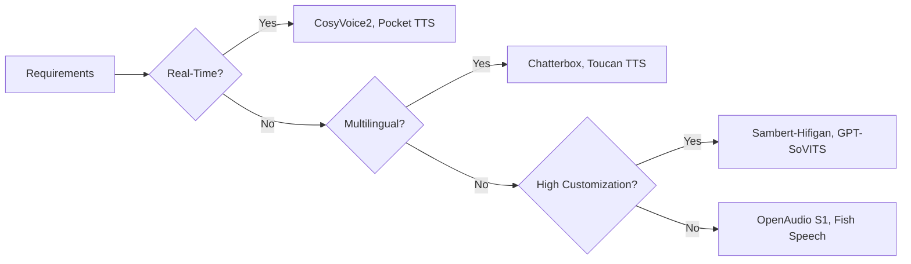

# Open-Source TTS Landscape 2026

The open-source TTS landscape has undergone profound transformation, with models now rivaling or exceeding commercial offerings in quality, flexibility, and privacy.

## Key Trends

### Emotional and Context-Aware Synthesis

Models now support fine-grained emotional control:

- **Emotion Embeddings**: Conditional embeddings inject emotional labels (Sambert-Hifigan)
- **Exaggeration Control**: Tune emotional intensity 0-1 (Chatterbox)
- **Semantic Understanding**: LLM-based models generate prosody aligned with meaning (Llasa, Qwen3-TTS)

### Efficiency and Real-Time Processing

- **Lightweight Models**: Pocket TTS (100M params) matches 10x larger models
- **Streaming Synthesis**: CosyVoice2 achieves ~150ms latency
- **Edge Optimization**: Models run on GPUs, CPUs, and mobile devices

### Multilingual and Cross-Lingual

- **Massive Language Support**: Toucan TTS supports up to 7000 languages
- **Zero-Shot Cross-Lingual**: Clone a voice in English, synthesize in Chinese
- **Dialect Handling**: Regional accents (Cantonese, Sichuanese) and code-switching

### Privacy and Local Deployment

- **On-Premise Solutions**: Sambert-Hifigan, OpenAudio S1 designed for local deployment
- **Watermarking/Detection**: Projects like Speech DF Arena detect AI-generated audio
- **Compliance**: Open-source preferred in regulated industries (finance, healthcare)

## Leading Models

| Model | Developer | Strength | License | Best For |
|-------|-----------|----------|---------|----------|
| Sambert-Hifigan | ModelScope | Multi-emotion Chinese | Apache 2.0 | Chinese SMEs |
| Chatterbox | Resemble AI | 23 languages, emotion | MIT | Global content |
| CosyVoice2-0.5B | FunAudioLLM | Streaming, 150ms | Apache 2.0 | Voice assistants |
| Fish Speech 1.5 | Fish Audio | DualAR, RLHF | CC-BY-NC-SA | Audiobooks |
| GPT-SoVITS | RVC-Boss | Fast cloning (1 min) | MIT | Virtual assistants |
| Llasa | Kyutai | LLM-based, scaling | MIT | Research |
| Qwen3-TTS | Alibaba | 10+ languages, NL control | Apache 2.0 | Enterprise |

## Emerging Models

### OpenAudio S1 (Fish Speech rebranded)

- 4B parameter flagship model
- 0.5B distilled for efficiency
- Excels in English and Japanese

### Kyutai's Moshi & Hibiki

- Speech-native dialogue systems
- Minimal latency without text conversion
- Real-time conversations

### Neuphonic's NeuTTS

- Lightweight on-device model
- Instant voice cloning
- Optimized for edge devices

## Frameworks and Tooling

### Model Frameworks

- **Coqui TTS**: 1100+ pre-trained models, Tacotron2/FastSpeech2/VITS
- **ESPnet**: End-to-end toolkit for TTS, ASR, translation
- **PaddleSpeech**: Optimized for Chinese, real-time synthesis

### Deployment Tools

- **Flask WebUIs**: Sambert-Hifigan provides ready-to-use interfaces
- **OpenTTS / Genie TTS Server**: REST APIs for model integration
- **RayAI / LocalAI**: Run TTS on consumer hardware

### Evaluation Benchmarks

- **TTS Arena**: Community-driven human preference ratings
- **EmergentTTS-Eval**: Prosody, expressiveness, language challenges
- **Speech DF Arena**: Deepfake detection evaluation

## Model Selection Guide



### Decision Factors

**Latency vs Quality**:
- Real-time (voice assistants): CosyVoice2, Chatterbox
- Offline (audiobooks): OpenAudio S1

**Language Support**:
- Chinese-only: Sambert-Hifigan, PaddleSpeech
- Multilingual: Chatterbox, Toucan TTS, Coqui TTS

**Resource Constraints**:
- Edge/low-resource: Pocket TTS, NeuTTS
- Server-grade: OpenAudio S1, Llasa

**Customization Needs**:
- Brand voices: GPT-SoVITS, Sambert-Hifigan
- General purpose: Chatterbox, CosyVoice2

## Use Cases

### Enterprise Adoption

- **Cost Efficiency**: Self-hosted saves $10K+ annually vs cloud APIs
- **Data Privacy**: On-premises for finance, healthcare
- **Customization**: Fine-tune for brand-consistent voices

### Applications

1. **Customer Service**: Empathetic, context-aware IVR
2. **Content Creation**: Audiobooks, podcasts, dubbing at scale
3. **Accessibility**: Natural screen readers for visually impaired
4. **Gaming/VR**: Real-time NPC voices with emotional responses
5. **IoT/Edge**: Voice assistants without cloud dependency

## Future Directions

### LLM-Driven Synthesis

- **Prompt-Based Editing**: "make it sound more excited"
- **Semantic Prosody**: Understands meaning (sarcasm, urgency)
- **Scaling Laws**: More compute = more naturalness

### Hyper-Optimization

- **Task-Specific Models**: Navigation, news reading optimized
- **Codec Innovation**: Neural codecs (Mimi) improve streaming
- **Hardware Acceleration**: NPUs, TPUs for lower latency

### Ethical AI

- **Deepfake Detection**: Improved benchmarks and tools
- **Watermarking**: Inaudible watermarks for origin tracing
- **Bias Mitigation**: Diverse training for fair representation

## Getting Started

### Quick Local Setup (Piper)

```bash
# Install
pip install piper-tts

# Download model
wget https://huggingface.co/rhasspy/piper-voices/resolve/main/en/en_US/lessac/medium/en_US-lessac-medium.onnx
wget https://huggingface.co/rhasspy/piper-voices/resolve/main/en/en_US/lessac/medium/en_US-lessac-medium.onnx.json

# Synthesize
echo "Hello world" | piper --model en_US-lessac-medium.onnx --output_file output.wav
```

### Coqui TTS with Voice Cloning

```python
from TTS.api import TTS

tts = TTS("tts_models/multilingual/multi-dataset/xtts_v2")

tts.tts_to_file(
    text="Clone any voice with just seconds of audio!",
    file_path="output.wav",
    speaker_wav="reference.wav",
    language="en"
)
```

## Resources

- [Coqui TTS Models](https://github.com/coqui-ai/TTS)
- [Piper Voices](https://huggingface.co/rhasspy/piper-voices)
- [CosyVoice GitHub](https://github.com/FunAudioLLM/CosyVoice)
- [Fish Speech / OpenAudio](https://fish.audio)
- [TTS Arena Leaderboard](https://huggingface.co/spaces/TTS-Arena/leaderboard)
