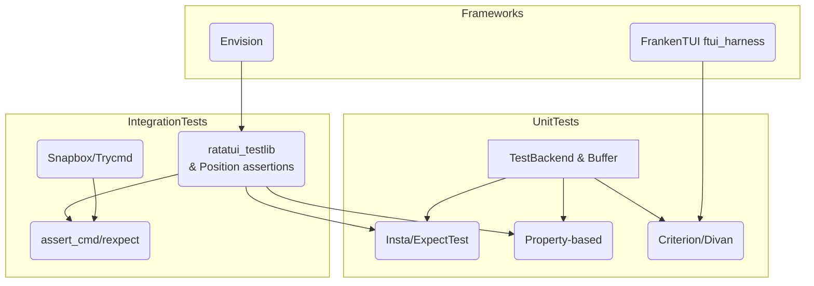

# Testing Tools for Ratatui Terminal User Interfaces

Testing Ratatui applications involves verifying how widgets render, checking state transitions when events occur, simulating real terminals, inspecting layout constraints, and guarding against regressions.  The Rust ecosystem offers a variety of crates and tools—ranging from simple buffer assertions to full‑blown integration test harnesses—that help developers write reliable TUI applications.  The table below summarises the main crates covered in this report.

| Tool / crate | Key purpose | Typical use case | Also used for |
|---|---|---|---|
| **`ratatui_testlib` (a.k.a. `terminal_testlib`)** | Integration test harness built on a pseudo‑terminal (PTY).  Provides facilities to spawn a TUI, send input, capture output, assert text/graphics positions, perform snapshot tests, integrate with `Bevy`, and run headless CI tests [oai_citation:0‡docs.rs](https://docs.rs/ratatui-testlib/latest/ratatui_testlib/#:~:text=%C2%A7Overview) [oai_citation:1‡github.com](https://github.com/raibid-labs/ratatui-testlib/blob/main/POSITION_ASSERTIONS.md#:~:text=Overview). | End‑to‑end testing of Ratatui apps with real terminal escape sequences (including sixel images), verifying complex layouts, snapshot testing and asynchronous/Bevy apps. | Any terminal application (cursive, tuikit, termwiz) since the harness is framework‑agnostic; remote control of interactive CLIs for benchmarks; verifying games. |
| **Ratatui `TestBackend` & `Buffer`** | An in‑memory backend and buffer for unit and integration tests.  Allows rendering a widget or an entire terminal to a `Buffer` and asserting on its contents (characters, colours, cursor position) [oai_citation:2‡docs.rs](https://docs.rs/ratatui/latest/ratatui/backend/struct.TestBackend.html#:~:text=A%20Backend%20implementation%20used%20for,renders%20to%20an%20memory%20buffer) [oai_citation:3‡ratatui.rs](https://ratatui.rs/tutorials/counter-app/basic-app/#:~:text=Testing%20the%20UI%20Output). | Unit tests of individual widgets or small layouts without spawning a real terminal. | Debugging and visualising widget state; also used by `crossterm` or other frameworks to create off‑screen renders. |
| **`insta` & `expect-test`** | Snap­shot testing crates.  `insta` saves snapshots to files and provides `cargo insta` CLI to review/update them [oai_citation:4‡ratatui.rs](https://ratatui.rs/recipes/testing/snapshots/#:~:text=It%E2%80%99s%20easy%20to%20use%20insta,for%20Ratatui%20apps%20and%20widgets) [oai_citation:5‡ratatui.rs](https://ratatui.rs/recipes/testing/snapshots/#:~:text=%E2%96%80%E2%96%84%E2%96%80%E2%96%88%E2%96%80%E2%96%80%E2%96%80%E2%96%80%E2%96%80%E2%96%80%E2%96%80%E2%96%80%E2%96%80%E2%96%80%E2%96%80%E2%96%80%E2%96%80%E2%96%80%E2%96%80%E2%96%80%E2%96%80), while `expect-test` stores expected output inline in code and updates via `EXPECT_TEST=1` or the `cargo expect-test` CLI [oai_citation:6‡github.com](https://github.com/raibid-labs/ratatui-testlib/blob/main/docs/TESTING_APPROACHES.md#:~:text=What%20to%20Test). | Visual regression testing for Ratatui UIs using `TestBackend` or `ratatui_testlib`. | Snapshot testing any data structures, error messages or rendered HTML; used widely in compilers, CLI tools and config file parsers. |
| **Property‑based testing (`proptest`, `quickcheck`)** | Generates random inputs (e.g., terminal sizes, key events) and verifies that certain properties always hold [oai_citation:7‡github.com](https://github.com/raibid-labs/ratatui-testlib/blob/main/docs/TESTING_APPROACHES.md#:~:text=Example). | Ensuring layouts never overflow the buffer, verifying invariants across a range of inputs (e.g., widget alignment, state updates). | Testing algorithms, data structures, parsers and mathematics; widely used in Rust. |
| **`assert_cmd` & `rexpect`** | `assert_cmd` runs a binary via `Command` and asserts on its exit status or output [oai_citation:8‡lib.rs](https://lib.rs/crates/assert_cmd#:~:text=use%20assert_cmd%3A%3ACommand%3B); `rexpect` spawns a PTY and lets you wait for patterns and send lines, useful for interactive sessions [oai_citation:9‡lib.rs](https://lib.rs/crates/rexpect#:~:text=For%20more%20examples%2C%20check%20the,examples%20directory). | Testing CLI/TUI programs’ command‑line behaviour, verifying help messages, reading/writing interactive prompts. | General CLI testing, interactive automation (SSH, FTP), controlling REPLs. |
| **`snapbox` & `trycmd`** | `snapbox` is a snapshot‑testing toolbox that can assert on function return values, CLI output, or filesystem changes and build custom harnesses [oai_citation:10‡docs.rs](https://docs.rs/snapbox/latest/snapbox/#:~:text=%C2%A7Snapshot%20testing%20toolbox).  `trycmd` builds on `snapbox` to automatically discover `.trycmd` or `.toml` test cases and run them [oai_citation:11‡docs.rs](https://docs.rs/trycmd/latest/trycmd/#:~:text=%C2%A7Getting%20Started). | Writing literate CLI tests in Markdown or TOML and snapshotting the output.  Useful for Ratatui apps that provide a CLI as well as a UI. | Testing any CLI; verifying config‑file generators; building documentation that doubles as tests. |
| **`ftui_harness` (FrankenTUI)** | Snapshot and time‑travel debugging harness for the **FrankenTUI** framework.  Captures buffer output, stores `.snap` files, and lets you replay frames for deterministic tests [oai_citation:12‡docs.rs](https://docs.rs/ftui-harness/latest/ftui_harness/#:~:text=Snapshot%2Fgolden%20testing%20and%20time,for%20FrankenTUI). | Testing FrankenTUI widgets and runtime; verifying determinism and performance. | The harness integrates with **FrankenTUI** components rather than Ratatui, but the snapshot technique is similar. |
| **`envision`** | Ratatui framework with headless testing support.  Provides a `CaptureBackend` for rendering to memory, a `Runtime` for event-driven TEA apps, a `TestHarness` for assertions, and facilities to simulate input and produce JSON/ANSI snapshots [oai_citation:13‡lib.rs](https://lib.rs/crates/envision#:~:text=A%20ratatui%20framework%20for%20collaborative,development%20with%20headless%20testing%20support) [oai_citation:14‡lib.rs](https://lib.rs/crates/envision#:~:text=Testing%20with%20Runtime). | Developing TEA‑style TUIs with built‑in testing, capturing headless output and verifying that messages update state correctly. | A full application framework that can be used to build collaborative TUIs; also supports asynchronous commands and widget annotations. |
| **Benchmarking crates (`criterion`, `divan`)** | `criterion` and the newer `divan` help measure and compare performance.  They repeatedly run a function, measure run time, and provide statistical reports.  `divan` integrates with `cargo test` for simple benchmarking. | Measuring render performance of Ratatui widgets or event loops, detecting regressions in complex layouts [oai_citation:15‡github.com](https://github.com/raibid-labs/ratatui-testlib/blob/main/docs/TESTING_APPROACHES.md#:~:text=For%20Widget%20Libraries). | Benchmarking any Rust code (cryptography, algorithms); used widely beyond TUI. |

## Integration Test Harness: `ratatui_testlib` / `terminal_testlib`

`ratatui_testlib` wraps a pseudo‑terminal (PTY) around your application to test it as if it were running in a real terminal.  Features include:

- **Real terminal escape handling** – tests exercise the same crossterm/ANSI escape sequences that users see; this is essential for verifying cursor movement, colours, and Sixel graphics [oai_citation:16‡github.com](https://github.com/raibid-labs/ratatui-testlib#:~:text=Overview).
- **Sixel and graphics support** – optional feature for capturing Sixel images and asserting them via the harness [oai_citation:17‡github.com](https://github.com/raibid-labs/ratatui-testlib#:~:text=Overview).
- **Bevy ECS integration** – spawn a Bevy game/app and drive it through events.
- **Asynchronous tests** – optional `async-tokio` feature spawns your TUI in an async context and lets you `await` output or events [oai_citation:18‡docs.rs](https://docs.rs/ratatui-testlib/latest/ratatui_testlib/#:~:text=%C2%A7Overview).
- **Snapshot testing** – integrates with `insta` to capture the screen buffer and compare it to a golden snapshot; a `headless` feature makes it run in CI without a real terminal [oai_citation:19‡docs.rs](https://docs.rs/ratatui-testlib/latest/ratatui_testlib/#:~:text=%C2%A7Overview).
- **Position assertions** – API for asserting that text appears at a specific coordinate, within a rectangle or that areas do not overlap.  Methods such as `assert_text_at_position`, `assert_text_within_bounds`, `assert_no_overlap` and `assert_aligned` help verify complex layouts [oai_citation:20‡github.com](https://github.com/raibid-labs/ratatui-testlib/blob/main/POSITION_ASSERTIONS.md#:~:text=Overview).
- **Reusable harness** – you can send keys, text or mouse events, wait for specific screen states, and capture the final buffer for assertions.  It is framework‑agnostic and works with any TUI library.

### Code example
Below is a simplified example that uses `ratatui_testlib` to test a counter app.  It spawns the app in a PTY, sends key presses, waits for the screen to update, and asserts on the output.  The harness handles curses/ANSI escapes for you:

```rust
use ratatui_testlib::{TuiTestHarness, UserEvent};
use ratatui::prelude::*;

fn spawn_app() -> impl FnOnce() -> ! {
    // Your app that increments the counter on "+"
    move || {
        // Setup terminal and event loop (omitted)
    }
}

#[test]
fn increments_counter() -> anyhow::Result<()> {
    // Create a headless terminal of size 80×24
    let mut harness = TuiTestHarness::new(80, 24)?;

    // Spawn the app inside a PTY
    harness.spawn(spawn_app())?;

    // Wait for the initial render and assert the counter is zero
    harness.wait_for(|buf| buf.contains("Count: 0"))?;

    // Simulate pressing the "+" key twice
    harness.send_text("++");

    // Wait until the UI updates to show 2
    harness.wait_for(|buf| buf.contains("Count: 2"))?;

    // Assert the text appears exactly at row 0, column 0
    harness.assert_text_at_position("Count: 2", 0, 0)?;

    Ok(())
}
```

The harness can also perform layout assertions:

```rust
use ratatui_testlib::{Rect, Axis};
#[test]
fn layout_has_no_overlap() -> anyhow::Result<()> {
    let harness = TuiTestHarness::new(80, 24)?;
    // define areas for header, sidebar and content
    let header = Rect::new(0, 0, 80, 2);
    let sidebar = Rect::new(0, 2, 20, 20);
    let content = Rect::new(20, 2, 60, 20);
    // verify there is no overlap and proper alignment
    harness.assert_no_overlap(sidebar, content)?;
    harness.assert_aligned(sidebar, content, Axis::Horizontal)?;
    Ok(())
}
```

`ratatui_testlib` is still evolving; its documentation and examples live on **docs.rs** and the GitHub repository.  It is not limited to Ratatui—any terminal app can be tested because the harness interacts at the PTY level.

## In‑Memory Testing with Ratatui

### TestBackend and Buffer

For unit and small integration tests, Ratatui provides an in‑memory backend (`TestBackend`) and a `Buffer` type.  You create a `Terminal` with a `TestBackend`, render widgets into it, and then inspect the buffer for expected characters, colours and cursor positions.  The API includes convenience methods like `assert_buffer`, `assert_buffer_lines` and `assert_cursor_position` [oai_citation:21‡docs.rs](https://docs.rs/ratatui/latest/ratatui/backend/struct.TestBackend.html#:~:text=A%20Backend%20implementation%20used%20for,renders%20to%20an%20memory%20buffer).

#### Example: verifying a progress bar

```rust
use ratatui::{widgets::{Gauge, Block, Borders}, Terminal, backend::TestBackend, layout::Rect};

#[test]
fn gauge_renders_full_bar() -> anyhow::Result<()> {
    let backend = TestBackend::new(20, 3);    // 20×3 terminal
    let mut terminal = Terminal::new(backend)?;

    terminal.draw(|f| {
        let area = Rect::new(0, 0, 20, 3);
        let gauge = Gauge::default().block(Block::default().borders(Borders::ALL))
                         .gauge_style(ratatui::style::Style::default())
                         .ratio(1.0);
        f.render_widget(gauge, area);
    })?;

    let backend = terminal.backend();
    // assert that the first line equals "┌──────────────────┐"
    backend.assert_buffer_lines(&[... ELLIPSIZATION ...]and compare it with the result of rendering your widget [oai_citation:22‡ratatui.rs](https://ratatui.rs/tutorials/counter-app/basic-app/#:~:text=Testing%20the%20UI%20Output).  For event handling tests, you call your event handler with simulated `KeyEvent`s and assert on the application state [oai_citation:23‡ratatui.rs](https://ratatui.rs/tutorials/counter-app/basic-app/#:~:text=).

### Debugging widget state

When unit tests fail, it can be helpful to inspect intermediate widget state.  Ratatui’s **Debugging Widget State** recipe demonstrates rendering debug text or toggling debug information on screen; this is less a testing tool and more a technique for visualising state [oai_citation:24‡ratatui.rs](https://ratatui.rs/recipes/testing/debug-widget-state/#:~:text=Debugging%20widget%20state%20in%20a,logger).

## Snapshot Testing

### Using `insta` with Ratatui

Snapshot tests capture the rendered output of a widget or terminal once and compare it to future renders.  Ratatui’s documentation shows how to use `insta` with `TestBackend`: you add `insta` as a dev‑dependency, create a test that renders your UI, and call `assert_snapshot!` with the backend [oai_citation:25‡ratatui.rs](https://ratatui.rs/recipes/testing/snapshots/#:~:text=It%E2%80%99s%20easy%20to%20use%20insta,for%20Ratatui%20apps%20and%20widgets).  Running `cargo insta` will create snapshot files; subsequent test runs will compare against them and fail if they differ.  You update snapshots with `cargo insta review` or by setting the `INSTA_UPDATE=always` environment variable [oai_citation:26‡ratatui.rs](https://ratatui.rs/recipes/testing/snapshots/#:~:text=%E2%96%80%E2%96%84%E2%96%80%E2%96%88%E2%96%80%E2%96%80%E2%96%80%E2%96%80%E2%96%80%E2%96%80%E2%96%80%E2%96%80%E2%96%80%E2%96%80%E2%96%80%E2%96%80%E2%96%80%E2%96%80%E2%96%80%E2%96%80%E2%96%80).  This approach is useful for complex UIs where writing explicit assertions is tedious.

#### Code example

```rust
use ratatui::{Terminal, backend::TestBackend, widgets::Paragraph};
use insta::assert_snapshot;

#[test]
fn snapshot_paragraph() {
    let backend = TestBackend::new(20, 1);
    let mut term = Terminal::new(backend).unwrap();
    term.draw(|f| {
        f.render_widget(Paragraph::new("Hello world"), f.size());
    }).unwrap();
    assert_snapshot!(term.backend());
}
```

The `insta` crate stores each snapshot under `tests/snapshots/`.  Snapshots include the buffer content; colour information is currently not recorded by Ratatui’s `TestBackend` [oai_citation:27‡ratatui.rs](https://ratatui.rs/recipes/testing/snapshots/#:~:text=%E2%96%80%E2%96%84%E2%96%80%E2%96%88%E2%96%80%E2%96%80%E2%96%80%E2%96%80%E2%96%80%E2%96%80%E2%96%80%E2%96%80%E2%96%80%E2%96%80%E2%96%80%E2%96%80%E2%96%80%E2%96%80%E2%96%80%E2%96%80%E2%96%80).  `insta` can snapshot anything (strings, JSON, DOM), so it is widely used in other domains (e.g., compilers, code formatters).

### Inline snapshots with `expect-test`

`expect-test` offers inline snapshots through the `expect!` macro.  The snapshot text resides in the test file itself.  The Ratatui testing approaches document shows using `expect!` to assert on a table widget: you write `let buf = render_table(); expect![r###"\nexpected lines"###].assert_eq(&buf.to_string());` and update the snapshot by running `cargo expand` or the provided CLI [oai_citation:28‡github.com](https://github.com/raibid-labs/ratatui-testlib/blob/main/docs/TESTING_APPROACHES.md#:~:text=What%20to%20Test).  Inline snapshots make tests more self‑contained but can clutter your code; they are also general‑purpose and used in compilers (e.g., rustc’s tests).

## Property‑Based Testing

Property‑based testing ensures properties hold for a wide range of inputs instead of a few examples.  The testing approaches document uses `proptest` to generate random terminal sizes and verify that a responsive layout always fits in the buffer [oai_citation:29‡github.com](https://github.com/raibid-labs/ratatui-testlib/blob/main/docs/TESTING_APPROACHES.md#:~:text=Example):

```rust
use proptest::prelude::*;
use ratatui::{backend::TestBackend, Terminal};

proptest! {
    #[test]
    fn layout_fits_random_size(width in 1u16..100, height in 1u16..50) {
        let backend = TestBackend::new(width, height);
        let mut term = Terminal::new(backend).unwrap();
        term.draw(|f| { /* render responsive layout */ }).unwrap();
        let buf = term.backend().buffer();
        for cell in buf.iter() {
            // verify nothing is rendered outside the width/height
            prop_assert!(cell.x < width && cell.y < height);
        }
    }
}
```

The same pattern works with `quickcheck`.  Outside of Ratatui, property‑based testing is useful for verifying data structures, parsers, cryptographic functions, and more.

## CLI & Interactive Testing Tools

### `assert_cmd` and `rexpect`

`assert_cmd` simplifies running a binary under test and asserting on its exit status or stdout/stderr.  A minimal example spawns the application using `Command::cargo_bin` and checks that it succeeds [oai_citation:30‡lib.rs](https://lib.rs/crates/assert_cmd#:~:text=use%20assert_cmd%3A%3ACommand%3B):

```rust
use assert_cmd::Command;
#[test]
fn runs_help() {
    let mut cmd = Command::cargo_bin("myapp").unwrap();
    cmd.arg("--help").assert().success();
}
```

This is particularly useful for Ratatui apps that have command‑line flags or subcommands separate from the UI.

`rexpect` (a Rust port of `expect`) allows automating interactive sessions over a PTY.  You can wait for prompts, send input, and assert on output patterns.  The example from its documentation spawns an FTP client and interacts with it [oai_citation:31‡lib.rs](https://lib.rs/crates/rexpect#:~:text=For%20more%20examples%2C%20check%20the,examples%20directory); for a Ratatui app you could wait for specific UI text and then send keystrokes.  `rexpect` is also used in scripts to automate SSH or REPL sessions.

### `snapbox` and `trycmd` for CLI snapshots

`snapbox` is a snapshot‑testing toolbox that can assert on function output, command output or filesystem changes.  It includes macros such as `assert_data_eq!` to quickly snapshot data, and modules like `cmd::Command` to run non‑interactive commands [oai_citation:32‡docs.rs](https://docs.rs/snapbox/latest/snapbox/#:~:text=%C2%A7Snapshot%20testing%20toolbox).  `trycmd` builds on `snapbox` to automatically discover test cases described in `.trycmd` or `.toml` files, run each command, and compare their outputs with saved snapshots [oai_citation:33‡docs.rs](https://docs.rs/trycmd/latest/trycmd/#:~:text=%C2%A7Getting%20Started).  This approach is convenient when your Ratatui app also offers CLI subcommands: you can write literate test cases in Markdown, run them with `cargo test`, and update snapshots with environment variables (`TRYCMD=dump` or `TRYCMD=overwrite`) [oai_citation:34‡docs.rs](https://docs.rs/trycmd/latest/trycmd/#:~:text=To%20generate%20snapshots%2C%20run).

## Other Testing and Development Frameworks

### `ftui_harness` (FrankenTUI)

FrankenTUI is another TUI framework that uses its own rendering pipeline.  Its `ftui_harness` crate provides snapshot testing and time‑travel debugging: you render your widget into a `Buffer`, call `assert_snapshot!` to compare it to a saved `.snap` file, and update the snapshot by running tests with the `BLESS=1` environment variable [oai_citation:35‡docs.rs](https://docs.rs/ftui-harness/latest/ftui_harness/#:~:text=Snapshot%2Fgolden%20testing%20and%20time,for%20FrankenTUI).  It also records compressed frame snapshots that you can inspect step‑by‑step to debug state changes.  Although `ftui_harness` targets FrankenTUI, the underlying concepts of snapshot testing and deterministic rendering may inspire similar approaches for Ratatui.

### `envision` – TEA‑style framework with headless testing

`envision` is a new framework built on top of Ratatui that adopts the Elm Architecture (TEA).  It provides a library of reusable components, a runtime for dispatching messages and subscriptions, and headless testing support.  Key testing features include a `CaptureBackend` for rendering without a terminal, a `Runtime::virtual_terminal` that allows dispatching messages and asserting that specific text appears, and a `TestHarness` for custom renders [oai_citation:36‡lib.rs](https://lib.rs/crates/envision#:~:text=A%20ratatui%20framework%20for%20collaborative,development%20with%20headless%20testing%20support) [oai_citation:37‡lib.rs](https://lib.rs/crates/envision#:~:text=Testing%20with%20Runtime).  Because testing is built in, `envision` promotes test‑driven development.  Outside of testing, it offers a component library, asynchronous operations, widget annotations for accessibility, and multiple output formats (JSON/ANSI), making it a full application framework rather than just a harness.

### Benchmarking with `criterion` and `divan`

Performance matters for interactive TUIs.  The Ratatui testing approaches recommend using benchmarking crates like `criterion` or `divan` to detect performance regressions [oai_citation:38‡github.com](https://github.com/raibid-labs/ratatui-testlib/blob/main/docs/TESTING_APPROACHES.md#:~:text=For%20Widget%20Libraries).  `criterion` statistically measures execution time and plots results; `divan` is a lighter alternative that integrates with `cargo test`.  To benchmark rendering performance of a widget, wrap the rendering code in a `criterion::Bencher` or annotate functions with `#[divan::bench]` and run `cargo bench`.  These crates are widely used for performance analysis across the Rust ecosystem.

## Visual overview

Below is a Mermaid diagram that categorises the discussed tools.  Nodes are grouped by test type, and edges indicate typical flow for testing a Ratatui TUI.



The left block shows unit‑level tools (buffer assertions, snapshots, property‑based tests, benchmarking).  The middle block shows integration‑level tools (full PTY harness, CLI and interactive testing).  The right block shows frameworks that come with their own test harnesses or headless backends.  The arrows represent typical dependencies; for example, `ratatui_testlib` uses `TestBackend` internally and can integrate with `insta` or property‑based generators.

## Conclusion

The Rust ecosystem provides a rich toolbox for testing Ratatui‑based terminal applications.  For unit tests and simple widget checks, **`TestBackend`** and **`Buffer`** from Ratatui suffice.  For end‑to‑end behaviour, **`ratatui_testlib`** offers a full pseudo‑terminal harness with PTY‑level fidelity, supporting asynchronous and graphics‑heavy UIs.  To guard against regressions, use **snapshot testing** via **`insta`**, **`expect-test`**, or CLI‑focused tools like **`snapbox`** and **`trycmd`**.  **Property‑based testing** with `proptest` or `quickcheck` helps validate invariants across many inputs, while **`assert_cmd`** and **`rexpect`** test command‑line and interactive behaviour.  Frameworks such as **FrankenTUI** and **Envision** provide their own harnesses for those ecosystems.  Lastly, **benchmarking crates** like `criterion` or `divan` ensure that your TUI remains responsive as it grows in complexity.  By combining these tools, developers can achieve high confidence in both the correctness and performance of their Ratatui applications.
