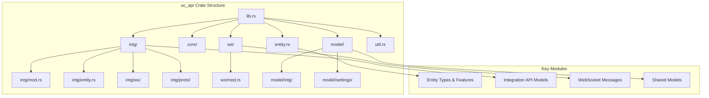
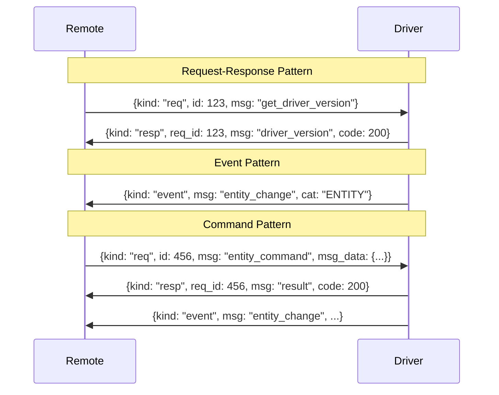

# Deep Dive: `api-model-rs` Crate for Unfolded Circle Integration Drivers

## Introduction

The `api-model-rs` crate (published as `uc_api` on crates.io) provides Rust data models for building Integration Drivers for the Unfolded Circle Remote Two/3 universal remote control. This crate is developed by Unfolded Circle and serves as the official Rust API model library for creating drivers that allow the remote to interact with various devices and services.

The crate provides structs and enums that represent the data structures defined in the Unfolded Circle WebSocket Integration API. While the models are manually defined rather than auto-generated from AsyncAPI specifications, they are maintained by the Unfolded Circle team and used in their own products, ensuring they stay up-to-date with the official API specifications.

## Repository & Crate Information

| Property                 | Value                                                        |
| ------------------------ | ------------------------------------------------------------ |
| **GitHub Repository**    | [unfoldedcircle/api-model-rs](https://github.com/unfoldedcircle/api-model-rs) |
| **Crate Name**           | `uc_api`                                                     |
| **Current Version**      | 0.16.0                                                       |
| **License**              | Apache-2.0                                                   |
| **Minimum Rust Version** | 1.85                                                         |
| **Edition**              | 2024                                                         |

### Adding to Your Project

```toml
# Cargo.toml
[dependencies]
uc_api = "0.16"
```

## Architecture Overview



## Core Concepts

### What is an Integration Driver?

An Integration Driver is a WebSocket server that bridges the Unfolded Circle Remote with external devices or services. The remote connects to the driver and exchanges JSON messages over WebSocket to:

1. **Discover entities** - Learn what devices and capabilities are available
2. **Subscribe to events** - Receive real-time state updates
3. **Execute commands** - Control devices through the remote
4. **Handle setup flows** - Configure the integration through a user-friendly process

### Driver Types

```rust
/// Integration driver type.
#[derive(Debug, Clone, Copy, Display, EnumString, PartialEq, Eq, Deserialize, Serialize)]
#[strum(serialize_all = "SCREAMING_SNAKE_CASE")]
#[serde(rename_all = "SCREAMING_SNAKE_CASE")]
pub enum DriverType {
    /// Pre-installed integration in the firmware.
    Local,
    /// External integration on the network.
    External,
    /// Custom installed integration on the remote.
    Custom,
}
```

| Type       | Description               | Use Case                                          |
| ---------- | ------------------------- | ------------------------------------------------- |
| `Local`    | Pre-installed in firmware | Built-in integrations shipped with the device     |
| `External` | Runs on external device   | Network-accessible drivers (e.g., Home Assistant) |
| `Custom`   | User-installed on remote  | Third-party drivers installed by users            |

### Single vs Multi-Device Drivers

The API supports two driver architectures:

**Single Device Instance Driver (Recommended)**:

- Provides a flat list of entities
- No `device_id` required in messages
- Simpler to implement
- Example: A driver exposing multiple smart bulbs as individual light entities

**Multi-Device Instance Driver (Not Yet Fully Supported)**:

- Supports device discovery
- Requires `device_id` in all messages
- More complex state management

## Supported Entity Types

The crate defines comprehensive entity types that map to real-world devices and services:

```rust
#[derive(Debug, Clone, Copy, PartialEq, Eq, Serialize, Deserialize)]
#[serde(rename_all = "snake_case")]
pub enum EntityType {
    Button,
    Switch,
    Climate,
    Cover,
    Light,
    MediaPlayer,
    Sensor,
    Activity,    // Internal entity
    Macro,       // Internal entity
    Remote,
    IrEmitter,
    Select,
    VoiceAssistant,
}
```

### Entity Features by Type

Each entity type supports specific features that define its capabilities:

#### Button Entity

```rust
pub enum ButtonFeature {
    Press,
}

pub enum ButtonCommand {
    Push,
}

pub enum ButtonAttribute {
    State,
}
```

#### Switch Entity

```rust
pub enum SwitchFeature {
    OnOff,
    Toggle,
}

pub enum SwitchCommand {
    On,
    Off,
    Toggle,
}

pub enum SwitchDeviceClass {
    Outlet,
    Switch,
}
```

#### Light Entity

```rust
pub enum LightFeature {
    OnOff,
    Toggle,
    Dim,
    Color,
    ColorTemperature,
}

pub enum LightCommand {
    On,
    Off,
    Toggle,
}

pub enum LightAttribute {
    State,
    Hue,
    Saturation,
    Brightness,
    ColorTemperature,
}
```

#### Media Player Entity

The media player entity is the most feature-rich, supporting comprehensive playback controls:

```rust
pub enum MediaPlayerFeature {
    OnOff,
    Toggle,
    Volume,
    VolumeUpDown,
    MuteToggle,
    Mute,
    Unmute,
    PlayPause,
    Stop,
    Next,
    Previous,
    FastForward,
    Rewind,
    Repeat,
    Shuffle,
    Seek,
    MediaDuration,
    MediaPosition,
    MediaTitle,
    MediaArtist,
    MediaAlbum,
    MediaImageUrl,
    MediaType,
    DPad,              // Directional pad navigation
    Numpad,            // Number pad
    Home,              // Home navigation
    Menu,              // Menu navigation
    ContextMenu,
    Guide,
    Info,
    ColorButtons,      // Red, Green, Yellow, Blue
    ChannelSwitcher,
    SelectSource,
    SelectSoundMode,
    Eject,
    OpenClose,
    AudioTrack,
    Subtitle,
    Record,
    Settings,
}
```

#### Climate Entity

```rust
pub enum ClimateFeature {
    OnOff,
    Heat,
    Cool,
    CurrentTemperature,
    TargetTemperature,
}

pub enum ClimateCommand {
    On,
    Off,
    HvacMode,
    TargetTemperature,
}
```

#### Cover Entity

```rust
pub enum CoverFeature {
    Open,
    Close,
    Stop,
    Position,
}

pub enum CoverDeviceClass {
    Blind,
    Curtain,
    Garage,
    Shade,
}
```

#### Sensor Entity

```rust
pub enum SensorDeviceClass {
    Custom,
    Battery,
    Current,
    Energy,
    Humidity,
    Power,
    Temperature,
    Voltage,
    Binary,
}
```

## WebSocket Message Protocol

The Integration API uses a request-response-event message pattern over WebSocket. All messages are JSON-encoded text messages.

### Message Types



### Message Structures

#### Request Message

```rust
#[derive(Debug, Clone, Deserialize, Serialize)]
pub struct WsRequest {
    /// Request message identifier: `req`
    pub kind: String,
    /// Request ID which must be increased for every new request.
    pub id: u32,
    /// One of the defined API request message types.
    pub msg: String,
    /// Message specific payload.
    #[serde(skip_serializing_if = "Option::is_none")]
    pub msg_data: Option<Value>,
}
```

**Example JSON:**

```json
{
  "kind": "req",
  "id": 123,
  "msg": "entity_command",
  "msg_data": {
    "entity_type": "button",
    "entity_id": "button-1",
    "cmd_id": "push"
  }
}
```

#### Response Message

```rust
#[derive(Debug, Clone, Deserialize, Serialize)]
pub struct WsResponse {
    /// Response message identifier: `resp`
    pub kind: String,
    /// Corresponding request ID.
    pub req_id: u32,
    /// One of the defined API response message types.
    pub msg: String,
    /// Response code (HTTP status codes).
    pub code: u16,
    /// Message specific payload.
    #[serde(skip_serializing_if = "Option::is_none")]
    pub msg_data: Option<Value>,
}
```

**Example JSON:**

```json
{
  "kind": "resp",
  "req_id": 123,
  "msg": "result",
  "code": 200,
  "msg_data": {
    "code": "OK",
    "message": "Command executed"
  }
}
```

#### Event Message

```rust
#[derive(Debug, Clone, Default, Deserialize, Serialize)]
pub struct WsMessage {
    pub kind: Option<String>,
    pub id: Option<u32>,
    pub req_id: Option<u32>,
    pub msg: Option<String>,
    pub code: Option<u16>,
    pub cat: Option<EventCategory>,
    pub ts: Option<DateTime<Utc>>,
    pub msg_data: Option<Value>,
}
```

**Example JSON:**

```json
{
  "kind": "event",
  "msg": "entity_change",
  "cat": "ENTITY",
  "ts": "2024-04-24T14:15:22Z",
  "msg_data": {
    "entity_type": "cover",
    "entity_id": "blind-1",
    "attributes": {
      "position": 72
    }
  }
}
```

### Event Categories

```rust
#[derive(Debug, Clone, Copy, PartialEq, Eq, Deserialize, Serialize)]
#[serde(rename_all = "SCREAMING_SNAKE_CASE")]
pub enum EventCategory {
    Device,
    Entity,
    Remote,
    Ui,
}
```

## Required Messages for Integration Drivers

Not all API messages need to be implemented. The following are mandatory:

### Request Messages (Remote → Driver)

| Request                  | Response             | Description                             |
| ------------------------ | -------------------- | --------------------------------------- |
| `get_driver_version`     | `driver_version`     | Returns driver and API version info     |
| `get_device_state`       | `device_state`       | Returns current device connection state |
| `get_available_entities` | `available_entities` | Lists all available entities            |
| `subscribe_events`       | `result`             | Subscribe to entity state changes       |
| `get_entity_states`      | `entity_states`      | Get current states of entities          |
| `entity_command`         | `result`             | Execute an entity command               |

### Event Messages (Driver → Remote)

| Event           | Description                           |
| --------------- | ------------------------------------- |
| `entity_change` | Emitted when entity attributes change |
| `device_state`  | Emitted when device state changes     |

## Integration API Message Types

### Remote-to-Driver Requests

```rust
#[derive(Debug, Clone, Copy, PartialEq, Eq, Serialize, Deserialize)]
#[serde(rename_all = "snake_case")]
pub enum R2Request {
    GetDriverVersion,
    GetDeviceState,
    GetAvailableEntities,
    SubscribeEvents,
    UnsubscribeEvents,
    GetEntityStates,
    EntityCommand,
    GetDriverMetadata,
    SetupDriver,
    SetDriverUserData,
}
```

### Driver-to-Remote Events

```rust
#[derive(Debug, Clone, Copy, PartialEq, Eq, Serialize, Deserialize)]
#[serde(rename_all = "snake_case")]
pub enum DriverEvent {
    AuthRequired,
    DeviceState,
    EntityChange,
    EntityAvailable,
    EntityRemoved,
    DriverSetupChange,
    AssistantEvent,
}
```

### Remote-to-Driver Events

```rust
#[derive(Debug, Clone, Copy, PartialEq, Eq, Serialize, Deserialize)]
#[serde(rename_all = "snake_case")]
pub enum R2Event {
    Connect,
    Disconnect,
    EnterStandby,
    ExitStandby,
    AbortDriverSetup,
    Oauth2Authorization,
    Oauth2Refreshed,
}
```

## Building an Integration Driver

### Project Setup

```toml
# Cargo.toml
[package]
name = "my-integration-driver"
version = "0.1.0"
edition = "2024"

[dependencies]
uc_api = "0.16"
tokio = { version = "1", features = ["full"] }
tokio-tungstenite = "0.26"
serde = { version = "1", features = ["derive"] }
serde_json = "1"
tracing = "0.1"
tracing-subscriber = "0.3"
```

### Basic Driver Structure

```rust
use uc_api::{
    EntityType,
    intg::{
        AvailableIntgEntity,
        DeviceState,
        IntegrationVersion,
        ws::{R2Request, DriverResponse, DriverEvent},
    },
    ws::{WsMessage, WsRequest, WsResponse, EventCategory},
};
use serde_json::json;
use std::collections::HashMap;

/// Driver metadata and state
struct MyDriver {
    entities: Vec<AvailableIntgEntity>,
    state: DeviceState,
    request_id: u32,
}

impl MyDriver {
    fn new() -> Self {
        Self {
            entities: Self::create_entities(),
            state: DeviceState::Connected,
            request_id: 0,
        }
    }

    fn create_entities() -> Vec<AvailableIntgEntity> {
        let mut name = HashMap::new();
        name.insert("en".to_string(), "Living Room Light".to_string());

        vec![
            AvailableIntgEntity {
                entity_id: "light_1".to_string(),
                device_id: None,
                entity_type: EntityType::Light,
                device_class: None,
                name,
                icon: Some("light".to_string()),
                features: Some(vec![
                    "on_off".to_string(),
                    "toggle".to_string(),
                    "dim".to_string(),
                ]),
                area: Some("Living Room".to_string()),
                options: None,
                attributes: None,
            }
        ]
    }

    fn next_request_id(&mut self) -> u32 {
        self.request_id += 1;
        self.request_id
    }

    /// Handle incoming WebSocket request from Remote
    async fn handle_request(&mut self, request: WsRequest) -> WsResponse {
        match request.msg.as_str() {
            "get_driver_version" => {
                let version = IntegrationVersion {
                    api: Some("0.16.0".to_string()),
                    driver: Some(env!("CARGO_PKG_VERSION").to_string()),
                };
                WsResponse::new(
                    request.id,
                    DriverResponse::DriverVersion.as_ref(),
                    version,
                )
            }

            "get_device_state" => {
                // Return current device state as event
                WsResponse::new(
                    request.id,
                    "device_state",
                    json!({ "state": self.state }),
                )
            }

            "get_available_entities" => {
                WsResponse::new(
                    request.id,
                    DriverResponse::AvailableEntities.as_ref(),
                    json!({
                        "available_entities": self.entities
                    }),
                )
            }

            "subscribe_events" => {
                // Store subscription state
                WsResponse::result(request.id, 200)
            }

            "entity_command" => {
                self.handle_entity_command(&request).await
            }

            _ => WsResponse::error(
                request.id,
                400,
                uc_api::ws::WsResultMsgData::new("UNKNOWN_MESSAGE", "Unknown message type"),
            ),
        }
    }

    async fn handle_entity_command(&mut self, request: &WsRequest) -> WsResponse {
        // Parse and execute command
        WsResponse::result(request.id, 200)
    }

    /// Create entity change event
    fn create_entity_change_event(
        &self,
        entity_id: &str,
        entity_type: EntityType,
        attributes: serde_json::Map<String, serde_json::Value>,
    ) -> WsMessage {
        WsMessage::event(
            DriverEvent::EntityChange.as_ref(),
            EventCategory::Entity,
            json!({
                "entity_id": entity_id,
                "entity_type": entity_type,
                "attributes": attributes,
            }),
        )
    }

    /// Create device state event
    fn create_device_state_event(&self, state: DeviceState) -> WsMessage {
        WsMessage::event(
            DriverEvent::DeviceState.as_ref(),
            EventCategory::Device,
            json!({ "state": state }),
        )
    }
}
```

### WebSocket Server Setup

```rust
use tokio::net::TcpListener;
use tokio_tungstenite::accept_async;
use futures::{SinkExt, StreamExt};

async fn run_driver() -> Result<(), Box<dyn std::error::Error>> {
    let listener = TcpListener::bind("0.0.0.0:8080").await?;
    
    loop {
        let (stream, _) = listener.accept().await?;
        let ws_stream = accept_async(stream).await?;
        
        let (mut ws_sender, mut ws_receiver) = ws_stream.split();
        let mut driver = MyDriver::new();
        
        // Handle messages
        while let Some(msg) = ws_receiver.next().await {
            match msg {
                Ok(tokio_tungstenite::tungstenite::Message::Text(text)) => {
                    let request: WsRequest = serde_json::from_str(&text)?;
                    let response = driver.handle_request(request).await;
                    let response_json = serde_json::to_string(&response)?;
                    ws_sender.send(
                        tokio_tungstenite::tungstenite::Message::Text(response_json)
                    ).await?;
                }
                Ok(tokio_tungstenite::tungstenite::Message::Ping(data)) => {
                    ws_sender.send(
                        tokio_tungstenite::tungstenite::Message::Pong(data)
                    ).await?;
                }
                Ok(tokio_tungstenite::tungstenite::Message::Close(_)) => {
                    break;
                }
                _ => {}
            }
        }
    }
}

#[tokio::main]
async fn main() -> Result<(), Box<dyn std::error::Error>> {
    tracing_subscriber::fmt::init();
    run_driver().await
}
```

## Entity Command Handling

### Command Structure

```rust
#[derive(Debug, Clone, Deserialize, Serialize)]
pub struct EntityCommand {
    pub device_id: Option<String>,
    pub entity_type: EntityType,
    pub entity_id: String,
    pub cmd_id: String,
    pub params: Option<serde_json::Map<String, Value>>,
}
```

### Command Processing Example

```rust
async fn handle_entity_command(
    &mut self,
    request: &WsRequest,
) -> WsResponse {
    let msg_data = match &request.msg_data {
        Some(data) => data,
        None => return WsResponse::missing_field(request.id, "msg_data"),
    };

    let cmd: EntityCommand = match serde_json::from_value(msg_data.clone()) {
        Ok(cmd) => cmd,
        Err(e) => return WsResponse::error(
            request.id,
            400,
            uc_api::ws::WsResultMsgData::new("INVALID_DATA", &e.to_string()),
        ),
    };

    // Execute command based on entity type and command
    let result = match cmd.entity_type {
        EntityType::Light => self.handle_light_command(&cmd).await,
        EntityType::Switch => self.handle_switch_command(&cmd).await,
        EntityType::MediaPlayer => self.handle_media_command(&cmd).await,
        _ => Err("Unsupported entity type"),
    };

    match result {
        Ok(_) => WsResponse::result(request.id, 200),
        Err(e) => WsResponse::error(
            request.id,
            500,
            uc_api::ws::WsResultMsgData::new("COMMAND_FAILED", e),
        ),
    }
}
```

## State Management

### Entity Change Events

```rust
#[derive(Debug, Clone, Deserialize, Serialize)]
pub struct EntityChange {
    pub device_id: Option<String>,
    pub entity_type: EntityType,
    pub entity_id: String,
    pub attributes: serde_json::Map<String, Value>,
}
```

### Broadcasting State Changes

```rust
impl MyDriver {
    /// Called when a light's state changes
    async fn on_light_state_changed(
        &mut self,
        entity_id: &str,
        is_on: bool,
        brightness: Option<u8>,
    ) {
        let mut attributes = serde_json::Map::new();
        attributes.insert("state".to_string(), json!(if is_on { "ON" } else { "OFF" }));
        
        if let Some(b) = brightness {
            attributes.insert("brightness".to_string(), json!(b));
        }

        let event = EntityChange {
            device_id: None,
            entity_type: EntityType::Light,
            entity_id: entity_id.to_string(),
            attributes,
        };

        // Send to all subscribed remotes
        self.broadcast_event(DriverEvent::EntityChange, event).await;
    }
}
```

## Driver Setup Flow

The driver setup flow allows users to configure the integration through the Remote's web configurator.

### Setup Data Schema

```rust
#[derive(Debug, Clone, Deserialize, Serialize)]
pub struct SetupDriver {
    pub reconfigure: Option<bool>,
    pub setup_data: HashMap<String, String>,
}
```

### Setup State Machine

```rust
use uc_api::model::intg::{
    IntegrationSetupState,
    IntegrationSetupError,
    RequireUserAction,
    SetupChangeEventType,
};

#[derive(Debug, Clone, Deserialize, Serialize)]
pub struct DriverSetupChange {
    pub event_type: SetupChangeEventType,
    pub state: IntegrationSetupState,
    pub error: Option<IntegrationSetupError>,
    pub require_user_action: Option<RequireUserAction>,
}
```

### Setup Flow Example

```rust
async fn handle_setup_driver(&mut self, request: &WsRequest) -> WsResponse {
    let setup_data: SetupDriver = match &request.msg_data {
        Some(data) => serde_json::from_value(data.clone()).unwrap_or_default(),
        None => SetupDriver::default(),
    };

    // Start setup process
    let setup_change = DriverSetupChange {
        event_type: SetupChangeEventType::Start,
        state: IntegrationSetupState::Setup,
        error: None,
        require_user_action: Some(RequireUserAction {
            input_fields: Some(vec![
                InputField {
                    id: "host".to_string(),
                    name: HashMap::from([("en".to_string(), "Device IP Address".to_string())]),
                    field_type: FieldType::Text,
                    required: true,
                },
            ]),
            message: Some(HashMap::from([
                ("en".to_string(), "Enter your device IP address".to_string()),
            ])),
        }),
    };

    WsResponse::new(
        request.id,
        "driver_setup_change",
        setup_change,
    )
}
```

## Voice Assistant Integration

The crate supports voice assistant entities with speech-to-text and text-to-speech capabilities.

### Voice Assistant Features

```rust
pub enum VoiceAssistantFeature {
    Transcription,
    ResponseText,
    ResponseSpeech,
}

pub enum IntgVoiceAssistantCommand {
    VoiceStart,
}
```

### Voice Assistant Events

```rust
#[derive(Debug, Clone, Deserialize, Serialize)]
#[serde(tag = "type")]
#[serde(rename_all = "snake_case")]
pub enum AssistantEvent {
    Ready { entity_id: String, session_id: u32 },
    SttResponse { entity_id: String, session_id: u32, data: AssistantSttResponse },
    TextResponse { entity_id: String, session_id: u32, data: AssistantTextResponse },
    SpeechResponse { entity_id: String, session_id: u32, data: AssistantSpeechResponse },
    Finished { entity_id: String, session_id: u32 },
    Error { entity_id: String, session_id: u32, data: AssistantError },
}
```

### Audio Configuration

```rust
pub const DEF_VOICE_SAMPLE_RATE: u32 = 16000;

#[derive(Debug, Clone, Serialize, Deserialize, Validate)]
pub struct AudioConfiguration {
    #[validate(range(min = 1, max = 2))]
    #[serde(default = "default_audio_channels")]
    pub channels: u8,
    
    #[validate(range(min = 8000, max = 48000))]
    #[serde(default = "default_audio_sample_rate")]
    pub sample_rate: u32,
    
    #[serde(default)]
    pub sample_format: SampleFormat,
}

#[derive(Debug, Clone, Copy, Default, PartialEq, Eq, Serialize, Deserialize)]
pub enum SampleFormat {
    #[default]
    I16,
    I32,
    U16,
    U32,
    F32,
}
```

## OAuth2 Support

For integrations requiring OAuth2 authentication:

### OAuth2 Token Model

```rust
#[derive(Clone, Debug, Serialize, Deserialize)]
pub struct Oauth2Token {
    pub access_token: String,
    pub token_type: String,
    pub expires_in: Option<u64>,
    pub expires_at: Option<DateTime<Utc>>,
    pub refresh_token: Option<String>,
    pub scope: Option<String>,
}
```

### OAuth2 Messages

```rust
// Request authorization URL
pub struct GenerateOauth2AuthUrlMsgData {
    pub client_data: HashMap<String, String>,
}

// Response with authorization URL
pub struct Oauth2AuthUrlMsgData {
    pub auth_url: Url,
}

// Authorization result event
pub struct Oauth2AuthorizationMsgData {
    pub client_data: HashMap<String, String>,
    pub error_code: Option<String>,
    pub error_description: Option<String>,
    pub token: Option<Oauth2Token>,
}
```

## Helper Methods and Utilities

### Creating Responses

```rust
// Simple result response
let response = WsResponse::result(123, 200);

// Response with data
let response = WsResponse::new(123, "driver_version", version_data);

// Error response
let response = WsResponse::error(
    123,
    404,
    WsResultMsgData::new("NOT_FOUND", "Entity not found"),
);

// Missing field error
let response = WsResponse::missing_field(123, "entity_id");
```

### Creating Events

```rust
// Entity change event
let event = WsMessage::event(
    "entity_change",
    EventCategory::Entity,
    json!({
        "entity_type": "light",
        "entity_id": "light_1",
        "attributes": { "state": "ON" }
    }),
);

// Device state event
let event = WsMessage::event(
    "device_state",
    EventCategory::Device,
    json!({ "state": "CONNECTED" }),
);
```

### Validation

The crate uses the `validator` crate for input validation:

```rust
#[derive(Debug, Clone, Deserialize, Serialize, Validate)]
pub struct AvailableIntgEntity {
    #[validate(length(min = 1, max = 36))]
    #[validate(regex(path = "*REGEX_ID_CHARS"))]
    pub entity_id: String,
    
    #[validate(length(max = 20))]
    pub device_class: Option<String>,
    
    #[validate(length(max = 50))]
    pub area: Option<String>,
}
```

## Best Practices

### 1. Error Handling

```rust
use uc_api::ws::WsResultMsgData;

fn handle_error(req_id: u32, code: u16, message: &str) -> WsResponse {
    WsResponse::error(
        req_id,
        code,
        WsResultMsgData::new("ERROR", message),
    )
}

// Common HTTP codes
// 200 - Success
// 400 - Bad Request
// 401 - Unauthorized
// 404 - Not Found
// 500 - Internal Server Error
// 503 - Service Unavailable
```

### 2. State Consistency

```rust
// Always emit entity_change after successful command
async fn execute_command(&mut self, cmd: &EntityCommand) -> Result<(), Error> {
    // Execute the command
    self.device.execute(&cmd.cmd_id, &cmd.params).await?;
    
    // Emit state change
    let new_state = self.device.get_state().await?;
    self.emit_entity_change(&cmd.entity_id, cmd.entity_type, new_state);
    
    Ok(())
}
```

### 3. Connection Handling

```rust
// Support WebSocket ping/pong for keep-alive
// Handle multiple concurrent connections
// Graceful reconnection handling

impl DriverState {
    pub fn on_connect(&mut self) {
        self.state = DeviceState::Connected;
        // Emit device_state event
    }
    
    pub fn on_disconnect(&mut self) {
        self.state = DeviceState::Disconnected;
        // Clean up subscriptions
    }
}
```

### 4. Localization

```rust
// Always provide English fallback
let mut name = HashMap::new();
name.insert("en".to_string(), "Living Room Light".to_string());
name.insert("de".to_string(), "Wohnzimmer Licht".to_string());
name.insert("fr".to_string(), "Lumière du salon".to_string());
```

## mDNS Advertisement

External drivers should advertise themselves via mDNS for auto-discovery:

| Property     | Value                            |
| ------------ | -------------------------------- |
| Service Type | `_uc-integration._tcp`           |
| Port         | Driver's WebSocket port          |
| TXT Records  | `name`, `version`, `api_version` |

## Testing

### Unit Testing Messages

```rust
#[cfg(test)]
mod tests {
    use super::*;
    use serde_json::json;

    #[test]
    fn test_serialize_request() {
        let request = WsRequest::simple_request(123, "get_driver_version");
        let json = serde_json::to_value(&request).unwrap();
        
        assert_eq!(json!({
            "kind": "req",
            "id": 123,
            "msg": "get_driver_version"
        }), json);
    }

    #[test]
    fn test_deserialize_entity_command() {
        let json = json!({
            "entity_type": "light",
            "entity_id": "light_1",
            "cmd_id": "on"
        });
        
        let cmd: EntityCommand = serde_json::from_value(json).unwrap();
        assert_eq!(EntityType::Light, cmd.entity_type);
        assert_eq!("light_1", cmd.entity_id);
    }
}
```

## Related Resources

- **Official Documentation**: [Unfolded Circle API Documentation](https://unfoldedcircle.github.io/core-api/)
- **GitHub Repository**: [unfoldedcircle/api-model-rs](https://github.com/unfoldedcircle/api-model-rs)
- **Example Integration**: [Home Assistant Integration](https://github.com/unfoldedcircle/integration-home-assistant)
- **Node.js Library**: [integration-node-library](https://github.com/unfoldedcircle/integration-node-library)
- **Python Library**: [integration-python-library](https://github.com/unfoldedcircle/integration-python-library)
- **Community Forum**: [unfolded.community](https://unfolded.community/)
- **Discord**: [unfolded.chat](https://unfolded.chat/)

## License

The `uc_api` crate is licensed under the [Apache License 2.0](https://www.apache.org/licenses/LICENSE-2.0). All graphics are copyright © Unfolded Circle ApS 2022.
