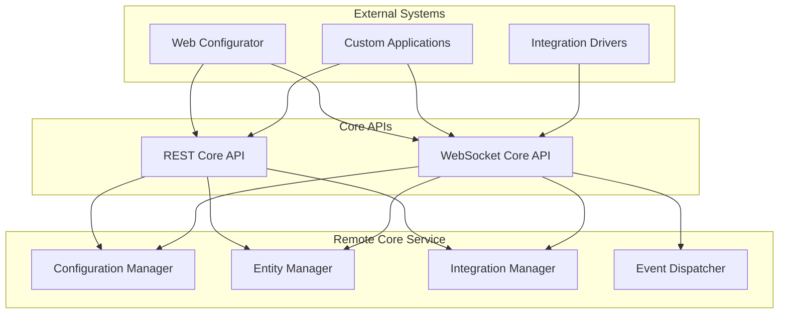
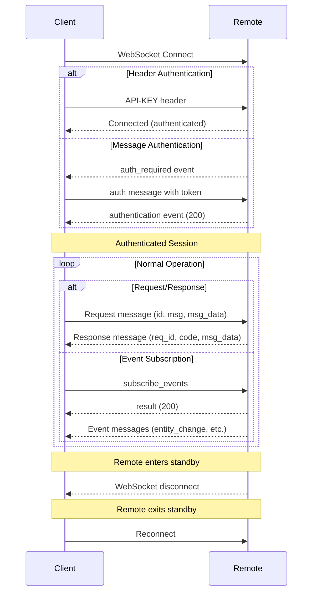

# Unfolded Circle Remote Two/3 Core API Documentation

A comprehensive guide to the REST and WebSocket Core APIs for the Unfolded Circle Remote Two and Remote 3 universal remotes.

---

## Table of Contents

1. [Introduction](#introduction)
2. [API Overview](#api-overview)
3. [REST Core API](#rest-core-api)
4. [WebSocket Core API](#websocket-core-api)
5. [Authentication](#authentication)
6. [Common Developer Gotchas](#common-developer-gotchas)
7. [Rust Implementation Examples](#rust-implementation-examples)
8. [Best Practices](#best-practices)
9. [Resources](#resources)

---

## Introduction

The Unfolded Circle Remote Two/3 Core APIs provide programmatic access to configure the remote, manage integrations, handle entities, and control virtually every aspect of the device. These APIs power the official web configurator and UI application, making them the authoritative interface for external developers.

### API Architecture Overview



### Key Differences Between APIs

| Feature                    | REST API                       | WebSocket API                        |
| -------------------------- | ------------------------------ | ------------------------------------ |
| Communication Pattern      | Request/Response               | Request/Response + Events            |
| Real-time Updates          | Polling required               | Push notifications                   |
| File Uploads               | Supported                      | Not supported                        |
| Custom Driver Installation | Supported                      | Not supported                        |
| Event Subscriptions        | Not available                  | Supported                            |
| Connection Persistence     | Stateless                      | Stateful                             |
| Best For                   | Configuration, file management | Real-time monitoring, entity control |

---

## API Overview

### Base URLs

| Environment             | REST API                                    | WebSocket API                                |
| ----------------------- | ------------------------------------------- | -------------------------------------------- |
| Local Development       | `http://localhost:8080/api`                 | `ws://localhost:8080/api/ws`                 |
| Local Development (TLS) | `https://localhost:8443/api`                | `wss://localhost:8443/api/ws`                |
| Simulator               | `http://unfolded-simulator.local:8080/api`  | `ws://unfolded-simulator.local:8080/api/ws`  |
| Simulator (TLS)         | `https://unfolded-simulator.local:8443/api` | `wss://unfolded-simulator.local:8443/api/ws` |
| Production              | `http://<remote-ip>/api`                    | `ws://<remote-ip>/api/ws`                    |

### API Versioning

The APIs follow [Semantic Versioning](https://semver.org/). The current version is `0.44.4` (REST) and `0.34.0-beta` (WebSocket), indicating pre-release status. Any `0.y.z` version may introduce breaking changes at any time.

> **Warning:** Backward compatibility is not yet guaranteed. Always check the [core-api GitHub issues](https://github.com/unfoldedcircle/core-api/issues) for the current state and upcoming changes.

---

## REST Core API

The REST Core API is defined using OpenAPI 3.0 specification and provides comprehensive configuration and management capabilities.

### Endpoint Categories

#### Public Information Endpoints (`/api/pub`)

These endpoints require no authentication and provide basic system information.

| Method | Endpoint            | Description                                                  |
| ------ | ------------------- | ------------------------------------------------------------ |
| `GET`  | `/pub/version`      | Get version information about installed components           |
| `GET`  | `/pub/status`       | Get status information about the system                      |
| `GET`  | `/pub/health_check` | Retrieve health check information about the system and running services |
| `POST` | `/pub/login`        | Log in and create session (returns cookie)                   |
| `POST` | `/pub/logout`       | Log out from session                                         |

#### Authentication Endpoints (`/api/auth`)

| Method   | Endpoint                    | Description                            |
| -------- | --------------------------- | -------------------------------------- |
| `HEAD`   | `/auth/api_keys`            | Get total number of available API keys |
| `GET`    | `/auth/api_keys`            | List available API keys                |
| `POST`   | `/auth/api_keys`            | Create an API key for the UCR APIs     |
| `DELETE` | `/auth/api_keys`            | Delete all API keys                    |
| `GET`    | `/auth/api_keys/{apiKeyId}` | Get information about an API key       |
| `PATCH`  | `/auth/api_keys/{apiKeyId}` | Update properties of an API key        |
| `DELETE` | `/auth/api_keys/{apiKeyId}` | Revoke an API key                      |
| `GET`    | `/auth/scopes`              | Get available access scopes            |

#### System Endpoints (`/api/system`)

| Method | Endpoint            | Description                                                  |
| ------ | ------------------- | ------------------------------------------------------------ |
| `GET`  | `/system`           | Get system information (serial number, model, hardware revision) |
| `POST` | `/system/reboot`    | Reboot the device                                            |
| `POST` | `/system/power_off` | Power off the device                                         |
| `POST` | `/system/restart`   | Restart applications                                         |
| `GET`  | `/system/update`    | Check for system updates                                     |
| `POST` | `/system/update`    | Perform system update                                        |

#### Entity Endpoints (`/api/entities`)

| Method   | Endpoint                        | Description                  |
| -------- | ------------------------------- | ---------------------------- |
| `GET`    | `/entities`                     | List all configured entities |
| `POST`   | `/entities`                     | Create a new entity          |
| `GET`    | `/entities/types`               | Get available entity types   |
| `GET`    | `/entities/{entityId}`          | Get entity details           |
| `PUT`    | `/entities/{entityId}`          | Update entity                |
| `DELETE` | `/entities/{entityId}`          | Delete entity                |
| `GET`    | `/entities/{entityId}/commands` | Get entity commands          |
| `POST`   | `/entities/{entityId}/execute`  | Execute entity command       |

#### Integration Endpoints (`/api/integrations`)

| Method   | Endpoint                           | Description                     |
| -------- | ---------------------------------- | ------------------------------- |
| `GET`    | `/integrations`                    | List all integrations           |
| `POST`   | `/integrations`                    | Create new integration instance |
| `GET`    | `/integrations/drivers`            | List integration drivers        |
| `POST`   | `/integrations/drivers`            | Register integration driver     |
| `GET`    | `/integrations/drivers/{driverId}` | Get driver details              |
| `PUT`    | `/integrations/drivers/{driverId}` | Update driver                   |
| `DELETE` | `/integrations/drivers/{driverId}` | Delete driver                   |
| `GET`    | `/integrations/{integrationId}`    | Get integration details         |
| `PUT`    | `/integrations/{integrationId}`    | Update integration              |
| `DELETE` | `/integrations/{integrationId}`    | Delete integration              |

#### Profile Endpoints (`/api/profiles`)

| Method   | Endpoint                       | Description           |
| -------- | ------------------------------ | --------------------- |
| `GET`    | `/profiles`                    | List all profiles     |
| `POST`   | `/profiles`                    | Create new profile    |
| `GET`    | `/profiles/active`             | Get active profile    |
| `PUT`    | `/profiles/active`             | Switch active profile |
| `GET`    | `/profiles/{profileId}`        | Get profile details   |
| `PUT`    | `/profiles/{profileId}`        | Update profile        |
| `DELETE` | `/profiles/{profileId}`        | Delete profile        |
| `GET`    | `/profiles/{profileId}/pages`  | Get profile pages     |
| `POST`   | `/profiles/{profileId}/pages`  | Create page           |
| `GET`    | `/profiles/{profileId}/groups` | Get profile groups    |
| `POST`   | `/profiles/{profileId}/groups` | Create group          |

#### WiFi Endpoints (`/api/wifi`)

| Method   | Endpoint                     | Description                  |
| -------- | ---------------------------- | ---------------------------- |
| `GET`    | `/wifi/status`               | Get WiFi connection status   |
| `GET`    | `/wifi/networks`             | List available WiFi networks |
| `POST`   | `/wifi/scan`                 | Start WiFi network scan      |
| `GET`    | `/wifi/scan`                 | Get scan status              |
| `POST`   | `/wifi/networks`             | Add WiFi network             |
| `GET`    | `/wifi/networks/{networkId}` | Get network details          |
| `PUT`    | `/wifi/networks/{networkId}` | Update network               |
| `DELETE` | `/wifi/networks/{networkId}` | Forget network               |

#### Dock Endpoints (`/api/docks`)

| Method   | Endpoint           | Description               |
| -------- | ------------------ | ------------------------- |
| `GET`    | `/docks`           | List all configured docks |
| `POST`   | `/docks`           | Add new dock              |
| `GET`    | `/docks/discovery` | Start dock discovery      |
| `GET`    | `/docks/{dockId}`  | Get dock details          |
| `PUT`    | `/docks/{dockId}`  | Update dock configuration |
| `DELETE` | `/docks/{dockId}`  | Remove dock               |

#### Configuration Endpoints (`/api/config`)

| Method | Endpoint               | Description                       |
| ------ | ---------------------- | --------------------------------- |
| `GET`  | `/config`              | Get full configuration            |
| `GET`  | `/config/button`       | Get button configuration          |
| `PUT`  | `/config/button`       | Update button configuration       |
| `GET`  | `/config/display`      | Get display configuration         |
| `PUT`  | `/config/display`      | Update display configuration      |
| `GET`  | `/config/haptic`       | Get haptic feedback configuration |
| `PUT`  | `/config/haptic`       | Update haptic configuration       |
| `GET`  | `/config/localization` | Get localization settings         |
| `PUT`  | `/config/localization` | Update localization               |
| `GET`  | `/config/network`      | Get network configuration         |
| `PUT`  | `/config/network`      | Update network configuration      |
| `GET`  | `/config/power`        | Get power saving configuration    |
| `PUT`  | `/config/power`        | Update power saving settings      |
| `GET`  | `/config/sound`        | Get sound configuration           |
| `PUT`  | `/config/sound`        | Update sound settings             |

#### Resource Endpoints (`/api/resources`)

| Method   | Endpoint                  | Description                          |
| -------- | ------------------------- | ------------------------------------ |
| `GET`    | `/resources`              | List custom resources                |
| `POST`   | `/resources`              | Upload custom resource (icon, image) |
| `GET`    | `/resources/{resourceId}` | Download resource                    |
| `DELETE` | `/resources/{resourceId}` | Delete resource                      |

---

## WebSocket Core API

The WebSocket Core API provides real-time bidirectional communication with the remote-core service, including asynchronous event notifications.

### Connection Flow



### Message Format

All WebSocket messages use JSON format with the following structure:

**Request Message:**

```json
{
  "kind": "req",
  "id": 123,
  "msg": "get_entities",
  "msg_data": {}
}
```

**Response Message:**

```json
{
  "kind": "resp",
  "req_id": 123,
  "msg": "result",
  "code": 200,
  "msg_data": {}
}
```

**Event Message:**

```json
{
  "kind": "event",
  "msg": "entity_change",
  "cat": "ENTITY",
  "ts": "2024-01-15T10:30:00Z",
  "msg_data": {}
}
```

### Core Messages

#### Authentication Messages

| Message          | Direction       | Description                                          |
| ---------------- | --------------- | ---------------------------------------------------- |
| `auth_required`  | Server → Client | Sent if client didn't authenticate during connection |
| `auth`           | Client → Server | Provide API key for authentication                   |
| `authentication` | Server → Client | Authentication result (200 = success, 401 = failed)  |

#### System Messages

| Message          | Direction       | Description                                         |
| ---------------- | --------------- | --------------------------------------------------- |
| `ping`           | Client → Server | Application-level ping                              |
| `pong`           | Server → Client | Ping response                                       |
| `get_version`    | Client → Server | Request version information                         |
| `version_info`   | Server → Client | Version information response                        |
| `get_system`     | Client → Server | Request system information                          |
| `system_info`    | Server → Client | System information response                         |
| `system_cmd`     | Client → Server | Execute system command (STANDBY, REBOOT, POWER_OFF) |
| `get_power_mode` | Client → Server | Get power mode and battery info                     |
| `power_mode`     | Server → Client | Power mode response                                 |

#### Entity Messages

| Message                  | Direction       | Description                              |
| ------------------------ | --------------- | ---------------------------------------- |
| `get_entity_types`       | Client → Server | Get available entity types               |
| `get_entities`           | Client → Server | List all configured entities             |
| `entities`               | Server → Client | Entity list response                     |
| `get_entity`             | Client → Server | Get specific entity                      |
| `entity`                 | Server → Client | Entity details                           |
| `get_entity_commands`    | Client → Server | Get commands for entity                  |
| `execute_entity_command` | Client → Server | Execute entity command                   |
| `update_entity`          | Client → Server | Update entity configuration              |
| `delete_entity`          | Client → Server | Delete entity                            |
| `get_available_entities` | Client → Server | Get available entities from integrations |

#### Profile Messages

| Message              | Direction       | Description           |
| -------------------- | --------------- | --------------------- |
| `get_profiles`       | Client → Server | List all profiles     |
| `profiles`           | Server → Client | Profile list response |
| `get_active_profile` | Client → Server | Get active profile    |
| `switch_profile`     | Client → Server | Switch active profile |
| `add_profile`        | Client → Server | Create new profile    |
| `update_profile`     | Client → Server | Update profile        |
| `delete_profile`     | Client → Server | Delete profile        |
| `get_pages`          | Client → Server | Get profile pages     |
| `get_groups`         | Client → Server | Get profile groups    |

#### Integration Messages

| Message                       | Direction       | Description                 |
| ----------------------------- | --------------- | --------------------------- |
| `get_integration_status`      | Client → Server | Get integration status      |
| `integration_status`          | Server → Client | Integration status response |
| `get_integration_drivers`     | Client → Server | List integration drivers    |
| `integration_drivers`         | Server → Client | Driver list response        |
| `register_integration_driver` | Client → Server | Register new driver         |
| `get_integrations`            | Client → Server | List integration instances  |
| `integrations`                | Server → Client | Integration list response   |
| `create_integration`          | Client → Server | Create integration instance |
| `delete_integration`          | Client → Server | Delete integration          |

#### WiFi Messages

| Message                 | Direction       | Description          |
| ----------------------- | --------------- | -------------------- |
| `get_wifi_status`       | Client → Server | Get WiFi status      |
| `wifi_status`           | Server → Client | WiFi status response |
| `wifi_scan_start`       | Client → Server | Start WiFi scan      |
| `wifi_scan_stop`        | Client → Server | Stop WiFi scan       |
| `get_wifi_scan_status`  | Client → Server | Get scan status      |
| `get_all_wifi_networks` | Client → Server | List WiFi networks   |
| `add_wifi_network`      | Client → Server | Add WiFi network     |
| `del_wifi_network`      | Client → Server | Forget WiFi network  |

#### Dock Messages

| Message                | Direction       | Description               |
| ---------------------- | --------------- | ------------------------- |
| `get_docks`            | Client → Server | List all docks            |
| `docks`                | Server → Client | Dock list response        |
| `create_dock`          | Client → Server | Add new dock              |
| `get_dock`             | Client → Server | Get dock details          |
| `dock`                 | Server → Client | Dock details response     |
| `update_dock`          | Client → Server | Update dock configuration |
| `delete_dock`          | Client → Server | Remove dock               |
| `start_dock_discovery` | Client → Server | Start dock discovery      |
| `stop_dock_discovery`  | Client → Server | Stop dock discovery       |

### Event Messages

The WebSocket API provides event subscriptions for real-time notifications:

| Event                       | Description                               |
| --------------------------- | ----------------------------------------- |
| `entity_change`             | Entity attribute changed                  |
| `activity_group_change`     | Activity group modified                   |
| `wifi_change`               | WiFi status changed                       |
| `integration_driver_change` | Integration driver added/removed/modified |
| `integration_change`        | Integration instance changed              |
| `integration_state`         | Integration connection state changed      |
| `active_profile_change`     | Active profile switched                   |
| `profile_change`            | Profile modified                          |
| `configuration_change`      | System configuration changed              |
| `dock_change`               | Dock configuration changed                |
| `dock_state`                | Dock connection state changed             |
| `dock_discovery`            | Dock discovered                           |
| `software_update`           | Software update available/progress        |
| `power_mode_change`         | Power mode changed                        |
| `battery_status`            | Battery level update                      |
| `assistant_event`           | Voice assistant event                     |

### Event Subscription

```json
// Subscribe to events
{
  "kind": "req",
  "id": 1,
  "msg": "subscribe_events",
  "msg_data": {
    "event_channels": ["entity_change", "integration_state"]
  }
}

// Response
{
  "kind": "resp",
  "req_id": 1,
  "msg": "result",
  "code": 200
}

// Received event
{
  "kind": "event",
  "msg": "entity_change",
  "cat": "ENTITY",
  "ts": "2024-01-15T10:30:00Z",
  "msg_data": {
    "entity_type": "media_player",
    "entity_id": "media-player-1",
    "attributes": {
      "state": "PLAYING",
      "volume": 75
    }
  }
}
```

---

## Authentication

The Core APIs support multiple authentication methods for flexibility across different client types.

### Authentication Methods

| Method         | Best For                | Header Format                                      |
| -------------- | ----------------------- | -------------------------------------------------- |
| Basic Auth     | Testing, simple scripts | `Authorization: Basic <base64(username:password)>` |
| Bearer Token   | Production applications | `Authorization: Bearer <api_key>`                  |
| API Key Header | WebSocket connections   | `API-KEY: <api_key>`                               |
| Session Cookie | Web browsers            | Cookie from `/pub/login`                           |
| Message Auth   | Browser WebSocket       | `auth` message after connection                    |

### Creating API Keys

API keys can be created via the REST API using Basic Auth (with the web-configurator PIN):

```bash
# Get the PIN from the remote's Settings > System > Web Configurator screen
curl -X POST 'http://192.168.1.100/api/auth/api_keys' \
  --user 'web-configurator:YOUR_PIN' \
  -H 'Content-Type: application/json' \
  -d '{
    "name": "My Application",
    "scope": "admin"
  }'
```

Response:

```json
{
  "id": "api-key-uuid",
  "key": "your-generated-api-key",
  "name": "My Application",
  "scope": "admin",
  "created_at": "2024-01-15T10:30:00Z"
}
```

> **Important:** Store the API key securely - it cannot be retrieved again after creation.

### WebSocket Authentication

For WebSocket connections, authentication can be provided in three ways:

**1. API Key Header (Recommended):**

```javascript
const ws = new WebSocket('ws://192.168.1.100/api/ws', {
  headers: {
    'API-KEY': 'your-api-key'
  }
});
```

**2. Basic Auth Header:**

```javascript
const ws = new WebSocket('ws://192.168.1.100/api/ws', {
  headers: {
    'Authorization': 'Basic ' + Buffer.from('web-configurator:PIN').toString('base64')
  }
});
```

**3. Message-based Authentication:**

```javascript
const ws = new WebSocket('ws://192.168.1.100/api/ws');

ws.on('message', (data) => {
  const msg = JSON.parse(data);
  if (msg.msg === 'auth_required') {
    ws.send(JSON.stringify({
      kind: 'req',
      id: 1,
      msg: 'auth',
      msg_data: { token: 'your-api-key' }
    }));
  }
});
```

---

## Common Developer Gotchas

### 1. WebSocket Disconnection During Standby

**Issue:** The remote disconnects WebSocket sessions when entering standby mode. This is by design to conserve battery.

**Impact:** Clients must implement reconnection logic to handle these disconnections gracefully.

**Solution:**

```rust
use tokio_tungstenite::{connect_async, tungstenite::Message};
use futures::{SinkExt, StreamExt};
use std::time::Duration;

async fn connect_with_reconnect(url: &str, api_key: &str) {
    loop {
        match connect_with_auth(url, api_key).await {
            Ok((ws_stream, _)) => {
                let (mut write, mut read) = ws_stream.split();
                
                // Handle messages
                while let Some(msg) = read.next().await {
                    match msg {
                        Ok(Message::Close(_)) => {
                            println!("Connection closed, reconnecting...");
                            break;
                        }
                        Ok(Message::Text(text)) => {
                            handle_message(&text).await;
                        }
                        Err(e) => {
                            eprintln!("Error: {}, reconnecting...", e);
                            break;
                        }
                        _ => {}
                    }
                }
            }
            Err(e) => {
                eprintln!("Connection failed: {}, retrying in 5s...", e);
                tokio::time::sleep(Duration::from_secs(5)).await;
            }
        }
    }
}
```

### 2. WiFi Connectivity Issues in Sleep Mode

**Issue:** Remote 3 has known WiFi connectivity problems in sleep mode, causing integrations to disconnect from their components.

**Impact:** External integrations may lose connection when the remote sleeps, causing "Unable to connect to dock" errors.

**Solutions:**

- Connect the dock via Ethernet instead of WiFi for more reliable IR blaster connectivity
- Use the "Don't sleep during activity" setting (trades battery life for reliability)
- Implement robust reconnection logic in your integration driver
- Consider using a standby inhibitor to prevent sleep during critical operations

```rust
// Request a standby inhibitor to prevent sleep
async fn request_standby_inhibitor(ws: &mut WebSocket) -> Result<(), Error> {
    let request = json!({
        "kind": "req",
        "id": generate_id(),
        "msg": "create_standby_inhibitor",
        "msg_data": {
            "reason": "Critical operation in progress"
        }
    });
    
    ws.send(Message::Text(request.to_string())).await?;
    
    // Remember to delete the inhibitor when done
    // Otherwise the remote won't go to sleep properly
    Ok(())
}
```

### 3. Authentication Timeout

**Issue:** Unauthenticated WebSocket connections are closed after 15 seconds.

**Impact:** Clients using message-based authentication must authenticate within this window.

**Solution:**

```rust
async fn authenticate_connection(ws: &mut WebSocket, api_key: &str) -> Result<bool, Error> {
    // Set a read timeout
    let auth_timeout = Duration::from_secs(15);
    
    // Wait for auth_required or proceed if header auth was used
    match tokio::time::timeout(auth_timeout, ws.next()).await {
        Ok(Some(Ok(Message::Text(text)))) => {
            let msg: Value = serde_json::from_str(&text)?;
            if msg["msg"] == "auth_required" {
                // Send auth message immediately
                let auth_msg = json!({
                    "kind": "req",
                    "id": 1,
                    "msg": "auth",
                    "msg_data": { "token": api_key }
                });
                ws.send(Message::Text(auth_msg.to_string())).await?;
                
                // Wait for authentication response
                let response = ws.next().await
                    .ok_or_else(|| anyhow!("No auth response"))??;
                let auth_result: Value = serde_json::from_str(&response.to_text()?)?;
                return Ok(auth_result["code"] == 200);
            }
            Ok(true) // Already authenticated via header
        }
        _ => Err(anyhow!("Authentication timeout")),
    }
}
```

### 4. API Version Compatibility

**Issue:** The API is currently in pre-release (version 0.x.x), meaning breaking changes can occur at any time.

**Impact:** Code written for one version may not work with future updates.

**Solution:**

- Always check the API version on connect
- Implement feature detection rather than version checking
- Subscribe to the [core-api GitHub issues](https://github.com/unfoldedcircle/core-api/issues) for change notifications

```rust
async fn check_api_version(ws: &mut WebSocket) -> Result<Version, Error> {
    let request = json!({
        "kind": "req",
        "id": generate_id(),
        "msg": "get_version",
        "msg_data": {}
    });
    
    ws.send(Message::Text(request.to_string())).await?;
    
    let response = ws.next().await
        .ok_or_else(|| anyhow!("No version response"))??;
    let version_info: Value = serde_json::from_str(&response.to_text()?)?;
    
    // Parse and store version for feature detection
    let version = Version::parse(version_info["msg_data"]["api_version"].as_str().unwrap_or("0.0.0"))?;
    
    if version < Version::new(1, 0, 0) {
        println!("Warning: Using pre-release API, compatibility not guaranteed");
    }
    
    Ok(version)
}
```

### 5. Missing Entity Attributes in Events

**Issue:** Entity change events may not include all attributes, only changed ones.

**Impact:** Code that expects complete entity state in events will break.

**Solution:**

```rust
#[derive(Debug, Clone)]
struct EntityState {
    attributes: HashMap<String, Value>,
}

impl EntityState {
    fn update_from_event(&mut self, event: &Value) {
        if let Some(attrs) = event["msg_data"]["attributes"].as_object() {
            for (key, value) in attrs {
                self.attributes.insert(key.clone(), value.clone());
            }
        }
    }
}

// Store entity states locally and update incrementally
async fn handle_entity_change(state: &mut HashMap<String, EntityState>, event: &Value) {
    let entity_id = event["msg_data"]["entity_id"].as_str().unwrap_or("");
    
    if let Some(entity) = state.get_mut(entity_id) {
        entity.update_from_event(event);
    } else {
        // Fetch full entity state if not cached
        let full_state = fetch_entity_state(entity_id).await;
        state.insert(entity_id.to_string(), full_state);
    }
}
```

### 6. Factory Reset Token Expiration

**Issue:** Factory reset tokens expire after 60 seconds, and requesting a new token invalidates previous ones.

**Impact:** Factory reset operations that take too long to confirm will fail.

**Solution:**

```rust
async fn perform_factory_reset(ws: &mut WebSocket) -> Result<(), Error> {
    // Get token
    let token_request = json!({
        "kind": "req",
        "id": generate_id(),
        "msg": "get_factory_reset_token",
        "msg_data": {}
    });
    
    ws.send(Message::Text(token_request.to_string())).await?;
    
    let response = ws.next().await
        .ok_or_else(|| anyhow!("No token response"))??;
    let token_info: Value = serde_json::from_str(&response.to_text()?)?;
    let token = token_info["msg_data"]["token"].as_str()
        .ok_or_else(|| anyhow!("No token in response"))?;
    
    // Immediately use the token (don't wait)
    let reset_request = json!({
        "kind": "req",
        "id": generate_id(),
        "msg": "factory_reset",
        "msg_data": { "token": token }
    });
    
    ws.send(Message::Text(reset_request.to_string())).await?;
    
    Ok(())
}
```

### 7. Multiple Integration Instance Limitation

**Issue:** Currently, you cannot add multiple instances of the same integration.

**Impact:** If you need multiple instances (e.g., multiple Home Assistant servers), you must use workarounds.

**Workaround:**

- Use a single integration instance that supports multiple backend connections
- Create separate integration drivers for each instance needed
- Wait for official support (tracked in [GitHub issue #118](https://github.com/unfoldedcircle/feature-and-bug-tracker/issues/118))

### 8. Dock Discovery Requirements

**Issue:** Manual dock setup requires the dock to already be connected to the network (Ethernet or WiFi).

**Impact:** You cannot configure dock WiFi through the API if the dock isn't already networked.

**Solution:**

- Use automatic discovery which can configure dock WiFi
- Pre-configure dock with Ethernet first
- Use the web configurator for initial dock setup

---

## Rust Implementation Examples

### Dependencies

Add these to your `Cargo.toml`:

```toml
[dependencies]
tokio = { version = "1", features = ["full"] }
tokio-tungstenite = { version = "0.21", features = ["native-tls"] }
futures = "0.3"
serde = { version = "1.0", features = ["derive"] }
serde_json = "1.0"
anyhow = "1.0"
reqwest = { version = "0.11", features = ["json"] }
semver = "1.0"
```

### REST API Client

```rust
use reqwest::Client;
use serde::{Deserialize, Serialize};
use anyhow::Result;

pub struct UcrRestClient {
    client: Client,
    base_url: String,
    api_key: String,
}

#[derive(Debug, Serialize, Deserialize)]
pub struct ApiKey {
    pub id: String,
    pub key: String,
    pub name: String,
    pub scope: String,
    pub created_at: String,
}

#[derive(Debug, Serialize, Deserialize)]
pub struct SystemInfo {
    pub serial_number: String,
    pub model: String,
    pub hardware_revision: String,
    pub firmware_version: String,
}

#[derive(Debug, Serialize, Deserialize)]
pub struct Entity {
    pub entity_id: String,
    pub entity_type: String,
    pub name: String,
    pub attributes: serde_json::Value,
}

impl UcrRestClient {
    pub fn new(base_url: &str, api_key: &str) -> Self {
        Self {
            client: Client::new(),
            base_url: base_url.trim_end_matches('/').to_string(),
            api_key: api_key.to_string(),
        }
    }

    async fn get<T: for<'de> Deserialize<'de>>(&self, endpoint: &str) -> Result<T> {
        let url = format!("{}{}", self.base_url, endpoint);
        let response = self.client
            .get(&url)
            .bearer_auth(&self.api_key)
            .send()
            .await?
            .error_for_status()?
            .json()
            .await?;
        Ok(response)
    }

    async fn post<T: Serialize, R: for<'de> Deserialize<'de>>(
        &self,
        endpoint: &str,
        body: &T,
    ) -> Result<R> {
        let url = format!("{}{}", self.base_url, endpoint);
        let response = self.client
            .post(&url)
            .bearer_auth(&self.api_key)
            .json(body)
            .send()
            .await?
            .error_for_status()?
            .json()
            .await?;
        Ok(response)
    }

    pub async fn get_system_info(&self) -> Result<SystemInfo> {
        self.get("/system").await
    }

    pub async fn get_entities(&self) -> Result<Vec<Entity>> {
        self.get("/entities").await
    }

    pub async fn create_api_key(&self, name: &str) -> Result<ApiKey> {
        #[derive(Serialize)]
        struct CreateKeyRequest {
            name: String,
            scope: String,
        }
        
        self.post("/auth/api_keys", &CreateKeyRequest {
            name: name.to_string(),
            scope: "admin".to_string(),
        }).await
    }
}

#[tokio::main]
async fn main() -> Result<()> {
    let client = UcrRestClient::new("http://192.168.1.100/api", "your-api-key");
    
    let system = client.get_system_info().await?;
    println!("System: {:?}", system);
    
    let entities = client.get_entities().await?;
    for entity in entities {
        println!("Entity: {} ({})", entity.name, entity.entity_type);
    }
    
    Ok(())
}
```

### WebSocket Client

```rust
use tokio_tungstenite::{connect_async, tungstenite::Message};
use futures::{SinkExt, StreamExt};
use serde::{Deserialize, Serialize};
use serde_json::Value;
use std::sync::atomic::{AtomicU64, Ordering};
use anyhow::Result;

pub struct UcrWebSocketClient {
    url: String,
    api_key: String,
    request_id: AtomicU64,
}

#[derive(Debug, Serialize, Deserialize)]
struct WebSocketMessage {
    kind: String,
    #[serde(skip_serializing_if = "Option::is_none")]
    id: Option<u64>,
    #[serde(skip_serializing_if = "Option::is_none")]
    req_id: Option<u64>,
    msg: String,
    #[serde(skip_serializing_if = "Option::is_none")]
    code: Option<u16>,
    #[serde(skip_serializing_if = "Option::is_none")]
    msg_data: Option<Value>,
}

impl UcrWebSocketClient {
    pub fn new(url: &str, api_key: &str) -> Self {
        Self {
            url: url.to_string(),
            api_key: api_key.to_string(),
            request_id: AtomicU64::new(1),
        }
    }

    fn next_id(&self) -> u64 {
        self.request_id.fetch_add(1, Ordering::SeqCst)
    }

    pub async fn connect(&self) -> Result<()> {
        // Connect with API key header
        let url = format!("{}?api_key={}", self.url, self.api_key);
        let (ws_stream, _) = connect_async(&url).await?;
        
        let (mut write, mut read) = ws_stream.split();
        
        println!("Connected to WebSocket");
        
        // Subscribe to events
        let subscribe = WebSocketMessage {
            kind: "req".to_string(),
            id: Some(self.next_id()),
            req_id: None,
            msg: "subscribe_events".to_string(),
            code: None,
            msg_data: Some(json!({
                "event_channels": ["entity_change", "integration_state"]
            })),
        };
        
        write.send(Message::Text(serde_json::to_string(&subscribe)?)).await?;
        
        // Handle incoming messages
        while let Some(msg) = read.next().await {
            match msg {
                Ok(Message::Text(text)) => {
                    let ws_msg: WebSocketMessage = serde_json::from_str(&text)?;
                    
                    match ws_msg.kind.as_str() {
                        "event" => self.handle_event(&ws_msg).await,
                        "resp" => self.handle_response(&ws_msg).await,
                        _ => println!("Unknown message kind: {}", ws_msg.kind),
                    }
                }
                Ok(Message::Close(_)) => {
                    println!("Connection closed");
                    break;
                }
                Err(e) => {
                    eprintln!("Error: {}", e);
                    break;
                }
                _ => {}
            }
        }
        
        Ok(())
    }

    async fn handle_event(&self, msg: &WebSocketMessage) {
        println!("Event: {} - {:?}", msg.msg, msg.msg_data);
        
        match msg.msg.as_str() {
            "entity_change" => {
                if let Some(data) = &msg.msg_data {
                    println!("Entity {} changed", data["entity_id"]);
                }
            }
            "integration_state" => {
                if let Some(data) = &msg.msg_data {
                    println!("Integration state: {:?}", data);
                }
            }
            _ => {}
        }
    }

    async fn handle_response(&self, msg: &WebSocketMessage) {
        if msg.code == Some(200) {
            println!("Request {} succeeded", msg.req_id.unwrap_or(0));
        } else {
            println!("Request {} failed with code {:?}", 
                msg.req_id.unwrap_or(0), msg.code);
        }
    }
}

#[tokio::main]
async fn main() -> Result<()> {
    let client = UcrWebSocketClient::new(
        "ws://192.168.1.100/api/ws",
        "your-api-key"
    );
    
    client.connect().await?;
    
    Ok(())
}
```

### Complete Integration Example

```rust
use std::collections::HashMap;
use std::sync::Arc;
use tokio::sync::RwLock;
use tokio_tungstenite::{connect_async, tungstenite::Message};
use futures::{SinkExt, StreamExt};
use serde_json::{json, Value};
use anyhow::Result;

pub struct UcrClient {
    rest_client: reqwest::Client,
    rest_url: String,
    ws_url: String,
    api_key: String,
    entity_cache: Arc<RwLock<HashMap<String, Value>>>,
}

impl UcrClient {
    pub fn new(host: &str, api_key: &str) -> Self {
        Self {
            rest_client: reqwest::Client::new(),
            rest_url: format!("http://{}/api", host),
            ws_url: format!("ws://{}/api/ws", host),
            api_key: api_key.to_string(),
            entity_cache: Arc::new(RwLock::new(HashMap::new())),
        }
    }

    /// Initialize the client and fetch initial entity states
    pub async fn initialize(&self) -> Result<()> {
        let entities: Vec<Value> = self.rest_client
            .get(&format!("{}/entities", self.rest_url))
            .bearer_auth(&self.api_key)
            .send()
            .await?
            .json()
            .await?;

        let mut cache = self.entity_cache.write().await;
        for entity in entities {
            if let Some(id) = entity["entity_id"].as_str() {
                cache.insert(id.to_string(), entity);
            }
        }

        println!("Initialized with {} entities", cache.len());
        Ok(())
    }

    /// Start the WebSocket event loop
    pub async fn run_event_loop(&self) -> Result<()> {
        let url = format!("{}?api_key={}", self.ws_url, self.api_key);
        
        loop {
            match connect_async(&url).await {
                Ok((ws_stream, _)) => {
                    println!("WebSocket connected");
                    let (mut write, mut read) = ws_stream.split();
                    
                    // Subscribe to entity changes
                    let subscribe = json!({
                        "kind": "req",
                        "id": 1,
                        "msg": "subscribe_events",
                        "msg_data": {
                            "event_channels": ["entity_change"]
                        }
                    });
                    write.send(Message::Text(subscribe.to_string())).await.ok();
                    
                    // Process messages
                    while let Some(msg) = read.next().await {
                        match msg {
                            Ok(Message::Text(text)) => {
                                self.process_message(&text).await;
                            }
                            Ok(Message::Close(_)) => break,
                            Err(_) => break,
                            _ => {}
                        }
                    }
                }
                Err(e) => {
                    eprintln!("Connection error: {}", e);
                }
            }
            
            println!("Reconnecting in 5 seconds...");
            tokio::time::sleep(std::time::Duration::from_secs(5)).await;
        }
    }

    async fn process_message(&self, text: &str) {
        if let Ok(msg) = serde_json::from_str::<Value>(text) {
            if msg["kind"] == "event" && msg["msg"] == "entity_change" {
                self.handle_entity_change(&msg["msg_data"]).await;
            }
        }
    }

    async fn handle_entity_change(&self, data: &Value) {
        if let Some(entity_id) = data["entity_id"].as_str() {
            let mut cache = self.entity_cache.write().await;
            
            if let Some(existing) = cache.get_mut(entity_id) {
                // Merge changed attributes
                if let Some(attrs) = data["attributes"].as_object() {
                    if let Some(existing_attrs) = existing["attributes"].as_object_mut() {
                        for (key, value) in attrs {
                            existing_attrs.insert(key.clone(), value.clone());
                        }
                    }
                }
                println!("Updated entity: {}", entity_id);
            }
        }
    }

    /// Get entity state from cache
    pub async fn get_entity(&self, entity_id: &str) -> Option<Value> {
        let cache = self.entity_cache.read().await;
        cache.get(entity_id).cloned()
    }

    /// Execute a command on an entity
    pub async fn execute_command(
        &self,
        entity_id: &str,
        command_id: &str,
        params: Option<Value>,
    ) -> Result<Value> {
        let body = json!({
            "cmd_id": command_id,
            "params": params
        });

        let response = self.rest_client
            .post(&format!(
                "{}/entities/{}/execute",
                self.rest_url, entity_id
            ))
            .bearer_auth(&self.api_key)
            .json(&body)
            .send()
            .await?
            .json()
            .await?;

        Ok(response)
    }
}

#[tokio::main]
async fn main() -> Result<()> {
    let client = Arc::new(UcrClient::new("192.168.1.100", "your-api-key"));
    
    // Initialize cache
    client.initialize().await?;
    
    // Spawn event loop in background
    let client_clone = client.clone();
    tokio::spawn(async move {
        client_clone.run_event_loop().await.ok();
    });
    
    // Example: Get entity and execute command
    tokio::time::sleep(std::time::Duration::from_secs(2)).await;
    
    if let Some(entity) = client.get_entity("media-player-1").await {
        println!("Entity: {:?}", entity);
        
        // Execute play command
        client.execute_command("media-player-1", "play", None).await?;
    }
    
    // Keep running
    tokio::signal::ctrl_c().await?;
    println!("Shutting down...");
    
    Ok(())
}
```

---

## Best Practices

### Connection Management

1. **Implement Exponential Backoff:** When reconnecting after disconnections, use exponential backoff to avoid overwhelming the remote.

2. **Handle Standby Gracefully:** The remote disconnects WebSocket sessions during standby. Cache entity states locally and sync when reconnected.

3. **Use Heartbeats:** While WebSocket ping/pong frames handle keep-alive, consider application-level heartbeats for critical applications.

### Authentication

1. **Prefer API Key Headers:** For WebSocket connections, providing the API key in the connection header eliminates the need for message-based authentication.

2. **Rotate API Keys:** Periodically rotate API keys for security. Delete old keys after creating new ones.

3. **Secure Storage:** Never hardcode API keys in source code. Use environment variables or secure credential storage.

### Event Handling

1. **Debounce Rapid Events:** Entity change events can fire rapidly. Implement debouncing for UI updates.

2. **Partial State Updates:** Entity change events may only include changed attributes. Maintain local state and merge updates.

3. **Error Recovery:** If an event subscription fails, attempt to re-subscribe rather than reconnecting immediately.

### Performance

1. **Limit Event Subscriptions:** Only subscribe to event channels you actually need. Unnecessary subscriptions waste resources.

2. **Batch Operations:** When making multiple REST API calls, consider if they can be batched or parallelized.

3. **Cache Entity States:** Avoid repeatedly fetching entity states via REST when you can use WebSocket events to maintain state.

---

## Resources

### Official Documentation

- [REST Core-API Documentation](https://unfoldedcircle.github.io/core-api/rest/)
- [WebSocket Core-API Documentation](https://unfoldedcircle.github.io/core-api/ws/)
- [Integration-API Documentation](https://unfoldedcircle.github.io/core-api/integration/)
- [GitHub Repository](https://github.com/unfoldedcircle/core-api)

### YAML Definitions

- [REST OpenAPI YAML](https://github.com/unfoldedcircle/core-api/tree/main/core-api/rest)
- [WebSocket AsyncAPI YAML](https://github.com/unfoldedcircle/core-api/tree/main/core-api/websocket)

### Tools

- [AsyncAPI Studio](https://studio.asyncapi.com/?url=https://raw.githubusercontent.com/unfoldedcircle/core-api/main/core-api/websocket/UCR-core-asyncapi.yaml) - View WebSocket API interactively
- [Swagger Editor](https://editor.swagger.io/) - View REST API interactively
- [Postman Collection](https://github.com/unfoldedcircle/core-api/blob/main/core-api/rest/remote-core_rest-api.postman_collection.json)

### Community

- [Unfolded Community Forum](http://unfolded.community/)
- [Discord Channel](http://unfolded.chat/)
- [GitHub Issues](https://github.com/unfoldedcircle/core-api/issues)

### SDK Libraries

- [Node.js Integration Library](https://github.com/unfoldedcircle/integration-node-library)
- [Python Integration Library](https://github.com/unfoldedcircle/integration-python-library)

---

## License

This documentation is based on the official Unfolded Circle Core API specifications, licensed under [Creative Commons Attribution-ShareAlike 4.0 International (CC BY-SA 4.0)](https://creativecommons.org/licenses/by-sa/4.0/).


