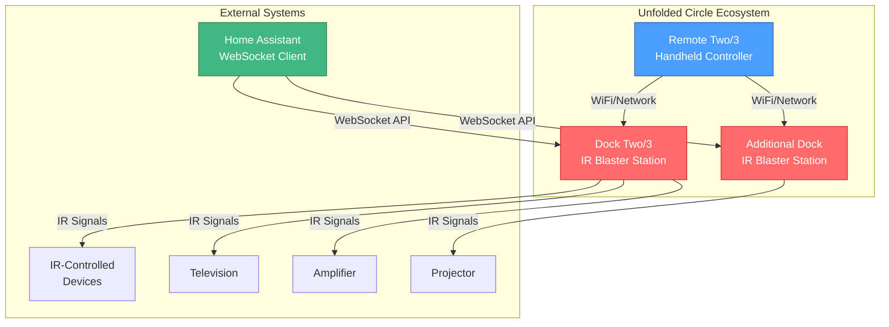
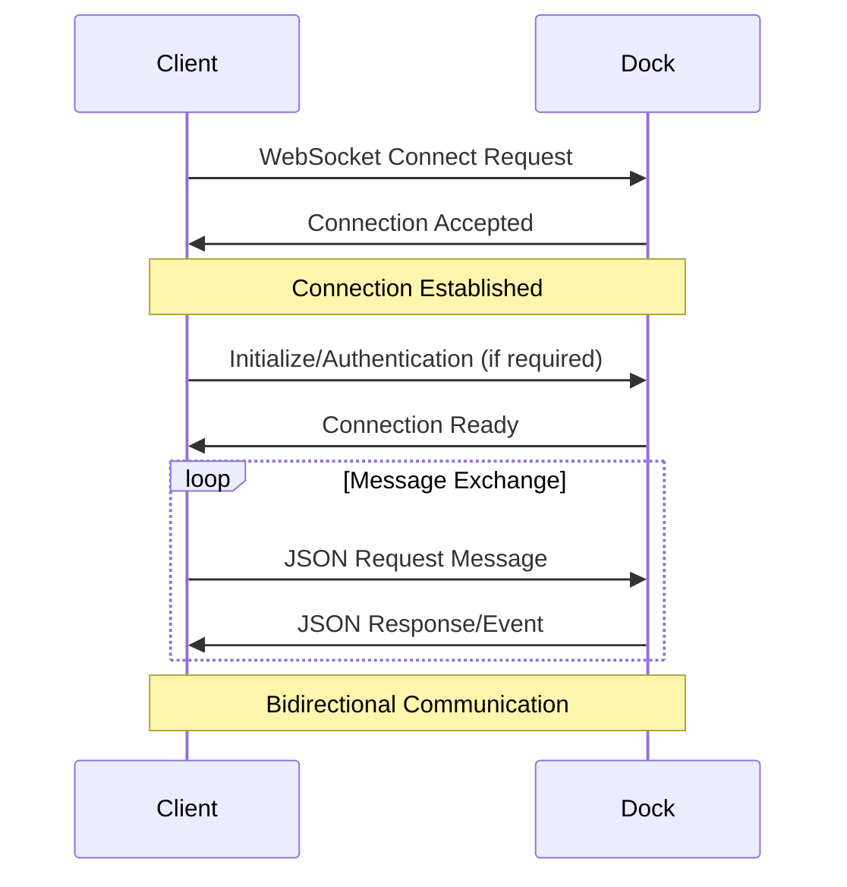
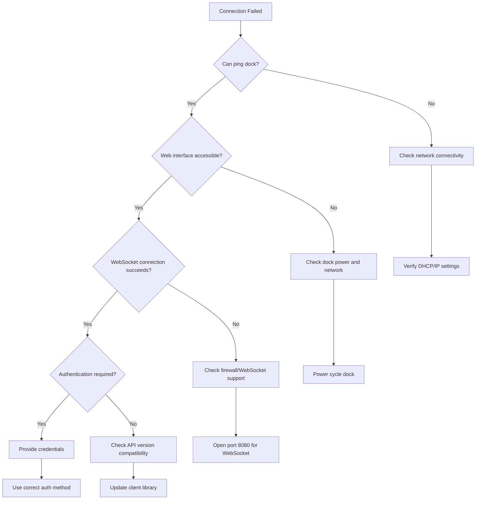

# Unfolded Circle Dock API Documentation

## Overview

The Unfolded Circle Dock API provides a WebSocket-based interface for communicating with the Unfolded Circle smart charging docks (Dock Two and Dock 3). These docks serve as IR (infrared) blaster stations for the Remote Two/3 devices, enabling control of IR-based devices in your smart home setup.

| Aspect                   | Details                                                      |
| ------------------------ | ------------------------------------------------------------ |
| **API Type**             | WebSocket (AsyncAPI specification)                           |
| **Protocol**             | WebSocket with JSON text messages                            |
| **Specification Format** | AsyncAPI YAML                                                |
| **Current Version**      | 0.8.0-beta                                                   |
| **Official Docs**        | [https://unfoldedcircle.github.io/core-api/dock/](https://unfoldedcircle.github.io/core-api/dock/) |
| **YAML Definition**      | [GitHub: core-api/dock-api](https://github.com/unfoldedcircle/core-api/tree/main/dock-api) |

---

## Table of Contents

- [Architecture Overview](#architecture-overview)
- [Connection Establishment](#connection-establishment)
- [Message Format](#message-format)
- [API Endpoints & Operations](#api-endpoints--operations)
- [Rust Implementation Examples](#rust-implementation-examples)
- [Common Gotchas & How to Avoid Them](#common-gotchas--how-to-avoid-them)
- [Troubleshooting](#troubleshooting)
- [Best Practices](#best-practices)

---

## Architecture Overview

The Unfolded Circle ecosystem consists of the Remote Two/3 handheld controller and one or more charging docks. The docks are not merely charging stations—they function as IR blaster stations that can send infrared commands to your AV equipment and other IR-controlled devices.



### Key Architectural Concepts

**Dock as IR Gateway**: The dock serves as a bridge between your network and IR-controlled devices. When you send a command through the Dock API, the dock translates it into infrared signals that your TV, amplifier, projector, or other IR-controlled equipment can understand.

**WebSocket Communication**: Unlike traditional REST APIs, the Dock API uses persistent WebSocket connections. This enables real-time bidirectional communication, allowing the dock to immediately push status updates and event notifications to connected clients without requiring polling.

**AsyncAPI Specification**: The API is formally defined using AsyncAPI, an industry-standard specification for defining asynchronous APIs. This provides machine-readable documentation that can be used to generate client libraries, documentation, and validation tools.

---

## Connection Establishment

### WebSocket Endpoint

The dock exposes a WebSocket server endpoint that clients connect to:

| Parameter        | Value                                |
| ---------------- | ------------------------------------ |
| **Protocol**     | `ws://` or `wss://` (if TLS enabled) |
| **Default Port** | `8080` (configurable)                |
| **Path**         | `/api/ws`                            |

### Connection Flow



### Rust Connection Example

```rust
use tokio_tungstenite::{connect_async, tungstenite::Message};
use futures::{SinkExt, StreamExt};
use serde_json::json;
use url::Url;

/// Represents a connection to an Unfolded Circle Dock
pub struct DockConnection {
    /// WebSocket sender for outgoing messages
    sender: futures::stream::SplitSink<
        tokio_tungstenite::WebSocketStream<
            tokio_tungstenite::MaybeTlsStream<tokio::net::TcpStream>
        >,
        Message
    >,
}

impl DockConnection {
    /// Establishes a new WebSocket connection to the dock
    /// 
    /// # Arguments
    /// * `host` - The IP address or hostname of the dock
    /// * `port` - The port number (default: 8080)
    /// 
    /// # Example
    /// ```rust
    /// let dock = DockConnection::connect("192.168.1.100", 8080).await?;
    /// ```
    pub async fn connect(host: &str, port: u16) -> Result<Self, Box<dyn std::error::Error>> {
        let url = Url::parse(&format!("ws://{}:{}/api/ws", host, port))?;
        
        let (ws_stream, _) = connect_async(url).await?;
        let (sender, _receiver) = ws_stream.split();
        
        Ok(Self { sender })
    }
    
    /// Sends a JSON message to the dock
    pub async fn send_json(&mut self, message: &serde_json::Value) -> Result<(), Box<dyn std::error::Error>> {
        let message_str = serde_json::to_string(message)?;
        self.sender.send(Message::Text(message_str)).await?;
        Ok(())
    }
}
```

---

## Message Format

All communication uses JSON text messages over WebSocket. The message structure follows a request-response pattern with unique identifiers for tracking.

### Request Message Structure

```json
{
    "kind": "req",
    "id": "unique-request-id",
    "msg": "message_type",
    "payload": {
        // Message-specific data
    }
}
```

### Response Message Structure

```json
{
    "kind": "resp",
    "id": "unique-request-id",
    "msg": "message_type_response",
    "payload": {
        // Response data or error information
    }
}
```

### Event Message Structure

```json
{
    "kind": "event",
    "msg": "event_type",
    "payload": {
        // Event data
    }
}
```

### Message Kind Types

| Kind    | Description                 |
| ------- | --------------------------- |
| `req`   | Request message from client |
| `resp`  | Response message from dock  |
| `event` | Unsolicited event from dock |

---

## API Endpoints & Operations

The Dock API provides operations for managing the dock and sending IR commands. Based on the AsyncAPI specification, the following operations are available:

### Dock Information Operations

#### Get Dock Status

Retrieves the current status of the dock including connection state, charging status, and device information.

**Request:**

```json
{
    "kind": "req",
    "id": "req-001",
    "msg": "get_status"
}
```

**Response:**

```json
{
    "kind": "resp",
    "id": "req-001",
    "msg": "get_status_response",
    "payload": {
        "state": "ready",
        "remote_connected": true,
        "charging": false,
        "battery_level": 85
    }
}
```

### IR Command Operations

#### Send IR Command

Sends an infrared command through the dock's IR blaster. This is the primary function for controlling external devices.

**Request:**

```json
{
    "kind": "req",
    "id": "req-002",
    "msg": "ir_send",
    "payload": {
        "device_id": "tv-samsung",
        "command": "power_on",
        "repeat": 1
    }
}
```

**Response:**

```json
{
    "kind": "resp",
    "id": "req-002",
    "msg": "ir_send_response",
    "payload": {
        "success": true
    }
}
```

#### Learn IR Command

Puts the dock into learning mode to capture IR signals from a physical remote. This is useful for adding new devices or commands that aren't in the built-in database.

**Request:**

```json
{
    "kind": "req",
    "id": "req-003",
    "msg": "ir_learn_start",
    "payload": {
        "device_id": "custom-device",
        "command_name": "power_toggle",
        "timeout_ms": 10000
    }
}
```

**Response (on successful capture):**

```json
{
    "kind": "event",
    "msg": "ir_learn_result",
    "payload": {
        "success": true,
        "device_id": "custom-device",
        "command_name": "power_toggle",
        "raw_data": "..." 
    }
}
```

### Configuration Operations

#### Get Configuration

Retrieves the current dock configuration including network settings, IR devices, and other parameters.

**Request:**

```json
{
    "kind": "req",
    "id": "req-004",
    "msg": "get_config"
}
```

---

## Rust Implementation Examples

### Complete Dock Client Implementation

Below is a comprehensive Rust implementation for interacting with the Unfolded Circle Dock API:

```rust
use serde::{Deserialize, Serialize};
use serde_json::Value;
use std::collections::HashMap;
use std::sync::atomic::{AtomicU64, Ordering};
use tokio::sync::mpsc;
use tokio_tungstenite::{connect_async, tungstenite::Message};
use futures::{SinkExt, StreamExt};
use url::Url;

/// Message kinds supported by the Dock API
#[derive(Debug, Clone, Serialize, Deserialize, PartialEq)]
#[serde(rename_all = "lowercase")]
pub enum MessageKind {
    Req,
    Resp,
    Event,
}

/// Base message structure for all Dock API messages
#[derive(Debug, Clone, Serialize, Deserialize)]
pub struct DockMessage {
    pub kind: MessageKind,
    #[serde(skip_serializing_if = "Option::is_none")]
    pub id: Option<String>,
    pub msg: String,
    #[serde(skip_serializing_if = "Option::is_none")]
    pub payload: Option<Value>,
}

/// IR command payload for sending infrared signals
#[derive(Debug, Clone, Serialize, Deserialize)]
pub struct IrSendPayload {
    pub device_id: String,
    pub command: String,
    #[serde(skip_serializing_if = "Option::is_none")]
    pub repeat: Option<u32>,
}

/// Dock status response payload
#[derive(Debug, Clone, Serialize, Deserialize)]
pub struct DockStatus {
    pub state: String,
    #[serde(skip_serializing_if = "Option::is_none")]
    pub remote_connected: Option<bool>,
    #[serde(skip_serializing_if = "Option::is_none")]
    pub charging: Option<bool>,
    #[serde(skip_serializing_if = "Option::is_none")]
    pub battery_level: Option<u8>,
}

/// IR learn start payload
#[derive(Debug, Clone, Serialize, Deserialize)]
pub struct IrLearnStartPayload {
    pub device_id: String,
    pub command_name: String,
    #[serde(skip_serializing_if = "Option::is_none")]
    pub timeout_ms: Option<u32>,
}

/// Main client for interacting with an Unfolded Circle Dock
pub struct DockClient {
    request_id: AtomicU64,
    sender: mpsc::Sender<DockMessage>,
}

impl DockClient {
    /// Creates a new DockClient and establishes a WebSocket connection
    /// 
    /// # Arguments
    /// * `host` - IP address or hostname of the dock
    /// * `port` - WebSocket port (typically 8080)
    /// 
    /// # Returns
    /// A tuple containing the client handle and an event receiver
    /// 
    /// # Example
    /// ```rust
    /// let (client, mut events) = DockClient::new("192.168.1.100", 8080).await?;
    /// 
    /// // Handle incoming events in a separate task
    /// tokio::spawn(async move {
    ///     while let Some(event) = events.recv().await {
    ///         println!("Received event: {:?}", event);
    ///     }
    /// });
    /// ```
    pub async fn new(host: &str, port: u16) -> Result<(Self, mpsc::Receiver<DockMessage>), DockError> {
        let url = Url::parse(&format!("ws://{}:{}/api/ws", host, port))
            .map_err(|e| DockError::InvalidUrl(e.to_string()))?;
        
        let (ws_stream, _) = connect_async(url)
            .await
            .map_err(|e| DockError::ConnectionFailed(e.to_string()))?;
        
        let (ws_sink, ws_stream) = ws_stream.split();
        
        // Channel for outgoing messages
        let (outgoing_tx, mut outgoing_rx) = mpsc::channel::<DockMessage>(32);
        
        // Channel for incoming events
        let (event_tx, event_rx) = mpsc::channel::<DockMessage>(32);
        
        // Spawn task for sending messages
        let send_task = async move {
            while let Some(msg) = outgoing_rx.recv().await {
                let json = serde_json::to_string(&msg).unwrap();
                // Send message via WebSocket
                // Note: In production, handle the WebSocket sink properly
            }
        };
        
        // Spawn task for receiving messages
        let recv_task = async move {
            // Handle incoming WebSocket messages
            // Route responses and events appropriately
        };
        
        tokio::spawn(send_task);
        tokio::spawn(recv_task);
        
        Ok((
            Self {
                request_id: AtomicU64::new(1),
                sender: outgoing_tx,
            },
            event_rx,
        ))
    }
    
    /// Generates a unique request ID
    fn next_request_id(&self) -> String {
        let id = self.request_id.fetch_add(1, Ordering::SeqCst);
        format!("req-{}", id)
    }
    
    /// Sends an IR command through the dock
    /// 
    /// # Arguments
    /// * `device_id` - Identifier for the target IR device
    /// * `command` - Command to send (e.g., "power_on", "volume_up")
    /// * `repeat` - Number of times to repeat the command (default: 1)
    /// 
    /// # Example
    /// ```rust
    /// client.send_ir_command("tv-samsung", "power_on", None).await?;
    /// client.send_ir_command("receiver-denon", "volume_up", Some(3)).await?;
    /// ```
    pub async fn send_ir_command(
        &self,
        device_id: &str,
        command: &str,
        repeat: Option<u32>,
    ) -> Result<(), DockError> {
        let id = self.next_request_id();
        let message = DockMessage {
            kind: MessageKind::Req,
            id: Some(id),
            msg: "ir_send".to_string(),
            payload: Some(serde_json::to_value(IrSendPayload {
                device_id: device_id.to_string(),
                command: command.to_string(),
                repeat,
            }).unwrap()),
        };
        
        self.sender.send(message).await.map_err(|e| DockError::SendFailed(e.to_string()))
    }
    
    /// Puts the dock into IR learning mode
    /// 
    /// # Arguments
    /// * `device_id` - Identifier for the device being learned
    /// * `command_name` - Name for the learned command
    /// * `timeout_ms` - Learning timeout in milliseconds
    /// 
    /// # Example
    /// ```rust
    /// client.start_ir_learning("custom-device", "power_toggle", Some(10000)).await?;
    /// // Point your physical remote at the dock and press the button
    /// ```
    pub async fn start_ir_learning(
        &self,
        device_id: &str,
        command_name: &str,
        timeout_ms: Option<u32>,
    ) -> Result<(), DockError> {
        let id = self.next_request_id();
        let message = DockMessage {
            kind: MessageKind::Req,
            id: Some(id),
            msg: "ir_learn_start".to_string(),
            payload: Some(serde_json::to_value(IrLearnStartPayload {
                device_id: device_id.to_string(),
                command_name: command_name.to_string(),
                timeout_ms,
            }).unwrap()),
        };
        
        self.sender.send(message).await.map_err(|e| DockError::SendFailed(e.to_string()))
    }
    
    /// Retrieves the current dock status
    /// 
    /// # Example
    /// ```rust
    /// let status = client.get_status().await?;
    /// println!("Battery level: {}%", status.battery_level.unwrap_or(0));
    /// ```
    pub async fn get_status(&self) -> Result<(), DockError> {
        let id = self.next_request_id();
        let message = DockMessage {
            kind: MessageKind::Req,
            id: Some(id),
            msg: "get_status".to_string(),
            payload: None,
        };
        
        self.sender.send(message).await.map_err(|e| DockError::SendFailed(e.to_string()))
    }
    
    /// Stops IR learning mode
    /// 
    /// # Example
    /// ```rust
    /// client.stop_ir_learning().await?;
    /// ```
    pub async fn stop_ir_learning(&self) -> Result<(), DockError> {
        let id = self.next_request_id();
        let message = DockMessage {
            kind: MessageKind::Req,
            id: Some(id),
            msg: "ir_learn_stop".to_string(),
            payload: None,
        };
        
        self.sender.send(message).await.map_err(|e| DockError::SendFailed(e.to_string()))
    }
}

/// Error types for Dock API operations
#[derive(Debug, thiserror::Error)]
pub enum DockError {
    #[error("Invalid URL: {0}")]
    InvalidUrl(String),
    
    #[error("Connection failed: {0}")]
    ConnectionFailed(String),
    
    #[error("Failed to send message: {0}")]
    SendFailed(String),
    
    #[error("Failed to receive message: {0}")]
    ReceiveFailed(String),
    
    #[error("JSON parsing error: {0}")]
    JsonError(#[from] serde_json::Error),
    
    #[error("API error: {0}")]
    ApiError(String),
    
    #[error("Timeout waiting for response")]
    Timeout,
}

/// Configuration for a Dock device
#[derive(Debug, Clone, Serialize, Deserialize)]
pub struct DockConfig {
    pub id: String,
    pub name: String,
    pub model: String,
    pub firmware_version: String,
    pub ip_address: String,
    pub mac_address: String,
    #[serde(skip_serializing_if = "Option::is_none")]
    pub wifi_ssid: Option<String>,
}

/// Builder pattern for creating Dock clients with custom options
pub struct DockClientBuilder {
    host: String,
    port: u16,
    timeout_ms: u64,
    auto_reconnect: bool,
}

impl DockClientBuilder {
    /// Creates a new builder with the specified host
    pub fn new(host: impl Into<String>) -> Self {
        Self {
            host: host.into(),
            port: 8080,
            timeout_ms: 5000,
            auto_reconnect: true,
        }
    }
    
    /// Sets the WebSocket port
    pub fn port(mut self, port: u16) -> Self {
        self.port = port;
        self
    }
    
    /// Sets the request timeout
    pub fn timeout_ms(mut self, timeout_ms: u64) -> Self {
        self.timeout_ms = timeout_ms;
        self
    }
    
    /// Enables or disables automatic reconnection
    pub fn auto_reconnect(mut self, enabled: bool) -> Self {
        self.auto_reconnect = enabled;
        self
    }
    
    /// Builds the DockClient
    pub async fn build(self) -> Result<(DockClient, mpsc::Receiver<DockMessage>), DockError> {
        // In a production implementation, configure reconnection logic here
        DockClient::new(&self.host, self.port).await
    }
}

#[cfg(test)]
mod tests {
    use super::*;
    
    #[test]
    fn test_message_serialization() {
        let msg = DockMessage {
            kind: MessageKind::Req,
            id: Some("test-001".to_string()),
            msg: "ir_send".to_string(),
            payload: Some(serde_json::json!({
                "device_id": "tv",
                "command": "power_on",
                "repeat": 1
            })),
        };
        
        let json = serde_json::to_string(&msg).unwrap();
        assert!(json.contains("\"kind\":\"req\""));
        assert!(json.contains("\"msg\":\"ir_send\""));
    }
    
    #[test]
    fn test_request_id_generation() {
        let client = DockClient {
            request_id: AtomicU64::new(1),
            sender: mpsc::channel(1).0,
        };
        
        let id1 = client.next_request_id();
        let id2 = client.next_request_id();
        
        assert_eq!(id1, "req-1");
        assert_eq!(id2, "req-2");
    }
}
```

### Integration with Home Assistant

Here's an example of how to create a Home Assistant script that sends IR commands to the dock:

```rust
use serde_json::json;

/// Creates a Home Assistant WebSocket message for sending IR commands
/// through the Unfolded Circle Dock integration
pub fn create_ha_ir_command(device_id: &str, command: &str) -> serde_json::Value {
    json!({
        "type": "execute_script",
        "sequence": [
            {
                "service": "remote.send_command",
                "target": {
                    "entity_id": "remote.uc_dock"
                },
                "data": {
                    "device": device_id,
                    "command": command
                }
            }
        ]
    })
}

/// Example Home Assistant automation trigger for dock events
pub fn create_ha_automation() -> serde_json::Value {
    json!({
        "automation": {
            "alias": "Handle Dock IR Command",
            "trigger": [
                {
                    "platform": "webhook",
                    "webhook_id": "dock_ir_command",
                    "allowed_methods": ["POST"],
                    "local_only": true
                }
            ],
            "action": [
                {
                    "service": "remote.send_command",
                    "target": {
                        "entity_id": "remote.uc_dock"
                    },
                    "data_template": {
                        "device": "{{ trigger.json.device_id }}",
                        "command": "{{ trigger.json.command }}"
                    }
                }
            ]
        }
    })
}
```

---

## Common Gotchas & How to Avoid Them

Based on developer discussions and community feedback, here are the most common pitfalls when working with the Dock API:

### 1. ❌ Assuming REST API Availability

**The Problem**: Many developers attempt to use REST API calls with the dock, assuming it works like the Remote Two/3 Core API. This results in "Failed to read existing file" errors.

**Why It Happens**: The dock has a web interface that shows some information, leading developers to believe it exposes a REST API. However, the dock **only supports WebSocket communication**.

**Solution**:

```rust
// ❌ WRONG: Trying to use REST
// This will NOT work with the dock
async fn wrong_approach() {
    let response = reqwest::get("http://dock-ip:8080/api/status")
        .await
        .unwrap();
    // Results in 404 or "Failed to read existing file" error
}

// ✅ CORRECT: Use WebSocket API
async fn correct_approach() {
    let url = Url::parse("ws://dock-ip:8080/api/ws").unwrap();
    let (ws_stream, _) = connect_async(url).await.unwrap();
    // Now you can communicate with the dock
}
```

### 2. ⚠️ Confusing Dock Capabilities with Remote Capabilities

**The Problem**: Developers expect the dock to have the same functionality as the Remote Two/3 itself.

**Why It Happens**: Both devices are part of the same ecosystem and share similar terminology.

**Reality Check**: The dock is primarily an **IR integration device**. It cannot:

- Run integrations like the remote
- Access cloud services directly
- Execute complex automation logic
- Store device configurations independently

**What It CAN Do**:

- Send IR commands
- Learn IR commands
- Report charging/dock status
- Act as an IR bridge for the remote

### 3. 🔄 Firmware Update Connection Issues

**The Problem**: After a firmware update, the dock may become unreachable or show "Connection to dock not established" errors.

**Symptoms**:

- Remote can't connect to the dock
- Web interface shows "Time Invalid Date"
- WebSocket connections fail

**Solution**:

```rust
async fn handle_connection_with_retry(host: &str, port: u16, max_retries: u32) -> Result<DockClient, DockError> {
    let mut attempts = 0;
    let mut delay = Duration::from_secs(1);
    
    loop {
        match DockClient::new(host, port).await {
            Ok((client, _)) => return Ok(client),
            Err(e) => {
                attempts += 1;
                if attempts >= max_retries {
                    return Err(e);
                }
                
                // Exponential backoff
                tokio::time::sleep(delay).await;
                delay = std::cmp::min(delay * 2, Duration::from_secs(30));
                
                // Log retry attempt
                eprintln!("Connection attempt {} failed: {}. Retrying in {:?}...", 
                    attempts, e, delay);
            }
        }
    }
}
```

**Additional Steps**:

1. Power cycle the dock (unplug, wait 10 seconds, plug back in)
2. Verify network connectivity
3. Check for dock IP address changes (DHCP)
4. Factory reset as last resort

### 4. 🕐 Time Synchronization Issues

**The Problem**: The dock shows "Time Invalid Date" on its web interface, which can affect some operations.

**Why It Happens**: The dock relies on NTP for time synchronization. If it cannot reach an NTP server (e.g., due to network restrictions), time remains unset.

**Solution**:

```rust
// Ensure network allows NTP traffic (UDP port 123)
// Consider providing a local NTP server if internet access is restricted
```

### 5. 🔌 Missing Connection State Handling

**The Problem**: Applications crash or behave unexpectedly when the WebSocket connection drops.

**Solution**:

```rust
use tokio::select;

async fn robust_connection_handler(host: &str, port: u16) {
    loop {
        match DockClient::new(host, port).await {
            Ok((client, mut events)) => {
                println!("Connected to dock");
                
                // Connection monitoring loop
                loop {
                    select! {
                        // Handle incoming events
                        Some(event) = events.recv() => {
                            handle_event(event);
                        }
                        
                        // Periodic health check
                        _ = tokio::time::sleep(Duration::from_secs(30)) => {
                            if let Err(e) = client.get_status().await {
                                eprintln!("Health check failed: {}", e);
                                break; // Reconnect
                            }
                        }
                    }
                }
            }
            Err(e) => {
                eprintln!("Connection error: {}. Retrying in 5 seconds...", e);
                tokio::time::sleep(Duration::from_secs(5)).await;
            }
        }
    }
}

fn handle_event(event: DockMessage) {
    match event.msg.as_str() {
        "ir_learn_result" => {
            // Handle IR learning result
            println!("IR command learned: {:?}", event.payload);
        }
        "status_update" => {
            // Handle status update
            println!("Status update: {:?}", event.payload);
        }
        _ => {
            println!("Unknown event: {}", event.msg);
        }
    }
}
```

### 6. 📡 WebSocket Connection Lifecycle

**The Problem**: Not properly managing the WebSocket lifecycle leads to resource leaks and connection issues.

**Best Practice**:

```rust
pub struct ManagedDockConnection {
    connection: Option<DockClient>,
    host: String,
    port: u16,
}

impl ManagedDockConnection {
    pub async fn ensure_connected(&mut self) -> Result<&DockClient, DockError> {
        if self.connection.is_none() {
            let (client, _) = DockClient::new(&self.host, self.port).await?;
            self.connection = Some(client);
        }
        Ok(self.connection.as_ref().unwrap())
    }
    
    pub async fn disconnect(&mut self) {
        if let Some(client) = self.connection.take() {
            // Clean up connection resources
            drop(client);
        }
    }
}

impl Drop for ManagedDockConnection {
    fn drop(&mut self) {
        // Ensure cleanup on drop
    }
}
```

---

## Troubleshooting

### Diagnostic Flowchart



### Common Error Codes

| Error                                | Description                    | Solution                                             |
| ------------------------------------ | ------------------------------ | ---------------------------------------------------- |
| `Failed to read existing file`       | Attempted REST API call        | Use WebSocket API instead                            |
| `Connection refused`                 | Dock not reachable on the port | Verify dock is powered on and network-connected      |
| `Invalid Date`                       | Time not synchronized          | Ensure NTP access or provide time server             |
| `Connection to dock not established` | Remote can't connect to dock   | Power cycle, check firmware, factory reset if needed |

### Log Analysis

Enable debug logging in your application:

```rust
use tracing::{info, warn, error, debug};

pub fn init_logging() {
    tracing_subscriber::fmt()
        .with_max_level(tracing::Level::DEBUG)
        .init();
}

// In your connection code:
async fn connect_with_logging(host: &str, port: u16) {
    info!("Attempting connection to dock at {}:{}", host, port);
    debug!("WebSocket URL: ws://{}:{}/api/ws", host, port);
    
    match DockClient::new(host, port).await {
        Ok((client, events)) => {
            info!("Successfully connected to dock");
        }
        Err(e) => {
            error!("Failed to connect: {}", e);
        }
    }
}
```

---

## Best Practices

### 1. Connection Management

- **Use connection pooling**: Reuse connections rather than creating new ones for each operation
- **Implement reconnection logic**: Handle connection drops gracefully with exponential backoff
- **Monitor connection health**: Regular status checks to detect connection issues early

### 2. Error Handling

```rust
pub async fn safe_ir_send(
    client: &DockClient,
    device_id: &str,
    command: &str,
) -> Result<(), DockError> {
    // Validate inputs
    if device_id.is_empty() || command.is_empty() {
        return Err(DockError::ApiError("Invalid device_id or command".into()));
    }
    
    // Send with timeout
    let result = tokio::time::timeout(
        Duration::from_secs(5),
        client.send_ir_command(device_id, command, None)
    ).await;
    
    match result {
        Ok(Ok(_)) => Ok(()),
        Ok(Err(e)) => Err(e),
        Err(_) => Err(DockError::Timeout),
    }
}
```

### 3. Resource Cleanup

```rust
pub struct DockManager {
    clients: HashMap<String, DockClient>,
}

impl DockManager {
    pub fn new() -> Self {
        Self {
            clients: HashMap::new(),
        }
    }
    
    pub async fn add_dock(&mut self, name: &str, host: &str, port: u16) -> Result<(), DockError> {
        let (client, _) = DockClient::new(host, port).await?;
        self.clients.insert(name.to_string(), client);
        Ok(())
    }
    
    pub async fn shutdown(&mut self) {
        // Clean up all connections
        self.clients.clear();
    }
}
```

### 4. Configuration Management

Store dock configurations securely:

```rust
use serde::{Deserialize, Serialize};

#[derive(Debug, Serialize, Deserialize)]
pub struct DockConnectionConfig {
    pub name: String,
    pub host: String,
    pub port: u16,
    #[serde(skip_serializing_if = "Option::is_none")]
    pub api_key: Option<String>,
}

impl DockConnectionConfig {
    pub fn from_file(path: &str) -> Result<Self, std::io::Error> {
        let content = std::fs::read_to_string(path)?;
        Ok(serde_json::from_str(&content)?)
    }
    
    pub fn save(&self, path: &str) -> Result<(), std::io::Error> {
        let content = serde_json::to_string_pretty(self)?;
        std::fs::write(path, content)
    }
}
```

---

## References

- [Official Dock API Documentation](https://unfoldedcircle.github.io/core-api/dock/)
- [GitHub Repository - Core API](https://github.com/unfoldedcircle/core-api)
- [Dock API AsyncAPI YAML](https://github.com/unfoldedcircle/core-api/tree/main/dock-api)
- [Unfolded Circle Community Forum](https://unfolded.community)
- [Unfolded Circle Support](https://support.unfoldedcircle.com)
- [Home Assistant Integration Documentation](https://support.unfoldedcircle.com/hc/en-us/articles/19479726340380-Home-Assistant-integration)

---

## Changelog

| Version    | Date    | Changes                            |
| ---------- | ------- | ---------------------------------- |
| 0.8.0-beta | Current | Initial public release of Dock API |

---

*This documentation is based on the official Unfolded Circle Dock API specification (AsyncAPI YAML) and community knowledge. For the most up-to-date information, always refer to the official documentation.*
