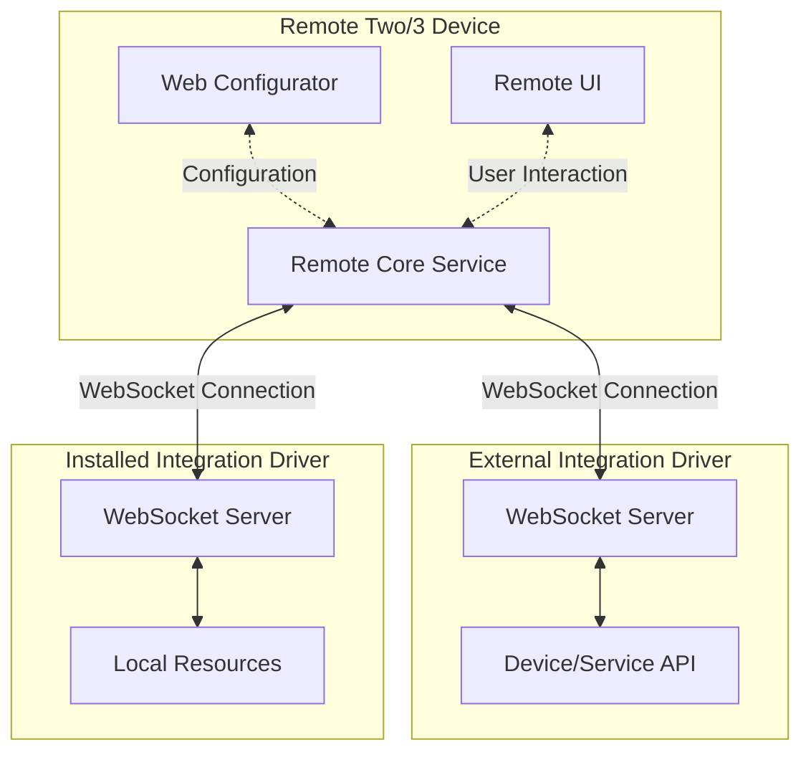
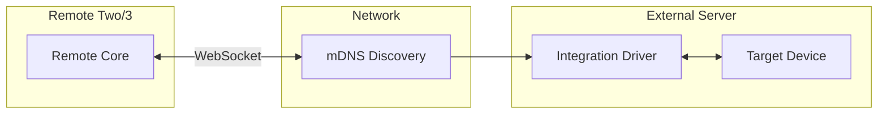
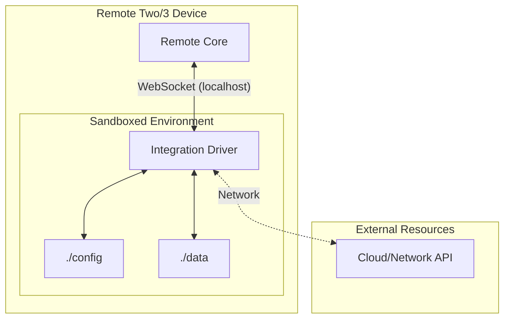
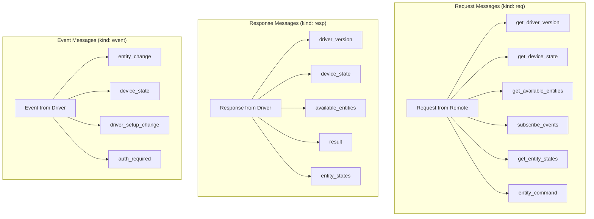
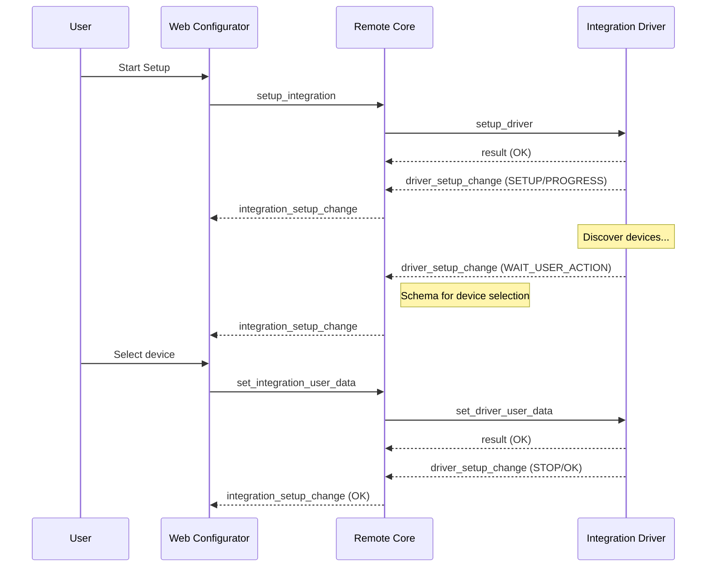
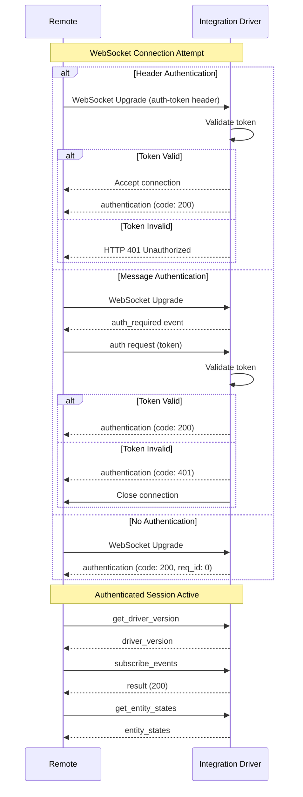
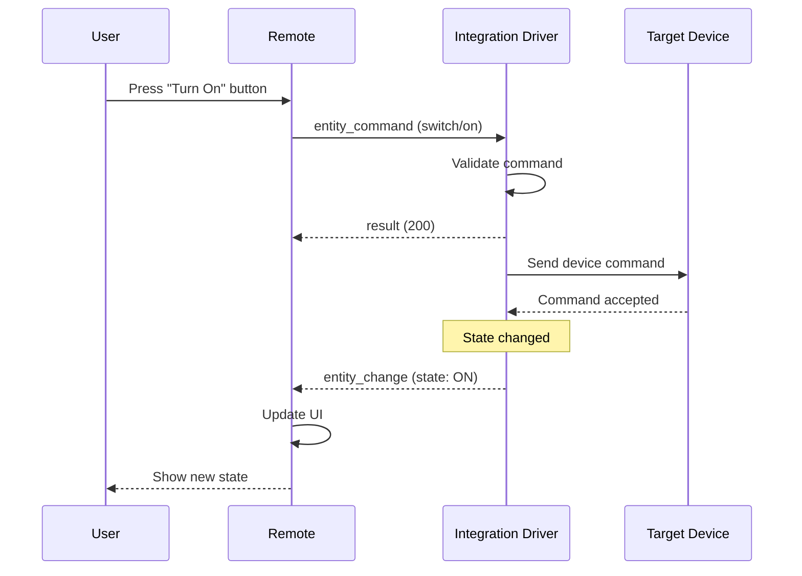

# Deep Dive: Unfolded Circle Integration Libraries

A comprehensive technical analysis of the Unfolded Circle Integration AsyncAPI, architecture patterns, and best practices for developing integration drivers.

---

## Table of Contents

1. [Introduction](#introduction)
2. [Architecture Overview](#architecture-overview)
3. [Deployment Models: External vs. Installed Integrations](#deployment-models-external-vs-installed-integrations)
4. [The AsyncAPI Specification](#the-asyncapi-specification)
5. [Configuration Elements and Setup Data Schema](#configuration-elements-and-setup-data-schema)
6. [Core Message Flow](#core-message-flow)
7. [Rust Implementation Guide](#rust-implementation-guide)
8. [Common Gotchas and How to Avoid Them](#common-gotchas-and-how-to-avoid-them)
9. [Best Practices](#best-practices)
10. [Resources and References](#resources-and-references)

---

## Introduction

[Unfolded Circle](https://www.unfoldedcircle.com/) has developed a sophisticated ecosystem around their Remote Two and Remote 3 universal remote controls. At the heart of this ecosystem lies the **Integration API** — a WebSocket-based protocol that enables third-party developers to create integration drivers for virtually any device or service. This API allows the remote to control everything from smart home devices to media players, home automation hubs, and custom hardware.

The Integration API is defined using [AsyncAPI](https://www.asyncapi.com/), an open-source specification for defining asynchronous APIs. This choice reflects the event-driven nature of the integration architecture, where the remote and integration drivers communicate through real-time WebSocket messages rather than traditional request-response patterns.

### What This Document Covers

This deep dive explores the architectural foundations of the Unfolded Circle integration ecosystem, provides a detailed comparison of deployment strategies, explains how integrations express their configuration requirements, and offers practical guidance for developers building integration drivers in Rust.

---

## Architecture Overview

The Unfolded Circle integration architecture follows a client-server model where the integration driver acts as a **WebSocket server**, and the Remote device acts as a **WebSocket client**. This design choice is deliberate and enables several important capabilities.

### High-Level Architecture



### Key Architectural Principles

**Integration Driver as Server**: Unlike many IoT platforms where the hub acts as a server, Unfolded Circle's design places the integration driver in the server role. This means each integration driver must implement a WebSocket server that listens for incoming connections from the Remote. This approach provides several benefits, including allowing multiple Remotes to connect to a single integration (for multi-room setups), simplifying the integration driver's network topology, and enabling integration drivers to run on a wide variety of hardware platforms.

**Event-Driven Communication**: The protocol is fundamentally asynchronous. Once a connection is established, both parties can send events at any time. This is essential for home automation scenarios where device states change independently of user actions.

**Language Agnostic Design**: Because the API is defined at the protocol level (WebSocket with JSON payloads) rather than through a language-specific SDK, developers can implement integration drivers in any language that supports WebSocket servers and JSON processing.

### Protocol Stack

| Layer                | Technology           | Purpose                                              |
| -------------------- | -------------------- | ---------------------------------------------------- |
| Transport            | WebSocket (RFC 6455) | Bidirectional real-time communication                |
| Message Format       | JSON (UTF-8)         | Human-readable, language-agnostic data serialization |
| Application Protocol | Integration AsyncAPI | Semantic message definitions and flows               |
| Discovery            | mDNS/DNS-SD          | Local network service discovery                      |

---

## Deployment Models: External vs. Installed Integrations

Starting with firmware version 1.9.0, Unfolded Circle supports two distinct deployment models for integration drivers. Understanding the trade-offs between these models is crucial for making the right architectural decision for your integration.

### External Integration Drivers

External integration drivers run on a separate device accessible over the network, such as a Raspberry Pi, a home server, a NAS, or even a cloud service. The Remote discovers and connects to these drivers via the network.



#### Advantages of External Integration Drivers

**Easier Development and Debugging**: External drivers can be developed, tested, and debugged on a developer's local machine. Standard development tools, IDE debuggers, and logging infrastructure work without modification. This significantly reduces the development iteration cycle.

**Flexible Runtime Environment**: The integration driver can leverage any libraries, frameworks, or system packages available on the host system. There are no restrictions on runtime dependencies, and developers can use any version of Python, Node.js, or other runtimes.

**Unlimited Resource Access**: External drivers have access to the full resources of their host system. This includes file system access, network capabilities, and the ability to spawn additional processes if needed.

**Simpler Updates**: Updates to external integration drivers can be deployed independently of the Remote firmware. Users can update the driver without touching the Remote, and developers can release updates on their own schedule.

**No Resource Competition**: External drivers do not compete for memory, CPU, or storage with other integrations on the Remote device.

#### Disadvantages of External Integration Drivers

**Network Dependency**: The Remote must maintain a network connection to the integration driver. Network issues, IP address changes, or server downtime can disrupt the integration. This introduces a potential point of failure in the system.

**Additional Hardware Required**: Users must have a device to host the integration driver. This adds cost and complexity to the setup, and introduces another device that requires power, network connectivity, and maintenance.

**More Complex User Setup**: Setting up an external integration requires users to install and configure software on another device. This may involve command-line operations, Docker containers, or other technical steps that can be intimidating for non-technical users.

**mDNS Discovery Challenges**: In some network configurations (VLANs, complex router setups, corporate networks), mDNS discovery may not work reliably. Users may need to manually configure connection parameters.

### Installed (Custom) Integration Drivers

Starting with firmware version 1.9.0, developers can package integration drivers to be installed directly on the Remote device. This is currently a developer preview feature with some limitations.



#### Advantages of Installed Integration Drivers

**No External Hardware Required**: The integration runs directly on the Remote, eliminating the need for additional servers or devices. This simplifies the user setup considerably — users can install the integration directly through the web configurator.

**Reduced Latency**: Communication between the Remote core and the integration driver happens over localhost, which is faster and more reliable than network communication. This can improve responsiveness for time-sensitive operations.

**Simplified Network Topology**: No need for mDNS discovery or network configuration. The Remote automatically manages the integration driver lifecycle.

**Self-Contained Solution**: The entire integration is packaged as a single archive file, making it easy to distribute and install. Users don't need to worry about runtime environments, dependencies, or server configuration.

#### Disadvantages of Installed Integration Drivers

**Restricted Sandbox Environment**: Installed drivers run in a sandboxed environment with limited access to system resources. This includes read-only access to the binary directory, limited writable directories (`$UC_CONFIG_HOME`, `$UC_DATA_HOME`, `/tmp`), and no access to system tools like shells or file utilities.

**Resource Constraints**: Custom integrations must operate within strict resource limits. A single integration should not use more than 100 MB of memory. CPU and memory restrictions are planned for future firmware updates. The maximum number of custom integrations is capped at 10.

**Complex Build Process**: Creating an installation archive requires careful packaging. The archive must follow a specific structure, include all dependencies, and meet size restrictions (maximum 100 MB for the archive, 32 KB for custom icons). Python integrations must bundle the Python runtime using tools like PyInstaller.

**Authentication Not Supported**: Custom integrations running on the Remote do not support authentication — the connection is implicitly trusted since it's local.

**Limited Update Path**: Currently, updating an installed integration requires removing and re-installing it. There's no in-place update mechanism yet.

### Comparison Summary

| Aspect                      | External Integration                              | Installed Integration                     |
| --------------------------- | ------------------------------------------------- | ----------------------------------------- |
| **Ease of Getting Started** | Requires additional hardware and setup            | Install directly through web configurator |
| **Development Experience**  | Full debugging tools, fast iteration              | Must build and upload archive for testing |
| **Reliability**             | Network dependency, potential connectivity issues | Local communication, more reliable        |
| **Upgrade Process**         | Independent updates, flexible                     | Remove and re-install (for now)           |
| **Resource Access**         | Full system access                                | Sandboxed, restricted                     |
| **Runtime Options**         | Any language/runtime                              | Node.js or static binary only             |
| **User Setup Complexity**   | Higher (requires server)                          | Lower (install from file)                 |
| **Network Discovery**       | mDNS required                                     | Not needed (localhost)                    |

### Recommendation

For most developers, **starting with an external integration driver** is recommended. This provides the best development experience and allows for rapid prototyping. Once the integration is stable and well-tested, consider packaging it as an installed integration for easier user deployment — especially for integrations that don't require heavy computational resources or complex system access.

---

## The AsyncAPI Specification

The Integration API is formally defined in an [AsyncAPI YAML specification](https://github.com/unfoldedcircle/core-api/blob/main/integration-api/UCR-integration-asyncapi.yaml). This specification serves as the authoritative reference for the protocol and enables tooling support for developers.

### Viewing the Specification

There are several ways to explore the AsyncAPI specification:

- **[Integration AsyncAPI Viewer](https://unfoldedcircle.github.io/core-api/integration/)**: Official HTML documentation rendered from the YAML specification
- **[AsyncAPI Studio](https://studio.asyncapi.com/?url=https://raw.githubusercontent.com/unfoldedcircle/core-api/main/integration-api/UCR-integration-asyncapi.yaml)**: Interactive online tool that loads the YAML directly from GitHub and provides both documentation and visual exploration

### Message Types Overview

The API defines three primary message categories: requests, responses, and events. Understanding these categories is essential for implementing a compliant integration driver.



### Required Messages

The AsyncAPI specification marks required messages with a pizza emoji (🍕) in the documentation. Implementing only these messages is sufficient for a basic, functioning integration driver.

#### Required Requests (Must Be Handled by Driver)

| Request                  | Response               | Purpose                                               |
| ------------------------ | ---------------------- | ----------------------------------------------------- |
| `get_driver_version`     | `driver_version`       | Return driver identification and version information  |
| `get_device_state`       | `device_state` (event) | Return current connection status to target device(s)  |
| `get_available_entities` | `available_entities`   | List all entities this driver provides                |
| `subscribe_events`       | `result`               | Register for entity state change events               |
| `get_entity_states`      | `entity_states`        | Return current state of all configured entities       |
| `entity_command`         | `result`               | Execute a command on an entity (e.g., turn on, press) |

#### Required Events (Must Be Sent by Driver)

| Event           | Purpose                                              |
| --------------- | ---------------------------------------------------- |
| `entity_change` | Notify the Remote of entity state changes            |
| `device_state`  | Notify the Remote of driver/device connection status |

### Message Structure

All messages share a common structure with a `kind` field that distinguishes between requests, responses, and events.

**Request Message Structure**:

```json
{
  "kind": "req",
  "id": 123,
  "msg": "entity_command",
  "msg_data": {
    "entity_type": "switch",
    "entity_id": "switch-1",
    "cmd_id": "on"
  }
}
```

**Response Message Structure**:

```json
{
  "kind": "resp",
  "req_id": 123,
  "msg": "result",
  "code": 200
}
```

**Event Message Structure**:

```json
{
  "kind": "event",
  "msg": "entity_change",
  "cat": "ENTITY",
  "ts": "2024-01-15T10:30:00Z",
  "msg_data": {
    "entity_type": "switch",
    "entity_id": "switch-1",
    "attributes": {
      "state": "ON"
    }
  }
}
```

---

## Configuration Elements and Setup Data Schema

One of the most powerful features of the Integration API is its support for dynamic, interactive configuration through the `setup_data_schema` mechanism. This allows integration drivers to express their configuration requirements in a way that integrates seamlessly with the Remote's web configurator.

### The Setup Data Schema

The `setup_data_schema` is an optional object in the driver metadata that defines the initial setup screen presented to users when configuring the integration. This schema can range from a simple informational page to a complex, multi-step wizard with dynamic screens.

### Schema Structure

The schema follows a declarative format that describes the UI elements and their properties:

```json
{
  "setup_data_schema": {
    "title": {
      "en": "Integration Setup",
      "de": "Integrationssetup"
    },
    "settings": [
      {
        "id": "host",
        "label": {
          "en": "Device IP Address"
        },
        "field": {
          "text": {
            "value": "",
            "required": true
          }
        }
      },
      {
        "id": "port",
        "label": {
          "en": "Port Number"
        },
        "field": {
          "number": {
            "value": 8080,
            "min": 1,
            "max": 65535
          }
        }
      },
      {
        "id": "token",
        "label": {
          "en": "API Token"
        },
        "field": {
          "password": {
            "value": "",
            "required": true
          }
        }
      }
    ]
  }
}
```

### Available Field Types

The schema supports several field types, each with specific properties that control validation and presentation:

| Field Type | Purpose                | Properties                                      |
| ---------- | ---------------------- | ----------------------------------------------- |
| `text`     | Single-line text input | `value`, `required`, `placeholder`              |
| `password` | Masked text input      | `value`, `required`, `placeholder`              |
| `number`   | Numeric input          | `value`, `min`, `max`, `step`                   |
| `checkbox` | Boolean toggle         | `value` (true/false)                            |
| `select`   | Dropdown selection     | `value`, `options` (array of label/value pairs) |
| `label`    | Read-only text display | `value` (can be localized)                      |

### Dynamic Setup Flow

For integrations requiring more sophisticated configuration, the API supports a dynamic setup flow where the driver can present multiple screens based on user input and discovered devices.



### Rust Example: Defining a Setup Schema

Here's how you might define a setup schema in Rust using the `api-model-rs` crate:

```rust
use serde::{Deserialize, Serialize};
use std::collections::HashMap;

/// Represents a localized string with language code keys
#[derive(Debug, Clone, Serialize, Deserialize)]
pub struct LocalizedText(HashMap<String, String>);

impl LocalizedText {
    pub fn new() -> Self {
        Self(HashMap::new())
    }
    
    pub fn with_text(mut self, lang: &str, text: &str) -> Self {
        self.0.insert(lang.to_string(), text.to_string());
        self
    }
    
    pub fn english(text: &str) -> Self {
        Self::new().with_text("en", text)
    }
}

/// Field types for the setup schema
#[derive(Debug, Clone, Serialize, Deserialize)]
#[serde(tag = "type", rename_all = "snake_case")]
pub enum SetupField {
    Text {
        value: String,
        #[serde(skip_serializing_if = "Option::is_none")]
        required: Option<bool>,
        #[serde(skip_serializing_if = "Option::is_none")]
        placeholder: Option<LocalizedText>,
    },
    Password {
        value: String,
        #[serde(skip_serializing_if = "Option::is_none")]
        required: Option<bool>,
    },
    Number {
        value: i64,
        #[serde(skip_serializing_if = "Option::is_none")]
        min: Option<i64>,
        #[serde(skip_serializing_if = "Option::is_none")]
        max: Option<i64>,
    },
    Checkbox {
        value: bool,
    },
    Select {
        value: String,
        options: Vec<SelectOption>,
    },
    Label {
        value: LocalizedText,
    },
}

#[derive(Debug, Clone, Serialize, Deserialize)]
pub struct SelectOption {
    pub label: LocalizedText,
    pub value: String,
}

/// A single setting in the setup schema
#[derive(Debug, Clone, Serialize, Deserialize)]
pub struct SetupSetting {
    pub id: String,
    pub label: LocalizedText,
    pub field: HashMap<String, SetupField>,
}

/// The complete setup data schema
#[derive(Debug, Clone, Serialize, Deserialize)]
pub struct SetupDataSchema {
    pub title: LocalizedText,
    pub settings: Vec<SetupSetting>,
}

/// Builder for creating setup schemas
pub struct SetupSchemaBuilder {
    title: LocalizedText,
    settings: Vec<SetupSetting>,
}

impl SetupSchemaBuilder {
    pub fn new(title: impl Into<String>) -> Self {
        Self {
            title: LocalizedText::english(&title.into()),
            settings: Vec::new(),
        }
    }
    
    pub fn with_localized_title(mut self, title: LocalizedText) -> Self {
        self.title = title;
        self
    }
    
    pub fn add_text_field(
        mut self,
        id: &str,
        label: &str,
        required: bool,
    ) -> Self {
        self.settings.push(SetupSetting {
            id: id.to_string(),
            label: LocalizedText::english(label),
            field: vec![(
                "text".to_string(),
                SetupField::Text {
                    value: String::new(),
                    required: Some(required),
                    placeholder: None,
                },
            )]
            .into_iter()
            .collect(),
        });
        self
    }
    
    pub fn add_password_field(
        mut self,
        id: &str,
        label: &str,
        required: bool,
    ) -> Self {
        self.settings.push(SetupSetting {
            id: id.to_string(),
            label: LocalizedText::english(label),
            field: vec![(
                "password".to_string(),
                SetupField::Password {
                    value: String::new(),
                    required: Some(required),
                },
            )]
            .into_iter()
            .collect(),
        });
        self
    }
    
    pub fn add_number_field(
        mut self,
        id: &str,
        label: &str,
        default: i64,
        min: Option<i64>,
        max: Option<i64>,
    ) -> Self {
        self.settings.push(SetupSetting {
            id: id.to_string(),
            label: LocalizedText::english(label),
            field: vec![(
                "number".to_string(),
                SetupField::Number {
                    value: default,
                    min,
                    max,
                },
            )]
            .into_iter()
            .collect(),
        });
        self
    }
    
    pub fn add_info_label(mut self, text: &str) -> Self {
        self.settings.push(SetupSetting {
            id: format!("info_{}", self.settings.len()),
            label: LocalizedText::english(""),
            field: vec![(
                "label".to_string(),
                SetupField::Label {
                    value: LocalizedText::english(text),
                },
            )]
            .into_iter()
            .collect(),
        });
        self
    }
    
    pub fn build(self) -> SetupDataSchema {
        SetupDataSchema {
            title: self.title,
            settings: self.settings,
        }
    }
}

// Example usage
fn create_media_player_schema() -> SetupDataSchema {
    SetupSchemaBuilder::new("Media Player Setup")
        .add_info_label("Enter your media player's network address and API credentials.")
        .add_text_field("host", "IP Address or Hostname", true)
        .add_number_field("port", "Port", 8080, Some(1), Some(65535))
        .add_password_field("api_key", "API Key", true)
        .build()
}

#[cfg(test)]
mod tests {
    use super::*;
    
    #[test]
    fn test_schema_serialization() {
        let schema = create_media_player_schema();
        let json = serde_json::to_string_pretty(&schema).unwrap();
        println!("{}", json);
        
        // Verify it can be deserialized back
        let deserialized: SetupDataSchema = serde_json::from_str(&json).unwrap();
        assert_eq!(deserialized.settings.len(), 4);
    }
}
```

---

## Core Message Flow

Understanding the message flow between the Remote and an integration driver is essential for implementing a robust integration. This section walks through the key sequences.

### Connection Establishment

The connection sequence varies depending on whether authentication is required and what type of authentication is used.



### Entity Command Flow

When a user interacts with an entity (e.g., pressing a button or toggling a switch), the Remote sends an `entity_command` message to the integration driver.



### State Synchronization Flow

The Remote requests state synchronization in several scenarios: after connecting, after waking from standby, and periodically if configured. The integration driver should efficiently return the current state of all configured entities.

```rust
/// Example: Handling get_entity_states request
use serde_json::{json, Value};

fn handle_get_entity_states(
    request_id: u64,
    entities: &HashMap<String, Entity>,
    configured_ids: &[String],
) -> Value {
    let entity_states: Vec<Value> = configured_ids
        .iter()
        .filter_map(|id| entities.get(id))
        .map(|entity| {
            json!({
                "entity_id": entity.id,
                "entity_type": entity.entity_type,
                "attributes": entity.current_attributes()
            })
        })
        .collect();
    
    json!({
        "kind": "resp",
        "req_id": request_id,
        "msg": "entity_states",
        "code": 200,
        "msg_data": {
            "entity_states": entity_states
        }
    })
}
```

---

## Rust Implementation Guide

The [`api-model-rs` crate](./api-model-rs.md) from Unfolded Circle provides type definitions for the Integration API, making it easier to build integration drivers in Rust. This section provides practical guidance for implementing a complete integration driver.

### Project Setup

Add the dependency to your `Cargo.toml`:

```toml
[dependencies]
unfolded-circle-api = "0.16"
tokio = { version = "1", features = ["full"] }
tokio-tungstenite = "0.21"
serde = { version = "1", features = ["derive"] }
serde_json = "1"
tracing = "0.1"
tracing-subscriber = "0.3"
```

### Basic Integration Driver Structure

Here's a skeleton for a complete integration driver in Rust:

```rust
use std::collections::HashMap;
use std::sync::Arc;
use tokio::sync::{broadcast, RwLock};
use tokio::net::TcpListener;
use tokio_tungstenite::{accept_hdr_async, tungstenite::protocol::WebSocketConfig};
use tokio_tungstenite::tungstenite::handshake::server::{Request, Response};
use tokio_tungstenite::tungstenite::Message;
use serde::{Deserialize, Serialize};
use tracing::{debug, error, info, warn};

/// Represents the state of an entity
#[derive(Debug, Clone, Serialize, Deserialize)]
pub struct EntityState {
    pub entity_id: String,
    pub entity_type: String,
    pub attributes: HashMap<String, serde_json::Value>,
}

/// Represents an available entity
#[derive(Debug, Clone, Serialize, Deserialize)]
pub struct AvailableEntity {
    pub entity_id: String,
    pub entity_type: String,
    pub name: HashMap<String, String>,
    #[serde(skip_serializing_if = "Option::is_none")]
    pub features: Option<Vec<String>>,
}

/// Integration driver metadata
#[derive(Debug, Clone, Serialize, Deserialize)]
pub struct DriverMetadata {
    pub driver_id: String,
    pub name: HashMap<String, String>,
    pub version: String,
    pub min_core_api: String,
    #[serde(skip_serializing_if = "Option::is_none")]
    pub icon: Option<String>,
    #[serde(skip_serializing_if = "Option::is_none")]
    pub description: Option<HashMap<String, String>>,
}

/// The integration driver core
pub struct IntegrationDriver {
    metadata: DriverMetadata,
    entities: Arc<RwLock<HashMap<String, AvailableEntity>>>,
    entity_states: Arc<RwLock<HashMap<String, EntityState>>>,
    subscribers: Arc<RwLock<Vec<broadcast::Sender<Message>>>>,
    config: DriverConfig,
}

#[derive(Debug, Clone)]
pub struct DriverConfig {
    pub port: u16,
    pub host: String,
    pub auth_token: Option<String>,
}

impl IntegrationDriver {
    pub fn new(metadata: DriverMetadata, config: DriverConfig) -> Self {
        Self {
            metadata,
            entities: Arc::new(RwLock::new(HashMap::new())),
            entity_states: Arc::new(RwLock::new(HashMap::new())),
            subscribers: Arc::new(RwLock::new(Vec::new())),
            config,
        }
    }
    
    /// Add an entity to the driver
    pub async fn add_entity(&self, entity: AvailableEntity, initial_state: EntityState) {
        let id = entity.entity_id.clone();
        self.entities.write().await.insert(id.clone(), entity);
        self.entity_states.write().await.insert(id, initial_state);
    }
    
    /// Update an entity's state and notify subscribers
    pub async fn update_entity_state(
        &self,
        entity_id: &str,
        attributes: HashMap<String, serde_json::Value>,
    ) {
        // Update internal state
        if let Some(state) = self.entity_states.write().await.get_mut(entity_id) {
            state.attributes = attributes.clone();
        }
        
        // Broadcast change event to all connected remotes
        let event = serde_json::to_string(&serde_json::json!({
            "kind": "event",
            "msg": "entity_change",
            "cat": "ENTITY",
            "msg_data": {
                "entity_id": entity_id,
                "attributes": attributes
            }
        })).unwrap();
        
        let subscribers = self.subscribers.read().await;
        for tx in subscribers.iter() {
            let _ = tx.send(Message::Text(event.clone()));
        }
    }
    
    /// Handle incoming WebSocket message
    async fn handle_message(
        &self,
        msg: &str,
        tx: &broadcast::Sender<Message>,
    ) -> Option<String> {
        let parsed: serde_json::Value = match serde_json::from_str(msg) {
            Ok(v) => v,
            Err(e) => {
                warn!("Failed to parse message: {}", e);
                return None;
            }
        };
        
        let kind = parsed["kind"].as_str()?;
        let request_id = parsed["id"].as_u64()?;
        let msg_type = parsed["msg"].as_str()?;
        
        match msg_type {
            "get_driver_version" => self.handle_get_driver_version(request_id).await,
            "get_driver_metadata" => self.handle_get_driver_metadata(request_id).await,
            "get_device_state" => self.handle_get_device_state(request_id).await,
            "get_available_entities" => self.handle_get_available_entities(request_id).await,
            "subscribe_events" => {
                self.handle_subscribe_events(request_id, tx).await
            }
            "get_entity_states" => self.handle_get_entity_states(request_id).await,
            "entity_command" => {
                self.handle_entity_command(request_id, &parsed["msg_data"]).await
            }
            "auth" => self.handle_auth(request_id, &parsed["msg_data"]).await,
            _ => {
                warn!("Unknown message type: {}", msg_type);
                Some(self.create_error_response(request_id, 400, "Unknown message type"))
            }
        }
    }
    
    async fn handle_get_driver_version(&self, request_id: u64) -> Option<String> {
        Some(serde_json::to_string(&serde_json::json!({
            "kind": "resp",
            "req_id": request_id,
            "msg": "driver_version",
            "code": 200,
            "msg_data": {
                "name": self.metadata.name,
                "version": {
                    "api": "0.14.0",
                    "driver": self.metadata.version
                }
            }
        })).unwrap())
    }
    
    async fn handle_get_driver_metadata(&self, request_id: u64) -> Option<String> {
        Some(serde_json::to_string(&serde_json::json!({
            "kind": "resp",
            "req_id": request_id,
            "msg": "driver_metadata",
            "code": 200,
            "msg_data": self.metadata
        })).unwrap())
    }
    
    async fn handle_get_device_state(&self, request_id: u64) -> Option<String> {
        // For this example, we're always "ready"
        Some(serde_json::to_string(&serde_json::json!({
            "kind": "event",
            "msg": "device_state",
            "msg_data": {
                "state": "READY"
            }
        })).unwrap())
    }
    
    async fn handle_get_available_entities(&self, request_id: u64) -> Option<String> {
        let entities = self.entities.read().await;
        let entity_list: Vec<_> = entities.values().cloned().collect();
        
        Some(serde_json::to_string(&serde_json::json!({
            "kind": "resp",
            "req_id": request_id,
            "msg": "available_entities",
            "code": 200,
            "msg_data": {
                "available_entities": entity_list
            }
        })).unwrap())
    }
    
    async fn handle_subscribe_events(
        &self,
        request_id: u64,
        tx: &broadcast::Sender<Message>,
    ) -> Option<String> {
        // Add sender to subscribers
        self.subscribers.write().await.push(tx.clone());
        
        Some(serde_json::to_string(&serde_json::json!({
            "kind": "resp",
            "req_id": request_id,
            "msg": "result",
            "code": 200
        })).unwrap())
    }
    
    async fn handle_get_entity_states(&self, request_id: u64) -> Option<String> {
        let states = self.entity_states.read().await;
        let state_list: Vec<_> = states.values().cloned().collect();
        
        Some(serde_json::to_string(&serde_json::json!({
            "kind": "resp",
            "req_id": request_id,
            "msg": "entity_states",
            "code": 200,
            "msg_data": {
                "entity_states": state_list
            }
        })).unwrap())
    }
    
    async fn handle_entity_command(
        &self,
        request_id: u64,
        msg_data: &serde_json::Value,
    ) -> Option<String> {
        let entity_id = msg_data["entity_id"].as_str()?;
        let cmd_id = msg_data["cmd_id"].as_str()?;
        
        info!("Entity command: {} -> {}", entity_id, cmd_id);
        
        // TODO: Implement actual command execution
        // This is where you'd send commands to your target device
        
        Some(serde_json::to_string(&serde_json::json!({
            "kind": "resp",
            "req_id": request_id,
            "msg": "result",
            "code": 200
        })).unwrap())
    }
    
    async fn handle_auth(&self, request_id: u64, msg_data: &serde_json::Value) -> Option<String> {
        let token = msg_data["token"].as_str().unwrap_or("");
        
        let code = if let Some(expected) = &self.config.auth_token {
            if token == expected { 200 } else { 401 }
        } else {
            200 // No auth required
        };
        
        Some(serde_json::to_string(&serde_json::json!({
            "kind": "resp",
            "req_id": request_id,
            "msg": "authentication",
            "code": code,
            "msg_data": {
                "name": self.metadata.name,
                "version": {
                    "api": "0.14.0",
                    "driver": self.metadata.version
                }
            }
        })).unwrap())
    }
    
    fn create_error_response(&self, request_id: u64, code: u16, message: &str) -> String {
        serde_json::to_string(&serde_json::json!({
            "kind": "resp",
            "req_id": request_id,
            "msg": "result",
            "code": code,
            "msg_data": {
                "message": message
            }
        })).unwrap()
    }
    
    /// Run the WebSocket server
    pub async fn run(&self) -> Result<(), Box<dyn std::error::Error>> {
        let addr = format!("{}:{}", self.config.host, self.config.port);
        let listener = TcpListener::bind(&addr).await?;
        
        info!("Integration driver listening on {}", addr);
        
        loop {
            let (stream, addr) = listener.accept().await?;
            info!("New connection from {}", addr);
            
            let entities = self.entities.clone();
            let entity_states = self.entity_states.clone();
            let subscribers = self.subscribers.clone();
            let metadata = self.metadata.clone();
            let config = self.config.clone();
            
            tokio::spawn(async move {
                // Handle WebSocket upgrade with optional header auth
                let ws_stream = match accept_hdr_async(stream, |req: &Request, mut resp: Response| {
                    // Check for auth-token header if required
                    if let Some(expected_token) = &config.auth_token {
                        if let Some(token) = req.headers().get("auth-token") {
                            if token != expected_token {
                                *resp.status_mut() = http::StatusCode::UNAUTHORIZED;
                                return Err(tungstenite::handshake::server::ErrorResponse::new(
                                    http::StatusCode::UNAUTHORIZED
                                ));
                            }
                        }
                    }
                    Ok(resp)
                }).await {
                    Ok(ws) => ws,
                    Err(e) => {
                        warn!("WebSocket handshake failed: {}", e);
                        return;
                    }
                };
                
                let (mut ws_sender, mut ws_receiver) = ws_stream.split();
                let (tx, mut rx) = broadcast::channel::<Message>(100);
                
                // Send auth_required if no header auth
                if config.auth_token.is_none() {
                    let auth_event = serde_json::to_string(&serde_json::json!({
                        "kind": "event",
                        "msg": "auth_required",
                        "msg_data": {
                            "name": metadata.name,
                            "version": {
                                "api": "0.14.0",
                                "driver": metadata.version
                            }
                        }
                    })).unwrap();
                    
                    if ws_sender.send(Message::Text(auth_event)).await.is_err() {
                        return;
                    }
                }
                
                // Message handling loop
                while let Some(msg_result) = ws_receiver.next().await {
                    match msg_result {
                        Ok(Message::Text(text)) => {
                            // Process message and send response
                            // ... (implementation continues)
                        }
                        Ok(Message::Ping(data)) => {
                            let _ = ws_sender.send(Message::Pong(data)).await;
                        }
                        Ok(Message::Close(_)) => break,
                        Err(e) => {
                            error!("WebSocket error: {}", e);
                            break;
                        }
                        _ => {}
                    }
                }
            });
        }
    }
}

#[tokio::main]
async fn main() -> Result<(), Box<dyn std::error::Error>> {
    tracing_subscriber::fmt::init();
    
    let metadata = DriverMetadata {
        driver_id: "example-driver".to_string(),
        name: vec![("en".to_string(), "Example Driver".to_string())]
            .into_iter()
            .collect(),
        version: "1.0.0".to_string(),
        min_core_api: "0.14.0".to_string(),
        icon: None,
        description: Some(
            vec![("en".to_string(), "An example integration driver".to_string())]
                .into_iter()
                .collect(),
        ),
    };
    
    let config = DriverConfig {
        port: 8080,
        host: "0.0.0.0".to_string(),
        auth_token: None,
    };
    
    let driver = IntegrationDriver::new(metadata, config);
    
    // Add some example entities
    driver.add_entity(
        AvailableEntity {
            entity_id: "switch-1".to_string(),
            entity_type: "switch".to_string(),
            name: vec![("en".to_string(), "Living Room Light".to_string())]
                .into_iter()
                .collect(),
            features: Some(vec!["toggle".to_string()]),
        },
        EntityState {
            entity_id: "switch-1".to_string(),
            entity_type: "switch".to_string(),
            attributes: vec![("state".to_string(), serde_json::json!("OFF"))]
                .into_iter()
                .collect(),
        },
    ).await;
    
    driver.run().await
}
```

---

## Common Gotchas and How to Avoid Them

Developing integration drivers involves several subtle challenges. This section documents common pitfalls and provides strategies for avoiding them.

### 1. WebSocket Ping/Pong Handling

**The Problem**: The Remote continuously sends WebSocket Ping frames and automatically closes connections that don't respond with Pong frames within a timeout period. Many WebSocket libraries handle this automatically, but some require explicit configuration.

**The Solution**: Ensure your WebSocket server properly responds to Ping frames. Most mature WebSocket libraries (like `tokio-tungstenite` in Rust, `ws` in Node.js, or `websockets` in Python) handle this automatically. If you're implementing low-level WebSocket handling, you must explicitly respond to Ping frames:

```rust
// In your message handling loop
match message {
    Message::Ping(data) => {
        // Respond with Pong - most libraries do this automatically
        sender.send(Message::Pong(data)).await?;
    }
    // ... other message types
}
```

**Additional Consideration**: Your integration driver should also send periodic Ping frames to detect stale connections. This is especially important for integrations that run for extended periods.

### 2. Request ID Tracking

**The Problem**: Every request message must include a unique `id` that is increased for each new request. The response must include this ID in the `req_id` field. Failing to properly track and return request IDs leads to protocol errors.

**The Solution**: Implement proper request ID handling from the start:

```rust
use std::sync::atomic::{AtomicU64, Ordering};

pub struct RequestIdGenerator {
    counter: AtomicU64,
}

impl RequestIdGenerator {
    pub fn new() -> Self {
        Self {
            counter: AtomicU64::new(1),
        }
    }
    
    pub fn next(&self) -> u64 {
        self.counter.fetch_add(1, Ordering::SeqCst)
    }
}

// When responding, always use the request's ID, not a new one
fn create_response(request_id: u64, msg_type: &str, code: u16) -> Value {
    json!({
        "kind": "resp",
        "req_id": request_id,  // This must match the request
        "msg": msg_type,
        "code": code
    })
}
```

### 3. Authentication Edge Cases

**The Problem**: The authentication flow has several variations, and mishandling any of them can cause connection failures.

**Case 1**: If your driver doesn't require authentication, you still must send an `authentication` response with `code: 200` and `req_id: 0` immediately after the WebSocket connection is established.

**Case 2**: If using message-based authentication, the `auth_required` event must be sent before any other message.

**Case 3**: Header-based authentication is preferred when possible, as it's cleaner and occurs during the WebSocket upgrade.

```rust
// Correct handling for no-auth drivers
async fn handle_new_connection(&self, ws: &mut WebSocket) {
    // For drivers without authentication, immediately send success
    let auth_response = json!({
        "kind": "resp",
        "req_id": 0,
        "msg": "authentication",
        "code": 200,
        "msg_data": {
            "name": self.metadata.name,
            "version": {
                "api": "0.14.0",
                "driver": self.metadata.version
            }
        }
    });
    
    ws.send(Message::Text(serde_json::to_string(&auth_response).unwrap()))
        .await
        .ok();
}
```

### 4. Device State vs. Entity States

**The Problem**: Developers often confuse `device_state` with entity states. These serve different purposes.

- **`device_state`**: Represents the connection state between the integration driver and its target system (e.g., "READY" if connected to Home Assistant, "ERROR" if the connection is down).

- **Entity states**: Represent the state of individual devices/features (e.g., a light being ON or OFF).

**The Solution**: Clearly separate these concepts in your implementation:

```rust
enum DeviceConnectionState {
    Connecting,
    Ready,
    Unavailable,
    Error { message: String },
}

impl DeviceConnectionState {
    fn to_api_string(&self) -> &'static str {
        match self {
            Self::Connecting => "CONNECTING",
            Self::Ready => "READY",
            Self::Unavailable => "UNAVAILABLE",
            Self::Error { .. } => "ERROR",
        }
    }
}

// When the target device disconnects, send device_state event
async fn on_device_disconnect(&self) {
    let event = json!({
        "kind": "event",
        "msg": "device_state",
        "msg_data": {
            "state": "UNAVAILABLE"
        }
    });
    self.broadcast_event(&event).await;
}

// When an entity changes, send entity_change event
async fn on_light_toggle(&self, entity_id: &str, is_on: bool) {
    let event = json!({
        "kind": "event",
        "msg": "entity_change",
        "msg_data": {
            "entity_id": entity_id,
            "attributes": {
                "state": if is_on { "ON" } else { "OFF" }
            }
        }
    });
    self.broadcast_event(&event).await;
}
```

### 5. Standby Mode Disconnection

**The Problem**: The Remote may disconnect WebSocket connections when entering standby mode. Your integration driver must handle reconnections gracefully.

**The Solution**: Implement connection state tracking and automatic reconnection handling:

```rust
pub struct ConnectionHandler {
    is_connected: bool,
    last_activity: Instant,
    subscribed_entities: HashSet<String>,
}

impl ConnectionHandler {
    pub fn on_connect(&mut self) {
        self.is_connected = true;
        self.last_activity = Instant::now();
        info!("Remote connected");
    }
    
    pub fn on_disconnect(&mut self) {
        self.is_connected = false;
        info!("Remote disconnected (may be in standby)");
    }
    
    pub fn on_standby(&mut self) {
        // Remote is entering standby - expect possible disconnection
        info!("Remote entering standby mode");
    }
    
    pub fn on_wake(&mut self) {
        // Remote is waking up - may request state refresh
        info!("Remote waking from standby");
    }
}
```

### 6. Entity ID Persistence

**The Problem**: Entity IDs must remain stable across driver restarts. If your integration discovers entities dynamically, changing their IDs between restarts will break user configurations.

**The Solution**: Use deterministic, stable identifiers based on immutable properties of the target device:

```rust
// Bad: Using array index or discovery order
let entity_id = format!("light-{}", index); // Unstable!

// Good: Using device's unique identifier
let entity_id = format!("light-{}", device.mac_address); // Stable

// Better: Creating a hash from multiple stable properties
use sha2::{Sha256, Digest};

fn create_stable_entity_id(device: &DiscoveredDevice) -> String {
    let mut hasher = Sha256::new();
    hasher.update(device.mac_address.as_bytes());
    hasher.update(device.model.as_bytes());
    let hash = hasher.finalize();
    format!("light-{:x}", &hash[..8])
}
```

### 7. Memory Management for Installed Integrations

**The Problem**: Installed integrations run in a resource-constrained sandbox. Memory usage above 100 MB can cause issues.

**The Solution**: Be mindful of memory usage, especially when:

- Caching large amounts of entity state data
- Maintaining connection pools
- Storing historical data

```rust
// Use bounded collections
use lru::LruCache;
use std::num::NonZeroUsize;

pub struct EntityCache {
    // Limit cached entities to prevent unbounded memory growth
    states: LruCache<String, EntityState>,
}

impl EntityCache {
    pub fn new(max_entities: usize) -> Self {
        Self {
            states: LruCache::new(NonZeroUsize::new(max_entities).unwrap()),
        }
    }
    
    pub fn get(&mut self, id: &str) -> Option<&EntityState> {
        self.states.get(id)
    }
    
    pub fn insert(&mut self, id: String, state: EntityState) {
        self.states.put(id, state);
    }
}
```

### 8. Error Response Codes

**The Problem**: Using incorrect HTTP-style error codes in responses can cause unexpected behavior in the Remote.

**The Solution**: Follow the standard HTTP status code conventions as documented:

| Code | Meaning             | When to Use                             |
| ---- | ------------------- | --------------------------------------- |
| 200  | OK                  | Request succeeded                       |
| 400  | Bad Request         | Malformed message or invalid parameters |
| 401  | Unauthorized        | Authentication failed                   |
| 404  | Not Found           | Entity or resource doesn't exist        |
| 500  | Internal Error      | Unexpected server error                 |
| 503  | Service Unavailable | Target device is unreachable            |

```rust
fn create_error_response(request_id: u64, code: u16, message: &str) -> Value {
    json!({
        "kind": "resp",
        "req_id": request_id,
        "msg": "result",
        "code": code,
        "msg_data": {
            "code": match code {
                400 => "INV_ARGUMENT",
                401 => "AUTH_FAILED",
                404 => "NOT_FOUND",
                503 => "UNAVAILABLE",
                _ => "UNKNOWN_ERROR"
            },
            "message": message
        }
    })
}
```

---

## Best Practices

### Code Organization

Structure your integration driver with clear separation of concerns:

```
src/
├── main.rs              # Entry point and server setup
├── driver.rs            # Driver core logic and metadata
├── entities/
│   ├── mod.rs
│   ├── switch.rs        # Switch entity implementation
│   ├── light.rs         # Light entity implementation
│   └── media_player.rs  # Media player entity implementation
├── protocol/
│   ├── mod.rs
│   ├── messages.rs      # Message type definitions
│   └── handler.rs       # Message routing and handling
├── device/
│   ├── mod.rs
│   └── client.rs        # Target device communication
└── config.rs            # Configuration handling
```

### Logging

Implement comprehensive logging for debugging and troubleshooting:

```rust
use tracing::{debug, error, info, instrument, warn};

impl IntegrationDriver {
    #[instrument(skip(self))]
    async fn handle_entity_command(
        &self,
        request_id: u64,
        msg_data: &Value,
    ) -> Option<String> {
        let entity_id = msg_data["entity_id"].as_str().unwrap_or("unknown");
        let cmd_id = msg_data["cmd_id"].as_str().unwrap_or("unknown");
        
        debug!(
            entity_id = %entity_id,
            command = %cmd_id,
            "Processing entity command"
        );
        
        match self.execute_command(entity_id, cmd_id, msg_data["params"].clone()).await {
            Ok(_) => {
                info!(entity_id = %entity_id, command = %cmd_id, "Command executed successfully");
                Some(self.create_success_response(request_id))
            }
            Err(e) => {
                error!(entity_id = %entity_id, command = %cmd_id, error = %e, "Command failed");
                Some(self.create_error_response(request_id, 500, &e.to_string()))
            }
        }
    }
}
```

### Testing

Write comprehensive tests for your integration driver:

```rust
#[cfg(test)]
mod tests {
    use super::*;
    use tokio_tungstenite::tungstenite::Message;
    
    fn create_test_driver() -> IntegrationDriver {
        IntegrationDriver::new(
            DriverMetadata {
                driver_id: "test-driver".to_string(),
                name: vec![("en".to_string(), "Test Driver".to_string())]
                    .into_iter()
                    .collect(),
                version: "1.0.0".to_string(),
                min_core_api: "0.14.0".to_string(),
                icon: None,
                description: None,
            },
            DriverConfig {
                port: 0, // Random port for testing
                host: "127.0.0.1".to_string(),
                auth_token: None,
            },
        )
    }
    
    #[tokio::test]
    async fn test_get_driver_version() {
        let driver = create_test_driver();
        
        let response = driver
            .handle_message(
                r#"{"kind":"req","id":1,"msg":"get_driver_version"}"#,
                &broadcast::channel(1).0,
            )
            .await
            .unwrap();
        
        let parsed: Value = serde_json::from_str(&response).unwrap();
        assert_eq!(parsed["kind"], "resp");
        assert_eq!(parsed["req_id"], 1);
        assert_eq!(parsed["msg"], "driver_version");
        assert_eq!(parsed["code"], 200);
    }
    
    #[tokio::test]
    async fn test_entity_state_change() {
        let driver = create_test_driver();
        
        // Add an entity
        driver.add_entity(
            AvailableEntity {
                entity_id: "test-switch".to_string(),
                entity_type: "switch".to_string(),
                name: vec![("en".to_string(), "Test Switch".to_string())]
                    .into_iter()
                    .collect(),
                features: None,
            },
            EntityState {
                entity_id: "test-switch".to_string(),
                entity_type: "switch".to_string(),
                attributes: vec![("state".to_string(), json!("OFF"))]
                    .into_iter()
                    .collect(),
            },
        ).await;
        
        // Update state
        driver
            .update_entity_state("test-switch", vec![("state".to_string(), json!("ON"))].into_iter().collect())
            .await;
        
        // Verify state was updated
        let states = driver.entity_states.read().await;
        assert_eq!(states.get("test-switch").unwrap().attributes["state"], "ON");
    }
}
```

---

## Resources and References

### Official Documentation

- [Unfolded Circle API Documentation](https://unfoldedcircle.github.io/core-api/)
- [Integration AsyncAPI Viewer](https://unfoldedcircle.github.io/core-api/integration/)
- [AsyncAPI Studio](https://studio.asyncapi.com/?url=https://raw.githubusercontent.com/unfoldedcircle/core-api/main/integration-api/UCR-integration-asyncapi.yaml)
- [Core API GitHub Repository](https://github.com/unfoldedcircle/core-api)

### Libraries and Tools

| Language | Library                                                      | Description              |
| -------- | ------------------------------------------------------------ | ------------------------ |
| Rust     | [api-model-rs](https://github.com/unfoldedcircle/api-model-rs) | Official API models      |
| Rust     | [integration-home-assistant](https://github.com/unfoldedcircle/integration-home-assistant) | Reference implementation |
| Node.js  | [integration-node-library](https://github.com/unfoldedcircle/integration-node-library) | Official Node.js wrapper |
| Python   | [integration-python-library](https://github.com/unfoldedcircle/integration-python-library) | Official Python wrapper  |

### Example Integrations

- [Global Caché IR Integration](https://github.com/unfoldedcircle/integration-globalcache) (Node.js)
- [Roon Integration](https://github.com/unfoldedcircle/integration-roon) (Node.js)
- [Android TV Integration](https://github.com/unfoldedcircle/integration-androidtv) (Python)
- [Apple TV Integration](https://github.com/unfoldedcircle/integration-appletv) (Python)
- [Denon AVR Integration](https://github.com/unfoldedcircle/integration-denonavr) (Python)

### Community

- [Unfolded Circle Community Forum](https://unfolded.community/)
- [Discord Server](https://unfolded.chat/)
- [GitHub Issues](https://github.com/unfoldedcircle/core-api/issues) for bug reports and feature requests

---

## Conclusion

The Unfolded Circle Integration API provides a well-designed, language-agnostic protocol for building device integrations. By understanding the architecture, message flow, and common pitfalls documented in this guide, developers can create robust integrations that work seamlessly with Remote Two and Remote 3 devices.

The choice between external and installed integration drivers depends on your specific requirements: external drivers offer greater flexibility and easier development, while installed drivers provide a simpler user experience. Starting with an external driver during development and then packaging as an installed integration for distribution is often the best approach.

The Rust ecosystem, with the `api-model-rs` crate and the reference Home Assistant integration, provides excellent tooling for building production-quality integration drivers. Combined with Rust's performance characteristics and memory safety, this makes Rust an excellent choice for integration driver development.
