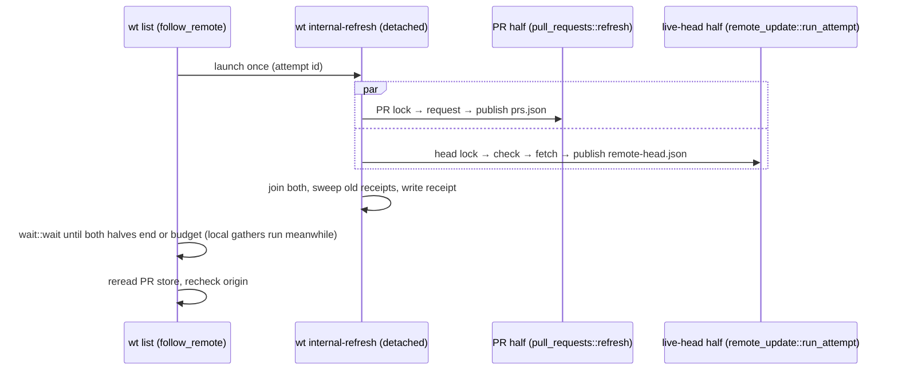

# `wt list`: Refresh Worker, Stores, and the Wait

Load before changing `pull_requests`, `remote_head`, `remote_update`,
`live_remote`, `cli/src/commands/refresh_worker.rs`, `list::follow_remote`, or
`list/wait.rs`. Local pipeline and rendering: [list.md](list.md).

## Invariants

- **The worker is the only writer of either store.** `wt list` makes no PR
  request of its own; there is no foreground request, no `writer` field, and no
  `--force`.
- `wt list` launches the worker **once** whenever there is an `origin`, and
  waits for **both** halves.
- A failure is never stored. A stored empty PR list is an answer.
- `FRESHNESS_WINDOW` only decides the age item; it never decides whether to ask.

## The worker (`wt internal-refresh <main checkout> [--attempt <id>]`)

- `cli/src/commands/refresh_worker.rs`. Ignores any path that is not a main
  checkout's top level. Without `--attempt` it makes its own id.
- Launched by `refresh_worker::launch(main, &LaunchArgs { attempt })` through
  `sniff::process::configure_detached_child`: null stdio, main checkout as cwd.
  The returned `WorkerHandle` only answers `has_exited`.
- Runs the PR half and the live-head half on two scoped threads, each joined
  separately with panics discarded, so neither blocks nor suppresses the other.
- On **every** attempt, after both halves join, it sweeps old receipts and
  writes the completion receipt (`refresh_worker::receipt_target`; none without
  an origin or default branch). A panicked half is recorded as failed; a failed
  receipt write leaves the store as the evidence.
- A repository in `~/.wt.json` makes no provider request in either half
  ([list.md](list.md#--ignore-api-api_preference)).

## Request credentials (`remote_head::CredentialEvidence`)

What a **successful** provider API request was sent with, recorded by the
worker from sniff's own per-request selection
(`sniff::remote::blocking::RequestCredentials` on `BranchHead` and
`OpenPullRequests`; see the sniff skill's remote page). Never a foreground
environment lookup: an adopted worker may have inherited another environment.

- Serialized as a tagged object: `{"state": "anonymous"}`,
  `{"state": "keyed", "variables": ["GH_TOKEN"]}`, `{"state": "unknown"}`.
  Never `Option`/`null`: absent and `null` are both malformed.
- `keyed` needs at least one name, and every name upper-case
  `[A-Z_][A-Z0-9_]*` (sniff's variables all are), so a token shaped value
  (`ghp_…` is mixed case) can never be stored. Writers refuse anything else.
- Read with `strict_json::nested` (a `Value` refuses an integer tag, and
  repeated keys spoil it).
- Only `anonymous` can produce the keyless notice; `unknown` (a migrated or
  pre-success record) never does.

## PR store (`pull_requests`, format 6)

- File: `<repo hash>.prs.json`, bound to `origin_digest`
  (`biscuit_hash::blake3_hash` of the exact `origin_url(main)` value, i.e.
  `git remote get-url origin` run against the main checkout). The raw URL is
  never stored.
- Every successful write stamps a new random `publication` id (`new_attempt_id`,
  32 lowercase hex) beside `fetched_at` (whole seconds, can repeat), and the
  request's `credentials` in the same atomic write (an empty answer too).
  `stored_publication(store, origin, now) -> Option<StoredPublication { id,
  credentials }>` reads both under `select_cached`'s rules.
- Format 5 (no `credentials`) is still read, with the same strictness, as
  `unknown`; formats 4 and older, and 7 and newer, are misses. A malformed,
  absent, or `null` `credentials` makes a format-6 publication a miss.
- Reader is strict: every field present; missing, wrongly typed, duplicate, or
  trailing content is a miss; unknown keys are ignored. Proven by
  `pull_requests::tests::the_store_reader_walks_the_input_robustness_matrix`
  (its `credentials` rows included) and
  `a_format_5_answer_is_served_with_unknown_credentials_and_a_future_format_is_a_miss`.
- `select_cached(store, origin, now)`: `Fresh` (< 60 s), `Stale` (>= 60 s,
  still shown), or `Miss` (none, corrupt, other format, future `fetched_at`,
  other or no origin).
- `OpenPrSource::fetch` returns `FetchedPrs { pull_requests, credentials }`.
- `refresh(store, main, clock, connect)` is the PR half:
  - asks whenever it wins the **nonblocking** PR lock (`REFRESH_DEADLINE` 10 s);
  - lock: `fs4` on the persistent sidecar `<repo hash>.prs.lock`
    (`pr_lock_path`, never deleted), held from before the request through
    publication, so contention makes no request;
  - stamps `fetched_at` at the request's start; stores only if `origin` still
    matches afterwards;
  - `RefreshOutcome::Failed` carries the `PrFailure`. `Unsupported` is a
    local-path or unsupported origin, kept out of `PrFailure` by
    `PrRequestError::from_unavailable`.

## Live-head store (`remote_head`, format 3)

- File: `<repo hash>.remote-head.json` = `{ format_version: 3, answer, attempt }`.
- `answer` = `{ origin_digest, branch, sha, checked_at, source: api|git|fetch }`
  for `origin`'s default branch. `sha: null` is a verified absence; object IDs
  are 40 or 64 lowercase hex. A format-1 file reads as an `answer` with
  `source: git` and no attempt. A format-2 file keeps its `answer` and drops
  its `attempt`, which cannot prove what its check was sent with.
- `attempt` = `{ id (32 hex, new_attempt_id), origin_digest, branch, started_at,
  phase, outcome, api, credentials }`. `credentials` starts `unknown`
  (`Attempt::begin`) and is set by `set_credentials` the moment the API check
  succeeds, before the answer is published; every later write (`set_phase`
  to fetching, `finish_attempt`, a `source: fetch` `publish_answer`) keeps it.
  Bad `credentials` drops the attempt and keeps the answer (matrix rows in
  `remote_head::tests::the_store_reader_walks_the_input_robustness_matrix`).
- Each half is validated on its own, so a bad attempt never costs the answer.
  `select_attempt` also drops one that is in the future, for another origin or
  branch, or older than `ATTEMPT_MAX_AGE` (75 s).
- Writers `begin_attempt`, `set_phase`, `finish_attempt`, `publish_answer`
  read-modify-write under the caller's lock, refuse another attempt's id, and
  keep the other half.
- `select_cached_head(store, origin, default, now)` reads `answer`: `Fresh`
  (< 60 s), `Stale`, or `Miss` (no origin or default, unreadable, invalid
  field, future `checked_at`, another origin digest or branch).
- `refresh_lock_held(store)` probes `<repo hash>.remote-head.lock` by taking it
  for an instant, so a worker starting at that moment finds it contended and
  exits. **Probe only a worker already running.**
- `PrFailure` (typed PR failure, used by the receipt and by `pull_requests`)
  lives in this module too.

### Receipts

- `<repo hash>.refresh-receipt.<attempt id>.json`
  (`refresh_receipt_path(main, id)` or `receipt_path_beside(head_store, id)`;
  `write_receipt`, `load_receipt`) records how both halves of one attempt ended.
- One file per attempt, so overlapping runs never replace each other's
  (`wait::tests::overlapping_forced_runs_each_read_their_own_receipt`).
- A receipt for another id, origin, or branch, or older than the attempt, is
  ignored.
- `wait::wait` deletes the receipt of every attempt it launched when it returns
  (`WaitEnv::discard_receipt`) — a relaunch included, never an adopted run's.
- Every worker, before writing its own, deletes this repository's receipts last
  modified more than `ATTEMPT_MAX_AGE` ago (`remove_stale_receipts`; no wait
  outlives that). This also clears the old single `refresh-receipt.json`.

## Live-head half (`remote_update::run_attempt`)

Signature: `run_attempt(AttemptRequest { store, main, id, ignore_api },
&Seams { api, git, now, monotonic })`.

1. Takes the remote-head lock nonblocking. A contender writes nothing and asks
   nothing: `AttemptEnd::Contended`.
2. Writes the attempt before any request; validates the default branch
   (`live_remote::is_valid_branch_name`, which also refuses names git would
   expand, such as `@{-1}`).
3. Check (`BranchHeadSource`, production `SniffBranchHeads`): provider API, then
   `ls-remote` (`GitRemote`, production `GitTransport`), within one
   `REMOTE_HEAD_REFRESH_DEADLINE` (10 s) measured on `monotonic`.
   - `Unsupported` is Git in phase `checking` with no note.
   - Success records `credentials` (above) from `ApiHead`, which
     `BranchHeadSource::branch_head` returns beside the SHA.
   - Any other API error is `checking-fallback(reason)` with an `ApiNote` for
     the §5 conditions. A 404 is `not-visible` only when its own
     `PrUnavailable::NotFoundOrNotPermitted { key }` is `None`: the key sniff's
     client actually sent, host-bound `SNIFF_*_TOKEN` included. There is no
     second credential lookup in `worktree`.
   - Only `ls-remote`'s `Ok(None)` is `absent`.
4. Publishes the check, then fetches (`FETCH_DEADLINE` 60 s) when the answer
   differs from `refs/remotes/origin/<default>`, and publishes the fetched tip
   (`source: fetch`, stamped at the fetch's start).
5. A failed fetch whose tracking ref moved anyway gets one recheck with its own
   budget: `fetched` only when the remote still has that tip.
6. Origin and branch are re-read after each network step (`unavailable`).

Tests: `lib/src/remote_update/tests.rs` (real bare origin and `pusher`,
scripted API, Git real unless scripted, a test clock).

## Transport (`live_remote`)

- Runs git with `LC_ALL=C`.
- `run_transport` types failures:
  `TransportError { failure: GitFailure::{Timeout, Credentials, Other}, reason }`.
  The deadline is `Timeout`; a failed exit is `classify_git_failure(stderr)`
  (S3's credential patterns, else `Other`).
- `run_noninteractive` keeps the string form for removal
  ([remove.md](remove.md#network-access)).
- `fetch_argv` adds `--no-recurse-submodules --refmap=` to the spec's command,
  since a configured submodule recursion or extra `remote.origin.fetch` would
  otherwise touch other refs.
- `tracking_ref_changed_at` is `None` without the ref or its reflog (an existing
  ref without a reflog prints nothing and exits 0).

## The wait (`list/wait.rs`)

Budgets, from one monotonic clock started before the first launch (adoption,
contention, and relaunches never reset it):

- `ORDINARY_BUDGET` 3 s for an ordinary listing;
- `FORCED_BUDGET` = `ATTEMPT_MAX_AGE` for `-r`/`--ff`.

Forced vs ordinary only picks the budget and the retry policy.

`wait::wait` returns `WaitEnd { head: HeadEnd, prs: PrEnd, pr_credentials,
timed_out }`. The halves are kept apart so a timeout caused by one never hides
the other.

- `HeadEnd::{Finished, Running { last }, Unavailable}`
- `PrEnd::{Published, Ignored, Unsupported, Failed(PrFailure), Pending}`

`wait::wait` is pure over `WaitEnv` (store, receipt, lock probes, publication
id, clock) and follows only its own token's attempt.

### PR result rules

- Records the usable publication id before the first launch. A **different
  nonempty id seen at any point** is `Published` (same-second and empty answers
  included) and outranks whatever the receipt later says.
- `pr_credentials` comes from that first new publication, read with its id
  (a lock holder's included), and is never replaced by a later one. A
  `Published` known only from a receipt, and the pre-launch answer, give
  `unknown`. Capturing it adds no wait and no budget.
- Otherwise the result comes from this run's own receipt, read by the launched
  id (even while following another run's head attempt).
- A worker that exited without a usable receipt is `Failed(Other)`, never an
  invented credentials reason.
- A `contended` receipt waits for the holder's lock (probed only once the
  receipt says so, so the probe never takes the lock ahead of our own worker)
  and counts only if a new publication id then appears. Otherwise:
  - ordinary listing reports `Failed(Other)`;
  - a forced one relaunches once (fresh id); a second such contention is
    `Failed(Other)`.

### Head result rules

- Adopts another head attempt only after its own worker exited without recording
  one, while the head lock is held, or when our receipt says
  `adopted-elsewhere` (never probing before; see `refresh_lock_held`).
- Otherwise an early-exiting contender, a spawn failure, or a worker that dies
  mid-attempt is `HeadEnd::Unavailable` at once.
- A forced run whose lock holder is for another origin or branch waits for it
  and relaunches.

### After the wait

- `gather_remote` is split: `prepare_remote` (origin lookup, `--ignore-api`
  write, before any local gather) and `follow_remote` (launch, wait, spinner,
  PR reread), which runs on the calling thread while the local gathers run on
  scoped threads ([list.md](list.md#pipeline)). `gather_remote` remains only
  as their test-only composition.
- The keyless notice (`list::observed_keyless`) reads only the followed
  attempt's `credentials` and `pr_credentials` with `PrEnd::Published`; see
  [list.md](list.md#lines-beneath-the-caption-and-table).
- Rereads the PR store on every exit path and rechecks `origin`. An `origin`
  changed or removed during the wait drops the old badges and every notice
  about either half's requests (`RemoteAnswers::origin_changed`, enforced by
  `RemoteAnswers::observed`; see
  [list.md](list.md#lines-beneath-the-caption-and-table)).
- Spinner (`wait::Progress`, biscuit-terminal `Spinner`, 150 ms delay, stderr
  only when it is a terminal) follows the phase, says the generic `updating`
  once only the PR half is left, and is cleared before anything renders.

### Seams

`list::ListSeams { launch, wait_budget, forced_budget }` injects the launch and
the waits in unit tests. Stub launchers write the real stores and a receipt,
publishing through the real `refresh`. There is still **no live-head seam in
the foreground**.

## Tests and performance gates

See [testing.md](testing.md#wt-list).
