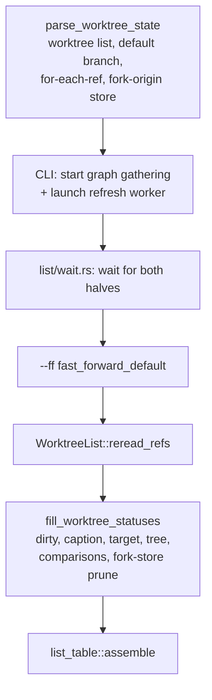

# `wt list`: Local Pipeline, Rendering, Flags

Load before changing listing, comparison caching, the caption or table, `--ff`,
or `--ignore-api`. For the background worker, PR store, live-head store, and the
wait, load [list-remote.md](list-remote.md). For the graph, load
[git-graph.md](git-graph.md). User-facing behavior: `worktree/docs/cli/list.md`.

## Pipeline

- `parse_worktree_state` reads `worktree list`, the default branch, one
  `for-each-ref refs/heads refs/remotes` (`listing::RefTips`), and the
  fork-origin store.
- `fill_worktree_statuses` runs dirty status, the caption, the target
  (`default_target::choose_default_target`, ancestry taken from the cached
  caption counts, so a warm run has no `merge-base`), the tree
  (`listing::build_tree`, pure), every comparison, and the fork-store prune.
- `--ff` (`worktree::fast_forward::fast_forward_default`), `WorktreeList::reread_refs`, and the local gather run **after** the wait, so refs,
  counts, and graph describe the post-fetch state.
- **Prune only after a successful `for-each-ref`**; an empty ref set would make
  every record look deleted.

## Comparison cache (`worktree::cache`)

- `worktree::worktree::list_worktrees` persists SHA-pair comparison results under the user cache
  directory.
- Key: `(target_tip_sha, branch_tip_sha, CACHE_FORMAT_VERSION)` (version 2). One
  cache serves the `-> {default}` column, the `-> parent` column, and the
  caption (local default vs `origin/<default>`); any tip movement
  self-invalidates.
- Dirty working-tree status is **never** cached; it stays a live `git status`.

## Rendering (`cli/src/commands/list_table.rs`)

Pure over `TableFacts`; snapshot tests in `cli/tests/list_table.rs`.

- `list_table::assemble` order: table, graph, status, verbose, blank line,
  notes.
- `Table::with_min_width` is the widest legend line, so a short table is never
  narrower than its legend.
- PR badges link only when `terminal.osc_link_support`: `Table` never breaks
  inside a word, so a degraded `[text](url)` can leave it no width at all.
- Match PRs by source repository **and** branch (`PrListing::for_branch`);
  `placement` puts the badge by the PR's target.
- `TableFacts::badges` shows none for an ignored or unsupported repository.

### Caption (`list_table::caption_markup`)

- One sentence: the comparison with `origin/<default>` (`local origin/<default>`
  only in the fetch-failed and still-pulling rows), then a dim italic suffix
  from `RemoteStatus`.
- No suffix for `CheckedNow` — a fresh check that found the tracking ref current
  needs no date (integration tests prove that row with
  `remote_fixture::assert_checked_now`).
- One `RemoteStatus` variant per spec §4 row; `list::remote_status` maps the
  `HeadEnd` only. `LastKnown` dates a row without an answer, by the reflog via
  `tracking_ref_changed_at` only when no answer is stored.
- Renders even when `caption` is `None` (no local default, no tracking ref, or a
  failed comparison). `TableFacts::from_list` drops the caption when `remote` is
  `None` (no `origin`).
- `Caption` carries the tracking tip from the same `RefTips` snapshot.
- Proven by `list_table::caption_snapshot_*` (rows, reasons, age units,
  no-origin rule), plus `credential_lines_*`, `closing_notes`, `output_order`.

### Lines beneath the caption and table

- `list::credential_line` (§5) and `list::fallback_notice` (§8) read only this
  run's followed attempt's `ApiNote` and this run's PR failure
  (`list::observed_pr_failure`: the receipt's, in every mode), with names from
  sniff's `credential_env`.
- `list_table::render_status` is a list: this run's PR item from
  `list_table::PrOutcome` via `pr_status_markup`, then §6 when the wait timed
  out. Every row is the `list_table::pr_presentation_snapshot_every_row`
  snapshot.
- `render_notes`: `--ff` refusal or §9 suggestion, then §8. The suggestion
  follows the post-wait comparison under every `RemoteStatus` except
  `StillChecking` and `StillPulling`, so a failed check or fetch still suggests
  `--ff` to the local tracking ref.
- `PrListing::is_stale_at(now)` decides the age line at render time.

### Columns, counts, colors

- `MergeState` is two-state (`Clean`, `Conflicts`); `ahead == 0` is `Clean`
  whatever `is_clean` says.
- From `METRICS_MIN_WIDTH` (100) columns both comparison cells append dim green
  `+ahead` and dim red `-behind` (zero side omitted) before any PR badge.
- The width gate reads the width of the `Terminal` passed to `render`, **never
  `--width`** (which sizes only the graph). Proven both ways by
  `list_output::a_wide_width_flag_does_not_show_the_counts` and
  `level2_list_verbose::level2_list_width_flag_leaves_the_counts_in_tmux`.
- That width is right under the shell wrapper (which captures stdout only)
  because `terminal_size` falls back to stderr then stdin (Unix and Windows).
- `-> parent` compares against the parent's **local** tip, never
  `origin/<parent>`.
- The dirty-source dot and the dirty-tree source names use the same basic
  `<red>` (SGR 31) as `conflicts`.

## Flags

- `-r`, `--ignore-api`, and `--ff` are global `Cli` flags;
  `main.rs::reject_listing_flags` refuses them (exit 2) with every other
  command.
- `-r`/`--ff` only pick the forced wait budget and retry policy; see
  [list-remote.md](list-remote.md#the-wait-listwaitrs).

### `--ff` (`fast_forward::fast_forward_default(main, default) -> FfResult`)

- Re-reads `refs/heads/<d>` and `refs/remotes/origin/<d>` and their ancestry
  right before the move.
- No checkout holds the branch: `update-ref` compare-and-swap.
- Otherwise re-verifies the holder is still on the branch and runs
  `merge --ff-only --no-autostash <verified sha>` there under `LC_ALL=C`
  ("would be overwritten" is `FfRefusal::DirtyCheckout`).
- Never creates, forces, or touches another ref; `UpToDate` covers in sync and
  ahead.
- Known gap: a checkout switching branches between the check and the merge;
  git gives no atomic guard for it.

### `--ignore-api` (`api_preference`)

- `~/.wt.json` (`dirs::home_dir`, beside but separate from `~/.worktree.json`)
  is `{ format_version: 1, ignore_api: [{ host, port, path }] }`.
- Recorded before launching the worker; no origin or a local path exits 1.
- `RepoIdentity::from_origin` wraps sniff's raw `remote_identity` and owns the
  port policy:
  - HTTPS: 443 unless explicit;
  - SSH to a known provider host on the standard SSH port (none spelled, or 22):
    443, so SSH and HTTPS remotes of one repository match;
  - other SSH, including an explicit nonstandard port on a known provider: its
    port or 22 (no scheme field: one host and port is one server);
  - a local path has no identity.
- `load` treats a missing, unreadable, corrupt, or other-format file as empty;
  `add` refuses such a file (`WorktreeError::PreferenceUnwritable`) instead of
  replacing it, and serializes writers on `~/.wt.json.lock` for at most 2 s.
- A repository listed there makes no provider request in either worker half
  (`Preferences::ignores_origin`, `PrStatus::Ignored`).

## Tests and performance

See [testing.md](testing.md#wt-list) and `worktree/docs/performance-testing.md`
(measurements and the `git status` findings).
