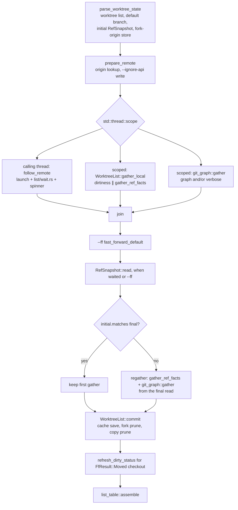

# `wt list`: Local Pipeline, Rendering, Flags

Load before changing listing, comparison caching, the caption or table, `--ff`,
or `--ignore-api`. For the background worker, PR store, live-head store, and the
wait, load [list-remote.md](list-remote.md). For the graph, load
[git-graph.md](git-graph.md). User-facing behavior: `worktree/docs/cli/list.md`.

## Pipeline

`list::gather_listing` (CLI) gathers; `run_pipeline` renders its `Listing`
once.

- `parse_worktree_state` reads `worktree list`, the default branch, one
  `for-each-ref refs/heads refs/remotes` (`listing::RefSnapshot`, which wraps
  `RefTips` with success and `read_at`), and the fork-origin store.
- The library gathers have **no persistent side effects**:
  `gather_dirtiness`, `WorktreeList::gather_ref_facts` (caption, target via
  `default_target::choose_default_target` with ancestry taken from the cached
  caption counts so a warm run has no `merge-base`, tree via the pure
  `listing::build_tree`, every comparison), and `gather_local` (both,
  concurrently). New comparisons go into the in-memory
  `load_comparison_cache()` mutex only.
- `WorktreeList::commit(refs, dirty, facts, cache)` is the one place that
  saves the cache, prunes fork records (reloading the file first; needs
  `refs.succeeded()`; records created at or after `refs.read_at()` are
  rechecked), and prunes copy records. `fill_worktree_statuses` (and so
  `list_worktrees`) is `gather_local` + `commit` on the parse step's read.
- **Acceptance**: `RefSnapshot::matches` is true only when both reads
  succeeded and the complete `local`, `remote`, and `remote_heads` maps are
  equal. Without a wait or `--ff` there is no second read and the first gather
  is accepted (as before, including a failed parse-step read). One regather at
  most; no stabilization loop.
- **Every history and comparison query names object IDs from the snapshot**,
  never a branch name, so a speculative gather's result is a pure function of
  its `RefTips`. Verbose `%D` labels are rebuilt from the snapshot
  ([git-graph.md](git-graph.md#gathering-git_graphtopologyrs)).
- Dirtiness is measured once. `--ff` runs after the join; only
  `FfResult::Moved { checkout: Some(path) }` re-runs `git status`, for the
  entry whose path equals `path` (both spelled by `git worktree list`).
- **Unknown is never clean.** `dirty_status` returns `DirtyStatus::Unknown` on
  a spawn failure or nonzero exit. An entry with Git's `prunable` marker
  (`WorktreeEntry::prunable`) gets `Unknown` without running `git status`,
  in both `gather_dirtiness` and `refresh_dirty_status`. Running status there
  could report a *parent* repository's files as the entry's (a nested
  unlinked checkout discovers the base). Availability (`availability::classify`:
  Healthy / Missing / Unlinked / Other) is a separate fact, classified in
  `commit` onto `WorktreeStatus::availability` from `symlink_metadata` alone.
  Only `NotFound` counts as absence, and a link or reparse point is Other.
  Never read Git's reason text for a decision; it is localized.
- Scoped tasks never print; the spinner lives on the calling thread and is
  cleared inside `follow_remote`. A scoped panic surfaces at `join` after the
  wait.
- **Prune only after a successful `for-each-ref`**; an empty ref set would make
  every record look deleted.
- `--perf` rows (`perf::PerfCollector`): top-level `pre-dispatch`,
  `pr gather` (origin lookup only), then the group
  `remote wait ‖ local gather` (`local gather` without remote work) with
  children `remote wait`, `pr reread`, `list gather`,
  `graph gather`/`verbose gather`; then `fast-forward`, a `regather` group
  (`list regather`, `graph regather`/`verbose regather`), and
  `checkout status refresh`. `record_group` takes the group's own measured
  span; children are diagnostic (no share, never summed). Top-level rows are
  sequential, so they plus `unattributed` equal the total exactly; an excess
  is shown as `perf::OVER_ATTRIBUTED`, never clipped. Record new overlapping
  work as a group child, never as a top-level row.
- `worktree::timing` is the library's typed replacement (not yet wired into
  `wt list`): `Stage` ids are the contract, labels are display only. Traps:
  `SpanList::push` of a stage already present **adds into it**, so only push
  non-overlapping repeats; remainders are computed in whole microseconds, and
  only a span with sequential children reconciles (a leaf or a concurrent
  parent carries zero remainders); `Timings::from_json` rejects repeated
  keys, unknown stage ids, and any remainder that does not reconcile, so
  build documents through the builder, never by hand.

## Comparison cache (`worktree::cache`)

- `WorktreeList::commit` persists SHA-pair comparison results under the user
  cache directory, including those of a discarded speculative gather (they
  describe fixed SHA pairs). Failed comparisons are never cached.
- Key: `(target_tip_sha, branch_tip_sha, CACHE_FORMAT_VERSION)` (version 2). One
  cache serves the `-> {default}` column, the `-> parent` column, and the
  caption (local default vs `origin/<default>`); any tip movement
  self-invalidates.
- Dirty working-tree status is **never** cached; it stays a live `git status`.

## Rendering (`cli/src/commands/list_table.rs`)

Pure over `TableFacts`; snapshot tests in `cli/tests/list_table.rs`.

- `list_table::assemble` order: table, graph, status, verbose, blank line,
  notes.
- `Table::with_min_width` is the widest legend line, so a short table is never
  narrower than its legend. `legend_markup(facts)` appends `✕ git can't read
  worktree` and `? couldn't check` to the Worktree line only when a table row
  shows that glyph. They used to sit on a second line to keep the legend
  narrow; Ken chose one line per legend (2026-10-04) even though the line is
  121 columns with both entries, so a short table widens to match and a
  120-column terminal wraps it.
- **Worktree glyph:** `worktree_marker` gives `✕` for any unavailable
  `availability`, whatever `dirty` says, and otherwise `dirty_dot` (`?` for
  `DirtyStatus::Unknown`). `TableFacts::row_statuses` is the one "rows in
  table order, each worktree once" walk shared by the legend and the notes.
- PR badges link only when `terminal.osc_link_support`: `Table` never breaks
  inside a word, so a degraded `[text](url)` can leave it no width at all.
- Match PRs by source repository **and** branch (`PrListing::for_branch`);
  `placement` puts the badge by the PR's target.
- `TableFacts::badges` shows none for an ignored or unsupported repository.

### Caption (`list_table::caption_markup`)

- One sentence: the comparison with `origin/<default>` (`local origin/<default>`
  only in the fetch-failed and still-pulling rows), then a dim italic suffix
  from `RemoteStatus`.
- No suffix for `CheckedNow` — a fresh check that found the tracking ref current
  needs no date (integration tests prove that row with
  `remote_fixture::assert_checked_now`).
- One `RemoteStatus` variant per spec §4 row; `list::remote_status` maps the
  `HeadEnd` only. `LastKnown` dates a row without an answer, by the reflog via
  `tracking_ref_changed_at` only when no answer is stored.
- Renders even when `caption` is `None` (no local default, no tracking ref, or a
  failed comparison). `TableFacts::from_list` drops the caption when `remote` is
  `None` (no `origin`).
- `Caption` carries the tracking tip from the same `RefTips` snapshot.
- Proven by `list_table::caption_snapshot_*` (rows, reasons, age units,
  no-origin rule), plus `credential_lines_*`, `closing_notes`, `output_order`.

### Lines beneath the caption and table

- **One identity guard.** `RemoteAnswers::observed()` returns
  `Option<list::Observed>`, `None` when `origin` was replaced or removed
  during the wait (`origin_changed`). Every projection of request evidence
  reads through it: `list::request_notices` (PR item, credentials line,
  keyless notice, fallback notice) and `list::caption_status` (the caption's
  head status, which for a changed `origin` is `CheckFailed { Other }` dated
  only from the reflog). `pr_outcome`, `observed_pr_failure`, and
  `observed_keyless` take `&Observed`, so they cannot be called around the
  guard; a new projection must too. Proven by
  `list::tests::gather::a_replaced_or_removed_origin_suppresses_every_request_notice`
  (each projection × unchanged/replaced/removed) and, through the binary,
  `list_prs::a_changed_origin_drops_the_old_head_checks_*`.
- `list::credential_line` (§5) and `list::fallback_notice` (§8) read only this
  run's followed attempt's `ApiNote` and this run's PR failure
  (`list::observed_pr_failure`: the receipt's, in every mode), with names from
  sniff's `credential_env`.
- `credential_line` picks **one** line: the attempt's confirmed condition,
  else the PR failure's, else `CredentialCondition::AnsweredWithoutKey` when
  `list::observed_keyless` holds: the followed attempt's `credentials` or the
  wait's `pr_credentials` (with `PrEnd::Published`) is `anonymous`, the
  repository is not ignored, and the attempt is not `Unavailable` (its worker
  saw `origin` change). Never from the foreground environment.
  `keyed_limits_are_higher` decides the wording by sniff's display name
  (GitHub, GitLab, Bitbucket: "for higher rate limits"; Gitea/Forgejo:
  "to authenticate API requests"); its test pins the names. Proven by
  `list::tests::observations::keyless::*` and, through the binary,
  `list_prs::*keyless*`.
- `list_table::render_status` is a list: this run's PR item from
  `list_table::PrOutcome` via `pr_status_markup`, then §6 when the wait timed
  out. Every row is the `list_table::pr_presentation_snapshot_every_row`
  snapshot.
- `render_notes`: `--ff` refusal or §9 suggestion, then the §5
  `credential_markup` line (it used to sit under the caption; every note is
  now one undimmed list item, unavailable ones included), then §8, then
  `TableFacts::graph_omissions` (lanes left out; then incomplete history,
  worded for `shallow` with a `git fetch --unshallow` badge or as a plain
  statement otherwise; then one line per `merged_elsewhere` branch),
  then one `unavailable_note` per unavailable row in table order (a `?`
  row gets no note).
  - The graph is drawn with `GitGraph::render_without_notes`, so the
    component's own "N more worktrees not shown" and "Some history is not
    shown" lines never print under the image; `run` copies the returned
    plan's `hidden_lanes` and `incomplete`, and the facts' `shallow` and
    `merged_elsewhere`, into `graph_omissions`. Each
    `GitGraphPlan::omissions` entry becomes its own note (`omission_markup`);
    an `UnconnectedLane` whose branch has a `GraphFacts::forked_off_line`
    entry names the merge that brought its fork in. There is no generic
    "something is missing" note: it raised a concern nobody could act on.
  - The base view's height is `list_table::graph_row_budget`, passed as
    `GitGraph::with_max_rows`: terminal rows less every other section's
    lines, the blank before the notes, and `GRAPH_ROW_RESERVE` (4: the
    graph's own notes and the prompt), at least `GRAPH_MIN_ROWS` (12). So
    `run` renders status, verbose, and a graph-less notes pass before the
    graph. Width never changes the lane count. `GraphFacts::shallow` is set
    only from a verified `--is-shallow-repository` read, so a failed read
    never claims a shallow clone. The L2
    Kitty test reads the hidden-lane count from that note, not from the row
    under the image. Notes name a command only when it can be typed:
  - `remove_argument` tries the branch, then the basename. It keeps a
    candidate only if `resolve_worktree` maps it to this entry's path;
    otherwise it says which entry the name selects instead.
  - `shell_word` accepts only a spelling that bash, zsh, fish, and PowerShell
    all read back unchanged. Spellings it refuses:
    - a leading `-` or `~`;
    - `'` or PowerShell's `‘’‚‛`;
    - control characters;
    - `\\`, or a final `\` (fish escapes inside single quotes).

    A refused name or path drops the command, and the note says why.
  - Only `Unlinked` claims `.git` is missing; its note only points at
    `wt remove`, never at `git worktree repair`. Snapshots are
    `unavailable_notes` and `unavailable_note_quoting`. Never put a Windows
    spelling in a target path in tests, because `file_name` of `C:\x\y`
    differs between hosts.
  - Notes and status items are `Note`s: typed segments of markup (fixed
    wording, or external text through `Prose::escape_text`) and raw
    copyable text. Add every path or command a note shows with
    `Note::copyable` (or `copyable_badge`), never as escaped markup. Prose's
    `WrapProse` breaks at whitespace and `-` and force-breaks a word longer
    than the line with an inserted `-`, so a narrow pane once showed a repair
    command nobody could copy. `notes_list` replaces those characters in
    copyable text with one stand-in, `KEEP` (U+FDD0), or a too-long run with
    a whole line of it, and `restore_kept` puts back the `n`th original for
    the `n`th stand-in after rendering.
  - Trap: never build a note as a markup string with in-band delimiters, and
    never restore stand-ins by replacing every occurrence. Names, paths,
    reasons, and errors come from Git metadata and can hold any character,
    including the stand-in; an earlier scheme of five noncharacter markers
    turned such input into wrap instructions, changed suggested commands, and
    dropped text. `wrap_markup` records genuine stand-ins too, so positions
    stay exact. Regressions:
    `list_table::every_external_field_in_the_notes_is_shown_literally`
    (every projection × U+FDD0–U+FDD4 × `<red>` markup, 400 and 60 columns),
    `list_output::a_missing_entry_named_with_delimiter_like_text_gets_its_exact_remove_command`,
    and `list_table::notes_keep_paths_and_commands_whole_at_a_narrow_width`.
    `unavailable_reason`, which `wt remove` renders unwrapped, flattens its
    `Note` with `to_markup`.
- The §9 suggestion
  follows the post-wait comparison under every `RemoteStatus` except
  `StillChecking` and `StillPulling`, so a failed check or fetch still suggests
  `--ff` to the local tracking ref.
- `PrListing::is_stale_at(now)` decides the age line at render time.

### Columns, counts, colors

- `MergeState` is two-state (`Clean`, `Conflicts`); `ahead == 0` is `Clean`
  whatever `is_clean` says.
- From `METRICS_MIN_WIDTH` (100) columns both comparison cells append dim green
  `+ahead` and dim red `-behind` (zero side omitted) before any PR badge.
- The width gate reads the width of the `Terminal` passed to `render`, **never
  `--width`** (which sizes only the graph). Proven both ways by
  `list_output::a_wide_width_flag_does_not_show_the_counts` and
  `level2_list_verbose::level2_list_width_flag_leaves_the_counts_in_tmux`.
- That width is right under the shell wrapper (which captures stdout only)
  because `terminal_size` falls back to stderr then stdin (Unix and Windows).
- `-> parent` compares against the parent's **local** tip, never
  `origin/<parent>`.
- The dirty-source dot and the dirty-tree source names use the same basic
  `<red>` (SGR 31) as `conflicts`.

## Flags

- `-r`, `--ignore-api`, and `--ff` are global `Cli` flags;
  `main.rs::reject_listing_flags` refuses them (exit 2) with every other
  command.
- `-r`/`--ff` only pick the forced wait budget and retry policy; see
  [list-remote.md](list-remote.md#the-wait-listwaitrs).

### `--ff` (`fast_forward::fast_forward_default(main, default) -> FfResult`)

- Re-reads `refs/heads/<d>` and `refs/remotes/origin/<d>` and their ancestry
  right before the move.
- `holder_of` parses with `parse_worktree_list`. A `prunable` holder is
  `FfRefusal::UnavailableHolder(path)` (`FfNotice::UnavailableHolder`), but
  only when a move is needed; an up-to-date branch is still `UpToDate`.
  Before this, the holder reached `git -C <holder> symbolic-ref`/`merge`,
  which in an unlinked directory nested in another repository runs against
  **that** repository. Nothing repairs or prunes the holder.
- No checkout holds the branch: `update-ref` compare-and-swap.
- Otherwise re-verifies the holder is still on the branch and runs
  `merge --ff-only --no-autostash <verified sha>` there under `LC_ALL=C`
  ("would be overwritten" is `FfRefusal::DirtyCheckout`).
- Never creates, forces, or touches another ref; `UpToDate` covers in sync and
  ahead.
- Known gap: a checkout switching branches between the check and the merge;
  git gives no atomic guard for it.

### `--ignore-api` (`api_preference`)

- `~/.wt.json` (`dirs::home_dir`, beside but separate from `~/.worktree.json`)
  is `{ format_version: 1, ignore_api: [{ host, port, path }] }`.
- Recorded before launching the worker; no origin or a local path exits 1.
- `RepoIdentity::from_origin` wraps sniff's raw `remote_identity` and owns the
  port policy:
  - HTTPS: 443 unless explicit;
  - SSH to a known provider host on the standard SSH port (none spelled, or 22):
    443, so SSH and HTTPS remotes of one repository match;
  - other SSH, including an explicit nonstandard port on a known provider: its
    port or 22 (no scheme field: one host and port is one server);
  - a local path has no identity.
- `load` treats a missing, unreadable, corrupt, or other-format file as empty;
  `add` refuses such a file (`WorktreeError::PreferenceUnwritable`) instead of
  replacing it, and serializes writers on `~/.wt.json.lock` for at most 2 s.
- A repository listed there makes no provider request in either worker half
  (`Preferences::ignores_origin`, `PrStatus::Ignored`).

## Tests and performance

See [testing.md](testing.md#wt-list) and `worktree/docs/performance-testing.md`
(measurements and the `git status` findings).
- **Caption own-line note.** `Caption::behind_on_line` (`listing::line_steps`,
  one `rev-list --first-parent --parents`) is read in `gather_ref_facts` only
  when strictly behind, through `line_steps_cached`: it rides on the caption
  comparison's cache entry (`CacheValue::line`, optional, so older files
  load). **Trap:** an uncached call breaks
  `one_cache_serves_the_caption_and_both_target_columns`, which pins a warm
  listing at zero `rev-list` calls. `own_line_markup` puts an italic aside
  after the count (`45 commits (1 merge) behind`, or `(3 on main's line)`)
  only when it is fewer than `behind`; it reconciles the caption's count with the graph's
  first-parent default lane.
