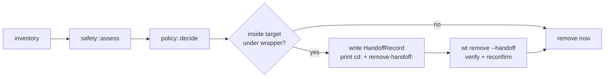

# `wt remove`

Load before changing `worktree::remove` (`lib/src/remove/`) or
`cli/src/commands/remove/` (`mod.rs` flow, `policy.rs`, `report.rs`).

## Inventory

- One `git status --porcelain=v1 -z -uall --ignored=matching`.
- `included::classify_included` evaluates the target's own rules or, **only when
  missing**, the base checkout's rules.
- New, changed, and unknown selected ignored files need consent. Unchanged
  copies and ordinary ignored files are disposable and summarized by name.

### `Inventory::fingerprint` (BLAKE3)

Hashes:

- each dirty path's status and working content;
  - on Unix a regular file's content includes its git mode (`100755` when
    owner-executable), so a chmod alone refuses a handoff;
  - a dirty directory (how git lists an untracked nested repository or a
    modified submodule, even under `-uall`) contributes every path and file
    under it, `.git` included, symlinks not followed, `/`-separated keys;
- protected included content and rules/baseline bindings;
- the whole index from `git ls-files --stage -z` (mode, object ID, stage, path),
  so restaging under an unchanged `MM` still changes it.

Byte exactness:

- every name and symlink target enters as its exact OS bytes
  (`as_encoded_bytes`, length-prefixed);
- git's `-z` output is parsed as bytes (`git::git_from_bytes`). A lossy decoding
  maps `\xff` and `\xfe` to one U+FFFD and once let a changed symlink pass the
  handoff;
- on Windows a status path that is not UTF-8 is `GitParse`.

Errors: `WorktreeError::Io` when a path under a dirty entry cannot be read (the
CLI turns that into exit 4 on both runs); `GitCommand` when the index cannot be
listed.

Non-UTF-8 file-name tests skip on macOS (APFS refuses the names) and run on
Linux.

## Safety tiers (`safety::assess`)

- Classifies Safe / Pretty safe / Not safe / Unknown from one
  `for-each-ref --contains <tip>`, with the PR lookup (sniff, 2 s) on a parallel
  thread.
- An `origin/*` ref other than `origin/<default>` counts only after the live
  check (`live_remote::LsRemote`).
- With `force_remote`, the destination (`remote_branch`, which an upstream can
  make `origin/<default>`) is dropped from the ref set before every tier, and
  `lost_commits` always excludes `origin/HEAD` (an alias that would bring the
  destination back).
- Tests inject `PrSource` and `RemoteHeads` stubs.

`safety::reconfirm` is the handoff's second-run proof:

1. a local default branch, other local branch, or tag proves the tip with no PR
   lookup and no network;
2. otherwise an exact-tip PR;
3. then only an `origin/*` ref whose live head verifies, `origin/<default>`
   included (`assess` trusts that one as of the last fetch).

A branch approved only because it was safe must still be safe.

## Network access

`worktree::live_remote::run_noninteractive` (top-level module, shared with the
`wt list` live-head store `worktree::remote_head`) is the **only** way removal
code touches the network.

- Disables every credential prompt.
- Kills the whole process tree at the deadline (process group on Unix,
  `taskkill /T /F` on Windows). A plain `Child::kill` leaves the transport
  holding the pipe.
- Output is complete or `Err`: stdout not read to its end is an error, never
  `Ok("")`.
- `LsRemote` rejects any line that is not `<40 or 64 lowercase hex>\t<refname>`,
  so only a complete answer without the exact ref is `Ok(None)` (absent).

## Policy and process

- `default_target::select_default_target` picks `main` or `origin/main` (the
  descendant; origin when diverged). `wt list` reuses it.
- `policy::decide` is pure: (situation, flags, scripted answers) → actions. Its
  L1 matrix covers every tier × contents × flag subset × mode.
- Git runs through `git::git_from(base, dir, ..)` (`git -C`, cwd = base). `run`
  calls `set_current_dir(base)` right after resolving the target, so neither
  `wt` nor a git child holds the worktree on Windows.
- On Windows `remove::remove_worktree` runs `check_not_in_use` (rename to a
  sibling and back) first. A held directory is `WorktreeError::DirectoryInUse`
  (exit 4).

## Move-first handoff

Inside the target with `WT_SHELL_WRAPPER=1`:

1. The first run writes `handoff::HandoffRecord`
   (`<repo hash>.handoff-<token>.json`, 60 s) and prints `cd:` +
   `remove-handoff:`. The v3 state binds the effective rules and copy baseline.
2. `--handoff` **consumes the record before judging it**, then `verify` checks
   "caller outside the target" first (exit 4) and then every stored field
   (exit 3).
3. `run_handoff` refuses (exit 3) when the `--force-remote` destination, its push
   endpoint, or its live head differs from the approved one, is now absent, or
   cannot be reached (approved-absent accepts only a verified absence).

The second run reads every local fact again (`Facts::local`) but asks the
network only for what the approved actions need:

- `Keep`, an explicit `Delete`, or no branch: no PR or live request;
- `DeleteIfSafe`: `safety::reconfirm`;
- a remote approval: one preflight.

Its refusals print only the reason, never the first-run report; an explicit
delete prints no "(N lost)" suffix.

## `--force-remote` endpoint rules

- The endpoint is `remote::push_endpoints`
  (`git remote get-url --push --all origin`, git's own spelling, never
  canonicalized).
- The deletion's `ls-remote` and `push` address that **URL**, not the `origin`
  nickname (which `ls-remote` would resolve to the fetch URL).
- Several push URLs make `--force-remote` refuse (exit 3) before anything is
  removed.
- Git may still reinterpret the URL, with no switch to stop it: `ls-remote`
  rewrites by `insteadOf`, `push` by `pushInsteadOf` else `insteadOf`, and a
  name matching a configured remote is read as that remote (fetch URL for
  `ls-remote`, push URL for `push`). So `remote::endpoint_reinterpretation`
  (`git config --null --list`, every scope and `-c`) must find:
  - no rewrite rule whose value prefixes the endpoint;
  - no `remote.<endpoint>.*` key of any kind (section and variable come back
    lowercased; the remote name keeps its case and git matches it
    case-sensitively);
  - no legacy `remotes/<endpoint>` or `branches/<endpoint>` file
    (`rev-parse --git-path`).
  Otherwise preflight yields `RemoteState::ReinterpretedEndpoint` and both runs
  refuse (exit 3) before any mutation; `delete_remote_branch` re-checks before
  pushing.
- `git remote get-url <name>` **cannot** answer "is this a remote": it says "No
  such remote" for remotes defined in global scope or by `-c`, which `push`
  still uses.
- The safety tiers' `origin/*` live checks still use `origin`, matching the
  fetch that made those refs.

## Tests

See [testing.md](testing.md#wt-remove).
