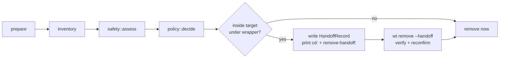

# `wt remove`

Load before changing `worktree::remove` (`lib/src/remove/`) or
`cli/src/commands/remove/` (`mod.rs` flow, `policy.rs`, `report.rs`). The
user-facing rules are in `worktree/docs/cli/remove.md`; keep it in step.

## Inventory

- One `git status --porcelain=v1 -z -uall --ignored=matching`.
- `included::classify_included` evaluates the target's own rules or, **only when
  missing**, the base checkout's rules.
- New, changed, and unknown selected ignored files need consent. Unchanged
  copies and ordinary ignored files are disposable and summarized by name.

### `Inventory::fingerprint` (BLAKE3)

Hashes:

- each dirty path's status and working content;
  - on Unix a regular file's content includes its git mode (`100755` when
    owner-executable), so a chmod alone refuses a handoff;
  - a dirty directory (how git lists an untracked nested repository or a
    modified submodule, even under `-uall`) contributes every path and file
    under it, `.git` included, symlinks not followed, `/`-separated keys;
- protected included content and rules/baseline bindings;
- the whole index from `git ls-files --stage -z` (mode, object ID, stage, path),
  so restaging under an unchanged `MM` still changes it.

Byte exactness:

- every name and symlink target enters as its exact OS bytes
  (`as_encoded_bytes`, length-prefixed);
- git's `-z` output is parsed as bytes (`git::git_from_bytes`). A lossy decoding
  maps `\xff` and `\xfe` to one U+FFFD and once let a changed symlink pass the
  handoff;
- on Windows a status path that is not UTF-8 is `GitParse`.

Errors: `WorktreeError::Io` when a path under a dirty entry cannot be read (the
CLI turns that into exit 4 on both runs); `GitCommand` when the index cannot be
listed.

Non-UTF-8 file-name tests skip on macOS (APFS refuses the names) and run on
Linux.

## Safety tiers (`safety::assess`)

- Classifies Safe / Pretty safe / Not safe / Unknown from one
  `for-each-ref --contains <tip>`, with the PR lookup (sniff, 2 s) on a parallel
  thread.
- An `origin/*` ref other than `origin/<default>` counts only after the live
  check (`live_remote::LsRemote`).
- With `force_remote`, the destination (`remote_branch`, which an upstream can
  make `origin/<default>`) is dropped from the ref set before every tier, and
  `lost_commits` always excludes `origin/HEAD` (an alias that would bring the
  destination back).
- Tests inject `PrSource` and `RemoteHeads` stubs.

`safety::reconfirm` is the handoff's second-run proof:

1. a local default branch, other local branch, or tag proves the tip with no PR
   lookup and no network;
2. otherwise an exact-tip PR;
3. then only an `origin/*` ref whose live head verifies, `origin/<default>`
   included (`assess` trusts that one as of the last fetch).

A branch approved only because it was safe must still be safe.

## Network access

`worktree::live_remote::run_noninteractive` (top-level module, shared with the
`wt list` live-head store `worktree::remote_head`) is the **only** way removal
code touches the network.

- Disables every credential prompt.
- Kills the whole process tree at the deadline (process group on Unix,
  `taskkill /T /F` on Windows). A plain `Child::kill` leaves the transport
  holding the pipe.
- Output is complete or `Err`: stdout not read to its end is an error, never
  `Ok("")`.
- `LsRemote` rejects any line that is not `<40 or 64 lowercase hex>\t<refname>`,
  so only a complete answer without the exact ref is `Ok(None)` (absent).

## Policy and process

- `default_target::select_default_target` picks `main` or `origin/main` (the
  descendant; origin when diverged). `wt list` reuses it.
- `policy::decide` is pure: (situation, flags, scripted answers) → actions. Its
  L1 matrix covers every tier × contents × flag subset × mode.
- Git runs through `git::git_from(base, dir, ..)` (`git -C`, cwd = base). `run`
  calls `set_current_dir(base)` right after resolving the target, so neither
  `wt` nor a git child holds the worktree on Windows.
- `remove::remove_worktree` first runs `check_no_processes`
  (`sniff::os::processes_working_in`: processes whose current directory is in
  the worktree, the caller and its ancestors excluded) on every OS, then on
  Windows `check_not_in_use` (rename to a sibling and back, which also catches
  open files). Either is `WorktreeError::DirectoryInUse { path, processes }`
  (`processes` empty for the probe), exit 4, with no override flag. `run` also
  checks before the report so nothing is asked and then refused.
- On macOS and Linux git deletes under a writer's feet; its recursive delete
  stops at the first failure yet has already unregistered the worktree.
  `finish_unregistered` retries `remove_dir_all` three times, else
  `WorktreeError::FolderNotFullyRemoved` (exit 1, branch and origin untouched).

## Git facts about broken worktree records

Observed with Git 2.56 on macOS. These describe Git, not `wt`:

- `prunable <reason>` appears only when the admin `gitdir` back-reference
  points somewhere that no longer exists (the directory is gone, or its `.git`
  file is). A **locked** entry whose directory is gone is never `prunable`, and
  neither is a checkout whose `.git` file holds garbage. In both cases
  `git status` fails on an entry the listing reports as normal.
- The admin `index` outlives a deleted checkout. `git worktree remove` of a
  missing directory exits 0 and silently discards staged work in that index.
- `GIT_INDEX_FILE=<absent> git diff-index --cached` reads the missing file as an
  empty index without error. Prove the index exists before trusting the diff.
- A **split index** (`update-index --split-index`) keeps its entries in a
  `sharedindex.<oid>` file that `index` only references, so hashing `index`
  alone misses edits to the entries. Git (2.56 measured) exits 128 when that
  file is corrupt, removed, empty, has trailing bytes, or is a directory; it
  looks for it in the running process's git dir, then beside the
  `GIT_INDEX_FILE`. Only `ls-files --debug` shows entry flags
  (intent-to-add, skip-worktree); `--stage` alone does not.
- Test shims that capture Git output with `$(...)` drop NUL bytes, mangling
  any non-empty `-z` output; the `one_shot_git_shim` buffers through a file.
- `git -C <base> worktree repair <path>` can exit 1 even when it has fully
  restored the link, and **it also repairs every other broken worktree link**,
  not only `<path>`. That includes **overwriting another worktree's existing
  `.git` file** that holds something Git can't use (checked 2026-10-03: a
  `gitdir: /nowhere` file was rewritten to the right record), a state `wt`
  itself refuses to touch. Judge repair by postconditions, never by exit code,
  and never describe it as touching only the target.
- **Trap for manual testing:** because of that, one `wt remove` of an unlinked
  worktree silently heals every other broken fixture in the same repository.
  Give each broken-state scenario its own repository, or break it after the
  last repair.
- One `--force` does not remove a locked record (`remove -f -f` is required).
- **A checkout moved away and replaced by a directory link to it is not
  `prunable`**: Git reads it through the link. `git worktree remove` then
  deletes the files behind the link and fails on the link itself ("Not a
  directory"), so a failing Git exit is too late to serve as a guard.
- In a directory whose `.git` is gone, `git rev-parse --show-toplevel` finds
  any enclosing repository (for example the base, when the worktree is nested
  inside it). A Git command that succeeds there does not prove the worktree is
  healthy.

## Preparing a target Git can't read (`remove::prepare`)

`prepare(base, entry, &repair::Git)` classifies the entry afresh and returns
`CheckoutState::{Healthy, Missing, Repaired}` or a `PrepareRefusal`. The CLI
must call it before any inventory.

- **Trap: no `prunable` marker is not proof of a safe target.**
  `availability::classify_with` inspects the recorded path itself
  (`symlink_metadata`, plus `FILE_ATTRIBUTE_REPARSE_POINT` on Windows) for
  every entry and returns `Other(OtherCondition::Link)` for a link even when
  Git reads through it. That one check is what `prepare`, both handoff runs,
  and `wt list` rely on. Repair adds `Postcondition::NotADirectory` (every
  Git-side postcondition resolves links and passes), and `remove_worktree`
  refuses with `WorktreeError::NotARealDirectory` (exit 3) unless the path is
  a real directory immediately before Git runs. Only the final component
  counts: an ancestor alias such as macOS `/tmp` stays healthy. Tests make
  the link with `replace_with_link` (a junction on Windows, which needs no
  privilege).

- **Association** (`admin_entry::admin_entry_for`): the common dir comes from
  `rev-parse --path-format=absolute --git-common-dir`. Every directory under
  `worktrees/` is read, and an unreadable or linked record refuses the whole
  association. Exactly one record must match. Compare the **checkout
  directories** (`canonical_worktree_path`, which canonicalizes the longest
  existing ancestor), never the `.git` paths: another record whose checkout
  was replaced by a file makes `<file>/.git` fail with ENOTDIR and blocked
  every association until this was fixed.
- **Repair** (`repair::repair_unlinked`) goes through the `RepairGit` seam.
  The attempt's exit code and output are diagnostics only. The verdict is
  that all of these hold: `--git-dir` is the associated record,
  `--git-common-dir` is this repository's, the back-reference names the
  target, `--show-toplevel` is the target, and a fresh listing shows the same
  branch or detached HEAD with no `prunable`. All failures are collected. Only
  `RepairRefusal::Unverified` follows an attempt (`repair_attempted()`).
- **Missing** (`missing::inspect_missing`): the admin `index` must be a
  regular file (`IndexAbsent` otherwise). Its bytes are hashed
  (`index_digest`, BLAKE3 via biscuit-hash) **before** the diff, so a write
  between the hash and the diff can only make removal refuse. Git's reading of
  every entry, `GIT_INDEX_FILE=<admin>/index git ls-files --stage --debug -z`,
  is hashed then too (`entries_digest`): it is the only binding of a split
  index's shared file, and a Git failure is `IndexUninspectable`. It is diffed with
  `GIT_INDEX_FILE=<admin>/index git diff-index --cached --name-status -z <head>`
  against the branch tip, or the recorded HEAD when detached. Differences become
  `DirtyEntry`s with index-column statuses (`"A "`, `"M "`). An empty
  `staged` list means "index matches HEAD", never "checkout checked".
- **Record removal** (`missing::remove_missing_record(base, entry, &inspected)`):
  it re-lists and requires the same identity, the same `AdminEntry`, the same
  recorded HEAD (`HeadChanged`), the path still `NotFound` (a reappeared
  directory or link refuses), the index bytes still hashing to
  `index_digest` (`IndexChanged`; absent is `IndexAbsent`), and Git's entry
  listing still hashing to `entries_digest` (`IndexChanged`; a shared index Git
  can no longer read is `IndexUninspectable`, also exit 3). **Trap:** nothing
  in Git protects a missing checkout's index, so this final comparison is the
  only thing standing between consent and discarding staged work written after
  the report; `--force-worktree` approves the reported state, never a newer
  one. Then it runs plain `git worktree remove <path>`
  with no `--force` and no `check_not_in_use`, and deletes the copy record
  only after Git succeeds. Branch steps stay with the caller.
- Git receives paths as `OsStr` (`git::git_from_output`), never through a
  lossy `String`.

### How `wt remove` uses it (`cli/src/commands/remove/mod.rs`)

- `prepare` runs after the main-checkout guard, the inside-without-wrapper
  guard (exit 4), and `set_current_dir(base)`, so nothing is repaired for a
  removal that could not go ahead. Every `PrepareRefusal` is
  `RefusedToLoseWork` (exit 3), whatever the force flags.
- `Facts` carries the `CheckoutState`. For `Missing`, `inventory` stays empty
  and is never read: `situation()`, the report (`report::missing_markup`), the
  discard question, and `refusal_markup` all branch on `facts.missing()`
  first. A missing target never hands off, and `execute` runs
  `remove_missing_record` instead of `remove_worktree`.
- `remove_local_branch(base, branch, expected_tip)` refuses with
  `WorktreeError::BranchMoved` (exit 1, after the worktree is gone) when the
  tip is no longer `Facts::head`, the tip the tier and any approval were
  decided on.
- **Trap: consent is to a state, not a license.** `git worktree remove` without
  `--force` refuses newly staged work itself, but with `--force` it discards
  whatever is there. So `run` fingerprints the files (`Facts::reported`)
  before the report whenever consent may be needed or a handoff will bind them,
  and `files_unchanged` re-collects and compares the listed entries and the
  fingerprint before an approved discard (exit 3 on any difference). The
  handoff record carries that report-time fingerprint, not one taken after the
  questions.
- After `Repaired`, the report says the `.git` file was missing right under
  its heading (`ReportInput::relinked`, `report::RELINKED_MARKUP`); there is
  no separate message before it. Every refusal and cancellation appends
  `Facts::kept_link_note`, and a failed inventory says the link was left in
  place. Never print "nothing was changed" there.
- Bare Git errors go through `in_context(error, operation)`, which prefixes
  target, path, and operation and keeps the variant, so the exit code is
  unchanged (unit test `context_never_changes_an_exit_code`).
- **Trap: a shell standing in an unlinked worktree can't reach the
  repository** unless the worktree is nested in another checkout of it.
  `find_worktree` runs Git in the caller's directory and fails with a bare
  `not a git repository` before `prepare`. Handoff-after-repair tests nest
  the worktree in the base checkout for this reason.
- **Trap: a locked record is never `prunable`.** A locked worktree whose
  directory is gone is `Healthy` to `prepare` and fails in
  `collect_inventory` (exit 1, with context).

## Move-first handoff

Inside the target with `WT_SHELL_WRAPPER=1`:

1. The first run writes `handoff::HandoffRecord`
   (`<repo hash>.handoff-<token>.json`, 60 s) and prints `cd:` +
   `remove-handoff:`. The v4 state binds the effective rules, the copy
   baseline, and `git_dir` (`handoff::checkout_git_dir`: where the target's
   `.git` leads, asked from the base). Back-references alone can't see a
   redirected `.git`, so the forward link is what is bound.
2. `--handoff` **consumes the record before judging it**, then `verify` checks
   "caller outside the target" first (exit 4) and then every stored field
   (exit 3). Before that, the second run requires `availability::classify` to
   be `Healthy` (a link broken since the first run, or a checkout replaced by
   a link, refuses with exit 3) and **never calls `prepare`**, so it never
   repairs. The kind check is the only guard against a replacement link
   there: the stored target and the listed path are both canonicalized
   through the new link, so they still compare equal, and `git_dir` and the
   fingerprint are read through it unchanged.
3. `run_handoff` refuses (exit 3) when the `--force-remote` destination, its push
   endpoint, or its live head differs from the approved one, is now absent, or
   cannot be reached (approved-absent accepts only a verified absence).

The second run reads every local fact again (`Facts::local`) but asks the
network only for what the approved actions need:

- `Keep`, an explicit `Delete`, or no branch: no PR or live request;
- `DeleteIfSafe`: `safety::reconfirm`;
- a remote approval: one preflight.

Its refusals print only the reason, never the first-run report; an explicit
delete prints no "(N lost)" suffix.

## `--force-remote` endpoint rules

- The endpoint is `remote::push_endpoints`
  (`git remote get-url --push --all origin`, git's own spelling, never
  canonicalized).
- The deletion's `ls-remote` and `push` address that **URL**, not the `origin`
  nickname (which `ls-remote` would resolve to the fetch URL).
- Several push URLs make `--force-remote` refuse (exit 3) before anything is
  removed.
- Git may still reinterpret the URL, with no switch to stop it: `ls-remote`
  rewrites by `insteadOf`, `push` by `pushInsteadOf` else `insteadOf`, and a
  name matching a configured remote is read as that remote (fetch URL for
  `ls-remote`, push URL for `push`). So `remote::endpoint_reinterpretation`
  (`git config --null --list`, every scope and `-c`) must find:
  - no rewrite rule whose value prefixes the endpoint;
  - no `remote.<endpoint>.*` key of any kind (section and variable come back
    lowercased; the remote name keeps its case and git matches it
    case-sensitively);
  - no legacy `remotes/<endpoint>` or `branches/<endpoint>` file
    (`rev-parse --git-path`).
  Otherwise preflight yields `RemoteState::ReinterpretedEndpoint` and both runs
  refuse (exit 3) before any mutation; `delete_remote_branch` re-checks before
  pushing.
- `git remote get-url <name>` **cannot** answer "is this a remote": it says "No
  such remote" for remotes defined in global scope or by `-c`, which `push`
  still uses.
- The safety tiers' `origin/*` live checks still use `origin`, matching the
  fetch that made those refs.

## Tests

See [testing.md](testing.md#wt-remove).
