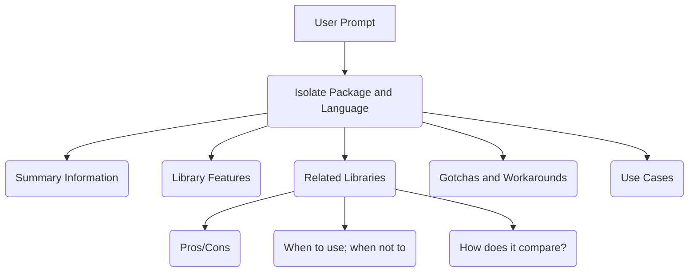

# Dockhand

> A monorepo for AI-powered research and automation tools

## Architecture

This monorepo is organized into **areas**, each containing related modules:

### Research Area (`/research`)

The Research area provides automated research capabilities for software libraries.

- **Research Library** (`/research/lib`) - Core library providing AI integration via the `rig` crate
- **Research CLI** (`/research/cli`) - Command-line interface exposing research capabilities
  - Binary name: `research`
  - Usage: `research library <topic> [additional questions...]`

### Shared Library (`/shared`)

Common utilities shared across multiple areas of the monorepo.

### TUI Area (`/tui`)

A `ratatui`-based TUI application for interactive chat. (Future development)

## Usage

### Building

```bash
# Build all areas
just build

# Build specific area
just -f research/justfile build
```

### Testing

```bash
# Test all areas
just test

# Test specific area
just -f research/justfile test
```

### Installing

```bash
# Install binaries from all areas
just install
```

### Research CLI

```bash
# Research a library
research library clap

# Research with additional questions
research library clap "How does it compare to structopt?" "What are the derive macros?"

# Run in development mode
just -f research/justfile cli library clap
```

## Library Research Flow


