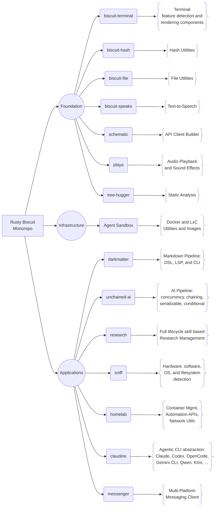

# Rusty Biscuit

</img>

> A monorepo of tools to help you achieve AI excellence

## Usage

We use the [`just`](https://github.com/casey/just) runner for packages in this repo to organize all key operations. The first step is to make sure your host has **just** installed.

```sh
# macOS
brew install just
# ubuntu / debian
apt install just
# ...
asdf install just
apk add just
# Red Hat, CentOS, Rocky, etc.
dnf install just
# Arch, Manjaro, etc
pacman -S just
# Snap package manager
snap install --edge --classic just
# Nix Package manager
nix-env -iA nixpkgs.just
# Use NodeJS's **npm** package manager
npm install -g rust-just
# Python's **uv** package manager
uv tool install rust-just
```

Once installed you should run `just init` from the repo's root which will:

- ensure you have all necessary build tools for you operating system
- install some core CLI's from this monorepo to make sure all your `justfile` configurations will work with full fidelity

At this point you're ready to explore, install, test, whatever you like.

- run `just` and it will give you all the "recipes" appropriate for the directory you are in
- it will include things like:
    - testing
    - linting
    - installing
    - documentation drift
    - skill generation
    - _and more_

> **Notes:**
> 
> - **TTS**
>     - we use TTS messages to communicate successful or failing recipes (_typically those which are long running_)
>     - this leverages the `biscuit-speaks` library which in turn leverages what you have installed on your host computer
>     - most computer's will have _some_ TTS software we support but the quality of the TTS can vary widely
>     - run `so-you-say list-providers` to see which TTS providers we can use on your system
>         - on macOS the built-in `say` TTS is not bad but it's quality varies on how you've configured it
>         - on Windows the built-in `XXX` TTS is decent as well
>         - on Linux there is more variance but something like `espeak`/`espeak-ng` is most common. These voices are low quality (but the do have a TON of languages).
>     - if you want better voices, it's a safe bet that installing `kokoro_tts` will be a big improvement:
>         - run `sniff tts-clients install kokoro_tts` to install
> 
>     **Note:** when running `just init` you'll be automatically prompted to install one of the recognized TTS 
>     solutions if the host currently has none. You may also be "recommended" to upgrade if all you have is 
>     the **espeak** solution (common on Linux).
> 
> - **Audio Playback**
>     - several of the just recipes will play sound effects when certain events take place
>     - in addition, some TTS providers, rely on the `playa` library to play their voice audio
>     - We support native audio on macOS, Linux, and Windows
>     - In most cases this is all you'll need but we will fallback to any headless audio players detected on the host which meet the requirements if the native solution can't perform the particular audio task.
>     - You can check what headless audio players exist on your host by running `playa players`
>     - You can install any which are missing with `playa install`

## Packages

This monorepo hosts the following package areas:


```mermaid
flowchart LR
repo@{label: "Rusty Biscuit\nMonorepo"}
foundation((Foundation))
infra((Infrastructure))
app((Applications))

terminal(biscuit-terminal) --> T@{ shape: braces, label: "Terminal\nfeature detection and \nrendering components" }
hashing(biscuit-hash) --> H@{ shape: braces, label: "Hash Utilities" }
file(biscuit-file) --> F@{ shape: braces, label: "File Utilities" }
tts(biscuit-speaks) --> TTS@{ shape: braces, label: "Text-to-Speech" }
schematic(schematic) --> SCHEMA@{ shape: braces, label: "API Client Builder" }
playa(playa) --> AUDIO@{ shape: braces, label: "Audio Playback\nand Sound Effects" }
tree(tree-hugger) --> TREE@{ shape: braces, label: "Static Analysis" }

repo --> foundation
repo --> infra
repo --> app

foundation --> terminal
foundation --> hashing
foundation --> file
foundation --> tts
foundation --> schematic
foundation --> playa
foundation --> tree

app --> darkmatter(Darkmatter)
app --> unchained(Unchained AI)
app --> research
app --> sniff
app --> homelab
app --> claudine
app --> messenger


darkmatter(darkmatter) --> DM@{ shape: braces, label: "Markdown Pipeline:\nDSL, LSP, and CLI"}
unchained(unchained-ai) --> UN@{ shape: braces, label: "AI Pipeline:\nconcurrency, chaining,\nserializable, conditional"}
research(research) --> R@{ shape: braces, label: "Full lifecycle skill based\nResearch Management"}
sniff(sniff) --> Detection@{ shape: braces, label: "Hardware, software,\nOS, and filesystem\ndetection"}
homelab(homelab) --> HL@{ shape: braces, label: "Container Mgmt,\nAutomation APIs,\nNetwork Utils"}
claudine(claudine) --> CL@{ shape: braces, label: "Agentic CLI abstraction:\nClaude, Codex, OpenCode,\nGemini CLI, Qwen, Kimi, ..."}
messenger(messenger) --> M@{ shape: braces, label: "Multi-Platform\nMessaging Client"}

infra --> sandbox(Agent Sandbox) --> A@{ shape: braces, label: "Docker and LxC\nUtilities and Images"}
```

### Core Libraries

1. **biscuit-speaks** [[`./biscuit-speaks`](./biscuit-speaks/README.md)]

    A library and CLI which provides TTS functionality it borrows from the host.

    - The **biscuit-speaks-cli** [[`./biscuit-speaks/cli`](./biscuit-speaks/cli/README.md)] binary is called **so-you-say**:

      ```sh
      # TTS
      so-you-say "hello world"
      # TTS with specific gender voice
      so-you-say "hello world" --gender male
      # List TTS providers on host
      so-you-say --list-providers
      ```

1. **schematic** [[`./schematic`](./schematic/README.md)]

   Builds type-strong API clients to be consumed by other libraries.

   - **schematic-define** [[`./schematic/define`](./schematic/define/README.md)] - primitives for defining an API
   - **schematic-definitions** [[`./schematic/definitions`](./schematic/definitions/README.md)] - API's which have been defined
   - **schematic-gen** [[`./schematic/gen`](./schematic/gen/README.md)] - generates the API client's from schematic-definitions _into_ schematic-schema
   - **schematic-schema** [[`./schematic/schema`](./schematic/schema/README.md)] - the generated API clients

### Applications


1. **darkmatter** [[`./darkmatter`](./darkmatter/README.md)]

   A Markdown renderer which renders to both the terminal(escape codes) and browser (HTML).

   ```sh
   # render markdown to the terminal with auto-light/dark theming
   md doc.md
   # clean a document to make it a more conformant CommonMark+GFM document
   md doc.md --clean
   # render to HTML
   md doc.md --html
   # render as JSON AST (`mdast`)
   md doc.md --ast
   ```

1. **unchained-ai** [[`./unchained-ai`](./unchained-ai/README.md)]

   Provides a set of AI pipeline primitives for Agent composition while re-exporting some `rig` primitives to allow lower level interaction as well.


1. **research** [ [`./research`](./research/README.md) ]

   A **CLI** which facilitates the research process and is able to produce content rich deep dives and tree-based **agent skills** for Agentic CLI's like Claude Code, Codex, OpenCode, etc.

   ```sh
   # do research
   research library chalk
   # list research
   research list
   # link research to Claude Code and Opencode
   research link
   ```


## More Details

For more functional/usage details on any of the packages in this monorepo refer to the `README.md` files in their respective directories.


## License

This project is licensed under the GNU Affero General Public License v3.0 (AGPL-3.0-or-later).

You are free to use, modify, and redistribute this software under the terms of that license. See the [`LICENSE`](./LICENSE) file for full details.

> **Note:** If you run this software as a service, you must provide a link to the source code of the running version.

