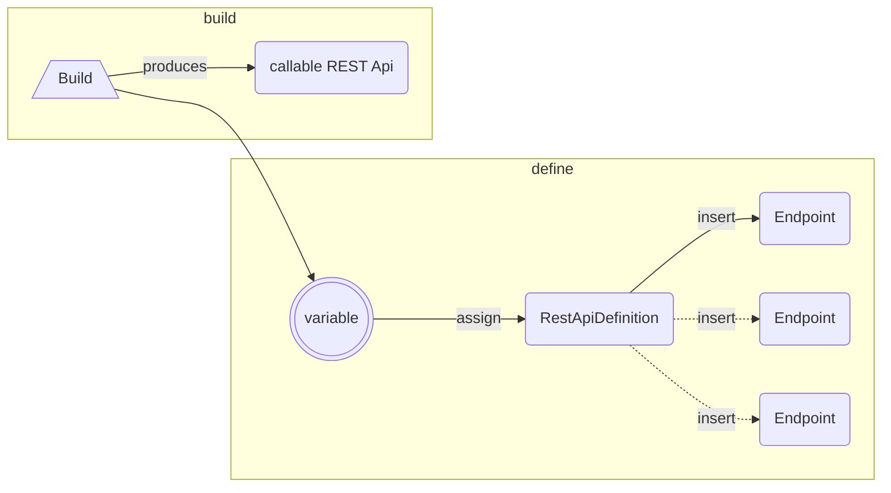

# API Library

The API Library provides a set of primitives for defining API's along with the ability to _build_ API's which use these primitives into fully type-safe API tools for callers to use.



## Example

By defining the API first:

```rust
use api::{ApiAuthMethod,RestApiDefinition,Endpoint,RestMethod};

lazy_static {
    static ref SOMEPLACE_API: RestApiDefinition = {
        let s = RestApiDefinition::new({
            base_url: Url::parse("https://api.someplace.com")?,
            auth: ApiAuthMethod::BearerToken,
            description: "The best API on the planet",
            docs: Url::parse("https://docs.someplace.com")?,
            open_api_definition: None
        });
        s.add_endpoint({
            id: "GetModels",
            method: RestMethod::Get,
            data: None,
            desc: "Get all the models hosted by the provider",
            path: "/models",
            response: ApiResponse::Json({ success: bool; data: SomeplaceModelResponse })
        })

        s
      }
}

pub SomeplaceApi = SOMEPLACE_API.render();
```

We are now able to build the project which takes place in two phases:

- definitions are compiled
- user callable structs are generated from the generated definitions

Now a caller can use our callable structs:

```rust
use api::{SomeplaceApi}

let models = await SomeplaceApi::GetModels({ auth: "my-bearer-token" });
```

## Top Level Features

- Allows an API to be **defined** with an explicit:
    - Auth Strategy
    - Base URL
    - Optional Documentation URL
    - Optional OpenAPI URL
    - With endpoints defined with:
        - ID (a alphanumeric name which could be used as an enum variant)
        - REST Method & Path
        - Typed Input Data (a serializable struct, `auth` property not allowed)
            - `GET`, `DELETE`, `HEAD` and `TRACE` will add data as query parameters
            - The rest add the data into the **body** of the request
        - Typed Response
            - Strongly type the response type:
                - `Plaintext`, `Csv`, and `Html` are all string formats but with a semantic hint
                - `Json` and `Yaml` allow you define the structure you expect once the string based response is parsed into JSON or YAML respectively
                - `Binary` indicates that a binary blob of some sort is being returned.
- Allows callers to use the _generated_ enumeration-per-api to call each endpoint in a type-safe manner.
    - The generated enumeration for an API will have a _variant_ for each endpoint defined
    - The enumeration will take a struct based key value who's type is determined by a combination of the `data` type defined during the definition phase, and the `auth` property which is defined as `String` if the Auth type is NOT `ApiAuthMethod::None`
