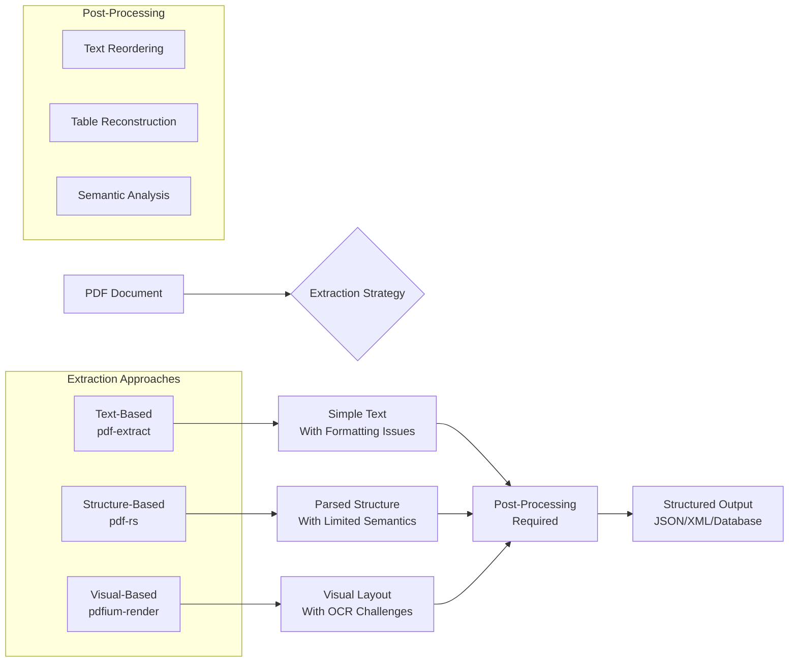
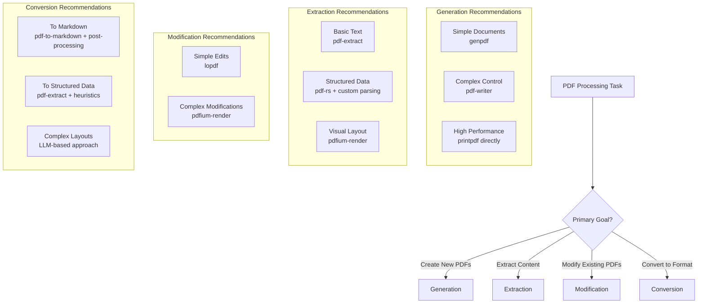

Certainly! I will analyze Rust PDF crates and document conversion challenges. The main contents are as follows:

- **Rust PDF Crates Overview**: Comparison of core PDF libraries and their use cases.
- **Detailed Crate Analysis**: In-depth look at lopdf, pdf-rs, pdf-writer, pdf-extract, pdfium-render, and genpdf.
- **PDF to Structured Content Challenges**: Key obstacles in converting PDFs to structured data.
- **PDF to Markdown Conversion**: Specific issues and solutions for Markdown output.
- **Recommendations**: Guidance on choosing the right library for specific use cases.

-------

# Comprehensive Guide to PDF Crates in Rust and Document Conversion Challenges

## 🔍 Overview of Rust PDF Ecosystem

The Rust PDF ecosystem offers several specialized crates, each designed for different aspects of PDF manipulation and conversion. These libraries generally fall into three categories: **low-level manipulation** (direct PDF structure editing), **high-level generation** (creating PDFs from structured data), and **content extraction** (parsing existing PDFs). Choosing the right crate depends heavily on your specific use case, whether you need to generate reports from data, extract text from existing documents, or modify PDF structure programmatically.

The following table provides a quick comparison of the major PDF crates in Rust:

| Crate | Primary Purpose | Core Features | Learning Curve | License |
| :--- | :--- | :--- | :--- | :--- |
| **lopdf** | Low-level manipulation | Direct structure access, comprehensive PDF support | Steep | MIT |
| **pdf-rs** | Parsing/analysis | PDF structure parsing, validation | Very Steep | MIT |
| **pdf-writer** | Generation from scratch | Streamlined creation API, performance focus | Moderate | MIT OR Apache-2.0 |
| **pdf-extract** | Text extraction | Text/metadata extraction, simple API | Low | MIT |
| **pdfium-render** | Comprehensive rendering | Render to bitmap, edit, create | Moderate | MIT OR Apache-2.0 |
| **genpdf** | High-level generation | Document layout, font handling | Low-Moderate | Apache-2.0 OR MIT |

## 📦 Detailed Analysis of PDF Crates

### 1. **lopdf** - Low-Level PDF Manipulation

**Core Features:**

- **Direct PDF Structure Access**: Provides complete access to PDF internal structures including objects, streams, and dictionaries
- **Creation and Modification**: Can create new PDFs from scratch or modify existing ones (with limitations)
- **Complete PDF Specification Support**: Implements PDF 1.7 specification with some PDF 2.0 features
- **Object Management**: Automatic tracking of object IDs and cross-reference tables
- **Content Stream Operations**: Allows creation of complex content streams using PDF operators

**Feature Flags:**

- `default`: Enables `chrono`, `jiff`, `rayon`, and `time` integrations.
- `chrono` / `time` / `jiff`: Enable specific date/time types in metadata (disable defaults if you only want one).
- `rayon`: Enables parallelized operations where supported.
- `async`: Enables async APIs backed by Tokio runtime + macros.
- `tokio`: Pulls in Tokio as a direct dependency when you need it in your API surface.
- `serde`: Enables serde support for PDF objects and metadata.
- `image`: Enables image decoding/encoding support.
- `embed_image`: Convenience helpers for embedding images (requires `image`).
- `wasm_js`: Enables `getrandom` support for wasm targets.

**Common Gotchas and Workarounds:**

- **Modification Limitations**: While lopdf can load and modify PDFs, some modifications like page reordering or complex content changes can be tricky. Users often report difficulties with certain operations.
    - *Workaround*: For complex modifications, consider extracting content to a new document rather than trying to modify in place
- **Steeper Learning Curve**: Requires understanding PDF internal structures and specifications
    - *Workaround*: Keep the PDF 1.7 Reference Document handy and study the provided examples carefully
- **Object Management Complexity**: Manual object ID tracking can be error-prone
    - *Workaround*: Always use the provided helper methods like `new_object_id()` and `add_object()` rather than managing IDs directly

### 2. **pdf-rs** - PDF Structure Parsing and Analysis

**Core Features:**

- **Comprehensive Parsing**: Robust parsing of PDF document structures including xref tables and trailers
- **Validation**: Includes PDF specification validation to identify malformed documents
- **Type Safety**: Strong typing for PDF objects through Rust's type system
- **Minimal Dependencies**: Designed to have minimal external dependencies for easier integration

**Feature Flags:**

- `default`: Enables `sync` and `cache`.
- `sync`: Uses the synchronous API surface (default).
- `cache`: Enables the shared object cache (default).
- `globalcache`: Shared cache implementation used by `cache`.
- `mmap` / `memmap2`: Use memory-mapped IO for large PDFs.
- `dump`: Debug dump of intermediate objects (uses `tempfile`).
- `threads`: Enable threaded JPEG decoding.
- `euclid`: Enable `euclid` geometry types.

**Common Gotchas and Workarounds:**

- **Read-Only Focus**: pdf-rs is primarily designed for parsing and analysis, not modification or creation
    - *Workaround*: Use pdf-rs for analyzing PDF structure and another crate for modification/creation
- **Steeper Learning Curve**: Requires deep understanding of PDF specification
    - *Workaround*: Start with simpler extraction tasks before attempting complex analysis
- **Limited Documentation**: Some advanced features may not be well-documented
    - *Workaround*: Consult the source code and test cases for usage examples

### 3. **pdf-writer** - Streamlined PDF Generation

**Core Features:**

- **Step-by-Step API**: Designed for creating PDFs from scratch with a more intuitive API than lopdf
- **Efficient Building**: Constructs documents into a single internal buffer for better performance
- **Modern Rust Design**: Takes advantage of Rust's type system and ownership model for PDF generation
- **Focused Functionality**: Specialized in creation rather than modification or extraction

**Feature Flags:**

- None (this crate has no feature flags in the current release).

**Common Gotchas and Workarounds:**

- **No Modification Support**: Cannot modify existing PDFs, only create new ones
    - *Workaround*: For template-based modifications, use lopdf or pdfium-render instead
- **Lower-Level Than genpdf**: While more intuitive than lopdf, still requires understanding PDF concepts
    - *Workaround*: Start with genpdf for simple documents and migrate to pdf-writer for more control
- **Limited Text Handling**: Advanced text layout and wrapping require additional work
    - *Workaround*: Combine with text layout libraries or use genpdf which includes text handling

### 4. **pdf-extract** - Simple Text Extraction

**Core Features:**

- **Straightforward Text Extraction**: Simple API for extracting text from PDF files
- **Metadata Extraction**: Can extract document metadata (title, author, etc.)
- **Page-by-Page Extraction**: Supports extracting text by pages or entire document
- **Memory and File Support**: Can work with in-memory bytes or file paths

**Feature Flags:**

- No specific feature flags - extraction functionality is fixed

**Common Gotchas and Workarounds:**

- **Text Order Issues**: Extracted text may not preserve logical reading order in complex layouts
    - *Workaround*: For documents with complex layouts, consider using pdfium-render or OCR-based approaches
- **Limited Formatting Information**: Doesn't preserve font, size, or color information
    - *Workaround*: Use pdf-rs or pdfium-render for detailed analysis of text properties
- **Encrypted PDFs**: Has limited support for encrypted documents
    - *Workaround*: Ensure PDFs are decrypted before processing or use pdfium-render which has better encryption support

### 5. **pdfium-render** - Comprehensive PDF Rendering

**Core Features:**

- **Render to Bitmap**: Can render PDF pages to images (bitmaps)
- **Edit and Extract**: Load, edit, and extract text and images from existing PDFs
- **Create from Scratch**: Can create new PDF files from scratch
- **High-Level API**: Provides a more Rust-like interface compared to raw bindings
- **Chromium's PDFium**: Uses the same C++ PDF library as Google Chromium

**Feature Flags:**

- `default`: Enables `pdfium_latest`, `thread_safe`, and `image` (which selects `image_latest`).
- `static`: Statically link Pdfium (useful for bundling/distribution).
- `thread_safe` / `sync`: Enable thread-safe APIs for multi-threaded use.
- `pdfium_latest` or `pdfium_<version>`: Pin Pdfium versions; `pdfium_future` enables V8/XFA/Skia toggles.
- `pdfium_enable_xfa`, `pdfium_enable_v8`, `pdfium_use_skia`, `pdfium_use_win32`: Optional Pdfium capabilities.
- `image_latest` / `image_025` / `image_024` / `image_023`: Select compatible `image` crate versions.
- `bindings`: Enable bindgen-generated bindings.
- `core_graphics`, `libc++`, `libstdc++`: Platform-specific static linking options.
- `flatten`, `paragraph`: Enable extra APIs (form flattening/text layout).

**Common Gotchas and Workarounds:**

- **External Dependency**: Requires the Pdfium library to be installed or bundled
    - *Workaround*: Install Pdfium on the system or enable `static` to bundle/link a known Pdfium build
- **Resource Management**: Proper management of PDFium handles and resources is critical
    - *Workaround*: Always use RAII guards and ensure proper cleanup, especially in long-running processes
- **Form Field Issues**: Some operations like form flattening may require page handle reloading
    - *Workaround*: Drop and reload page handles after certain operations

### 6. **genpdf** - High-Level Document Generation

**Core Features:**

- **User-Friendly API**: Designed for ease of use with abstractions over common PDF tasks
- **Document Layout**: Handles page layout, text alignment, and wrapping automatically
- **Font Handling**: Includes font selection and text rendering capabilities
- **Built on printpdf**: Uses printpdf as the underlying generation engine

**Feature Flags:**

- `default`: No additional features.
- `hyphenation`: Enables hyphenation support.
- `image`: Adds support for embedding images in PDF documents.
- `images`: Convenience flag that enables `image` plus printpdf's `embedded_images`.

**Common Gotchas and Workarounds:**

- **Limited Customization**: High-level abstractions may limit control over PDF details
    - *Workaround*: Drop down to printpdf for more control when needed
- **Font Complexity**: Advanced font features may require additional configuration
    - *Workaround*: Start with standard fonts and experiment with custom fonts as needed
- **Image Handling**: Image embedding requires careful consideration of formats and sizes
    - *Workaround*: Pre-process images to appropriate sizes and formats before embedding

## 🔄 Converting PDF to Structured Content

Converting PDF documents to structured content (like JSON, XML, or database records) presents several significant challenges. The PDF format was designed for faithful presentation rather than data extraction, which creates inherent obstacles.

### Key Problems and Solutions:



1. **Text Stream Without Semantics**
    - **Problem**: PDFs contain text instructions but lack semantic information about headings, paragraphs, tables, or lists. Text is often stored in drawing order rather than logical reading order.
    - **Workaround**: Use pdf-extract for basic text extraction, then implement heuristics to detect document structure (e.g., font size changes for headings, column detection). For better results, combine with pdfium-render to get spatial information and reconstruct layout.

2. **Complex Layout Reconstruction**
    - **Problem**: Multi-column layouts, sidebars, and floating elements are extremely difficult to convert to structured formats without preserving visual appearance.
    - **Workaround**: Use pdfium-render to render pages to images and analyze visual layout, or combine pdf-rs (for structure) with pdf-extract (for text) and implement spatial algorithms to detect columns and reading order.

3. **Tabular Data Extraction**
    - **Problem**: Tables in PDFs are often drawn as lines and text rather than semantic table structures, making it nearly impossible to programmatically extract tabular data without errors.
    - **Workaround**: Implement table detection algorithms using spatial analysis (via pdfium-render) or use specialized tools like Tabula (Java-based) that can be called from Rust. For simple tables, pdf-extract may suffice if combined with regular expression pattern matching.

4. **Font and Encoding Issues**
    - **Problem**: PDFs can use custom fonts, encodings, and subset fonts that make text extraction difficult or result in garbled text.
    - **Workaround**: Use pdf-rs or pdfium-render which have better font handling capabilities than pdf-extract. For problematic documents, consider OCR as a fallback when text extraction fails or produces low-quality results.

5. **Encrypted and Password-Protected PDFs**
    - **Problem**: Some PDFs have restrictions that prevent text extraction or modification.
    - **Workaround**: Use pdfium-render which has better support for handling encrypted documents, or ensure documents are decrypted before processing (if legal and authorized).

## 📝 Converting PDF to Markdown

Converting PDF to Markdown introduces specific challenges beyond general text extraction, as Markdown requires semantic interpretation of document structure.

### Key Problems and Solutions:

1. **Semantic Structure Identification**
    - **Problem**: Markdown requires headers (#), bold (**), lists (*), etc., but PDFs have no semantic markup—only visual formatting.
    - **Workaround**: Implement heuristics to detect document structure (e.g., large font for headings, indentation for lists, lines for tables). Tools like pdf-to-markdown attempt this but often produce imperfect results. For best results, consider a hybrid approach combining pdf-extract with some manual post-processing.

2. **Table Conversion**
    - **Problem**: Converting visually-drawn tables to Markdown table format is extremely error-prone.
    - **Workaround**: First extract tabular data using specialized tools (like Tabula) or custom spatial analysis algorithms. Then convert the extracted structured data to Markdown table format. For simple tables, regular expression pattern matching on extracted text may work.

3. **Image Handling**
    - **Problem**: Images in PDFs need to be extracted and embedded in Markdown documents.
    - **Workaround**: Use pdfium-render to extract images, then save them as separate files and reference them in Markdown with standard image syntax:
      ```md
      
      ```
      The conversion tool should handle path management automatically.

4. **Text Flow and Reading Order**
    - **Problem**: Multi-column layouts and sidebars can cause text to be extracted in the wrong order for linear Markdown.
    - **Workaround**: Use spatial analysis via pdfium-render to determine reading order, or for complex documents, consider an OCR-based approach that analyzes page images to determine reading order.

5. **Formatting Preservation**
    - **Problem**: Markdown has limited formatting options compared to rich PDF formatting (e.g., custom fonts, colors, precise positioning).
    - **Workaround**: Focus on preserving semantic structure rather than exact visual appearance. Consider using extended Markdown flavors (like GitHub Flavored Markdown) that support tables, strikethrough, etc., to better capture PDF formatting.

### Advanced Approach: LLM-Assisted Conversion

For challenging PDF-to-Markdown conversions, especially with complex layouts, an emerging approach is to use Large Language Models (LLMs):

1. **Render PDF Pages to Images**: Use pdfium-render to convert each PDF page to an image
2. **Process Images with LLM**: Send these images to a local LLM (using Ollama, for example) with a prompt to convert the visual content to Markdown
3. **Post-Process Output**: Clean up the LLM's Markdown output and fix any formatting issues

This approach can handle complex layouts, handwriting, and poor-quality scans but requires significant computational resources and may introduce hallucinations or inaccuracies.

## 🎯 Recommendations for Specific Use Cases

Based on the analysis of available crates and common challenges, here are recommendations for different PDF tasks:



### For PDF Generation:

- **Simple Documents**: Use **genpdf** for its user-friendly API and automatic layout handling
- **Complex Control**: Use **pdf-writer** for more control over PDF structure and better performance
- **High Performance**: Consider using **printpdf** directly if you need maximum performance and are comfortable with a slightly lower-level API

### For PDF Extraction:

- **Basic Text Extraction**: Use **pdf-extract** for its simplicity and ease of use
- **Structured Data Extraction**: Use **pdf-rs** for parsing structure combined with custom heuristics for semantic analysis
- **Visual Layout Analysis**: Use **pdfium-render** to access spatial information and render pages to images

### For PDF Modification:

- **Simple Edits**: **lopdf** can handle simple modifications like adding text or images
- **Complex Modifications**: **pdfium-render** provides more comprehensive editing capabilities including form filling and advanced modifications

### For PDF Conversion:

- **PDF to Markdown**: Try **pdf-to-markdown** for automated conversion, but expect to need post-processing for complex layouts
- **PDF to Structured Data**: Use **pdf-extract** for basic text, combined with custom heuristics or ML approaches for semantic structure
- **Complex Layouts**: Consider the LLM-based approach using **pdfium-render** for image generation and a local LLM for interpretation

> 💡 **Pro Tip**: For many projects, combining multiple crates yields the best results. For example, use pdf-rs to understand document structure, pdf-extract to get text, and pdfium-render to handle images and visual analysis. Each crate has its strengths, and leveraging them together can overcome individual limitations.

The Rust PDF ecosystem continues to evolve, with new crates and improvements to existing ones appearing regularly. When choosing a crate, always check for the latest version and review recent issues and pull requests to ensure the library is actively maintained and suitable for your specific needs.

## Sources

- lopdf: https://docs.rs/lopdf/ | https://crates.io/crates/lopdf
- pdf (pdf-rs): https://docs.rs/pdf/ | https://crates.io/crates/pdf
- pdf-writer: https://docs.rs/pdf-writer/ | https://crates.io/crates/pdf-writer
- pdf-extract: https://docs.rs/pdf-extract/ | https://crates.io/crates/pdf-extract
- pdfium-render: https://docs.rs/pdfium-render/ | https://crates.io/crates/pdfium-render
- genpdf: https://docs.rs/genpdf/ | https://crates.io/crates/genpdf
- printpdf: https://docs.rs/printpdf/ | https://crates.io/crates/printpdf
