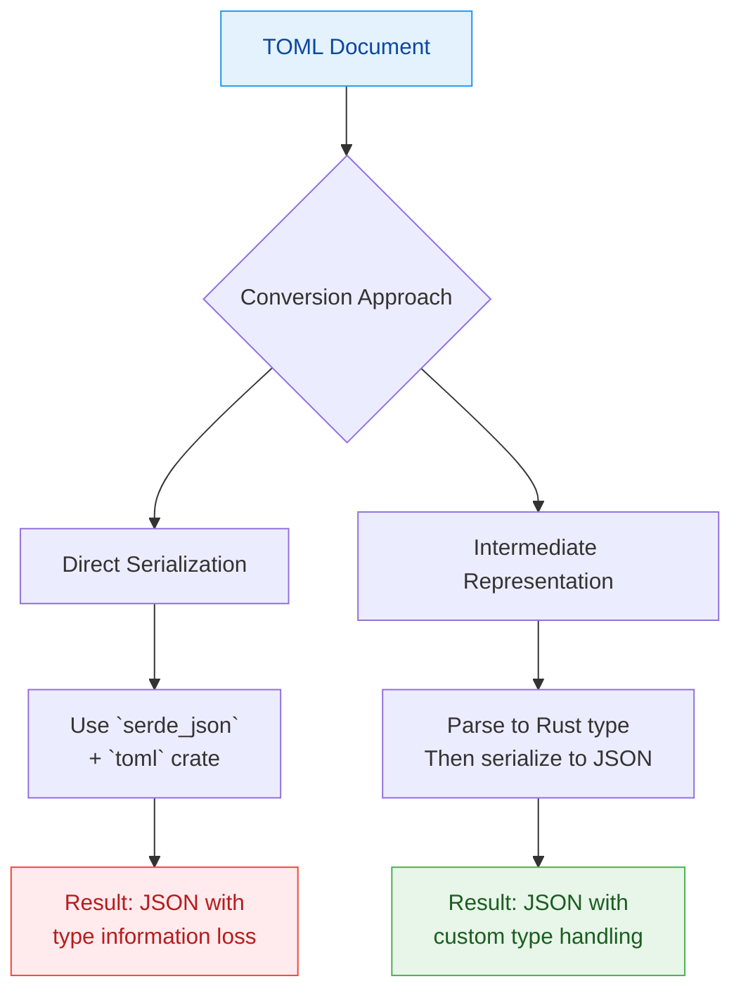
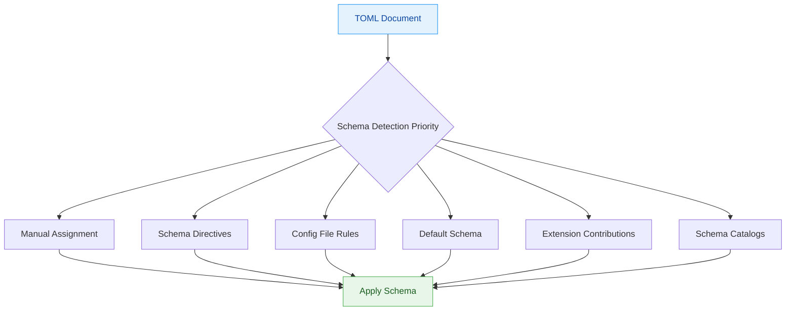
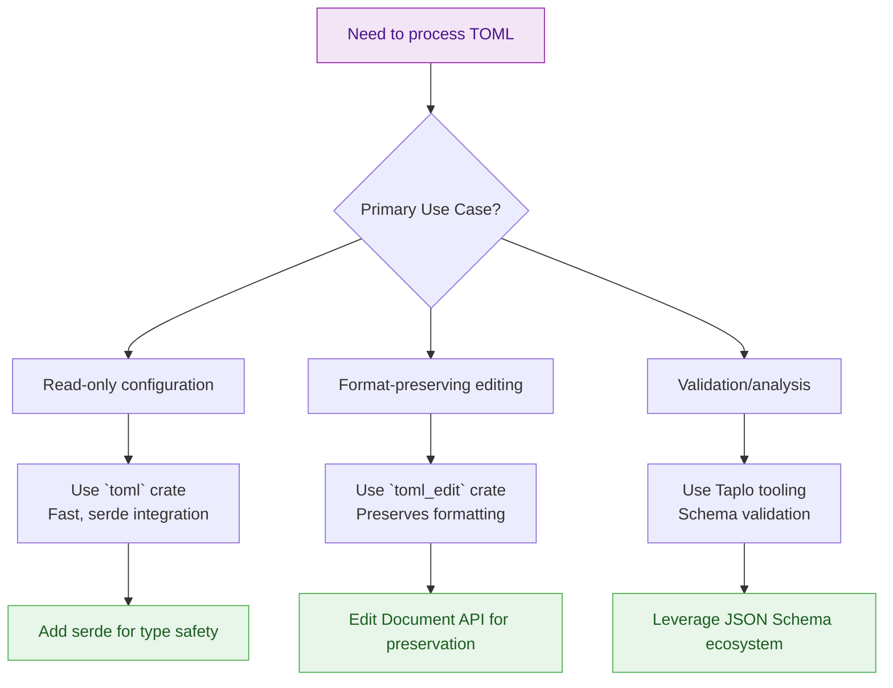

Certainly! I will provide a comprehensive overview of TOML crates in Rust, their features, conversion challenges, and schema standards. The main contents of the report are as follows:

- **TOML Crates Overview**: Introduces the main TOML parsing crates in Rust using a comparison table.
- **Detailed Crate Analysis**: Examines `toml`, `toml_edit`, and `taplo` crates with features, flags, and gotchas.
- **TOML Conversion Challenges**: Discusses conversion issues to JSON and YAML with resolution strategies.
- **Schema Standards**: Explains JSON Schema support and implementation across TOML crates.
- **Recommendations**: Provides guidance on selecting appropriate crates based on use cases.

-------

# Comprehensive Guide to TOML Processing in Rust: Crates, Conversion, and Schema Standards

## 🔧 1. Overview of TOML Crates in Rust

The Rust ecosystem offers several crates for **parsing**, **manipulating**, and **validating** TOML files, each with distinct strengths and use cases. Below is a comprehensive comparison of the most prominent TOML crates available:

*Table: Main TOML Processing Crates in Rust*

| **Crate** | **Primary Purpose** | **Key Features** | **Performance** | **Use Case** |
|-----------|---------------------|------------------|-----------------|--------------|
| **`toml`** | Fast parsing and serialization | High performance, serde integration, TOML 1.0 spec compliance | ⚡ **Fastest** | Read-heavy applications, config parsing |
| **`toml_edit`** | Format-preserving manipulation | Preserves comments/whitespace, document modification, format control | 🐌 **Slower** | Config file editing, IDEs, formatters |
| **`taplo`** | Analysis and formatting | Syntax checking, semantic validation, formatter, DOM analysis | 🔄 **Balanced** | Tooling, editors, validation pipelines |

## 📦 2. Detailed Analysis of Major TOML Crates

### 2.1 `toml` Crate

The `toml` crate is a **pure Rust parser** that provides high-performance TOML processing with full serde integration. It's the most widely used crate for reading TOML configurations.

#### Core Features:

- **TOML 1.0 spec compliance**: Implements the complete TOML 1.0.0 specification
- **Serde integration**: Seamless serialization and deserialization of TOML to Rust types via the `serde` crate
- **Type preservation**: Maintains precise typing for all TOML value types (strings, integers, floats, booleans, dates, arrays, tables)
- **Error reporting**: Detailed error messages with location information for parsing failures

#### Feature Flags and Usage:

```toml
[dependencies]
toml = "0.8"
```

Feature flags (toml 0.8.10):

- **`default`**: Enables `parse` and `display`.
- **`parse`**: Enables parsing APIs (uses `toml_edit` backend).
- **`display`**: Enables formatting APIs (uses `toml_edit` backend).
- **`indexmap`**: Use `IndexMap` for table storage.
- **`preserve_order`**: Enables `indexmap` to preserve key insertion order.

Serde is a hard dependency in 0.8.x (not feature-gated).

#### Common Gotchas and Solutions:

- **Loss of formatting**: Cannot preserve original formatting (comments, whitespace).
    - *Solution*: Use `toml_edit` when format preservation is needed.
- **Dotted keys are expanded**: Dotted keys are interpreted as nested tables during parsing/deserialization.
    - *Solution*: If you need to keep the original dotted-key syntax, edit with `toml_edit::Document` and avoid round-tripping through typed structs.

### 2.2 `toml_edit` Crate

The `toml_edit` crate provides **format-preserving TOML manipulation**, allowing users to parse, modify, and regenerate TOML files while maintaining original formatting, comments, and whitespace.

#### Core Features:

- **Format preservation**: Maintains comments, whitespace, and key ordering during modification
- **Document manipulation**: API for modifying TOML documents in place
- **TOML 1.0 compliance**: Full implementation of the TOML specification

#### Feature Flags and Usage:

```toml
[dependencies]
toml_edit = "0.22"
```

Feature flags (toml_edit 0.22.20):

- **`default`**: Enables `parse` and `display`.
- **`parse`**: Enables parsing support (via `winnow`).
- **`display`**: Enables formatting/display support.
- **`serde`**: Enables serde + `serde_spanned` + `toml_datetime/serde` support.
- **`perf`**: Enables `kstring` for faster internal string handling.
- **`unbounded`**: Disables recursion limits (can risk stack overflows on deep inputs).

#### Common Gotchas and Solutions:

- **Performance overhead**: Format-preserving parsing is usually slower and heavier than `toml`.
    - *Solution*: Use `toml` for read-only scenarios; use `toml_edit` when you need to edit and preserve formatting.
- **Round-tripping loses formatting**: Deserializing into Rust structs and re-serializing drops comments/whitespace.
    - *Solution*: Modify a `Document`/`DocumentMut` directly when preservation matters.
- **Lower-level API**: Editing nodes and decorating items is more manual than serde-based parsing.
    - *Solution*: Start with small, targeted edits to keep changes focused.

### 2.3 `taplo` Crate

The `taplo` crate is a **versatile TOML toolkit** designed for analysis, validation, and formatting of TOML documents, with particular emphasis on editor integration and language server capabilities.

#### Core Features:

- **TOML semantic validation**: Detects TOML spec violations (e.g., duplicate keys)
- **Syntax checking**: Comprehensive syntax validation and error reporting
- **Formatting**: Code formatter with configurable options
- **Analysis capabilities**: Document analysis for semantic understanding
- **Tooling integration**: Core library used by Taplo CLI/LSP for editor features

#### Feature Flags and Usage:

```toml
[dependencies]
taplo = "0.13"
```

Feature flags (taplo 0.13.0):

- **`default`**: Enables `serde`.
- **`serde`**: Enables serde support for DOM nodes.
- **`schema`**: Enables `schemars` (JSON Schema generation for formatter configuration).

#### Common Gotchas and Solutions:

- **Schema availability**: Requires JSON schemas to be available and properly configured
    - *Solution*: Use schema catalogs or proper schema association rules
- **Performance on large files**: May be slower on very large TOML files
    - *Solution*: Use selective validation or incremental parsing
- **Configuration complexity**: Requires configuration for optimal editor integration
    - *Solution*: Use well-maintained editor extensions and preset configurations

## 🔄 3. TOML Conversion Challenges and Solutions

### 3.1 Converting TOML to JSON

**Key Problems**:

- **Type system differences**: TOML has date/time types and richer numeric representations that JSON lacks
- **Comment preservation**: JSON doesn't support comments, so all comments are lost during conversion
- **Key quoting requirements**: TOML allows unquoted keys in many cases where JSON requires quotes
- **Structure mapping is mostly straightforward**: Tables map to JSON objects and arrays of tables map to arrays, but round-tripping can lose intent (inline tables, dotted keys).

**Resolution Strategies**:



- **Use serde for structured conversion**: When you control both ends of the conversion, define Rust structs that represent your TOML data and use serde to serialize to JSON, allowing custom type handling for dates and other special types.
- **Leverage existing tools**: Use CLI tools like `remarshal` or online converters for simple conversions
- **Handle type conversions explicitly**: Convert TOML dates to ISO 8601 strings in JSON, and handle numeric types appropriately (e.g., TOML's `3.0e3` vs JSON's number representation)

**Example Code**:

```rust
use serde_json::Value as JsonValue;

fn convert_toml_to_json(toml_str: &str) -> Result<String, Box<dyn std::error::Error>> {
    let toml_value: toml::Value = toml::from_str(toml_str)?;
    let json_value: JsonValue = serde_json::to_value(toml_value)?;
    Ok(serde_json::to_string_pretty(&json_value)?)
}
```

### 3.2 Converting TOML to YAML

**Key Problems**:

- **Syntax differences**: YAML's significant whitespace and flexible syntax can create mapping challenges
- **Type representation**: TOML's explicit types vs YAML's more lenient type system
- **Anchor/alias support**: YAML has reference mechanisms that TOML lacks
- **Multiline string handling**: Different approaches to multiline strings between the formats

**Resolution Strategies**:

- **Use established conversion tools**: Tools like `remarshal` are battle-tested
- **Implement a three-way conversion**: TOML → Rust types → YAML, using serde for both sides
- **Handle type normalization**: Convert TOML's explicit types to YAML's string representation where appropriate
- **Preserve structure mapping**: Map TOML tables to YAML mappings and arrays to sequences

**Practical Example**:

```bash
# Using remarshal (Go-based tool)
remarshal -if toml -of yaml input.toml > output.yaml

```

```rust
use serde_yaml;
use toml;

fn convert_toml_to_yaml(toml_str: &str) -> Result<String, Box<dyn std::error::Error>> {
    let toml_value: toml::Value = toml::from_str(toml_str)?;
    let yaml_value = serde_yaml::to_value(&toml_value)?;
    Ok(serde_yaml::to_string(&yaml_value)?)
}
```

**Common Conversion Pitfalls**:

1. **Datetime handling**: TOML `Datetime` values often need normalization (commonly to strings) for YAML output
2. **Inline tables**: TOML's inline tables may not preserve their inline representation in YAML
3. **Array of tables**: TOML's array of tables structure needs to be carefully mapped to YAML sequences of mappings

## 📋 4. Schema Standards for TOML Validation

### 4.1 JSON Schema for TOML

The **dominant schema standard** for TOML validation is **JSON Schema**. Despite the name, JSON Schema is format-agnostic and can be used to validate TOML documents effectively.

#### Implementation Approaches:

*Table: TOML Schema Validation Approaches*

| **Approach** | **Description** | **Pros** | **Cons** | **Supported By** |
|--------------|-----------------|----------|----------|------------------|
| **Direct Validation** | Convert TOML to JSON and validate against JSON Schema | Leverages existing JSON Schema tools | Loss of type information during conversion | Taplo tooling, `toml` + `jsonschema` |
| **Schema Mapping** | Map TOML structures directly to JSON Schema concepts | Preserves TOML type information | Requires custom mapping logic | Custom implementations |
| **Schema Directives** | Embed schema hints directly in TOML files | Self-documenting, explicit | Conventions vary by tool | Taplo supports a `# schema:` comment directive |

#### Taplo's Schema Support:
Taplo tooling (CLI/LSP) provides **comprehensive schema validation** capabilities through multiple mechanisms:

1. **Manual Schema Assignment**: Specify schemas via CLI flags or IDE settings
2. **Schema Directives**: Embed schema URLs at the top of TOML documents:

   ```toml
   # schema: https://example.com/schema.json
   [package]
   name = "my-package"
   ```

3. **Configuration Files**: Define schema associations in config files
4. **Schema Catalogs**: Use centralized schema catalogs for automatic schema association
5. **Editor Extensions**: Integration with VS Code and other editors for automatic schema detection

#### Schema Discovery Mechanisms:



### 4.2 TOML Schema Standards Status

There is no official TOML schema standard today. In practice, tooling relies on JSON Schema plus tool-specific association rules (config files, SchemaStore, or inline directives). That means schemas are shared, but validation behavior can vary across tools.

- **SchemaStore Initiative**: A community project that maintains a catalog of JSON schemas for common configuration files, including many TOML files.
- **Editor/tooling conventions**: Tools like Taplo and editor extensions interpret schema associations based on local config and schema catalogs.

#### Crate-Specific Schema Support:

| **Crate** | **Schema Support** | **Implementation Approach** | **Notes** |
|-----------|-------------------|----------------------------|-----------|
| **`taplo`** | ✅ Full support | Direct JSON Schema validation | Most comprehensive support |
| **`toml`** | ⚠️ Indirect support | Requires conversion to JSON for validation | Works via `serde_json` integration |
| **`toml_edit`** | ⚠️ Indirect support | Convert `Document` to `toml::Value` or JSON before validation | Formatting is orthogonal to validation |

## 🎯 5. Recommendations and Best Practices

### 5.1 Choosing the Right TOML Crate



### 5.2 Best Practices for TOML Processing

- **For read-heavy applications**: Use `toml` with serde for maximum performance and type safety
- **For config editing tools**: Use `toml_edit` to preserve user formatting and comments
- **For validation pipelines**: Use `taplo` with JSON schemas for comprehensive validation
- **For conversion tasks**: Consider intermediate representation through Rust types for better control
- **For editor integration**: Use Taplo tooling (CLI/LSP) for rich editor support

### 5.3 Future Directions

The Rust TOML ecosystem is evolving rapidly, with several exciting developments:

- **Schema tooling growth**: More TOML schemas and better discovery/association in editors
- **Performance improvements**: Ongoing optimization across parsers and format-preserving editors
- **Enhanced tooling**: Better integration with editors and development environments
- **Validation depth**: Richer linting and diagnostics built on JSON Schema + tooling rules

## 💎 Conclusion

The Rust ecosystem provides a **robust set of tools** for TOML processing, each optimized for specific use cases. By understanding the strengths and limitations of `toml`, `toml_edit`, and `taplo`, developers can make informed decisions about which crate best fits their needs. JSON Schema is the de facto approach for validation in current tooling, but behavior can still vary by tool and configuration.

When working with TOML in Rust, always consider whether you need **read performance**, **format preservation**, or **validation capabilities**, and choose your crate accordingly. The conversion challenges between TOML, JSON, and YAML can be effectively managed through serde and established conversion tools, while schema validation provides the type safety that developers expect from modern configuration systems.
