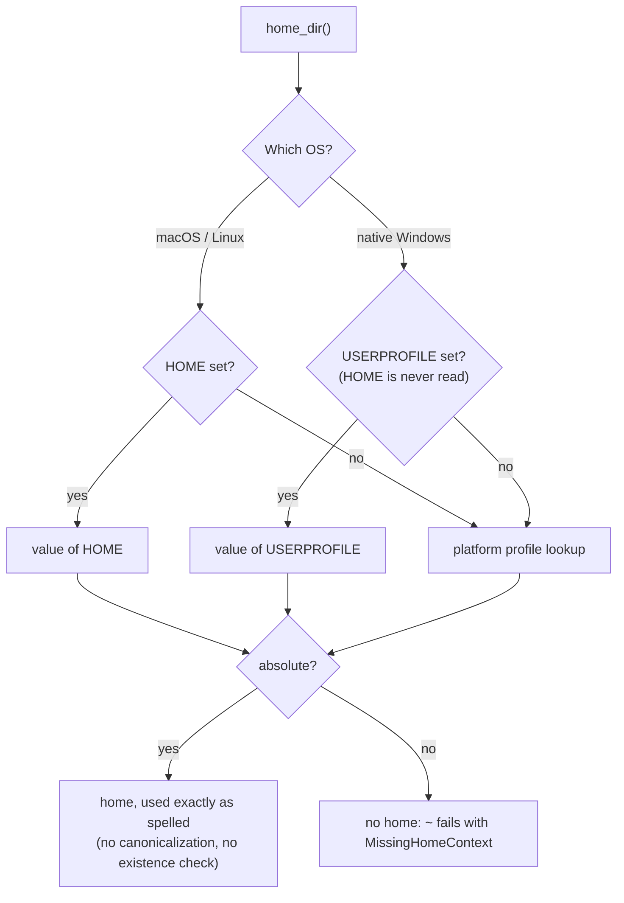
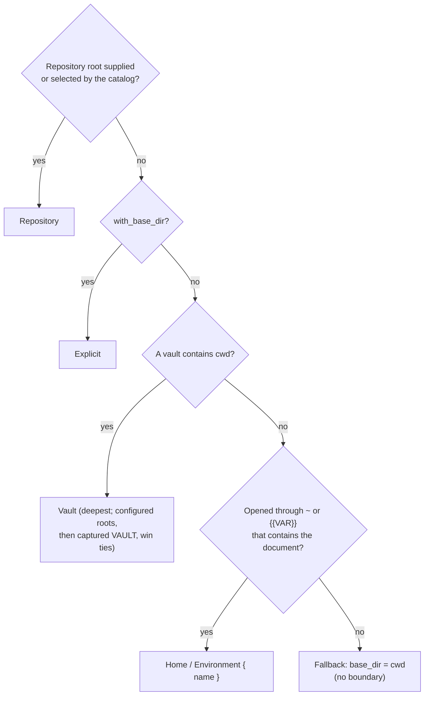
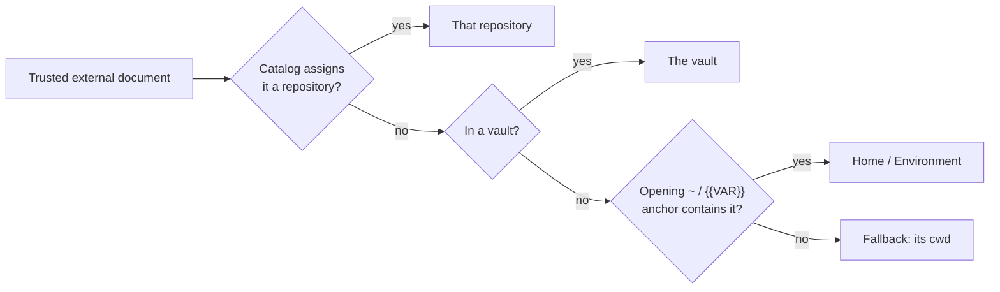
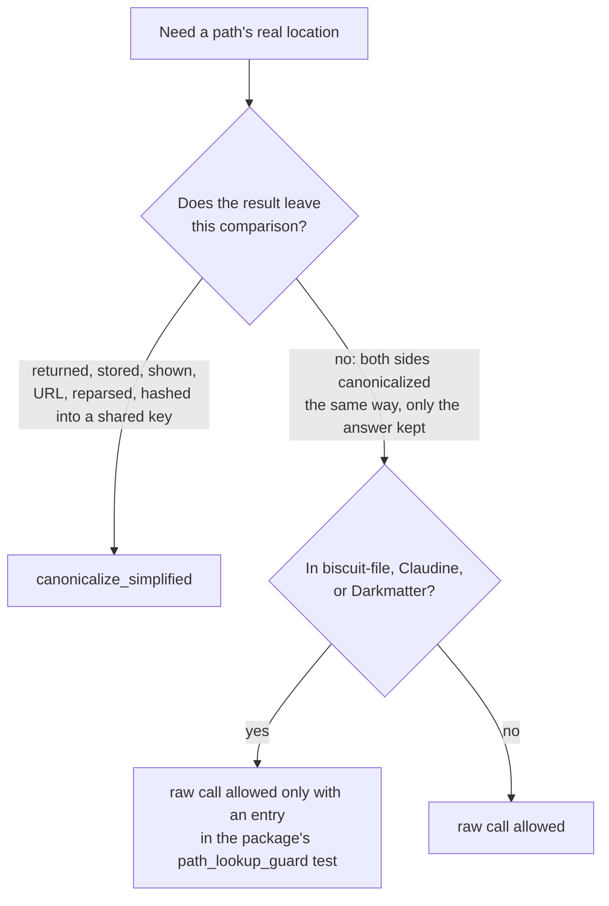
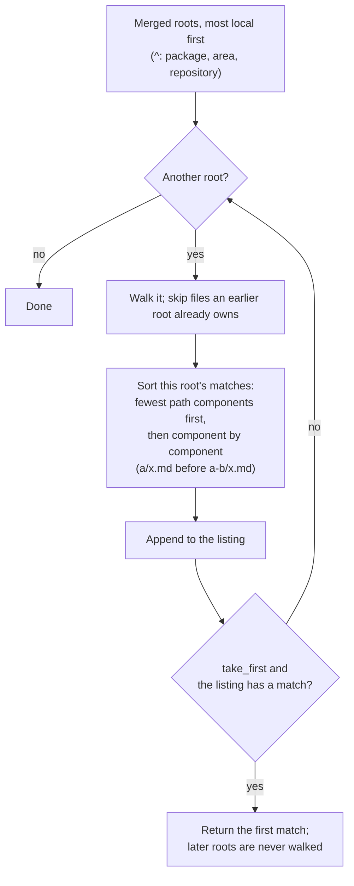
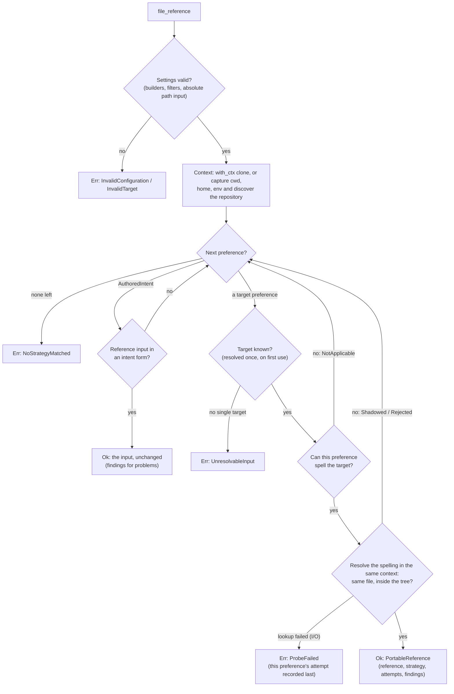

---
blast_radius:
- biscuit-file/lib/src/file_reference/mod.rs
- biscuit-file/lib/src/file_reference/parse.rs
- biscuit-file/lib/src/file_reference/resolve.rs
- biscuit-file/lib/src/file_reference/context.rs
- biscuit-file/lib/src/file_reference/error.rs
- biscuit-file/lib/src/file_reference/glob/mod.rs
- biscuit-file/lib/src/file_reference/glob/parse.rs
- biscuit-file/lib/src/file_reference/glob/roots.rs
- biscuit-file/lib/src/file_reference/glob/list.rs
- biscuit-file/lib/src/file_reference/glob/matches.rs
- biscuit-file/lib/src/file_reference/glob/error.rs
- biscuit-file/lib/src/lib.rs
- biscuit-file/lib/Cargo.toml
---
# File References in `biscuit-file`

A **file reference** is a compact string — `README.md`, `@docs/spec.md`,
`&Cargo.toml`, `~/.config/app.toml` — that describes *where a file lives
relative to project structure* instead of committing to an absolute path at
authoring time. You parse the string once, then resolve it against captured
state to get a real path:

```rust,no_run
use biscuit_file::FileReference;

// "@" means: search the local tree's well-known roots (package, package
// area, git repo root) before HOME, plus any roots you configure. Parsing
// reads nothing from the environment.
let spec = FileReference::new("@docs/spec.md")?;

// Resolution probes the filesystem. Some(path) = found; None = clean miss.
if let Some(path) = spec.resolve()? {
    println!("found: {}", path.display());
}
# Ok::<(), biscuit_file::FileReferenceError>(())
```

This document is the primary reference for the feature. It assumes you know
Rust but nothing about this library.

## The Five Ideas That Explain Everything Else

1. **Parsing is pure.** `FileReference::new()` only classifies the string. It
   never reads the filesystem, environment variables, or the process working
   directory. A `FileReference` is just "what the author wrote," typed.

2. **Resolution needs state, and you choose how to supply it.** There are two
   API families:
   - **Explicit context** (recommended for anything non-trivial): you build a
     [`FileResolutionContext`](#capturing-state-fileresolutioncontext) once,
     capturing the environment, home directory, repository root, and any
     configured search roots. Every later resolution reads *only* that
     snapshot — nothing ambient, ever. Deterministic and immune to
     `set_current_dir` surprises.
   - **Ambient convenience** (`resolve()`, `resolve_from(cwd)`): the library
     reads live process state (CWD, `$HOME`, git discovery) at call time.
     Fine for simple CLI tools and one-off lookups.

3. **Each reference kind has a fixed, closed candidate list.** The sigil
   (`@`, `&`, `^`, `~`, `./`, none, …) selects an ordered list of base directories.
   Resolution joins the path onto each base in order and takes the **first
   existing regular file**. There is no cross-kind fallback: a missed `./foo`
   is never retried as a magic path, a missed `@foo` never falls back to a
   bare-path search.

4. **Three outcomes, cleanly separated.**
   - `Ok(Some(path))` — a candidate matched.
   - `Ok(None)` — the reference is well-formed but nothing matched. Whether a
     miss is an error is *your* policy decision, not the library's.
   - `Err(FileReferenceError)` — the reference is malformed, or resolution
     required state that is genuinely unavailable (missing env var, no vault
     configured, no home directory, …).

5. **Anchors are supplied, not guessed.** In explicit-context mode the caller
   supplies a repository scope catalog;
   `biscuit-file` deliberately performs no trusted discovery of its own.
   ambient mode discovers only the repository root live as a compatibility convenience.

## Syntax Quick Reference

| Prefix                | Kind                  | Resolves against                                                | Example                            |
|-----------------------|-----------------------|-----------------------------------------------------------------|------------------------------------|
| `./` or `../`         | **Explicit relative** | The working directory (`cwd`) only; no fallback; stays in the [file tree](#the-file-tree-base_dir-and-the-relative-boundary) | `./src/main.rs`, `../a.md`         |
| _(none)_              | **Implicit relative** | The working directory (`cwd`), then the git repository root; stays in the file tree | `README.md`, `docs/spec.md`        |
| `/`, drive, or UNC    | **Absolute**          | Used verbatim                                                   | `/etc/config.toml`, `C:\\cfg.toml` |
| `~` or `~/`           | **Home**              | The user's home directory only (`~user` unsupported)            | `~/.config/app.toml`               |
| `@` or `@/`           | **Magic**             | Local-tier roots (package, package area, local root), then HOME | `@docs/spec.md`                    |
| `&` or `&/`           | **Repository root**   | The repository root only; repository-contained                  | `&README.md`                       |
| `^` or `^/`           | **Repository scoped** | Package, package area, then repository; repository-contained    | `^README.md`                       |
| `vault:` or `vault::` | **Vault**             | Configured vault root directories                               | `vault:notes/today.md`             |
| `http://`, `https://` | **Remote URL**        | A typed remote target; never a local candidate                  | `https://example.com/a.md`         |

Two modifiers compose with the kinds above:

- a leading `%` switches to [recursive directory search](#recursive-search-);
- any segment may contain [`{{VAR}}` environment interpolation](#environment-variable-interpolation).

**"Working directory"** (`cwd`) above means: the process CWD in ambient mode, or the
context's `cwd` in explicit-context mode (typically the directory of the
document that authored the reference).

The grammar reserves recognized introducers. A value beginning with `@`, `&`,
`^`, `%`, `~`, `vault:`, `http://`, or `https://` must satisfy that form's
grammar; malformed input is not reinterpreted as an implicit path. The removed
`!` sigil is also reserved and returns `InvalidSyntax` with a suggestion to use
`^`. Environment interpolation cannot inject a sigil into an otherwise
implicit reference.

### Which sigil should an author use?

| The file's identity is…                              | Write        |
|------------------------------------------------------|--------------|
| "belongs to this document" (moves with it)           | `./` / `../` |
| "try beside this document, then at the repository"   | bare path    |
| "belongs exactly at a repository path"               | `&`          |
| "belongs to the nearest repository sub-project"      | `^`          |
| "find it in the usual places"                        | `@`          |
| "belongs to this user"                               | `~`          |
| "lives in my notes/knowledge-base vault"             | `vault:`     |
| "is exactly this path"                               | absolute     |

Bare paths are `cwd`-first, so a document-local copy shadows the repository
copy. Use `&README.md` when the repository-root identity is required, or
`^README.md` for package → package-area → repository fallback.

## Reference Kinds

### Explicit Relative (`./`, `../`)

A leading `./` or `../` (or the `.\`/`..\` Windows spellings) pins the lookup
to the working directory. There is exactly one candidate and no fallback.

```text
./README.md         → <cwd>/README.md
../sibling/foo.md   → <cwd>/../sibling/foo.md   (normalized)
```

**Use it when** the file belongs to the authoring document and should move
with it — an image next to a markdown file, a fragment included by a template.

With an explicit context, a relative reference may not leave the
[file tree](#the-file-tree-base_dir-and-the-relative-boundary): `../` that
climbs above the tree root is a `RelativeTreeEscape` error, not a lookup.

### Implicit Relative (bare path)

A bare path with no recognized prefix gets two candidates, in this order:

1. the **working directory** (`cwd`), then
2. the **root of the enclosing git repository** (when one is known).

```text
docs/spec.md        → <cwd>/docs/spec.md, then <git_root>/docs/spec.md
```

If no repository is known, the
working directory is the only candidate. When `cwd` *is* the repository root,
the two candidates collapse into one. A miss returns `Ok(None)`.

```rust,no_run
use biscuit_file::FileReference;

// From <repo>/some/deep/dir, this tries the deep directory before the repo root.
let path = FileReference::new("README.md")?.resolve()?;
# Ok::<(), biscuit_file::FileReferenceError>(())
```

**Use it when** the file has a stable repository-level address (`CLAUDE.md`,
`docs/architecture.md`, a root `justfile`).

### Absolute

The path is used exactly as written — one candidate, no search. POSIX
(`/etc/hosts`), Windows drive (`C:\cfg.toml`), and UNC paths are all
recognized on every host, but only resolve on a host where they are absolute.
Nothing is translated between operating systems: resolving `C:\cfg.toml` on
macOS or Linux, or `/etc/hosts` on Windows (where it names no drive), fails
with `ForeignAbsolutePath` rather than being probed against the process's
working directory or current drive. The same check applies when interpolation
produces the absolute path.

```rust,no_run
use biscuit_file::FileReference;

let path = FileReference::new("/etc/hosts")?.resolve()?;
# Ok::<(), biscuit_file::FileReferenceError>(())
```

### Home (`~`)

`~` and `~/...` (plus the Windows `~\...` spelling) pin resolution to the
current user's home directory — one candidate, no repository or search-root
fallback. Unlike a shell, `~user` expansion is **not** portable and is
rejected at parse time with `FileReferenceError::UnsupportedUserHome`.

```text
~                   → <home>
~/.config/app.toml  → <home>/.config/app.toml
```

The home directory comes from the resolution context, which captures it
once with `biscuit_file::home_dir()` (ambient mode reads it the same way).
That reader is the process environment: `HOME` on macOS and Linux,
`USERPROFILE` on native Windows, each with the platform's own profile lookup
as the fallback when the variable is unset. A relative value counts as no
home at all; there is no second lookup that could undo an override. The home
is used exactly as spelled: not canonicalized, not checked for existence.

```text
HOME=/tmp/fixture         (macOS/Linux)  ~/app.toml → /tmp/fixture/app.toml
USERPROFILE=D:\fixture    (Windows)      ~/app.toml → D:\fixture\app.toml
HOME=D:\fixture only      (Windows)      ~ still follows USERPROFILE
HOME=relative/dir                        no home → MissingHomeContext
```

To relocate home on native Windows, set `USERPROFILE`; setting only `HOME`
is not enough. The environment is an input chosen by whoever launches the
process, not proof of a trusted filesystem boundary.



Code that needs the home calls `biscuit_file::home_dir()` rather than
`dirs::home_dir()` or `std::env::home_dir()`. On Windows `dirs::home_dir()`
asks the OS for the profile folder and ignores `USERPROFILE`, so a program
using it would read one home while `~` resolved against another. A caller
that serves one request captures the value once and passes it down, so every
read in that request sees the same home:

```rust
use biscuit_file::FileResolutionContext;

// Captures home_dir() once; every `~` in this context uses that value.
let ctx = FileResolutionContext::new("/work/repo");
let home = ctx.home_dir();
# let _ = home;
```

If the explicit context has no home directory, resolution fails with the
typed `MissingHomeContext` — not a silent miss.

Note the difference from magic references: `@` *includes* HOME in its search
list, but `~` is home-*pinned* with no other candidate.

### Magic (`@`)

Magic references search a prioritized list of root directories — the most
flexible kind, for files that could live at the project root, in your home
directory, or in application-defined convention directories.

`@docs/spec.md` and `@/docs/spec.md` are equivalent spellings: the grammar
consumes exactly one optional `/`, and the remaining payload must be
relative. Repeated POSIX separators and Windows drive-qualified, rooted, or
UNC payloads are rejected with `InvalidSyntax` rather than being allowed to
replace a configured magic root.

The governing rule is **local before home**: every root in the local tree is
searched before any home-based root, so a file beside the user always beats a
same-named file in their home configuration.

The **local root** is the repository root when the request directory is inside
one, and otherwise the request directory itself — whether or not that
directory is below `$HOME`. (Before this rule, a request outside any
repository never searched its own directory.) Every root belongs to one of two
tiers, and the search order is:

1. **Local prepends** — local-tier roots added at `PathPosition::Start`, in
   registration order;
2. **the package root** selected for the request directory (when known);
3. **the package-area root** selected for the request directory (when known);
4. **the local root** — the repository root, or the request directory when
   there is no repository;
5. **Local appends** — local-tier roots added at `PathPosition::End`;
6. **User prepends** — user-tier roots added at `PathPosition::Start`;
7. **the home directory** (when known);
8. **User appends** — user-tier roots added at `PathPosition::End`.

A configured root's **tier** is inferred by lexical containment (after
`.`/`..` and Windows verbatim normalization) in the local root: inside it is
local; everything else — `~/.myapp`, `/opt/configs` — is user tier. Tier is
decided by the local root, never by `$HOME`, so a repository nested in home
(`~/config/sh`) is unambiguous: `~/config/sh/.myapp` is local and `~/.myapp`
is user. Containment cannot tell the two apart when the local root *is*
`$HOME` (a launch from `$HOME`, or `$HOME` as a repository), so a caller that
knows a root is a user convention registers it with
`add_magic_path_with_tier(path, position, MagicPathTier::User)`; the override
wins over inference in every layout. Plain `add_magic_path` means
`MagicPathTier::Inferred`.

`PathPosition` therefore orders a root only **within its tier**: `Start`
precedes and `End` follows that tier's intrinsic roots. No position can move a
user-tier root ahead of a local one. After ordering, roots are deduplicated by
[`PathIdentity`](#path-identity), keeping the first occurrence, its
provenance, and its spelling — a configured root equal to an intrinsic root is
searched once, as `Magic`.

A relative configured root is joined onto the captured request directory, not
the process working directory, and the tier test uses that same absolute path.
For the ambient `resolve_from(cwd)` form the request directory is `cwd`, so
a relative root follows `cwd`; earlier releases interpreted it against the
process working directory.

The first candidate confirmed to be a regular file wins. Missing and
non-file candidates advance the search; any other I/O failure stops it with a
typed error.

```text
@docs/spec.md       → <package>/docs/spec.md, <area>/docs/spec.md, <repo>/docs/spec.md, ~/docs/spec.md
@.bashrc            → <package>/.bashrc, <area>/.bashrc, <repo>/.bashrc, ~/.bashrc
@notes.md (no repo) → <request-dir>/notes.md, ~/notes.md
```

```rust,no_run
use biscuit_file::{FileReference, PathPosition};

// Out of the box: package → package area → repository → HOME.
let path = FileReference::new("@docs/spec.md")?.resolve()?;

// With application convention directories. Neither root lies in the local
// tree, so both are user tier: /opt/configs is searched after every local
// root but before HOME; /etc/defaults is searched last.
let path = FileReference::new("@config.toml")?
    .add_magic_path("/opt/configs", PathPosition::Start)
    .add_magic_path("/etc/defaults", PathPosition::End)
    .resolve()?;
# Ok::<(), biscuit_file::FileReferenceError>(())
```

**Use it when** you want convention-over-configuration lookup — "find
`plan.md` wherever this application usually keeps prompts." Applications
embedding this library typically prepend their own convention roots so that
`@name.md` checks the nearest, most specific location first: local convention
directories as local prepends, and home convention directories as user-tier
roots that sit behind the whole local tree.

In an explicit context the local root and its package anchors come from the
[launch `@` scope](#the-launch--scope), which survives derivation, so `@`
inside a nested document still searches the tree the request was launched
from.

### Repository Root (`&`) and Repository Scoped (`^`)

`&path` has exactly one candidate: `<repository_root>/path`. `^path` searches
the package root containing the reference `cwd`, then its package-area root,
then the repository root. Missing levels and duplicate roots are skipped.
Both forms require a repository and reject lexical `..` escapes plus existing
symlink, junction, or reparse targets that resolve outside it.

Containment is checked twice: lexically after component normalization, then
canonically against an existing target or its deepest existing ancestor. This
closes ordinary symlink, junction, and reparse-point escapes at resolution
time, but it is still subject to filesystem time-of-check/time-of-use races. A
different process can replace a checked path before a later open. `biscuit-file`
is a resolver, not a filesystem sandbox; consumers needing adversarial
confinement must use operating-system sandboxing or handle-relative secure-open
primitives.

In a shell, `&` is a control operator. Quote repository-root references passed
as arguments or setter values, for example `spec='&docs/plan.md'`.

### Vault (`vault:` / `vault::`)

Vault references search configured vault roots — designed for personal
knowledge bases, notes systems, or any file collection kept in well-known
locations outside the project. Both spellings behave identically; the
double-colon form exists for compatibility with `scheme::path` syntaxes.

Roots are checked in this order:

1. explicitly configured roots, via `add_vault()`, in the order added;
2. the **`$VAULT` environment variable**, split on the platform path
   separator (`:` on Unix, `;` on Windows).

```rust,no_run
use biscuit_file::FileReference;

let path = FileReference::new("vault:notes/today.md")?
    .add_vault("/personal/vault")
    .add_vault("/shared/vault")
    .resolve()?;
# Ok::<(), biscuit_file::FileReferenceError>(())
```

If neither `add_vault()` nor `$VAULT` provides any roots, resolution fails
with `FileReferenceError::VaultNotConfigured` — a configuration problem, not
a miss.

### Remote URLs (`http://`, `https://`)

A URL parses into a typed remote reference. It never becomes a local
candidate: sending it through local-path resolution fails with
`RemoteNotLocal`. With the `url` feature, `resolve_target_in_context(&ctx)`
distinguishes `Resolved::Local` from `Resolved::Remote` so callers can route
remote references to the separate fetching API (whose failures are
`FetchError`, a different type from `FileReferenceError`). A `{{VAR}}` in the
URL is filled from the context's environment, so
`https://{{DOCS_HOST}}/guide.md` names the host the request was given, not
whatever the process has. `resolve_target()` is the ambient twin.

## Modifiers

### Recursive Search (`%`)

A leading `%` turns a reference into a search: it finds the **most local**
file whose path ends with the payload, below the roots the reference kind
would otherwise join against. It is `take_first` of the
[glob reference](#glob-references-globreference) `**/<payload>` under the
same prefix, with the payload kept literal:

```text
%@README.md       → first match of  @**/README.md
%./config.toml    → first match of  ./**/config.toml
%@docs/spec.md    → first match of  @**/docs/spec.md   (a spec.md whose parent ends with docs)
%vault:notes.md   → first match of  vault:**/notes.md
%pages/[id].md    → finds a file literally named [id].md
%/srv/conf/x.md   → first match of  /srv/conf/**/x.md (an absolute payload searches below its directory)
```

"Most local" is the glob's native order: the first root, in the kind's
precedence order, that holds any match wins, and within it the shallowest
match. From inside a package, `%^README.md` returns the package's
`x/y/README.md` before the repository root's `README.md`; later roots are not
searched once a root has a match.

Recursive references use the same post-interpolation anchoring, roots, and
boundary checks as direct references, and the search does **not** follow
directory symlinks. In [detailed diagnostics](#diagnostics-resolve_detailed),
each root is recorded with `ProbeDisposition::SearchRoot` rather than as a
direct candidate probe.

### Environment Variable Interpolation

Any path segment can include `{{VAR_NAME}}` placeholders. Names must match
`[A-Z0-9_]+`; empty (`{{}}`) or invalid (`{{invalid-name}}`) names are
rejected at **parse** time with `InvalidSyntax`. Expansion itself happens at
**resolution** time:

- explicit-context methods expand from the environment captured in the
  `FileResolutionContext`;
- ambient methods read a live environment snapshot when called;
- a variable absent from the selected snapshot fails with
  `MissingEnvironmentVariable`.

```text
{{PROJECT_ROOT}}/docs/spec.md
@configs/{{APP}}/settings.toml
%vault:{{VAULT_NAME}}/notes.md
```

Multiple placeholders expand left-to-right. Remote-target interpolation
retains unresolved placeholders verbatim; local-path resolution is the strict
form described here.

**Interpolation can change the anchoring — but never the grammar.** For the
local family (explicit-relative, implicit-relative, absolute), the *effective*
anchoring is re-derived from the payload after one interpolation pass, for
both direct and `%` recursive references. So an implicit
`{{PROJECT_ROOT}}/docs/spec.md` whose variable expands to an absolute path
resolves as an absolute reference instead of silently joining the expansion
onto a search root. The detailed resolver exposes both the authored kind
(`class().kind`) and the effective anchoring (`effective_kind()`), so this is
observable. What interpolation may **not** do is inject a sigil: a local
reference whose expanded payload begins with `@`, `&`, `^`, `%`, `vault:`, or a
case-insensitive HTTP(S) scheme is rejected with `InvalidSyntax` rather than
reinterpreted. Sigils remain author-controlled; authored `@`/`&`/`^`/vault/URL
references keep their classification and interpolate within it.

## Capturing State: `FileResolutionContext`

The explicit API's promise: **capture once, resolve many times, read nothing
ambient in between.**

```rust,no_run
use std::collections::HashMap;
use std::path::PathBuf;
use biscuit_file::{
    FileReference, FileResolutionContext, PackageAreaFallback, PathPosition,
    RepositoryScopeCatalog,
};

let launch_dir = PathBuf::from("/work/repo");
let repo_root = launch_dir.clone();
let package_area = repo_root.join("biscuit-file");
let package_root = package_area.join("lib");
let scopes = RepositoryScopeCatalog::new(
    repo_root.clone(),
    vec![package_area],
    vec![package_root],
    PackageAreaFallback::FirstComponent,
)?;
let env = HashMap::from([("DOCS_DIR".to_string(), "docs".to_string())]);

// Capture request-wide inputs once, at the start of the request.
let request = FileResolutionContext::new(&launch_dir)
    .with_repository_scope_catalog(scopes)
    .with_env(env)
    .add_magic_path(repo_root.join("prompts"), PathPosition::Start)
    .add_vault(repo_root.join("notes"));

// A file-backed document becomes the authoring source: its references
// resolve with cwd = the document's parent directory, while every
// process-state inputs carry over while repository scopes are selected again
// from the catalog for the document's directory.
let document = request.for_source(repo_root.join("docs/guide.md"));
let resolved = FileReference::new("./images/diagram.png")?
    .resolve_in_context(&document)?;

// Nested documents derive again — still no rediscovery.
let nested = document.for_source(repo_root.join("includes/chapter.md"));
assert_eq!(nested.cwd(), repo_root.join("includes"));
# let _ = resolved;
# Ok::<(), biscuit_file::FileReferenceError>(())
```

`FileResolutionContext::new(cwd)` captures the process environment and
the home directory (`home_dir()`, see [Home](#home-)) once. Variables whose name or value is not
valid Unicode are left out of the snapshot, so a reference naming one fails
with `MissingEnvironmentVariable`. `with_env(map)` **replaces** that snapshot
rather than adding to it — after
`.with_env(HashMap::from([("APP".into(), "x".into())]))`, `{{HOME}}` is
missing. To add variables while keeping the captured ones, extend a copy of
`ctx.env()` and pass that. Everything trusted — the repository
scope catalog plus magic and vault roots — is *supplied by you*; `biscuit-file`
deliberately leaves that discovery to the caller so the context is a pure
data snapshot.

Every directory the context treats as a location must be absolute: the
request and document `cwd`, `with_base_dir`, the repository, package, and
package-area roots, a captured home, and every directory of the
[launch `@` scope](#the-launch--scope), including its request directory when
the scope was replaced with `with_launch_magic_scope`. Building or deriving a context never
fails, but `validate()` (which every resolver entry point and `PortablePath`
run first) rejects a relative one with `RelativeContextDirectory`, naming
which `ContextAnchor` it was:

```rust
let ctx = FileResolutionContext::new("docs"); // relative
assert!(matches!(
    ctx.validate(),
    Err(FileReferenceError::RelativeContextDirectory { anchor: ContextAnchor::RequestDirectory, .. })
));
```

A relative directory would make every probe depend on the process working
directory at resolution time, so a captured context could resolve
differently after a `chdir`. Three inputs keep their own, different rules and
may be relative: environment values (a relative `{{VAR}}` expansion resolves
like any relative reference), configured magic roots (anchored on the
captured request directory), and vault roots. The ambient `home_dir()`
reader reports a relative home as no home directory, so `new()` never
captures one. `new()` reads the environment through the public
`capture_env()`; a caller that builds with `from_snapshot` and wants the same
process values calls `home_dir()` and `capture_env()` itself.

### Deriving contexts for documents

When a document inside the request becomes the author of further references,
derive a child context instead of building a new one:

- `for_source(source_path)` — records the source and sets `cwd` to the
  source's parent. Use it for file-backed documents.
- `for_cwd(cwd)` — new `cwd`, no source path. Use it for in-memory
  documents.
- `with_source_path(path)` records provenance *without* moving `cwd`;
  use a derivation method when both must move together.

Derivations clone the captured snapshot and recompute repository, package-area,
and package anchors from the catalog for the new `cwd`. They keep the
[file tree](#the-file-tree-base_dir-and-the-relative-boundary) and the reader
opt-in. No derivation re-reads process state or performs discovery.

A derived context also keeps the `validate()` failure of the context it was
derived from, captured before the catalog replaced any anchor or a trusted
derivation dropped the explicit root. Correct a setting with a builder *before*
deriving; a builder applied to the derived context cannot clear the retained
failure, because it describes the originating request:

```rust,no_run
# use biscuit_file::{FileResolutionContext, FileReferenceError};
let request = FileResolutionContext::new("/work/repo/docs")
    .with_repository_root("/work/repo")
    .with_base_dir("relative"); // invalid: relative explicit root
let document = request.for_trusted_external_cwd("/prompts"); // root dropped here
assert!(matches!(
    document.validate(),
    Err(FileReferenceError::RelativeContextDirectory { .. })
));
```

- `for_source_reference(&reference, resolved_source)` — like `for_source`,
  but also keeps the `~` or leading `{{VAR}}` anchor of the reference that
  opened the document, so that anchor can become the new document's tree root
  (see below). The caller must already have resolved and accepted
  `resolved_source`; this neither re-resolves the reference nor grants
  permission to open the file.

### The file tree: `base_dir` and the relative boundary

A context describes a file tree with two directories:

| Term | Meaning |
|------|---------|
| `cwd()` | Where `./`, `../`, and bare references start — usually the authoring document's directory |
| `base_dir()` | The root of the whole tree, and the boundary relative references must stay inside |

```rust,no_run
use biscuit_file::{BaseDirOrigin, FileResolutionContext};

// In a repository, the tree root is the repository root.
let ctx = FileResolutionContext::new("/work/repo/biscuit-file/docs")
    .with_repository_root("/work/repo");
assert_eq!(ctx.base_dir(), std::path::Path::new("/work/repo"));
assert_eq!(ctx.base_dir_origin(), &BaseDirOrigin::Repository);

// Outside one, name the tree yourself.
let ctx = FileResolutionContext::new("/Users/me/docs/notes")
    .with_base_dir("/Users/me/docs");
assert_eq!(ctx.repository_root(), None);
assert!(ctx.base_dir_is_boundary());
```

**How the tree root is chosen.** The first rule that applies wins, and
`base_dir_origin()` reports which one did:



- Inside a repository the tree root is always the repository root. A
  `with_base_dir` equal to it is accepted; any other directory makes
  `validate()` fail with `BaseDirNotRepositoryRoot`.
- An explicit root outranks a containing vault, and stays a boundary even
  when it equals `cwd`. Read `base_dir_origin()` or `base_dir_is_boundary()`;
  never infer the boundary by comparing `base_dir()` with `cwd()`.
- Only a captured, absolute home directory or environment value that
  lexically contains the opened document qualifies as an anchor. An unset,
  relative, or other-OS value (`C:\notes` on macOS) supplies nothing. A shell
  expands an unquoted `~` before the program sees it, so only a reference that
  reaches the library still spelled with `~` carries the anchor.
- An explicit context never discovers a repository. The ambient
  `resolve()` / `resolve_from()` / `complete_partial()` methods carry no tree
  at all, so they behave like a fallback root.

**The boundary.** When the tree root is a boundary, an explicit or bare
relative reference must stay inside it, both as written and where it really
lands:

```text
tree: /work/repo          cwd: /work/repo/docs

../README.md                 → /work/repo/README.md        allowed
./../../outside.md           → RelativeTreeEscape
a/../../../outside.md        → RelativeTreeEscape
docs/current → docs/v2       (in-tree symlink)   ./current/x.md  allowed
docs/shared → /opt/team-docs (out-of-tree link)  ./shared/x.md   RelativeTreeEscape
```

- Every candidate is checked before any is probed. A bare reference whose
  repository-root fallback candidate would leave the tree is rejected even if
  the `cwd` candidate exists; resolution never silently skips to another root.
- The "where it lands" check canonicalizes the existing target, or its
  deepest existing ancestor for a file not yet created, so a symlink,
  junction, or reparse point leading out of the tree is an escape. It shares
  the check `&` and `^` use for the repository. Like that check it is a rule
  about references, not a sandbox: the filesystem can change between the
  check and a later open.
- An absolute reference, including a `{{VAR}}` that expands to an absolute
  path, is not relative and is never checked.
- `&` and `^` stay repository-only: outside a repository they fail with
  `OutsideRepository` even when `with_base_dir` is set.
- A **fallback** tree root is not a boundary; `../x.md` resolves as it always
  did.

**The reader opt-in.** `allow_external_relative()` lets relative references
reach targets outside the tree, as written or through a symlink. It is off by
default and copied to every derived context. It does not excuse an invalid
`cwd`, authorize opening a file, or relax `&`/`^`.
`external_relative_allowed()` reports it.

### The launch `@` scope

Recomputed anchors serve `./`, bare, `&`, and `^` references, which mean
"relative to the document that wrote me." `@` means "the usual places for this
request," so it reads a separate, immutable `LaunchMagicScope`: the request
directory plus the repository, package, and package-area roots selected for
it. `new` captures it, and the anchor builders (`with_repository_root`,
`with_repository_scope_catalog`, `with_package_root`, `with_package_area`)
keep it in sync. `for_source`, `for_cwd`, and both trusted-external
derivations copy it unchanged. A prompt loaded from `~/.myapp/prompts` or
another repository that writes `@x.md` therefore searches the launch tree
first, while its `./x.md`, `x.md`, `&x.md`, and `^x.md` keep their
source-specific anchors.

A caller that rebuilds a context around an external source, instead of
deriving it, seeds the launch scope explicitly:

```rust,no_run
# use biscuit_file::FileResolutionContext;
# let launch = FileResolutionContext::new("/work/repo");
let scope = launch.launch_magic_scope().clone();
let source = FileResolutionContext::new("/other/repo/prompts")
    .with_launch_magic_scope(scope); // `@` keeps searching /work/repo first
```

`magic_search_roots()` returns the resulting ordered, deduplicated `@` roots
with their provenance — the same chain resolution and completion use — for
diagnostics that list where an `@` reference looked.

### Trust boundaries and containment

After the absolute-directory check above (which trusted derivations do not
skip: trust lets a document change trees, not use a relative directory),
`validate()` enforces that the original request `cwd` and every
normally-derived `cwd` lie **lexically inside** their tree root
(component-aware, after `.`/`..` normalization and Windows verbatim-prefix
reduction; symlinks are not canonicalized, so worktree identity is preserved).
A repository tree reports a violation as `RepositoryRootNotContainingSource`;
any other boundary tree as `CwdOutsideBaseDir`. A fallback tree contains
every `cwd`. This is a trust check on the caller-provided roots, not a
filesystem sandbox. A normal derivation that leaves the tree keeps the tree,
so `validate()` reports the escape rather than a new tree absorbing it.

Some documents legitimately live *outside* the tree — one found through a
configured home, magic, or vault root (say, `~/.myapp/prompts/example.md`).
Derive those with `for_trusted_external_source()` /
`for_trusted_external_cwd()` / `for_trusted_external_source_reference()`. When
the document is still inside the current tree they behave like the normal
derivations. Otherwise the document gets a tree of its own:



- The source repository, package, and package-area anchors are dropped unless
  a catalog assigns the document a repository, and the originating tree's
  `with_base_dir` does not carry over. No repository is discovered. A caller
  that knows the destination's topology supplies it with the builders after
  deriving.
- The launch `@` scope is unchanged, so `@x.md` still searches the launch
  tree.
- The original request is still validated against the tree it was captured
  with, and the originating context's own failure (a relative or conflicting
  explicit root, a relative package anchor) is retained, so derivation can
  never launder an invalid request snapshot into a valid one.

Trusting an external document and letting relative references leave a tree
(`allow_external_relative()`) are separate decisions.

### Context method summary

| Method | Purpose |
|--------|---------|
| `new(cwd)` | Capture environment/home once; establish the request's initial `cwd` |
| `for_source(source_path)` | Derive a child whose `cwd` is `source_path.parent()` |
| `for_cwd(cwd)` | Derive a child `cwd` with no source path |
| `for_trusted_external_source(source_path)` | File-backed child across an accepted external trust root |
| `for_trusted_external_cwd(cwd)` | In-memory child across an accepted external trust root |
| `for_source_reference(&reference, resolved_source)` | `for_source` that keeps the opening `~`/`{{VAR}}` anchor as a candidate tree root |
| `for_trusted_external_source_reference(&reference, resolved_source)` | Trusted-external counterpart of `for_source_reference` |
| `with_repository_root(root)` | Supply the trusted worktree root |
| `with_base_dir(dir)` | Name the tree root outside a repository (must equal the repository root inside one) |
| `allow_external_relative()` | Let relative references leave the tree (copied to children) |
| `with_repository_scope_catalog(catalog)` | Supply topology and select repository/package scopes for this `cwd` |
| `with_package_root(package)` | Supply a package root for compatibility callers without a catalog |
| `with_package_area(area)` | Supply the authoritative package-area root |
| `with_home_dir(home)` / `without_home_dir()` | Override or explicitly clear captured home |
| `with_env(env)` | Replace the captured interpolation/`VAULT` environment |
| `add_magic_path(path, position)` | Add an authoritative magic root, tier inferred from containment in the local root |
| `add_magic_path_with_tier(path, position, tier)` | Add a magic root with an explicit `MagicPathTier` (`User` forces the user tier) |
| `add_vault(path)` | Add an authoritative vault root |
| `with_launch_magic_scope(scope)` | Seed the launch `@` scope on a context rebuilt around an external source |
| `source_path()`, `cwd()`, `repository_root()`, `package_root()`, `package_area()`, `home_dir()`, `env()` | Inspect captured inputs |
| `base_dir()`, `base_dir_origin()`, `base_dir_is_boundary()`, `external_relative_allowed()` | Inspect the file tree and the reader opt-in |
| `launch_magic_scope()`, `magic_path_registrations()` | Inspect the launch `@` scope and configured magic roots with their tiers |
| `magic_search_roots()` | The ordered, deduplicated `@` roots with provenance |
| `validate()` | Report a failure retained from the originating context, then check that every context and launch-scope directory is absolute, tree containment of request and derived `cwd`s, and an explicit root against the repository |

## Choosing an Entry Point

| Entry point | State model | Outcome shape | Intended use |
|-------------|-------------|---------------|--------------|
| `resolve_in_context(&ctx)` | Explicit, authoritative context | `Result<Option<PathBuf>, FileReferenceError>` | The normal request-scoped call |
| `resolve_detailed(&ctx)` | Explicit, authoritative context | `DetailedResolution` | Diagnostics needing candidates, dispositions, provenance |
| `candidate_plan(&ctx)` | Explicit, authoritative context | `Result<Vec<ResolutionCandidate>, _>` | Inspect the full ordered plan without probing |
| `complete_partial_in_context(token, &ctx)` | Explicit, authoritative context | `Result<Option<PartialCompletion>, _>` | Completion that must agree with execution |
| `resolve()` | Live ambient state | `Result<Option<PathBuf>, FileReferenceError>` | Simple top-level calls; compatibility |
| `resolve_from(cwd)` | Explicit `cwd` + live ambient state | `Result<Option<PathBuf>, FileReferenceError>` | Document-relative callers not yet carrying a context |
| `complete_partial(token, cwd)` | Explicit `cwd` + live discovery | `Result<Option<PartialCompletion>, _>` | Compatibility completion |
| `resolve_target_in_context(&ctx)` | Explicit, authoritative context (`url` feature) | `Result<Option<Resolved>, FileReferenceError>` | Callers that accept a remote target |

`resolve_relative()` and the `url`-gated `resolve_target()` are also ambient
compatibility operations.

**One easy-to-miss rule:** the explicit methods use the magic and vault roots
stored on the *context*. Roots added directly to a `FileReference` via its
own `add_magic_path()` / `add_vault()` builders apply **only** to the ambient
`resolve()` / `resolve_from()` path, where the request directory — the local
root without a repository, and the anchor for relative magic roots — is the
process CWD or `cwd` respectively.

### `FileReference` method summary

| Method | Description |
|--------|-------------|
| `new(raw)` | Parse without reading ambient state |
| `raw()` | The authored string |
| `class()` | `FileReferenceClass { kind, recursive }` — branch on typed kind, not prefixes |
| `payload()` | Authored text after `%`, the sigil, and its optional `/` (`@/@x.md` → `@x.md`); name a reference in diagnostics with this, not prefix trimming |
| `add_magic_path(path, position)` | Add an ambient-path magic root |
| `add_vault(path)` | Add an ambient-path vault root |
| `resolve()` / `resolve_from(cwd)` | Resolve through the ambient compatibility APIs |
| `resolve_in_context(ctx)` | Resolve through the explicit API; no-match maps to `Ok(None)` |
| `resolve_detailed(ctx)` | Keep the detailed success/failure record |
| `candidate_plan(ctx)` | Build the complete ordered plan, no filesystem probes |
| `candidate_plan_with_order(ctx, order)` | Build the unprobed plan using an explicit `CandidatePlanOrder` |
| `validate_repository_candidate(candidate, repository_root)` | Apply the shared `&`/`^` containment check |
| `complete_partial(token, cwd)` | Expand an ambient completion token |
| `complete_partial_in_context(token, ctx)` | Expand a completion token from the same roots as execution |
| `resolve_relative(base)` | Resolve ambiently, return a lexical relative path |
| `resolve_target()` | With `url`: distinguish `Resolved::Local` from `Resolved::Remote` (ambient) |
| `resolve_target_in_context(ctx)` | With `url`: the same, from the context's directory, home, and environment |

All builder methods consume and return `self` for chaining.
`PathPosition::Start` inserts a magic root before its tier's intrinsic roots;
`PathPosition::End` inserts one after them (see [Magic](#magic-)). The
`FileReference` builder always infers the tier; the explicit override is on
the context.

`CandidatePlanOrder::Resolution` preserves the reference kind's normal order.
`CandidatePlanOrder::AuthoringBaseFirst` stably moves `Source` candidates first
for a consumer binding a lazy identity to the context that authored it. The
policy does not change parsing, candidate construction, or filesystem probing;
the consumer still selects from the plan explicitly.

## Diagnostics: `resolve_detailed()`

When "it didn't resolve" needs a real answer — which paths were tried, in
what order, and why the search stopped — use `resolve_detailed()`. It never
returns `Err`; it returns a `DetailedResolution` whose `outcome()` is either
`DetailedOutcome::Matched(path)` or `DetailedOutcome::Failed(failure)`, and
retains:

- `raw()` and `class()` — authored intent;
- `effective_kind()` — post-interpolation anchoring;
- `cwd()`, optional `source_path()`, optional `repository_root()`;
- `candidates()` — the ordered candidates actually probed before the search
  stopped, each a `ProbedCandidate`;
- `error()` — the underlying `FileReferenceError` (present for failures other
  than `NoMatch`; absent on success);
- `matched_path()` — the winning path.

Note that `candidate_plan()` and `candidates()` differ: the plan is the full
ordered, *unprobed* list; a detailed result contains only the candidates
attempted, so entries after the first match or a terminal I/O failure are
absent. `into_convenience()` performs the legacy projection: match →
`Ok(Some(path))`, `NoMatch` → `Ok(None)`, anything else → `Err(error)`.

`ResolutionFailure` is the stable diagnostic classification. Consume it as
data — never re-derive it from the reference kind:

| Variant | Meaning |
|---------|---------|
| `InvalidReference` | Syntax or an effective-anchoring invariant is invalid, or a candidate escapes its repository or file tree |
| `MissingContext` | A required environment, home, vault, or repository input is unavailable, or the context fails `validate()` |
| `NoMatch` | The complete applicable search found no regular file |
| `Io` | CWD access or a candidate metadata probe failed |
| `UnsupportedRemote` | A remote reference was sent through local-path resolution |

To classify a `FileReferenceError` you already hold, call
`error.resolution_failure()`; it returns the same class a detailed result
reports, and never `NoMatch`.

Every `ResolutionCandidate` exposes `path()` and `provenance()`; the
`RootProvenance` vocabulary is `Repository`, `Source`, `PackageRoot`,
`PackageArea`, `Home`, `Magic`, `Vault`, `Absolute`, and `LocalRoot`.
`LocalRoot` marks the request directory serving as an `@` chain's local root
when there is no repository; it is deliberately distinct from `Source` (the
authoring `cwd` of bare and explicit-relative references), so
`CandidatePlanOrder::AuthoringBaseFirst` never promotes it. Every attempted
`ProbedCandidate` adds a
`ProbeDisposition`:

| Disposition | Meaning |
|-------------|---------|
| `Missing` | Metadata returned `NotFound`; continue |
| `NonFile` | The path exists but is not a regular file; continue |
| `Matched` | A regular file (or a symlink to one); stop successfully |
| `Io(ErrorKind)` | Another I/O error; stop with a typed source |
| `SearchRoot` | A recursive traversal root, not a direct candidate probe |

## Completion

`complete_partial_in_context()` supports magic (`@`), repository-root (`&`),
repository-scoped (`^`), and implicit-relative tokens. Recursive forms return
`Ok(None)` rather than being reinterpreted.
A `PartialCompletion` exposes `entry_form()`, the ordered `roots()`, the
`active_segment()`, and the `rendered_prefix()` a completion consumer uses to
construct the emitted token. A rooted magic token is invalid grammar and
returns `InvalidSyntax` — including when a `%` prefix makes the otherwise
unsupported token recursive.

The parity guarantee: with one shared `FileResolutionContext`, completion and
execution consume the same captured roots in the same precedence (implicit:
`cwd`, then repository; magic: the one tier-ordered chain from
[Magic](#magic-), read from the launch `@` scope, with the typed path segment
appended only after the roots are selected; duplicates removed in first-seen
order).
Implicit-relative completion is held to the same
[file-tree boundary](#the-file-tree-base_dir-and-the-relative-boundary) as
resolution: a token whose roots would leave the tree returns
`RelativeTreeEscape` unless the context opted in with
`allow_external_relative()`. A consumer that
enumerates those roots in order can pass its emitted value unchanged to
`FileReference::new()` + `resolve_in_context()` and get the file it
displayed. The ambient `complete_partial()` cannot see request-configured
magic roots, so request-scoped completion should always use the
`_in_context` form.

## Error Reference

The complete `FileReferenceError` vocabulary:

| Variant | Trigger |
|---------|---------|
| `InvalidSyntax(message)` | Empty/malformed syntax, a rooted magic payload, invalid interpolation, or an injected grammar sigil |
| `ForeignAbsolutePath { path }` | An absolute path (authored or interpolated) is not absolute on this host — a drive or UNC path on macOS/Linux, a `/` path on Windows |
| `MissingEnvironmentVariable { name }` | `{{NAME}}` is absent from the selected environment snapshot |
| `CurrentDirectory(source)` | An ambient operation could not read the CWD |
| `Git(source)` | Ambient repository discovery failed for a reason other than "not a repository" |
| `BareRepository` | Repository discovery found no working directory |
| `VaultNotConfigured` | A vault reference has no explicit or captured `$VAULT` roots |
| `UnsupportedUserHome(raw)` | A non-portable `~user` reference was authored |
| `MissingHomeContext` | A home reference has no home directory in the explicit context |
| `OutsideRepository { sigil, reference_cwd }` | `&` or `^` was used without a repository containing the reference `cwd` |
| `RepositoryEscape { .. }` | A repository sigil's lexical or resolved target escapes the repository |
| `RepositoryRootNotContainingSource { repository_root, source_path }` | The request `cwd` or a normal derived `cwd` is outside the repository tree |
| `CwdOutsideBaseDir { base_dir, cwd }` | The request `cwd` or a normal derived `cwd` is outside a non-repository boundary tree |
| `RelativeContextDirectory { anchor, path }` | A context directory or tree anchor (`ContextAnchor`: request directory, working directory, base directory, repository/package/package-area root, home) is relative |
| `BaseDirNotRepositoryRoot { base_dir, repository_root }` | `with_base_dir` names a directory other than the supplied repository root |
| `RelativeTreeEscape { base_dir, candidate, reference }` | An explicit or bare relative reference leaves the file tree, as written or through a link |
| `RelativePath { from, to }` | `resolve_relative()` cannot produce the requested lexical relative path |
| `Io { path, source }` | A direct candidate metadata probe failed; records the candidate path |
| `RemoteNotLocal(raw)` | A remote URL was passed to local-path resolution |
| `InvalidUrl(message)` | With `url`: a remote target is malformed or has an unsupported scheme |

`FileReferenceError` is separate from the fetch-policy/network `FetchError`,
which belongs to the optional fetching API rather than local resolution.

## How Resolution Works, End to End

1. **Parse once.** `FileReference::new()` records the `%` modifier, the
   authored kind, and literal or `{{VAR}}` template segments. Detection order
   is HTTP(S) URL (ASCII-case-insensitive) → `vault::` → `vault:` → `@` → `&` → `^`
   → `~` → absolute (POSIX, Windows drive, or UNC) → explicit relative →
   implicit relative. No filesystem, environment, or CWD access.

2. **Select the state snapshot.** Explicit APIs consume the supplied
   `FileResolutionContext` as authoritative data. Ambient APIs capture or
   discover the needed process state at call time. Repository discovery runs
   at most once per resolution and only for the kinds that use it — explicit
   relative, absolute, home, and vault references never trigger it.

3. **Interpolate, then re-derive anchoring.** Template variables expand from
   the selected environment. For the local family, the payload is then
   re-classified as absolute / explicit-relative / implicit-relative — before
   both direct and recursive candidate construction — and injected grammar
   sigils are rejected.

4. **Build the ordered plan.**

   | Effective/authored kind | Direct candidate or recursive-root order |
   |-------------------------|------------------------------------------|
   | Explicit relative | `cwd` only |
   | Implicit relative | `cwd`, then repository root |
   | Absolute | The authored path only |
   | Home | Home directory only |
   | Magic | Local prepends, package, package area, local root, local appends, user prepends, home, user appends |
   | Repository root | Repository only |
   | Repository scoped | Package, package area, repository |
   | Vault | Configured roots, then captured `$VAULT` paths |
   | Remote URL | No local candidates |

   Plans are deduplicated by `PathIdentity`, preserving first-seen order, and
   every entry retains its root provenance and spelling. With an explicit context, every
   relative candidate must lie lexically inside a boundary
   [tree root](#the-file-tree-base_dir-and-the-relative-boundary), and every
   `&`/`^` candidate inside the repository, or the plan fails before
   anything is probed.

5. **Probe (or traverse).** Before each probe, a relative or `&`/`^`
   candidate's real landing (the canonical target, or its deepest existing
   ancestor) is checked against the same root. Direct candidates are checked with fallible
   `std::fs::metadata`, not `Path::is_file()` — so permission problems are
   distinguishable from absence. `NotFound` records `Missing` and advances;
   an existing non-regular path records `NonFile` and advances; any other
   metadata error records `Io`, stores `FileReferenceError::Io { path, source }`,
   and stops immediately. A regular file records `Matched` and wins (metadata
   follows symlinks, so a direct symlink to a regular file matches).
   Recursive resolution is `GlobReference::take_first` on `**/<payload>`
   over the same ordered roots, without following directory symlinks: the
   shallowest match under the first root that has one (see
   [Recursive Search](#recursive-search-)).

6. **Normalize.** Resolved local paths are made absolute with `.`/`..`
   normalized lexically by the [path identity](#path-identity) rules (a `..`
   at a root is dropped, so `/../a` stays absolute as `/a`) — symlinks are
   not canonicalized.

## Relative Path Computation

`resolve_relative()` resolves ambiently, lexically normalizes the target and
the selected base directory, and returns the route between them by the
[path identity](#path-identity) rules below. When no lexical relative path
exists, for example because the target is on another Windows drive or share,
it reports `RelativePath` rather than returning an absolute path.

## Path Identity

`PathIdentity` answers two questions without touching the filesystem: "is this
path inside that directory?" (`starts_with`, `strip_prefix`) and "what is the
relative route from this directory to that path?" (`relative_from`). It is the
one implementation of both in this crate, and Darkmatter's link normalization
uses it too.

```rust
use std::path::Path;
use biscuit_file::PathIdentity;

let target = PathIdentity::new(Path::new("/repo/assets/logo.png"));
let docs = PathIdentity::new(Path::new("/repo/docs/guide"));

let route = target.relative_from(&docs).unwrap();
assert_eq!(route.parent_hops(), 2);                 // ../..
assert_eq!(route.forward().len(), 2);               // assets/logo.png
assert_eq!(route.to_path_buf(), Path::new("../../assets/logo.png"));
```

The rules, each with an example:

| Rule | Example |
| ---- | ------- |
| Whole names are compared, never text prefixes | `/opt/config-old` is **not** inside `/opt/config` |
| `.` is dropped and `..` removes the name before it | `/a/b/../c/./d` equals `/a/c/d` |
| `..` never climbs above a root | `/../a` equals `/a` |
| A relative path keeps the `..` it cannot cancel | `a/../../b` equals `../b`, not `b` |
| The "from" side of a route is always a directory | from `/repo/README` to `/repo/x.md` is `../x.md` |
| A Windows drive letter is case-insensitive; names are not | `c:\x` equals `C:\x`; `C:\Repo` differs from `C:\repo` |
| A verbatim drive or share equals its legacy spelling | `\\?\C:\x` equals `C:\x`; `\\?\UNC\srv\share\x` equals `\\srv\share\x` |
| Under `\\?\`, `.` and `..` are ordinary names | `\\?\C:\a\..\b` keeps three names and differs from `C:\b` |
| Different drives and shares are separate roots | no route exists from `C:\repo` to `D:\x` |
| Names are compared as raw platform data | two names differing only in invalid Unicode stay distinct |

What it deliberately does **not** do: it does not resolve symlinks (so
`/private/tmp/x` and `/tmp/x` on macOS differ), does not case-fold names, and
does not check that anything exists. Failing to recognize two spellings of one
file is acceptable; treating two different files as one is not.

A route keeps its generated `..` hops apart from the names copied from the
target, because a Windows verbatim path can contain a literal directory named
`..`. `to_path_buf()` joins the two and so loses that distinction; it is meant
for paths where no such name can occur.

Resolution and context selection normalize native paths by the same rules
before they compare them, so every surface agrees with `PathIdentity` about
what a path names. That covers resolved targets, candidate deduplication,
recursive filters, containment checks (the `&`/`^` repository boundary and
the file-tree boundary), tree-root, vault, and magic-root selection,
repository-catalog scope selection, and `resolve_relative()`:

```text
/../repo/docs/x.md  → /repo/docs/x.md  (a `..` at the root is dropped)
C:\..\..\repo       → C:\repo          (and at a drive root)
\\?\C:\a\..\b       → \\?\C:\a\..\b    (literal names under `\\?\`)
```

A verbatim path without dot segments is then reduced to its legacy spelling,
so `\\?\C:\repo` and `C:\repo` select the same tree.

Deduplication compares identities rather than these reduced spellings, so a
verbatim path too long to reduce is still a duplicate of its legacy spelling.
The first occurrence survives with its own text:

```text
1. \\?\C:\repo\<300-character name>\x.md   (Repository)   kept, prefix and all
2. C:\repo\<300-character name>\x.md       (Source)       dropped as a duplicate
```

Containment additionally checks where a candidate really lands; see
[Trust boundaries and containment](#trust-boundaries-and-containment).

## Canonicalizing Paths

Canonicalizing asks the filesystem for a path's real location: symlinks are
followed, `.` and `..` are resolved, and the file must exist. On native
Windows, `std::fs::canonicalize` also rewrites the result into the verbatim
form `\\?\C:\...`. Most other code cannot use that form:

- `FileReference` rejects it as an unsupported device prefix;
- Git reports repositories in the ordinary form, so a verbatim path never
  matches a Git root by prefix;
- a `file://` URL or a message built from it shows `\\?\` to the user.

`biscuit_file::canonicalize_simplified` (no feature needed) canonicalizes the
same way but returns the ordinary spelling whenever it names the same file.
On macOS and Linux it is exactly `std::fs::canonicalize`.

```rust
use std::path::Path;

let real = biscuit_file::canonicalize_simplified(Path::new("."))?;
// Windows: C:\work\repo   (std::fs::canonicalize: \\?\C:\work\repo)
// macOS:   /private/var/... for a path under /var, as before
# let _ = real;
# Ok::<(), std::io::Error>(())
```

**The rule:** if the canonical path leaves the spot where it was computed
(returned, stored, persisted, shown, put in a URL, parsed again, or compared
with a path someone else produced), use `canonicalize_simplified`. A raw
`std::fs::canonicalize`, `.canonicalize()`, or `dunce::canonicalize` is
acceptable only for a *private comparison*: both sides are canonicalized the
same way and only the yes/no answer is kept.

```rust
use std::path::Path;

// Private comparison: both sides get the same treatment, only the bool escapes.
fn same_file(a: &Path, b: &Path) -> bool {
    match (std::fs::canonicalize(a), std::fs::canonicalize(b)) {
        (Ok(a), Ok(b)) => a == b,
        _ => false,
    }
}
# let _ = same_file;
```

A cache or lookup key counts as private only when every producer of keys uses
the same function, including any fallback taken when canonicalization fails.
A key that is the canonical path on success and the authored path on failure
mixes two spellings on Windows, so it uses `canonicalize_simplified`.



In `biscuit-file`, `claudine`, `claudine-cli`, `darkmatter`, and
`darkmatter-cli`, a Level 1 source guard (`path_lookup_guard`) fails on any
direct canonicalize call in production code unless that package's guard file
lists it, by file, enclosing function, and operation, with the invariant that
makes it private. The failure message names the file and line and prints an
entry to paste. The same guard rejects a direct `dirs::home_dir` or
`std::env::home_dir` in Claudine; use `biscuit_file::home_dir()` there.

## Glob References: `GlobReference`

A `FileReference` names **one** file and never reads glob syntax: `[`, `]`,
`*`, and `?` are legal file-name characters, so `pages/[id].md` is a literal
name. When you want **a set** of files, build a `GlobReference`. Each pattern
is `[!][prefix]glob`: the prefix is any file-reference prefix (`./`, bare,
`&`, `^`, `@`, `~`, `vault:`, absolute, `{{VAR}}`), and it searches exactly
the roots that prefix resolves against.

```rust,no_run
use std::collections::HashMap;
use biscuit_file::{FileResolutionContext, GlobReference};

let ctx = FileResolutionContext::from_snapshot("/repo/pkg", None, HashMap::new())
    .with_repository_root("/repo");
let specs = GlobReference::new(["^**/*spec*.md", "!&**/_completed/**"])?;
let listing = specs.list_files(&ctx)?;      // every match, most local first
let first = specs.take_first(&ctx)?;        // the first of that order
let member = specs.matches("/repo/pkg/x/spec.md".as_ref(), &ctx); // no walk
let roots = specs.roots(&ctx);              // for callers that walk themselves
# let _ = (listing, first, member, roots);
# Ok::<(), biscuit_file::GlobReferenceError>(())
```

| Call | Returns | Use it for |
|------|---------|------------|
| `list_files(&ctx)` | `GlobListing { matches, skipped }` | the whole set, in native order |
| `take_first(&ctx)` | `Option<PathBuf>` | the single most local match (`%` uses this) |
| `matches(&path, &ctx)` | `bool` | membership of one path, which need not exist; a relative path is read from the context's `cwd`. Never fails: a pattern whose roots the context cannot supply admits and rejects nothing, and an invalid context admits nothing |
| `roots(&ctx)` | `Vec<PathBuf>` | the positive patterns' roots, in precedence order |
| `lists_file(&path, &ctx)` | `bool` | whether `list_files` would list an existing file its walk reached: `matches`, except that a file symlink whose target leaves the tree (a skipped entry) is not listed. For a caller that walks `roots` itself with its own filters, as Claudine's completion does, and must offer exactly what a listing would |
| `matches_without_context(&path)` | `bool` | membership of an absolute path for a caller with no request: bare patterns read from the filesystem root (`**/fixes/**/spec.md` judges the full path), absolute patterns as written; patterns that need a context admit and reject nothing |
| `with_file_name_view()` | `GlobReference` | also match a bare file name at any depth when the glob after the prefix has no `/` (`*.md`, `!_*.md`) |
| `escape(text)` | `String` | make text literal: `[id].md` → `[[]id[]].md` |
| `patterns()` | iterator of `&str` | the patterns as authored, `!` included |

`new` checks everything it can without a context: the prefix grammar, the
glob syntax, and that at least one pattern is positive. Root failures (no
repository, no home, a tree escape) surface when a context is supplied.

### `FileReference` or `GlobReference`?

| You want… | Use |
|-----------|-----|
| one file the author named, with a clean `None` on a miss | `FileReference` |
| the most local file with a given name anywhere below a prefix | `FileReference` with `%` (`%^README.md`) |
| every file that fits a shape (`^**/*spec*.md`), possibly with exclusions | `GlobReference::list_files` |
| the most local file that fits a shape | `GlobReference::take_first` |
| to test a path the user typed against a configured set | `GlobReference::matches` |

The two never reinterpret each other's text. Brackets show the difference:

```text
FileReference "pages/[id].md"   → the file literally named [id].md
GlobReference "pages/[id].md"   → pages/i.md or pages/d.md ([id] is a character class)
GlobReference "pages/[[]id[]].md" (GlobReference::escape("[id].md")) → the literal [id].md
FileReference "%pages/[id].md"  → the shallowest pages/[id].md below the roots, literally
```

### Native order: most local first

Every result follows one order. The positive patterns' roots are merged into
one precedence list (each pattern's roots in turn; a root already seen keeps
its first place), and each root is walked once:



`take_first` is therefore cheap in the common case: it returns the shallowest
match under the first root that has any, and never walks the remaining roots.
It is exactly what a [`%` reference](#recursive-search-) runs.

A file belongs to the **first root that contains it** and is judged only by
its path relative to that root. A later root never re-includes a file an
earlier root excluded: with `["^**/*spec*.md", "!x/**"]` in a package,
`{package}/x/spec.md` is excluded, even though from the repository root it
reads `…/pkg/x/spec.md`, which `!x/**` does not match. Two spellings of one
file (`/var/…` and `/private/var/…` on macOS) are one file.

For example, with `^**/intro.md` launched in package `pkg` of area `area`:

```text
{pkg}/intro.md, {pkg}/a/b/intro.md, {area}/intro.md, {repo}/intro.md, {repo}/z/intro.md
```

### Pattern rules

- `!` marks an exclusion and takes its own prefix (`!&**/_completed/**`). At
  least one pattern must be positive (`NoPositivePattern` otherwise).
- `*` and `?` never cross `/`; `**` does. Matching is case-sensitive on every
  OS, and that includes the directory names an absolute pattern starts with:
  with only `/repo/docs/a.md` on disk, `/repo/DOCS/*.md` matches nothing even
  on a case-insensitive filesystem (the macOS and Windows default), where
  `/repo/DOCS` opens the same directory. The same holds for any other spelling
  the filesystem treats as the same name, such as `/repo/ς/*.md` for a stored
  `Σ` or `/repo/ß/*.md` for a stored `SS` on case-insensitive APFS, and for a
  Linux directory made case-insensitive with `chattr +F`.
  Each name you write must be spelled exactly as an entry of its parent, so a
  symlinked name such as macOS `/var` still works. A pattern whose spelling
  does not match, or cannot be confirmed, lists nothing and matches nothing;
  it is not an error. Names a `{{VAR}}` value supplies are a root the context
  provides and are judged by the directory they reach, like `~` or `&`.
  - When a parent can be traversed but not listed (mode `0111`), the stored
    name is read from the canonical path on macOS and Windows, so
    `/locked/anchor/docs/*.md` still works and `/locked/anchor/DOCS/*.md`
    still matches nothing. On Linux, and for a symlinked name, the spelling
    counts as confirmed only when the other-case spelling (`DOCS` for `docs`)
    does not reach the same entry; inside a case-insensitive folder that
    cannot be listed, even a correct spelling cannot be confirmed and the
    pattern matches nothing.
  - On Windows, an 8.3 short name such as `RUNNER~1` is the filesystem's own
    alternate name for a folder and is never listed, so a name of that form is
    accepted as written.
  - A name that cannot be examined at all (its parent cannot be traversed) is
    not checked: no judgment below it uses the filesystem's spelling rules,
    and a listing reports the unreadable directory as an I/O error.
- `\` is never an escape: it is a literal character on Unix and a path
  separator on Windows, as in any Windows path; write literal text
  with `GlobReference::escape`. A `{{VAR}}` value is always literal.
- A pattern with no glob syntax is valid and matches that one path.
- `%` and `http(s)://` prefixes are rejected (`RejectedPrefix`): a glob is
  already recursive, and a URL has nothing local to walk.
- Leading literal directories narrow the search (`^docs/*.md` walks only
  `docs/` under each root). No filters apply: hidden, ignored, and
  `_`-prefixed files are matched like any other.

### The relative boundary and symlinks

Bare, `./`, and `../` patterns keep the same
[relative boundary](#the-file-tree-base_dir-and-the-relative-boundary) as a
single reference: a search directory outside the tree is a
`RelativeTreeEscape` error unless the context opted in with
`allow_external_relative()`. The check is made on the directory the walk
starts in, so leading `..` hops count:

```text
tree: /work/repo          cwd: /work/repo/docs

../**/*.md          → walks /work/repo                 allowed
../../**/*.md       → walks /work                      RelativeTreeEscape
~/notes/**/*.md     → not a relative pattern           never checked
```

`~`, `@`, absolute, and vault roots are not bound by it, nor is a `{{VAR}}`
that expands to an absolute path (one that expands to a relative path is a
relative pattern and is bound). `&` and `^` stay inside the repository.

A search never follows a directory symlink. When the context enforces the
boundary, a bare, `./`, or `../` pattern that matches a **file** symlink whose
target lies outside the tree leaves it out of `matches` and reports it in
`GlobListing::skipped` as a `SkippedEntry { link, target }`, so a caller can
say why it is missing. With `allow_external_relative()` the link is listed
like any other file. A single `FileReference` to that link still fails with
`RelativeTreeEscape`.

```text
tree: /work/repo     docs/shared.md → /opt/team/shared.md

GlobReference "./**/*.md" from /work/repo/docs
  matches: [/work/repo/docs/a.md]
  skipped: [SkippedEntry { link: /work/repo/docs/shared.md, target: /opt/team/shared.md }]
```

### Errors: `GlobReferenceError`

Each variant that concerns one pattern names it as authored, `!` included.
`resolution_failure()` maps a variant to the same `ResolutionFailure` class a
`FileReference` failure of the same kind reports.

| Variant | When | Raised by |
|---------|------|-----------|
| `RejectedPrefix { pattern, prefix, reason }` | a `%` or `http(s)://` prefix | `new` |
| `MalformedPrefix { pattern, source }` | text the reference grammar rejects, an empty pattern, or a prefix with no glob after it (`&`, `docs/`) | `new` |
| `InvalidGlob { pattern, message }` | invalid glob syntax after the prefix (`*.{md`) | `new` |
| `NoPositivePattern` | an empty list, or only `!` exclusions | `new` |
| `RelativeTreeEscape { pattern, base_dir, candidate }` | a bare, `./`, or `../` search directory outside the tree | `list_files`, `take_first` |
| `OutsideRepository { pattern, sigil, reference_cwd }` | a `&` or `^` pattern with no repository containing `cwd` | `list_files`, `take_first` |
| `Unresolvable { pattern, source }` | a missing home, vault, or environment variable, a repository escape, or an injected sigil | `list_files`, `take_first` |
| `InvalidContext(source)` | the context fails `validate()` | `list_files`, `take_first` |
| `Io { path, source }` | a directory the search must enter (a root, a search directory, or any directory below it that could hold a match), or the target of a matched file symlink, exists but cannot be read; `path` names it | `list_files`, `take_first` |

An unreadable directory fails the search; it is never left out of a listing
that would then look complete. With `docs/` readable and `docs/locked/`
unreadable (`chmod 000`):

```rust
GlobReference::new(["docs/**/*.md"])?.list_files(&ctx);     // Err(Io { path: ".../docs/locked", .. })
GlobReference::new(["docs/locked/*.md"])?.take_first(&ctx); // Err(Io { .. }), not Ok(None)
FileReference::new("%secret.md")?.resolve_in_context(&ctx); // Err(FileReferenceError::Io { .. })
GlobReference::new(["docs/*.md"])?.list_files(&ctx);        // Ok: no match can lie inside docs/locked
```

Three cases are not errors:

- A root or literal search directory that does not exist holds no matches
  (`missing/*.md` lists nothing).
- A directory deeper than the pattern can reach hides nothing: without `**`,
  each `/` bounds how deep a match lies, so `docs/*.md` never needs
  `docs/locked/`. A `**` pattern (or the file-name view) reaches every depth.
- An entry that disappears during the walk, and a dangling file symlink, are
  simply absent. A symlink whose target cannot be examined for another reason
  (an unreadable directory, a cycle of links) is an `Io` error naming the link.

`take_first` (and so `%`) fails only when the unreadable directory could hold
a file that precedes its result: under the first root with a match, a
directory whose files are all deeper than that match cannot change it.
`matches`, `lists_file`, `matches_without_context`, and `roots` never fail.

### When a literal reference misses

A `FileReference` never reads glob syntax: `docs/*.md` names one file whose
name is `*.md`. When such a reference finds nothing, the miss carries a hint
that the text was read literally and that a set of files needs a form that
accepts a glob reference, such as `::file-links`. Resolution itself stays
literal; only the message changes.

The hint belongs to the failure class, so a consumer that reports a miss asks
for it instead of testing for wildcards itself:

```rust
use biscuit_file::ResolutionFailure;

assert!(ResolutionFailure::NoMatch.glob_hint("docs/*.md").is_some());
// A plain missing name, and any failure other than a miss, have none.
assert!(ResolutionFailure::NoMatch.glob_hint("docs/missing.md").is_none());
assert!(ResolutionFailure::InvalidReference.glob_hint("../*.md").is_none());
```

`DetailedResolution::glob_hint()` answers the same question for a resolution
already in hand. Every consumer that turns a single-file miss into an error or
warning appends this hint, so the explanation reads the same in `md`,
`claudine`, and the language server:

| Reference | Outcome | Hint |
|-----------|---------|------|
| `docs/*.md` (no such file) | `NoMatch` | yes |
| `docs/missing.md` | `NoMatch` | no |
| `../*.md` leaving the tree | `InvalidReference` | no |
| `docs/a.md` (exists) | match | no |

## Portable References: `PortablePath`

`PortablePath` answers "how should I write a link to this file so it keeps
working when the document, the repository, or the host changes?" Give it an
absolute path or an authored `FileReference`; it returns the most portable
reference that verifiably resolves back to the same file.

```rust,no_run
use biscuit_file::{FileReference, FileResolutionContext, PortabilityPreference, PortablePath};

// The document being written lives in <repo>/apps/web/docs.
let ctx = FileResolutionContext::new("/work/repo/apps/web/docs")
    .with_repository_root("/work/repo");

// A path input: the strategy picks the form.
let found = PortablePath::from_path("/work/repo/foo.md").with_ctx(&ctx).file_reference()?;
assert_eq!(found.reference().raw(), "&foo.md");
assert_eq!(found.strategy(), &PortabilityPreference::RepoRoot(None));

// A reference input: anchors the author chose are kept, positions are cleaned.
let kept = PortablePath::from_reference(FileReference::new("^/foo.md")?).with_ctx(&ctx).file_reference()?;
assert_eq!(kept.reference().raw(), "^/foo.md");
let cleaned = PortablePath::from_reference(FileReference::new("../../../foo.md")?)
    .with_ctx(&ctx)
    .file_reference()?;
assert_eq!(cleaned.reference().raw(), "&foo.md");
# Ok::<(), Box<dyn std::error::Error>>(())
```

### How a reference is chosen



Every preference that runs leaves an `Attempt`, so the result (or the error)
explains why earlier preferences did not win.

### The strategy

A strategy is an ordered list of `PortabilityPreference`s. Each is tried in
turn; the first whose reference verifies wins. The default:

| # | Preference | Writes | Applies when |
| - | ---------- | ------ | ------------ |
| 1 | `AuthoredIntent(IntentForms::ALL)` | the input, unchanged | a reference input is `~`, `@`, `^`, `&`, `vault:`, a URL, a `%` search, or starts with a portable `{{VAR}}` |
| 2 | `SameDirRelative` | `./x.md` (`./` for `cwd` itself) | the target's parent is `cwd` |
| 3 | `ChildDir` | `./a/b/x.md` | the target is below a subdirectory of `cwd` |
| 4 | `PeerDir` | `../sibling/x.md` | one hop up, then down |
| 5 | `ImmediateParentDir` | `../x.md` | the target's parent is `cwd`'s parent |
| 6 | `RepoRoot(None)` | `&path/x.md` | the context has a repository containing the target |
| 7 | `EnvRootedPath` | `{{NAME}}/x.md` | a [portable variable](#portable-environment-variables) is an absolute prefix |
| 8 | `HomeDir` | `~/x.md` | the target is under the home directory |
| 9 | `AbsolutePath` | the absolute path | always; the caller's cue to warn |

The relative preferences only write a route that stays inside the file tree
(`base_dir`). Under a [fallback tree](#the-file-tree-base_dir-and-the-relative-boundary),
which is just `cwd`, any upward route counts as leaving the tree.

Not in the default, available with `with_strategy`:

- `ParentDir`: any in-tree route that goes up (`../../x.md`). Without it, a
  deep-parent target outside a repository falls through to the anchored forms:
  from `notes/a/b`, `notes/x.md` becomes `~/notes/x.md` or an absolute path,
  not `../../x.md`.
- `ExternalRelativePath`: a route that leaves the tree. Readers of such links
  must opt in with `allow_external_relative()`; `PortablePath` verifies the
  link that way.
- `RepoMultiPath(filter)` (`^`) and `MagicPath(filter)` (`@`): searched forms.
  They are used only when the target exists and the lookup finds that very
  file; a spelling that finds another file first is recorded as `Shadowed`
  and the next root is tried.

The optional string on `RepoRoot`, `RepoMultiPath`, and `MagicPath` is an
eligibility filter, never a new root: `RepoRoot(Some("docs"))` only considers
targets below `<repo>/docs` and still writes `&docs/x.md`. A `MagicPath`
filter is a reference such as `~/.claudine/prompts` that must name one of the
context's `@` search roots; results are spelled from that root (`@x.md`).

Where `AuthoredIntent` sits matters: first means "never touch an author's
sigil"; after `SameDirRelative` means "keep sigils unless `./x` reaches the
same file"; absent means "normalize everything" (URLs and `%` searches are
then refused with `NormalizationUnsupported`, never rewritten).

### Reference inputs

| Input | Treatment |
| ----- | --------- |
| intent forms (above) | kept exactly as written, with findings for problems |
| `./`, `../`, bare, absolute, a non-portable `{{VAR}}` | resolved to one target, then run through the strategy |

- A link already in the chosen form is returned as written: `foo.md` and
  `./foo.md` both stay when the lookup finds `foo.md` next to the document. A
  bare link that only resolves through the repository-root fallback is not a
  same-directory link and is rewritten.
- Running the result back through `PortablePath` returns it unchanged.
- A single-location input that names a missing file still has a target
  (`../../new.md` can become `&new.md`). A search with no match (`missing.md`
  with two candidate roots, `@missing.md` when not kept), a boundary escape, a
  missing anchor, or an I/O failure gives `UnresolvableInput`; keep the link
  as authored and report the finding.
- `PortablePath` takes a path only. A link layer splits `#fragment`, `?query`,
  or `:line` off first and puts it back on the result.

### Verification

Every candidate is parsed back with `FileReference` and resolved in the same
context, including the boundary and its symlink check:

- single-location forms (`./`, `../`, `&`, `~`, absolute, an absolute
  `{{VAR}}`) may name a file that does not exist yet;
- searched forms (`@`, `^`) need the file to exist and be the lookup's first
  match;
- a target reached through a symlink that leads out of the tree cannot be
  written relative; it falls through to a later preference.

A generated spelling is refused when its text would not read back as the same
names: a Unix name containing `\`, `{{…}}` inside a name, a non-Unicode name
(`UnrenderableTarget`, even with `AbsolutePath`). A name starting with a sigil
is protected by `./` (`./@notes.md`).

### Portable environment variables

A variable is portable when it is declared, either in
`PORTABLE_ENV_VARIABLES` (comma-separated, read from the context's captured
environment) or with `.with_portable_env(["CONFIG_DIR"])`. Invalid names are
skipped and reported as `InvalidPortableVariableName`. Only a value that is an
absolute path on this host and a whole-component prefix of the target can
anchor it; the deepest anchor wins, then name order.

```text
CONFIG_DIR=/opt/config, target /opt/config/x.json  →  {{CONFIG_DIR}}/x.json
CONFIG_DIR=../shared                                →  not eligible (NotAbsolute)
CONFIG_DIR=/opt/conf                                →  not eligible (NotAPrefix)
```

### Builders and captured state

- `with_ctx(&ctx)` evaluates against a clone of the context: no discovery and
  no live reads. Reuse one context for a batch of links.
- Without a context, `PortablePath` captures the working directory (or
  `with_cwd`), home, and environment once, and discovers the repository from
  `cwd`. `with_base_dir` names a non-repository tree; inside a repository it
  must equal the repository root.
- `with_ctx` together with `with_cwd` or `with_base_dir` is an
  `InvalidConfiguration`: derive the context instead.
- A relative directory is `InvalidConfiguration(RelativeDirectory)` before any
  preference runs, whether it came from `with_cwd`/`with_base_dir` or from a
  `with_ctx` context that fails `validate()`. Even an `AbsolutePath`-only
  strategy does not run.

### Diagnostics

`file_reference()` returns `Result<PortableReference, PortablePathError>`.
Both sides carry the attempts:

- `attempts()`: one `Attempt` per preference tried, with its `outcome`
  (`Matched`, `NotApplicable(reason)`, `Shadowed`, or `ProbeFailed(error)`)
  and any earlier `rejected` candidates, such as each ineligible environment
  variable or a shadowed `@` spelling;
- `findings()`: problems with the returned reference (`TargetMissing`,
  `TargetNotFile`, `NonPortableVariable`, `ResolutionFailed(..)`, …);
- `PortablePathError` variants: `NoStrategyMatched`, `InvalidTarget`,
  `UnresolvableInput`, `NormalizationUnsupported`, `InvalidConfiguration`,
  `UnrenderableTarget`, `ProbeFailed`, `CwdUnavailable`,
  `RepositoryDiscoveryFailed`. Errors are `Clone`; a filesystem failure is kept
  as path, `ErrorKind`, and OS code, and is never reported as a missing file.
- `ProbeFailed` has two sources, told apart by the attempts. When looking up a
  preference's candidate fails (for example `@docs/x.md` probes
  `blocker/docs/x.md` and `blocker` is a regular file), that preference is the
  last attempt, its outcome is `AttemptOutcome::ProbeFailed` with the same
  error, and its `rejected` list keeps the candidates tried before the failure.
  When the target itself cannot be probed, no attempt has that outcome; the
  attempts are only the `AuthoredIntent` ones that ran without a target.

```text
from_path("/repo/docs/x.md") from cwd /repo/other, strategy [SameDirRelative, MagicPath(None)],
`@` roots: /repo/blocker (a regular file), /repo
1. SameDirRelative   → NotApplicable(RouteShape { .. })
2. MagicPath(None)   → ProbeFailed(/repo/blocker/docs/x.md, NotADirectory)
Err(ProbeFailed { error: /repo/blocker/docs/x.md, attempts: [1, 2] })
```

```rust,no_run
use biscuit_file::{AttemptOutcome, FileResolutionContext, PortablePath};

let ctx = FileResolutionContext::new("/Users/me/notes/a/b").with_base_dir("/Users/me/notes");
match PortablePath::from_path("/Users/me/notes/x.md").with_ctx(&ctx).file_reference() {
    Ok(found) => {
        // e.g. `~/notes/x.md` from HomeDir: no relative preference in the
        // default strategy writes `../../x.md`.
        println!("{} via {}", found.reference().raw(), found.strategy());
        for attempt in found.attempts() {
            if let AttemptOutcome::NotApplicable(reason) = &attempt.outcome {
                println!("  {} skipped: {reason:?}", attempt.strategy);
            }
        }
    }
    // `Display` is a headline, then one line per attempt.
    Err(error) => eprintln!("{error}"),
}
```

## Feature Flag

File-reference support is gated behind the default `file-reference` feature,
which enables repository discovery, recursive traversal,
cross-platform home discovery, and URL classification.

```toml
[dependencies]
biscuit-file = { version = "0.1", default-features = false, features = ["file-reference"] }
```
