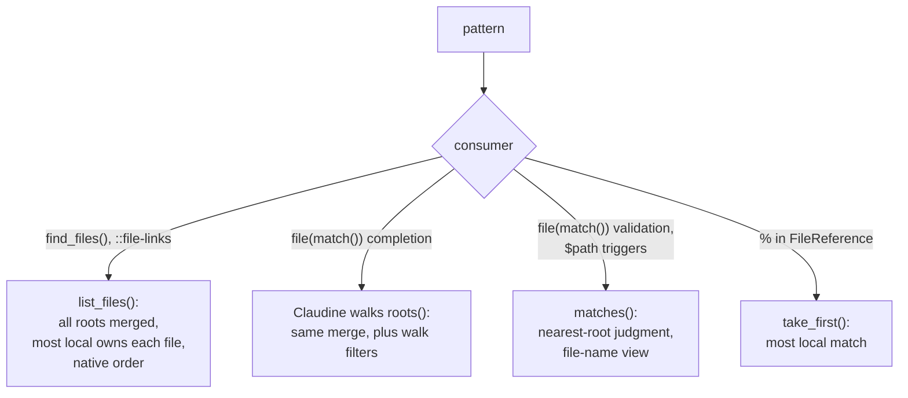

# Glob References Share the File-Reference Grammar

## Problem

A glob that names files to search should use the same reference grammar
(`./`, bare, `&`, `^`, `@`, `~`, absolute) as a single file reference, and
resolve its roots from the same request context. Today three consumers each
implement prefix-plus-glob themselves, and one of them ignores the prefixes
silently.

### Incident 2: `file(match(...))` ignores reference prefixes

A `match()` pattern is meant to use the same grammar. In an external
repository, launched from its root:

```yaml
$schema:
    - spec: file(required;eager;match(^**/*spec*.md))
```

`compose ~/.claudine/prompts/implement.md spec=ts-review<TAB>` offers nothing,
although `fixes/2026-09-29-ts-review-improvements/spec.md` exists.
`FileMatchGlobs::compile`
(`darkmatter/lib/src/markdown/schemas/file_match.rs`) strips only `!` and
hands the rest to `globset`, which reads `^**/…` as a literal `^`. Claudine's
candidate walks (`claudine/cli/src/completion/schema_completion/candidates.rs`)
walk only the launch directory (`scopes::property_value_root`), and
validation (`admits` in `file_match.rs`) judges files against a fixed anchor
list unrelated to the pattern. The pattern compiles without complaint, so the
author gets an empty list and no diagnostic.

Incident 1 of `2026-09-30-file-refs-use-magic` (`&` and `^` failing in
preflight) was a missing request context. That fix makes the context
required and prepared once; this feature relies on it and fixes Incident 2.

### The cause

**Prefix-plus-glob is reimplemented.** `find_files()`
(`compose/expression/functions/mod.rs`) already splits `&`, `^`, `@` from a
glob and resolves the root through biscuit-file; through `FileReference` it
also accepts `./`, `~`, and absolute prefixes. `match()` and
`::file-links <glob>` (`compose/file_links/discovery.rs`, "relative to the
containing document") each have their own, prefix-unaware version. Schema
`$path` triggers (`schemas/triggers/matcher.rs`) match plain globs against a
boundary-relative path, and `%` recursive search in biscuit-file
(`resolve_recursive_core` in `file_reference/resolve.rs`) walks its roots with
its own filters and ordering.

## Expected Behavior

### `GlobReference` in biscuit-file

A caller knows whether it wants one file or a set of files, and says so by
the type it constructs. `FileReference` stays the single-file type and never
interprets glob syntax: `[`, `]`, `*`, and `?` are legal file-name characters
(`pages/[id].md` is common, and only Windows forbids `*` and `?`), so only
the caller can say whether `[id]` is a literal name or a character class.
biscuit-file gains a `GlobReference` for callers that want globs:

```rust
// One file, never a glob: `[id].md` is a literal name.
FileReference::new("^pages/[id].md")?.resolve_in_context(&ctx)?;

// One or more patterns; the same prefix grammar and roots.
let globs = GlobReference::new(["^**/*spec*.md", "!&**/_completed/**"])?;
globs.list_files(&ctx)?;       // every match, merged across roots, most local first
globs.take_first(&ctx)?;       // the most local match: the first element of that order
globs.matches(&path, &ctx);    // membership of one path, which need not exist
globs.roots(&ctx);             // ordered roots, for callers that walk themselves
```

**Most local first.** Single-file resolution and globs follow one principle:
the most local location wins. A list is sorted in that order (see
[Result order](#result-order-local-first)); a single file is the most local
match, which is what `take_first` returns. biscuit-file may also offer a
first-root-only list mode as an option (name settled in planning), but no
Darkmatter consumer uses it.

- **One prefix grammar.** `GlobReference` reuses `FileReference`'s prefix
  parsing, `{{VAR}}` interpolation, and sigil-to-roots mapping inside
  biscuit-file; only the text after the prefix is read differently (literal
  path vs glob). It is the only implementation of prefix-plus-glob in the
  repository, and `find_files()`'s current splitter is folded into it.
- **Patterns.** Each pattern is `[!][reference-prefix]glob`. `!` marks an
  exclusion and is meaningful only in `GlobReference`; in `FileReference` it
  remains the reserved, removed sigil. A pattern without glob
  metacharacters is valid and matches that one path.
- **No filters.** `list_files`, `take_first`, and `matches` apply no hidden,
  gitignored, `_`-prefixed, or `SKIP_DIRS` filtering. A caller that wants a
  curated set (Claudine's completion walks) filters on its own, and a
  consumer's own rules (`::file-links`' extension allowlist, for example)
  stay with that consumer.
- **`matches` is lexical.** It is defined for any typed path, including one
  that does not exist yet (a value the user is still typing, a document not
  yet saved). It canonicalizes the longest prefix of the path that exists,
  appends the rest unchanged, and then judges the result by containment and
  glob checks alone, with no walk and no further filesystem access.
- **Case-sensitive everywhere.** Glob matching is case-sensitive on every
  OS, including macOS and Windows, whose default filesystems are not, so a
  pattern means the same thing on every host. `PathIdentity` folds only the
  case of a Windows drive letter.
- **Which API a consumer uses:**

  | Consumer                                                         | Type             | Call                                  |
  |------------------------------------------------------------------|------------------|---------------------------------------|
  | `::file`, `::code`, `::toc-linking <filename>`, `proxy`, schema `file` values | `FileReference`  | `resolve_in_context`                  |
  | `::file-links <glob>`, `find_files()`, every prefix              | `GlobReference`  | `list_files` (the full merged list)   |
  | `file(match(...))`                                               | `GlobReference`  | `roots` (completion), `matches` (validation) |
  | schema `$path` triggers                                          | `GlobReference`  | `matches`                             |
  | `%` recursive search inside `FileReference`                      | `GlobReference`  | `take_first` on `**/<payload>`        |

  Claudine's completion walks produce the same merged, local-first set as
  `list_files` by walking `roots()` themselves, because they filter while
  walking.

- **Hint on a literal miss.** When a `FileReference` finds nothing and its
  text contains glob metacharacters, the error suggests the glob-accepting
  form (for example `::file-links`).

| Pattern                    | Roots the glob runs under                                  |
|----------------------------|------------------------------------------------------------|
| `**/*spec*.md` (bare)      | The value's `cwd`, then the repository root (implicit relative) |
| `./docs/**/*.md`, `../x/*` | The value's `cwd` only                                     |
| `&fixes/**/spec.md`        | Repository root only                                       |
| `^**/*spec*.md`            | Package root, package-area root, repository root           |
| `@prompts/*.md`            | The `@` magic chain, in biscuit-file's tier order          |
| `~/notes/**/*.md`          | Home directory                                             |
| `vault:notes/**/*.md`      | Configured vault roots, then the captured `$VAULT` paths   |
| `/abs/dir/*.md`            | Used verbatim                                              |

- **Roots come from the context.** The roots for a prefix are exactly the
  ones `FileReference` resolution uses for that sigil, including a bare
  pattern's fallback to the repository root (Decision 19). Literal directory
  segments before the first glob metacharacter narrow the root. A `{{VAR}}`
  expands from the context's environment and, as in `FileReference`, an
  absolute expansion makes the pattern absolute.
- **The value's `cwd`** is where a bare or `./` pattern starts: the launch
  directory (the request directory) for a caller-supplied value (compose,
  completion, choosers), the document's folder for a value or directive
  authored in a document (frontmatter validation, `::file-links`, and
  `find_files()`), and, for a schema trigger, the folder that holds the
  trigger's `schemas/` directory, or the checked document's tree root for a
  trigger from `SCHEMAS_DIR` or `~/schemas` (see
  [Schema roots](#schema-roots)). A bare or `./` `match()` pattern therefore
  means different directories for the same schema depending on where the
  value came from; an author who needs one fixed meaning uses `&`, `^`, or
  `@`, and the schema docs say so. (This `cwd` is not biscuit-file's
  `base_dir()`, which is the tree root and relative boundary; see the next
  bullet.)
- **Relative boundary.** Every consumer holds bare, `./`, and `../` patterns
  to the same boundary as single-file resolution. When the context's
  `base_dir_is_boundary()`, a pattern root that leaves `base_dir()` is a
  `RelativeTreeEscape` error unless the context opted in with
  `allow_external_relative()`. The walk does not follow directory symlinks,
  as `%` traversal does not today, so it cannot leave the tree through one.
  `~`, `@`, absolute, vault, and `{{VAR}}` roots are not relative and are
  allowed, as they are for `::file`; `&` and `^` stay repository-bound.
- **File symlinks that leave the tree.** In a boundary-bound glob (bare,
  `./`, or `../`), a matched **file** symlink whose real target lies outside
  the tree is excluded from the matches. `list_files` reports it as a
  skipped entry, naming the link and its target, beside the matches, so a
  caller can explain the omission:
  - `find_files()` and `::file-links` turn each skipped entry into a compose
    warning naming the link and its target (code settled in planning);
  - `match()` completion omits it silently, because a suggestion list is
    not a place for warnings.

  Single-file resolution is unchanged: a `FileReference` to such a link
  keeps failing with `RelativeTreeEscape`. Today `find_files()` includes
  these links (its walk counts any symlink to a regular file), while
  `::file-links` already drops them; both now behave alike, and the change
  to `find_files()` is listed in the implementation log.
- **Nearest-root judgment.** For each pattern, a file is judged by exactly
  one relative path: its path relative to the **first** of that pattern's
  roots, in precedence order, that contains it. A file under none of the
  roots is outside the pattern. Later roots only reach files the earlier
  roots do not contain, mirroring first-candidate-wins resolution. File-name
  matching applies to that relative path.
- **File-name view, `match()` and triggers only.** `file(match(...))` keeps
  today's file-name view from `FileMatchGlobs`, and schema triggers keep the
  same view from today's trigger matcher: a pattern whose glob text **after
  the prefix** contains no `/` (so `*.md` and `^*.md` both qualify) also
  matches a file's bare name, at any depth. The same holds for negations: a
  negation that matches the file name alone rejects the file, so `!_*.md`
  rejects `_x.md` at any depth. `find_files()` and `::file-links` do not
  widen.
- **Negation composes.** `!` comes first and takes its own prefix, as in
  `!&**/_completed/**`, and is judged by the same rule against its own roots.
  Judging by any containing root would let a negation be bypassed: launched
  from `darkmatter/` with `match(**/*spec*.md, !fixes/**)`,
  `darkmatter/fixes/x/spec.md` is `fixes/x/spec.md` from the launch directory
  (rejected) but `darkmatter/fixes/x/spec.md` from the repository root (not
  rejected). Under nearest-root judgment only the first view exists.

**Where these rules are implemented.** Path comparison uses biscuit-file's
path-identity module, which is lexical and deliberately does not resolve
symlinks (`/tmp` and `/private/tmp` differ on macOS):

| Rule | Implementation |
|------|----------------|
| Same file (deduplication) | `canonicalize_simplified`, then a `PathIdentity` comparison |
| "First root that contains it" | `PathIdentity::strip_prefix` |
| Component-wise tie-break | `PathIdentity::components()` |
| `/` spelling of a relative path | `to_portable_string` |

#### Result order: local first

`list_files` returns matches in one defined order. The principle is the one
single-file resolution already follows: **the most local root wins.**
"Local" is the root precedence order for the prefix (the table above), not
path length. A package root is more local than the repository root that
contains it, even though its path is longer.

1. **Root precedence.** The glob is run under each root in precedence
   order, producing one result list per root. For `^path/to/file*.md`:
   1. `{package-root}/path/to/file*.md`
   2. `{package-area-root}/path/to/file*.md`
   3. `{repository-root}/path/to/file*.md`
2. **Chaining and ownership.** The per-root lists are chained in that order.
   A file belongs to the first root that contains it: a later root skips
   every file under an earlier root, whether the earlier root included or
   excluded it. Deduplicating only earlier *included* results is not enough:
   with `["^**/*spec*.md", "!x/**"]` in package `claudine/pkg`,
   `{pkg}/x/spec.md` is excluded in the package pass (`x/spec.md`), and the
   repository pass would then include it (`claudine/pkg/x/spec.md` does not
   match `!x/**`). Two spellings of one file through a symlink (`/var` and
   `/private/var`) are one file, because files are canonicalized before they
   are compared.
3. **Within one root: shallowest first.** Matches under the same root are
   ordered by the number of path components relative to that root, fewest
   first.
4. **Tie-break: component-wise.** Matches at the same depth under the same
   root are ordered by their relative paths compared component by component,
   as `Path` ordering (and today's `find_files()` sort) does. This is not the
   same as comparing `/`-spelled strings: `a/x` sorts before `a-b/x` by
   component (`a` < `a-b`) but after it by string (`/` > `-`).

This is `GlobReference`'s **native order**. Every result and candidate list in
this feature uses it, and `take_first` is its first element: the shallowest
match under the first root that has any. `take_first` need not walk any later
root.

- **Rejected prefixes.** `http(s)://` (a remote reference) is an error inside
  a `GlobReference`, since there is nothing local to walk. `%` is an error
  too: the glob is already recursive, and `%` is itself implemented on
  `GlobReference`. Vault roots are local directories and are walked like any
  other root.
- **Diagnostics, never silence.** A rejected prefix, a malformed prefix, a
  tree escape, or an invalid glob is a typed error. In `match()` it is a
  schema definition error naming the property and pattern, reported wherever
  schema definitions are checked today; it is never "no candidates" or
  "admit everything".

#### `%` recursive search

`FileReference`'s `%` modifier delegates to `GlobReference::take_first`. The
payload after the prefix becomes the glob `**/<payload>` under the same
prefix roots, with the payload's own text escaped so that a literal name
stays literal (`%pages/[id].md` finds a file named `[id].md`):

```text
%@README.md      → take_first of @**/README.md
%./config.toml   → take_first of ./**/config.toml
%@docs/spec.md   → take_first of @**/docs/spec.md  (a spec.md whose parent path ends with docs)
%vault:notes.md  → take_first of vault:**/notes.md
```

The result becomes local-first: the shallowest match under the most local
root that has any. Today it is the global lexical winner across all roots
(`resolve_recursive_core` in `biscuit-file/lib/src/file_reference/resolve.rs`;
the "Recursive Search" section of `biscuit-file/docs/topics/file-references.md`).
Nothing outside biscuit-file's tests uses `%`, so only those tests and the
topic page change.

#### Consumers

- **`file(match(...))`.** `FileMatchGlobs` becomes a thin wrapper over
  `GlobReference`. Both of Claudine's walks in `candidates.rs`,
  `file_candidates` (TAB completion) and `file_candidate_paths` (the ENTER
  chooser), walk `roots()` in precedence order, merging roots with the
  ownership rule (each file visited once, under its most local root),
  instead of `property_value_root`. The walk filters (hidden, gitignored,
  `_`-prefixed, `SKIP_DIRS`) and the substring filter on the typed partial
  stay in Claudine's walks; they shape suggestions only. `admits` /
  `admits_path` drop the fixed anchor list and are replaced by `matches`,
  and `file_match_admits` (Claudine's root-union arm selection) follows.
  Deleting `admits` also removes its fallback to the process's current
  directory when no `base_dir` is given, a read that
  `2026-09-30-file-refs-use-magic` handed off to this feature (Decision 22).
  Parity is therefore one-way: every file the
  walks offer is admitted, and validation may also admit a hidden, ignored,
  or `_` file the user types. Validation matters only in root unions: in a
  single schema `match()` only suggests, and an existing file outside the
  globs still validates (`darkmatter/docs/topics/schemas/definition.md`,
  "Files").
- **`find_files()`.** Calls `list_files` for every prefix: bare, `^`, `@`,
  and the rest. It returns the full match merged across all roots, in native
  order, and the `find_files()` docs replace their "sorted absolute paths"
  promise with that order. It already accepts `./`, `~`, and absolute
  prefixes through `FileReference`; what is new is negation, the merged
  multi-root search (two roots for bare, up to three for `^`, the whole
  chain for `@`), vault roots, the relative boundary, and the diagnostics
  above. Because `GlobReference` applies no filters, `find_files()` keeps
  finding files under `_completed/`, which
  `darkmatter/lib/tests/l1/find_files_and_try_frontmatter.rs` relies on.
- **`::file-links <glob>`.** The glob form accepts reference prefixes and,
  like `find_files()`, uses the full merged `list_files` for every prefix. A
  bare glob searches the containing document's folder and then the
  repository root, merged. `--dir` mode is unchanged. "No filters" means no
  `GlobReference`-level filters; the directive keeps its own rules: the
  extension allowlist, excluding the containing document, and skipping
  symlinked directories. It renders matches as a tree sorted by its own
  rules (`compose/file_links/render.rs`) under the matches' common ancestor,
  so native order does not show in its output, and a merged list that
  reaches the repository root roots the tree there.
  **Boundary.** The directive drops its own boundary logic
  (`resolve_boundary` in `discovery.rs`, with its own git discovery and
  current-directory fallback, handed off to this feature by
  `2026-09-30-file-refs-use-magic`) and follows biscuit-file's
  [relative boundary](#globreference-in-biscuit-file) exactly, reading it
  from the prepared context: bare, `./`, and `../` globs may not leave
  `base_dir()` when it is a boundary, unless `allow_external_relative()`;
  `~`, `@`, absolute, vault, and `{{VAR}}` roots are allowed, as with
  `::file`; `&` and `^` stay repository-bound.
- **Schema `$path` triggers.** Trigger patterns
  (`darkmatter/lib/src/markdown/schemas/triggers/`: `matcher.rs`,
  `discovery.rs`, `assemble.rs`) parse as `GlobReference` and judge a
  document path with `matches`, exactly as `match()` validation does,
  including nearest-root judgment and the file-name view.
  - Triggers are discovered in the five [schema roots](#schema-roots). A
    bare or `./` pattern's `cwd` is the folder that holds the trigger's
    `schemas/` directory when that folder is the package, package-area, or
    tree root; every document such a trigger sees lies under it. A trigger
    from `SCHEMAS_DIR` or `~/schemas` sits in a folder that holds no
    repository documents, so its bare and `./` patterns are judged from the
    tree root (`base_dir()`) of the document being checked, which is the
    repository root in a repository. **`&`, `^`, and `**/` patterns are the
    recommended spelling for user-level triggers**, since they say which
    root they mean. Today `$path` is relative to the repository or workspace
    boundary; no `$path` trigger exists in the repository outside
    documentation examples, so nothing migrates.
  - `&`, `^`, `~`, and absolute are allowed. `~` is allowed on purpose
    (Decision 23): it lets a user define schemas that apply across all of
    their repositories, and `HOME` rarely differs between the editor and
    the terminal. `@` is a trigger-definition error, because its roots depend
    on the launch directory and a trigger would then apply differently per
    launch and in the editor. `vault:` and `{{VAR}}` are trigger-definition
    errors (Decision 20): their roots come from vault configuration and
    arbitrary environment variables, which commonly differ between the
    editor and the CLI. `{{VAR}}` is rejected **anywhere** in the pattern,
    not only as its prefix. `%` is a trigger-definition error, as in any
    `GlobReference`.
  - The matcher receives the prepared context. Judging one known path
    against a cached context is lexical containment and glob checks with no
    walk, so it adds no filesystem work per keystroke.
  - DMLS caches each document's effective schema keyed on its content hash
    (`darkmatter/dmls/src/overlay/mod.rs` ~148); the key also includes the
    context, so a trigger judged under one context is not reused under
    another. "The context" in that key is exactly: the repository root, the
    document's `cwd`, the `base_dir` origin, and a hash of the request
    snapshot (`HOME`, the environment, and the extra `@` roots). The schema
    roots derive from these, so `SCHEMAS_DIR` and `~/schemas` are covered.
- **`%` recursive search.** See [`%` recursive search](#-recursive-search).

**What changes in existing outputs.** `find_files()` and `::file-links`
return more than the first root's matches wherever a later root has matches
too, and `find_files()` returns them in native order instead of sorted. For
example:

- a bare `::file-links *.md` in a nested document lists the document
  folder's top-level `*.md` and now also the repository root's top-level
  `*.md` (after the local ones in native order; the tree rendering re-sorts
  them). It does not reach `*.md` at other depths, because the any-depth
  file-name view belongs to `match()` and triggers only;
- `^docs/*.md` lists `docs/*.md` from the package, the package area, and the
  repository root;
- `%` returns the most local match instead of the global lexical winner;
- `find_files()` no longer returns a file symlink whose target leaves the
  tree, and warns about it instead;
- schema discovery reads five fixed roots instead of every `schemas/` folder
  between the document and the boundary (see [Schema roots](#schema-roots)),
  and `md schema triggers` prints those roots.

Each changed output in existing tests and shipped docs is listed in the
implementation log.



#### Rendering completion candidates

Completion candidates render through biscuit-file's `PortablePath`, evaluated
against the value's context with `with_ctx` (never the ambient state
`PortablePath` captures on its own). The strategy is restricted to the
relative forms (`./x`, `./a/x`, `../x`, `../a/x`: `SameDirRelative`,
`ChildDir`, `ImmediateParentDir`, `PeerDir`), then `&` (`RepoRoot(None)`),
then `~` (`HomeDir`), then the absolute path (`AbsolutePath`). `{{VAR}}`
(`EnvRootedPath`) is left out, since a placeholder reads oddly in a shell
argument. `PortablePath` verifies every spelling, including shadowing, so the
inserted value always resolves to the file the walk found.

A candidate under the launch directory, from **any** launch directory, is
passed as its bare launch-relative path, so `PortablePath` keeps today's
spelling (`fixes/…/spec.md`, never `./fixes/…/spec.md`): it returns a
relative input unchanged when the input already spells the route from
`cwd`. Only candidates outside the launch directory take the restricted
forms above (`../…`, `&…`, `~/…`, absolute).

Candidates are listed in native order: root precedence, then shallowest
first, then component-wise. They are not sorted by their rendered string,
which would interleave the different spellings.

### Schema roots

**A behavior change.** Darkmatter (`md`) and DMLS look for `schemas/`
folders off exactly five roots, searched **most local first**, the same
principle as file references. For a file name present in more than one
root, the first root that holds it wins and shadows the rest.

| # | Root | Present when | Example |
|---|------|--------------|---------|
| 1 | package root | the document is inside a package of a monorepo | `{package-root}/schemas/` (none exists in this repository today) |
| 2 | package-area root | the document is inside a package area of a monorepo | `claudine/schemas/` |
| 3 | file tree root: biscuit-file's `base_dir()` | always | `{repo}/schemas/` in a repository; otherwise the vault, home-opened, explicit, or fallback tree root |
| 4 | the folder named by `SCHEMAS_DIR` (any folder; searched itself) | the variable is set | `$SCHEMAS_DIR/` |
| 5 | the user's home | always | `~/schemas/` |

The package and package area are those of the **document being checked**,
not of the launch directory. A root that coincides with an earlier one (a
package-area root that is also the repository root, a home-opened tree root
that makes root 3 `~/schemas/`, or `SCHEMAS_DIR` pointing at `~/schemas`) is
searched once, at its first position, compared by `canonicalize_simplified`
and `PathIdentity`. A root whose folder does not exist is skipped. Roots 4
and 5 name the folder that holds schema files directly: `SCHEMAS_DIR` is the
schemas folder itself, as `~/schemas` is, not a parent that contains a
`schemas/` folder (Decision 27). It may point at **any** folder the user
chooses: the folder need not be named `schemas`, and it need not lie under
`HOME`, the file tree, or any repository. With
`SCHEMAS_DIR=/opt/team/dm-defs`, schema files are read from
`/opt/team/dm-defs/`, never from `/opt/team/dm-defs/schemas/`.


**One root list, two uses.** The roots feed both:

- **trigger discovery**: every `kind: trigger-schema` file in the five
  roots, with shadowing by file name as today; and
- **bare-name `$schema` lookup**: `$schema: claudine.yaml` (a single file
  name, no path separator) resolves to the first root that holds
  `claudine.yaml`. A path-qualified `$schema` is a file reference and is
  unaffected.

**Where the roots come from.** All five come from the prepared context of
`2026-09-30-file-refs-use-magic`, never from the process: the package, the
package area, and the tree root from the repository scope catalog and
`base_dir()`; `HOME` and `SCHEMAS_DIR` from the request snapshot, which
already carries the environment. In DMLS the snapshot is taken from the
environment the editor launched the server with, so a GUI editor that lacks
a shell variable also lacks `SCHEMAS_DIR`; DMLS's docs say so, and that a
server restart picks up a change.

**What this replaces.** Today `schema_roots` in
`darkmatter/lib/src/markdown/schemas/triggers/discovery.rs` walks from the
document's folder up to the discovery boundary and collects **every**
`schemas/` folder on the way, nearest first, never past the boundary to
home. After this feature:

- `schemas/` folders between the document and its package, area, or tree
  root (for example `claudine/docs/schemas/`) are no longer discovered;
- `SCHEMAS_DIR` and `~/schemas` are discovered, where nothing outside the
  boundary was before;
- `md` and DMLS produce the same root list for the same document and
  snapshot.

**What this means for this repository** (checked on 2026-10-01 with
`ls -d */schemas */*/schemas` and a full search for `schemas` folders):

- `schemas/` at the repository root is root 3. `claudine/schemas/` and
  `darkmatter/schemas/` sit at package-area roots, not package roots (no
  package has its manifest at `claudine/` or `darkmatter/`), so for a
  document in those areas they are root 2. All three keep working. The documents that name
  `feature-review.yaml` or `review.yaml` by bare name still find them.
- In-between folders that stop being discovered: `claudine/docs/schemas/`,
  `darkmatter/docs/schemas/`, `darkmatter/docs/topics/schemas/`,
  `darkmatter/example-docs/schemas/`,
  `darkmatter/tests/fixtures/schema-triggers/schemas/`,
  `darkmatter/lib/src/markdown/schemas/`, `.claudine/schemas/`, and
  `.github/ci/schemas/`. None holds a trigger schema that a shipped
  document relies on (the fixture's triggers are copied to a temporary
  repository root by the CLI tests, which keeps working).
- One shipped document breaks: `darkmatter/example-docs/schemas/external.md`
  names `$schema: external.yaml`, which today resolves only through the
  in-between `example-docs/schemas/` root. It becomes
  `$schema: ./external.yaml` in this feature (Decision 28), and the change
  is listed in the implementation log.

**Shipped text to rewrite** (current-behavior statements that become
false):

- `darkmatter/docs/topics/schemas/definition.md`: "Repository Trigger
  Schemas" (about lines 1630 to 1675: discovery "from the document's
  directory through an explicit repository or workspace boundary", bare
  filenames resolved "nearest first", and `$path` as boundary-relative), and
  the bare-name `$schema` paragraph near line 951;
- `darkmatter/docs/topics/schemas/dmls-schema-support.md`: the effective-
  schema diagram near line 57 ("discovered under schemas/ roots within the
  workspace boundary"), and the statements near lines 76 and 183 that DMLS
  does not read the schema-folder environment variable;
- `darkmatter/docs/topics/schemas/authoring-schemas.md`: the list of
  discovery directories near line 185, its definition of `{root}` outside a
  repository (today "the current working directory, or the root folder in
  your editor"; now the tree root), and its `SCHEMA_DIR` mentions (also
  near line 266);
- `darkmatter/docs/topics/schemas/schema-activation.md`: the `SCHEMA_DIR`
  sentence near line 105;
- `claudine/docs/rollout-strategy.md`: the `SCHEMA_DIR` mention near line
  191 (renamed only);
- the module doc of `darkmatter/lib/src/markdown/schemas/triggers/discovery.rs`
  ("ancestor walk ... never continues past the boundary to ... home");
- `md schema triggers` output, which prints a "Boundary" and the walked
  "Schema roots": it prints the five roots in search order instead, marking
  absent folders and an unset `SCHEMAS_DIR`.

Those docs already describe this root list (repository root, package-area
root, package root, and an environment-variable folder) but spell the
variable `SCHEMA_DIR`, which no code reads today. This feature uses
`SCHEMAS_DIR` (Decision 26) and, as part of its docs work, renames every
shipped mention of `SCHEMA_DIR` to `SCHEMAS_DIR`.

**Claudine is unaffected.** It does not read schema roots itself:
`claudine/lib/src/composition/resolve.rs` has no schema discovery, and its
`@` prompt chain, which includes `~/.claudine/`, is a file-reference concern
unrelated to schema roots and unchanged.

### Parity matrix additions

`2026-09-30-file-refs-use-magic` adds an entry-point parity matrix of two
tables: document-authored references through every entry point from a fixed
launch directory (the fixture repository root), and caller-supplied values
from two launch directories (the repository root and a nested package).
Errors compare by biscuit-file's `ResolutionFailure`. This feature adds a
glob form to both tables:

| Form            | Example target                        |
|-----------------|---------------------------------------|
| `GlobReference` | `^**/*spec*.md`, `!&**/_completed/**` |

- **Table 1 (document-authored)** gains the consumers `::file-links <glob>`,
  `find_files()`, and `file(match(...))` validation of a frontmatter value.
- **Table 2 (caller-supplied)** gains `file(match(...))` completion (both
  Claudine walks) and validation of a caller-supplied value.

A glob cell expects an ordered list of files (native order) or a failure
class.

## Scope

In scope:

- **biscuit-file:** `GlobReference`, its parser, root resolution (vault and
  `{{VAR}}` included), native order, `take_first`, nearest-root judgment,
  and the relative boundary for glob roots; `%` recursive search rebuilt on
  `take_first`; any optional first-root list mode.
- **darkmatter:** `FileMatchGlobs`, `find_files()`, and `::file-links` on
  `GlobReference`; `::file-links` without `resolve_boundary` and `match()`
  validation without `admits` (the two current-directory reads handed off
  by `2026-09-30-file-refs-use-magic`); the skipped-symlink compose warning;
  schema `$path` triggers (`schemas/triggers/matcher.rs`, `discovery.rs`,
  `assemble.rs`) on `GlobReference` with the prepared context; the five
  [schema roots](#schema-roots) replacing `schema_roots`' ancestor walk, for
  trigger discovery and bare-name `$schema` lookup
  (`schemas/resolve.rs`); `darkmatter/example-docs/schemas/external.md`
  rewritten to `./external.yaml`.
- **darkmatter-cli:** schema definition errors from `match()` and trigger
  patterns surfaced by the `md` routes that check schemas; `md schema
  triggers` printing the five roots.
- **dmls:** the effective-schema cache keyed on the context as well as the
  content hash; the five schema roots, including `SCHEMAS_DIR` and
  `~/schemas`, from the request snapshot.
- **claudine / claudine-cli:** `file_candidates` and `file_candidate_paths`
  walking `GlobReference` roots and rendering through `PortablePath`;
  `file_match_admits` on `matches`.
- **Tests:** the parity matrix additions, a regression test for Incident 2,
  trigger-versus-`match()` parity, the schema-root tests, the out-of-tree
  symlink tests, and the glob guard test.
- **Docs:** `biscuit-file/docs/topics/file-references.md` (`GlobReference`,
  its native order, `take_first`, the relative boundary for globs, when to
  choose it over `FileReference`, and the "Recursive Search" section
  rewritten as local-first); `darkmatter/docs/topics/schemas/definition.md`
  (`file` row and `match(globs)` section, one example per prefix, the
  file-name view, the advice to use `&`, `^`, or `@` for a fixed meaning,
  and `$path` triggers with their allowed prefixes);
  `darkmatter/docs/inline/file-links.md` (prefixes, merged roots, and the
  boundary); the `find_files()` expression docs
  (`darkmatter/docs/topics/darkmatter-expressions.md` and
  `darkmatter/docs/schemas/expression-functions.yaml`, replacing "sorted
  absolute paths" with native order over all roots, and documenting the
  skipped-symlink warning); every page listed under
  [Schema roots](#schema-roots) (`definition.md`,
  `dmls-schema-support.md`, `authoring-schemas.md`, and
  `schema-activation.md`), including the editor-environment caveat for
  `SCHEMAS_DIR` and the rename of every `SCHEMA_DIR` mention to
  `SCHEMAS_DIR`; the `darkmatter`, `biscuit-file`, and `claudine` skills;
  and any Claudine topic page describing `match()` completion.

Out of scope:

- Completion with a `~/`-spelled prompt path. Claudine's
  `resolve_prompt_path` does not expand `~`, so
  `compose ~/.claudine/prompts/x.md spec=<TAB>` finds no prompt and offers no
  schema candidates. That is a separate Claudine fix.
- `::toc-linking` `filter=` / `keep=` globs (`compose/toc_linking/filter.rs`).
  They match heading text, not paths, and a leading `^` already means
  "case-sensitive" there (`darkmatter/docs/inline/toc-linking.md`). They stay
  plain globs; parsing them as `GlobReference` patterns would change the
  meaning of `^` in existing documents. The directive's `<filename>` target
  is a `FileReference`, covered by `2026-09-30-file-refs-use-magic`.
- The bare fallback root. A bare pattern keeps the repository root as its
  second root (Decision 19); whether a non-repository tree root should take
  that place is the unscheduled biscuit-file fix `bare-fallback-base-dir`.
- Claudine's `@` prompt chain (including `~/.claudine/`). It is unrelated to
  schema roots and unchanged.

## Decisions

1. **Glob handling is its own feature** (2026-09-30). Split from
   `2026-09-30-file-refs-use-magic`, which it depends on; Incident 2 is fixed
   here. Reason: the context fix stands alone, and globs are a new
   capability built on it.
2. **Bare patterns follow implicit-relative rules** (2026-09-30). A bare glob
   searches the value's `cwd`, then the repository root, exactly as a bare
   file reference does; `./` confines it to the value's `cwd`. Launched from
   a subdirectory, `match(**/*spec*.md)` therefore also offers
   repository-wide specs. Nearest-root judgment keeps negations correct across
   the two roots.
3. **Candidates outside the launch directory render as absolute paths**
   (2026-09-30). Sigil-prefixed rendering (`&fixes/…`) is shorter but can
   resolve to a different file when a closer root shadows the path (`^`,
   `@`). **Superseded by Decision 18.**
4. **`::file-links <glob>` adopts `GlobReference`** (2026-09-30).
5. **Callers choose single-file or glob by type** (2026-09-30).
   `FileReference` never interprets glob syntax; `GlobReference` is the only
   glob-aware reference.
6. **`GlobReference` results are local-first** (2026-09-30): root
   precedence, then shallowest under a root, then component-wise (Decision
   13). "Local" is root precedence, not path length. A file belongs to its
   most local root.
7. **`::toc-linking` heading filters stay plain globs** (2026-09-30). They
   match heading text, where `^` means case-sensitive. Only the directive's
   file target is a reference.
8. **A bare or `./` `match()` pattern uses the value's `cwd`** (2026-09-30):
   the launch directory for a caller-supplied value, the document's folder
   for a frontmatter value. Reason: it matches how the value itself resolves;
   authors wanting one fixed meaning use `&`, `^`, or `@`.
9. **Walk filters stay in Claudine; `GlobReference` is unfiltered**
   (2026-09-30). Reason: the filters curate suggestions and must not change
   what a pattern means or what validation admits.
10. **Widening and root choice depend on the consumer** (2026-09-30). The
    file-name view ("no `/` matches at any depth") applies only to
    `file(match(...))` (and, since Decision 14, to triggers). The clause
    "`find_files()` and `::file-links` use the first root that yields any
    match (Decision 12), while `match()` completion merges roots with
    ownership" is **superseded by Decision 16**: every consumer merges.
11. **A `::file-links` root outside the security boundary is an error**
    (2026-09-30). Reason: an empty result would hide a misspelled or
    disallowed prefix. **Superseded by Decision 17.**
12. **`find_files()` uses the first root that yields a match, for every
    prefix, in native order** (2026-09-30). **Superseded by Decision 16.**
13. **Ties break component-wise** (2026-09-30), not by `/`-spelled string.
    Reason: it matches `Path` ordering and today's `find_files()` sort.
14. **Schema `$path` triggers adopt `GlobReference`** (2026-09-30), judged
    with `matches` exactly as `match()` validation, including the any-depth
    and file-name rules. A bare or `./` pattern starts at the folder holding
    the trigger's `schemas/` directory; `&`, `^`, `~`, and absolute are
    allowed; `@` and `%` are trigger-definition errors; the matcher receives
    the prepared context, and the DMLS effective-schema cache keys on it.
    Reason: one meaning for a path pattern everywhere, and no real `$path`
    trigger needs migrating. Matching one path against a cached context is
    lexical, so the cost was accepted without a spike. Decision 20 adds
    `vault:` and `{{VAR}}` to the forbidden prefixes. The clause "a bare or
    `./` pattern starts at the folder holding the trigger's `schemas/`
    directory" is **amended by Decision 24** for triggers from `SCHEMAS_DIR`
    and `~/schemas`, whose bare patterns start at the checked document's
    tree root.
15. **`%` delegates to `GlobReference::take_first`** (2026-09-30) on
    `**/<payload>` under the same prefix roots, so its result becomes
    local-first instead of the global lexical winner; `take_first` stays,
    with `%` as its consumer. Vault roots are walkable, so `vault:` is a valid
    `GlobReference` prefix and only remote references stay rejected. Reason:
    single-file resolution is "most local first", and nothing outside
    biscuit-file's tests uses `%`.
16. **Lists are the full merge, most local first** (2026-09-30), superseding
    Decision 12 and the root-choice clause of Decision 10. `find_files()` and
    `::file-links <glob>`, bare and prefixed alike, return every match across
    all roots in native order. A first-root-only list mode may exist in
    biscuit-file as an option; Darkmatter does not use it. Reason: single-file
    resolution and globs are both "most local first": a list is sorted in
    that order, and a single file is the most local match.
17. **`::file-links` follows biscuit-file's relative boundary**
    (2026-09-30), superseding Decision 11. It drops `resolve_boundary`; bare,
    `./`, and `../` globs may not leave `base_dir()` when it is a boundary
    (`RelativeTreeEscape`) unless `allow_external_relative()`; `~`, `@`,
    absolute, vault, and `{{VAR}}` roots are allowed; `&` and `^` stay
    repository-bound. Bare and `./` globs in every `GlobReference` consumer
    honor the same boundary and opt-out, and walks do not follow directory
    symlinks out of the tree. Reason: one boundary rule for single files and
    globs, taken from the prepared context.
18. **Completion candidates render through `PortablePath`** (2026-10-01),
    superseding Decision 3, against the value's context passed with
    `with_ctx`, restricted to `./`, `../`, `&`, `~`, then absolute (no
    `{{VAR}}`). Reason: `PortablePath` verifies shadowing, so the inserted
    value always resolves to the walked file, and the result is shorter than
    an absolute path wherever a portable form exists.
19. **The bare fallback root stays the repository root** (2026-10-01): bare
    is the value's `cwd`, then the repository root, for both `FileReference`
    and `GlobReference`, matching shipped single-file behavior. Reason: using
    `base_dir()` (a vault, home, or explicit tree root) instead is a separate
    question for both types, deferred to the unscheduled fix
    `bare-fallback-base-dir`.
20. **`vault:` and `{{VAR}}` are trigger-definition errors** (2026-10-01),
    completing Decision 14's prefix list: in a schema `$path` pattern,
    `vault:` and `{{VAR}}` are rejected alongside `@` and `%`, and `{{VAR}}`
    is rejected **anywhere** in the pattern, not only at its start. `~`
    (`HOME`) is the accepted exception (Decision 23). Reason: whether a
    schema applies should not depend on vault configuration or arbitrary
    environment variables, which commonly differ between the editor and the
    CLI (the same reasoning as for `@`); `HOME` rarely differs, and allowing
    `~` is what makes user-level triggers possible. (Wording amended
    2026-10-01: the earlier reason, "must never depend on environment
    variables", contradicted allowing `~`, and the earlier remark that a
    trigger only sees documents under its own folder no longer holds for
    `SCHEMAS_DIR` and `~/schemas` triggers, Decision 24.)
21. **Windows evidence by cross-check** (2026-10-01). `just cross-check
    <pkg> --os windows` is pre-authorized for every affected package; done
    means Linux and macOS green on the pull request, a Windows cross-check
    pass recorded in the implementation log, and the post-merge push to
    `main` watched. `ci:all-os` stays not pre-authorized. Reason: pull
    requests prove only Linux and macOS, and a cross-check gives Windows
    evidence before merge without a full-OS CI run.
22. **One branch, fix first, one merge** (2026-10-01). This feature is
    implemented on `fix/magic-globs` immediately after
    `2026-09-30-file-refs-use-magic`, and nothing reaches `main` until both
    are done. This feature takes ownership of deleting the two
    current-directory reads the fix handed off, `resolve_boundary` and
    `admits`; the combined branch must satisfy both specs. This replaces the
    earlier instruction not to start before the fix lands. Reason: the
    feature rewrites both sites anyway, and one merge keeps `main` from ever
    holding a half-migrated state.
23. **`~` stays allowed in `$path` patterns** (2026-10-01). Reason: it lets a
    user define schemas that apply across all of their repositories, and
    `HOME` rarely differs between the editor and the terminal.
24. **Five schema roots, most local first** (2026-10-01; a behavior change).
    Darkmatter and DMLS search `schemas/` off the package root, the
    package-area root, the file tree root (`base_dir()`), the `SCHEMAS_DIR`
    folder when set, and `~/schemas`, in that order; the first root holding
    a file name shadows the rest. The roots feed both trigger discovery and
    bare-name `$schema` lookup, come from the prepared context and request
    snapshot, and replace `schema_roots`' ancestor walk, so in-between
    `schemas/` folders are no longer discovered. Bare and `./` trigger
    patterns from `SCHEMAS_DIR` and `~/schemas` are judged from the checked
    document's tree root; `&`, `^`, and `**/` are the recommended spelling
    there. Reason: a short, fixed, documented list is predictable in both
    `md` and the editor, and adding user-level roots lets schemas follow the
    user across repositories.
25. **Out-of-tree file symlinks are skipped by bound globs** (2026-10-01). In
    a bare, `./`, or `../` glob, a matched file symlink whose real target
    lies outside the tree is excluded; `list_files` reports it as a skipped
    entry, Darkmatter turns that into a compose warning naming the link and
    its target, and `match()` completion omits it. Single-file resolution
    keeps its `RelativeTreeEscape` error. Reason: a glob must not reach
    outside the boundary that a single reference to the same file may not
    cross, and the user should hear why a file is missing.
26. **The environment variable is `SCHEMAS_DIR`** (2026-10-01). Shipped docs
    that spell it `SCHEMA_DIR`, which no code reads, are renamed as part of
    this feature's docs work. Reason: the plural matches the `schemas/`
    folders it sits beside, and only the docs carry the singular spelling.
27. **`SCHEMAS_DIR` names the schemas folder itself** (2026-10-01), like
    `~/schemas`, not a parent containing a `schemas/` folder. It may point
    at any folder the user chooses, which is searched as a schema root
    itself; it is not restricted to `HOME` or the file tree and need not be
    named `schemas`. Reason: the variable then points at exactly the folder
    whose files are read, wherever the user keeps them.
28. **`darkmatter/example-docs/schemas/external.md` is rewritten to
    `$schema: ./external.yaml`** (2026-10-01). Reason: in-between `schemas/`
    folders are no longer discovered (Decision 24), so its bare name would
    stop resolving.

## Open Questions

None. The former questions are settled: schema triggers by Decisions 14,
20, and 23, schema roots by Decisions 24 and 27, the variable's name by
Decision 26, the shipped example by Decision 28, and `%` recursive search
and `take_first` by Decision 15. No ruling remains for the author. Planning
names any optional first-root list mode, the skipped-symlink warning code,
and the glob guard test.

## Pre-authorizations

Granted by the author on 2026-10-01. The implementer may, without pausing
to ask:

- create throwaway git fixture repositories and a fixture `HOME` in
  temporary directories;
- edit `docs/` topic pages and the `biscuit-file`, `darkmatter`, and
  `claudine` skills under `.claude/skills/`, as the drift rules require;
- run local L1 and L2 tests across every affected package area;
- run `just cross-check <pkg> --os windows` for every package in
  `packages`.

Not pre-authorized: adding the `ci:all-os` label or any extra CI cell. Ask
first.

## Acceptance Criteria

1. **Incident 2.** In a fixture with
   `fixes/2026-09-29-ts-review-improvements/spec.md`, launched from the
   repository root, completing `spec=ts-review` against
   `file(match(^**/*spec*.md))` yields exactly
   `spec='fixes/2026-09-29-ts-review-improvements/spec.md'`.
2. **One glob implementation.** `match()`, `find_files()`,
   `::file-links <glob>`, schema `$path` triggers, and `%` recursive search
   all go through biscuit-file's `GlobReference`; no other code in the
   repository splits a reference prefix from a glob. A source-scan guard
   test (working name `glob_implementation_guard.rs`), in the style of
   `darkmatter/cli/tests/l1/spawn_site_guard.rs` and
   `darkmatter/lib/tests/l1/semantic_results_never_persist.rs` (sanitized
   source, identifier-boundary matches, exact per-file counts, stale entries
   fail), rejects glob-library use (`globset`'s `Glob`, `GlobBuilder`, and
   `GlobSetBuilder`, and any other glob crate) in the production source of
   biscuit-file, darkmatter, darkmatter-cli, dmls, claudine, and
   claudine-cli outside an exact allowlist: biscuit-file's `GlobReference`
   module; `darkmatter/lib/src/markdown/compose/toc_linking/filter.rs`
   (heading-text globs, out of scope); and DMLS's
   `darkmatter/dmls/src/workspace/discover.rs` and
   `darkmatter/dmls/src/overlay/schema.rs` (workspace include and
   extension-activation globs, which are configuration, not references).
   Source paths of other packages it scans are declared in
   `[package.metadata.ci.tests] source-inputs` (`docs/cicd/test-inputs.md`).
3. From a nested package directory, a `^**/*spec*.md` or `&**/*spec*.md`
   pattern still offers a repository-root spec, and `./**/*spec*.md` offers it
   only when it lies under the launch directory.
4. `!&**/_completed/**` excludes a file that a positive `^` pattern would
   otherwise admit.
5. **Nearest-root judgment.** Launched from a nested directory `pkg/`, with
   `match(**/*spec*.md, !fixes/**)`, neither `pkg/fixes/x/spec.md` nor the
   repository root's `fixes/y/spec.md` is offered or admitted, while
   `other/z/spec.md` outside `pkg/` is offered (in its `PortablePath` form,
   `../other/z/spec.md`) and admitted.
6. **One-way parity.** For every prefix, every file either Claudine walk
   (`file_candidates` and `file_candidate_paths`) offers is admitted by
   `file_match_admits` and the `x-darkmatter-match` validator. Validation may
   also admit a hidden, gitignored, or `_`-prefixed file that a user types
   explicitly.
7. **Value `cwd`.** The same `match(./docs/*.md)` pattern is judged from the
   launch directory for a caller-supplied value and from the document's
   folder for a frontmatter value.
8. `match(%**/*.md)`, `match(https://example.com/*.md)`, and an invalid glob
   each produce a schema definition error naming the property and pattern.
   `match(vault:notes/*.md)` is valid and offers files under the configured
   vault roots.
9. **Existing outputs.** Existing bare-pattern `match()` tests (`*.png`,
   `src/**/*.rs`, `!_*.md`) pass unchanged when launched from the repository
   root. Each changed output in existing tests and shipped docs (from
   `find_files()`, `::file-links`, and `%`) is listed in the implementation
   log.
10. **Merged lists.** `find_files()` and `::file-links`, for every prefix,
    return every match across all roots in native order. A bare
    `::file-links *.md` in a nested document lists its folder's top-level
    `*.md` and the repository root's top-level `*.md`, but no `*.md` at other
    depths; `^docs/*.md` lists `docs/*.md` from the package, the package
    area, and the repository root; a bare `find_files('*.md')` from a nested
    document returns the local matches before the repository root's.
11. **No widening outside `match()` and triggers.** A bare
    `find_files('spec.md')` does not return `x/spec.md`; `match(spec.md)`
    offers it, and so does `match(^spec.md)`.
12. **File-name negation.** `match(*.md, !_*.md)` rejects `docs/_x.md`, and
    neither Claudine walk offers it.
13. **Unfiltered.** `list_files` returns hidden, gitignored, and
    `_`-prefixed matches, and
    `darkmatter/lib/tests/l1/find_files_and_try_frontmatter.rs` still finds
    the file under `_completed/`. `::file-links` still applies its extension
    allowlist, excludes the containing document, and skips symlinked
    directories.
14. **Relative boundary.** In a repository, a bare or `./` `::file-links`
    or `find_files()` glob whose root climbs above the repository root fails
    with `RelativeTreeEscape` (a typed error, not an empty result), and
    succeeds when the context has `allow_external_relative()`. A `~/`,
    `@`, absolute, vault, or `{{VAR}}` glob outside the repository is
    allowed; an `&` or `^` glob outside a repository fails with
    `OutsideRepository`. A walk under a directory symlink that leads out of
    the tree does not list the files behind it.
    **Handed-off reads.** `resolve_boundary` and `admits` no longer exist,
    so neither the `::file-links` boundary nor `match()` validation reads the
    process's current directory; the ambient-state gate of
    `2026-09-30-file-refs-use-magic`'s guard test drops their handed-off
    allowlist entries, and the branch satisfies that fix's Acceptance
    Criterion 5 with no exceptions.
15. **Local-first order.** In a fixture package `pkg` inside area `area`,
    `GlobReference::new(["^**/intro.md"]).list_files()` returns, in order:
    `{pkg}/intro.md`, `{pkg}/a/b/intro.md`, `{area}/intro.md`,
    `{repo}/intro.md`, `{repo}/z/intro.md`, each exactly once, although
    the repository pass also reaches the package's and area's files.
    `take_first` returns `{pkg}/intro.md` without walking the area or
    repository roots.
16. **Tie-break.** Under one root, `b/intro.md` and `a/intro.md` list as
    `a/intro.md` then `b/intro.md`, and both follow `intro.md`; `a/x.md`
    lists before `a-b/x.md`.
17. **Completion order.** Launched from a nested package, completion
    candidates follow native order (root precedence, then shallowest, then
    component-wise), so candidates from the launch directory and candidates
    from later roots are not interleaved by a sort on their rendered
    strings.
18. **Ownership with exclusion.** With
    `GlobReference::new(["^**/*spec*.md", "!x/**"])` in package
    `claudine/pkg`, `{pkg}/x/spec.md` is not returned by `list_files` and
    `matches` rejects it, although the repository-relative path
    `claudine/pkg/x/spec.md` does not match `!x/**`.
19. **Literal brackets.** `FileReference::new("pages/[id].md")` resolves the
    file literally named `[id].md`, while `GlobReference::new(["pages/[id].md"])`
    treats `[id]` as a character class, and `%pages/[id].md` finds a file
    literally named `[id].md`.
20. **Glob parity rows.** The parity matrix from
    `2026-09-30-file-refs-use-magic` includes the `GlobReference` form in
    both tables, with `::file-links`, `find_files()`, and `file(match(...))`
    validation in Table 1 and `file(match(...))` completion and validation in
    Table 2, compared by native-order file list or `ResolutionFailure`, on
    macOS, Linux, and Windows.
21. **Schema triggers.** A trigger `$path` of `^docs/**` matches a document
    under the package's `docs/` folder; a trigger `$path` of `@x/**`,
    `%x.md`, `vault:x/**`, `{{X}}/**`, or `docs/{{X}}/*.md` is a
    trigger-definition error naming the pattern, reported where trigger
    definitions are checked today and identically by `md` and DMLS; a
    `~/notes/**` trigger is valid and matches a document under the fixture
    `HOME`'s `notes/`; a bare `*.md` trigger matches a document at any depth
    under the folder that holds its `schemas/` directory. For a shared set
    of patterns and paths, trigger matching and `match()` validation
    (`matches`) give the same verdict for every path.
22. **Trigger cache.** In DMLS, the effective-schema cache key is the
    document's content hash plus its context: the repository root, the
    document's `cwd`, the `base_dir` origin, and a hash of the request
    snapshot (`HOME`, the environment, and the extra `@` roots). The same
    document content under two contexts whose `^` roots differ, or under two
    snapshots whose `SCHEMAS_DIR` differs, is judged against each, not
    served from one cached effective schema.
23. **`%` is local-first.** With `README.md` at the package root's
    `x/y/README.md` and at the repository root's `README.md`, `%^README.md`
    from inside the package returns the package's `x/y/README.md`, where it
    previously returned the lexical winner. `%vault:notes.md` finds
    `notes.md` under a configured vault root.
24. **Candidate rendering.** From any launch directory, a candidate under
    the launch directory keeps its bare launch-relative spelling (as in
    criterion 1), never a `./` spelling. A candidate outside the launch
    directory is the `PortablePath` form for that context: `../…` where the
    restricted relative forms apply, else `&…`, else `~/…`, else absolute;
    never `{{VAR}}`. A candidate whose shorter spelling a closer root would
    shadow falls through to a later form, and every inserted value resolves
    back to the file the walk found.
25. **Out-of-tree file symlinks.** In a repository fixture, `docs/leak.md`
    is a file symlink to a file outside the repository. A bare
    `find_files('docs/*.md')` and a bare `::file-links docs/*.md` omit it
    and each produce one compose warning naming `docs/leak.md` and its
    target; `match(docs/*.md)` completion omits it with no warning;
    `GlobReference::list_files` returns it as a skipped entry, not a match;
    and `FileReference::new("docs/leak.md")` still fails with
    `RelativeTreeEscape`. A file symlink whose target stays inside the tree
    is listed as before.
26. **Lexical `matches`, case-sensitive everywhere.** `matches` judges a
    typed path that does not exist (under an existing directory, and under
    a missing one) the same as it would the existing file, with no walk.
    `match(*.MD)` does not match `x.md` on macOS, Linux, or Windows.
27. **Schema-root order.** In a fixture monorepo with a package inside a
    package area, a fixture `HOME`, and `SCHEMAS_DIR` set in the request
    snapshot, the schema roots for a document in the package are, in order:
    `{package}/schemas`, `{area}/schemas`, `{repo}/schemas`,
    `$SCHEMAS_DIR`, `{HOME}/schemas`. `md schema triggers` prints them in
    that order.
28. **Shadowing.** With `claudine.yaml` in both `{repo}/schemas` and
    `{HOME}/schemas`, `$schema: claudine.yaml` resolves to the repository's
    file, and a trigger file of the same name in `{HOME}/schemas` is
    reported as shadowed and not evaluated. Removing the repository's file
    makes the home file win.
29. **`SCHEMAS_DIR` only when set.** With the variable absent from the
    request snapshot, no fourth root is searched, even if the test
    process's own environment sets it; with it set, a trigger in that folder
    applies, and its bare `docs/*.md` pattern is judged from the document's
    repository root: it matches `{repo}/docs/x.md` and not
    `{repo}/pkg/docs/x.md`. `SCHEMAS_DIR` names the schemas folder itself:
    with it pointing at a fixture folder named `dm-defs` that lies outside
    the fixture `HOME` and outside every repository, a trigger or bare-name
    schema directly in that folder is found, and one only in its `schemas/`
    subfolder is not. A `SCHEMA_DIR` (singular) in the request snapshot adds
    no root.
30. **In-between folders are not discovered.** A trigger and a bare-name
    schema placed in `{package}/docs/schemas/` neither apply to nor resolve
    for a document in `{package}/docs/`.
31. **`~/schemas`.** With a fixture `HOME` supplied through the request
    snapshot (the test process's environment is not mutated), a trigger in
    `{HOME}/schemas` applies to a matching document in a repository that has
    no `schemas/` folders, and `$schema: user.yaml` resolves to
    `{HOME}/schemas/user.yaml`.
32. **`md` and DMLS agree on schema roots.** For each document of criteria
    27 to 31, `md schema validate` and DMLS produce the same root list, the
    same set of applied triggers, and the same bare-name resolution.
33. **Shipped example.** `darkmatter/example-docs/schemas/external.md`
    names `$schema: ./external.yaml` and validates against it.
34. **Documented variable name.** No `docs/` page or skill names
    `SCHEMA_DIR`; every former mention reads `SCHEMAS_DIR`, and the schema
    pages describe it as the schemas folder itself, which may be any folder
    the user chooses.

## Definition of Done

This feature is done when all of the following hold. It is implemented on
`fix/magic-globs` after `2026-09-30-file-refs-use-magic`, and the branch
merges to `main` only when both specs are done (Decision 22).

- Every acceptance criterion above is met, and the branch also satisfies
  every acceptance criterion of `2026-09-30-file-refs-use-magic`, with the
  two reads it handed off deleted.
- The spec's status is "implementation complete, ready for review". An
  agent never moves the spec to `_completed` and never runs `just complete`;
  the author does that after the review cycle closes.
- The implementation log lists every changed output (from `find_files()`,
  `::file-links`, `%`, schema discovery, and `md schema triggers`) and every
  departure from this spec.
- `docs/` topic pages and the affected skills under `.claude/skills/`
  describe the new behavior.
- Linux and macOS are green on the pull request; a passing
  `just cross-check <pkg> --os windows` for each affected package is
  recorded in the implementation log; the post-merge push to `main` (which
  adds Windows) is watched to completion.
- Every commit is signed, and `git verify-commit` passes for each.
