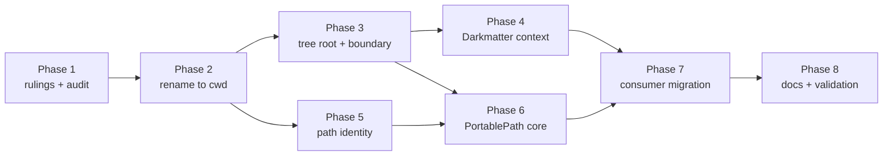

# Plan: Portable Paths (`PortablePath`) and the File-Tree Model

## Summary of the work

The feature has two halves, and the order between them is load-bearing.

1. **A vocabulary and boundary change to `FileResolutionContext`** (the
   prerequisite). Today `base_dir` means "where `./` starts". It must first
   be renamed `cwd` with **no behavior change**, and only then reintroduced as
   the *tree root* with an origin, a boundary rule for relative references,
   symlink-aware containment, a reader opt-in, and opening-reference
   provenance (`for_source_reference`). Both values are `PathBuf`, so a
   single-step swap would compile and silently change the meaning of every
   call site (about 60 files across `biscuit-file`, Darkmatter, Claudine, and
   a few unrelated crates that merely own a method called `base_dir`).
2. **`PortablePath`**: a new module in `biscuit-file` (under the existing
   `file-reference` feature) that turns an absolute path or an authored
   `FileReference` into the most portable verified reference, using an ordered
   `PortabilityPreference` strategy, environment anchors, a shared path
   identity implementation, and a fully typed diagnostics record.
3. **Consumer migration**: Darkmatter's `ResolutionContext` adopts the same
   two-term model, Darkmatter's link normalization moves onto `PortablePath`
   (removing `with_env_path_whitelist` and the `PROJECT_ROOT` / `DOCS_BASE`
   defaults, adding `with_portable_env`), and Claudine call sites compile and
   keep working under the new boundary.
4. **Docs and skills** stay in step with the code (README, topic page, skill
   references, Darkmatter/Claudine docs).

The terminal state is "implementation complete, ready for review". An agent
never moves the feature to `_completed` and never runs `just complete`.

### Definition of success

- `FileResolutionContext` exposes `cwd()` and `base_dir()` with the spec's
  meanings. `base_dir` carries an origin and an "enforces a boundary" flag.
  Resolution of relative references enforces it (lexically and through
  symlinks), except where `base_dir` fell back to `cwd`.
- Step 1 (the rename) is verified behavior-neutral: the pre-existing test
  suites pass unchanged except for renamed identifiers.
- `PortablePath::from_path` / `from_reference` produce a `PortableReference`
  (reference, strategy, attempts, findings) for every strategy in the spec,
  default and reordered, and every error variant exposes `attempts()`.
- Idempotence, candidate equality, shadowing, missing-target, non-file-target,
  symlink-containment, Windows drive/UNC/verbatim, non-Unicode, literal
  backslash/interpolation, environment-tie, and captured-state-isolation tests
  pass on macOS and Linux locally; Windows-specific cases use portable
  fixtures and run in the existing Windows/WSL2 legs (no new CI gates).
- Darkmatter and Claudine compile, their tests pass, and `just lint` is clean
  in every touched area.
- Docs describe current behavior with no references to this feature snapshot.

### Conventions for every task

- the entire session tree is non-interactive; subagents must not run
  anything that prompts (gpg, ssh, sudo, login flows) and must not commit
- no `unwrap()` / `expect()` in production paths; `thiserror` for errors;
  errors that the spec says are `Clone` hold no `std::io::Error`
- tests: `just test` / `just test-l2` per area (nextest); never `cargo test`;
  `just lint`; never `cargo fmt`; never commit unless told to
- load the `biscuit-file`, `rust-testing`, and (for Windows paths) `os`
  skills; Darkmatter tasks also load `darkmatter`; Claudine tasks load
  `claudine`
- every behavior-changing edit includes a pass over the affected `///`, `//!`,
  and inline comments (Drift Maintenance)

---

## Phase 1: Rulings, Audit, and Baseline

Goal: settle the open decisions, inventory the migration surface, and record a
green baseline so the Phase 2 "no behavior change" claim is checkable.

### Necessary Rules

These points are unclear or leave a choice open in the spec. Each needs the
author's ruling (or explicit confirmation of the recommendation) before the
phase it gates. Recommendations are marked **Rec.**

| # | Question | Gates | Recommendation |
| - | -------- | ----- | -------------- |
| R1 | **The default strategy has no `ParentDir`.** A position link `../../x.md` that stays inside a *non-repository* tree has no `&`, so under the default it cannot stay relative and falls through to `EnvRootedPath` / `HomeDir` / `AbsolutePath` (e.g. becomes `~/docs/x.md`). Minimal churn only protects forms the strategy would itself choose. Is that intended? | Phase 6 | **Rec.** Confirm as intended for the default (the appendix dry run was repository-only and never exercised it); callers that want in-tree deep-parent links add `ParentDir`. Record it in the topic page. |
| R2 | **Name and shape of the non-repository containment error** ("introduce a non-repository context-containment error"), and of `RelativeTreeEscape { base_dir, candidate, reference }` relative to `FileReferenceError`. | Phase 3 | **Rec.** `FileReferenceError::CwdOutsideBaseDir { base_dir, cwd }` for context validation and `FileReferenceError::RelativeTreeEscape` as written; `RepositoryEscape` and `RepositoryRootNotContainingSource` untouched. |
| R3 | **Name of the trusted-external counterpart to `for_source_reference`.** | Phase 3 | **Rec.** `for_trusted_external_source_reference`, mirroring `for_trusted_external_source`. |
| R4 | **Name and signature of the reader opt-in.** Spec says "for example `allow_external_relative()`". It must be copied on child derivation. | Phase 3 | **Rec.** `FileResolutionContext::allow_external_relative(self) -> Self` plus `external_relative_allowed() -> bool`. |
| R5 | **Public vocabulary for tree-root origin.** Spec lists repository, explicit, vault, home, environment, fallback. | Phase 3 | **Rec.** `pub enum BaseDirOrigin { Repository, Explicit, Vault, Home, Environment { name }, Fallback }` with `FileResolutionContext::base_dir_origin()` and `base_dir_is_boundary()` (false only for `Fallback`). |
| R6 | **Home as an anchor when `HOME` is a symlink or non-captured.** Spec: only a captured absolute home/env anchor that *contains* the resolved source qualifies. Containment compares lexically (authored identity) or canonically? | Phase 3 | **Rec.** Lexical for anchor selection (matching "preserve authored identity"); canonical only inside the boundary check. |
| R7 | **Windows symlink/junction fixtures need privilege or developer mode.** Creating symlinks may fail on a runner. | Phase 3, 6 | **Rec.** Create junctions (no privilege) for the directory case and skip-with-reason (`expect_level!`-style gating, not a silent pass) for file symlinks when creation is denied; the macOS/Linux legs carry the symlink proof. |
| R8 | **Ordering with `2026-09-30-file-refs-use-magic`** which reshapes Darkmatter's `ResolutionContext` around one prepared context. | Phase 4 | **Rec.** Check at Phase 4 start whether it has landed; build on whichever vocabulary is present and do not reintroduce old names. If it has not landed, proceed and note it in the log. |
| R9 | **Where `PortablePath` lives and what is exported.** | Phase 5 | **Rec.** `biscuit-file/lib/src/file_reference/portable/` (submodules: `path_identity`, `strategy`, `env_anchor`, `diagnostics`, `evaluate`), re-exported from `file_reference/mod.rs` and `lib.rs` under `file-reference`. |
| R10 | **Widened measurement.** The spec forbids an additional performance spike and the dry run is feasibility evidence only. A real-corpus run of the finished `PortablePath` (this repo, ~7.8k links) as an acceptance check, and a timing measurement, are *not* scheduled. | author | **Rec.** Leave unscheduled; the author may ask for a post-implementation corpus run. |
| R11 | **`AuthoredIntent` on a reference with no `cwd`/context failure** for a kept local intent form: lookup error becomes a `Finding` or an error? Spec says "context failures" are reported. | Phase 6 | **Rec.** Report as `UnresolvableInput` only when the input is a *position* form; for a kept intent form the failure is a `Finding` (the reference is returned unchanged). Needs a typed `Finding::ResolutionFailed { kind }` variant (the spec's list is illustrative). |

### Spikes

- None scheduled. The spec's own appendix already answers the feasibility
  and churn question, and it states no performance spike is required (R10
  records the wider measurement as the author's call). The two "audits"
  below are inventory work, not spikes.

### Tasks

- [x] **Record rulings.** Write the author's answers to R1-R11 into the top of
  an implementation log (`implementation-log.md` in this directory). Later
  phases cite the ruling number.
- [x] **Constructor audit inventory.** Produce an explicit list (in the log) of
  every call to `FileResolutionContext::new`, `from_snapshot`, `for_base`,
  `for_trusted_external_base`, `base_dir()`, `request_base_dir()`, and
  `DetailedResolution::base_dir()` across the monorepo, grouped by crate.
  Use a text search first (`rg`), GitNexus `impact`/`context` only as a
  cross-check. Separate genuine consumers (biscuit-file, darkmatter, claudine,
  claudine/rendezvous, claudine/gen, research, worktree) from unrelated
  `base_dir` identifiers (sniff, playa, messenger); classify each constructor
  argument as "document directory" (becomes `cwd`) or "tree root" (rare).
  Include examples, docs, and `.claude/skills` snippets.
- [x] **`ComparisonKey` behavior audit.** Read
  `darkmatter/lib/src/markdown/compose/link_normalization.rs` and write down
  exactly what it does for `..`, `.`, Windows verbatim prefixes, drive
  letters, and UNC shares, versus the spec's required normalization. This
  becomes the acceptance list for Phase 5.
- [x] **Resolver touch-point map.** Map where `resolve.rs` plans candidates,
  interpolates, and applies the existing `&`/`^` containment check
  (`RepositoryEscape`), and where completion and convenience APIs call into
  it, so Phase 3 has one shared boundary seam. Record the seam's function
  names in the log.
- [x] **Baseline.** Run `just test`, `just test-l2`, `just lint` in
  `biscuit-file`, `darkmatter`, and `claudine`; record pass/fail counts and any
  pre-existing failures so they are not attributed to this change.
- [x] **Skill/doc inventory.** List every doc and skill file that mentions the
  renamed names or `with_env_path_whitelist` / `PROJECT_ROOT` / `DOCS_BASE`
  (`biscuit-file/docs/topics/file-references.md`, README,
  `.claude/skills/biscuit-file/**`, `darkmatter/docs/inline/link-normalization.md`,
  `.claude/skills/darkmatter/**`, Claudine docs/skills).

**Checkpoint 1:** rulings recorded, inventories written, baseline green (or
failures catalogued).

---

## Phase 2: Vocabulary Migration (Step 1: rename `base_dir` to `cwd`)

Goal: a pure rename with no behavior change. Both values are `PathBuf`, so
every constructor call is audited by hand in addition to compiling.

Prerequisite: Phase 1 inventory.

### Wave 1: biscuit-file (single agent, sequential edits)

- [x] **Rename public API.** In `context.rs` (and `mod.rs`, `resolve.rs`,
  `fetch.rs`): `base_dir()` to `cwd()`, `for_base` to `for_cwd`,
  `for_trusted_external_base` to `for_trusted_external_cwd`,
  `request_base_dir()` to `request_cwd()`, parameter names in `new` and
  `from_snapshot`, `is_trusted_external_authoring_base` to a `cwd` spelling,
  `DetailedResolution::base_dir()` to `cwd()`. Keep
  `LaunchMagicScope::request_dir` unchanged (it is a request directory, not
  a tree root). Do not add the new `base_dir` yet; no `base_dir` identifier
  may remain on the context during this phase so a missed site fails to
  compile.
- [x] **Align the internal resolver naming.** The resolver's internal
  `ResolutionContext` already says `cwd`; remove any remaining translation
  layer so there is one name.
- [x] **Update biscuit-file tests, examples, doc comments.** The 7 L1 test
  files, doctests, and `///` examples. Audit each `new(...)` and
  `from_snapshot(...)` argument.
- [x] **Verify neutrality.** `just test`, `just test-l2`, `just lint` in
  `biscuit-file`; the diff of tests must be rename-only.

### Wave 2: consumers (parallel subagents, one per area; all depend on Wave 1)

Each subagent: rename call sites, audit constructor arguments against the
Phase 1 classification, run that area's `just test` and `just lint`.

- [x] **Darkmatter.** `darkmatter/lib`, `darkmatter/cli`
  (compose, context/capture, expression, reference, schemas, link
  resolution). Do **not** rename Darkmatter's own `ResolutionContext` fields
  yet (that is Phase 4); only adapt calls into `biscuit-file`.
- [x] **Claudine library and CLI.** `claudine/lib`, `claudine/cli`
  (composition, harness, system_prompt, invocation_context, completion,
  commands), `claudine/gen`.
- [x] **Claudine rendezvous daemon and remaining.** `claudine/rendezvous/daemon`
  (src, examples, tests) and `research`, `worktree` if they call the renamed
  API (verify; ignore unrelated `base_dir` identifiers).

**Checkpoint 2:** whole workspace compiles
(`cargo check --workspace --all-targets` via the repo's just recipes); area
tests green; a repo-wide search for the old method names returns nothing;
the constructor audit table in the log has every row ticked.

---

## Phase 3: Tree Root and Boundary (Step 2, in `biscuit-file`)

Goal: reintroduce `base_dir` as the tree root and enforce the boundary.
Prerequisite: Phase 2 complete; rulings R2-R7.

### Wave 1: model (sequential; touches the same struct)

- [x] **Tree root + origin on the context.** Add `base_dir()`,
  `base_dir_origin()`, `base_dir_is_boundary()`, `with_base_dir(dir)`.
  Selection order (spec precedence): supplied/discovered repository root
  (when it contains the document) > explicit `with_base_dir` > containing
  vault (deepest wins, configuration order breaks ties, captured `VAULT`
  roots in existing resolver order) > `~`/`{{VAR}}` anchor of the opening
  reference > `cwd` fallback.
  - `repository_root()` stays `Some` exactly when the tree is a repository.
  - `with_base_dir` inside a repository: equal to the repo root is accepted;
    any other directory is `InvalidConfiguration` (both on the context with
    `with_repository_root`, and later on `PortablePath`).
  - explicit contexts never discover repositories; ambient preparation
    (`from_ambient`/`from_base`) may.
- [x] **Containment validation.** `cwd` must be inside `base_dir` after normal
  derivation, using the new non-repository error (R2); trusted external
  derivations remain the escape hatch. Keep `RepositoryRootNotContainingSource`
  for repositories.
- [x] **Derivation rules.** `for_source` / `for_cwd` preserve `base_dir`, its
  origin, captured process state, and the launch `@` scope; an anchor in a
  link does not replace the tree when the document is already inside it.
  Trusted external derivation validates the original request independently,
  then selects a new tree (explicit destination state, accepted
  vault/home/environment anchor, else new cwd), drops source repository,
  package, and package-area anchors when no catalog contains the document,
  keeps launch `@` scope, never discovers another repository.
- [x] **Provenance-carrying derivation.** Add
  `for_source_reference(&FileReference, resolved_source)` and the trusted
  counterpart (R3). They do not re-resolve and grant no permission to open the
  file. Only a captured absolute home/env anchor that contains the resolved
  source qualifies (relative, unset, or foreign-host values supply no root;
  environment portability policy does not affect this).
- [x] **Reader opt-in.** Add `allow_external_relative()` (R4); copied during
  child derivation; permits relative targets (and symlink escapes) outside the
  tree but not invalid requests/cwd, file access, or repository sigils.

### Wave 2: boundary enforcement (depends on Wave 1; sequential through the one seam found in Phase 1)

- [x] **Shared boundary decision.** One function applied to the resolver's
  *effective relative kind* after interpolation, including bare
  repository-fallback candidates. Candidate planning, `resolve_detailed`,
  convenience APIs, and completion all call it. A blocked candidate is
  `RelativeTreeEscape { base_dir, candidate, reference }`, never a missing
  file and never a silent try-another-root. Absolute environment expansions
  are unaffected.
- [x] **Real-landing check.** Reuse the existing `&`/`^` containment code
  (lexical, then canonical of the existing target or deepest existing
  ancestor); do not write a second one. In-tree symlinks work; symlink,
  junction, or reparse point leading out is `RelativeTreeEscape`.
- [x] **Fallback exception.** When `base_dir_is_boundary()` is false, resolution
  does not reject relative references (today's behavior).
- [x] **Completion.** Do not suggest escaping relative links when the opt-in
  is off; recursive relative searches keep the no-directory-symlink contract.
- [x] **Sigils unchanged.** `&`/`^` still fail with `OutsideRepository`
  outside a repository even when `base_dir` is supplied; `RepositoryEscape`
  intact.

### Wave 3: tests (parallel subagents, one per concern; all depend on Wave 2)

- [x] **Selection precedence tests.** Each rung of the order wins over the
  rungs beneath it; explicit beats vault; repo beats explicit with the equal-
  and unequal-directory cases; overlapping vaults; `~` and `{{NOTES}}` anchored
  documents; unset/relative/foreign-host env supplies no root.
- [x] **Boundary tests.** `./../../x.md`, `a/../../x.md`, in- and
  out-of-repository; fallback not a boundary; opt-in on/off; completion.
- [x] **Symlink tests** (R7). In-tree allowed, out-of-tree rejected, not-yet-
  created target via deepest existing ancestor, opt-in permits.
- [x] **Derivation tests.** `for_source` preserves tree; `for_source_reference`
  with `~`/`{{VAR}}`; trusted external drops repository/package anchors but
  keeps launch `@`; no repository discovery.
- [x] **Regression.** Existing biscuit-file suites remain green except for
  deliberate behavior change: update tests that relied on an in-repository
  `./../../outside.md` resolving, and note each one in the log.

**Checkpoint 3:** `just test`, `just test-l2`, `just lint` in `biscuit-file`;
then compile and run Darkmatter and Claudine tests to surface fallout from the
boundary (fixes land in Phase 4/7, but failures must be listed now).

---

## Phase 4: Darkmatter `ResolutionContext` and Provenance Adoption

Goal: Darkmatter speaks the same two terms and derives contexts from the
opening reference. Prerequisite: Phase 3; ruling R8.

### Wave 1 (sequential within Darkmatter)

- [ ] **Two-step rename inside Darkmatter.** In
  `expression/resolve_ctx.rs`: current `base_dir` to `cwd` (audit constructors),
  then `base_dir` as tree root sourced from the request's
  `FileResolutionContext` (no re-derivation of rules). Check R8 first.
- [ ] **Use `for_source_reference`.** Switch compose, transclusion, and
  reference code that derives from a resolved path
  (`for_source`, `for_trusted_external_source`) to the opening-reference
  variants where the opening `FileReference` is available, so `~`/`{{VAR}}`
  anchors survive.
- [ ] **Handle the new boundary errors.** Map `RelativeTreeEscape` and the
  non-repository containment error into Darkmatter's own error vocabulary
  (`Arc<FileReferenceError>` today).

### Wave 2: tests and fallout (parallel)

- [ ] **Darkmatter tests.** Update/add tests for boundary behavior and
  anchored-document tree roots (`::file ~/Downloads/a.md`,
  `::file {{NOTES}}/inbox/a.md`).
- [ ] **Claudine fallout.** Claudine external prompts opened as
  `~/.claudine/prompts/x.md` must get `~` as tree root; fix any Claudine
  call sites broken by the boundary; add a test for that case.

**Checkpoint 4:** `just test`, `just test-l2`, `just lint` in `darkmatter` and
`claudine`.

---

## Phase 5: Path Identity (shared internals)

Goal: one definition of prefix comparison and relative-path computation.
Prerequisite: Phase 1 `ComparisonKey` audit. Can start as soon as Phase 2 is
done (it does not depend on the boundary work), so it runs **in parallel with
Phases 3 and 4** if capacity allows; Phase 6 requires it.

- [ ] **Internal `path_identity` module** in `biscuit-file` (R9): component-
  based normalization (`.`/`..` collapse without walking above a root),
  whole-component prefix test, lossless OS-string components, separate roots
  for different drives/UNC shares, verbatim-prefix handling only where the
  existing safe simplification permits, never reinterpreting literal verbatim
  dot segments. No canonicalization, no case-folding, no symlink aliasing.
- [ ] **Relative-path computation** from `cwd` to target (component-based),
  returning `None` across roots (Windows drives/shares).
- [ ] **Migrate Darkmatter** `ComparisonKey` consumers onto it; delete the
  private copy.
- [ ] **Text rendering seam.** Wrapper that renders via `try_portable_string`
  and rejects spellings that change native components or introduce grammar
  (`{{VAR}}` in a literal filename, leading sigil in a bare filename), and
  returns `UnrenderableTarget` for non-Unicode paths.
- [ ] **Tests.** `/opt/config` vs `/opt/config-old`; `..` handling; Windows
  drives, UNC, verbatim and literal dot segments (portable fixtures that run
  on every OS by feeding strings to a Windows-flavored comparison where the
  implementation allows it, otherwise `#[cfg(windows)]` with a note per the
  `os` skill); non-Unicode on Unix; backslashes in Unix filenames.

**Checkpoint 5:** `just test`/`just lint` in `biscuit-file` and `darkmatter`.

---

## Phase 6: `PortablePath` Core

Goal: the public type, strategies, verification, environment anchors,
diagnostics. Prerequisites: Phases 3 and 5; rulings R1, R9, R11.

### Wave 1: types (parallel, disjoint files)

- [ ] **Diagnostics types.** `Attempt`, `AttemptOutcome`, `NotApplicable`,
  `EnvAnchorProblem`, `Finding`, `PortablePathError`, `ConfigurationProblem`,
  `InvalidTarget`, plus the outcomes the spec lists as required but not
  shown: unavailable home/CWD, boundary denial, non-file target,
  resolution/probe error carrying path and `ErrorKind` (and OS code) as
  typed data. All errors are `Clone` (no `io::Error`); every error variant
  exposes `attempts()` through an accessor; `Display` is a one-line headline
  then the attempts.
- [ ] **Strategy types.** `PortabilityPreference`, `IntentForms::ALL`, the
  default strategy list and doc comments (position-in-strategy meaning of
  `AuthoredIntent`).
- [ ] **Environment anchors.** Parse `PORTABLE_ENV_VARIABLES` (comma list,
  trimmed, `[A-Z0-9_]+`, invalid entries skipped and recorded as
  `InvalidPortableVariableName`), union with `with_portable_env`, dedupe,
  read values from the context's captured env or the process env; eligibility
  (`Unset`, `NotAbsolute`, `ForeignAbsolute`, `NotAPrefix`); deepest
  component-prefix wins, ties by name order.

#### Input robustness matrix

Applies to two config reads: the `PORTABLE_ENV_VARIABLES` list (declaration
side) and the value of each declared variable such as `CONFIG_DIR`
(anchor side). Every cell has a defined outcome, and one test walks the table
from one real fixture with one edit per cell, asserting through
`PortableReference` / `findings()` / `attempts()`, with a control row first.

| Shape | `PORTABLE_ENV_VARIABLES` | Value of a declared variable (`CONFIG_DIR`) |
| ----- | ------------------------ | ------------------------------------------- |
| control (unedited fixture) | `CONFIG_DIR` declared, value `/opt/config`, target `/opt/config/x.json` gives `{{CONFIG_DIR}}/x.json` | same row |
| absent | no portable variables; `EnvRootedPath` is `NotApplicable`, not an error | `Unset`; strategy continues |
| explicit empty (`""`) | no names; same as absent for the list (the format defines an empty list as no names), no finding | empty string is `NotAbsolute { value: "" }`, not `Unset` |
| wrong type | n/a (environment strings only) | relative value is `NotAbsolute`; other-OS absolute is `ForeignAbsolute` |
| one bad element | `CONFIG_DIR,bad-name` keeps `CONFIG_DIR`, records `InvalidPortableVariableName` for `bad-name` | n/a |
| every element bad | all skipped, one finding each, set is empty (not "everything portable") | n/a |
| empty element | `CONFIG_DIR,,X` ignores the empty entry, no finding | n/a |
| duplicate | `CONFIG_DIR,CONFIG_DIR` deduplicated, one anchor evaluation | n/a |
| trailing/invalid content | whitespace trimmed; lowercase or punctuation entry is invalid, recorded | trailing separator or lexical-only prefix (`/opt/config-old`) is `NotAPrefix` |

Smells to grep before closing the matrix: `unwrap_or_default()` and
`filter_map(.. .ok())` on the env parse; any place where an invalid name could
make a variable silently portable or silently not portable without a finding.

### Wave 2: evaluator (sequential; depends on Wave 1)

- [ ] **Builders and captured state.** `from_path` (absolute host path
  required), `from_reference`, `with_ctx` (clone; no discovery; stays
  non-repository), `with_cwd`, `with_base_dir`, `with_strategy` (replace; empty
  list valid), `with_portable_env` (accumulate, dedupe), `file_reference()`.
  `with_ctx` combined with `with_cwd`/`with_base_dir` is `InvalidConfiguration`
  in either builder order. Without a context: capture CWD, home, env once,
  discover the repository once from the effective CWD via the existing
  resolver preparation; `with_base_dir` inside a repo must equal the repo root.
  Invalid contexts error before any strategy runs.
- [ ] **Relative strategies.** `SameDirRelative`, `ChildDir`, `PeerDir`,
  `ImmediateParentDir`, `ParentDir`, `ExternalRelativePath` with the exact
  meanings in the spec; target equal to CWD renders `./` (`TargetNotFile`
  finding for directories); a fallback `base_dir` treats an upward path as
  external; `ExternalRelativePath` needs a shared root and turns on the
  reader opt-in for its round-trip verification; a target reached only
  through an out-of-tree symlink falls through.
- [ ] **Searched and anchored strategies.** `RepoRoot`, `RepoMultiPath`,
  `MagicPath` with eligibility filters (never extra roots; filters cannot
  escape; invalid syntax is `InvalidConfiguration`); try roots in resolver
  order and verify each spelling; never skip a shadowing root;
  `HomeDir` (home from context, else OS); `EnvRootedPath`; `AbsolutePath`
  (native UNC spelling kept faithfully); output spelling after a sigil has no
  `/`.
- [ ] **Verification.** Single-location forms: build, boundary-check, compare;
  a missing anchor or containment failure rejects. Search forms: target must
  exist and `resolve_detailed` must find that file, else `Shadowed` or
  `TargetMissing`. Use `candidate_plan` and `resolve_detailed`, not a parallel
  resolver. Round-trip every generated spelling through `FileReference` parse.
- [ ] **Input handling.** Classify with `FileReference::class()` and its
  parsed payload (no string-prefix checks). `AuthoredIntent(IntentForms)`:
  keep intent forms exactly (including a leading portable `{{VAR}}`, a
  sigil's whole payload, URLs without lookup or network, recursive `%`), report
  findings (R11); position forms resolve to a target (single candidate even if
  missing; multi-candidate with no match is `UnresolvableInput` with
  `TargetMissing`; boundary/anchor/I-O failures are typed resolution
  findings, never `TargetMissing`); URLs/`%` not kept by any strategy give
  `NormalizationUnsupported`; minimal churn (`foo.md` and `./foo.md` kept when
  lookup confirms same-directory; a repo-fallback bare link is not same-
  directory); idempotence.
- [ ] **Errors and findings from probes.** Permission errors never become
  `TargetMissing` or a silent fallback; `NoStrategyMatched` when
  `AbsolutePath` absent; `InvalidTarget`; `UnrenderableTarget` even with
  `AbsolutePath`.

### Wave 3: tests (parallel subagents; depend on Wave 2)

- [ ] **Strategy matrix.** One test per relative strategy, repo/vault/home/
  env roots, default vs reordered (Claudine's list), filters, ties, shadowing,
  missing and non-file targets, `strategy()` always names the matched
  preference, and `AbsolutePath` fallback is visible.
- [ ] **Input-robustness matrix test** as tabulated above (one test, one edit
  per cell, control row).
- [ ] **Properties.** Idempotence over a generated corpus; candidate equality
  for single-location output; `UnresolvableInput` fails identically on retry;
  captured-state isolation (changing the live env/home/cwd after `with_ctx`
  does not change the result; batch reuse).
- [ ] **Cross-platform.** Windows drives/UNC/verbatim, distinct shares,
  non-Unicode, literal backslash and `{{VAR}}` filenames, symlink versus
  junction containment; follow R7 gating and the `os` skill.
- [ ] **Doc examples.** Spec examples (the `md clean` table, `^/foo.md`,
  `../../../foo.md` to `&foo.md`, suffix handling stays with the caller) as
  executable tests, not prose-only.

**Checkpoint 6:** `just test`, `just test-l2`, `just lint` in `biscuit-file`;
public re-exports compile under `file-reference` and the no-default-features
build of the unfeatured path-text helpers still passes.

---

## Phase 7: Consumer Migration

Goal: Darkmatter link normalization and Claudine use `PortablePath`.
Prerequisite: Phase 6.

### Wave 1: Darkmatter (sequential)

- [ ] **Migrate link normalization** (`link_normalization.rs`, link rewrite
  paths, `md clean` contract) to `PortablePath` using the captured request
  context; the suffix layer (`#fragment`, `?query`, `:line`) stays in
  Darkmatter, using the parsed link destination, and reattaches to the
  result. Map `PortablePathError`/findings into Darkmatter's vocabulary;
  `UnresolvableInput` means keep the link and report it.
- [ ] **Remove** `ComposeOptions::with_env_path_whitelist` and the
  `PROJECT_ROOT` / `DOCS_BASE` defaults; add `with_portable_env` on the
  options, forwarded to `PortablePath`. Update all call sites and tests
  together. Note in the log the one-way effect: previously generated `${VAR}/…`
  links were never references; authored `{{VAR}}` links are now rewritten
  unless declared portable or protected by another intent form.
- [ ] **Opt-in for cleanup reads.** A cleanup that must read older escaping
  links uses an opted-in context (reader opt-in) while keeping the strict
  default output strategy; no silent opt-in for arbitrary inputs.
- [ ] **Darkmatter tests.** Cover rewrite, preservation, idempotence run
  twice, environment names, suffix handling.

### Wave 2: Claudine (parallel with Wave 1; disjoint area)

- [ ] **Claudine strategy and portable env.** If Claudine has link/path
  rewriting or needs portable output, adopt `PortablePath` with the adjusted
  strategy (`AuthoredIntent` first, `RepoMultiPath(Some("prompts"))`,
  `MagicPath(Some("~/.claudine/prompts"))`) and names from its configuration.
  Where Claudine has no such consumer, limit the work to confirming that
  tests and docs reflect the boundary (Phase 4 fallout) and skip; record which
  case applies.
- [ ] **Claudine tests/docs** for whichever case applied.

**Checkpoint 7:** `just test`, `just test-l2`, `just lint` in `biscuit-file`,
`darkmatter`, `claudine`; L2/L3 steps must not focus a window.

---

## Phase 8: Documentation, Skills, and Final Validation

Goal: the `docs/` tree and skills describe the code as it is. Prerequisite:
Phase 7. Docs tasks are parallel; final validation is sequential.

### Wave 1: docs and skills (parallel)

- [ ] **biscuit-file docs.** README and `docs/topics/file-references.md`:
  `base_dir` vs `cwd`, origin and precedence, boundary, fallback exception,
  reader opt-in, symlink rule (and "reference rule, not a sandbox"), the
  `PortablePath` guide (examples per rule, a Mermaid diagram of strategy
  evaluation/verification, diagnostics). Written for a reader new to this
  repository; marks nothing "planned" that has landed; never links to or names
  this feature.
- [ ] **Skills.** `.claude/skills/biscuit-file/**` (SKILL.md, `references/api.md`,
  `file-references.md`, `architecture.md`) with the new types and renamed
  methods; `.claude/skills/darkmatter/**` and `.claude/skills/claudine/**`
  where they cite renamed names or removed options.
- [ ] **Darkmatter and Claudine docs/examples.**
  `darkmatter/docs/inline/link-normalization.md` (remove the old defaults),
  other docs listed in the Phase 1 inventory, and every example touched by the
  rename.
- [ ] **Dependency docs.** Confirm no crate changes; update
  `docs/dependencies.md` only if dependencies actually changed.
- [ ] **Comment drift pass.** Over every symbol whose behavior changed; fix
  comments, treat code as correct, record any drift found in the log.

### Wave 2: final validation (sequential)

- [ ] **Full checks.** `just test`, `just test-l2`, `just lint` in
  `biscuit-file`, `darkmatter`, `claudine`; `just ci-local --plan` reviewed for
  surprises (no new gates or cells expected).
- [ ] **Searches.** No remaining old method names; no `unwrap()`/`expect()` in
  new production code; no `${VAR}` / `with_env_path_whitelist` / `PROJECT_ROOT`
  / `DOCS_BASE` leftovers; no docs naming this feature.
- [ ] **Cross-OS evidence.** Per the `os` skill, record which hosts produced
  evidence for macOS and Linux, and which Windows/WSL2 cases rely on the
  post-merge legs.
- [ ] **Implementation log.** Finalize `implementation-log.md` with departures
  from the spec (docs corrected; spec left as decided), the rulings, and
  deliberate behavior changes (in-repository `./../../x.md` now fails; removed
  Darkmatter defaults).
- [ ] **Hand-off.** Set status to implemented/ready for review. Do **not**
  move the feature to `_completed`; do **not** commit unless asked.

**Checkpoint 8 (final):** everything above green; terminal state is
"implementation complete, ready for review".

---

## Dependency overview

