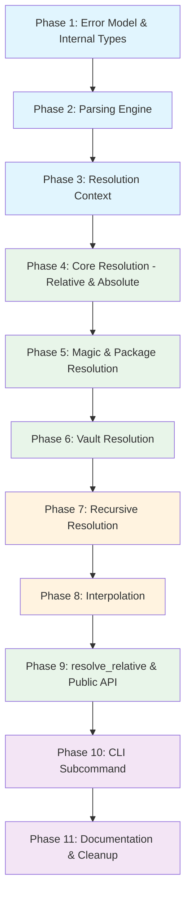

## Context

The `biscuit-file` library currently handles file format detection and conversion (TOML, YAML, JSON5, PDF, Markdown frontmatter). This plan adds a complementary capability: **file reference resolution** -- the ability to describe a file with a compact string descriptor and resolve it later against runtime context.

The functional spec (`docs/file-resolution.md`) defines the user-facing behavior. The tech spec (`docs/tech-spec/file-reference-struct.md`) pins down implementation details, error semantics, and test strategy.

## Success Criteria

- `FileReference::new("@docs/spec.md").resolve()` finds the file at repo root or HOME
- `FileReference::new("!README.md").resolve()` finds the file relative to the Cargo package area
- `FileReference::new("vault:notes/today.md").add_vault("/path").resolve()` searches vault roots
- `FileReference::new("%foo.md").resolve()` recursively searches from CWD
- `FileReference::new("{{DIR}}/foo.md").resolve()` interpolates env vars at resolution time
- Recursive + scope combos work: `%@README.md`, `%!Cargo.toml`
- CLI: `bf reference @foobar.md` prints the resolved absolute path
- All parsing is purely syntactic; all I/O happens at resolution time
- No `unwrap()`/`expect()` in library code

## Dependency Graph



---

## Phase 1: Error Model & Internal Types

**Goal**: Establish the error type and internal data model that all later phases build on.

### New Dependencies (lib/Cargo.toml)

```toml
git2 = "0.20"           # repo-root discovery
cargo_metadata = "0.19" # workspace member inspection
walkdir = "2"           # recursive traversal
```

### Files to Create

**`lib/src/file_reference/error.rs`**

```rust
#[derive(Debug, thiserror::Error)]
pub enum FileReferenceError {
    #[error("file reference syntax is invalid: {0}")]
    InvalidSyntax(String),

    #[error("environment variable `{name}` is not set")]
    MissingEnvironmentVariable { name: String },

    #[error("could not determine the current working directory: {0}")]
    CurrentDirectory(#[source] std::io::Error),

    #[error("could not inspect git repository state: {0}")]
    Git(String),

    #[error("could not inspect Cargo workspace state: {0}")]
    Workspace(String),

    #[error("vault reference used without any configured vault roots")]
    VaultNotConfigured,

    #[error("could not produce a relative path from `{from}` to `{to}`")]
    RelativePath { from: PathBuf, to: PathBuf },

    #[error("filesystem error while resolving `{path}`: {source}")]
    Io { path: PathBuf, #[source] source: std::io::Error },
}
```

**`lib/src/file_reference/mod.rs`**

Define and re-export:
- `FileReference` struct (fields: `raw`, `parsed`, `magic_paths`, `vault_roots`)
- `PathPosition` enum (`Start`, `End`)
- `FileReferenceError`

Internal types (not re-exported):
- `ParsedReference { recursive: bool, kind: ReferenceKind }`
- `ReferenceKind` enum: `Relative(PathTemplate)`, `Absolute(PathTemplate)`, `Magic(PathTemplate)`, `Package(PathTemplate)`, `Vault(PathTemplate)`
- `PathTemplate { segments: Vec<TemplateSegment> }`
- `TemplateSegment` enum: `Literal(String)`, `EnvVar(String)`
- `MagicPathList { prepend: Vec<PathBuf>, append: Vec<PathBuf> }`

### Files to Modify

**`lib/src/lib.rs`**: Add `pub mod file_reference;` and re-export `FileReference`, `PathPosition`, `FileReferenceError`.

### Tests

- `FileReferenceError` variants format correctly via `Display`
- `PathPosition`, `ReferenceKind` derive `Debug`, `Clone`, `PartialEq`, `Eq`

---

## Phase 2: Parsing Engine

**Goal**: Parse raw reference strings into `ParsedReference` without any filesystem access.

### Files to Create

**`lib/src/file_reference/parse.rs`**

Parsing pipeline:

1. Strip leading `%` → set `recursive = true`
2. Detect kind by prefix precedence:
   - `vault::` or `vault:` → `Vault` (strip prefix)
   - `@` → `Magic` (strip `@`)
   - `!` → `Package` (strip `!`)
   - starts with `/` → `Absolute`
   - everything else → `Relative`
3. Parse remaining string into `PathTemplate`:
   - Scan for `{{NAME}}` patterns
   - Variable names must match `[A-Z0-9_]+`
   - Empty `{{}}` → return `Err(InvalidSyntax)`
   - Everything between interpolation tokens is `Literal`

Expose: `pub(crate) fn parse(raw: &str) -> Result<ParsedReference, FileReferenceError>`

### Tests (unit, in parse.rs or tests module)

- `./foo.md` → `Relative`, not recursive
- `%./foo.md` → `Relative`, recursive
- `@docs/spec.md` → `Magic`, not recursive
- `%@README.md` → `Magic`, recursive
- `!lib/src/lib.rs` → `Package`
- `/Users/bob/file.txt` → `Absolute`
- `vault:notes/today.md` → `Vault`
- `vault::notes/today.md` → `Vault` (same result)
- `{{DIR}}/foo.md` → `Relative` with `EnvVar("DIR")` + `Literal("/foo.md")`
- `{{}}` → `Err(InvalidSyntax)`
- `{{invalid-name}}` → `Err(InvalidSyntax)` (lowercase/hyphens rejected)
- `foo{{A}}bar{{B}}baz` → three segments interleaved correctly
- `%vault:{{V}}/note.md` → recursive Vault with interpolation

---

## Phase 3: Resolution Context

**Goal**: Build a context object capturing runtime state for resolution, with test injection support.

### Files to Create

**`lib/src/file_reference/context.rs`**

```rust
pub(crate) struct ResolutionContext {
    pub cwd: PathBuf,
    pub home_dir: Option<PathBuf>,
    pub env: HashMap<String, String>,
}

impl ResolutionContext {
    /// Build from live process state.
    pub fn from_ambient() -> Result<Self, FileReferenceError> { ... }
}
```

Also provide:
- `pub(crate) fn find_git_root(from: &Path) -> Result<Option<PathBuf>, FileReferenceError>` -- uses `git2::Repository::discover()`
- `pub(crate) fn find_package_area(repo_root: &Path, cwd: &Path) -> Result<Option<PathBuf>, FileReferenceError>` -- uses `cargo_metadata` to find the workspace member containing `cwd`, then extracts the first path component under the workspace root

### Tests

- `from_ambient()` succeeds in a normal environment
- `find_git_root()` returns `Some` inside this repo, `None` from `/tmp`
- `find_package_area()` returns correct area for known workspace layouts

---

## Phase 4: Core Resolution -- Relative & Absolute

**Goal**: Implement `resolve()` for the two simplest reference kinds.

### Files to Create

**`lib/src/file_reference/resolve.rs`**

Core resolution function:

```rust
pub(crate) fn resolve(
    parsed: &ParsedReference,
    magic_paths: &MagicPathList,
    vault_roots: &[PathBuf],
    ctx: &ResolutionContext,
) -> Result<Option<PathBuf>, FileReferenceError>
```

Phase 4 implements only `Relative` and `Absolute` arms (others return `Ok(None)` as stubs):

- **Relative**: join interpolated path with `ctx.cwd`, check `is_file()`
- **Absolute**: after interpolation, verify the path is still absolute, check `is_file()`
- Normalize output to absolute without canonicalizing symlinks

### Wire Up Public API

In `mod.rs`, implement:
- `FileReference::new()` -- stores raw string, calls `parse()`
- `FileReference::raw()` -- returns `&str`
- `FileReference::add_magic_path()` -- pushes to prepend/append
- `FileReference::add_vault()` -- pushes to vault_roots
- `FileReference::resolve()` -- builds `ResolutionContext::from_ambient()`, delegates to `resolve::resolve()`

### Integration Tests (lib/tests/ or inline)

Use `tempfile::TempDir` for isolated filesystems:

- Relative path resolves when file exists
- Relative path returns `Ok(None)` when file missing
- Absolute path resolves when file exists
- Absolute path returns `Ok(None)` when file missing
- CWD at construction time does NOT affect resolution (construct in `/tmp`, resolve in tempdir)

---

## Phase 5: Magic & Package Resolution

**Goal**: Implement `@` (magic) and `!` (package-root) resolution.

### Magic (`@`) Resolution

Ordered search roots:
1. `magic_paths.prepend` entries (insertion order)
2. Git repo root (via `find_git_root(ctx.cwd)`)
3. `ctx.home_dir`
4. `magic_paths.append` entries (insertion order)

Strip leading `@`, join remaining path with each root, return first `is_file()` hit.

### Package (`!`) Resolution

1. Find git repo root from `ctx.cwd`
2. If no repo → `Ok(None)`
3. Call `find_package_area(repo_root, ctx.cwd)`
4. If package area found → join `!`-path relative to `{workspace_root}/{first_component}`
5. If no package area (single-crate repo) → join relative to repo root
6. Check `is_file()`

### Integration Tests

Use `tempfile` + `git2` to create temporary git repos:

**Magic tests:**
- `@foo.md` found at repo root
- `@foo.md` falls through to HOME when not in repo root
- `@foo.md` found in `Start` magic path before repo root
- `@foo.md` found in `End` magic path after HOME
- Full search order verified with file in each position

**Package tests:**
- Single-crate repo: `!README.md` resolves from repo root
- Workspace with `biscuit-file/lib` layout: `!docs/file-resolution.md` from `biscuit-file/`
- CWD not in any package area → `Ok(None)`
- No git repo → `Ok(None)`

---

## Phase 6: Vault Resolution

**Goal**: Implement `vault:` resolution.

### Resolution Logic

1. Collect vault roots: `vault_roots` from builder + paths from `VAULT` env var (parsed with `std::env::split_paths`)
2. If no roots → `Err(VaultNotConfigured)`
3. Strip `vault:` or `vault::` prefix
4. Join remaining path with each root in order
5. Return first `is_file()` hit, or `Ok(None)`

### Integration Tests

Use `tempfile` + `serial_test` for env var manipulation:

- Single vault root resolves correctly
- Multiple vault roots searched in order
- `VAULT` env var with multiple paths (colon-separated on Unix)
- Builder vaults searched before env var vaults
- No vaults configured → `Err(VaultNotConfigured)`
- `vault:` and `vault::` parse equivalently

---

## Phase 7: Recursive Resolution

**Goal**: Implement the `%` recursive modifier across all scope kinds.

### Resolution Logic

When `parsed.recursive == true`:

1. Build candidate roots using the normal scope logic (magic roots, package root, etc.) but do NOT check `is_file()` at the joined path
2. Extract the filename (needle) from the interpolated path:
   - If the path has directory components, the parent defines recursive search subdirectories under each root
   - If only a filename, search from each root directly
3. Use `walkdir::WalkDir` to traverse each root:
   - Do NOT follow symlinks
   - Skip unreadable directories (log warning, continue)
   - Collect all files whose basename matches the needle exactly
4. Sort matches lexicographically by full path
5. Return the first match

### Integration Tests

Use `tempfile` with nested directory structures:

- `%foo.md` finds deeply nested file
- `%foo.md` returns lexicographically first when multiple matches exist
- `%./docs/spec.md` searches `{cwd}/docs/**/spec.md`
- `%@README.md` searches all magic roots recursively
- `%!Cargo.toml` searches package area recursively
- Symlink loops do not cause infinite recursion
- Unreadable directory is skipped without error

---

## Phase 8: Interpolation

**Goal**: Implement `{{ENV_VAR}}` expansion at resolution time.

### Resolution Logic

In `resolve.rs`, before building candidate paths:

1. Walk `PathTemplate.segments`
2. For each `EnvVar(name)`, look up in `ctx.env`
3. If missing → `Err(MissingEnvironmentVariable { name })`
4. Concatenate all segments into the resolved path string

### Integration Tests

Use `serial_test` for env var manipulation:

- `{{HOME}}/foo.md` resolves with HOME set
- `{{MISSING}}/foo.md` → `Err(MissingEnvironmentVariable)`
- Multiple interpolations: `{{A}}/{{B}}/foo.md`
- Interpolation combined with magic: `@{{SUBDIR}}/foo.md`
- Interpolated value containing path separators works correctly

---

## Phase 9: resolve_relative & Public API Polish

**Goal**: Implement `resolve_relative()` and finalize the public API.

### resolve_relative()

```rust
pub fn resolve_relative(
    &self,
    base: Option<&Path>,
) -> Result<Option<PathBuf>, FileReferenceError>
```

1. Call `self.resolve()`
2. If `Ok(None)` → return `Ok(None)`
3. Determine base: provided `base` or `ctx.cwd`
4. Compute relative path using internal `diff_paths(target, base)` helper
5. If diff fails → `Err(RelativePath { from, to })`

### Internal `diff_paths` Helper

Implement a small path-diffing function (no external dependency):
- Normalize both paths to absolute
- Find common prefix
- Add `..` components to go up from base to common ancestor
- Append remaining target components

### Integration Tests

- `resolve_relative(None)` returns path relative to CWD
- `resolve_relative(Some(base))` returns path relative to given base
- Cross-directory: file in sibling dir produces `../sibling/file.md`
- Parent traversal produces `../../file.md`
- Same-directory produces just filename

---

## Phase 10: CLI Subcommand

**Goal**: Add `bf reference` (alias `ref`) to the CLI.

### Files to Modify

**`cli/src/main.rs`**

Add a new `Reference` variant to the CLI subcommand enum (or add it alongside the existing file/format arguments):

```rust
#[derive(Subcommand)]
enum Commands {
    /// Resolve a file reference to its filesystem path
    #[command(alias = "ref")]
    Reference {
        /// The file reference string (e.g., @foo.md, !README.md, vault:note.md)
        reference: String,

        /// Output a path relative to its base directory
        #[arg(long)]
        relative: bool,

        /// Output a path relative to the current working directory
        #[arg(long)]
        relative_cwd: bool,

        /// Add an Obsidian vault root path
        #[arg(long = "add-vault", short = 'v')]
        vaults: Vec<PathBuf>,
    },
}
```

### Behavior

1. Build `FileReference::new(reference)`
2. Add any `--add-vault` paths
3. If `--relative-cwd` → call `resolve_relative(None)` and print
4. If `--relative` → call `resolve()`, then compute relative to the matched base root (this requires exposing which root matched -- consider adding a `ResolvedReference` return type or a separate method)
5. Otherwise → call `resolve()` and print the absolute path
6. Exit 0 if found, exit 1 if `Ok(None)`, exit 2 if error

### CLI Integration Tests

Add to `cli/tests/cli_tests.rs`:

- `bf reference ./Cargo.toml` resolves to absolute path (run from biscuit-file/cli)
- `bf ref ./Cargo.toml` alias works
- `bf reference ./nonexistent.md` exits with code 1
- `bf reference --relative-cwd ./Cargo.toml` prints relative path
- `bf reference --add-vault /tmp/vault vault:note.md` searches vault

---

## Phase 11: Documentation & Cleanup

**Goal**: Update all documentation to match the implementation.

### Files to Update

1. **`biscuit-file/lib/README.md`**: Add FileReference section with usage examples
2. **`biscuit-file/docs/file-resolution.md`**: Fix typos, align examples with actual API (e.g., `ref` → `reference` variable name to avoid keyword conflict)
3. **`biscuit-file/cli/README.md`**: Document the `reference` subcommand
4. **`biscuit-file/lib/src/lib.rs`**: Add FileReference to crate-level docs and re-exports
5. **Rustdoc**: Ensure `FileReference`, `PathPosition`, `FileReferenceError` all have doc examples

### Cleanup

- Run `just lint` and fix any clippy warnings
- Run `just test` and ensure all tests pass
- Verify `just build` succeeds with default features
- Consider adding a `file-reference` feature flag (default-on) so users who only need format conversion can exclude git2/cargo_metadata/walkdir

---

## Implementation Notes

### Feature Flag Consideration

The `git2`, `cargo_metadata`, and `walkdir` dependencies are substantial. Consider gating the entire `file_reference` module behind a default-on feature:

```toml
[features]
default = ["toml", "yaml", "json5", "extract", "lopdf", "file-reference"]
file-reference = ["dep:git2", "dep:cargo_metadata", "dep:walkdir"]
```

This keeps the library lightweight for users who only need format conversion.

### Keyword Avoidance

The functional spec uses `ref` as a variable name in examples. Since `ref` is a Rust keyword, all code examples should use `file_ref`, `reference`, or similar.

### Thread Safety

`FileReference` is `Send + Sync` by construction (all fields are owned data). Resolution is not `&mut self` -- it reads ambient state each time, which is the correct behavior per spec.

### Performance Considerations

- Recursive search (`%`) on large trees could be slow. Consider documenting this tradeoff.
- `git2::Repository::discover()` walks up the filesystem; this is fast but does I/O each call. If users resolve many references, they may want to cache the repo root externally.
- `cargo_metadata::MetadataCommand` spawns `cargo metadata` as a subprocess. This is the recommended approach but adds ~100ms per call. Cache within a resolution context if multiple package references are resolved in sequence.
