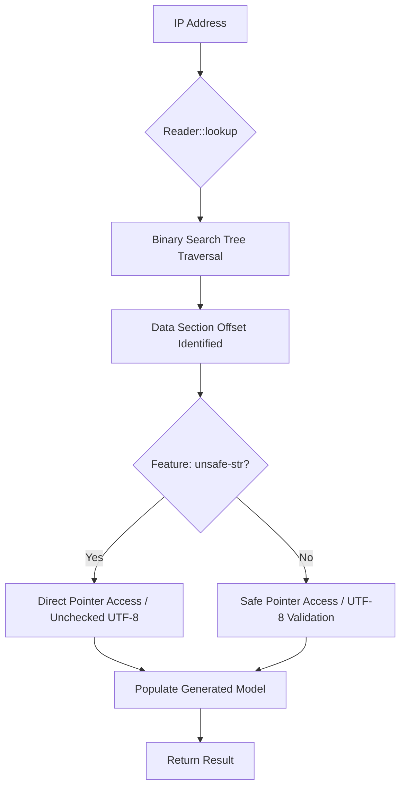

# Deep Dive: `geoip2` Rust Crate

The [`geoip2`](https://github.com/IncSW/geoip2-rs) crate by IncSW is a high-performance, specialized reader for MaxMind DB (`.mmdb`) files, primarily used for GeoIP2 and GeoLite2 databases. Unlike generic readers, it leverages code generation to provide strongly typed models and optimized lookup paths, making it a preferred choice for low-latency systems.

## Functional Footprint

The crate provides a streamlined API for querying various MaxMind database types. Its primary goal is to minimize the overhead of IP address lookups and data deserialization.

* **Database Support**: Compatible with all standard MaxMind formats, including City, Country, ASN, ISP, Connection Type, Anonymous IP, and Enterprise databases.
* **Performance Optimization**:

    * **Codegen-backed Models**: Uses pre-generated structs for each database type, avoiding the runtime overhead of generic `serde` deserialization.
    * **Zero-Allocation Focus**: Designed to minimize heap allocations during the traversal of the database tree.
    * **Optional `unsafe-str`**: A feature flag that enables faster string decoding by bypassing some UTF-8 validation checks.

* **Memory Management**: Supports loading databases from files into memory or directly from byte buffers for flexible deployment (e.g., embedding small databases in binaries).

## Major Use Cases

### 1. Geotargeting and Location Services

The most common use case is identifying the physical location of a user based on their IP address to provide localized content, currency, or language settings.

```rust
use geoip2::Reader;
use std::net::IpAddr;

fn main() -> Result<(), Box<dyn std::error::Error>> {
    // Open the City database
    let reader = Reader::open_readfile("GeoLite2-City.mmdb")?;
    let ip: IpAddr = "1.1.1.1".parse()?;

    // Lookup city data
    let city = reader.lookup::<geoip2::City>(ip)?;

    if let Some(c) = city.city {
        println!("City: {:?}", c.names.get("en"));
    }
    
    if let Some(country) = city.country {
        println!("Country ISO: {:?}", country.iso_code);
    }

    Ok(())
}
```

### 2. Network and Infrastructure Analysis

Identifying the Autonomous System Number (ASN) and Service Provider (ISP) is critical for network monitoring, identifying hosting providers, and optimizing routing.

```rust
use geoip2::Reader;
use std::net::IpAddr;

fn main() -> Result<(), Box<dyn std::error::Error>> {
    let reader = Reader::open_readfile("GeoLite2-ASN.mmdb")?;
    let ip: IpAddr = "8.8.8.8".parse()?;

    // Lookup ASN data
    let asn = reader.lookup::<geoip2::Asn>(ip)?;

    println!("ASN: {:?}", asn.autonomous_system_number);
    println!("Organization: {:?}", asn.autonomous_system_organization);

    Ok(())
}
```

### 3. Fraud Detection and Security

Detecting if an IP address belongs to a known VPN, Tor exit node, or proxy helps in preventing bot attacks and credit card fraud.

```rust
use geoip2::Reader;
use std::net::IpAddr;

fn main() -> Result<(), Box<dyn std::error::Error>> {
    let reader = Reader::open_readfile("GeoIP2-Anonymous-IP.mmdb")?;
    let ip: IpAddr = "172.64.0.0".parse()?; // Example IP

    let anon = reader.lookup::<geoip2::AnonymousIp>(ip)?;

    if anon.is_anonymous_proxy.unwrap_or(false) {
        println!("Warning: Request from an anonymous proxy.");
    }
    
    if anon.is_tor_exit_node.unwrap_or(false) {
        println!("Warning: Request from a Tor exit node.");
    }

    Ok(())
}
```

## Known Issues and Gotchas

* **Sparse Documentation**: The crate is notoriously under-documented on `docs.rs`. Developers often need to refer to the [GitHub repository examples](https://github.com/IncSW/geoip2-rs/tree/master/examples) or the source code to understand the full range of model fields.
* **The `unsafe-str` Trade-off**: Enabling the `unsafe-str` feature significantly boosts performance by using `from_utf8_unchecked`. While generally safe for MaxMind-produced databases, it bypasses safety checks that might be required in extremely high-security environments.
* **Model Rigidity**: Because the models are generated via codegen, adding support for custom fields in modified `.mmdb` files requires changes to the underlying `geoip2-codegen` logic rather than simple struct updates.
* **No Native `mmap`**: Unlike some other readers, `geoip2` primarily focuses on `open_readfile` (loading into memory) or `from_bytes`. For massive databases where memory mapping is required to save RAM, developers may need to manually map the file and pass the slice to `from_bytes`.

## Comparison: `geoip2` vs `maxminddb`

While `maxminddb` is the older, community-standard crate, `geoip2` (IncSW) has gained traction for high-performance use cases.

| Feature               | `geoip2` (IncSW)               | `maxminddb` (oschwald)                 |
|:----------------------|:-------------------------------|:---------------------------------------|
| **Decoding Strategy** | Codegen (Pre-generated models) | Serde (Runtime deserialization)        |
| **Performance**       | Higher (optimized for speed)   | Standard (flexible)                    |
| **API Ergonomics**    | Simple, type-specific lookups  | Generic, requires trait implementation |
| **Documentation**     | Minimal                        | Excellent                              |
| **Stability**         | Performance-focused updates    | Long-term maintenance focus            |
| **Selective Fields**  | Returns full typed structs     | Supports decoding specific sub-paths   |

### Summary of Differences

1. **Serialization**: `maxminddb` relies on `serde` to map database records to structs. `geoip2` uses a custom code-generator that creates structs specifically for the MaxMind schema, leading to faster execution by removing the generic deserialization layer.
2. **Safety**: `maxminddb` is written entirely in safe Rust. `geoip2` offers `unsafe` optimizations that provide a 10-20% speed boost in raw lookup benchmarks.
3. **Flexibility**: `maxminddb` is better for custom `.mmdb` files with non-standard structures, as you can easily define your own `serde`-compatible structs. `geoip2` is strictly optimized for the official MaxMind GeoIP2/GeoLite2 schemas.

## Architectural Overview

The following diagram illustrates the lookup process within the `geoip2` crate:


