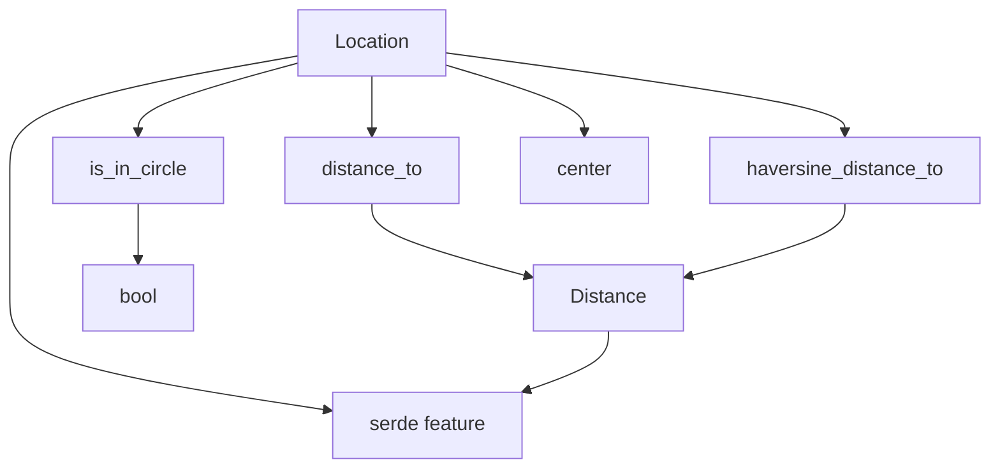

## `geoutils`

[`geoutils`](https://github.com/srishanbhattarai/geoutils) is a very small geodesic helper crate for Rust. In its current released form, [`v0.5.1`](https://crates.io/crates/geoutils/0.5.1) exposes two public domain types, [`Location`](https://docs.rs/geoutils/0.5.1/geoutils/struct.Location.html) and [`Distance`](https://docs.rs/geoutils/0.5.1/geoutils/struct.Distance.html), and focuses on four core operations: ellipsoidal distance, spherical distance, radius checks, and geographic center calculation. Despite the broad README wording, it is not a general GIS toolkit.

### Functional Footprint

| Capability | Public API | Notes |
| --- | --- | --- |
| Represent a latitude/longitude point | `Location::new`, `Location::new_const` | Immutable `(lat, lon)` value object with getters |
| Represent a distance | `Distance::from_meters`, `Distance::meters` | Meter-backed wrapper type |
| Accurate point-to-point distance | `Location::distance_to` | Uses Vincenty inverse formula over WGS-84; returns `Result` because convergence can fail |
| Fast approximate point-to-point distance | `Location::haversine_distance_to` | Uses a spherical Haversine calculation; no error path |
| Radial geofencing / proximity check | `Location::is_in_circle` | Internally uses the same Vincenty path as `distance_to` |
| Geographic center of many points | `Location::center` | Computes a spherical center from a slice of locations |
| Serialization | `serde` feature | Optional `Serialize` / `Deserialize` derives for `Location` and `Distance` |

### What It Does Not Cover

`geoutils` currently does **not** provide polygon containment, route/polyline distance helpers, altitude conversions, CRS/projection support, bearings as public API, or built-in non-meter units. Those gaps show up repeatedly in the project history through feature requests such as [polygon containment](https://github.com/srishanbhattarai/geoutils/issues/3), [distance over a vector of locations](https://github.com/srishanbhattarai/geoutils/issues/18), [altitude conversion](https://github.com/srishanbhattarai/geoutils/issues/19), [miles support](https://github.com/srishanbhattarai/geoutils/pull/20), and [`rkyv` support](https://github.com/srishanbhattarai/geoutils/pull/21).



## Major Use Cases

### 1. Precise distance between two coordinates

Use this when distance quality matters more than raw throughput, such as logistics, travel estimation, or geospatial thresholds that should be measured on the WGS-84 ellipsoid rather than a simple sphere.

```rust
use geoutils::Location;

fn main() -> Result<(), String> {
        let berlin = Location::new(52.518611, 13.408056);
        let moscow = Location::new(55.751667, 37.617778);

        let distance = berlin.distance_to(&moscow)?;
        println!("Berlin -> Moscow: {:.3} m", distance.meters());

        Ok(())
}
```

### 2. Fast approximate distance for broad filtering

Use Haversine when you need a cheap approximation first, for example to pre-filter nearby candidates before doing a more accurate second pass.

```rust
use geoutils::Location;

fn main() {
        let user = Location::new(37.7749, -122.4194);
        let warehouses = [
                ("oakland", Location::new(37.8044, -122.2711)),
                ("san_jose", Location::new(37.3382, -121.8863)),
                ("seattle", Location::new(47.6062, -122.3321)),
        ];

        let nearby: Vec<_> = warehouses
                .iter()
                .filter(|(_, loc)| user.haversine_distance_to(loc).meters() < 100_000.0)
                .map(|(name, _)| *name)
                .collect();

        println!("{nearby:?}");
}
```

### 3. Circle-based geofencing

This is the crate's built-in geofence primitive: "is this point within a radius of that point?"

```rust
use geoutils::{Distance, Location};

fn main() -> Result<(), String> {
        let store = Location::new(40.7580, -73.9855);
        let courier = Location::new(40.7615, -73.9777);

        let in_service_area = courier.is_in_circle(&store, Distance::from_meters(1_000.0))?;
        println!("Inside 1km service area: {in_service_area}");

        Ok(())
}
```

### 4. Computing the center of multiple coordinates

Use this to derive a representative midpoint for a cluster of stops, users, vehicles, or landmarks.

```rust
use geoutils::Location;

fn main() {
        let a = Location::new(34.0522, -118.2437);
        let b = Location::new(36.1699, -115.1398);
        let c = Location::new(32.7157, -117.1611);

        let center = Location::center(&[&a, &b, &c]);
        println!(
                "Cluster center: lat={}, lon={}",
                center.latitude(),
                center.longitude()
        );
}
```

### 5. Persisting coordinates with Serde

If your application stores locations in JSON, sends them over an API, or caches them on disk, the optional `serde` feature keeps the integration lightweight.

```rust
use geoutils::Location;

fn main() -> Result<(), Box<dyn std::error::Error>> {
        let home = Location::new(51.5074, -0.1278);

        let json = serde_json::to_string(&home)?;
        let decoded: Location = serde_json::from_str(&json)?;

        assert_eq!(home, decoded);
        Ok(())
}
```

`Cargo.toml`:

```toml
[dependencies]
geoutils = { version = "0.5.1", features = ["serde"] }
serde_json = "1"
```

## Known Issues, Gotchas, and Workarounds

| Gotcha | Evidence | Workaround |
| --- | --- | --- |
| The crate is intentionally narrow, not a full GIS stack | Confirmed by the released API and feature requests for polygons, path totals, altitude conversion, miles, and `rkyv` | Use `geoutils` only for simple point/radius math; move to the broader [`geo`](https://crates.io/crates/geo) ecosystem if you need polygons, projections, route geometry, or richer algorithms |
| Maintenance looks light | Latest release [`v0.5.1`](https://github.com/srishanbhattarai/geoutils/releases/tag/v0.5.1) was published on **August 7, 2022**; on **September 12, 2023** the maintainer said they lacked time and might archive the repo in [Issue #19](https://github.com/srishanbhattarai/geoutils/issues/19); feature PRs from **January 20, 2025** and **January 14, 2026** remain open | If you depend on missing features or fixes, plan to fork/vendor it or choose a more active crate |
| Vincenty can fail to converge | `Location::distance_to` and `is_in_circle` document and implement an error path after 100 iterations in [`src/lib.rs`](https://github.com/srishanbhattarai/geoutils/blob/master/src/lib.rs) and [`src/formula.rs`](https://github.com/srishanbhattarai/geoutils/blob/master/src/formula.rs) | Handle `Result`; for difficult point pairs or bulk screening, fall back to `haversine_distance_to` or switch to a library with more robust geodesic routines |
| Units are meters, and that has historically confused users | [Issue #7](https://github.com/srishanbhattarai/geoutils/issues/7) asked for clearer unit docs; [release `0.3.0`](https://github.com/srishanbhattarai/geoutils/releases/tag/0.3.0) changed distance APIs from raw `f64` to `Distance` to make units explicit | Always call `.meters()` at integration boundaries and perform your own conversions for kilometers/miles |
| Outputs are rounded internally | Inferred from source: Vincenty and Haversine distances are rounded to 3 decimal places, and centers to 6 decimal places in [`src/formula.rs`](https://github.com/srishanbhattarai/geoutils/blob/master/src/formula.rs); early work also mentioned "rounding issues" in [PR #1](https://github.com/srishanbhattarai/geoutils/pull/1) | Do not treat `geoutils` as a high-precision scientific primitive; if exact floating output matters, use a different crate or a fork that removes internal rounding |
| `Location::center` does not guard against an empty slice | Inferred from source: it divides by `coords.len()` without returning `Option`/`Result` | Validate input before calling `center`; wrap it in your own helper that returns `Option<Location>` |
| Coordinates are not validated | Inferred from source: `Location::new` accepts any `Into<f64>` values and stores them directly | Enforce latitude `[-90, 90]` and longitude `[-180, 180]` in your own constructors or domain layer |
| `is_in_circle` is exclusive at the boundary | Inferred from source: the implementation uses `<`, not `<=`, when comparing meters | If boundary inclusion matters, call `distance_to` yourself and compare with `<=` plus a small epsilon |
| Serialization support is limited | Released crate supports only optional `serde`; [`rkyv` support PR #21](https://github.com/srishanbhattarai/geoutils/pull/21) is still open | Use the `serde` feature today, or add wrappers / maintain a fork for other serialization formats |

## Bottom Line

`geoutils` is best viewed as a lightweight utility crate for applications that need simple coordinate math with minimal dependencies: distance, radius checks, and midpoint calculation. It is a good fit when you want a tiny API and do not need the complexity of a full geospatial stack.

It becomes a poor fit once requirements grow into polygonal geofencing, route geometry, projections, altitude handling, richer units, or long-term maintenance assurances.

## Sources

- [Crates.io package page](https://crates.io/crates/geoutils/0.5.1)
- [Docs.rs API docs](https://docs.rs/geoutils/0.5.1/geoutils/)
- [Repository README](https://github.com/srishanbhattarai/geoutils/blob/master/README.md)
- [Current `src/lib.rs`](https://github.com/srishanbhattarai/geoutils/blob/master/src/lib.rs)
- [Current `src/formula.rs`](https://github.com/srishanbhattarai/geoutils/blob/master/src/formula.rs)
- [Release `v0.5.1`](https://github.com/srishanbhattarai/geoutils/releases/tag/v0.5.1)
- [Release `0.3.0`](https://github.com/srishanbhattarai/geoutils/releases/tag/0.3.0)
- [Issue #7: Document unit](https://github.com/srishanbhattarai/geoutils/issues/7)
- [Issue #18: Distance for vec of locations](https://github.com/srishanbhattarai/geoutils/issues/18)
- [Issue #19: Altitude conversion request](https://github.com/srishanbhattarai/geoutils/issues/19)
- [PR #20: miles support](https://github.com/srishanbhattarai/geoutils/pull/20)
- [PR #21: `rkyv` support](https://github.com/srishanbhattarai/geoutils/pull/21)

