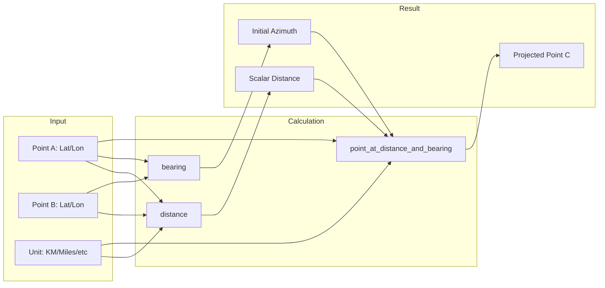

# Deep Dive: `haversine-rs` Crate (v0.3.0)

The `haversine-rs` crate is a lightweight, specialized tool designed for calculating the great-circle distance between two points on a sphere using the Haversine formula. It is particularly useful for navigation, geospatial analysis, and location-based services where the complexity of an ellipsoidal Earth model (like WGS-84) is not required.

## Functional Footprint

The crate provides a streamlined API centered around a single data structure and several helper functions.

### Core Data Structures

- **`Point`**: The primary struct representing a geographic coordinate.

  - `latitude: f64` (in degrees)
  - `longitude: f64` (in degrees)
  - Methods: `new(lat, lon)`, `to_radians()`, `to_degrees()`.

- **`Unit`**: An enum defining the unit of measurement for output distances.

  - `Kilometers`, `Miles`, `NauticalMiles`, `Yards`, `Feet`, `Inches`.

### Primary Functions

| Function | Description |
| :--- | :--- |
| `distance(start, end, unit)` | Calculates the shortest distance over the Earth's surface between two points. |
| `distance_vec(points, unit)` | Calculates the cumulative distance for a series of connected points (a path or route). |
| `bearing(start, end)` | Computes the initial bearing (forward azimuth) from the start point to the end point in degrees. |
| `point_at_distance_and_bearing(start, distance, bearing, unit)` | Projects a new `Point` given an origin, a distance, and an initial bearing. |

## Major Use Cases

### 1. Point-to-Point Distance Calculation

The most common use case is determining the "as-the-crow-flies" distance between two coordinates, such as calculating the distance between a user's location and a point of interest.

```rust
use haversine_rs::point::Point;
use haversine_rs::units::Unit;
use haversine_rs::distance;

fn main() {
        let nyc = Point::new(40.7128, -74.0060);
        let london = Point::new(51.5074, -0.1278);

        let miles = distance(nyc, london, Unit::Miles);
        println!("Distance from NYC to London: {:.2} miles", miles);
}
```

### 2. Route Length Analysis

For applications tracking movement (e.g., fitness trackers or delivery services), `distance_vec` allows for easy calculation of total trip length.

```rust
use haversine_rs::point::Point;
use haversine_rs::units::Unit;
use haversine_rs::distance_vec;

fn main() {
        let route = vec![
                Point::new(34.0522, -118.2437), // Los Angeles
                Point::new(37.7749, -122.4194), // San Francisco
                Point::new(47.6062, -122.3321), // Seattle
        ];

        let total_km = distance_vec(route, Unit::Kilometers);
        println!("Total road trip distance: {:.2} km", total_km);
}
```

### 3. Navigation: Initial Bearing

When building navigation systems, you often need to know which direction to travel initially to reach a target. The `bearing` function returns this in degrees relative to North (0° to 360°).

```rust
use haversine_rs::point::Point;
use haversine_rs::bearing;

fn main() {
        let start = Point::new(0.0, 0.0);
        let end = Point::new(10.0, 10.0);

        let initial_bearing = bearing(start, end);
        println!("To reach the destination, steer at: {:.2}°", initial_bearing);
}
```

### 4. Destination Projection

Predicting where a vessel or vehicle will be after traveling a certain distance at a specific bearing is critical for dead reckoning and safety-of-navigation.

```rust
use haversine_rs::point::Point;
use haversine_rs::units::Unit;
use haversine_rs::point_at_distance_and_bearing;

fn main() {
        let start = Point::new(45.0, -75.0);
        let distance = 500.0; // km
        let bearing = 90.0;   // Due East

        let destination = point_at_distance_and_bearing(start, distance, bearing, Unit::Kilometers);
        println!("Projected location: Lat {:.4}, Lon {:.4}", destination.latitude, destination.longitude);
}
```

## Data Flow Visualization



## Known Issues and "Gotchas"

### 1. Spherical Earth Assumption (0.5% Error)

The Haversine formula assumes the Earth is a perfect sphere. In reality, the Earth is an oblate spheroid (bulging at the equator).

- **The Issue:** This can lead to errors of up to **0.5%** depending on the latitude and direction of travel.
- **Workaround:** If sub-meter precision is required for long-distance measurements, use the [`geo`](https://crates.io/crates/geo) crate, which implements the **Vincenty formula** or **Karney algorithm** for the WGS-84 ellipsoid.

### 2. Coordinate Order Confusion

While `haversine-rs` uses `Point::new(latitude, longitude)`, many other libraries (like GeoJSON or some GIS tools) prefer `[longitude, latitude]`.

- **The Issue:** Swapping these will result in nonsensical distances or bearings without throwing an error.
- **Workaround:** Always verify the coordinate order of your source data before initializing `Point` structs.

### 3. Lack of Input Validation

The crate performs raw mathematical operations on the `f64` values provided.

- **The Issue:** Passing a latitude of `200.0` or a longitude of `-500.0` will result in a value being returned rather than an `Error`.
- **Workaround:** Manually validate coordinates before passing them to the crate:

  - Latitude: `-90.0` to `90.0`
  - Longitude: `-180.0` to `180.0`

### 4. Floating Point Precision at Antipodes

The Haversine formula is much more stable than the Law of Cosines for small distances, but can encounter slight precision issues when points are **exactly antipodal** (on opposite sides of the Earth).

- **The Issue:** Rounding errors in `f64` can lead to inconsistent results at nearly 20,000 km distances.
- **Workaround:** For global-scale applications, consider checking if the points are nearly antipodal before performing critical calculations.
