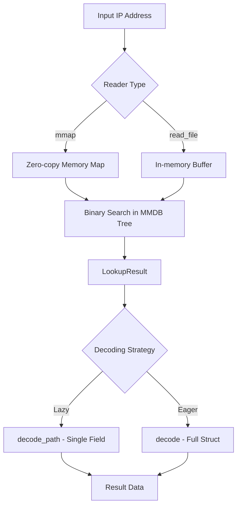

# Deep Dive: `maxminddb` (Rust)

The [`maxminddb`](https://github.com/oschwald/maxminddb-rust) crate is the definitive Rust implementation for reading MaxMind DB (`.mmdb`) files. It provides a high-performance, thread-safe interface to query IP geolocation and network intelligence data, such as City, Country, ASN, and ISP information.

## 1. Functional Footprint

The crate is designed as a low-level, zero-allocation-friendly reader for the binary MaxMind DB format. Its functional footprint includes:

* **Core Reader API**: Centered around the `Reader` struct, which can load databases via memory-mapping (`mmap`) or by reading the entire file into an in-memory buffer.
* **Lazy Decoding (v0.27+)**: A transformative feature that allows lookups to return a result without immediately deserializing the entire record. This allows developers to check for data existence or network prefixes without the overhead of full record parsing.
* **Selective Path Access**: Using `decode_path`, you can extract a single nested field (e.g., `city -> names -> en`) from a large record without deserializing the surrounding object, significantly reducing CPU usage in high-throughput applications.
* **Strongly Typed Models**: The `geoip2` module provides predefined structs that map directly to standard MaxMind databases (City, Country, ASN, ISP, Anonymous IP).
* **Network Iteration**: Support for iterating over every network in a database or finding all networks within a specific CIDR range.
* **Performance Toggles**: Feature flags for SIMD-accelerated UTF-8 validation (`simdutf8`) or bypassing validation entirely (`unsafe-str-decode`) for trusted databases.

### Visualizing the Lookup Flow



## 2. Major Use Cases

### A. Real-time Geolocation (Web Backends)

Identifying a user's location to provide localized content, currency, or to comply with regional regulations (like GDPR/CCPA).

```rust
use maxminddb::{geoip2, Reader};
use std::net::IpAddr;

fn main() -> Result<(), Box<dyn std::error::Error>> {
    // Open the City database (using read_file for simplicity here)
    let reader = Reader::open_readfile("GeoLite2-City.mmdb")?;
    let ip: IpAddr = "1.1.1.1".parse()?;
    
    // Lookup the IP and decode the full City record
    let city: geoip2::City = reader.lookup(ip)?;
    
    if let Some(country) = city.country {
        println!("ISO Code: {:?}", country.iso_code);
    }
    
    Ok(())
}
```

### B. Fraud Detection & Risk Scoring

Checking if an IP belongs to a known VPN, Tor exit node, or public proxy to prevent bot attacks or fraudulent transactions.

```rust
use maxminddb::{geoip2, Reader};

fn check_risk(reader: &Reader<Vec<u8>>, ip: std::net::IpAddr) -> bool {
    // Using the Anonymous IP database
    if let Ok(anon_ip) = reader.lookup::<geoip2::AnonymousIp>(ip) {
        return anon_ip.is_anonymous_proxy.unwrap_or(false) 
            || anon_ip.is_vpn.unwrap_or(false)
            || anon_ip.is_tor_exit_node.unwrap_or(false);
    }
    false
}
```

### C. High-Performance Log Enrichment

Enriching millions of log lines with specific data points (e.g., only the ASN) using selective path decoding to maximize throughput.

```rust
use maxminddb::{Reader, PathElement};

fn get_asn_only(reader: &Reader<Vec<u8>>, ip: std::net::IpAddr) -> Option<u32> {
    // Extract only the 'autonomous_system_number' without decoding the whole ASN struct
    reader.lookup(ip).ok()?.decode_path(&[
        PathElement::Key("autonomous_system_number")
    ]).ok()
}
```

## 3. Known Issues & "Gotchas"

| Issue                            | Description                                                                                                                                         | Workaround                                                                                                                      |
|:---------------------------------|:----------------------------------------------------------------------------------------------------------------------------------------------------|:--------------------------------------------------------------------------------------------------------------------------------|
| **Mmap Soundness**               | `Reader::open_mmap` is `unsafe` because if the database file is truncated/modified while the reader is active, it can cause a `SIGBUS` or segfault. | Use `Reader::open_readfile` if you cannot guarantee the file remains static, or ensure your update process uses atomic renames. |
| **Thread Safety Overhead**       | While `Reader` is `Sync`, opening a new reader per thread is expensive.                                                                             | Wrap the `Reader` in an `Arc` and share it across your thread pool or async tasks.                                              |
| **Missing Test Data**            | When cloning the repository, tests will fail because the `.mmdb` files are in a git submodule.                                                      | Run `git submodule update --init` before running `cargo test`.                                                                  |
| **Large Record Deserialization** | Standard `decode()` on a City record involves significant allocation and string validation.                                                         | Use the `decode_path` API added in v0.27 to fetch only the fields you need.                                                     |

## 4. Database Acquisition & Licensing

### Getting the Database

**The database does not come with the crate.** You must download it separately.

1. **Create an Account**: Visit [MaxMind.com](https://www.maxmind.com) and sign up for a free "GeoLite2" account.
2. **Generate License Key**: Create a key in your account dashboard.
3. **Download**: Use the `geoipupdate` tool (official MaxMind utility) or download the `.mmdb` files manually.

### Licensing Information

| Entity                | License           | Notes                                                                                     |
|:----------------------|:------------------|:------------------------------------------------------------------------------------------|
| **`maxminddb` Crate** | **ISC License**   | Extremely permissive. Functionally equivalent to MIT.                                     |
| **GeoLite2 Database** | **GeoLite2 EULA** | Free, but requires attribution and strictly prohibits redistribution of the raw database. |
| **GeoIP2 Database**   | **Commercial**    | Paid subscription. Higher accuracy, more frequent updates, and support.                   |

## 5. Comparison: `maxminddb` vs `geoip2`

While `maxminddb` is the standard choice, the [`geoip2`](https://github.com/incsw/geoip2-rs) crate (by IncSW) is a notable alternative.

| Feature            | `maxminddb`                                                          | `geoip2`                                                      |
|:-------------------|:---------------------------------------------------------------------|:--------------------------------------------------------------|
| **Primary Goal**   | Feature-completeness & Safety                                        | Maximum raw performance                                       |
| **Decoding Style** | **Lazy/Selective**: Decodes only what you ask for via `decode_path`. | **Eager**: Typically decodes the entire struct at once.       |
| **Safety**         | High: Prefers safe abstractions, `mmap` is the main `unsafe` entry.  | Moderate: Uses more `unsafe` internally to eke out speed.     |
| **UTF-8 Handling** | Flexible: Safe, SIMD-accelerated, or `unsafe` (opt-in).              | Performance-first: Often defaults to faster validation paths. |
| **Custom DBs**     | Excellent support for custom MMDB schemas.                           | Primarily optimized for standard MaxMind schemas.             |

### Which to choose?

* **Choose `maxminddb`** for most production applications. The v0.27+ lazy decoding makes it extremely fast while maintaining a safer API surface and supporting custom database schemas.
* **Choose `geoip2`** only if your benchmarks show it providing a critical performance edge in a path where you *must* decode the entire record every time.

