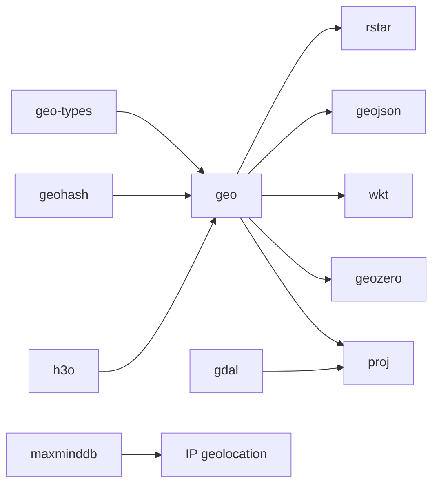

# Rust crates for geography and geo-location

As of 2026-04-01, the crates Rust developers most commonly reach for in this area cluster around the [GeoRust](https://georust.org/) ecosystem plus a few adjacent libraries. This is not a single official top-N ranking; it is an evidence-based shortlist using current crate activity, ecosystem centrality, and how often these crates serve as foundational dependencies. `last_updated` below is the latest crate update date visible from crates.io metadata.

## Categories

| Category                                    | What it covers                                                                                    | Common crates                                                                          |
|---------------------------------------------|---------------------------------------------------------------------------------------------------|----------------------------------------------------------------------------------------|
| Core geometry types                         | Canonical geometry data structures shared across the ecosystem                                    | [`geo-types`](https://docs.rs/geo-types/)                                              |
| Spatial algorithms and measurements         | Topology, containment, intersections, buffering, distance, clustering, geometry transforms        | [`geo`](https://docs.rs/geo/), [`geographiclib-rs`](https://docs.rs/geographiclib-rs/) |
| Coordinate reference systems and projection | CRS conversion, reprojection, datum shifts, EPSG-based transforms                                 | [`proj`](https://docs.rs/proj/)                                                        |
| GIS data access and format bridges          | Reading and writing GIS formats, vector and raster datasets, zero-copy conversion between formats | [`gdal`](https://docs.rs/gdal/), [`geozero`](https://docs.rs/geozero/)                 |
| Standards and interchange formats           | GeoJSON and WKT serialization and parsing                                                         | [`geojson`](https://docs.rs/geojson/), [`wkt`](https://docs.rs/wkt/)                   |
| Spatial indexing                            | In-memory nearest-neighbor and region queries                                                     | [`rstar`](https://docs.rs/rstar/)                                                      |
| Discrete spatial indexing                   | String or cell-based indexing for bucketing, tiling, neighborhood queries, geo partitioning       | [`geohash`](https://docs.rs/geohash/), [`h3o`](https://docs.rs/h3o/)                   |
| IP geolocation                              | GeoIP / GeoLite lookups from MaxMind databases                                                    | [`maxminddb`](https://docs.rs/maxminddb/)                                              |

## Crates

| Name               | Category                                    | Repo URL                                                                                   | docs.rs URL                                                            | Description                                                                  | last_updated | Features                                                                                                                    |
|--------------------|---------------------------------------------|--------------------------------------------------------------------------------------------|------------------------------------------------------------------------|------------------------------------------------------------------------------|--------------|-----------------------------------------------------------------------------------------------------------------------------|
| `geo-types`        | Core geometry types                         | [https://github.com/georust/geo](https://github.com/georust/geo)                           | [https://docs.rs/geo-types/](https://docs.rs/geo-types/)               | Shared primitive geometry types for Rust geospatial work.                    | 2025-12-01   | `Point`, `LineString`, `Polygon`, `Multi*`, `Rect`, interoperable base types for the GeoRust stack                          |
| `geo`              | Spatial algorithms and measurements         | [https://github.com/georust/geo](https://github.com/georust/geo)                           | [https://docs.rs/geo/](https://docs.rs/geo/)                           | The main GeoRust crate for geospatial primitives, algorithms, and utilities. | 2025-12-05   | topological predicates, boolean ops, buffering, affine transforms, clustering, planar and spherical distance calculations   |
| `geojson`          | Standards and interchange formats           | [https://github.com/georust/geojson](https://github.com/georust/geojson)                   | [https://docs.rs/geojson/](https://docs.rs/geojson/)                   | Read and write GeoJSON vector geographic data.                               | 2026-03-16   | parse and serialize `Geometry`, `Feature`, `FeatureCollection`, good fit for web GIS and API payloads                       |
| `wkt`              | Standards and interchange formats           | [https://github.com/georust/wkt](https://github.com/georust/wkt)                           | [https://docs.rs/wkt/](https://docs.rs/wkt/)                           | Read and write WKT, the OGC well-known text geometry format.                 | 2025-05-14   | WKT parsing and serialization, simple interchange with databases and GIS tooling                                            |
| `proj`             | Coordinate reference systems and projection | [https://github.com/georust/proj](https://github.com/georust/proj)                         | [https://docs.rs/proj/](https://docs.rs/proj/)                         | High-level Rust bindings for the PROJ library.                               | 2025-08-29   | CRS transforms, EPSG-based reprojection, pipelines, grid-aware transforms, `geo-types` integration                          |
| `gdal`             | GIS data access and format bridges          | [https://github.com/georust/gdal](https://github.com/georust/gdal)                         | [https://docs.rs/gdal/](https://docs.rs/gdal/)                         | Safe Rust bindings for GDAL.                                                 | 2025-12-23   | raster and vector I/O, metadata access, bands and layers, reprojection, format translation, broad GIS interoperability      |
| `geozero`          | GIS data access and format bridges          | [https://github.com/georust/geozero](https://github.com/georust/geozero)                   | [https://docs.rs/geozero/](https://docs.rs/geozero/)                   | Zero-copy geospatial reading and writing across multiple formats.            | 2025-12-11   | GeoJSON, WKT, WKB, MVT, GDAL, CSV, PostGIS, FlatGeobuf and `geo-types` conversions without a heavy intermediate model       |
| `rstar`            | Spatial indexing                            | [https://github.com/georust/rstar](https://github.com/georust/rstar)                       | [https://docs.rs/rstar/](https://docs.rs/rstar/)                       | A flexible R*-tree spatial index.                                            | 2024-11-05   | nearest-neighbor search, bounding-box queries, bulk loading, efficient in-memory indexing for points and shapes             |
| `geographiclib-rs` | Spatial algorithms and measurements         | [https://github.com/georust/geographiclib-rs](https://github.com/georust/geographiclib-rs) | [https://docs.rs/geographiclib-rs/](https://docs.rs/geographiclib-rs/) | Rust implementation of a subset of GeographicLib.                            | 2026-02-17   | precise ellipsoidal geodesic direct and inverse calculations, polygon area and perimeter on ellipsoids                      |
| `geohash`          | Discrete spatial indexing                   | [https://github.com/georust/geohash.rs](https://github.com/georust/geohash.rs)             | [https://docs.rs/geohash/](https://docs.rs/geohash/)                   | Rust implementation of the Geohash algorithm.                                | 2024-03-13   | geohash encode and decode, neighborhood operations, simple spatial bucketing and prefix-based proximity search              |
| `h3o`              | Discrete spatial indexing                   | [https://github.com/HydroniumLabs/h3o](https://github.com/HydroniumLabs/h3o)               | [https://docs.rs/h3o/](https://docs.rs/h3o/)                           | Pure Rust implementation of Uber's H3 geospatial indexing system.            | 2025-12-05   | hexagonal hierarchical grid indexing, cell traversal, neighborhood queries, good fit for analytics and tiling workloads     |
| `maxminddb`        | IP geolocation                              | [https://github.com/oschwald/maxminddb-rust](https://github.com/oschwald/maxminddb-rust)   | [https://docs.rs/maxminddb/](https://docs.rs/maxminddb/)               | Reader for MaxMind DB files such as GeoIP2 and GeoLite2.                     | 2026-02-16   | IP-to-country, city, ASN and related lookups, memory-mapped or file-backed readers, standard choice for Rust IP geolocation |

## Observations

- The center of gravity is still `geo-types` plus `geo`. Most other Rust geography crates either integrate with them directly or sit adjacent to that stack.
- `proj` and `gdal` are the main bridges to the wider GIS world. If you need CRS correctness, raster support, or broad format support, these are usually the next crates to add.
- `geojson` and `wkt` are the most common standards-format crates. `geozero` becomes useful when a project needs to move between several formats or database encodings efficiently.
- `rstar`, `geohash`, and `h3o` solve different indexing problems. `rstar` is the usual in-memory spatial index; `geohash` and `h3o` are better when you want discrete cell IDs for partitioning, tiling, or aggregation.
- `maxminddb` is the standout geolocation crate for IP-based lookups, but it is a different category from general GIS and geometry processing.

## Notes

- A separate forward/reverse geocoding crate exists as [`geocoding`](https://docs.rs/geocoding/), but it is much less central and less active than the core GeoRust stack.
- If your work is specifically shapefile, OpenStreetMap PBF, or PostGIS focused, also look at [`shapefile`](https://docs.rs/shapefile/), [`osmpbfreader`](https://docs.rs/osmpbfreader/), and [`postgis`](https://docs.rs/postgis/).

## Sources

Data checked against official crate metadata on [crates.io](https://crates.io/), crate documentation on [docs.rs](https://docs.rs/), and the linked upstream GitHub repositories on 2026-04-01.
