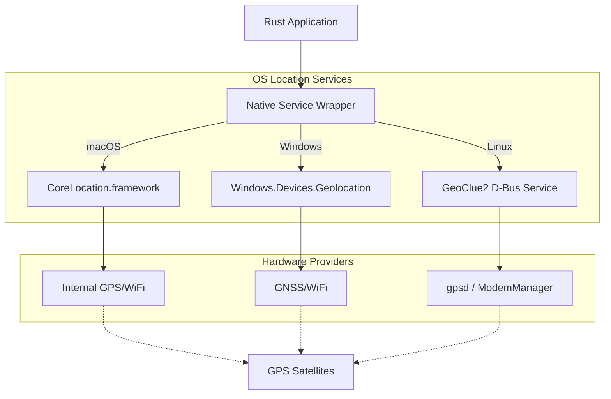

# Rust Native Geolocation Research

To leverage the host's GPS for high-accuracy latitude and longitude, a Rust program must interface with platform-specific Location Services (macOS CoreLocation, Windows Geolocation API, or Linux GeoClue).

## 1. Platform Implementation Matrix

| Platform | System Service | Recommended Crate | Accuracy Source |
| :--- | :--- | :--- | :--- |
| **macOS** | `CoreLocation` | `objc2-core-location` | GPS, WiFi, Bluetooth, Cellular |
| **Windows** | `Windows.Devices.Geolocation` | `windows` or `irox-win-location-api` | GPS, WiFi, IP |
| **Linux** | `GeoClue2` | `geoclue-zbus` | GPS (via gpsd), WiFi, Cellular |
| **Cross-Platform** | Multiple | `geo-loc` | Wraps native APIs where available |

## 2. Architectural Overview



## 3. Implementation Details

### macOS (`objc2-core-location`)

macOS requires using Objective-C bindings to interact with `CLLocationManager`. This is the most accurate method as it handles the transition between GPS and WiFi positioning.

**Permissions:** Must include `NSLocationUsageDescription` and `NSLocationAlwaysAndWhenInUseUsageDescription` in the application's `Info.plist`.

### Windows (`windows` crate)

The official `windows` crate provides direct access to the `Geolocation` namespace.

```rust
use windows::Devices::Geolocation::Geolocator;

async fn get_location() -> windows::core::Result<()> {
        let locator = Geolocator::new()?;
        let pos = locator.GetGeopositionAsync()?.get()?;
        let coord = pos.Coordinate()?;
        
        println!("Lat: {}, Long: {}", coord.Latitude()?, coord.Longitude()?);
        Ok(())
}
```

### Linux (`geoclue-zbus`)

On Linux, location is typically handled via D-Bus. `geoclue-zbus` provides an asynchronous interface to the system's GeoClue service.

**System Dependency:** Requires `geoclue2` to be installed and running (standard on GNOME/KDE).

## 4. Hardware-Level Access (Advanced)

If the host has a dedicated GPS module (e.g., via USB/Serial) and you wish to bypass OS services:

1. **[gpsd-rs](https://crates.io/crates/gpsd-rs):** Best for Linux systems where a `gpsd` daemon handles the hardware multiplexing.
2. **[nmea-parser](https://crates.io/crates/nmea-parser):** Best for reading raw NMEA sentences directly from a serial port (`/dev/ttyUSB0` or `COM3`).

## 5. Security & Privacy Considerations

1. **Sandboxing:** Both macOS and Windows (Store/UWP) applications require explicit "Location" capability declarations.
2. **User Consent:** The OS will trigger a system-level popup the first time the application requests coordinates.
3. **Background Access:** Accessing location while the app is in the background (CLI tools) often requires specialized "Always" permissions or TCC (Transparency, Consent, and Control) overrides on macOS.
