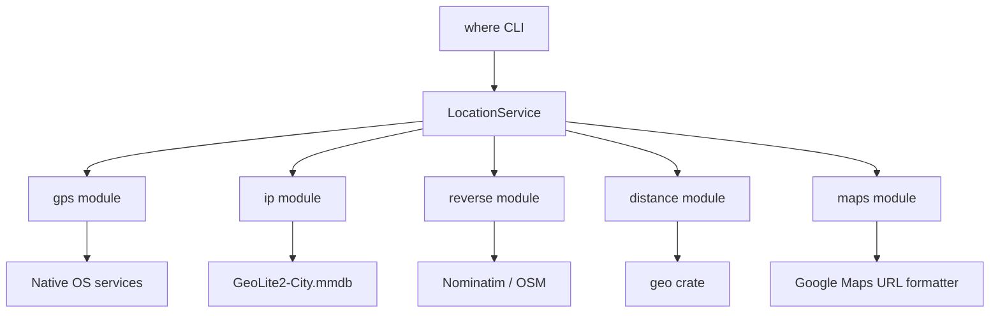

# Biscuit Location Technical Design

This document turns [kickoff.md](./kickoff.md) into an implementation-ready design for the new `biscuit-location` package area.

It also incorporates the local package research already present in:

- `biscuit-location/docs/features/`
- `biscuit-location/docs/location-services/`

## Overview

`biscuit-location` will be a new lib + CLI package area in the monorepo:

- library crate: `biscuit-location`
- CLI crate: `biscuit-location-cli`
- installed binary: `where`

The package provides five capabilities:

1. one-shot host GPS lookup
2. IP-to-location lookup from a local MaxMind GeoLite2 database
3. reverse geocoding from coordinates to a city-level place description
4. distance calculation between two geographic points
5. Google Maps link generation for any resolved coordinates

The core design choice is to expose a single shared `Location` struct for all features, while keeping provider-specific behavior behind small modules and internal adapters.

## Goals

1. Fit the monorepo convention: `README.md`, `justfile`, `lib/`, `cli/`, `docs/`.
2. Keep library APIs composable and testable.
3. Make GPS and reverse geocoding async, while keeping IP lookup and distance sync.
4. Avoid shipping or downloading MaxMind data in code.
5. Keep CLI semantics explicit and predictable.

## Non-Goals

1. Bundling or auto-downloading GeoLite2 databases.
2. Static map image generation.
3. Forward geocoding from free-form place names.
4. Bearing, routing, or polygon/geofence features in v1.
5. Background or streaming GPS tracking.

## High-Level Architecture



## Package Layout

### Package area

```txt
biscuit-location/
├── README.md
├── justfile
├── docs/
│   └── dependencies.md
├── features/
│   └── 2026-04-03-kickoff/
│       ├── kickoff.md
│       └── tech-design.md
├── lib/
│   ├── Cargo.toml
│   ├── README.md
│   └── src/
│       ├── lib.rs
│       ├── config.rs
│       ├── error.rs
│       ├── service.rs
│       ├── types.rs
│       ├── ip.rs
│       ├── reverse.rs
│       ├── distance.rs
│       ├── maps.rs
│       └── gps/
│           ├── mod.rs
│           ├── macos.rs
│           ├── windows.rs
│           └── linux.rs
└── cli/
    ├── Cargo.toml
    ├── README.md
    └── src/
        ├── main.rs
        ├── args.rs
        ├── commands.rs
        └── output.rs
```

### Workspace integration

Implementation must also update:

- root `Cargo.toml` workspace members
- root `justfile` `areas := ...` list

## Core Data Model

The library should use a struct-based model instead of an enum. The data overlaps heavily across features, and an enum would force consumers to pattern-match through mostly shared fields.

```rust
pub struct Coordinates {
    pub latitude: f64,
    pub longitude: f64,
}

pub struct Place {
    pub city: Option<String>,
    pub region: Option<String>,
    pub region_code: Option<String>,
    pub country: Option<String>,
    pub country_code: Option<String>,
    pub postal_code: Option<String>,
    pub timezone: Option<String>,
}

pub enum LocationSource {
    Gps,
    Ip { ip: std::net::IpAddr },
    ReverseGeocode,
    CoordinatesLiteral,
}

pub struct Location {
    pub coordinates: Coordinates,
    pub place: Option<Place>,
    pub source: LocationSource,
    pub accuracy_meters: Option<f64>,
}

pub enum DistanceUnit {
    Meters,
    Kilometers,
    Miles,
    NauticalMiles,
}

pub struct Distance {
    pub meters: f64,
}
```

### Design notes

- `Coordinates` is always required in `Location`.
- `Place` is optional because GPS and coordinate literals may not have place metadata.
- `LocationSource` preserves provenance, which matters for UX and debugging.
- `Distance` stores meters canonically and converts at the edge.
- All structs derive `Debug`, `Clone`, `Serialize`, and `Deserialize`.

## Public API

The public API should center on one configured service object plus lower-level module functions.

```rust
pub struct LocationService {
    // concrete adapters and config
}

impl LocationService {
    pub fn new(config: LocationConfig) -> Result<Self>;

    pub async fn gps(&self) -> Result<Option<Location>>;
    pub fn ip(&self, ip: IpAddr) -> Result<Location>;
    pub async fn reverse(&self, coordinates: Coordinates) -> Result<Location>;
    pub fn distance(
        &self,
        from: Coordinates,
        to: Coordinates,
        unit: DistanceUnit,
    ) -> Result<f64>;
    pub fn google_maps_url(&self, coordinates: Coordinates) -> Result<url::Url>;

    pub async fn resolve_input(&self, input: LocationInput) -> Result<Location>;
}
```

### Why `LocationService`

`LocationService` gives one place to hold:

- MaxMind DB path / reader
- reverse geocoder endpoint, timeout, and user-agent
- GPS timeout and OS backend
- shared rate-limiter state for Nominatim

This avoids repeating configuration across commands and allows clean CLI wiring.

## Configuration Model

```rust
pub struct LocationConfig {
    pub maxmind_db_path: Option<PathBuf>,
    pub gps_timeout: Duration,
    pub reverse: ReverseGeocodeConfig,
}

pub struct ReverseGeocodeConfig {
    pub endpoint: url::Url,
    pub user_agent: String,
    pub timeout: Duration,
    pub min_interval: Duration,
}
```

### MaxMind DB path resolution

Resolution precedence:

1. explicit CLI flag or explicit `LocationConfig.maxmind_db_path`
2. `BISCUIT_LOCATION_MAXMIND_DB`
3. OS-specific application data default
   - macOS: `~/Library/Application Support/biscuit-location/GeoLite2-City.mmdb`
   - Linux: `${XDG_DATA_HOME:-~/.local/share}/biscuit-location/GeoLite2-City.mmdb`
   - Windows: `%LOCALAPPDATA%\\biscuit-location\\GeoLite2-City.mmdb`

The library should expose the resolved path in errors. It should not try to create or download the database.

### Reverse geocoding config

Defaults:

- endpoint: public Nominatim base URL
- user agent: `where/<version>`
- timeout: 10 seconds
- minimum interval: 1 second

Supporting an overrideable endpoint is important for:

- tests using `wiremock`
- self-hosted Nominatim
- future provider substitution without changing the public API

## Module Design

## `types.rs`

Contains the public domain types:

- `Coordinates`
- `Place`
- `Location`
- `LocationSource`
- `Distance`
- `DistanceUnit`
- `LocationInput`

`Coordinates::new(latitude, longitude)` must validate:

- latitude in `[-90.0, 90.0]`
- longitude in `[-180.0, 180.0]`

This avoids invalid state leaking into all downstream operations.

## `error.rs`

Use `thiserror` and a package-local `LocationError`:

```rust
pub type Result<T> = std::result::Result<T, LocationError>;
```

Expected variants:

- `InvalidCoordinates`
- `InvalidLocationInput`
- `DatabasePathNotFound`
- `DatabaseOpen`
- `IpLookup`
- `IpNotFound`
- `ReverseGeocode`
- `GoogleMapsUrl`
- `UnsupportedPlatform`
- `Internal`

Important semantic rule:

- GPS unavailability, permission denial, or timeout are not hard errors for callers.
- Those cases map to `Ok(None)`.

## `ip.rs`

Responsibilities:

- open and own the `maxminddb::Reader`
- resolve `IpAddr -> Location`
- map partially-populated MMDB records into `Place`

Design choices:

- use `maxminddb`, not `geoip2`
- prefer a single long-lived reader per `LocationService`
- open with file-backed read mode, not an updater/downloader
- assume the DB file is immutable while the process is running

Behavior:

- return `IpNotFound` when the DB has no city/country record for the address
- accept IPv4 and IPv6
- include `LocationSource::Ip { ip }`
- set `accuracy_meters` to `None`

The mapping layer should tolerate missing fields because GeoLite2 entries are often sparse.

## `reverse.rs`

Responsibilities:

- reverse geocode `Coordinates -> Place`
- preserve the original coordinates in the returned `Location`
- enforce Nominatim-friendly request behavior

Provider strategy:

- use the `geocoding` crate with a Nominatim-backed adapter
- wrap that adapter in a thin module that adds:
  - user-agent configuration
  - timeout handling
  - minimum interval between requests
  - transport-level error normalization

The module should keep the public return type as `Location`, not a provider-specific response.

### Rate limiting

The public Nominatim service is intentionally conservative. The service object should keep a small in-process limiter:

- `tokio::sync::Mutex<Option<Instant>>`
- if the previous request was less than `min_interval` ago, sleep until the interval has elapsed

This is simple, local, and sufficient for a CLI/library that is not intended for bulk geocoding.

## `distance.rs`

Responsibilities:

- convert `Coordinates` into `geo` points
- compute ellipsoidal distance
- convert meters into requested units

Design choices:

- use `geo`, per the kickoff and local research
- store canonical distance in meters
- omit bearing in v1

API shape:

```rust
pub fn distance(from: Coordinates, to: Coordinates) -> Result<Distance>;
impl Distance {
    pub fn as_unit(&self, unit: DistanceUnit) -> f64;
}
```

This keeps algorithms and unit conversion separate.

## `maps.rs`

Responsibilities:

- generate a normal Google Maps URL from coordinates

Chosen URL format:

```txt
https://www.google.com/maps/search/?api=1&query={lat},{lon}
```

Why this format:

- no API key required
- stable for a plain “show this point” use case
- no need to commit to a zoom model in v1

## `gps/`

Responsibilities:

- offer one async `current_fix(timeout)` operation
- translate platform-specific APIs into `Option<Location>`

Shared behavior across all backends:

- one-shot request only
- return `Ok(None)` when:
  - location services are disabled
  - permission is denied
  - no fix is available before timeout
  - the host has no usable provider
- return `LocationSource::Gps` on success

### macOS backend

Use `objc2-core-location`.

Notes:

- bridge callback-based CoreLocation into an async result
- treat TCC denial and “services disabled” as `None`
- document that Terminal/iTerm may be the app actually receiving the permission grant

### Windows backend

Use the `windows` crate with `Windows.Devices.Geolocation`.

Notes:

- request a single geoposition
- map disabled services and permission denial to `None`

### Linux backend

Use `geoclue-zbus`.

Notes:

- depend on the system GeoClue service
- map service absence or lack of permission to `None`
- use async D-Bus integration directly

### Unsupported targets

For non-macOS/Windows/Linux targets, compile a stub backend that returns `UnsupportedPlatform` during service construction.

## CLI Design

The CLI binary is `where`.

### Top-level commands

```txt
where gps
where ip <ip>
where reverse <lat> <lon>
where distance <from> <to>
```

### Shared flags

Recommended shared flags:

- `--maps`: include a Google Maps link in output for commands that resolve a location
- `--db-path <path>`: override MaxMind path for commands that need it
- `--timeout <duration>`: override GPS or reverse-geocode timeout where relevant

### Distance input grammar

The kickoff leaves `<L1>` and `<L2>` open. The design should make them explicit instead of guessing:

- `gps`
- `ip:<address>`
- `<lat>,<lon>`

Examples:

```txt
where distance 37.7749,-122.4194 34.0522,-118.2437
where distance gps 37.7749,-122.4194
where distance ip:8.8.8.8 37.7749,-122.4194
```

Why this grammar:

- no ambiguous free-form parsing
- no accidental network lookups beyond what the user asked for
- keeps the implementation small while still supporting cross-feature composition

### Output behavior

Human-readable default output:

- `gps`, `ip`, `reverse`
  - first line: best available place string, else `lat, lon`
  - second line: raw coordinates
  - optional third line: source
  - optional maps line when `--maps` is set
- `distance`
  - one line with numeric value and units

Exit codes:

- success: `0`
- `where gps` with no available fix: still `0`
- invalid input or operational failure: `1`

`where gps` should print a clear no-result message rather than failing:

```txt
No GPS fix available.
```

## Command Execution Flow

1. Parse CLI args with `clap`.
2. Build `LocationConfig` from flags and environment.
3. Construct `LocationService`.
4. Execute the subcommand.
5. Render output in `output.rs`.

`main.rs` should use `#[tokio::main]` because GPS, reverse geocoding, and `distance` input resolution may all be async.

## Dependency Plan

### Library

Core dependencies:

- `serde`
- `thiserror`
- `url`
- `dirs`
- `geo`
- `maxminddb`
- `geocoding`
- `tokio`

Target-specific dependencies:

- macOS: `objc2-core-location`
- Windows: `windows`
- Linux: `geoclue-zbus`

### CLI

- `clap` with `derive`
- `tokio`
- `biscuit-location` via path dependency

No extra rendering dependency is required for v1. Standard text output is enough.

## Testing Strategy

## Library tests

Unit tests:

- coordinate validation
- distance conversion
- Google Maps URL formatting
- location input parsing
- MaxMind path resolution precedence

Reverse geocoding tests:

- use `wiremock`
- point `ReverseGeocodeConfig.endpoint` at the mock server
- verify response mapping, timeout behavior, and rate-limit waiting

IP lookup tests:

- test record-to-domain mapping separately from MMDB I/O
- add an env-gated integration test for a real `.mmdb` file
  - example env: `BISCUIT_LOCATION_TEST_MMDB`

This avoids redistributing MaxMind data in the repository.

GPS tests:

- unit-test normalization logic around “permission denied”, “disabled”, and timeout mapping
- live hardware tests should be ignored/manual, not part of CI

## CLI tests

Use `assert_cmd` for:

- parsing and happy paths
- invalid coordinate input
- `where gps` no-fix path
- `where distance` literal and `ip:` input forms

## Documentation Updates Required During Implementation

Implementation should update, in the same change:

- `biscuit-location/README.md`
- `biscuit-location/lib/README.md`
- `biscuit-location/cli/README.md`
- `biscuit-location/docs/dependencies.md`

## Risks And Mitigations

## 1. GPS behavior is highly platform-dependent

Risk:

- CLI binaries do not control OS permission UX the same way bundled GUI apps do.

Mitigation:

- keep the contract soft: `Option<Location>`
- document platform caveats clearly
- treat denial/unavailability as no result, not a fatal error

## 2. MaxMind DB licensing and distribution

Risk:

- the crate is easy to add, but the database cannot be redistributed casually.

Mitigation:

- never ship or auto-download the DB in library code
- support only path discovery and clear errors

## 3. Nominatim public instance constraints

Risk:

- aggressive request behavior may get blocked.

Mitigation:

- require a user-agent
- enforce an in-process minimum interval
- make the endpoint configurable

## 4. CI cannot validate live GPS reliably

Risk:

- host hardware, permissions, and desktop services are unavailable in CI.

Mitigation:

- keep platform backends small
- push logic into testable adapters
- reserve live verification for manual smoke tests

## Implementation Plan

1. Add workspace/package scaffolding.
   - `Cargo.toml` members
   - root `justfile` area entry
   - `biscuit-location/justfile`
   - `lib/Cargo.toml` and `cli/Cargo.toml`
2. Implement shared domain types, config, and errors.
3. Implement `maps` and `distance`.
4. Implement MaxMind path resolution and IP lookup.
5. Implement reverse geocoding with configurable endpoint and rate limiting.
6. Implement GPS backends behind `cfg(target_os = ...)`.
7. Wire the `where` CLI.
8. Add tests and update READMEs/docs.

## Final Recommendations

1. Use a struct-based `Location` model with optional place metadata.
2. Center the library on a configured `LocationService`.
3. Keep IP lookup sync, GPS and reverse async, and let the CLI always run on Tokio.
4. Make `distance` inputs explicit with `gps`, `ip:<addr>`, and `lat,lon` forms.
5. Treat GPS absence as a valid no-result outcome, not an exception.

This design keeps the v1 surface small, matches the kickoff requirements closely, and leaves clear extension points for future work such as bearing, JSON output, cached reverse geocoding, or additional map providers.
