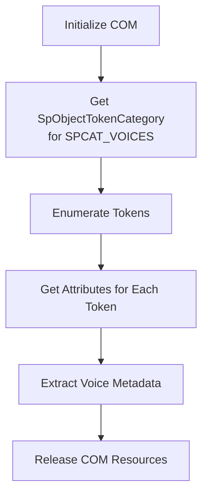
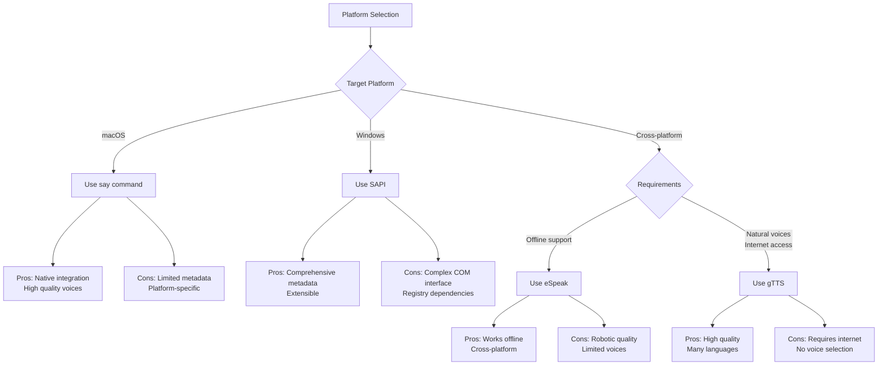

# Single-Model TTS Provider Voice Metadata

This document investigates how a Rust program can determine the voices metadata for popular TTS providers often found on host computers. It focuses on "single model" TTS CLIs that use just one TTS model (as opposed to multi-model systems like Piper or Coqui).

## Overview

Extracting **voice metadata** from Text-to-Speech (TTS) platforms is a crucial capability for applications that need to provide users with voice selection options or programmatically control TTS behavior. Voice metadata typically includes **voice name**, **language**, **gender**, **age**, **regional variant**, **sample text**, and **synthesis quality** indicators.

This guide covers four major TTS platforms:

1. **macOS `say`** - Native macOS text-to-speech
2. **Windows SAPI** - Microsoft Speech API
3. **eSpeak/eSpeak NG** - Cross-platform open-source TTS
4. **gTTS CLI** - Google Text-to-Speech wrapper

## Challenges

Extracting **voice metadata** from Text-to-Speech (TTS) platforms is a crucial capability for applications that need to provide users with voice selection options or programmatically control TTS behavior. Voice metadata typically includes **voice name**, **language**, **gender**, **age**, **regional variant**, **sample text**, and **synthesis quality** indicators. This guide provides a comprehensive approach to extracting this information from four major TTS platforms using Rust: macOS's `say` command, Windows SAPI, eSpeak/eSpeak NG, and the gTTS CLI.

The challenges in voice metadata extraction vary significantly between platforms:

- **CLI-based solutions** (say, eSpeak) require parsing output that may change between versions
- **COM-based solutions** (SAPI) demand proper interface initialization and memory management
- **Web-based APIs** (gTTS) need network handling and potential rate limiting considerations
- **Cross-platform compatibility** requires abstracting platform-specific implementations

## 1. macOS say Command Metadata Extraction

The `say` command on macOS provides a straightforward method to list available voices and their metadata through the `-v '?'` option.

### 1.1 Command Line Interface

```bash
say -v '?'
```

This command outputs a list of available voices with their **language codes**, **sample sentences**, and sometimes additional metadata. The output format is generally consistent across macOS versions but may change slightly with updates 【turn0search1】【turn0search3】.

Example output (note variable-width name column, may contain spaces/parentheses):

```
Albert              en_US    # Hello! My name is Albert.
Alice               it_IT    # Ciao! Mi chiamo Alice.
Allison (Enhanced)  en_US    # Hello! My name is Allison.
Aman (English (India)) en_IN    # Hello! My name is Aman.
Amélie              fr_CA    # Bonjour! Je m'appelle Amélie.
Bad News            en_US    # Hello! My name is Bad News.
```

### 1.2 Rust Implementation Approach

To extract voice metadata from the `say` command in Rust:

1. **Execute the command** using `std::process::Command`
2. **Parse the fixed-width format** - the locale code always appears before `#`
3. **Handle multi-word names** - voice names can contain spaces and parentheses
4. **Store in a structured format** (e.g., a custom struct)

```rust
use std::process::Command;

#[derive(Debug, Clone)]
pub struct SayVoice {
    pub name: String,
    pub locale: String,
    pub sample_text: String,
}

/// Extracts voice metadata from macOS `say -v '?'` command output.
///
/// The output format is: `<name><whitespace><locale><whitespace># <sample_text>`
/// where the name field has variable width and may contain spaces/parentheses.
pub fn get_say_voices() -> Result<Vec<SayVoice>, std::io::Error> {
    let output = Command::new("say")
        .arg("-v")
        .arg("?")
        .output()?;

    if !output.status.success() {
        return Err(std::io::Error::new(
            std::io::ErrorKind::Other,
            format!("say command failed with status: {}", output.status),
        ));
    }

    let stdout = String::from_utf8_lossy(&output.stdout);
    let voices = stdout
        .lines()
        .filter_map(parse_say_line)
        .collect();

    Ok(voices)
}

/// Parses a single line from `say -v '?'` output.
///
/// Format: `<name><whitespace><locale><whitespace># <sample_text>`
/// Example: `Allison (Enhanced)  en_US    # Hello! My name is Allison.`
fn parse_say_line(line: &str) -> Option<SayVoice> {
    // Find the `# ` marker that separates metadata from sample text
    let hash_pos = line.find(" # ")?;
    let (metadata, sample_with_marker) = line.split_at(hash_pos);
    let sample_text = sample_with_marker.trim_start_matches(" # ").to_string();

    // The locale is the last whitespace-separated token before the hash
    // Work backwards from the metadata to find it
    let metadata = metadata.trim_end();
    let last_space = metadata.rfind(char::is_whitespace)?;
    let locale = metadata[last_space..].trim().to_string();
    let name = metadata[..last_space].trim().to_string();

    if name.is_empty() || locale.is_empty() {
        return None;
    }

    Some(SayVoice {
        name,
        locale,
        sample_text,
    })
}

#[cfg(test)]
mod tests {
    use super::*;

    #[test]
    fn test_parse_simple_name() {
        let line = "Albert              en_US    # Hello! My name is Albert.";
        let voice = parse_say_line(line).unwrap();
        assert_eq!(voice.name, "Albert");
        assert_eq!(voice.locale, "en_US");
        assert_eq!(voice.sample_text, "Hello! My name is Albert.");
    }

    #[test]
    fn test_parse_name_with_parentheses() {
        let line = "Allison (Enhanced)  en_US    # Hello! My name is Allison.";
        let voice = parse_say_line(line).unwrap();
        assert_eq!(voice.name, "Allison (Enhanced)");
        assert_eq!(voice.locale, "en_US");
    }

    #[test]
    fn test_parse_name_with_spaces() {
        let line = "Bad News            en_US    # Hello! My name is Bad News.";
        let voice = parse_say_line(line).unwrap();
        assert_eq!(voice.name, "Bad News");
        assert_eq!(voice.locale, "en_US");
    }

    #[test]
    fn test_parse_nested_parentheses() {
        let line = "Aman (English (India)) en_IN    # Hello! My name is Aman.";
        let voice = parse_say_line(line).unwrap();
        assert_eq!(voice.name, "Aman (English (India))");
        assert_eq!(voice.locale, "en_IN");
    }
}
```

### 1.3 Metadata Available from say Command

| Metadata Field | Description | Example Values |
| :--- | :--- | :--- |
| **Voice Name** | Identifier for the voice | Albert, Allison (Enhanced), Bad News |
| **Locale Code** | Language and region | en_US, it_IT, fr_CA |
| **Sample Text** | Demonstration sentence for the voice | "This is what Alex sounds like" |
| **Gender** | Not directly provided | Can be inferred from name (e.g., "Jill" → female) |
| **Age** | Not directly provided | Can be inferred from name (e.g., "Junior" → child) |

### 1.4 Limitations and Considerations

- **Limited metadata**: The `say` command provides minimal voice information beyond name, language, and sample text
- **Version differences**: macOS updates may add/remove voices or change output format
- **Voice installation**: Additional voices can be installed via System Preferences > Accessibility > Spoken Content 【turn0search4】, but these aren't always reflected in the CLI output
- **No programmatic voice modification**: The `say` command doesn't provide direct access to pitch, rate, or volume adjustments through the listing interface

## 2. Windows SAPI Metadata Extraction

Microsoft Speech API (SAPI) provides a comprehensive COM-based interface for accessing TTS voices and their metadata on Windows platforms.

### 2.1 Registry-Based Enumeration

SAPI stores voice information in the Windows Registry under:

- `HKEY_LOCAL_MACHINE\SOFTWARE\Microsoft\Speech\Voices\Tokens` for system-wide voices
- `HKEY_CURRENT_USER\SOFTWARE\Microsoft\Speech\Voices\Tokens` for user-specific voices 【turn0search5】【turn0search7】

However, some voices (especially third-party ones) may be registered as **token enumerators** that dynamically generate voice lists when queried 【turn0search8】.

### 2.2 COM Interface Approach

The proper method for enumerating SAPI voices is through COM interfaces:



#### Rust Implementation with windows-rs Crate

```rust
use windows::core::{PCWSTR, PWSTR};
use windows::Win32::Media::Speech::{
    ISpObjectToken, ISpObjectTokenCategory, SpObjectTokenCategory, SPCAT_VOICES,
};
use windows::Win32::System::Com::{
    CoCreateInstance, CoInitializeEx, CoUninitialize, CLSCTX_ALL, COINIT_MULTITHREADED,
};

#[derive(Debug, Clone)]
pub struct SapiVoice {
    pub name: String,
    pub id: String,
    pub language: Option<String>,
    pub gender: Option<String>,
    pub age: Option<String>,
    pub vendor: Option<String>,
}

/// Enumerates SAPI voices using COM interfaces.
///
/// ## Safety
///
/// This function initializes COM and must be called from a thread that
/// hasn't already initialized COM with incompatible flags.
pub fn get_sapi_voices() -> windows::core::Result<Vec<SapiVoice>> {
    unsafe {
        // Initialize COM library (RAII pattern would be better in production)
        CoInitializeEx(None, COINIT_MULTITHREADED)?;

        let result = enumerate_voices_inner();

        // Always uninitialize COM
        CoUninitialize();

        result
    }
}

unsafe fn enumerate_voices_inner() -> windows::core::Result<Vec<SapiVoice>> {
    // Create the token category for voices
    let category: ISpObjectTokenCategory =
        CoCreateInstance(&SpObjectTokenCategory, None, CLSCTX_ALL)?;

    // Set to the voices category
    category.SetId(SPCAT_VOICES, false)?;

    // Get the token enumerator
    let enum_tokens = category.EnumTokens(PCWSTR::null(), PCWSTR::null())?;

    let mut voices = Vec::new();
    let count = enum_tokens.GetCount()?;

    for i in 0..count {
        if let Ok(token) = enum_tokens.Item(i) {
            if let Some(voice) = extract_voice_metadata(&token) {
                voices.push(voice);
            }
        }
    }

    Ok(voices)
}

unsafe fn extract_voice_metadata(token: &ISpObjectToken) -> Option<SapiVoice> {
    // Get the token ID (unique identifier)
    let id = {
        let mut id_ptr = PWSTR::null();
        token.GetId(&mut id_ptr).ok()?;
        let id = id_ptr.to_string().ok()?;
        windows::Win32::System::Com::CoTaskMemFree(Some(id_ptr.as_ptr() as *const _));
        id
    };

    // Get the display name
    let name = get_token_string_value(token, "")?;

    // Get attributes from the Attributes subkey
    let language = get_token_attribute(token, "Language");
    let gender = get_token_attribute(token, "Gender");
    let age = get_token_attribute(token, "Age");
    let vendor = get_token_attribute(token, "Vendor");

    Some(SapiVoice {
        name,
        id,
        language,
        gender,
        age,
        vendor,
    })
}

unsafe fn get_token_string_value(token: &ISpObjectToken, value_name: &str) -> Option<String> {
    let wide_name: Vec<u16> = value_name.encode_utf16().chain(std::iter::once(0)).collect();
    let mut result_ptr = PWSTR::null();

    token
        .GetStringValue(PCWSTR::from_raw(wide_name.as_ptr()), &mut result_ptr)
        .ok()?;

    let result = result_ptr.to_string().ok()?;
    windows::Win32::System::Com::CoTaskMemFree(Some(result_ptr.as_ptr() as *const _));
    Some(result)
}

unsafe fn get_token_attribute(token: &ISpObjectToken, attr_name: &str) -> Option<String> {
    // Attributes are stored under the "Attributes" subkey
    let attr_path = format!("Attributes\\{}", attr_name);
    let wide_path: Vec<u16> = attr_path.encode_utf16().chain(std::iter::once(0)).collect();
    let mut result_ptr = PWSTR::null();

    // OpenKey to Attributes, then GetStringValue, or use full path
    // Simplified: attempt direct attribute read
    if token
        .GetStringValue(PCWSTR::from_raw(wide_path.as_ptr()), &mut result_ptr)
        .is_ok()
    {
        let result = result_ptr.to_string().ok()?;
        windows::Win32::System::Com::CoTaskMemFree(Some(result_ptr.as_ptr() as *const _));
        return Some(result);
    }

    None
}
```

> **Note**: The SAPI COM interface is complex. In production, consider using the `windows` crate's
> RAII wrappers or a dedicated SAPI wrapper crate. The code above demonstrates the general pattern
> but may need adjustment based on the exact `windows-rs` version.

### 2.3 Metadata Available from SAPI

| Metadata Field | Registry Key | Description | Example Values |
| :--- | :--- | :--- | :--- |
| **Voice Name** | (Default) | Display name for the voice | "Microsoft David Desktop" |
| **Voice ID** | CLSID | Unique identifier for the voice | "{8021D50E-D93C-4075-8504-FC4E124D64E9}" |
| **Language** | Language | IETF language tag | "409" (English - US), "809" (English - UK) |
| **Gender** | Gender | Voice gender | "Male", "Female", "Neutral" |
| **Age** | Age | Voice age group | "Adult", "Child", "Senior" |
| **Vendor** | Vendor | Voice provider | "Microsoft", "Cepstral" |
| **Audio Format** | Format | Preferred audio format | "22kHz 16Bit Mono" |

### 2.4 Handling Third-Party Voices

Some third-party voices (like the NaturalVoiceSAPIAdapter) register themselves as **token enumerators** rather than as static registry entries 【turn0search8】. For these voices:

1. Check `HKEY_LOCAL_MACHINE\SOFTWARE\Microsoft\Speech\Voices\TokenEnums` for enumerator registrations
2. Use the enumerator's COM interface to dynamically generate voice lists
3. Note that these voices may not appear in the standard registry locations

```rust
// Check for token enumerators that dynamically provide voices
fn check_token_enumerators() -> Result<Vec<String>, String> {
    // Implementation would read TokenEnums registry key
    // and attempt to create enumerator objects
    Ok(Vec::new())
}
```

## 3. eSpeak/eSpeak NG Metadata Extraction

eSpeak and its newer fork eSpeak NG provide comprehensive voice metadata through both command-line tools and programming interfaces.

### 3.1 Command Line Enumeration

The `espeak --voices` command lists all available voices with their metadata in a tabular format:

```bash
espeak --voices
```

Example output (fixed-width columns):

```
Pty Language       Age/Gender VoiceName          File                 Other Languages
 5  af              --/M      Afrikaans          gmw/af
 5  en              --/M      English            gmw/en               (en-gb 2)
 5  en-gb           --/M      English_(Great_Britain) gmw/en-GB            (en 2)
 5  en-us           --/M      English_(America)  gmw/en-US            (en-r 3)(en 5)
 5  cmn             --/M      Chinese_(Mandarin,_latin_as_English) sit/cmn              (zh-cmn 5)(zh 5)
```

### 3.2 Rust Implementation Using CLI

```rust
use std::process::Command;

#[derive(Debug, Clone, PartialEq, Eq)]
pub enum Gender {
    Male,
    Female,
    Unknown,
}

#[derive(Debug, Clone)]
pub struct EspeakVoice {
    pub priority: u8,
    pub language: String,
    pub age: Option<u8>,
    pub gender: Gender,
    pub name: String,
    pub file: String,
    pub other_languages: Vec<String>,
}

/// Extracts voice metadata from `espeak --voices` or `espeak-ng --voices`.
///
/// Tries `espeak-ng` first (the actively maintained fork), falls back to `espeak`.
pub fn get_espeak_voices() -> Result<Vec<EspeakVoice>, std::io::Error> {
    // Try espeak-ng first, fall back to espeak
    let output = Command::new("espeak-ng")
        .arg("--voices")
        .output()
        .or_else(|_| Command::new("espeak").arg("--voices").output())?;

    if !output.status.success() {
        return Err(std::io::Error::new(
            std::io::ErrorKind::Other,
            format!("espeak command failed with status: {}", output.status),
        ));
    }

    let stdout = String::from_utf8_lossy(&output.stdout);
    let voices = stdout
        .lines()
        .skip(1) // Skip header line
        .filter_map(parse_espeak_line)
        .collect();

    Ok(voices)
}

/// Parses a single line from `espeak --voices` output.
///
/// Format (fixed-width columns):
/// `Pty Language       Age/Gender VoiceName          File                 Other Languages`
/// ` 5  en-us           --/M      English_(America)  gmw/en-US            (en-r 3)(en 5)`
fn parse_espeak_line(line: &str) -> Option<EspeakVoice> {
    // The output is whitespace-delimited but voice names can contain underscores
    // Parse by splitting on whitespace, but the last field may be empty or multi-part
    let parts: Vec<&str> = line.split_whitespace().collect();

    if parts.len() < 5 {
        return None;
    }

    let priority = parts[0].parse::<u8>().ok()?;
    let language = parts[1].to_string();

    // Age/Gender field format: "--/M", "20/F", etc.
    let (age, gender) = parse_age_gender(parts[2]);

    let name = parts[3].replace('_', " "); // Underscores represent spaces
    let file = parts[4].to_string();

    // Remaining parts are other languages like "(en-r 3)(en 5)"
    let other_languages = if parts.len() > 5 {
        parse_other_languages(&parts[5..].join(" "))
    } else {
        Vec::new()
    };

    Some(EspeakVoice {
        priority,
        language,
        age,
        gender,
        name,
        file,
        other_languages,
    })
}

/// Parses the Age/Gender field (e.g., "--/M", "20/F", "--/--").
fn parse_age_gender(field: &str) -> (Option<u8>, Gender) {
    let parts: Vec<&str> = field.split('/').collect();
    if parts.len() != 2 {
        return (None, Gender::Unknown);
    }

    let age = parts[0].parse::<u8>().ok();
    let gender = match parts[1] {
        "M" => Gender::Male,
        "F" => Gender::Female,
        _ => Gender::Unknown,
    };

    (age, gender)
}

/// Parses the other languages field (e.g., "(en-r 3)(en 5)").
fn parse_other_languages(field: &str) -> Vec<String> {
    field
        .split(')')
        .filter_map(|s| {
            let s = s.trim_start_matches('(').trim();
            if s.is_empty() {
                None
            } else {
                // Extract just the language code (first word)
                Some(s.split_whitespace().next()?.to_string())
            }
        })
        .collect()
}

#[cfg(test)]
mod tests {
    use super::*;

    #[test]
    fn test_parse_simple_voice() {
        let line = " 5  af              --/M      Afrikaans          gmw/af";
        let voice = parse_espeak_line(line).unwrap();
        assert_eq!(voice.priority, 5);
        assert_eq!(voice.language, "af");
        assert_eq!(voice.gender, Gender::Male);
        assert_eq!(voice.name, "Afrikaans");
        assert_eq!(voice.file, "gmw/af");
        assert!(voice.other_languages.is_empty());
    }

    #[test]
    fn test_parse_voice_with_other_languages() {
        let line = " 5  en-us           --/M      English_(America)  gmw/en-US            (en-r 3)(en 5)";
        let voice = parse_espeak_line(line).unwrap();
        assert_eq!(voice.language, "en-us");
        assert_eq!(voice.name, "English (America)");
        assert_eq!(voice.other_languages, vec!["en-r", "en"]);
    }

    #[test]
    fn test_parse_age_gender() {
        assert_eq!(parse_age_gender("--/M"), (None, Gender::Male));
        assert_eq!(parse_age_gender("20/F"), (Some(20), Gender::Female));
        assert_eq!(parse_age_gender("--/--"), (None, Gender::Unknown));
    }
}
```

### 3.3 Using Rust Wrappers

Several Rust crates provide bindings to eSpeak's C API:

- **espeakng** - Direct wrapper around eSpeak NG C library 【turn0search20】
- **espeaker** - Higher-level abstraction for eSpeak control 【turn0search21】
- **espeak-rs** - Another wrapper with different API design 【turn0search23】

Example using `espeakng` crate:

```rust
use espeakng::*;

fn get_espeak_voices_api() -> Result<Vec<VoiceInfo>, String> {
    let mut speaker = Speaker::new()
        .map_err(|e| format!("Failed to create eSpeak speaker: {}", e))?;

    // Get list of voices
    let voices = speaker.list_voices()
        .map_err(|e| format!("Failed to list voices: {}", e))?;

    Ok(voices)
}
```

### 3.4 Metadata Available from eSpeak

| Metadata Field | Source | Description | Example Values |
| :--- | :--- | :--- | :--- |
| **Priority** | CLI output | Voice selection priority (higher = preferred) | 5, 4, 3 |
| **Language Code** | CLI output | BCP 47 language tag | "en", "en-us", "af" |
| **Age** | CLI output | Voice age (often unset) | 20, -- (unset) |
| **Gender** | CLI output | Voice gender | "M" (Male), "F" (Female), "--" (unset) |
| **Voice Name** | CLI output | Human-readable name (underscores = spaces) | "English_(America)" → "English (America)" |
| **File Path** | CLI output | Voice definition file path | "gmw/af", "gmw/en-US" |
| **Other Languages** | CLI output | Alternative language codes with priority | "(en-r 3)(en 5)" |
| **Phoneme Set** | Voice file | Phoneme set used by voice | "en", "de", mbrola variants |
| **Variants** | Voice modifier | Append to voice name for variations | "+m1", "+f2", "+croak" |

### 3.5 Voice Customization and Variants

eSpeak supports **voice modifiers** that can be appended to the base voice name to create variations:

```rust
// Voice variants syntax
let voice_variants = vec![
    "+m1", "+m2", "+m3", "+m4", "+m5", "+m6", "+m7", // Male variants
    "+f1", "+f2", "+f3", "+f4",                     // Female variants
    "+croak", "+whisper",                          // Effect variants
];

// Usage: espeak -v en+f3 "Hello world"
```

## 4. gTTS CLI Metadata Extraction

The gTTS (Google Text-to-Speech) CLI provides access to Google's online TTS service and supports a wide range of languages.

### 4.1 Language Enumeration

The gTTS CLI provides a simple command to list all available languages:

```bash
gtts-cli --all
```

This outputs a plain text list with one language per line in `code: Name` format:

```
  af: Afrikaans
  am: Amharic
  ar: Arabic
  bg: Bulgarian
  bn: Bengali
  ca: Catalan
  cs: Czech
  da: Danish
  de: German
  el: Greek
  en: English
  es: Spanish
  fr-CA: French (Canada)
  fr: French
  hi: Hindi
  it: Italian
  ja: Japanese
  ko: Korean
  nl: Dutch
  pt-BR: Portuguese (Brazil)
  pt: Portuguese
  ru: Russian
  zh-CN: Chinese (Simplified)
  zh-TW: Chinese (Traditional)
```

### 4.2 Rust Implementation

```rust
use std::process::Command;

#[derive(Debug, Clone)]
pub struct GttsLanguage {
    pub code: String,
    pub name: String,
}

/// Extracts available languages from `gtts-cli --all`.
///
/// gTTS (Google Text-to-Speech) provides access to Google's TTS service.
/// Note: Requires network connectivity and the `gtts-cli` Python package.
pub fn get_gtts_languages() -> Result<Vec<GttsLanguage>, std::io::Error> {
    let output = Command::new("gtts-cli").arg("--all").output()?;

    if !output.status.success() {
        return Err(std::io::Error::new(
            std::io::ErrorKind::Other,
            format!("gtts-cli command failed with status: {}", output.status),
        ));
    }

    let stdout = String::from_utf8_lossy(&output.stdout);
    let languages = stdout
        .lines()
        .filter_map(parse_gtts_line)
        .collect();

    Ok(languages)
}

/// Parses a single line from `gtts-cli --all` output.
///
/// Format: `  code: Name` (leading whitespace, colon separator)
/// Example: `  fr-CA: French (Canada)`
fn parse_gtts_line(line: &str) -> Option<GttsLanguage> {
    let line = line.trim();
    if line.is_empty() {
        return None;
    }

    let (code, name) = line.split_once(": ")?;
    Some(GttsLanguage {
        code: code.to_string(),
        name: name.to_string(),
    })
}

#[cfg(test)]
mod tests {
    use super::*;

    #[test]
    fn test_parse_simple_language() {
        let line = "  en: English";
        let lang = parse_gtts_line(line).unwrap();
        assert_eq!(lang.code, "en");
        assert_eq!(lang.name, "English");
    }

    #[test]
    fn test_parse_regional_variant() {
        let line = "  fr-CA: French (Canada)";
        let lang = parse_gtts_line(line).unwrap();
        assert_eq!(lang.code, "fr-CA");
        assert_eq!(lang.name, "French (Canada)");
    }

    #[test]
    fn test_parse_empty_line() {
        assert!(parse_gtts_line("").is_none());
        assert!(parse_gtts_line("   ").is_none());
    }
}
```

### 4.3 Metadata Available from gTTS

| Metadata Field | Source | Description | Example Values |
| :--- | :--- | :--- | :--- |
| **Language Code** | CLI output | IETF language tag | "en", "en-us", "zh-CN", "pt-BR" |
| **Language Name** | CLI output | Human-readable language name | "English", "Portuguese (Brazil)" |
| **Voice Quality** | API | Not directly accessible | Typically good quality |
| **Gender** | API | Not directly selectable | Usually neutral/mixed |
| **Speed** | API | Adjustable via parameters | Can be modified in TTS request |
| **Accent** | API | Regional variants | "en-au" (Australian English) |

### 4.4 Limitations and Considerations

- **Network dependency**: Requires internet connection to Google's TTS service
- **Rate limiting**: Google may impose rate limits on API usage
- **No voice selection**: Google's API doesn't allow voice selection within languages
- **Privacy concerns**: Text is sent to Google's servers for processing
- **Limited metadata**: Only language codes and names are provided, no voice-specific metadata

## 5. Unified Implementation Strategy

To create a cross-platform TTS voice enumeration system in Rust, we can implement a **trait-based abstraction** that unifies the different platform-specific approaches.

### 5.1 Trait Definition

```rust
use async_trait::async_trait;

#[derive(Debug, Clone)]
pub struct VoiceMetadata {
    pub id: String,
    pub name: String,
    pub language: String,
    pub gender: Option<String>,
    pub age: Option<String>,
    pub description: Option<String>,
    pub sample_text: Option<String>,
}

#[async_trait]
pub trait VoiceEnumerator {
    async fn enumerate_voices(&self) -> Result<Vec<VoiceMetadata>, String>;
}
```

### 5.2 Platform-Specific Implementations

```rust
use std::process::Command;

// macOS implementation
pub struct SayEnumerator;

#[async_trait]
impl VoiceEnumerator for SayEnumerator {
    async fn enumerate_voices(&self) -> Result<Vec<VoiceMetadata>, String> {
        let say_voices = get_say_voices()
            .map_err(|e| format!("Failed to get macOS voices: {}", e))?;

        Ok(say_voices
            .into_iter()
            .map(|v| VoiceMetadata {
                id: v.name.clone(),
                name: v.name,
                language: v.locale,
                gender: None,
                age: None,
                description: None,
                sample_text: Some(v.sample_text),
            })
            .collect())
    }
}

// Windows SAPI implementation
#[cfg(windows)]
pub struct SapiEnumerator;

#[cfg(windows)]
#[async_trait]
impl VoiceEnumerator for SapiEnumerator {
    async fn enumerate_voices(&self) -> Result<Vec<VoiceMetadata>, String> {
        let sapi_voices = get_sapi_voices()
            .map_err(|e| format!("Failed to get SAPI voices: {}", e))?;

        Ok(sapi_voices
            .into_iter()
            .map(|v| {
                let description = v.vendor.as_ref().map(|vendor| {
                    format!(
                        "{} voice by {}",
                        v.gender.as_deref().unwrap_or("Unknown"),
                        vendor
                    )
                });
                VoiceMetadata {
                    id: v.id,
                    name: v.name,
                    language: v.language.unwrap_or_default(),
                    gender: v.gender,
                    age: v.age,
                    description,
                    sample_text: None,
                }
            })
            .collect())
    }
}

// eSpeak implementation (cross-platform)
pub struct EspeakEnumerator;

#[async_trait]
impl VoiceEnumerator for EspeakEnumerator {
    async fn enumerate_voices(&self) -> Result<Vec<VoiceMetadata>, String> {
        let espeak_voices = get_espeak_voices()
            .map_err(|e| format!("Failed to get eSpeak voices: {}", e))?;

        Ok(espeak_voices
            .into_iter()
            .map(|v| {
                let gender_str = match v.gender {
                    Gender::Male => Some("Male".to_string()),
                    Gender::Female => Some("Female".to_string()),
                    Gender::Unknown => None,
                };
                VoiceMetadata {
                    id: v.language.clone(), // Use language code as ID
                    name: v.name,
                    language: v.language,
                    gender: gender_str,
                    age: v.age.map(|a| a.to_string()),
                    description: Some(format!("Priority {}, file {}", v.priority, v.file)),
                    sample_text: None,
                }
            })
            .collect())
    }
}

// gTTS implementation (cross-platform, requires network)
pub struct GttsEnumerator;

#[async_trait]
impl VoiceEnumerator for GttsEnumerator {
    async fn enumerate_voices(&self) -> Result<Vec<VoiceMetadata>, String> {
        let gtts_languages = get_gtts_languages()
            .map_err(|e| format!("Failed to get gTTS languages: {}", e))?;

        Ok(gtts_languages
            .into_iter()
            .map(|l| VoiceMetadata {
                id: l.code.clone(),
                name: l.name.clone(),
                language: l.code,
                gender: None,
                age: None,
                description: Some(format!("Google TTS: {}", l.name)),
                sample_text: None,
            })
            .collect())
    }
}
```

### 5.3 Cross-Platform Voice Detection

```rust
use std::process::Command;

/// Returns enumerators for all available TTS backends on the current platform.
///
/// Platform-native backends (macOS say, Windows SAPI) are conditionally compiled.
/// Cross-platform backends (eSpeak, gTTS) are checked at runtime.
fn get_available_enumerators() -> Vec<Box<dyn VoiceEnumerator + Send + Sync>> {
    let mut enumerators: Vec<Box<dyn VoiceEnumerator + Send + Sync>> = Vec::new();

    // macOS: always include say command
    #[cfg(target_os = "macos")]
    {
        enumerators.push(Box::new(SayEnumerator));
    }

    // Windows: always include SAPI
    #[cfg(windows)]
    {
        enumerators.push(Box::new(SapiEnumerator));
    }

    // Cross-platform: check if eSpeak is installed
    if is_command_available("espeak-ng") || is_command_available("espeak") {
        enumerators.push(Box::new(EspeakEnumerator));
    }

    // Cross-platform: check if gTTS CLI is installed
    if is_command_available("gtts-cli") {
        enumerators.push(Box::new(GttsEnumerator));
    }

    enumerators
}

/// Checks if a command is available in PATH.
fn is_command_available(cmd: &str) -> bool {
    Command::new(cmd)
        .arg("--help")
        .stdout(std::process::Stdio::null())
        .stderr(std::process::Stdio::null())
        .status()
        .is_ok()
}
```

### 5.4 Unified Voice Listing

```rust
pub async fn get_all_tts_voices() -> Result<Vec<VoiceMetadata>, String> {
    let enumerators = get_available_enumerators();
    let mut all_voices = Vec::new();

    for enumerator in enumerators {
        match enumerator.enumerate_voices().await {
            Ok(voices) => all_voices.extend(voices),
            Err(e) => eprintln!("Failed to enumerate voices: {}", e),
        }
    }

    Ok(all_voices)
}
```

## 6. Comparative Analysis and Recommendations

### 6.1 Metadata Comparison Table

| Platform | Voice Name | Language | Gender | Age | Sample Text | Voice Quality | Voice Selection |
| :--- | :--- | :--- | :--- | :--- | :--- | :--- | :--- |
| **macOS say** | ✅ | ✅ | ❌ | ❌ | ✅ | High | Limited |
| **Windows SAPI** | ✅ | ✅ | ✅ | ✅ | ❌ | Variable | Extensive |
| **eSpeak** | ✅ | ✅ | ✅ | ✅ | ❌ | Robotic | Moderate |
| **gTTS CLI** | ❌ | ✅ | ❌ | ❌ | ❌ | High | None |

### 6.2 Platform-Specific Recommendations



### 6.3 Implementation Challenges and Solutions

| Challenge | Platform | Solution |
| :--- | :--- | :--- |
| **Changing output formats** | CLI tools (say, eSpeak) | Implement flexible parsing with regex and update tests when versions change |
| **COM initialization** | Windows SAPI | Use RAII patterns for COM resource management and handle errors gracefully |
| **Network dependencies** | gTTS CLI | Implement fallback strategies, caching, and handle network errors |
| **Voice installation detection** | All platforms | Provide user guidance for installing voices and implement detection heuristics |
| **Metadata inconsistencies** | Cross-platform | Create unified metadata model and normalize platform-specific data |

## 7. Advanced Topics and Future Considerations

### 7.1 Voice Testing and Validation

Implement functionality to test voices with sample text:

```rust
use std::process::Command;

/// Tests a voice by speaking sample text.
///
/// Uses platform-specific TTS commands. Falls back to eSpeak on unsupported platforms.
pub fn test_voice(voice_id: &str, text: &str) -> Result<(), std::io::Error> {
    #[cfg(target_os = "macos")]
    {
        return Command::new("say")
            .args(["-v", voice_id, text])
            .status()
            .map(|_| ());
    }

    #[cfg(windows)]
    {
        // Windows: Use PowerShell with SAPI
        return Command::new("powershell")
            .args([
                "-Command",
                &format!(
                    "Add-Type -AssemblyName System.Speech; \
                     $synth = New-Object System.Speech.Synthesis.SpeechSynthesizer; \
                     $synth.SelectVoice('{}'); \
                     $synth.Speak('{}')",
                    voice_id,
                    text.replace('\'', "''") // Escape single quotes
                ),
            ])
            .status()
            .map(|_| ());
    }

    #[cfg(not(any(target_os = "macos", windows)))]
    {
        // Fallback: use eSpeak
        Command::new("espeak-ng")
            .args(["-v", voice_id, text])
            .status()
            .or_else(|_| Command::new("espeak").args(["-v", voice_id, text]).status())
            .map(|_| ())
    }
}
```

### 7.2 Dynamic Voice Loading

For applications that need to detect voice changes during runtime:

```rust
pub struct VoiceWatcher {
    enumerators: Vec<Box<dyn VoiceEnumerator>>,
    last_voice_count: usize,
}

impl VoiceWatcher {
    pub async fn check_for_changes(&mut self) -> bool {
        let current_count = self.get_total_voice_count().await;
        let changed = current_count != self.last_voice_count;
        self.last_voice_count = current_count;
        changed
    }
}
```

### 7.3 Caching and Performance Optimization

Implement caching for voice metadata to avoid repeated expensive operations:

```rust
use std::time::{Duration, Instant};

/// Wraps a VoiceEnumerator with time-based caching.
pub struct CachedVoiceEnumerator<E: VoiceEnumerator> {
    inner: E,
    cache: Option<CachedVoices>,
    ttl: Duration,
}

struct CachedVoices {
    voices: Vec<VoiceMetadata>,
    cached_at: Instant,
}

impl<E: VoiceEnumerator> CachedVoiceEnumerator<E> {
    /// Creates a new cached enumerator with the given TTL (time-to-live).
    pub fn new(inner: E, ttl: Duration) -> Self {
        Self {
            inner,
            cache: None,
            ttl,
        }
    }

    /// Returns cached voices if still valid, otherwise refreshes the cache.
    pub async fn get_voices(&mut self) -> Result<Vec<VoiceMetadata>, String> {
        // Check if cache is still valid
        if let Some(ref cached) = self.cache {
            if cached.cached_at.elapsed() < self.ttl {
                return Ok(cached.voices.clone());
            }
        }

        // Cache expired or doesn't exist - refresh
        let voices = self.inner.enumerate_voices().await?;
        self.cache = Some(CachedVoices {
            voices: voices.clone(),
            cached_at: Instant::now(),
        });
        Ok(voices)
    }

    /// Forces a cache refresh on the next call to `get_voices`.
    pub fn invalidate(&mut self) {
        self.cache = None;
    }
}
```

Example usage:

```rust
// Cache voices for 1 hour
let mut cached = CachedVoiceEnumerator::new(EspeakEnumerator, Duration::from_secs(3600));

// First call fetches from the backend
let voices = cached.get_voices().await?;

// Subsequent calls within 1 hour return cached data
let voices_again = cached.get_voices().await?; // Fast, from cache
```

## Conclusion

Extracting TTS voice metadata across different platforms requires a **multi-faceted approach** that accounts for each platform's unique characteristics. The `say` command on macOS provides **simple but limited** metadata, Windows SAPI offers **comprehensive but complex** access, eSpeak delivers **detailed cross-platform** information, and gTTS CLI provides **basic language enumeration** for a high-quality cloud service.

By implementing a **trait-based abstraction** and leveraging the platform-specific techniques outlined in this guide, Rust developers can create robust applications that seamlessly integrate with the TTS capabilities of the underlying operating system. The unified approach ensures **cross-platform compatibility** while allowing access to platform-specific features when needed.

The key to successful implementation is **graceful error handling**, **caching for performance**, and **fallback mechanisms** for scenarios where specific TTS platforms are unavailable. This comprehensive approach provides a solid foundation for building sophisticated TTS-enabled applications in Rust.
