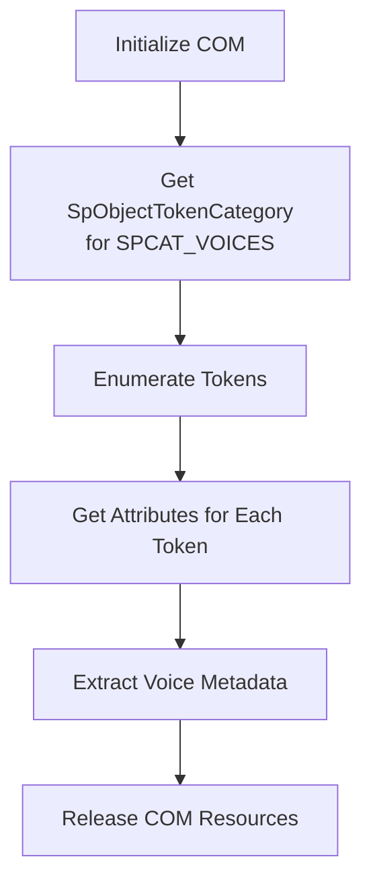
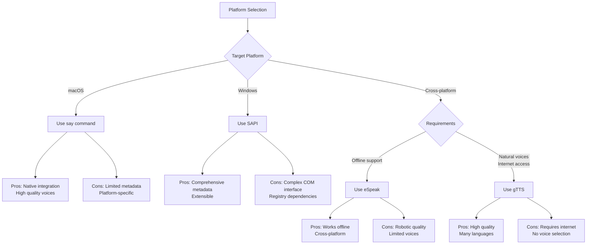

# Provider Voices

This document investigates how a Rust program can determine the voices metadata for popular TTS providers often found on host computers.

## Single Model Providers

The TTS model being used by a TTS CLI can sometimes rely on one or more models but other CLI's use just a single model. This section describes the latter category of CLI's which only use a single TTS model.


# Comprehensive Guide to Extracting TTS Voice Metadata in Rust

## Introduction to TTS Voice Metadata Extraction

Extracting **voice metadata** from Text-to-Speech (TTS) platforms is a crucial capability for applications that need to provide users with voice selection options or programmatically control TTS behavior. Voice metadata typically includes **voice name**, **language**, **gender**, **age**, **regional variant**, **sample text**, and **synthesis quality** indicators. This guide provides a comprehensive approach to extracting this information from four major TTS platforms using Rust: macOS's `say` command, Windows SAPI, eSpeak/eSpeak NG, and the gTTS CLI.

The challenges in voice metadata extraction vary significantly between platforms:

- **CLI-based solutions** (say, eSpeak) require parsing output that may change between versions
- **COM-based solutions** (SAPI) demand proper interface initialization and memory management
- **Web-based APIs** (gTTS) need network handling and potential rate limiting considerations
- **Cross-platform compatibility** requires abstracting platform-specific implementations

## 1. macOS say Command Metadata Extraction

The `say` command on macOS provides a straightforward method to list available voices and their metadata through the `-v '?'` option.

### 1.1 Command Line Interface

```bash
say -v '?'
```

This command outputs a list of available voices with their **language codes**, **sample sentences**, and sometimes additional metadata. The output format is generally consistent across macOS versions but may change slightly with updates 【turn0search1】【turn0search3】.

Example output:
```
Alex      en_US    # This is what Alex sounds like
Samantha  en_US    # This is what Samantha sounds like
Ting-Ting zh_CN    # 这是Ting-Ting的声音
```

### 1.2 Rust Implementation Approach

To extract voice metadata from the `say` command in Rust:

1. **Execute the command** using `std::process::Command`
2. **Capture and parse** the output using regex or string splitting
3. **Extract metadata fields** from each line of output
4. **Store in a structured format** (e.g., a custom struct)

```rust
use std::process::Command;
use regex::Regex;

#[derive(Debug, Clone)]
struct SayVoice {
    name: String,
    language: String,
    sample_text: String,
}

fn get_say_voices() -> Result<Vec<SayVoice>, String> {
    let output = Command::new("say")
        .arg("-v")
        .arg("?")
        .output()
        .map_err(|e| format!("Failed to execute say command: {}", e))?;

    if !output.status.success() {
        return Err(format!("say command failed with status: {}", output.status));
    }

    let stdout = String::from_utf8_lossy(&output.stdout);
    let re = Regex::new(r"^(\S+)\s+(\S+)\s+#\s+(.+)$")
        .map_err(|e| format!("Failed to compile regex: {}", e))?;

    let mut voices = Vec::new();
    for line in stdout.lines() {
        if let Some(caps) = re.captures(line) {
            voices.push(SayVoice {
                name: caps[1].to_string(),
                language: caps[2].to_string(),
                sample_text: caps[3].to_string(),
            });
        }
    }

    Ok(voices)
}
```

### 1.3 Metadata Available from say Command

| Metadata Field | Description | Example Values |
| :--- | :--- | :--- |
| **Voice Name** | Identifier for the voice | Alex, Samantha, Ting-Ting |
| **Language Code** | IETF language tag | en_US, zh_CN, ja_JP |
| **Sample Text** | Demonstration sentence for the voice | "This is what Alex sounds like" |
| **Gender** | Not directly provided | Can be inferred from name (e.g., "Jill" → female) |
| **Age** | Not directly provided | Can be inferred from name (e.g., "Junior" → child) |

### 1.4 Limitations and Considerations

- **Limited metadata**: The `say` command provides minimal voice information beyond name, language, and sample text
- **Version differences**: macOS updates may add/remove voices or change output format
- **Voice installation**: Additional voices can be installed via System Preferences > Accessibility > Spoken Content 【turn0search4】, but these aren't always reflected in the CLI output
- **No programmatic voice modification**: The `say` command doesn't provide direct access to pitch, rate, or volume adjustments through the listing interface

## 2. Windows SAPI Metadata Extraction

Microsoft Speech API (SAPI) provides a comprehensive COM-based interface for accessing TTS voices and their metadata on Windows platforms.

### 2.1 Registry-Based Enumeration

SAPI stores voice information in the Windows Registry under:

- `HKEY_LOCAL_MACHINE\SOFTWARE\Microsoft\Speech\Voices\Tokens` for system-wide voices
- `HKEY_CURRENT_USER\SOFTWARE\Microsoft\Speech\Voices\Tokens` for user-specific voices 【turn0search5】【turn0search7】

However, some voices (especially third-party ones) may be registered as **token enumerators** that dynamically generate voice lists when queried 【turn0search8】.

### 2.2 COM Interface Approach

The proper method for enumerating SAPI voices is through COM interfaces:



#### Rust Implementation with windows-rs Crate

```rust
use windows::core::*;
use windows::Win32::Media::Speech::*;
use windows::Win32::System::Com::*;

#[derive(Debug, Clone)]
struct Sapivoice {
    name: String,
    id: String,
    language: String,
    gender: String,
    age: String,
    vendor: String,
}

fn get_sapi_voices() -> Result<Vec<Sapivoice>, String> {
    unsafe {
        // Initialize COM library
        CoInitializeEx(None, COINIT_MULTITHREADED)
            .map_err(|e| format!("Failed to initialize COM: {}", e))?;

        // Get the voices category
        let category: ISpObjectTokenCategory =
            CoCreateInstance(&SpObjectTokenCategory, None, CLSCTX_ALL)
                .map_err(|e| format!("Failed to create category: {}", e))?;

        category.SetId(w!("HKEY_LOCAL_MACHINE\\SOFTWARE\\Microsoft\\Speech\\Voices"), false)
            .map_err(|e| format!("Failed to set category ID: {}", e))?;

        // Enumerate tokens
        let enum_tokens: IEnumSpObjectTokens =
            category.EnumerateTokens(None, None)
                .map_err(|e| format!("Failed to enumerate tokens: {}", e))?;

        let mut voices = Vec::new();
        let mut fetched = u32::default();
        let mut token = ISpObjectToken::default();

        while enum_tokens.Next(1, &mut token, &mut fetched).is_ok() && fetched > 0 {
            let mut name = BSTR::new();
            let mut id = BSTR::new();

            // Get token attributes
            if let Ok(attrs) = token.GetStringValue(w!("")) {
                // Parse attributes for language, gender, age, etc.
                let language = get_attribute_value(&attrs, "Language");
                let gender = get_attribute_value(&attrs, "Gender");
                let age = get_attribute_value(&attrs, "Age");
                let vendor = get_attribute_value(&attrs, "Vendor");

                voices.push(Sapivoice {
                    name: name.to_string(),
                    id: id.to_string(),
                    language,
                    gender,
                    age,
                    vendor,
                });
            }
        }

        // Uninitialize COM
        CoUninitialize();

        Ok(voices)
    }
}

fn get_attribute_value(attrs: &BSTR, name: &str) -> String {
    // Parse attribute string to extract specific value
    // Implementation depends on format of attributes string
    String::new()
}
```

### 2.3 Metadata Available from SAPI

| Metadata Field | Registry Key | Description | Example Values |
| :--- | :--- | :--- | :--- |
| **Voice Name** | (Default) | Display name for the voice | "Microsoft David Desktop" |
| **Voice ID** | CLSID | Unique identifier for the voice | "{8021D50E-D93C-4075-8504-FC4E124D64E9}" |
| **Language** | Language | IETF language tag | "409" (English - US), "809" (English - UK) |
| **Gender** | Gender | Voice gender | "Male", "Female", "Neutral" |
| **Age** | Age | Voice age group | "Adult", "Child", "Senior" |
| **Vendor** | Vendor | Voice provider | "Microsoft", "Cepstral" |
| **Audio Format** | Format | Preferred audio format | "22kHz 16Bit Mono" |

### 2.4 Handling Third-Party Voices

Some third-party voices (like the NaturalVoiceSAPIAdapter) register themselves as **token enumerators** rather than as static registry entries 【turn0search8】. For these voices:

1. Check `HKEY_LOCAL_MACHINE\SOFTWARE\Microsoft\Speech\Voices\TokenEnums` for enumerator registrations
2. Use the enumerator's COM interface to dynamically generate voice lists
3. Note that these voices may not appear in the standard registry locations

```rust
// Check for token enumerators that dynamically provide voices
fn check_token_enumerators() -> Result<Vec<String>, String> {
    // Implementation would read TokenEnums registry key
    // and attempt to create enumerator objects
    Ok(Vec::new())
}
```

## 3. eSpeak/eSpeak NG Metadata Extraction

eSpeak and its newer fork eSpeak NG provide comprehensive voice metadata through both command-line tools and programming interfaces.

### 3.1 Command Line Enumeration

The `espeak --voices` command lists all available voices with their metadata in a tabular format:

```bash
espeak --voices
```

Example output:
```
Pty Language Age/Gender VoiceName          File          Other Languages
 5  en        M  en-us               en          (en)
 5  en        F  en+f3               en          (en)
 5  af        M  af                  af
 5  de        M  de                  de
```

### 3.2 Rust Implementation Using CLI

```rust
use std::process::Command;
use regex::Regex;

#[derive(Debug, Clone)]
struct EspeakVoice {
    priority: i32,
    language: String,
    gender_age: String,
    name: String,
    file: String,
    other_languages: String,
}

fn get_espeak_voices() -> Result<Vec<EspeakVoice>, String> {
    let output = Command::new("espeak")
        .arg("--voices")
        .output()
        .map_err(|e| format!("Failed to execute espeak command: {}", e))?;

    if !output.status.success() {
        return Err(format!("espeak command failed with status: {}", output.status));
    }

    let stdout = String::from_utf8_lossy(&output.stdout);
    let re = Regex::new(r"^\s*(\d+)\s+(\S+)\s+(\S+)\s+(\S+)\s+(\S+)\s*(.*)$")
        .map_err(|e| format!("Failed to compile regex: {}", e))?;

    let mut voices = Vec::new();
    for line in stdout.lines() {
        if let Some(caps) = re.captures(line) {
            voices.push(EspeakVoice {
                priority: caps[1].parse().unwrap_or(0),
                language: caps[2].to_string(),
                gender_age: caps[3].to_string(),
                name: caps[4].to_string(),
                file: caps[5].to_string(),
                other_languages: caps[6].to_string(),
            });
        }
    }

    Ok(voices)
}
```

### 3.3 Using Rust Wrappers

Several Rust crates provide bindings to eSpeak's C API:

- **espeakng** - Direct wrapper around eSpeak NG C library 【turn0search20】
- **espeaker** - Higher-level abstraction for eSpeak control 【turn0search21】
- **espeak-rs** - Another wrapper with different API design 【turn0search23】

Example using `espeakng` crate:

```rust
use espeakng::*;

fn get_espeak_voices_api() -> Result<Vec<VoiceInfo>, String> {
    let mut speaker = Speaker::new()
        .map_err(|e| format!("Failed to create eSpeak speaker: {}", e))?;

    // Get list of voices
    let voices = speaker.list_voices()
        .map_err(|e| format!("Failed to list voices: {}", e))?;

    Ok(voices)
}
```

### 3.4 Metadata Available from eSpeak

| Metadata Field | Source | Description | Example Values |
| :--- | :--- | :--- | :--- |
| **Priority** | CLI output | Voice selection priority | 5 (high), 4 (medium), 3 (low) |
| **Language Code** | CLI output | IETF language tag | "en", "de", "af" |
| **Gender/Age** | CLI output | Gender and age group | "M" (Male), "F" (Female), "F3" (Female variant 3) |
| **Voice Name** | CLI output | Internal voice name | "en-us", "af", "de" |
| **File Path** | CLI output | Voice file location | "en", "af", "de" |
| **Other Languages** | CLI output | Languages this voice supports | "(en)" - also supports English |
| **Phoneme Set** | Voice file | Phoneme set used by voice | "en", "de", "mbrola" |
| **Variants** | Voice file | Voice variants available | "+m1", "+f2", "+croak" |

### 3.5 Voice Customization and Variants

eSpeak supports **voice modifiers** that can be appended to the base voice name to create variations:

```rust
// Voice variants syntax
let voice_variants = vec![
    "+m1", "+m2", "+m3", "+m4", "+m5", "+m6", "+m7", // Male variants
    "+f1", "+f2", "+f3", "+f4",                     // Female variants
    "+croak", "+whisper",                          // Effect variants
];

// Usage: espeak -v en+f3 "Hello world"
```

## 4. gTTS CLI Metadata Extraction

The gTTS (Google Text-to-Speech) CLI provides access to Google's online TTS service and supports a wide range of languages.

### 4.1 Language Enumeration

The gTTS CLI provides a simple command to list all available languages:

```bash
gtts-cli --all
```

This outputs a JSON-formatted list of languages with their codes and names:

```json
{
  "af": "Afrikaans",
  "sq": "Albanian",
  "ar": "Arabic",
  "hy": "Armenian",
  "ca": "Catalan",
  "zh-CN": "Chinese (Mandarin)",
  "zh-TW": "Chinese (Taiwanese)",
  "hr": "Croatian",
  "cs": "Czech",
  "da": "Danish",
  "nl": "Dutch",
  "en": "English",
  "en-au": "English (Australia)",
  "en-uk": "English (United Kingdom)",
  "en-us": "English (United States)",
  // ... many more languages
}
```

### 4.2 Rust Implementation

```rust
use std::process::Command;
use serde::Deserialize;

#[derive(Debug, Deserialize)]
struct GttsLanguage {
    code: String,
    name: String,
}

fn get_gtts_languages() -> Result<Vec<GttsLanguage>, String> {
    let output = Command::new("gtts-cli")
        .arg("--all")
        .output()
        .map_err(|e| format!("Failed to execute gtts-cli command: {}", e))?;

    if !output.status.success() {
        return Err(format!("gtts-cli command failed with status: {}", output.status));
    }

    let stdout = String::from_utf8_lossy(&output.stdout);
    let languages: std::collections::HashMap<String, String> =
        serde_json::from_str(&stdout)
            .map_err(|e| format!("Failed to parse JSON: {}", e))?;

    let mut result = Vec::new();
    for (code, name) in languages {
        result.push(GttsLanguage { code, name });
    }

    Ok(result)
}
```

### 4.3 Metadata Available from gTTS

| Metadata Field | Source | Description | Example Values |
| :--- | :--- | :--- | :--- |
| **Language Code** | CLI output | IETF language tag | "en", "en-us", "zh-CN", "pt-BR" |
| **Language Name** | CLI output | Human-readable language name | "English", "Portuguese (Brazil)" |
| **Voice Quality** | API | Not directly accessible | Typically good quality |
| **Gender** | API | Not directly selectable | Usually neutral/mixed |
| **Speed** | API | Adjustable via parameters | Can be modified in TTS request |
| **Accent** | API | Regional variants | "en-au" (Australian English) |

### 4.4 Limitations and Considerations

- **Network dependency**: Requires internet connection to Google's TTS service
- **Rate limiting**: Google may impose rate limits on API usage
- **No voice selection**: Google's API doesn't allow voice selection within languages
- **Privacy concerns**: Text is sent to Google's servers for processing
- **Limited metadata**: Only language codes and names are provided, no voice-specific metadata

## 5. Unified Implementation Strategy

To create a cross-platform TTS voice enumeration system in Rust, we can implement a **trait-based abstraction** that unifies the different platform-specific approaches.

### 5.1 Trait Definition

```rust
use async_trait::async_trait;

#[derive(Debug, Clone)]
pub struct VoiceMetadata {
    pub id: String,
    pub name: String,
    pub language: String,
    pub gender: Option<String>,
    pub age: Option<String>,
    pub description: Option<String>,
    pub sample_text: Option<String>,
}

#[async_trait]
pub trait VoiceEnumerator {
    async fn enumerate_voices(&self) -> Result<Vec<VoiceMetadata>, String>;
}
```

### 5.2 Platform-Specific Implementations

```rust
// macOS implementation
pub struct SayEnumerator;

#[async_trait]
impl VoiceEnumerator for SayEnumerator {
    async fn enumerate_voices(&self) -> Result<Vec<VoiceMetadata>, String> {
        let say_voices = get_say_voices()?; // From section 1.2

        Ok(say_voices.into_iter().map(|v| VoiceMetadata {
            id: v.name.clone(),
            name: v.name.clone(),
            language: v.language,
            gender: None,
            age: None,
            description: Some(v.sample_text),
            sample_text: Some(v.sample_text),
        }).collect())
    }
}

// Windows SAPI implementation
pub struct SapiEnumerator;

#[async_trait]
impl VoiceEnumerator for SapiEnumerator {
    async fn enumerate_voices(&self) -> Result<Vec<VoiceMetadata>, String> {
        let sapi_voices = get_sapi_voices()?; // From section 2.2

        Ok(sapi_voices.into_iter().map(|v| VoiceMetadata {
            id: v.id.clone(),
            name: v.name,
            language: v.language,
            gender: Some(v.gender),
            age: Some(v.age),
            description: Some(format!("{} voice by {}", v.gender, v.vendor)),
            sample_text: None,
        }).collect())
    }
}

// eSpeak implementation
pub struct EspeakEnumerator;

#[async_trait]
impl VoiceEnumerator for EspeakEnumerator {
    async fn enumerate_voices(&self) -> Result<Vec<VoiceMetadata>, String> {
        let espeak_voices = get_espeak_voices()?; // From section 3.2

        Ok(espeak_voices.into_iter().map(|v| {
            let (gender, age) = parse_gender_age(&v.gender_age);
            VoiceMetadata {
                id: v.name.clone(),
                name: v.name.clone(),
                language: v.language,
                gender,
                age,
                description: Some(format!("Priority {}, file {}", v.priority, v.file)),
                sample_text: None,
            }
        }).collect())
    }
}

// gTTS implementation
pub struct GttsEnumerator;

#[async_trait]
impl VoiceEnumerator for GttsEnumerator {
    async fn enumerate_voices(&self) -> Result<Vec<VoiceMetadata>, String> {
        let gtts_languages = get_gtts_languages()?; // From section 4.2

        Ok(gtts_languages.into_iter().map(|l| VoiceMetadata {
            id: l.code.clone(),
            name: l.name.clone(),
            language: l.code,
            gender: None,
            age: None,
            description: Some(format!("Google TTS language: {}", l.name)),
            sample_text: None,
        }).collect())
    }
}
```

### 5.3 Cross-Platform Voice Detection

```rust
use std::env;

fn get_available_enumerators() -> Vec<Box<dyn VoiceEnumerator>> {
    let mut enumerators = Vec::new();

    if cfg!(target_os = "macos") {
        enumerators.push(Box::new(SayEnumerator));
    }

    if cfg!(windows) {
        enumerators.push(Box::new(SapiEnumerator));
    }

    // Check if eSpeak is available
    if Command::new("espeak").arg("--help").output().is_ok() {
        enumerators.push(Box::new(EspeakEnumerator));
    }

    // Check if gTTS CLI is available
    if Command::new("gtts-cli").arg("--help").output().is_ok() {
        enumerators.push(Box::new(GttsEnumerator));
    }

    enumerators
}
```

### 5.4 Unified Voice Listing

```rust
pub async fn get_all_tts_voices() -> Result<Vec<VoiceMetadata>, String> {
    let enumerators = get_available_enumerators();
    let mut all_voices = Vec::new();

    for enumerator in enumerators {
        match enumerator.enumerate_voices().await {
            Ok(voices) => all_voices.extend(voices),
            Err(e) => eprintln!("Failed to enumerate voices: {}", e),
        }
    }

    Ok(all_voices)
}
```

## 6. Comparative Analysis and Recommendations

### 6.1 Metadata Comparison Table

| Platform | Voice Name | Language | Gender | Age | Sample Text | Voice Quality | Voice Selection |
| :--- | :--- | :--- | :--- | :--- | :--- | :--- | :--- |
| **macOS say** | ✅ | ✅ | ❌ | ❌ | ✅ | High | Limited |
| **Windows SAPI** | ✅ | ✅ | ✅ | ✅ | ❌ | Variable | Extensive |
| **eSpeak** | ✅ | ✅ | ✅ | ✅ | ❌ | Robotic | Moderate |
| **gTTS CLI** | ❌ | ✅ | ❌ | ❌ | ❌ | High | None |

### 6.2 Platform-Specific Recommendations



### 6.3 Implementation Challenges and Solutions

| Challenge | Platform | Solution |
| :--- | :--- | :--- |
| **Changing output formats** | CLI tools (say, eSpeak) | Implement flexible parsing with regex and update tests when versions change |
| **COM initialization** | Windows SAPI | Use RAII patterns for COM resource management and handle errors gracefully |
| **Network dependencies** | gTTS CLI | Implement fallback strategies, caching, and handle network errors |
| **Voice installation detection** | All platforms | Provide user guidance for installing voices and implement detection heuristics |
| **Metadata inconsistencies** | Cross-platform | Create unified metadata model and normalize platform-specific data |

## 7. Advanced Topics and Future Considerations

### 7.1 Voice Testing and Validation

Implement functionality to test voices with sample text:

```rust
pub async fn test_voice(voice_id: &str, text: &str) -> Result<(), String> {
    match cfg!(target_os) {
        "macos" => {
            Command::new("say")
                .args(["-v", voice_id, text])
                .status()
                .map_err(|e| format!("Failed to test voice: {}", e))?;
        }
        "windows" => {
            // Implement SAPI voice testing
        }
        _ => {
            // Use eSpeak or other cross-platform solutions
        }
    }
    Ok(())
}
```

### 7.2 Dynamic Voice Loading

For applications that need to detect voice changes during runtime:

```rust
pub struct VoiceWatcher {
    enumerators: Vec<Box<dyn VoiceEnumerator>>,
    last_voice_count: usize,
}

impl VoiceWatcher {
    pub async fn check_for_changes(&mut self) -> bool {
        let current_count = self.get_total_voice_count().await;
        let changed = current_count != self.last_voice_count;
        self.last_voice_count = current_count;
        changed
    }
}
```

### 7.3 Caching and Performance Optimization

Implement caching for voice metadata to avoid repeated expensive operations:

```rust
use std::time::Duration;

pub struct CachedVoiceEnumerator {
    inner: Box<dyn VoiceEnumerator>,
    cache: Option<Vec<VoiceMetadata>>,
    cache_time: Option<Duration>,
}

impl CachedVoiceEnumerator {
    pub async fn get_voices(&mut self) -> Result<Vec<VoiceMetadata>, String> {
        if let Some(ref cache) = self.cache {
            if let Some(cache_time) = self.cache_time {
                if cache_time.elapsed() < Duration::from_secs(3600) {
                    return Ok(cache.clone());
                }
            }
        }

        let voices = self.inner.enumerate_voices().await?;
        self.cache = Some(voices.clone());
        self.cache_time = Some(Duration::from_secs(0));
        Ok(voices)
    }
}
```

## Conclusion

Extracting TTS voice metadata across different platforms requires a **multi-faceted approach** that accounts for each platform's unique characteristics. The `say` command on macOS provides **simple but limited** metadata, Windows SAPI offers **comprehensive but complex** access, eSpeak delivers **detailed cross-platform** information, and gTTS CLI provides **basic language enumeration** for a high-quality cloud service.

By implementing a **trait-based abstraction** and leveraging the platform-specific techniques outlined in this guide, Rust developers can create robust applications that seamlessly integrate with the TTS capabilities of the underlying operating system. The unified approach ensures **cross-platform compatibility** while allowing access to platform-specific features when needed.

The key to successful implementation is **graceful error handling**, **caching for performance**, and **fallback mechanisms** for scenarios where specific TTS platforms are unavailable. This comprehensive approach provides a solid foundation for building sophisticated TTS-enabled applications in Rust.
