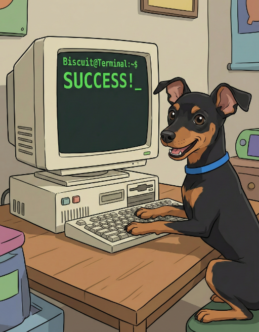

# Biscuit Terminal

<table>
  <tr>
    <td></td>
    <td>
      <h2>biscuit-terminal</h2>
      <p>This shared library provides support for working with the terminal:</p>
      <ul>
        <li>terminal <b>metadata</b> (<i>13+ terminal emulators, color depth, light/dark mode, dimensions, font, OS</i>)</li>
        <li>OSC8 links, OSC52 clipboard, and OSC10/11/12 color queries</li>
        <li>multiplex detection for tmux/Zellij plus native WezTerm/Ghostty/Kitty support</li>
        <li>inline image rendering via Kitty/iTerm2 protocols with graceful fallback</li>
        <li>Mermaid diagram rendering (10 diagram types) via mmdc CLI</li>
        <li>color system: BasicColor (16 ANSI), RgbColor, WebColor (148 CSS), Tailwind (22 families × 11 shades)</li>
        <li>composable rendering components: Prose, Table, List, Section, FileSystem, TwoColumn, and more</li>
      </ul>
    </td>
  </tr>
</table>

## The `Terminal` struct

While this library provides plenty of useful utility functions, the `Terminal` struct is a great starting point as it brings a lot of the capabilities into focus in one type-safe way.

```rust
use biscuit_terminal::prelude::*;

let term = Terminal::new();
```

This simple code block give you access to key global information. The `Terminal` properties represent **static**/non-changing aspects of the terminal whereas there are many other methods which will probe aspects to the terminal which can be changing over time.

### Static Discovery

```rust
use biscuit_terminal::prelude::*;
let term = Terminal::new();

// the name of the terminal app being used (e.g., WezTerm, Ghostty, etc.)
let app = term.app.clone();
// `ColorDepth` enum describing the color depth the terminal supports
let color_depth = term.color_depth.clone();
// boolean flag indicating whether the terminal supports OSC8 based links
let osc_link_support = term.osc_link_support;
// boolean flag indicating whether the terminal is a TTY terminal
let is_tty = term.is_tty;
// whether or not the terminal supports the rendering of italic characters
let supports_italic = term.supports_italic;
// the kinds of underlines supported and whether colored underlines are supported
let underline_support = term.underline_support;
// what type of image support the terminal provides (if any)
let image_support = term.image_support.clone();
// the operating system this terminal is running in
let os = term.os;
// the distro this terminal is running in (if in a Linux OS)
let distro = term.distro.clone();
// the configuration file used to configure the App's exposed settings
let config_file = term.config_file.clone();
// whether running in a CI environment
let is_ci = term.is_ci;
```


> **Note:** the code example is just illustrative, actually cloning each individual property of a terminal is nonsensical.

### Dynamic Discovery

While certain things, like a terminal's background color, don't change often they _can_ change and therefore there is another whole set of terminal metadata which is provided via function calls:

```rust
use biscuit_terminal::prelude::*;
use biscuit_terminal::discovery::osc_queries::{text_color, bg_color, cursor_color};
use biscuit_terminal::discovery::clipboard::{osc52_support, set_clipboard, get_clipboard};

let term = Terminal::new();

// the width of the terminal (in characters)
let width = term.width();
// the height of the terminal pane (in rows)
let height = term.height();
// the color mode (light/dark) this terminal is using
let color_mode = Terminal::color_mode();

// The default text color (OSC10). Standalone function, not a Terminal method.
let fg = text_color();
// The default background color (OSC11).
let bg = bg_color();
// The cursor color (OSC12).
let cursor = cursor_color();

// Clipboard support is via standalone functions in discovery::clipboard
let has_clipboard = osc52_support();
let clipboard_contents = get_clipboard(); // always returns None; use platform crates to read
```

### Terminal Builder

For testing or overriding detected capabilities, use the builder pattern:

```rust
use biscuit_terminal::prelude::*;
use biscuit_terminal::discovery::detection::{ImageSupport, ColorDepth};

let term = Terminal::builder()
    .is_tty(true)
    .image_support(ImageSupport::Kitty)
    .color_depth(ColorDepth::TrueColor)
    .build();
```


## Image Rendering Architecture

All `TerminalImage` rendering is string-based — `render()`, `render_optimistic()`, and `render_to_terminal()` return escape sequences as composable strings. `render_to_terminal()` uses save/restore cursor positioning and explicit row advancement by computed image height, then normalizes to column 0 with a trailing carriage return (`\r`). It usually avoids trailing newlines, but may append one line feed when bottom-of-screen scroll compensation is needed. Kitty protocol sequences include `q=2` (quiet mode) to suppress terminal responses that would otherwise appear as garbage text.

## Rendering to the Terminal

Beyond _discovery_ this crate plays an active role in helping callers to write to the terminal in a rich manner. This is achieved in part by the `Compose` struct and the `Renderable` trait:

- `Compose` struct

    Allows for the composition of one or more _renderable_ blocks.

- `Renderable` trait

    A struct which implements the `Renderable` trait must provide a `render() -> String` function. With this assurance, all renderable structs can be reduced to a string thereby making them _composable_.

### Renderable Components

The following renderable _components_ are provided in this library:

- `Prose`
- `TextBlock`
- `Section`
- `BlockQuote`
- `Compose`
- `Table`
- `UnorderedList`
- `OrderedList`
- `TwoColumn`
- `Todo`
- `Progress`
- `TerminalImage`
- `FileSystem`
- `InlineContent`

In the following sections we'll cover each in more detail.

### `Prose` struct

The `Prose` struct allows for plain text to be parsed for two token types:

1. Atomic Tokens (e.g., `{{red}}`, `{{bold}}`, `{{reset}}`, etc.)
2. Block Tokens (e.g., `<i>italics</i>`, `<b>bold</b>`, etc.)

These tokens are defined in the documentation for the struct but in a nutshell they are both ways to indicate styling (color, bold, dim, italics, etc.) within the body of the text. Both foreground and background colors are supported via web color names, Tailwind palette, and RGB values. When the `Prose` **render** function is called it will replace these tokens with the appropriate escape codes to achieve the desired effect.

### `TextBlock` struct

The `TextBlock` struct is a block of text which the caller wants to have styled uniformly across the text. It uses a builder pattern to define what the escape codes which should _wrap_ the text are.

```rust
let heading = TextBlock::new("This is my heading")
    .using_bold_text()
    .with_foreground_color(Color::BasicColor(BasicColor::Blue))
    .with_background_color(Color::Web(WebColor::HoneyDew))
    .with_underline(UnderliningRequest::Dotted);
```

### `Currency` enum

The `Currency` enum in `table/types.rs` defines currency symbols for use with `Table` column formatting. It is not a standalone renderable component.

### `Table` struct

Of all the components offered, the `Table` struct is the most complex and is documented in `./lib/src/components/table/README.md`. It provides width-aware column sizing, per-column alignment/wrapping rules, and terminal-aware rendering.

### Lists: `UnorderedList` and `OrderedList`

Both list structs are represented by a 1:M _elements_ where the elements are any _renderable_ element. They are, however, most typically either a `String` (the text of an element) or another list struct (to achieve nesting).


## The `bt` CLI

While this package is mainly about providing terminal capabilities to other libraries, it also includes a CLI (`bt`) for terminal inspection, styled text rendering, directory trees, and Mermaid diagram generation. It supports 16 commands including `image`, `prose`, `quote`, `list`, `columns`, `dir`, `flowchart`, `quadrant`, `pie-chart`, `git-graph`, `bar-chart`, `line-chart`, `timeline`, `state-diagram`, and `erd`.

See [`cli/README.md`](./cli/README.md) for full documentation.
